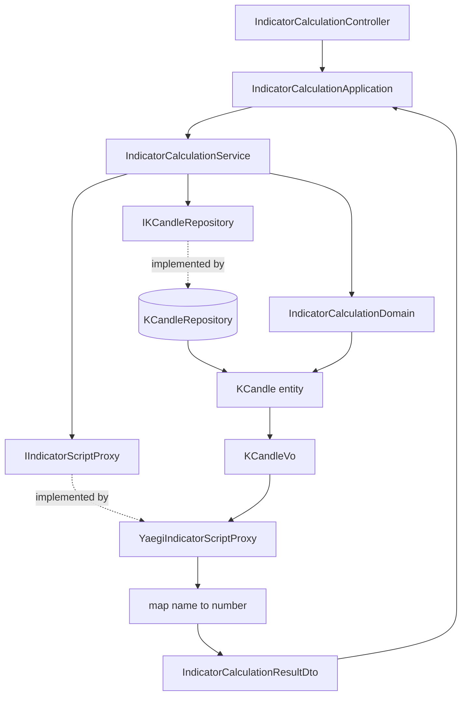

# 自訂指標計算 — Architecture Design

**Status:** Confirmed
**Source PRD:** `.sdd/2026-08-29-indicator-calculation/PRD.md`
**Tech context:** Go 1.26 · Gin · GORM (Code First) · PostgreSQL · Clean / Onion Architecture · uber-go/mock · **traefik/yaegi**（新增）

---

## 1. Design Goal & Guiding Principle

- **In one sentence:**
  收下 `(交易標的, 計算根數, 指標算式)`，取該標的**最新一根以外**、由早到晚的指定根數 K 線，
  執行算式，並把輸出統一收成 `map[string]float64`。

- **Guiding principle:**
  **「執行外來算式」這件事整個關在一個介面後面。**
  `IIndicatorScriptProxy` 是唯一知道算式怎麼被跑的地方；domain 與 application 不認識 yaegi，
  也不認識任何直譯器概念。換引擎、換語言、改成獨立行程，都只換一個實作。
  規則同樣各有唯一的家：**一次計算請求的規則**（根數、排除最新一根、足量）在
  `IndicatorCalculationDomain`，**算式的執行與防護**在 proxy，兩者不重疊。

---

## 2. Change Scope

| Area | Action | What / Why |
| :--- | :--- | :--- |
| `internal/domain/interface/i_k_candle_repository.go` | **Modify** | 新增 `FindLatest(symbol, limit)`。既有方法只能給時間區間或指名單一根，撈不到「最新 N 根」，而這正是本功能的取用方式 |
| `internal/infrastructure/persistence/k_candle_repository.go` | **Modify** | 實作 `FindLatest`：依起始時間**由新到舊**排序後取前 N 筆 |
| `internal/domain/models/entities/k_candle.go` | **Modify** | 新增 `ToVo()`，把記錄轉成算式看得到的形狀（含精確小數轉一般數字）。與既有 `ToDto()` 同性質的資料形狀轉換，不含業務規則 |
| `cmd/server/dependencies.go` | **Modify** | 組裝指標計算各層並註冊一條新路由；`KCandleQueryMaxResults` 一值兩用 |
| `README.md` | **Modify** | 補上新路由與算式的寫法 |
| `internal/domain/models/domains/indicator_calculation_domain.go` | **Add** | 一次計算請求的規則 |
| `internal/domain/models/domains/indicator_calculation_errors.go` | **Add** | 兩個哨兵錯誤 |
| `internal/domain/models/vo/k_candle_vo.go` | **Add** | 算式看得到的 K 線形狀 |
| `internal/domain/models/dto/indicator_calculation_request_dto.go` / `..._result_dto.go` | **Add** | 進出 domain 的形狀 |
| `internal/domain/service/indicator_calculation_service.go` | **Add** | 用例入口 |
| `internal/domain/interface/i_indicator_script_proxy.go` | **Add** | 執行算式的能力契約 |
| `internal/infrastructure/script/yaegi_indicator_script_proxy.go` | **Add** | 以 yaegi 實作，含白名單與 panic 攔截 |
| `internal/application/indicator_calculation_application.go` | **Add** | 用例編排 |
| `internal/controller/indicator_calculation_controller.go` | **Add** | 請求解析與狀態碼對映 |
| **資料庫 schema** | **Not touched** | 指標結果不留存，**不新增任何資料表**；`schema_migrator.go` 與 migrate 指令完全不動 |
| **設定** | **Not touched** | 單次最大根數**沿用** `KCANDLE_QUERY_MAX_RESULTS`，不新增環境變數 |
| `KCandleService` / `KCandleApplication` / `KCandleController` | **Not touched** | 指標計算直接依賴 `IKCandleRepository`，不跨 domain service 呼叫 |
| `/health`、`cmd/migrate` | **Not touched** | 與本功能無關 |

---

## 3. New Classes / Modules

| Name | Kind | Responsibility (purpose) | Collaborators | Satisfies (PRD scenario) |
| :--- | :--- | :--- | :--- | :--- |
| `IndicatorCalculationDomain` | Domain Model | 保護**一次計算請求自身的不變量**：計算根數大於零、不超過單次可用的最大根數。並持有本功能最核心的兩條取用規則：**排除最新一根**、**可用根數是否足夠**（不足時報出實際可用幾根） | `KCandle`、`KCandleVo` | US-01 前三個；US-02 全部六個 |
| `KCandleVo` | VO | 算式看得到的 K 線形狀：交易標的、起始時間（Unix 秒數）與八個一般數字。不可變、無行為 | — | US-01 全部 |
| `IIndicatorScriptProxy` | Interface | **執行一段指標算式**並收回一組「名稱 → 數字」。以能力命名，不綁任何引擎 | — | US-01 後四個；US-03 全部三個 |
| `YaegiIndicatorScriptProxy` | Proxy | 以 yaegi 實作上述契約。負責：把 `KCandleVo` 型別匯出給算式、**只開放白名單運算**、取出算式入口並呼叫、把 panic 與型別不符一律轉成可讀的錯誤 | `KCandleVo` | 同上 |
| `IndicatorCalculationService` | Domain Service | 唯一入口 `CalculateIndicator`：建構請求 domain model（驗根數）→ 取最新 `根數+1` 根 → 交由 domain model 排除最新一根並檢查足量 → 交給 proxy 執行 → 轉成 DTO | `IKCandleRepository`、`IIndicatorScriptProxy`、`IndicatorCalculationDomain` | 全部 16 個 |
| `IndicatorCalculationApplication` | Application | 用例編排。單一方法，一次呼叫 service，回傳 DTO | `IndicatorCalculationService` | 全部 |
| `IndicatorCalculationController` | Controller | 解析請求內文成 DTO；依哨兵錯誤對映狀態碼 | `IndicatorCalculationApplication` | 全部 |
| `IndicatorCalculationRequestDto` | DTO | 進 domain 的形狀：交易標的、計算根數、指標算式 | — | 全部 |
| `IndicatorCalculationResultDto` | DTO | 出 domain 的形狀：交易標的、實際使用根數、一組「名稱 → 數字」 | — | US-01 後四個 |
| `IndicatorCalculationRequest` | Request | 端點接收的 JSON 內文，宣告於 controller 同檔 | — | 全部 |
| `ErrIndicatorCalculationValidation` / `ErrIndicatorScriptFailed` | 哨兵錯誤 | 前者＝**請求本身不對**（根數、可用根數）；後者＝**算式跑不動**（無法解讀、執行失敗、越權）。宣告於 `domains` 套件，與 K 線的哨兵錯誤同址（domain model 需回傳它們，放 service 會造成循環相依） | — | US-02、US-03 |

**刻意不建立的類別**

- **沒有 `IndicatorResultDomain`。** 「重複名稱後蓋前」是 `map` 的天生行為，「空結果合法」是不做檢查，
  兩者都不需要程式碼。為它開一個類別會得到一個沒有行為的空殼。
- **沒有 `IndicatorCalculationRepository`。** 結果不留存。

**Depth check（deep-module 診斷）**

- 應用層完成計算**只呼叫一次** `CalculateIndicator`，不需要依序呼叫多個方法 → 非淺模組。
- 呼叫端**不需要知道哪一個子步驟失敗**：所有請求問題統一為 `ErrIndicatorCalculationValidation`，
  所有算式問題統一為 `ErrIndicatorScriptFailed`，訊息說明細節。
- `IIndicatorScriptProxy` 只有一個方法、兩個參數；把「型別匯出、白名單、入口查找、panic 攔截」
  四件複雜的事全部藏在後面 → 深度明顯為正。
- 參數不會逐季膨脹：新增輸入由 `IndicatorCalculationRequestDto` 吸收，方法簽章不變。

---

## 4. Modified Components

| Component | Current role | Change needed |
| :--- | :--- | :--- |
| `IKCandleRepository` | K 線的持久化契約（`Save` / `Update` / `FindOne` / `FindInRange` / `Delete`） | 新增 `FindLatest(symbol string, limit int) ([]entities.KCandle, error)`，**依起始時間由新到舊**回傳最多 limit 筆。順序刻意與 `FindInRange`（由早到晚）相反，因為「最新 N 根」天生是倒序查詢；順序寫進介面註解，由 domain model 負責翻正 |
| `KCandleRepository` | 以 GORM 實作上述契約 | 實作 `FindLatest`：等值條件 + 起始時間遞減排序 + 筆數限制，全走型別安全的條件與排序 API |
| `KCandle`（entity） | 乾淨資料模型，已有 `TableName()` 與 `ToDto()` | 新增 `ToVo()`：轉成算式看得到的形狀。精確小數以「不精確轉換」變成一般數字，起始時間轉為 Unix 秒數。維持不放業務規則 |
| `registerRoutes`（組裝根） | 掛載健康檢查與五條 K 線路由 | 建構 `YaegiIndicatorScriptProxy` → `IndicatorCalculationService`（注入既有的 `KCandleRepository` 與 `KCandleQueryMaxResults`）→ Application → Controller，並掛上一條新路由 |

**路由設計**

| Method | Path | 用途 |
| :--- | :--- | :--- |
| `POST` | `/indicator-calculations` | 執行一次指標計算 |

內文：`{ "symbol": "BTCUSDT", "candleCount": 30, "script": "..." }`
回應：`{ "symbol": "BTCUSDT", "usedCandleCount": 30, "values": { "ma": 105.2 } }`

用 `POST` 而非 `GET`，因為算式是一段可能很長的內容，不適合放在網址上。
語意上這是「執行一次計算」而不是「取一份資源」。

**狀態碼對映**

| 情況 | 哨兵錯誤 | 狀態碼 | 理由 |
| :--- | :--- | :--- | :--- |
| 根數不大於零、超過上限、可用根數不足 | `ErrIndicatorCalculationValidation` | `400` | **你送的參數不對** |
| 算式無法解讀、執行失敗、試圖越權 | `ErrIndicatorScriptFailed` | `422` | **參數沒問題，但你的算式跑不動** |
| 內文無法解析 | —（controller 自行判斷） | `400` | 同上第一類 |
| 資料存放處讀取失敗 | 其他錯誤 | `502` | 不是呼叫端的問題 |
| 計算成功（含空的指標結果） | — | `200` | 空結果是成功，不是失敗 |

兩個哨兵錯誤分兩個狀態碼，是為了讓策略程式**分得出「我傳錯參數」與「我的算式壞了」**，
不必去讀訊息內容。

---

## 5. Component Relationships

**執行順序**

1. `IndicatorCalculationDomain` 建構：驗計算根數（大於零、不超過上限）。
2. `IKCandleRepository.FindLatest(交易標的, 計算根數 + 1)`：由新到舊取回。
3. `IndicatorCalculationDomain.SelectInputCandles(...)`：**丟掉第一筆（最新一根）**，
   翻正成由早到晚，檢查剩餘筆數是否足夠；不足即報出實際可用幾根。
4. `IIndicatorScriptProxy.Execute(算式, K 線)`：執行並收回一組「名稱 → 數字」。
5. 組成 `IndicatorCalculationResultDto` 回傳。

---

## 6. Extensibility & Handoff Notes

- **Most likely next requirement:**
  **把算式存起來、給它名字、之後重複使用。** PRD 已明白寫出這是確定要做的下一步。

- **Where it lands:**
  **Application 層。** 算式在設計上是「請求 DTO 裡的一個字串」，不是 service 的固有結構。

- **How to add it:**
  1. 新增一個「具名指標」entity 與它的 repository（存名稱與算式內容）。
  2. 新增一個 application 方法：先用名稱查出算式字串，再組成
     `IndicatorCalculationRequestDto` 呼叫**同一個** `CalculateIndicator`。
  3. **`IndicatorCalculationService`、`IndicatorCalculationDomain`、
     `IIndicatorScriptProxy` 一行都不用改。**

- **Patterns applied & why:**
  - **能力介面隔離外來執行**（`IIndicatorScriptProxy`）：唯一目的是讓「怎麼跑算式」
    可以整個換掉，而不是為了裝飾。這也是讓 domain 不碰第三方 SDK 的必要手段。
  - **請求規則收進 Domain Model**：「排除最新一根」與「足量檢查」是本功能最容易被寫散的兩條規則，
    刻意放在同一個物件上，未來要改「排除幾根」只有一個地方。
  - **刻意不抽指標種類的策略**：均價、相對強弱、指數平滑都是**資料**（算式字串），不是型別。
    為它們建立策略階層會是把資料誤當成型別的典型錯誤。

- **Do not hardcode:**
  - **單次最大根數**——一律取自設定，不得在 service 或 domain model 寫死。
  - **排除的根數（目前為 1）**——只能出現在 `IndicatorCalculationDomain` 裡的那一個常數。
  - **白名單**——算式可用的運算只能在 `YaegiIndicatorScriptProxy` 一處定義，
    不得散落；新增可用運算就是往那份白名單加一筆。

- **Known debt / deferred:**
  - **沒有執行時間上限**（使用者明確選擇）。一支算不完的算式會佔住該次請求不放。
    **該重看的訊號**：第一次因為算式卡住而必須重啟服務。
  - **逐根數列輸出沒有預留縫。** 要畫線就得改 `IIndicatorScriptProxy` 的回傳型別。
    現在不預留，因為 PRD 明列為 Out of Scope，先做等於臆測。
    **該重看的訊號**：出現第一個「我要畫這條指標線」的需求。
  - **白名單是唯一防線。** yaegi 不是安全沙箱；擋得住是因為算式 import 不到沒被開放的東西。
    **該重看的訊號**：這個服務不再只有本人能碰的時候。
  - **精確小數轉一般數字有損。** 轉換點只有 `KCandle.ToVo()` 一處，日後要改精度從那裡開始。

---

## 7. Traceability

| PRD Scenario | Fulfilled by |
| :--- | :--- |
| **US-01** 取指定根數的 K 線，並排除尚未走完的最新一根 | `IndicatorCalculationDomain.SelectInputCandles`（丟掉最新一根並翻正順序）+ `IKCandleRepository.FindLatest` |
| **US-01** 只取一根時同樣排除最新一根 | 同上 |
| **US-01** 可用根數剛好足夠 | `IndicatorCalculationDomain.SelectInputCandles`（足量檢查的邊界） |
| **US-01** 算式產出單一個指標數值 | `IIndicatorScriptProxy.Execute` + `IndicatorCalculationResultDto` |
| **US-01** 算式產出多個指標數值 | 同上 |
| **US-01** 算式什麼都沒放進結果 | `IndicatorCalculationService.CalculateIndicator`（空結果視為成功，不做非空檢查） |
| **US-01** 同一個指標名稱被放兩次 | `YaegiIndicatorScriptProxy`（回傳型別天生一名一值，後放覆蓋先放） |
| **US-02** 可用根數遠少於要求 | `IndicatorCalculationDomain.SelectInputCandles` → `ErrIndicatorCalculationValidation`（訊息帶實際可用根數） |
| **US-02** 可用根數只差一根 | 同上（邊界） |
| **US-02** 只有一根 K 線 | 同上（可用 0 根） |
| **US-02** 該交易標的完全沒有 K 線 | 同上（可用 0 根；`FindLatest` 回空切片） |
| **US-02** 根數不大於零 | `IndicatorCalculationDomain` 建構子 → `ErrIndicatorCalculationValidation`；不觸及儲存與算式 |
| **US-02** 根數超過單次可用的最大根數 | 同上（上限取自設定） |
| **US-03** 算式寫得不完整而無法解讀 | `YaegiIndicatorScriptProxy`（解讀失敗）→ `ErrIndicatorScriptFailed` |
| **US-03** 算式在計算過程中失敗 | `YaegiIndicatorScriptProxy`（攔截執行期中斷）→ `ErrIndicatorScriptFailed`，不回任何部分結果 |
| **US-03** 算式試圖取用 K 線以外的資料 | `YaegiIndicatorScriptProxy`（白名單未開放該項，解讀階段即失敗）→ `ErrIndicatorScriptFailed` |

---

## 8. Risks & Open Decisions

**Risks / trade-offs**

- **yaegi 不是安全沙箱。** 防護完全靠「只開放白名單」。這是本設計最脆弱的一點，
  可接受的唯一理由是自架、僅本人使用、未對外開放。
- **沒有執行時間上限。** 使用者明確選擇。單次最大根數是唯一的緩衝，擋得住大量資料，
  擋不住無窮迴圈。
- **算式的時間欄位是 Unix 秒數而非時間型別。** 這是為了**不開放時間套件**——
  開放了就等於開放取得當下時間，會直接打破「同一批 K 線跑兩次結果必須相同」。
  代價是算式裡處理時間比較不直觀。
- **指標數值是一般數字。** 由精確小數轉換而來，有精度損失。指標是統計量不是金額，可接受；
  轉換只發生在一處，日後好改。
- **`FindLatest` 的排序方向與 `FindInRange` 相反。** 這是最容易踩到的地方，
  以介面註解與測試同時把它釘住。
- **修改既有介面會牽動既有的替身。** `IKCandleRepository` 新增方法後，既有的替身需重新產生；
  既有 K 線測試不受影響，但重新產生這一步不能忘。

**Open decisions（留給實作階段解決）**

- 白名單除了數學運算，是否要開放排序與切片處理（許多指標需要排序求中位數）。
- 算式的入口名稱是否固定為 `Calculate`，或允許使用者指定。
- 是否需要限制算式本身的長度。
- 交易標的為空字串時的處理：沿用 K 線既有的「必須指定交易標的」規則，或視為查無資料而回可用 0 根。
  建議沿用既有規則，實作時確認。
- `usedCandleCount` 是否需要出現在回應中（設計上保留，因為它讓呼叫端確認實際用了幾根）。
