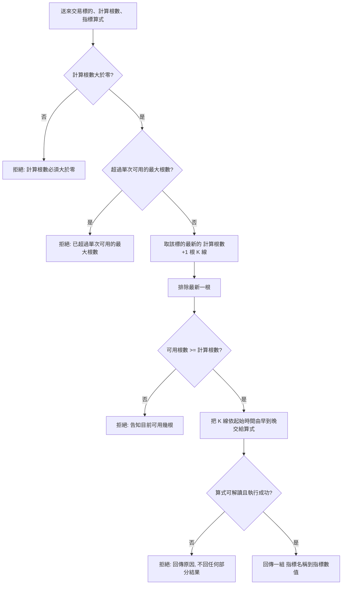

# 自訂指標計算 — Product Requirements Document (PRD)

**Feature:** 自訂指標計算
**Status:** Draft
**Version:** v1.0
**Owner:** James Hsueh
**Stakeholders:** 專案維護者本人

---

## 1. Background & Goal (Why & Goal)

- **Problem Statement:**
  系統存得下 K 線，卻算不出任何指標。若每加一個指標就要動一次系統，指標永遠追不上想法。
  更棘手的是**不同指標的輸出長得不一樣**——均價一個數字、指數平滑三個、布林通道三條線——
  沒有一個共同的形狀，就沒辦法把它們存起來、比較、或拿來做後續判斷。

- **Expected Outcome:**
  使用者自己寫一段指標算式送進來，系統取指定根數的 K 線交給它執行，
  並把結果統一收成**一組「指標名稱 → 指標數值」**。
  加新指標從此不需要動系統，只要換一段算式。本階段不設速度或資料量目標。

- **Out of Scope:**
  - 把算式**存起來、給它名字、之後重複使用**——確定要做，但屬於下一個階段。
  - 指標結果的保存與歷史查詢（本階段算完直接回傳，不留下任何紀錄）。
  - 由指標數值推導買賣訊號或任何操作建議。
  - 一次對多個交易標的計算。
  - 每根 K 線各產出一個值的逐根輸出（畫線用）。
  - 指定基準時間回頭計算過去某個時點。
  - 指標算式的版本管理、分享或權限控管。
  - 讓使用者自行調整單次計算的允許時間（允許時間是全系統設定，不是每次計算的參數）。

---

## 2. User Personas

- **Primary Role(s):**
  - **專案維護者本人** —— 撰寫並試算指標算式，是本階段唯一會手寫算式的人。
  - **策略程式** —— 後續接上的自動化程式，帶著一段固定的算式定期取得指標數值來運算。

- **Usage Context:**
  沒有任何畫面，全部以程式呼叫的方式互動，執行於自架環境。
  維護者的操作是低頻、探索式的：寫一段算式、跑一次、看結果、改一改再跑。
  策略程式則是重複帶同一段算式定期呼叫。

---

## 3. User Stories & Acceptance Criteria

### US-01 — [priority: P0]
**As a** 專案維護者或策略程式，**I want** 自己寫一段算式，讓系統用指定根數的 K 線算出指標，
**so that** 我要新的指標時只要換算式，不必動到系統本身。

```gherkin
Scenario: 取指定根數的 K 線，並排除尚未走完的最新一根
  Given BTCUSDT 有起始時間 09:00、09:05、09:10、09:15 的四根 K 線
  When 要求用 3 根 K 線執行算式
  Then 算式拿到起始時間 09:00、09:05、09:10 的三根 K 線，依序由早到晚
  And 最新的 09:15 那一根不在其中

Scenario: 只取一根時同樣排除最新一根
  Given BTCUSDT 有起始時間 09:00、09:05、09:10、09:15 的四根 K 線
  When 要求用 1 根 K 線執行算式
  Then 算式拿到起始時間 09:10 的一根 K 線

Scenario: 可用根數剛好足夠
  Given BTCUSDT 只有起始時間 09:00、09:05、09:10 的三根 K 線
  When 要求用 2 根 K 線執行算式
  Then 算式拿到起始時間 09:00、09:05 的兩根 K 線

Scenario: 算式產出單一個指標數值
  Given 交給算式的三根 K 線收盤價依序為 100、110、120
  When 算式求這三根的平均收盤價
  Then 回傳一組指標結果，其中「均價」為 110

Scenario: 算式產出多個指標數值
  Given 交給算式的三根 K 線收盤價依序為 100、110、120
  When 算式同時求最高與最低收盤價
  Then 回傳一組指標結果，其中「最高」為 120
  And 其中「最低」為 100

Scenario: 算式什麼都沒放進結果
  When 算式沒有把任何指標數值放進結果
  Then 回傳一組空的指標結果
  And 這不視為錯誤

Scenario: 同一個指標名稱被放兩次
  When 算式先把「均價」放成 100，再把「均價」放成 120
  Then 回傳的指標結果中「均價」為 120
  And 「均價」在結果中只出現一次
```

### US-02 — [priority: P0]
**As a** 專案維護者或策略程式，**I want** 在 K 線不夠或根數不合理時被明確擋下並告知實情，
**so that** 我不會拿到一個用錯資料量算出來、看起來卻很正常的指標數值。

```gherkin
Scenario: 可用根數遠少於要求
  Given BTCUSDT 共有 10 根 K 線
  When 要求用 30 根 K 線執行算式
  Then 計算被拒絕，並告知目前可用 9 根
  And 算式完全沒有被執行

Scenario: 可用根數只差一根
  Given BTCUSDT 共有 3 根 K 線
  When 要求用 3 根 K 線執行算式
  Then 計算被拒絕，並告知目前可用 2 根

Scenario: 只有一根 K 線
  Given BTCUSDT 只有 1 根 K 線
  When 要求用 1 根 K 線執行算式
  Then 計算被拒絕，並告知目前可用 0 根

Scenario: 該交易標的完全沒有 K 線
  Given ETHUSDT 沒有任何 K 線
  When 要求用 5 根 K 線執行算式
  Then 計算被拒絕，並告知目前可用 0 根

Scenario: 根數不大於零
  When 要求用 0 根 K 線執行算式
  Then 計算被拒絕，並告知計算根數必須大於零

Scenario: 根數超過單次可用的最大根數
  Given 單次可用的最大根數為 1000
  When 要求用 5000 根 K 線執行算式
  Then 計算被拒絕，並告知已超過單次可用的最大根數
```

### US-03 — [priority: P0]
**As a** 專案維護者，**I want** 算式有問題時整次計算被拒絕並拿到看得懂的原因，
**so that** 我知道要改的是算式，而且不會誤把半成品當成指標數值。

```gherkin
Scenario: 算式寫得不完整而無法解讀
  Given 一段無法解讀的算式
  When 執行計算
  Then 計算被拒絕，並回傳指出算式無法解讀的原因

Scenario: 算式在計算過程中失敗
  Given 一段會除以零的算式
  When 執行計算
  Then 計算被拒絕，並回傳指出算式執行失敗的原因
  And 不回傳任何部分的指標結果

Scenario: 算式試圖取用 K 線以外的資料
  Given 一段試圖讀取檔案或連上外部服務的算式
  When 執行計算
  Then 計算被拒絕，並告知算式只能做純運算

Scenario: 算式永遠算不完
  Given 允許的計算時間為四十秒
  And 一段永遠算不完的算式
  When 執行計算
  Then 計算在四十秒後被中止
  And 計算被拒絕，並告知算式未能在允許時間內算完
  And 不回傳任何部分的指標結果
```

---

## 4. Business Flow & Logic

**Flow Diagram:**



**Core Business Rules:**

- **排除規則**：每次計算一律排除該交易標的**最新的一根** K 線，因其涵蓋的五分鐘尚未走完。
- **取用規則**：從最新往回數，取出計算根數所需的 K 線，依起始時間**由早到晚**交給算式。
  算式看得到每根 K 線的完整內容：交易標的、起始時間、開盤價、最高價、最低價、收盤價、
  成交量、成交額、主動買入量、主動買入額。
- **根數規則**：計算根數必須大於零，且不得超過**單次可用的最大根數**
  （與單次查詢筆數上限共用同一個設定）。
- **足量規則**：排除最新一根後的可用根數少於計算根數時，拒絕計算並告知實際可用幾根；
  算式完全不執行。
- **結果規則**：指標結果一律是**一組「指標名稱 → 指標數值」**，放幾個由算式決定。
  空的結果是合法結果。同一個名稱被放兩次時，**後放的覆蓋先放的**，結果中只出現一次。
- **純運算規則**：算式只能用基本四則運算、比較、重複計算、排序，以及常用的數學運算
  （開根號、對數、次方、絕對值、極大值、極小值）。不得取用 K 線以外的資料、
  當下時間或任何隨機值——同一批 K 線跑兩次，結果必須完全相同。
- **時限規則**：算式的執行有允許時間（預設四十秒）。超過即中止並拒絕整次計算。
- **失敗規則**：算式無法解讀、執行失敗、超過允許時間、或試圖取用不該取用的東西，
  一律拒絕整次計算並說明原因，且**不回傳任何部分結果**。

**Edge Cases:**

- **K 線在區間內不連續（中間缺根）** —— 有幾根算幾根，系統不補洞、不告警；
  只要可用根數足夠就照常執行。
- **算式永遠算不完** —— 超過允許時間即中止，該次計算被拒絕並告知逾時；
  被放棄的算式不會繼續佔用資源。
- **指標數值為零或負數** —— 合法。指標不是金額，負值有意義（例如指數平滑的柱狀值）。
- **同一批 K 線重複計算** —— 結果必須完全相同；算式不得有任何隨每次執行而變的來源。
- **資料存放處無法讀取時** —— 該次計算視為失敗並說明原因，不得回傳看似成功的空結果。

---

## 5. UI/UX Design & Interaction

**N/A** —— 本功能沒有任何畫面，全部以程式呼叫的方式使用。

與呈現相關、但屬於回應內容而非畫面的約定：

- 可用根數不足時，訊息必須說出**實際可用幾根**，而不只是「資料不足」；
  並說明該數字是**排除最新一根之後**的結果。
- 算式失敗時，訊息必須讓寫算式的人看得出是算式的哪裡出問題。
- 空的指標結果與「計算失敗」必須明確區分：前者是成功，後者是拒絕。

---

## 6. Non-Functional Requirements

- **Performance:** 本階段不設定整體回應時間目標。單次計算受兩個限制：
  **可用的最大根數**（與單次查詢筆數上限共用設定）與**算式的允許時間**（預設四十秒）。
- **Security:** 系統會執行由使用者提供的算式。防線是**限制算式能用到的東西**：
  只有純運算，不得取用檔案、外部服務、當下時間或隨機值。
  本階段仍無身分驗證與權限控管。
- **Compatibility:** N/A（沒有畫面）。
- **Analytics / Tracking:** N/A。

---

## 7. Dependencies & Risks

**External Dependencies:**

- 依賴既有的 K 線資料：沒有 K 線就算不出指標，而 K 線是否齊全取決於餵入者。
- 依賴既有的單次查詢筆數上限設定，本功能與其共用。

**Known Risks:**

- **執行不是自己寫的東西** —— 這是本功能的本質。防線只有「限制算式能用到的東西」這一道。
  可接受的理由是：自架環境、僅本人使用、且沒有對外開放。
  一旦這個服務讓別人碰得到，這道防線就不夠。
- **允許時間可能不合適** —— 四十秒對指標運算而言相當寬鬆，但一段接近卻未超時的算式
  仍會佔住一個請求四十秒。**該重看的訊號**：出現正常算式被誤砍，或服務被慢算式塞住。
- **資料完整性無人把關** —— 系統不檢查取到的 K 線在時間上是否連續。
  中間缺根時指標照算，但算出來的值會失真，且不會有任何提示。
- **指標數值不做精確小數** —— 指標是統計量而非金額，因此接受一般數字的誤差。
  若日後有指標數值要直接當成金額使用，這個決定要重新檢視。
- **上限共用可能不合適** —— 單次最大根數沿用查詢的設定。
  查詢想調小、但指標想吃更多根時，兩者會互相牽制。

---

## 8. Appendix

- 需求共識文件：`.sdd/2026-08-29-indicator-calculation/BRIEF.md`
- 通用語言地圖：`.sdd/UL-MAP.md`
- 前一個切片（K 線的存取與查詢）：`.sdd/2026-08-29-k-candle-management/PRD.md`
