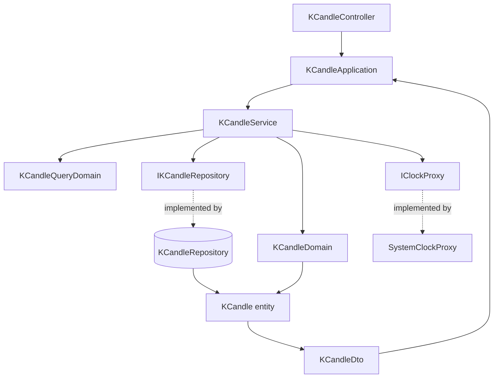

# K 線資料管理 — Architecture Design

**Status:** Confirmed
**Source PRD:** `.sdd/2026-08-29-k-candle-management/PRD.md`
**Tech context:** Go 1.26 · Gin · GORM (Code First) · PostgreSQL · Clean / Onion Architecture · uber-go/mock

---

## 1. Design Goal & Guiding Principle

- **In one sentence:**
  讓一根 K 線能以 `(交易標的, 起始時間)` 為唯一鍵寫入（重複即覆蓋），並能以
  `(交易標的, 時間區間)` 取回一段依起始時間遞增排序、且有筆數上限的清單。

- **Guiding principle:**
  **應用層每個用例只呼叫 `KCandleService` 一次。**
  所有規則檢查、覆蓋策略、排序與筆數上限都封裝在 domain 內部；`KCandleApplication`
  與 `KCandleController` 不含任何「怎麼做」的條件判斷。
  規則各有唯一的家：**一根 K 線自己的規則**在 `KCandleDomain`，**一次查詢的規則**在
  `KCandleQueryDomain`，**覆蓋語意**在 `KCandleRepository`。新增規則時只會動到其中一處。

---

## 2. Change Scope

| Area | Action | What / Why |
| :--- | :--- | :--- |
| `internal/domain/models/entities/k_candle.go` | **Modify** | 補上 `Symbol`、`OpenTime` 兩個欄位與 `(Symbol, OpenTime)` 唯一索引；新增 `ToDto()` 形狀轉換。沒有這兩個欄位，PRD 的查詢與指名操作全部不成立 |
| `internal/config/application_config.go` | **Modify** | 新增 `KCandleQueryMaxResults`（環境變數 `KCANDLE_QUERY_MAX_RESULTS`，預設 `1000`）。PRD 風險章節已指出此上限可能過於保守，不應寫死在程式碼 |
| `cmd/server/dependencies.go` | **Modify** | 組裝 K 線各層並註冊五條路由 |
| `README.md` | **Modify** | 補上新路由、新環境變數與新資料夾 |
| `internal/domain/models/domains/` | **Add** | `KCandleDomain`、`KCandleQueryDomain` |
| `internal/domain/models/dto/` | **Add** | `KCandleDto`、`KCandleWriteDto`、`KCandleQueryDto` |
| `internal/domain/service/` | **Add** | `KCandleService` |
| `internal/domain/interface/` | **Add** | `IKCandleRepository`、`IClockProxy`（各一檔，含 `//go:generate` 指示詞） |
| `internal/infrastructure/persistence/` | **Add** | `KCandleRepository` |
| `internal/infrastructure/clock/` | **Add** | `SystemClockProxy` |
| `internal/application/` | **Add** | `KCandleApplication` |
| `internal/controller/` | **Add** | `KCandleController` |
| `internal/infrastructure/persistence/schema_migrator.go` | **Not touched** | `KCandle` 已註冊於遷移清單；欄位變更由 `AutoMigrate` 自動反映，無須改動此檔 |
| `internal/infrastructure/persistence/database.go` | **Not touched** | 只負責開連線，與本功能無關 |
| `cmd/migrate/main.go` | **Not touched** | 指令本身不變，只是套用後的結構會多兩欄 |
| `/health` 端點 | **Not touched** | 與本功能無關，維持寫在路由註冊處 |
| 批次匯入 / 其他 K 線長度 / 權限 | **Not touched** | PRD 明列 Out of Scope；先不預留架構，見第 6 節 |

---

## 3. New Classes / Modules

| Name | Kind | Responsibility (purpose) | Collaborators | Satisfies (PRD scenario) |
| :--- | :--- | :--- | :--- | :--- |
| `KCandleDomain` | Domain Model | 保護**一根 K 線自身的不變量**：交易標的不得為空、起始時間須落在五分鐘刻度、起始時間不得指向未來、最高價不得低於最低價、所有價量不得為負數。建構子驗證失敗即回錯誤，不存在「半合法」的實例 | `IClockProxy`（以目前時間為參數傳入）、`KCandle` | US-02 全部 7 個；US-04「修改後的數字不合理」 |
| `KCandleQueryDomain` | Domain Model | 保護**一次查詢自身的不變量**：必須指定交易標的、結束時間不得早於開始時間。並持有解析後的區間供 repository 使用 | — | US-01「結束時間早於開始時間」、「未指定交易標的」 |
| `KCandleService` | Domain Service | K 線的五個用例入口：`SaveKCandle` / `GetKCandlesInRange` / `GetKCandle` / `UpdateKCandle` / `DeleteKCandle`。取得 entity、建構 domain model 執行規則、轉成 DTO 回傳。**公開方法彼此不互相呼叫** | `IKCandleRepository`、`IClockProxy`、兩個 domain model | 全部 24 個情境 |
| `IKCandleRepository` | Interface | K 線的持久化契約：`Save`（覆蓋語意）/ `Update` / `FindOne` / `FindInRange` / `Delete` | — | US-02 覆蓋；US-03/04/05 找不到 |
| `KCandleRepository` | Repository | 以 GORM 實作上述契約。`Save` 以 `(symbol, open_time)` 衝突時整筆更新達成覆蓋；`FindInRange` 依起始時間遞增排序並套用上限；`Update`/`Delete` 影響列數為 0 時回報找不到 | `*gorm.DB`、`KCandle` | 同上 |
| `IClockProxy` | Interface | 取得目前時間的能力（`Now() time.Time`）。抽出來的唯一理由是讓「起始時間不得指向未來」可被測試 | — | US-02「起始時間指向未來」 |
| `SystemClockProxy` | Proxy | 以系統時鐘實作 `IClockProxy` | — | 同上 |
| `KCandleApplication` | Application | 用例編排。每個方法只呼叫 `KCandleService` 一次並回傳 DTO，全程不碰 entity 與 domain model | `KCandleService` | 全部 |
| `KCandleController` | Controller | 解析路徑參數、查詢字串與請求內文成 DTO；依 domain service 的哨兵錯誤對映狀態碼 | `KCandleApplication` | 全部 |
| `KCandleDto` | DTO | domain 回傳給 application 的唯一形狀（含交易標的、起始時間與八個價量數字） | — | 全部讀取類情境 |
| `KCandleWriteDto` | DTO | 新增與修改的輸入形狀 | — | US-02、US-04 |
| `KCandleQueryDto` | DTO | 區間查詢的輸入形狀（交易標的、起訖時間） | — | US-01 |
| `KCandleRequest` | Request | 端點接收的 JSON 內文形狀，宣告於 controller 同檔 | — | US-02、US-04 |

**Depth check（deep-module 診斷）**

- 應用層完成任一業務動作**只呼叫一次** service，不需要依序呼叫多個方法 → 非淺模組。
- 呼叫端**不需要知道哪一個子步驟失敗**才能正確處理：所有規則失敗統一包成
  `ErrKCandleValidation`（訊息說明是哪條規則），找不到統一為 `ErrKCandleNotFound`。
- 參數不會逐季膨脹：新增欄位由 DTO 吸收，service 方法簽章不變。
- `KCandleService` 的公開介面（5 個方法）明顯小於其內部邏輯 → 深度為正。

---

## 4. Modified Components

| Component | Current role | Change needed |
| :--- | :--- | :--- |
| `KCandle`（entity） | 只有八個價量欄位與流水號的乾淨資料模型 | 新增 `Symbol string`、`OpenTime time.Time`；於 `(Symbol, OpenTime)` 建立唯一索引；新增 `ToDto()`（資料形狀轉換，不含業務邏輯）。維持不放任何業務規則 |
| `ApplicationConfig` | 讀取服務埠號與資料庫連線設定 | 新增 `KCandleQueryMaxResults int`，來源 `KCANDLE_QUERY_MAX_RESULTS`，預設 `1000`；解析失敗或非正整數時回落預設值 |
| `registerRoutes`（組裝根） | 只掛載 `/health` | 建構 `KCandleRepository` → `KCandleService` → `KCandleApplication` → `KCandleController`，並註冊五條路由 |

**路由設計**

| Method | Path | 用途 |
| :--- | :--- | :--- |
| `POST` | `/k-candles` | 新增一根（同標的同起始時間即覆蓋） |
| `GET` | `/k-candles?symbol=&startTime=&endTime=` | 查詢區間 |
| `GET` | `/k-candles/:symbol/:openTime` | 讀取單一 |
| `PUT` | `/k-candles/:symbol/:openTime` | 修改 |
| `DELETE` | `/k-candles/:symbol/:openTime` | 刪除 |

- 時間一律以 RFC3339 世界標準時間表示（`2026-08-29T09:00:00Z`）。
- **修改的對象由路徑決定**：請求內文若帶有與路徑不同的交易標的或起始時間，回
  `ErrKCandleValidation`。如此「不得更換交易標的與起始時間」是結構上擋掉的，而非靠約定。

**狀態碼對映（controller 依哨兵錯誤分流，此為既有慣例的允許例外）**

| 情況 | 哨兵錯誤 | 狀態碼 |
| :--- | :--- | :--- |
| 任何規則不通過（含區間過大、內文與路徑不符） | `ErrKCandleValidation` | `400` |
| 指名的 K 線不存在 | `ErrKCandleNotFound` | `404` |
| 資料存放處讀寫失敗 | 其他錯誤 | `502` |
| 查詢成功但區間內無資料 | — | `200` + 空陣列 |

---

## 5. Component Relationships

---

## 6. Extensibility & Handoff Notes

- **Most likely next requirement:**
  支援五分鐘以外的 K 線長度（一分鐘、一小時、一天）。PRD 已明列為 Out of Scope，
  但 `行情匯入程式` 這個使用者角色讓它幾乎必然發生。

- **Where it lands:**
  兩個地方，各只有一處：
  1. `KCandleDomain` 內的**單一常數**（K 線長度為五分鐘，刻度檢查以它為準）。
  2. `KCandle` 的**唯一索引定義** `(Symbol, OpenTime)`。

- **How to add it:**
  在 entity 加一個「K 線長度」欄位、把唯一索引擴充為 `(Symbol, Interval, OpenTime)`、
  把 `KCandleDomain` 的常數改為由該欄位決定刻度。
  `KCandleService`、`KCandleApplication`、`KCandleController` 的方法簽章都不必改——
  新欄位由 `KCandleWriteDto` / `KCandleQueryDto` 吸收。

- **Patterns applied & why:**
  - **Domain Model 承載不變量**（而非在 service 散落 if）：規則有唯一的家，
    新增規則是在建構子加一行，不是在多層各補一次檢查。
  - **時鐘抽成介面**：唯一目的是讓「不得指向未來」可被測試；不是為了替換時間來源。
  - **刻意不套用 Strategy 於 K 線長度**：目前只有一種長度，先蓋策略架構屬於臆測性通用化。
    改成上述「單一常數 + 單一索引」的縫，等真的有第二種長度時再抽。

- **Do not hardcode:**
  - **單次查詢筆數上限**——一律走設定（`KCANDLE_QUERY_MAX_RESULTS`），不得寫死在 service。
  - **目前時間**——一律經 `IClockProxy`，不得直接呼叫系統時鐘。
  - **K 線長度**——只能出現在 `KCandleDomain` 的那一個常數，不得散落到各層。

- **Known debt / deferred:**
  - **沒有批次寫入**：`Save` 一次只處理一根。覆蓋語意封裝在 repository 內，
    未來加 `SaveAll` 可直接沿用同一套衝突處理。
    **該重看的訊號**：行情匯入程式開始回補歷史，逐根寫入變成瓶頸時。
  - **沒有分頁**：超過上限一律拒絕而非分頁。
    **該重看的訊號**：策略程式頻繁需要超過上限的區間，被迫自行切段時。
  - **沒有權限控管**：任何呼叫者都能讀寫全部 K 線。
    **該重看的訊號**：這個服務不再只在自架環境、只由本人使用時。
  - **覆蓋不留軌跡**：PRD 已列為 Out of Scope 並記為風險。
    **該重看的訊號**：出現餵錯資料蓋掉正確資料且無從追查的實際事故時。

---

## 7. Traceability

| PRD Scenario | Fulfilled by |
| :--- | :--- |
| **US-01** 取回區間內的所有 K 線並依時間排序 | `KCandleService.GetKCandlesInRange` + `KCandleRepository.FindInRange`（依起始時間遞增排序） |
| **US-01** 查詢區間的起訖兩端都包含在內 | `KCandleRepository.FindInRange`（閉區間條件） |
| **US-01** 查詢的起訖時間不必落在五分鐘刻度上 | `KCandleQueryDomain`（不對起訖做刻度檢查）+ `KCandleRepository.FindInRange` |
| **US-01** 區間內沒有任何 K 線 | `KCandleService.GetKCandlesInRange`（回空切片、不回錯誤） |
| **US-01** 該交易標的完全沒有資料 | 同上 |
| **US-01** 結束時間早於開始時間 | `KCandleQueryDomain` 建構子 → `ErrKCandleValidation` |
| **US-01** 未指定交易標的 | `KCandleQueryDomain` 建構子 → `ErrKCandleValidation` |
| **US-01** 區間內剛好達到單次查詢筆數上限 | `KCandleService.GetKCandlesInRange`（向 repository 取「上限 + 1」筆，收到剛好上限筆即全數回傳） |
| **US-01** 區間內超過單次查詢筆數上限 | 同上（收到「上限 + 1」筆 → `ErrKCandleValidation`） |
| **US-02** 新增一根尚不存在的 K 線 | `KCandleService.SaveKCandle` + `KCandleDomain` + `KCandleRepository.Save` |
| **US-02** 重複餵入同一根 K 線時覆蓋舊資料 | `KCandleRepository.Save`（`(symbol, open_time)` 唯一索引 + 衝突時整筆更新） |
| **US-02** 起始時間不在五分鐘刻度上 | `KCandleDomain` 建構子 → `ErrKCandleValidation` |
| **US-02** 起始時間指向未來 | `KCandleDomain` 建構子 + `IClockProxy` → `ErrKCandleValidation` |
| **US-02** 未指定交易標的 | `KCandleDomain` 建構子 → `ErrKCandleValidation` |
| **US-02** 最高價低於最低價 | `KCandleDomain` 建構子 → `ErrKCandleValidation` |
| **US-02** 出現負數的價格或成交數字 | `KCandleDomain` 建構子 → `ErrKCandleValidation` |
| **US-03** 取回一根存在的 K 線 | `KCandleService.GetKCandle` + `KCandleRepository.FindOne` |
| **US-03** 取回一根不存在的 K 線 | `KCandleRepository.FindOne` → `ErrKCandleNotFound` |
| **US-04** 修改一根存在的 K 線 | `KCandleService.UpdateKCandle` + `KCandleDomain` + `KCandleRepository.Update` |
| **US-04** 修改一根不存在的 K 線 | `KCandleRepository.Update`（影響列數為 0）→ `ErrKCandleNotFound` |
| **US-04** 修改時試圖更換起始時間 | `KCandleController`（內文與路徑不符）→ `ErrKCandleValidation` |
| **US-04** 修改後的數字不合理 | `KCandleDomain` 建構子（先驗證後寫入，故原資料不變）→ `ErrKCandleValidation` |
| **US-05** 刪除一根存在的 K 線 | `KCandleService.DeleteKCandle` + `KCandleRepository.Delete` |
| **US-05** 刪除一根不存在的 K 線 | `KCandleRepository.Delete`（影響列數為 0）→ `ErrKCandleNotFound` |

---

## 8. Risks & Open Decisions

**Risks / trade-offs**

- **「多撈一筆」判斷上限**：以取「上限 + 1」筆取代先計數再查詢，省掉一次往返，
  代價是超標時仍會把上限 + 1 筆資料從資料庫讀出來後丟棄。以 1000 這個量級而言可接受。
- **修改採整筆覆寫而非部分更新**：`KCandleWriteDto` 一次帶齊八個數字，
  少帶欄位視為要設成該值而非「不變」。這讓修改與新增共用同一套驗證，代價是呼叫端
  必須先取回再整筆送出。以本功能的使用情境（低頻手動校正）而言可接受。
- **唯一索引即業務規則**：覆蓋語意依賴資料庫的唯一索引。若索引被人為移除，
  重複資料會靜默產生。以測試涵蓋此行為作為防線。
- **`ErrKCandleValidation` 單一哨兵**：所有規則失敗共用一個錯誤型別，靠訊息區分。
  好處是 controller 對映簡單、呼叫端不需認識規則清單；代價是呼叫端無法用型別判斷
  是哪一條規則。PRD 只要求「附上可讀原因」，故可接受。

**Open decisions（留給實作階段解決）**

- **時間欄位的儲存型別**：`OpenTime` 應以帶時區的時間戳儲存，確保世界標準時間語意不因
  連線時區而漂移；實際型別標註於 `/tdd` 階段確認。
- **`ID` 欄位是否保留**：目前 K 線已有自然鍵 `(Symbol, OpenTime)`，流水號為冗餘。
  暫予保留（對 ORM 友善且成本低），若證實無用可於後續切片移除。
- **交易標的大小寫**：PRD 決定不驗證名稱格式，因此 `btcusdt` 與 `BTCUSDT` 目前視為
  兩個不同標的。是否需要正規化留待實際使用後決定。
- **修改時內文是否強制帶交易標的與起始時間**：設計上允許省略（省略即以路徑為準），
  帶了就必須一致。實作時確認此寬鬆策略是否符合預期。
