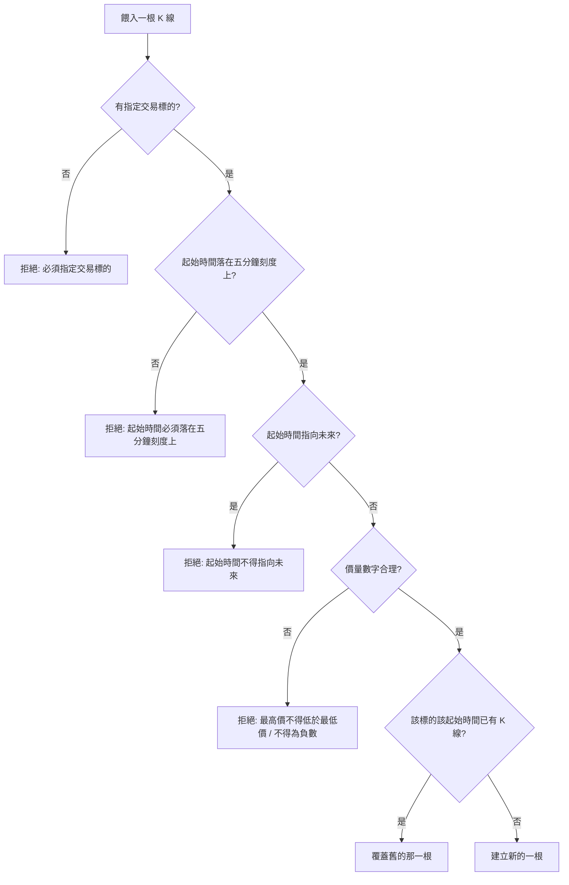
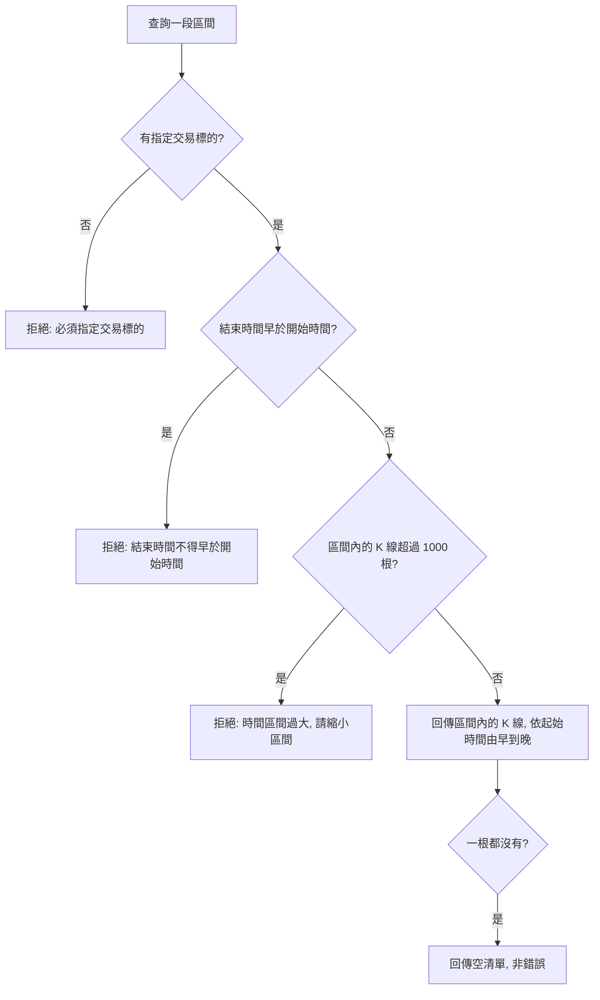

# Product Requirements Document (PRD)

**Feature:** K 線資料管理
**Status:** Draft
**Version:** v1.0
**Owner:** James Hsueh
**Stakeholders:** 專案維護者本人

---

## 1. Background & Goal (Why & Goal)

- **Problem Statement:**
  目前系統雖然能描述一根 K 線的價格與成交數字，卻無法說明這根 K 線**屬於哪一個交易標的**、
  **涵蓋哪一段時間**。因此既存不進有意義的行情，也無法依時間把一段行情取回來。
  沒有一個能穩定存放與取回 K 線的地方，後續任何依賴行情的工作都無從開始。

- **Expected Outcome:**
  能把 K 線存進系統，並以「交易標的 + 時間區間」穩定取回，結果依起始時間由早到晚排列。
  同一根 K 線重複餵入時不會產生重複資料。本階段不設定速度或資料量目標。

- **Out of Scope:**
  - 從外部行情來源自動抓取 K 線（本階段所有 K 線由使用者或外部程式自行提供）。
  - 五分鐘以外的其他時間長度，以及把五分鐘 K 線合併成更長週期。
  - 依 K 線衍生的任何分析、指標或訊號。
  - 一次匯入大量 K 線的批次功能。
  - 存取權限與身分驗證。
  - 交易標的本身的管理（新增、停用、清單維護）。
  - 覆蓋既有 K 線時保留異動軌跡。
  - 查詢區間的時間長度上限（僅以單次 1000 根的筆數上限把關）。

---

## 2. User Personas

- **Primary Role(s):**
  - **專案維護者本人** —— 手動餵入或校正個別 K 線，並查詢行情確認資料是否正確。
  - **行情匯入程式** —— 後續接上的自動化程式，定時把新產生的 K 線寫進系統。
  - **策略程式** —— 後續接上的自動化程式，讀取某個交易標的近期區間的 K 線來運算。

- **Usage Context:**
  沒有任何畫面，全部以程式呼叫的方式互動，執行於自架環境。
  行情匯入程式可能持續、定時地寫入；策略程式可能頻繁讀取較近期的時間區間。
  維護者本人的操作屬於低頻、零星的手動行為。

---

## 3. User Stories & Acceptance Criteria

### US-01 — [priority: P0]
**As a** 策略程式或專案維護者，**I want** 指定一個交易標的與一段時間區間取回其中的 K 線，
**so that** 我能拿到一段連續的行情來運算或核對。

```gherkin
Scenario: 取回區間內的所有 K 線並依時間排序
  Given BTCUSDT 有起始時間 09:00、09:05、09:10 的三根 K 線
  When 查詢 BTCUSDT 從 09:00 到 09:10 的 K 線
  Then 回傳三根 K 線，起始時間依序為 09:00、09:05、09:10

Scenario: 查詢區間的起訖兩端都包含在內
  Given BTCUSDT 有起始時間 09:00、09:05、09:10 的三根 K 線
  When 查詢 BTCUSDT 從 09:05 到 09:05 的 K 線
  Then 回傳一根 K 線，起始時間為 09:05

Scenario: 查詢的起訖時間不必落在五分鐘刻度上
  Given BTCUSDT 有起始時間 09:00、09:05、09:10 的三根 K 線
  When 查詢 BTCUSDT 從 09:01 到 09:09 的 K 線
  Then 回傳一根 K 線，起始時間為 09:05

Scenario: 區間內沒有任何 K 線
  Given BTCUSDT 只有起始時間 09:00 的一根 K 線
  When 查詢 BTCUSDT 從 11:00 到 12:00 的 K 線
  Then 回傳空清單，且不視為錯誤

Scenario: 該交易標的完全沒有資料
  Given ETHUSDT 沒有任何 K 線
  When 查詢 ETHUSDT 從 09:00 到 09:10 的 K 線
  Then 回傳空清單，且不視為錯誤

Scenario: 結束時間早於開始時間
  When 查詢 BTCUSDT 從 10:00 到 09:00 的 K 線
  Then 查詢被拒絕，並說明「結束時間不得早於開始時間」

Scenario: 未指定交易標的
  When 查詢時未指定交易標的
  Then 查詢被拒絕，並說明「必須指定交易標的」

Scenario: 區間內剛好達到單次查詢筆數上限
  Given 查詢區間內剛好有 1000 根 K 線
  When 查詢該區間的 K 線
  Then 回傳 1000 根 K 線

Scenario: 區間內超過單次查詢筆數上限
  Given 查詢區間內有 1001 根 K 線
  When 查詢該區間的 K 線
  Then 查詢被拒絕，並說明「時間區間過大，請縮小區間」
```

### US-02 — [priority: P0]
**As a** 行情匯入程式或專案維護者，**I want** 把一根 K 線存進系統，
**so that** 之後能查得到這段行情，而且重複餵入不會製造出重複資料。

```gherkin
Scenario: 新增一根尚不存在的 K 線
  Given BTCUSDT 在起始時間 09:00 尚無 K 線
  When 新增 BTCUSDT 起始時間 09:00 的一根 K 線
  Then 該根 K 線建立成功
  And 之後查詢 BTCUSDT 09:00 能取回它

Scenario: 重複餵入同一根 K 線時覆蓋舊資料
  Given BTCUSDT 起始時間 09:00 已有一根 K 線，收盤價為 100
  When 新增 BTCUSDT 起始時間 09:00 的一根 K 線，收盤價為 120
  Then BTCUSDT 09:00 仍只有一根 K 線
  And 該根 K 線的收盤價為 120

Scenario: 起始時間不在五分鐘刻度上
  When 新增起始時間為 09:03 的一根 K 線
  Then 新增被拒絕，並說明「起始時間必須落在五分鐘刻度上」

Scenario: 起始時間指向未來
  Given 目前時間為 09:00
  When 新增起始時間為 09:05 的一根 K 線
  Then 新增被拒絕，並說明「起始時間不得指向未來」

Scenario: 未指定交易標的
  When 新增一根未指定交易標的的 K 線
  Then 新增被拒絕，並說明「必須指定交易標的」

Scenario: 最高價低於最低價
  Given 一根 K 線的最高價為 90、最低價為 100
  When 新增這根 K 線
  Then 新增被拒絕，並說明「最高價不得低於最低價」

Scenario: 出現負數的價格或成交數字
  Given 一根 K 線的成交量為 -5
  When 新增這根 K 線
  Then 新增被拒絕，並說明「價格與成交數字不得為負數」
```

### US-03 — [priority: P1]
**As a** 專案維護者，**I want** 以交易標的與起始時間指名取回單一一根 K 線，
**so that** 我能核對某一個特定時間點的行情。

```gherkin
Scenario: 取回一根存在的 K 線
  Given BTCUSDT 起始時間 09:00 的 K 線存在
  When 讀取 BTCUSDT 起始時間 09:00 的 K 線
  Then 回傳該根 K 線

Scenario: 取回一根不存在的 K 線
  Given BTCUSDT 起始時間 09:00 沒有 K 線
  When 讀取 BTCUSDT 起始時間 09:00 的 K 線
  Then 回覆找不到該根 K 線
```

### US-04 — [priority: P1]
**As a** 專案維護者，**I want** 修正一根既有 K 線的價格與成交數字，
**so that** 我能更正餵錯的行情，而不必先刪掉再重新建立。

```gherkin
Scenario: 修改一根存在的 K 線
  Given BTCUSDT 起始時間 09:00 的 K 線存在，收盤價為 100
  When 將該根 K 線的收盤價改為 120
  Then 該根 K 線的收盤價為 120

Scenario: 修改一根不存在的 K 線
  Given BTCUSDT 起始時間 09:00 沒有 K 線
  When 修改 BTCUSDT 起始時間 09:00 的 K 線
  Then 回覆找不到該根 K 線

Scenario: 修改時試圖更換起始時間
  Given BTCUSDT 起始時間 09:00 的 K 線存在
  When 修改該根 K 線並要求把起始時間改為 09:05
  Then 修改被拒絕，並說明「不得更換交易標的與起始時間」

Scenario: 修改後的數字不合理
  Given BTCUSDT 起始時間 09:00 的 K 線存在
  When 將該根 K 線的最高價改為 90、最低價改為 100
  Then 修改被拒絕，並說明「最高價不得低於最低價」
  And 該根 K 線維持原本的數字
```

### US-05 — [priority: P1]
**As a** 專案維護者，**I want** 刪掉一根 K 線，
**so that** 我能清掉明顯錯誤而不該留著的資料。

```gherkin
Scenario: 刪除一根存在的 K 線
  Given BTCUSDT 起始時間 09:00 的 K 線存在
  When 刪除 BTCUSDT 起始時間 09:00 的 K 線
  Then 刪除成功
  And 之後查詢 BTCUSDT 09:00 找不到該根 K 線

Scenario: 刪除一根不存在的 K 線
  Given BTCUSDT 起始時間 09:00 沒有 K 線
  When 刪除 BTCUSDT 起始時間 09:00 的 K 線
  Then 回覆找不到該根 K 線
```

---

## 4. Business Flow & Logic

**Flow Diagram:**





**Core Business Rules:**

- **辨識規則**：「交易標的 + 起始時間」唯一決定一根 K 線；同一組值只會有一根。
- **時間規則**：一根 K 線固定涵蓋五分鐘；起始時間必須落在五分鐘刻度上，且不得指向未來；
  所有時間一律以世界標準時間表示與儲存。
- **覆蓋規則**：餵入的 K 線若已存在同一組辨識值，以新資料整根覆蓋舊資料，不保留舊值。
- **數字規則**：最高價不得低於最低價；所有價格與成交數字皆不得為負數。
- **查詢規則**：起訖兩端都包含在內；起訖本身不必落在五分鐘刻度上；結果依起始時間由早到晚排列；
  單次最多回傳 1000 根。
- **修改規則**：修改只作用於價格與成交數字，不得更換交易標的或起始時間；
  修改後的數字同樣要通過數字規則。

**Edge Cases:**

- **區間內沒有任何 K 線** —— 回傳空清單，視為正常結果而非錯誤。系統不區分「當時沒有交易」
  與「資料尚未餵入」。
- **區間內的 K 線不連續（中間缺根）** —— 有幾根回幾根，系統不補洞、不告警。
- **同一根 K 線被反覆餵入** —— 每次都以最新資料覆蓋，結果與只餵最後一次相同。
- **修改或刪除的對象不存在** —— 回覆找不到，不建立新資料。
- **修改被拒絕時** —— 原本那根 K 線維持不變，不得留下改到一半的狀態。
- **資料存放處無法讀寫時** —— 該次操作視為失敗並說明原因，不得回傳看似成功的空結果。

---

## 5. UI/UX Design & Interaction

**N/A** —— 本功能沒有任何畫面，全部以程式呼叫的方式使用，因此沒有原型、
沒有載入中或空白畫面等視覺狀態需要定義。

與呈現相關、但屬於回應內容而非畫面的約定：

- 查無資料時回傳**空清單**，而不是「找不到」。「找不到」只用在以交易標的與起始時間
  指名單一根 K 線卻不存在的情況。
- 任何被拒絕的操作都必須附上**可讀的原因**，且原因要指出是哪一條規則不通過。

---

## 6. Non-Functional Requirements

- **Performance:** 本階段不設定回應時間或資料量目標。以「單次查詢最多 1000 根」控制單次
  回應的規模，避免一次取回過大的區間。
- **Security:** 本階段沒有身分驗證與權限控管，任何呼叫者都能讀寫全部 K 線。
  這是刻意的取捨，記錄在 Out of Scope。
- **Compatibility:** N/A（沒有畫面，不涉及裝置或瀏覽器相容性）。
- **Analytics / Tracking:** N/A（本階段不埋任何使用行為追蹤）。

---

## 7. Dependencies & Risks

**External Dependencies:**

- 無。本階段不連接任何外部行情來源，所有 K 線都由使用者或後續接上的行情匯入程式自行提供。

**Known Risks:**

- **資料完整性無人把關** —— 系統不主動抓取行情，區間內是否有缺漏完全取決於餵入者。
  查詢結果中的空缺無法區分「當時沒有交易」與「資料沒餵進來」。
- **覆蓋無法回復** —— 覆蓋舊 K 線不保留任何軌跡，一旦餵入錯誤資料就會直接蓋掉原本正確的資料，
  且無從得知被蓋掉的是什麼。
- **大量寫入尚未驗證** —— 本階段沒有批次匯入，行情匯入程式只能一根一根餵。
  長期回補歷史行情時的可行性尚未評估。
- **筆數上限可能過於保守** —— 五分鐘一根時，1000 根約等於三天多的行情。
  策略程式若需要更長的區間，必須自行切成多段查詢。

---

## 8. Appendix

- 需求共識文件：`.sdd/2026-08-29-k-candle-management/BRIEF.md`
- 通用語言地圖：`.sdd/UL-MAP.md`
