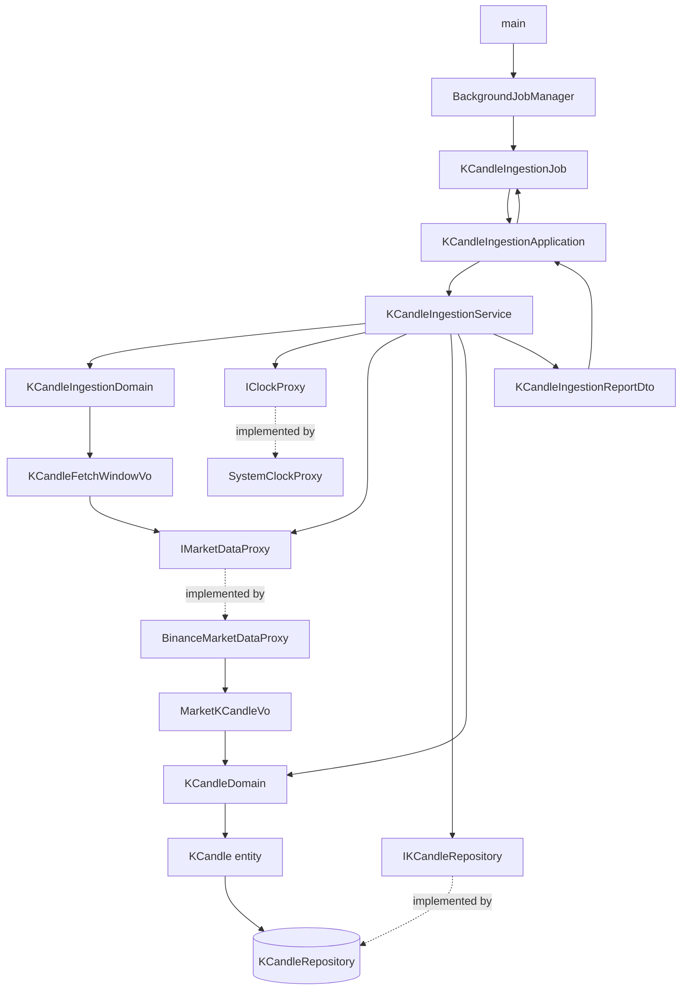

# K 線自動抓取 — Architecture Design

**Status:** Confirmed
**Source PRD:** `.sdd/2026-08-30-k-candle-auto-ingestion/PRD.md`
**Tech context:** Go 1.26 · Gin · GORM (Code First) · PostgreSQL · Clean / Onion Architecture · uber-go/mock · `net/http`（標準函式庫，**不新增第三方依賴**）

---

## 1. Design Goal & Guiding Principle

- **In one sentence:**
  系統啟動後自行維持行情新鮮度——先補齊每個交易標的最多 24 小時的缺口，
  之後每五分鐘替觀察清單上的每個交易標的取回最近五根**已收完**的 K 線，逐根驗證後覆蓋存入。

- **Guiding principle:**
  **「啟動回補」與「定時抓取」是同一件事，差別只在時間窗。**
  兩者都先算出一個 `(交易標的, 起, 迄)` 的窗口，再交給同一條
  **「取回 → 逐根驗 → 逐根存」**的路徑。PRD 第 8 節留給本階段的那個問題
  （回補與定時抓取是否共用同一套流程）答案是**共用**——
  只有「算窗口」那一步分岔，其餘完全同一條路。

  這帶來的直接好處是：`IMarketDataProxy` 只需要**一個方法**，
  而「跳過違規那一根」「覆蓋不重複」「進行中那根不存」這些規則各自只寫一次，
  回補與定時抓取自動同時受惠，不會有一邊改了另一邊忘了改的漂移。

  第二層原則：**「向誰要行情」整個關在一個能力介面後面。**
  `IMarketDataProxy` 以能力命名而非供應商命名；domain 與 application 不認識任何交易所。

---

## 2. Change Scope

| Area | Action | What / Why |
| :--- | :--- | :--- |
| `internal/config/application_config.go` | **Modify** | 新增 `IngestionConfig` 群組（觀察清單、單輪取回根數、回補上限、來源網址、請求逾時）與 `BackgroundJobsEnabled`；新增 `boolWithDefault` 與 `stringSliceWithDefault` 兩個讀取輔助 |
| `cmd/server/main.go` | **Modify** | 取得 `BackgroundJobManager` 並呼叫 `StartAll()`；**在 `engine.Run` 之前**，因為 `Run` 會阻塞 |
| `cmd/server/dependencies.go` | **Modify** | 新增 `buildBackgroundJobManager(...)`：組裝 proxy → service → application → job。總開關關閉時回傳一個**空清單**的 manager |
| `README.md` | **Modify** | 補上新的環境變數與自動抓取的行為說明 |
| `.env.example` | **Modify** | 補上新的環境變數 |
| `internal/domain/models/domains/k_candle_ingestion_domain.go` | **Add** | 本設計的核心：哪根算已收完、兩種窗口怎麼算 |
| `internal/domain/models/vo/k_candle_fetch_window_vo.go` | **Add** | `(交易標的, 起, 迄)` |
| `internal/domain/models/vo/market_k_candle_vo.go` | **Add** | 來源正規化後的 K 線形狀 |
| `internal/domain/models/dto/k_candle_ingestion_report_dto.go` | **Add** | 一輪的結果回報（三個 DTO 同檔，同一個概念的三層） |
| `internal/domain/service/k_candle_ingestion_service.go` | **Add** | 用例入口：`RunBackfill` / `RunScheduledRound` |
| `internal/domain/interface/i_market_data_proxy.go` | **Add** | 取得行情的能力契約 |
| `internal/domain/interface/i_background_job.go` | **Add** | 背景工作的契約 |
| `internal/infrastructure/marketdata/binance_market_data_proxy.go` | **Add** | 以 Binance 實作上述契約 |
| `internal/infrastructure/marketdata/binance_wire.go` | **Add** | Binance 原始回應的電報形狀，止步於 infrastructure |
| `internal/application/k_candle_ingestion_application.go` | **Add** | 用例編排 |
| `internal/job/background_job_manager.go` | **Add** | 只認識 `[]IBackgroundJob`，統一啟動 |
| `internal/job/k_candle_ingestion_job.go` | **Add** | 先回補、回補完才進入五分鐘迴圈；把回報寫進紀錄 |
| **`internal/domain/interface/i_k_candle_repository.go`** | **Not touched** | **一行都不用改。** 回補只需要「最後一根是什麼時候」，既有的 `FindLatest(symbol, 1)` 正好回答；存入用既有的 `Save`（已帶覆蓋語意） |
| **資料庫 schema · `SchemaMigrator` · `cmd/migrate`** | **Not touched** | **不新增任何資料表。** 抓回來的就是既有的 `KCandles`；失敗與跳過只留紀錄不落地（PRD 已把「查看抓取狀況」列為 Out of Scope） |
| `KCandleService` / `KCandleApplication` / `KCandleController` | **Not touched** | 比照指標計算切片的先例，本功能**直接依賴 `IKCandleRepository`**，不跨 domain service 呼叫 |
| `KCandleDomain`（entity 與 domain model） | **Not touched** | 逐根驗證**完全沿用** `NewKCandleDomain`。本功能不新增也不放寬任何一條 K 線規則 |
| 既有五條 K 線路由 · 指標計算 · `/health` | **Not touched** | 本功能**沒有任何對外進入點**，不新增路由 |

---

## 3. New Classes / Modules

| Name | Kind | Responsibility (purpose) | Collaborators | Satisfies (PRD scenario) |
| :--- | :--- | :--- | :--- | :--- |
| `KCandleIngestionDomain` | Domain Model | **本設計的核心。** 持有三條「取哪些」的規則：①**最新已收完的起始時間**＝把當下時間向下對齊五分鐘再退一根；②**定時窗口**＝從「最新已收完往前推 `根數-1` 根」到「最新已收完」；③**回補窗口**＝從 `max(最後一根的下一根, 當下 - 回補上限)` 到「最新已收完」。另持有 `SelectClosed(...)`：把來源多給的**進行中那一根**濾掉 | `KCandleFetchWindowVo`、`MarketKCandleVo` | US-01 全部四個；US-02 第一個；US-03 全部五個 |
| `KCandleFetchWindowVo` | VO | 一個取回窗口：交易標的、起始、結束。**另帶 `IsEmpty()`**——回補時「沒有缺口」就是一個空窗口，讓「不做任何回補」變成資料判斷而非流程分支 | — | US-03 第三個 |
| `MarketKCandleVo` | VO | 行情來源正規化之後的一根 K 線：交易標的、起始時間、八個**精確小數**。不可變、無行為，唯一的 method 是 `ToWriteDto()`（轉換寫在來源身上） | — | US-02、US-05 全部 |
| `IMarketDataProxy` | Interface | **給一個窗口，回一批 K 線。** 以能力命名，不綁供應商。單一方法 `FetchKCandles(window vo.KCandleFetchWindowVo) ([]vo.MarketKCandleVo, error)` | — | US-01～US-05 取資料的部分 |
| `BinanceMarketDataProxy` | Proxy | 實作上述契約，並把這些全部藏在後面：來源網址、交易標的的代號寫法、五分鐘的字串表示、窗口換算成查詢參數、**電報格式（陣列包陣列）的解碼**、單次筆數上限與**分頁**、請求逾時、把每一種失敗轉成可讀錯誤 | `MarketKCandleVo` | 同上 |
| `KCandleIngestionService` | Domain Service | 唯一入口，兩個**互不呼叫**的公開方法：`RunBackfill(symbols)` 與 `RunScheduledRound(symbols)`。兩者各自算窗口，再共用私有的 `ingestSymbols(windows)`——同時跑、彼此獨立、逐根驗、逐根存、收集回報 | `IKCandleRepository`、`IMarketDataProxy`、`IClockProxy`、`KCandleIngestionDomain`、`KCandleDomain` | US-01～US-06 全部 |
| `KCandleIngestionReportDto` | DTO | 一次執行的整體結果：一組「每個交易標的的結果」 | `KCandleSymbolIngestionReportDto` | US-04、US-05 |
| `KCandleSymbolIngestionReportDto` | DTO | 單一交易標的的結果：交易標的、存入根數、跳過清單、取不到資料的原因（空字串＝沒失敗） | `SkippedKCandleDto` | US-04、US-05 |
| `SkippedKCandleDto` | DTO | 被跳過的一根：起始時間 + 違反的規則說明。**這一層存在的唯一理由**是 PRD 的紀錄規則要求辨識到「哪一根、哪條規則」 | — | US-05 第二、三、四個 |
| `KCandleIngestionApplication` | Application | 用例編排。兩個方法各一次呼叫 service，回傳 DTO。不做任何規則判斷 | `KCandleIngestionService` | 全部 |
| `IBackgroundJob` | Interface | 背景工作的契約：`Start()`。**放 `domain/interface/`**，比照專案「所有介面集中一處、實例檔不得宣告介面」的規範 | — | US-06 |
| `BackgroundJobManager` | Job manager | 只認識 `[]IBackgroundJob`，`StartAll()` 逐一啟動。**不認識任何具體 job** | `IBackgroundJob` | US-06 第四個 |
| `KCandleIngestionJob` | Job | 在自己的 goroutine 內：**先跑完回補**，再進入 `time.Ticker` 的五分鐘迴圈。每次拿到回報就寫進紀錄。持有觀察清單的**自有副本** | `KCandleIngestionApplication` | US-03 第五個；US-06 全部四個 |

### 刻意不建立的東西

- **沒有新 entity、沒有新資料表、沒有 `IngestionRecordRepository`。**
  「留下紀錄」在本階段就是寫進執行紀錄（log）。PRD 已把「對外提供查看抓取狀況」
  與「失敗主動通知」都列為 Out of Scope，現在開一張表等於臆測它未來長什麼樣。
- **沒有 `IWatchlistRepository`、沒有 `Watchlist` entity。**
  觀察清單是**設定**，不是資料。它啟動時定案、執行期間不變——
  這正是設定的定義。把它做成資料反而會讓「執行期間不變」變得難以保證。
- **沒有 `KCandleBackfillService` 與 `KCandleScheduledIngestionService` 兩個 service。**
  它們會共用九成的程式碼，只差算窗口那一步。兩個 service 表示兩個要同步維護的地方。
- **沒有為回補與定時抓取各開一個 job。**
  PRD 要求「回補完成後定時抓取才開始」——這是**順序約束**。
  寫成一個 job 內的先後兩段，順序由程式結構保證；
  拆成兩個 job 就得另外發明一套協調機制來表達同一件事。
- **沒有 `IMarketDataProxy.FetchLatest(symbol, count)` 這個第二方法。**
  「最近五根」就是一個窗口。多一個方法等於讓呼叫端多一個要選的分支。

### Depth check（deep-module 診斷）

- **`IMarketDataProxy` 只有一個方法、一個參數**，背後藏著網址組裝、代號寫法、
  電報解碼、分頁、逾時、錯誤轉譯六件事 → 深度明顯為正。
  參數不會逐季膨脹：要多帶條件就擴充 `KCandleFetchWindowVo`，簽章不動。
- **`KCandleIngestionService` 的兩個公開方法各自「一次呼叫就完成一件業務」**，
  呼叫端不必依序呼叫多個方法、不必自己判斷該不該跑下一步 → 非淺模組。
- **`KCandleIngestionJob` 對 application 的呼叫只有兩次**，且順序就是業務順序。
- **回報 DTO 是三層而非攤平**，因為紀錄規則本身就是三層（一輪 → 一個標的 → 一根）。
  攤平會逼呼叫端自己分組，那是把複雜度推給呼叫端。
- 名稱裡沒有 `And` / `Then`；沒有任何 `XxxHelper` / `XxxUtils`。
  `BackgroundJobManager` 帶 `Manager` 字樣但**不是**靜態雜物櫃——
  它持有狀態（一組 job）、只有一個行為，且是 `.claude/rules/background-jobs.md` 指定的角色。

---

## 4. Modified Components

| Component | Current role | Change needed |
| :--- | :--- | :--- |
| `ApplicationConfig` / `Load()` | 讀取埠號、查詢上限、算式允許時間、資料庫設定 | 新增巢狀的 `IngestionConfig`（`Symbols []string`、`RoundCandleCount int`、`BackfillLookback time.Duration`、`MarketDataBaseUrl string`、`MarketDataRequestTimeout time.Duration`）與頂層 `BackgroundJobsEnabled bool`。新增 `boolWithDefault`、`stringSliceWithDefault` 兩個未匯出輔助，比照既有 `positiveIntWithDefault` 的寫法（讀不到或不合法即回預設值，不報錯） |
| `registerRoutes`（組裝根） | 掛載健康檢查與六條路由 | **不新增任何路由。** 另新增同檔的 `buildBackgroundJobManager(database, applicationConfig) *job.BackgroundJobManager`：總開關關閉時回傳空清單的 manager；否則組裝 `BinanceMarketDataProxy` → `KCandleIngestionService`（注入既有的 `KCandleRepository`、`SystemClockProxy` 與設定）→ Application → `KCandleIngestionJob` |
| `main()` | 載入設定、連資料庫、註冊路由、啟動 Gin | 在 `registerRoutes` 之後、`engine.Run` **之前**呼叫 `buildBackgroundJobManager(...).StartAll()`。位置很關鍵：`Run` 會阻塞，放後面等於永遠不會執行 |

### 新增的環境變數

| 變數 | 預設值 | 用途 |
| :--- | :--- | :--- |
| `BACKGROUND_JOBS_ENABLED` | `true` | 背景工作總開關。`false` 時完全不回補、不抓取 |
| `KCANDLE_INGESTION_SYMBOLS` | 空（不啟用） | 逗號分隔的觀察清單，例如 `BTCUSDT,ETHUSDT`。空＝自動抓取形同關閉 |
| `KCANDLE_INGESTION_ROUND_CANDLE_COUNT` | `5` | 單輪取回根數 |
| `KCANDLE_INGESTION_BACKFILL_LOOKBACK_HOURS` | `24` | 回補上限 |
| `MARKET_DATA_BASE_URL` | Binance 公開行情網址 | 行情來源的位址。做成設定是為了讓測試能指向本機的替身 |
| `MARKET_DATA_REQUEST_TIMEOUT_SECONDS` | `10` | 單次向來源請求的逾時 |

> **抓取間隔刻意沒有設定值。** 見第 8 節「刻意偏離既有規範」。

---

## 5. Component Relationships

### 執行順序 — 啟動

1. `main` 判斷總開關；關閉則 manager 為空清單，`StartAll()` 什麼都不做。
2. `KCandleIngestionJob.Start()` 開一個 goroutine，**不阻塞 HTTP 伺服器啟動**。
3. goroutine 內第一件事：`Application.RunBackfill(觀察清單)`。
4. **等它整個回傳之後**，才建立 `time.Ticker(5 分鐘)` 進入迴圈。
   順序由程式結構保證，不需要額外的旗標或協調機制。

### 執行順序 — 一輪抓取（`RunScheduledRound`）

1. `IClockProxy.Now()` 取當下時間（**唯一的時間來源**，讓規則可被測試釘死）。
2. 建構 `KCandleIngestionDomain(now, 單輪取回根數, 回補上限)`。
3. 對每個交易標的算出定時窗口 → 得到一組 `KCandleFetchWindowVo`。
4. 進入共用的 `ingestSymbols`：**每個窗口一個 goroutine，同時進行**。
5. 每個 goroutine 內：
   a. `IMarketDataProxy.FetchKCandles(window)`；失敗→在該標的的回報記下原因，**結束該標的**，不影響其他。
   b. `KCandleIngestionDomain.SelectClosed(candles)`：濾掉**進行中**那一根。
   c. 逐根 `NewKCandleDomain(vo.ToWriteDto(), now)`；不通過→記進跳過清單，**繼續下一根**。
   d. 通過的 `IKCandleRepository.Save(...)`（既有的覆蓋語意）；寫入失敗同樣記進跳過清單。
6. 全部 goroutine 收攏，組成 `KCandleIngestionReportDto` 回傳。
7. Job 把回報寫進紀錄：只在有失敗或有跳過時寫。

### 執行順序 — 回補（`RunBackfill`）

與上面**完全相同**，只有第 3 步不同：
先對每個交易標的 `IKCandleRepository.FindLatest(symbol, 1)` 取得最後一根的起始時間
（回空切片＝從未有資料），再交給 `KCandleIngestionDomain` 算回補窗口。
窗口為空（沒有缺口）就直接跳過該標的，不呼叫來源。

### 併發原語的選擇

**用 `sync.WaitGroup`，不用 `errgroup`。**
`errgroup` 的語意是「任一個出錯就取消其他人」——那正好與 PRD 的失敗獨立規則相反。
每個 goroutine 把自己的結果寫進**預先配好、各自獨佔一格**的切片，
彼此不共用可變狀態，因此不需要鎖。

---

## 6. Extensibility & Handoff Notes

- **Most likely next requirement:**
  **換掉行情來源，或同時接第二家。** 這是本功能唯一的外部依賴，也是唯一會被外力逼著改的地方
  （來源改版、擋流量、或想要備援）。次可能的是「同時支援其他 K 線長度」。

- **Where it lands:**
  `IMarketDataProxy`。它以**能力**命名而非供應商命名，正是為此預留。

- **How to add it:**
  1. 新增 `OkxMarketDataProxy` 實作同一個介面。
  2. 組裝根改一行。
  3. **`KCandleIngestionService`、`KCandleIngestionDomain`、`KCandleIngestionJob`、
     所有 DTO 與 VO 一行都不用改。**
  4. 要「主來源掛了換備援」則再加一個實作同介面的 `FallbackMarketDataProxy`，
     內部持有一組 `IMarketDataProxy` 依序嘗試——對呼叫端仍然只是一個 `IMarketDataProxy`。

- **第二條縫：** `KCandleIngestionReportDto` 已經是結構化回傳值，不是一行字串。
  哪天要「抓取狀況查得到」或「失敗發通知」，做法是**多一個消費者**
  （一個 repository、一個通知 proxy），service 與 domain model 都不用動。

- **Patterns applied & why:**
  - **能力介面隔離外部來源**（`IMarketDataProxy`）：唯一目的是讓「向誰要行情」整個可換，
    同時讓 domain 不碰任何第三方細節。沿用指標計算切片對 `IIndicatorScriptProxy` 的同一手法。
  - **窗口物件統一兩種取用**（`KCandleFetchWindowVo`）：本設計最關鍵的一步。
    它讓回補與定時抓取共用一條路徑，也讓 proxy 只需要一個方法。
  - **時間規則收進一個 domain model**：「哪根算已收完」是本功能最容易被寫散的規則
    （窗口計算要用、濾除進行中那根要用）。放在同一個物件上，未來改 K 線長度只有一個地方。
  - **刻意不抽「來源種類」的策略階層**：Binance 與其他交易所是同一個介面的不同**實作**，
    不是需要另一層策略選擇器的東西。

- **Do not hardcode:**
  - **觀察清單**——一律來自設定，不得出現在任何 service、domain model 或 job 裡。
  - **單輪取回根數、回補上限**——由建構子注入，取自設定。
  - **來源網址與請求逾時**——由建構子注入 `BinanceMarketDataProxy`，不得寫死在檔案內。
  - **K 線長度（五分鐘）**——已經有 `kCandleIntervalMinutes` 這個常數在
    `k_candle_domain.go`。`KCandleIngestionDomain` **必須沿用它**，不得另外寫一個 5。
    這是全專案唯一該有的那個 5。
  - **交易所的代號寫法與時間長度字串**——只能出現在 `BinanceMarketDataProxy` 內。

- **Known debt / deferred:**
  - **失敗只寫紀錄，沒有人會被通知。** 某個交易標的持續取不到資料時，
    除非有人去翻紀錄否則不會發現。
    **該重看的訊號**：第一次發生「策略程式讀到停在數天前的行情」。
  - **回補與定時抓取共用同一條路徑，但回補的資料量可能大上兩個數量級**
    （24 小時＝288 根 vs 一輪 5 根）。目前逐根 `Save`，沒有批次寫入。
    **該重看的訊號**：觀察清單變長、或啟動到第一輪定時抓取的延遲開始有感。
  - **同時取多個交易標的，沒有任何節流。** 觀察清單不設上限是 PRD 的決定。
    **該重看的訊號**：出現「大部分交易標的同一輪一起失敗」——
    那多半是被來源擋流量，不是網路問題。這一點值得寫進紀錄的措辭裡，避免誤判。
  - **`KCandleFetchWindowVo` 目前只有交易標的與起訖。**
    未來要支援其他 K 線長度時，長度會是加在它身上的第一個欄位。
  - **回補期間某個交易標的失敗就是失敗，不重試。** 該標的的缺口留到下次啟動，
    或由定時抓取慢慢往前補（但定時抓取只看最近五根，補不回久遠的缺口）。
    **該重看的訊號**：出現「重開之後還是有一段空白」。

---

## 7. Traceability

| PRD Scenario | Fulfilled by |
| :--- | :--- |
| **US-01** 一輪抓取替清單上每個交易標的取回最新已收完的 K 線 | `KCandleIngestionService.RunScheduledRound` + `KCandleIngestionDomain.ScheduledWindow` + `IMarketDataProxy` |
| **US-01** 涵蓋的五分鐘尚未走完的那一根不存入 | `KCandleIngestionDomain.LatestClosedOpenTime`（向下對齊再退一根）+ `SelectClosed` |
| **US-01** 五分鐘走完之後該根才被存入 | 同上（同一條規則的另一側邊界） |
| **US-01** 觀察清單為空時一輪抓取不做任何事 | `KCandleIngestionService.RunScheduledRound`（空清單→零個窗口→零個 goroutine→空回報，非錯誤） |
| **US-02** 交易標的尚無任何資料時存入最近數根 | `KCandleIngestionDomain.ScheduledWindow`（窗口長度＝單輪取回根數）+ `IKCandleRepository.Save` |
| **US-02** 行情來源修正過的數字覆蓋既有的那一根 | `IKCandleRepository.Save` 的**既有**覆蓋語意（`OnConflict` 更新價量欄位） |
| **US-02** 取回的資料部分已有、部分尚無 | 同上（覆蓋與新增走同一個 `Save`，天生不產生重複） |
| **US-03** 補齊停機期間的缺口 | `KCandleIngestionService.RunBackfill` + `IKCandleRepository.FindLatest(symbol, 1)` + `KCandleIngestionDomain.BackfillWindow` |
| **US-03** 缺口超出回補上限時只補上限之內的 | `KCandleIngestionDomain.BackfillWindow` 的 `max(最後一根的下一根, 當下 - 回補上限)` |
| **US-03** 沒有缺口時不做任何回補 | `KCandleFetchWindowVo.IsEmpty()` → 跳過該標的，不呼叫來源 |
| **US-03** 從未有過任何資料的交易標的補滿回補上限 | `FindLatest` 回空切片 → `BackfillWindow` 取 `當下 - 回補上限` 那一側 |
| **US-03** 回補完成之後才開始定時抓取 | `KCandleIngestionJob.Start` 的 goroutine 內，`RunBackfill` 回傳後才建立 `Ticker` |
| **US-04** 一個交易標的取不到資料，其他照常存入 | `KCandleIngestionService.ingestSymbols`（每標的一個 goroutine，`sync.WaitGroup` 而非 `errgroup`）+ `KCandleSymbolIngestionReportDto.FetchFailureReason` |
| **US-04** 全部交易標的都取不到資料時系統仍繼續運行 | 同上（回報全帶失敗原因，job 不中止 `Ticker`） |
| **US-04** 上一輪失敗漏掉的 K 線在下一輪自動補回 | `KCandleIngestionDomain.ScheduledWindow` 的窗口涵蓋最近數根，非只取最新一根 |
| **US-05** 同一批全部合規時全部存入 | 逐根 `NewKCandleDomain` 全數通過 → 逐根 `Save` |
| **US-05** 最高價低於最低價的那一根被跳過 | `NewKCandleDomain` 回 `ErrKCandleValidation` → 記進 `SkippedKCandleDto`（起始時間 + 規則說明），迴圈繼續 |
| **US-05** 起始時間不在五分鐘刻度上的那一根被跳過 | 同上（同一條路徑，不同的既有規則） |
| **US-05** 同一批全部違規時一根都不存，但不算整輪失敗 | 同上；`FetchFailureReason` 維持空字串，因為取回本身是成功的 |
| **US-06** 每一輪固定只抓啟動時定下的交易標的 | `KCandleIngestionJob` 持有觀察清單的**自有副本**（建構時複製） |
| **US-06** 執行期間變更觀察清單不生效 | 同上——建構時的複製讓外部改動傳入的切片也不影響 job；設定本身只在 `config.Load()` 讀一次 |
| **US-06** 觀察清單為空等同關閉自動抓取 | `KCandleIngestionService` 的空清單路徑；既有路由與指標計算完全不受影響（本功能不碰它們） |
| **US-06** 自動抓取被整個停用 | `buildBackgroundJobManager` 在 `BackgroundJobsEnabled` 為假時回傳**空清單**的 manager → `StartAll()` 不啟動任何 job，回補也不會執行 |

---

## 8. Risks & Open Decisions

### 刻意偏離既有規範

**`.claude/rules/background-jobs.md` 要求「每個 job 的執行間隔由設定控制；設 `0` 或負值即停用該 job」。
本設計不提供抓取間隔的設定。**

- **理由**：PRD 決定抓取間隔**固定為五分鐘**，與 K 線本身的長度綁定。
  它不是一個調校參數，而是一條業務規則——設成別的值會讓「每根 K 線都被取到」不再成立。
- **停用的替代路徑有兩條**，且都寫進了驗收條件：
  總開關 `BACKGROUND_JOBS_ENABLED=false`，或觀察清單留空。
- **這條偏離只適用於本 job。** 日後新增的其他背景工作若間隔確實是調校參數，
  應回歸該規範提供各自的間隔設定。

### Risks / trade-offs

- **依賴一個不受控的外部來源。** 這是本專案第一次依賴自身之外的服務。
  它的可用性、資料正確性、流量限制全部不在掌控內。可接受的理由是——
  失敗獨立、下一輪自然重試、且系統不會因此停止。
- **同時取多個交易標的且不節流。** 清單愈長愈可能被來源擋下，症狀是「一起失敗」
  而非系統錯誤，**容易被誤判成網路問題**。紀錄的措辭應該讓這一點看得出來。
- **回補只往回 24 小時。** 系統或來源連續超過 24 小時不可用時，
  超出的缺口將永久空白，本階段沒有補救功能。
- **每輪自動覆蓋最近五根，放大了既有的「覆蓋無法回復」風險。**
  來源給出錯誤數字時，正確的舊資料會被直接蓋掉且無從得知蓋掉的是什麼。
- **來源的數字對錯無人把關。** 只驗既有的 K 線規則（刻度、高低價、非負數）。
  明顯偏離市場的價格會照常存入。
- **Binance 的回應是陣列包陣列的電報格式**，欄位靠**位置**而非名稱對應。
  來源改動欄位順序時不會有明顯錯誤，只會默默解出錯的數字。
  解碼只發生在 `binance_wire.go` 一處，並以測試把位置對應釘死。
  **實作時務必用 `[][]json.RawMessage` 而非 `[][]any`**——後者違反專案的禁用空介面規範。
- **回補期間 HTTP 伺服器已經可以服務。** Job 在自己的 goroutine 內跑，
  所以啟動很快，但此時查詢到的行情可能還不完整。
  這是刻意的取捨：換取回補與定時抓取不會互相覆蓋同一根 K 線。
- **新增介面需要產生新的替身。** `IMarketDataProxy` 與 `IBackgroundJob` 都要補
  `//go:generate go tool mockgen ...` 並產生 mock。既有替身不受影響
  （`IKCandleRepository` 完全沒動），但這一步不能忘。

### Open decisions（留給實作階段解決）

- **回補窗口的根數上限。** 24 小時＝288 根，Binance 單次上限為 1000 根，
  因此目前一次請求即可涵蓋。但**分頁邏輯仍應實作在 proxy 內**，
  否則日後把回補上限調大就會靜默地少拿資料。實作時確認來源的實際上限。
- **來源回傳的根數少於窗口涵蓋的根數時**（新上市的交易標的、來源本身缺資料）：
  依 PRD 的邊界情況「有幾根收幾根，不視為失敗」。實作時確認 proxy 不對根數做檢查。
- **紀錄的層級與格式。** 建議：正常輪次不寫；有跳過或失敗時各寫一行，
  內容包含交易標的、起始時間、規則說明。實作時定案。
- **`KCandleIngestionDomain` 的建構子是否需要驗證單輪取回根數大於零。**
  建議需要——設定讀取雖已用 `positiveIntWithDefault` 擋掉，
  但 domain model 不應該假設呼叫端已經擋過。
- **`IBackgroundJob.Start()` 的簽章是否需要回傳錯誤或接收 context。**
  目前設計為無參數無回傳（job 自行開 goroutine、自行處理失敗）。
  若日後需要優雅關閉（graceful shutdown），這裡是第一個要改的地方。
- **一輪抓取超過五分鐘時的行為。** `time.Ticker` 會累積，可能造成兩輪重疊。
  建議：迴圈內同步執行，讓下一次 tick 自然被丟棄（Go 的 Ticker 通道容量為 1）。
  實作時確認並以註解說明。
