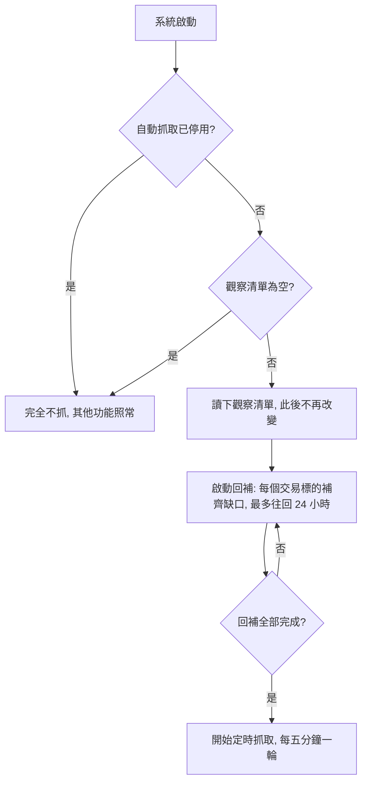
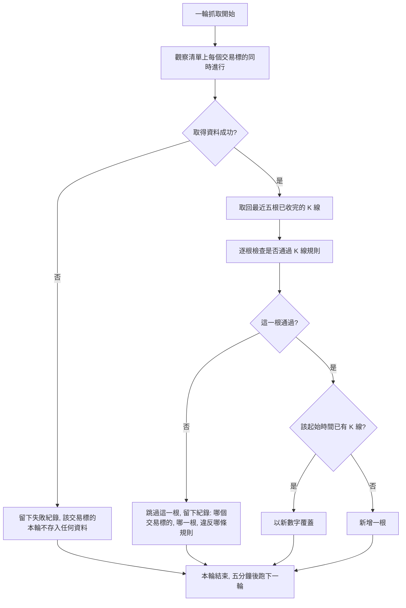

# Product Requirements Document (PRD)

**Feature:** K 線自動抓取
**Status:** Draft
**Version:** v1.0
**Owner:** James Hsueh
**Stakeholders:** 專案維護者本人

---

## 1. Background & Goal (Why & Goal)

- **Problem Statement:**
  系統目前能存放與取回 K 線，但**所有 K 線都得由人手動餵進來**。
  只要沒有人動手，資料就停在最後一次餵入的時間點，愈久愈舊。
  指標計算需要一段連續、貼近現況的行情才有意義，而目前沒有任何機制保證資料是新的。
  這正是 K 線資料管理階段刻意留下的缺口。

- **Expected Outcome:**
  系統啟動後即自行維持行情的新鮮度：每隔五分鐘自動把觀察清單上每個交易標的的最新 K 線
  取回並存入，人不必介入。停機期間漏掉的部分於啟動時自動補齊。
  可觀察的結果是——只要自動抓取正在運行，觀察清單上每個交易標的最新一根已存入的 K 線，
  與當下時間的落差不超過十分鐘。

- **Out of Scope:**
  - 五分鐘以外的其他 K 線長度，以及把五分鐘 K 線合併成更長週期。
  - 執行期間動態增減觀察清單，以及讓人隨時加減交易標的的管理功能。
  - 對外提供查看抓取狀況、成功失敗次數的功能。
  - 抓取失敗時的主動通知（信件、訊息推播等）。
  - 補救回補上限以前的歷史缺口，以及一次匯入大量歷史 K 線的批次功能。
  - 交易標的名稱格式的驗證規則（沿用既有現況，本階段不新增限制）。
  - 觀察清單可容納的交易標的數量上限。
  - 依 K 線衍生的任何分析、指標或訊號。
  - 存取權限與身分驗證。

---

## 2. User Personas

- **Primary Role(s):**
  - **專案維護者本人** —— 在系統啟動前決定觀察清單，之後不再介入；
    出狀況時翻看紀錄確認是哪個交易標的、哪一根 K 線出了什麼問題。
  - **策略程式** —— 後續接上的自動化程式，讀取近期區間的 K 線來運算。
    它是本功能的**受益者**：本功能保證它讀到的行情是新的。

  注意：K 線資料管理階段預留的「**行情匯入程式**」這個角色，就是本功能本身。
  本階段之後，該角色由系統自己扮演，不再需要外部程式代勞。

- **Usage Context:**
  沒有任何畫面。功能隨系統啟動而自動運行，之後全程無人操作。
  執行於自架環境，長時間持續運行；重新啟動屬於偶發事件（改觀察清單、部署新版本）。

---

## 3. User Stories & Acceptance Criteria

### US-01 — [priority: P0]
**As a** 專案維護者，**I want** 系統每隔五分鐘自動把觀察清單上每個交易標的最新的 K 線抓回來，
**so that** 行情資料自己保持新鮮，我不必手動餵。

```gherkin
Scenario: 一輪抓取替清單上每個交易標的取回最新已收完的 K 線
  Given 觀察清單為 BTCUSDT 與 ETHUSDT
  And 目前時間為 09:07
  When 系統跑一輪抓取
  Then BTCUSDT 起始時間 09:00 的 K 線已存入系統
  And ETHUSDT 起始時間 09:00 的 K 線已存入系統

Scenario: 涵蓋的五分鐘尚未走完的那一根不存入
  Given 觀察清單為 BTCUSDT
  And 目前時間為 09:09，起始時間 09:05 的那五分鐘尚未走完
  When 系統跑一輪抓取
  Then BTCUSDT 已存入的 K 線中，起始時間最晚的一根為 09:00
  And 起始時間 09:05 的 K 線不存在於系統中

Scenario: 五分鐘走完之後該根才被存入
  Given 觀察清單為 BTCUSDT
  And 目前時間為 09:11，起始時間 09:05 的那五分鐘已經走完
  When 系統跑一輪抓取
  Then BTCUSDT 起始時間 09:05 的 K 線已存入系統

Scenario: 觀察清單為空時一輪抓取不做任何事
  Given 觀察清單為空
  When 系統跑一輪抓取
  Then 沒有任何 K 線被存入
  And 該輪不視為錯誤
```

### US-02 — [priority: P0]
**As a** 策略程式，**I want** 系統每輪重新取回最近數根 K 線並以新數字覆蓋，
**so that** 行情來源事後修正過的數字會自動更新，我讀到的永遠是最新版本。

```gherkin
Scenario: 交易標的尚無任何資料時存入最近數根
  Given 觀察清單為 BTCUSDT
  And 系統內沒有任何 BTCUSDT 的 K 線
  And 單輪取回根數為 5
  When 系統跑一輪抓取
  Then 系統內有 5 根 BTCUSDT 的 K 線

Scenario: 行情來源修正過的數字覆蓋既有的那一根
  Given 系統內已有 BTCUSDT 最近 5 根 K 線，其中起始時間 09:00 的收盤價為 100
  And 行情來源已把 BTCUSDT 09:00 的收盤價修正為 120
  When 系統跑一輪抓取
  Then BTCUSDT 起始時間 09:00 的 K 線收盤價為 120
  And 系統內的 BTCUSDT K 線仍為 5 根，未變成 10 根

Scenario: 取回的資料部分已有、部分尚無
  Given 行情來源這一輪給出 BTCUSDT 的 5 根 K 線
  And 其中 3 根系統內已有、2 根尚無
  When 系統跑一輪抓取
  Then 那 3 根以新數字覆蓋，起始時間不變
  And 那 2 根新增為系統內的 K 線
  And 沒有任何一個起始時間出現兩根 K 線
```

### US-03 — [priority: P0]
**As a** 專案維護者，**I want** 系統啟動時自動補齊停機期間漏掉的 K 線，
**so that** 重新啟動之後行情是連續的，不會留下一段空白。

```gherkin
Scenario: 補齊停機期間的缺口
  Given 回補上限為 24 小時
  And BTCUSDT 已存入的最晚一根 K 線起始時間為 07:00
  And 目前時間為 09:07
  When 系統啟動
  Then 起始時間 07:05 到 09:00 之間每一個五分鐘刻度上的 BTCUSDT K 線都已存入

Scenario: 缺口超出回補上限時只補上限之內的
  Given 回補上限為 24 小時
  And BTCUSDT 已存入的最晚一根 K 線起始時間為 3 天前
  And 目前時間為 09:07
  When 系統啟動
  Then 只有起始時間落在昨日 09:07 之後的 BTCUSDT K 線被補上
  And 3 天前到昨日 09:07 之間的缺口維持空白，不予補齊

Scenario: 沒有缺口時不做任何回補
  Given BTCUSDT 已存入的最晚一根 K 線就是目前最新已收完的那一根
  When 系統啟動
  Then 沒有任何 K 線被新增或覆蓋
  And 系統直接進入定時抓取

Scenario: 從未有過任何資料的交易標的補滿回補上限
  Given 回補上限為 24 小時
  And 系統內沒有任何 SOLUSDT 的 K 線
  And SOLUSDT 在觀察清單上
  When 系統啟動
  Then 最近 24 小時內每一個五分鐘刻度上的 SOLUSDT K 線都已存入

Scenario: 回補完成之後才開始定時抓取
  Given 觀察清單上有交易標的存在缺口待回補
  When 系統啟動
  Then 定時抓取在回補全部完成之前不會跑任何一輪
  And 回補完成後定時抓取才開始按五分鐘的間隔運行
```

### US-04 — [priority: P1]
**As a** 專案維護者，**I want** 某個交易標的取不到資料時不影響其他交易標的，
**so that** 一個交易標的出狀況不會讓整套行情停擺，而且不需要我出手。

```gherkin
Scenario: 一個交易標的取不到資料，其他照常存入
  Given 觀察清單為 BTCUSDT 與 ETHUSDT
  And 這一輪 BTCUSDT 取不到資料，ETHUSDT 正常
  When 系統跑一輪抓取
  Then ETHUSDT 最新已收完的 K 線已存入系統
  And 這一輪沒有存入任何 BTCUSDT 的 K 線
  And 留下一筆失敗紀錄，指出取不到資料的交易標的是 BTCUSDT

Scenario: 全部交易標的都取不到資料時系統仍繼續運行
  Given 觀察清單上每一個交易標的這一輪都取不到資料
  When 系統跑一輪抓取
  Then 每一個交易標的各留下一筆失敗紀錄
  And 系統不停止，五分鐘後仍會跑下一輪抓取

Scenario: 上一輪失敗漏掉的 K 線在下一輪自動補回
  Given BTCUSDT 上一輪取不到資料，漏掉起始時間 09:00 的 K 線
  And 單輪取回根數為 5
  When 五分鐘後行情來源恢復，系統跑下一輪抓取
  Then BTCUSDT 起始時間 09:00 的 K 線已存入系統
  And 整個過程不需要任何人工介入
```

### US-05 — [priority: P1]
**As a** 專案維護者，**I want** 行情來源給的資料違反 K 線規則時只跳過那一根，
**so that** 一根爛資料不會擋掉同一批其他正常的行情，而且我查得到是哪一根、錯在哪。

```gherkin
Scenario: 同一批全部合規時全部存入
  Given 行情來源這一輪給出 BTCUSDT 的 5 根 K 線，全部通過 K 線規則
  When 系統跑一輪抓取
  Then 這 5 根 K 線全部存入系統

Scenario: 最高價低於最低價的那一根被跳過
  Given 行情來源這一輪給出 BTCUSDT 的 5 根 K 線
  And 其中起始時間 08:55 的那根最高價為 90、最低價為 100
  When 系統跑一輪抓取
  Then 其餘 4 根 K 線存入系統
  And 起始時間 08:55 的 K 線不存在於系統中
  And 留下一筆跳過紀錄，指出 BTCUSDT 起始時間 08:55 的 K 線違反「最高價不得低於最低價」

Scenario: 起始時間不在五分鐘刻度上的那一根被跳過
  Given 行情來源這一輪給出 BTCUSDT 的 5 根 K 線
  And 其中一根的起始時間為 08:53
  When 系統跑一輪抓取
  Then 其餘 4 根 K 線存入系統
  And 起始時間 08:53 的 K 線不存在於系統中
  And 留下一筆跳過紀錄，指出 BTCUSDT 起始時間 08:53 的 K 線違反「起始時間必須落在五分鐘刻度上」

Scenario: 同一批全部違規時一根都不存，但不算整輪失敗
  Given 行情來源這一輪給出 BTCUSDT 的 5 根 K 線，每一根都違反 K 線規則
  When 系統跑一輪抓取
  Then 沒有任何 BTCUSDT 的 K 線被存入
  And 每一根各留下一筆跳過紀錄，指出它是哪一根、違反哪一條規則
  And 這一輪不視為取不到資料的失敗

Scenario: 來源給出所要求時間範圍以外的 K 線時不予採用
  Given 系統這一輪向行情來源要的是起始時間 08:40 到 09:00 之間的 K 線
  And 來源回答的卻是起始時間 09:30 的 K 線
  When 系統跑一輪抓取
  Then 沒有任何 K 線被存入
  And 系統不會因為這個回答而繼續向來源追問更多
```

### US-06 — [priority: P1]
**As a** 專案維護者，**I want** 觀察清單在啟動時就定案、且能整個關掉自動抓取，
**so that** 行為可預期，而且我要停掉自動抓取時不必動到系統其他功能。

```gherkin
Scenario: 每一輪固定只抓啟動時定下的交易標的
  Given 系統啟動時觀察清單為 BTCUSDT 與 ETHUSDT
  When 系統跑任何一輪抓取
  Then 該輪只針對 BTCUSDT 與 ETHUSDT 取回 K 線

Scenario: 執行期間變更觀察清單不生效
  Given 系統啟動時觀察清單為 BTCUSDT 與 ETHUSDT
  And 執行期間觀察清單被改為再加入 SOLUSDT
  When 系統跑下一輪抓取
  Then 該輪仍只針對 BTCUSDT 與 ETHUSDT 取回 K 線
  And 沒有任何 SOLUSDT 的 K 線被存入

Scenario: 觀察清單為空等同關閉自動抓取
  Given 系統啟動時觀察清單為空
  When 系統運行中
  Then 不會有任何 K 線被自動存入
  And K 線的查詢、新增、修改、刪除與指標計算全部照常可用

Scenario: 自動抓取被整個停用
  Given 自動抓取被設為停用
  When 系統啟動
  Then 不會執行啟動回補，也不會跑任何一輪抓取
  And K 線的查詢、新增、修改、刪除與指標計算全部照常可用

Scenario: 單輪取回根數被設成不合理的值
  Given 單輪取回根數被設為 0
  When 系統跑一輪抓取，或執行啟動回補
  Then 該次執行整個不進行
  And 不向行情來源要任何資料，也不存入任何 K 線
  And 留下一筆紀錄說明單輪取回根數必須大於零
```

---

## 4. Business Flow & Logic

**Flow Diagram:**





**Core Business Rules:**

- **觀察清單規則**：於系統啟動時讀取並定案，執行期間不變。為空時自動抓取形同關閉。
  可容納的交易標的數量不設上限。
- **抓取間隔規則**：固定**五分鐘一輪**，與 K 線本身的長度一致，不可調整。
  要停掉自動抓取只有兩個方式——把它整個停用，或讓觀察清單為空。
- **收完才存規則**：只存入涵蓋的五分鐘已經完整走完的 K 線。進行中的那一根一律不存入。
- **單輪取回根數規則**：每輪針對單一交易標的取回最近**五根**已收完的 K 線（可調整），
  而非只取最新一根。多取的目的有二——吸收行情來源事後的數字修正，
  以及自動補回前一輪失敗漏掉的 K 線。
- **覆蓋規則**：沿用既有規則。取回的 K 線若該起始時間已有一根，以新數字整根覆蓋，
  不產生第二根。這條既有規則是每輪重取五根不會製造重複的前提。
- **回補規則**：系統啟動時補齊每個交易標的的缺口，最多往回**24 小時**（可調整）。
  更早的缺口不補。**回補全部完成之後**，定時抓取才開始運行。
- **並行規則**：同一輪內，觀察清單上的所有交易標的**同時進行**，彼此獨立，
  一個的結果不影響另一個。
- **失敗獨立規則**：取不到資料的交易標的該輪不存入任何資料並留下失敗紀錄；
  不重試、不中止系統，交由五分鐘後的下一輪自然重試。
- **逐根跳過規則**：取回的 K 線仍須逐根通過既有的每一條 K 線規則
  （起始時間落在五分鐘刻度、不得指向未來、最高價不得低於最低價、價量不得為負數）。
  未通過者跳過該根並留下紀錄，同批其餘照常存入。同批全部未通過不算整輪失敗。
- **紀錄規則**：失敗與跳過的紀錄必須足以辨識**是哪一個交易標的、哪一根 K 線、
  違反哪一條規則或取不到資料**。
- **窗口信任規則**：只採用**落在所要求時間範圍之內**的 K 線。來源給出範圍以外的一律不予採用，
  且不因此繼續向來源追問——否則一個不理會範圍的來源就能讓系統無止盡地要下去。
- **設定合理性規則**：單輪取回根數必須大於零。設成不合理的值時，該次執行**整個不進行**
  （不取資料、不存入），並留下說明原因的紀錄。系統不替呼叫端猜一個合理值。

**Edge Cases:**

- **系統剛啟動、還在回補時** —— 定時抓取尚未開始，此時查詢到的行情可能還不完整。
  這是刻意的取捨，換取回補與定時抓取不會互相覆蓋同一根 K 線。
- **回補期間某個交易標的取不到資料** —— 比照失敗獨立規則：該交易標的的缺口這次補不成，
  留下失敗紀錄，不阻擋其他交易標的的回補，也不阻擋定時抓取開始。
- **行情來源給的根數少於單輪取回根數** —— 有幾根收幾根，不視為失敗。
  新上市不久的交易標的、或行情來源本身缺資料時會是這個情況。
- **行情來源把進行中的那一根也一併給出** —— 系統自行判斷並排除，不存入。
- **行情來源不理會所要求的時間範圍** —— 範圍以外的 K 線不予採用，且不再追問，
  以免一個壞掉的來源讓系統一直要下去。
- **系統在一輪抓取進行到一半時被關掉** —— 已存入的維持存入，未存入的下一次啟動由回補補齊。
- **觀察清單上有行情來源根本不認得的交易標的** —— 每輪都取不到資料，每輪都留下失敗紀錄。
  系統不會自動把它從清單移除，也不會因此停止。
- **時鐘落在五分鐘刻度正上方（例如 09:05:00）** —— 起始時間 09:00 的那根剛好走完，
  可以存入；起始時間 09:05 的那根剛開始，不存入。
- **資料存放處無法寫入** —— 該次存入視為失敗並留下紀錄，不得讓系統誤以為已經存好。

---

## 5. UI/UX Design & Interaction

**N/A** —— 本功能沒有任何畫面，也沒有任何人為操作的進入點。
它隨系統啟動自動運行，因此沒有載入中、空白或錯誤等視覺狀態需要定義。

與呈現相關、但屬於紀錄內容而非畫面的約定：

- 失敗與跳過的紀錄必須是**人看得懂的一句話**，並指出是哪一個交易標的、哪一根 K 線、
  以及取不到資料或違反哪一條規則。
- 正常抓取不需要為每一根 K 線留下紀錄；只在失敗或跳過時留下。

---

## 6. Non-Functional Requirements

- **Performance:**
  一輪抓取必須在五分鐘之內完成，否則下一輪會追上來。觀察清單上的交易標的同時進行，
  因此一輪的耗時取決於最慢的那一個交易標的，而非全部相加。
  本階段不設定更細的回應時間目標。

- **Security:**
  沿用既有取捨——沒有身分驗證與權限控管。本功能不對外開放任何操作進入點，
  觀察清單只能由系統啟動時的設定決定，執行期間無法從外部改變。

- **Compatibility:** N/A（沒有畫面，不涉及裝置或瀏覽器相容性）。

- **Analytics / Tracking:**
  本階段不埋任何使用行為追蹤。僅保留失敗與跳過的紀錄，供人事後查閱。

---

## 7. Dependencies & Risks

**External Dependencies:**

- **外部行情來源** —— 本功能第一次讓系統依賴一個自身之外的行情提供者。
  它的可用性、資料正確性、以及是否限制取用頻率，全部不在本專案掌控之內。

**Known Risks:**

- **同時取多個交易標的可能撞上來源的頻率限制** —— 觀察清單不設上限，且同一輪內
  所有交易標的同時進行。清單愈長，一瞬間送出的請求愈多，愈可能被行情來源擋下。
  屆時的症狀是「大部分交易標的同時失敗」，而非系統錯誤，因此容易被誤判為網路問題。

- **行情來源長時間不可用時資料會出現無法回補的空洞** —— 回補只往回 24 小時。
  若系統或來源連續超過 24 小時不可用，超出的那段缺口將永久空白，且本階段沒有任何補救功能。

- **失敗只留紀錄、沒有人會知道** —— 本階段沒有主動通知。若某個交易標的持續取不到資料，
  除非有人主動去翻紀錄，否則不會被發現；策略程式讀到的可能是一段停在數天前的行情。

- **來源的資料品質無人把關** —— 系統只驗證既有的 K 線規則（刻度、高低價、非負數）。
  數字本身是否正確（例如來源給出明顯偏離市場的價格）系統無從判斷，會照常存入。

- **覆蓋無法回復** —— 沿用既有風險，且本功能會放大它。每輪自動覆蓋最近五根，
  若行情來源給出錯誤數字，正確的舊資料會被直接蓋掉且無從得知被蓋掉的是什麼。

- **回補完成才開始定時抓取** —— 觀察清單很長、或缺口接近 24 小時上限時，
  啟動到第一輪定時抓取之間的延遲尚未評估，可能比預期久。

---

## 8. Appendix

- 需求共識文件：`.sdd/2026-08-30-k-candle-auto-ingestion/BRIEF.md`
- 前置功能切片：`.sdd/2026-08-29-k-candle-management/PRD.md`
  （本切片補上該文件 Out of Scope 中「從外部行情來源自動抓取 K 線」的缺口）
- 相關功能切片：`.sdd/2026-08-29-indicator-calculation/PRD.md`
  （「排除最新一根」的規則與本切片「不存入進行中 K 線」互相呼應）
- 通用語言地圖：`.sdd/UL-MAP.md`

**本階段解決的 Open Decisions（來自 BRIEF）：**

| BRIEF 的待決事項 | 本 PRD 的決定 |
| :--- | :--- |
| 單輪取回根數與回補上限要寫死或可調 | 兩者皆可調整，預設分別為 5 根與 24 小時 |
| 抓取間隔是否允許五分鐘以外 | 固定五分鐘，不可調整。停用改由「整個停用」或「觀察清單為空」達成 |
| 失敗與跳過紀錄的詳細程度 | 需辨識到交易標的、哪一根 K 線、以及違反哪一條規則 |
| 同一輪多個交易標的同時或依序 | 同時進行，且不限制同時進行的數量 |
| 觀察清單的數量上限 | 不設上限 |
| 回補未完成時定時抓取可否開始 | 不可。回補全部完成後定時抓取才開始 |

**留給後續階段的事項：**

- 「啟動回補」與「定時抓取」是否共用同一套流程，屬技術設計決定，由 `architecture` 階段處理。
- **系統關閉時的優雅收尾（讓進行中的一輪走完再停）尚未成為契約。**
  背景工作已具備「停止」這個能力，但**目前沒有任何情境會觸發它**——
  行程結束就是直接結束。要讓它成為可依賴的行為，應另開一個切片處理整個服務的關閉流程，
  而不是在本切片為一個不會發生的行為立下條文。
