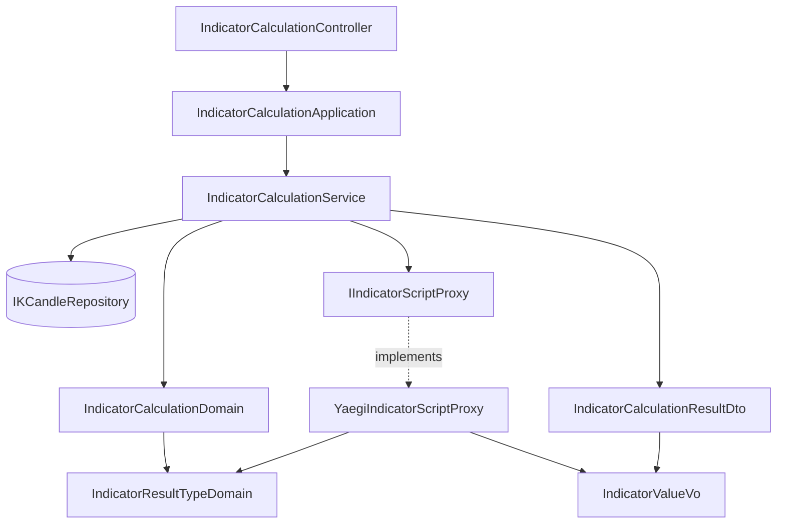

# 指標值的種類可選 — Architecture Design

**Status:** Confirmed
**Source PRD:** `.sdd/2026-09-02-indicator-result-type/PRD.md`
**Tech context:** Go 1.26 · Gin · GORM (Code First) · PostgreSQL · Clean / Onion Architecture · uber-go/mock · traefik/yaegi

---

## 1. Design Goal & Guiding Principle

- **In one sentence:**
  讓一次計算多帶一個「指標值種類」，用它決定算式進入點必須長什麼樣子、
  以及算式產出的值怎麼被收下與回傳；四種種類（`float` / `floatList` / `bool` / `boolList`）
  共用同一條執行路徑。

- **Guiding principle:**
  **不要為四種種類寫四條路。** 把「這個種類是不是一串」與「這個種類裝的是不是數字」
  兩個述詞放進 `IndicatorResultTypeDomain`，執行端只讀這兩個述詞去組出期望的型別、
  再依同一段程式把產物收成 `IndicatorValueVo`。
  於是新增第五種種類（例如「一串時間」）是**加一個常數與它的兩個述詞**，
  而不是在直譯器那一側再多開一個 `switch` 分支。

---

## 2. Change Scope

| Area | Action | What / Why |
| :--- | :--- | :--- |
| `internal/domain/models/vo/indicator_result_type_vo.go` | **Add** | 指標值種類的四個合法取值本身（具名字串型別＋四個常數）。不可變、無行為 |
| `internal/domain/models/vo/indicator_value_vo.go` | **Add** | 一個指標的值，執行端產出的形狀：是不是一串，加上內容（數字串列或是非串列其中之一）。以 `ToDto()` 交棒出去 |
| `internal/domain/models/dto/indicator_value_dto.go` | **Add** | 同一個值離開 domain 的形狀，並負責把自己寫成正確的 JSON（一串寫成陣列，否則寫成值本身）。**與 VO 分成兩個型別是相依方向逼出來的**：`vo` 已經匯入 `dto`（`MarketKCandleVo.ToWriteDto`），`dto` 不能反過來認識 `vo` |
| `internal/domain/models/domains/indicator_result_type_domain.go` | **Add** | 指標值種類的**全部行為**：解讀使用者宣告的字串（去空白、大小寫寬容、空字串視為 `float`、不認得即拒絕）、`IsList()` / `HoldsNumbers()` 兩個述詞、以及對外說明算式該回傳什麼形狀 |
| `internal/domain/models/domains/indicator_calculation_domain.go` | **Modify** | 建構時多驗一項：指標值種類。驗過的種類由它持有並對外提供，讓「一次計算請求的規則」仍集中在同一個地方 |
| `internal/domain/models/dto/indicator_calculation_request_dto.go` | **Modify** | 多一個欄位承接使用者宣告的原始字串（未解讀） |
| `internal/domain/models/dto/indicator_calculation_result_dto.go` | **Modify** | 值的形狀由 `map[string]float64` 改為 `map[string]IndicatorValueDto`，並多回傳這次的指標值種類（以字串承載，同上，`dto` 無法認識 `vo` 的具名型別） |
| `internal/domain/interface/i_indicator_script_proxy.go` | **Modify** | 契約多收一個「已驗過的指標值種類」，回傳改為 `map[string]IndicatorValueVo` |
| `internal/infrastructure/script/yaegi_indicator_script_proxy.go` | **Modify** | 依種類的兩個述詞組出期望的進入點型別（`reflect`）、比對形式、並以同一段程式把產物收成指標值 |
| `internal/domain/service/indicator_calculation_service.go` | **Modify** | 把驗過的種類交給執行端，並把種類放進結果 |
| `internal/controller/models/indicator_calculation_request.go` | **Modify** | 請求內文多一個 `resultType` 欄位（可省略） |
| `internal/domain/interface/mocks/mock_i_indicator_script_proxy.go` | **Modify** | 契約改了就重新產生 |
| `README.md` · `postman/` | **Modify** | 補上新欄位與四種種類的範例算式 |
| `IndicatorCalculationApplication` · `IndicatorCalculationController` | **Not touched** | 兩者都只是把 DTO 往下傳、把哨兵錯誤對映成狀態碼；新欄位隨 DTO 流過，狀態碼分類也沒變 |
| 取 K 線的規則（`SelectInputCandles`、`CandleFetchCount`） | **Not touched** | 種類與取哪幾根 K 線完全無關 |
| **資料庫 schema** | **Not touched** | 結果仍不留存 |
| `internal/config/` | **Not touched** | 沒有新的設定值；四種種類是寫死的業務集合，不是可調參數 |

---

## 3. New Classes / Modules

| Name | Kind | Responsibility (purpose) | Collaborators | Satisfies (PRD scenario) |
| :--- | :--- | :--- | :--- | :--- |
| `IndicatorResultTypeVo` | VO | 指標值種類的四個合法取值（`float` / `floatList` / `bool` / `boolList`）。具名字串型別，不可變、無行為 | — | US-01 全部 |
| `IndicatorResultTypeDomain` | Domain Model | 種類的**唯一行為所在地**：解讀宣告字串（空字串→`float`、去空白與大小寫寬容、不認得→驗證錯誤）；`IsList()`／`HoldsNumbers()` 兩個述詞；`ScriptResultShape()` 供錯誤訊息說明算式該回傳什麼 | `IndicatorResultTypeVo` | US-01「不在四種之內」、US-02、US-03 |
| `IndicatorValueVo` | VO | 一個指標的值，執行端產出的形狀：是不是一串 ＋ 數字串列或是非串列（其中一個必為空）。一個值與一串值存法相同，第一格就是那個值 | `IndicatorValueDto` | US-01 全部、US-04 全部 |
| `IndicatorValueDto` | DTO | 同一個值離開 domain 的形狀，並把自己寫成正確的 JSON——一串寫成陣列，否則寫成值本身 | — | US-01 全部、US-04 全部 |

**刻意不建立的類別**

- **沒有「每一種種類一個執行器」。** 四種的差別完全可以由兩個述詞表達，
  為它們各開一個型別會得到四個幾乎一樣的空殼，並把新增種類的成本從「一個常數」抬高到「一個型別」。
- **沒有 `IndicatorResultDomain`。** 「空的一組結果合法」與「空的一串合法」都是**不做檢查**，
  不需要程式碼。

**Depth check（deep-module 診斷）**

- 呼叫端（service）完成一次計算仍只呼叫一次執行端，不必依序呼叫多個方法。
- 呼叫端**不需要知道**種類怎麼被比對、產物怎麼被讀出來——`reflect` 完全不外洩。
- 新增一種種類**不需要改任何呼叫端**：述詞驅動，執行端一行不動。
- `IIndicatorScriptProxy` 從兩個參數變三個，這是**刻意接受的成本**：
  替代方案是把三者包成一個輸入 DTO，但 `dto` 套件已被 `domains` 匯入，
  再讓它反過來認識 `domains`（種類的行為住在那裡）會形成循環相依。
  三個參數、且三者都是這次執行不可或缺的輸入，仍在可接受範圍。

---

## 4. Modified Components

| Component | Current role | Change needed |
| :--- | :--- | :--- |
| `IndicatorCalculationDomain` | 一次計算請求的不變量（根數、排除最新一根、足量） | 建構時多解讀並驗證指標值種類；持有它並以 `ResultType()` 對外提供。**驗證順序**：交易標的 → 根數 → 上限 → 種類，讓既有情境的錯誤訊息一字不變 |
| `IndicatorCalculationRequestDto` | 進 domain 的形狀 | 多一個 `ResultType string`（使用者宣告的原始字串，未解讀） |
| `IndicatorCalculationResultDto` | 出 domain 的形狀 | `Values` 改為 `map[string]vo.IndicatorValueVo`；新增 `ResultType vo.IndicatorResultTypeVo` |
| `IIndicatorScriptProxy` | 執行算式的能力契約 | `Execute(script, resultType, kCandles) (map[string]vo.IndicatorValueVo, error)` |
| `YaegiIndicatorScriptProxy` | 以直譯器執行算式 | 由述詞組出期望的進入點型別並比對；呼叫仍走直譯器（逾時保護不變）；產物以 `reflect` 走訪一次收成指標值 |
| `IndicatorCalculationService` | 用例入口 | 把 `calculationDomain.ResultType()` 傳給執行端；把種類放進結果 DTO |
| `IndicatorCalculationRequest` | 端點接收的 JSON 內文 | 多一個 `resultType`，**可省略**（省略即 `float`，既有呼叫端不受影響） |

---

## 5. Component Relationships

---

## 6. Extensibility & Handoff Notes

- **Most likely next requirement:** 再多一種指標值種類（最可能是「一串時間」或「一個文字」），
  或是「同一次計算裡每個指標各自宣告種類」。
- **Where it lands:**
  - 多一種種類 → `IndicatorResultTypeVo` 加一個常數、`IndicatorResultTypeDomain` 的解讀表加一列、
    兩個述詞各補一句。若新種類裝的既不是數字也不是是非，才需要在 `IndicatorValueVo` 多一個串列欄位。
  - 每個指標各自宣告 → 值**已經各自帶著「是不是一串」**，所以序列化那一側不必改；
    要改的是「內容是數字還是是非」也得跟著逐值走，以及宣告從哪裡來
    （從一次計算改成算式自己表達）。
- **How to add it:** 加常數與述詞，不要在 `YaegiIndicatorScriptProxy` 裡開 `switch`。
  直譯器那一側一旦出現對種類的分支，這個設計就開始腐爛。
- **Patterns applied & why:** 以**述詞驅動**取代型別分派——四種種類的差異只有兩個維度
  （是不是一串、裝的是不是數字），用兩個 `bool` 表達比用四個型別誠實，也讓新增成本最低。
- **Do not hardcode:** 不要在執行端寫死任何一種種類的名字或它的 Go 型別字串；
  一律由 `IndicatorResultTypeDomain` 提供。
- **Known debt / deferred:**
  - 「一串」沒有長度上限；等真的撞到過大的結果再加，屆時上限屬於**請求的規則**，
    應該落在 `IndicatorCalculationDomain`，不是執行端。
  - 種類的解讀採大小寫寬容，但回傳一律是正規化後的值；若日後需要嚴格比對，只改解讀那一處。

---

## 7. Traceability

| PRD Scenario | Fulfilled by |
| :--- | :--- |
| 宣告一個數字 / 一串數字 / 一個是非 / 一串是非 | `IndicatorResultTypeDomain`（述詞）＋ `YaegiIndicatorScriptProxy`（比對與收下）＋ `IndicatorValueVo`（回傳形狀） |
| 宣告的種類不在四種之內 | `IndicatorResultTypeDomain` 解讀失敗 → `IndicatorCalculationDomain` 回傳驗證錯誤 |
| 完全沒有宣告種類 | `IndicatorResultTypeDomain` 解讀空字串為 `float` |
| 宣告一個數字卻產出一串 / 宣告一串是非卻產出數字 | `YaegiIndicatorScriptProxy` 進入點型別比對失敗 → 算式失敗錯誤，訊息含 `ScriptResultShape()` |
| 算式什麼都沒放進結果 | `YaegiIndicatorScriptProxy` 空產物回空的一組值 |
| 某個指標對應到空的一串 | `IndicatorValueDto` 空串列序列化為空陣列 |
| 算出「否」不等於沒有值 | `IndicatorValueDto` 以是非串列承載，`false` 照常寫出 |
| 根數不大於零 / 可用根數不足 / 取用的 K 線與種類無關 | `IndicatorCalculationDomain`（既有規則，驗證順序保證訊息不變） |

---

## 8. Risks & Open Decisions

- **Risks / trade-offs:**
  - 值有 VO 與 DTO 兩個幾乎一樣的型別。這不是設計偏好，是既有相依方向（`vo` → `dto`）
    的結果；把它併成一個就得反轉那個方向，代價遠大於一個三欄位的轉換。
  - 以 `reflect` 組出期望的進入點型別，比四段寫死的型別斷言難讀一些；
    換來的是新增種類不必動執行端。這是刻意的取捨，並以測試涵蓋四種種類的比對結果。
  - 值同時帶著數字串列與是非串列，其中一個必為空。
    以「值自己知道怎麼被寫出來」換取序列化的自足性；不變量寫在型別註解裡，由建構點保證。
- **Open decisions (for implementation):**
  - 種類解讀的寬容度以「去前後空白 ＋ 大小寫不敏感」為準。
  - 結果中的值為空時一律寫出 `{}` 而非 `null`（沿用現行行為）。
