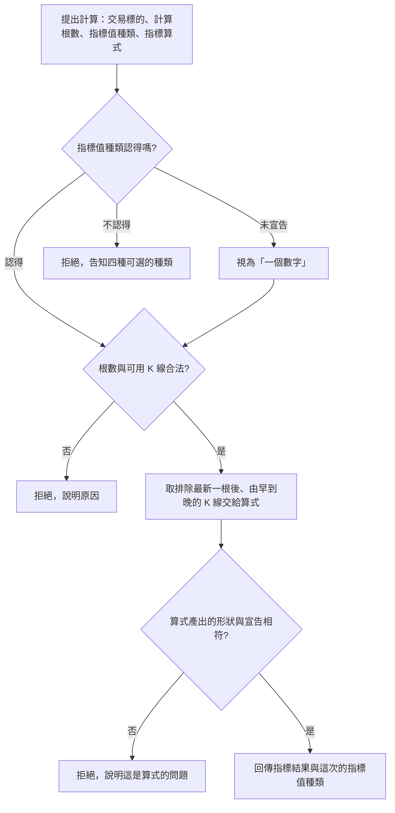

# Product Requirements Document (PRD) — 指標值的種類可選

**Status:** Finalized
**Version:** v1.0
**Owner:** James Hsueh
**Stakeholders:** 專案作者本人（同時是使用者、開發者與審查者）

---

## 1. Background & Goal (Why & Goal)

- **Problem Statement:** 目前不論算式在算什麼，系統一律只收下**數字**：每個指標名稱後面必須是一個數字。
  但指標天生不只有一種形狀——「黃金交叉發生了嗎」的答案是**是或不是**，用 1 和 0 表達會把意思弄丟；
  「這五十根各自的均值」是**一整串數字**，現在只能拆成五十個指標名稱硬塞。
  形狀對不上時，使用者得先在算式裡把值扭曲成數字，讀結果的人再扭回來。
- **Expected Outcome:** 使用者能在送出計算時宣告「這次算式產出的值是哪一種」，
  系統依宣告驗收算式的產物，並在回傳結果時說明這次的值屬於哪一種。
  四種形狀（一個數字、一串數字、一個是非、一串是非）都能原樣送回，不必再扭曲。
  既有的使用方式一行都不必改。
- **Out of Scope:** 同一次計算裡混用多種種類；文字、時間、K 線本身等其他種類的值；
  把宣告的種類與算式一起存成具名指標；依種類做後續判讀（例如把是非變成買賣訊號）；
  操作介面上如何選擇種類。

---

## 2. User Personas

- **Primary Role(s):** 策略研究者（專案作者本人）——同時是算式的作者與結果的讀者。
- **Usage Context:** 本機執行，透過既有的計算入口送出請求。通常會連續試很多次：
  改算式 → 執行 → 看值 → 再改；種類多半在一開始就決定，之後整輪不動。

---

## 3. User Stories & Acceptance Criteria

### US-01 — 宣告這次算出的值是哪一種 [priority: P0]

**As a** 策略研究者, **I want** 在送出計算時宣告這次算式產出的值是哪一種,
**so that** 是非就是是非、一整串就是一整串，不必為了遷就系統把值扭曲成數字。

```gherkin
Scenario: 宣告一個數字
  Given 使用者宣告這次的指標值種類是「一個數字」
  And 算式為「均價」算出 110
  When 使用者執行計算
  Then 結果中「均價」為 110
  And 結果說明這次的指標值種類是「一個數字」

Scenario: 宣告一串數字
  Given 使用者宣告這次的指標值種類是「一串數字」
  And 算式為「均線」算出 100、105、110
  When 使用者執行計算
  Then 結果中「均線」依序為 100、105、110
  And 結果說明這次的指標值種類是「一串數字」

Scenario: 宣告一個是非
  Given 使用者宣告這次的指標值種類是「一個是非」
  And 算式為「黃金交叉」算出「是」
  When 使用者執行計算
  Then 結果中「黃金交叉」為「是」
  And 結果說明這次的指標值種類是「一個是非」

Scenario: 宣告一串是非
  Given 使用者宣告這次的指標值種類是「一串是非」
  And 算式為「逐根收紅」算出「是」、「否」、「是」
  When 使用者執行計算
  Then 結果中「逐根收紅」依序為「是」、「否」、「是」
  And 結果說明這次的指標值種類是「一串是非」

Scenario: 宣告的種類不在四種之內
  Given 使用者宣告這次的指標值種類是「一個文字」
  When 使用者執行計算
  Then 計算被拒絕，並告知可選的種類只有一個數字、一串數字、一個是非、一串是非
  And 不回傳任何指標值
```

### US-02 — 沒有宣告時沿用既有行為 [priority: P0]

**As a** 既有的使用者, **I want** 不宣告種類時系統的行為與過去完全一致,
**so that** 我手上跑得好好的請求不必為了這個新能力改寫。

```gherkin
Scenario: 完全沒有宣告種類
  Given 使用者沒有宣告任何指標值種類
  And 算式為「均價」算出 110
  When 使用者執行計算
  Then 系統視為宣告「一個數字」
  And 結果中「均價」為 110
  And 結果說明這次的指標值種類是「一個數字」
```

### US-03 — 形狀不符時知道要改的是算式 [priority: P0]

**As a** 策略研究者, **I want** 算式產出的形狀與宣告不符時被明確告知,
**so that** 我知道要改的是算式或宣告，而不是回頭懷疑根數填錯。

```gherkin
Scenario: 宣告一個數字卻產出一串
  Given 使用者宣告這次的指標值種類是「一個數字」
  And 算式產出的是一串數字
  When 使用者執行計算
  Then 計算被拒絕，並說明這是算式的問題：宣告的是一個數字，算式卻產出一串
  And 不回傳任何指標值

Scenario: 宣告一串是非卻產出數字
  Given 使用者宣告這次的指標值種類是「一串是非」
  And 算式產出的是一個數字
  When 使用者執行計算
  Then 計算被拒絕，並說明這是算式的問題：宣告的是一串是非，算式卻產出數字
  And 不回傳任何指標值
```

### US-04 — 空的結果與空的一串都算數 [priority: P1]

**As a** 策略研究者, **I want** 「什麼都沒算出來」與「算出一串但裡面沒有值」都被當成正常結果,
**so that** 條件不成立的那幾次不會被誤報成失敗。

```gherkin
Scenario: 算式什麼都沒放進結果
  Given 使用者宣告這次的指標值種類是「一串數字」
  And 算式沒有放進任何指標名稱
  When 使用者執行計算
  Then 回傳空的一組結果，不視為錯誤
  And 結果說明這次的指標值種類是「一串數字」

Scenario: 某個指標對應到空的一串
  Given 使用者宣告這次的指標值種類是「一串數字」
  And 算式放進「均線」，但那一串裡沒有任何值
  When 使用者執行計算
  Then 結果中「均線」是空的一串，不視為錯誤

Scenario: 算出「否」不等於沒有值
  Given 使用者宣告這次的指標值種類是「一個是非」
  And 算式為「黃金交叉」算出「否」
  When 使用者執行計算
  Then 結果中「黃金交叉」為「否」
  And 「黃金交叉」不會從結果中消失
```

### US-05 — 宣告種類不影響其餘既有規則 [priority: P0]

**As a** 策略研究者, **I want** 取 K 線、根數限制等既有規則在任何種類下都一樣,
**so that** 我不必去記「哪一種種類會有不一樣的規則」。

```gherkin
Scenario: 根數不大於零仍先被擋下
  Given 使用者宣告這次的指標值種類是「一串數字」
  And 使用者要求用 0 根計算
  When 使用者執行計算
  Then 計算被拒絕，並告知計算根數必須大於零

Scenario: 可用根數不足仍先被擋下
  Given 使用者宣告這次的指標值種類是「一個是非」
  And 該交易標的排除最新一根後只剩 9 根，使用者要求 30 根
  When 使用者執行計算
  Then 計算被拒絕，並告知目前可用 9 根

Scenario: 取用的 K 線與種類無關
  Given 使用者宣告這次的指標值種類是「一串數字」
  And 該交易標的共有四根 K 線，使用者要求用 3 根
  When 使用者執行計算
  Then 算式拿到排除最新一根之後、由早到晚的三根 K 線
```

---

## 4. Business Flow & Logic



- **Core Business Rules:**
  - **四選一**：指標值種類只有一個數字、一串數字、一個是非、一串是非四種，宣告其他一律拒絕。
  - **預設是一個數字**：沒有宣告時視為「一個數字」，行為與這個切片之前完全相同。
  - **一次一種**：同一次計算裡所有指標的值都是同一種；需要不同種類請分成不同次計算。
  - **依宣告驗收**：算式產出的形狀必須與宣告一致，不一致即拒絕整次計算。
  - **形狀不符是算式的問題**：與根數填錯（請求的問題）分開呈現，因為使用者的下一步不同。
  - **結果自帶種類**：回傳結果時一併說明這次的指標值種類，讀結果的人不必回頭去看自己送了什麼。
  - **空的仍合法**：空的一組結果、以及某個名稱對應到空的一串，都是正常結果而非錯誤。
  - **其餘不變**：取 K 線、排除最新一根、根數上限、算式允許時間與可用運算範圍全部沿用現行規則。
- **Edge Cases:**
  - 宣告的種類大小寫或前後有空白：屬於實作層面的寬容度，業務上只要求「認得就是認得，不認得就拒絕」。
  - 算式產出的形狀不符時，即使部分名稱的形狀是對的，也不回傳任何部分結果。

---

## 5. UI/UX Design & Interaction

本切片不含畫面。使用者透過既有的計算入口多送一項「指標值種類」；
如何在畫面上選擇它屬於操作介面那一側的切片。

---

## 6. Non-Functional Requirements

- **Performance:** 與現行計算相同；宣告種類不增加額外的資料讀取。
- **Security:** 算式仍在沙箱中執行，可用的運算範圍不因種類而放寬。
- **Compatibility:** **既有請求不得受影響**——沒有宣告種類的請求，行為與結果形狀與過去一致。
- **Analytics / Tracking:** 無。

---

## 7. Dependencies & Risks

- **External Dependencies:** 無新增。
- **Known Risks:**
  - 算式的形狀不符所產生的訊息來自執行環境，可能相當技術性；系統負責標明「這是算式的問題」，
    並明確說出宣告的是哪一種。
  - 「一串」目前沒有長度上限，極端的算式可能產出很大的一組結果；待實際使用後再檢視是否需要限制。

---

## 8. Appendix

- 需求共識：[BRIEF.md](BRIEF.md)
- 通用語言：[../UL-MAP.md](../UL-MAP.md)
- **Open Decisions 的裁決**：
  1. 「一串」的長度**這次不設上限**——目前沒有實際撞到的案例，設一個猜出來的數字只會提早說謊。
  2. 混用種類**留給未來**：現在的宣告掛在「一次計算」上，未來要改成掛在「每個指標」上時，
     既有的宣告仍可作為整批的預設值，擴充得下去。
