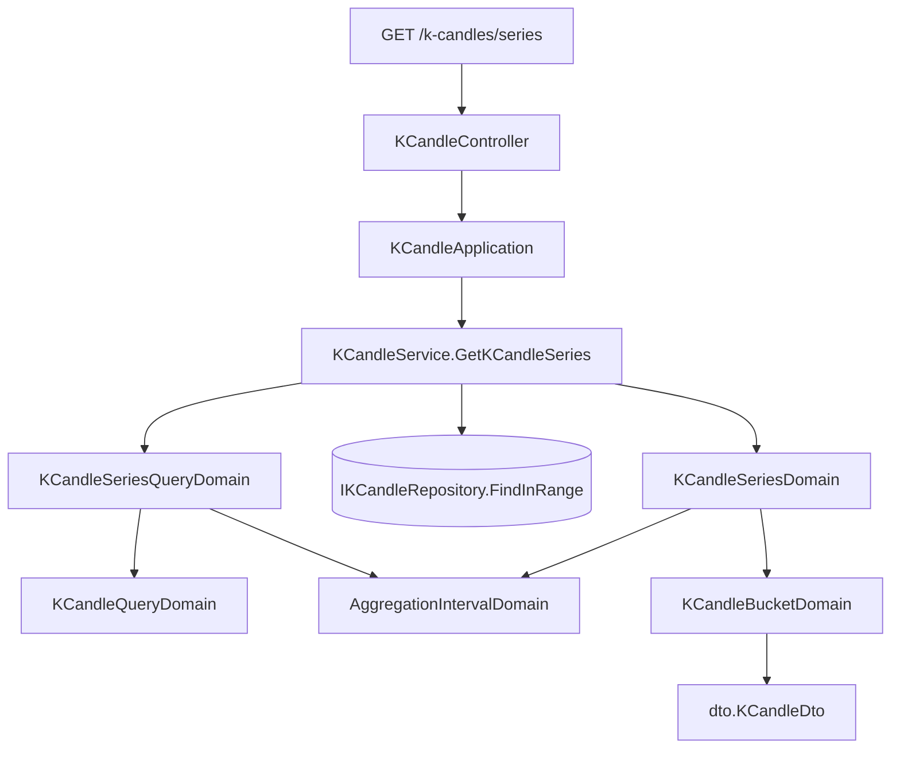

# 彙總 K 線序列 — Architecture Design

**Status:** Confirmed
**Source PRD:** `.sdd/2026-09-02-k-candle-aggregated-series/PRD.md`
**Tech context:** Go · Gin · GORM · Clean Architecture（Controller → Application → Domain ← Infrastructure）

---

## 1. Design Goal & Guiding Principle

- **In one sentence:**
  讓 `GET /k-candles/series` 能收下「交易標的 + 查詢區間 + 彙總刻度」，
  把該區間內的 K 線依刻度合併成一串較粗的 K 線回覆，且回覆根數必定落在單次查詢筆數上限之內。

- **Guiding principle:**
  **把「刻度」變成一個會自己回答問題的領域物件。**
  彙總這件事只有兩個知識點：一段時間屬於哪一個刻度區間，以及一個刻度區間裡的幾根怎麼併成一根。
  前者全部收進 `AggregationIntervalDomain`（它自己知道怎麼對齊、切幾格、要讀幾根原始資料），
  後者全部收進 `KCandleBucketDomain`（它自己知道開高低收量怎麼算）。
  於是 service 只做三件事：驗條件、取資料、交給序列自己轉成 DTO——
  沒有任何一行 `switch interval`，多支援一種刻度就是在清單裡多寫一列。

---

## 2. Change Scope

| Area | Action | What / Why |
| :--- | :--- | :--- |
| `domain/models/vo` | **Add** | `AggregationIntervalVo`——彙總刻度這個值本身（五個常數），不可變、無行為 |
| `domain/models/domains` | **Add** | `AggregationIntervalDomain`（刻度的行為）、`KCandleSeriesQueryDomain`（彙總查詢條件的不變式）、`KCandleSeriesDomain`（整段序列）、`KCandleBucketDomain`（一個刻度區間的合併規則） |
| `domain/models/dto` | **Add** | `KCandleSeriesQueryDto`（收）、`KCandleSeriesDto`（回） |
| `domain/service/k_candle_service.go` | **Modify** | 新增 `GetKCandleSeries` 這一個 use case；既有四個 use case 一行不動 |
| `application/k_candle_application.go` | **Modify** | 新增對應的一行轉呼叫 |
| `controller/k_candle_controller.go` | **Modify** | 新增 `GetKCandleSeries` handler，沿用既有的 `respondWithError` 狀態碼對映 |
| `cmd/server/dependencies.go` | **Modify** | 掛上 `GET /k-candles/series` 這一條路由 |
| `domain/interface/i_k_candle_repository.go` | **Not touched** | 彙總查詢重用既有的 `FindInRange`——彙總查詢條件內含一組一般的區間查詢條件，取資料的問題早就有答案了 |
| `entities.KCandle` 與資料表 | **Not touched** | 彙總不落地、不快取，沒有任何 schema 變更 |
| 指標計算 | **Not touched** | 指標仍吃原始的五分鐘 K 線，取數路徑完全不變 |
| 既有 `GET /k-candles` | **Not touched** | 表格查詢要的是可編輯的原始 K 線；把彙總混進同一條路由會讓回覆的每一根不知道自己能不能被修改 |

---

## 3. New Classes / Modules

| Name | Kind | Responsibility (purpose) | Collaborators | Satisfies (PRD scenario) |
| :--- | :--- | :--- | :--- | :--- |
| `vo.AggregationIntervalVo` | Value Object | 彙總刻度這個值本身：`5m`／`15m`／`1h`／`4h`／`1d`。不可變、無行為 | — | 五種以外的彙總刻度一律拒絕 |
| `domains.AggregationIntervalDomain` | Domain Model | 一種彙總刻度懂的所有事：怎麼讀進來（含未指定時的預設）、涵蓋多長、某個時間屬於哪個刻度區間的起點、一段區間切出幾格、切這麼多格要讀進幾根原始 K 線 | `vo.AggregationIntervalVo` | 未指定彙總刻度時視為五分鐘／五種以外一律拒絕／一天的刻度自零點切分／查詢區間的起訖不必對齊刻度區間 |
| `domains.KCandleSeriesQueryDomain` | Domain Model | 一組彙總查詢條件的不變式：交易標的、起訖、刻度都合法，且切出的格子數沒有超過上限。實例存在就代表可以去取資料了 | `KCandleQueryDomain`、`AggregationIntervalDomain` | 恰好等於上限正常回覆／超過上限整次拒絕／未指定交易標的／結束早於開始／起訖同一時點 |
| `domains.KCandleBucketDomain` | Domain Model | 一個刻度區間裡的幾根 K 線怎麼併成一根：開盤取最早、收盤取最晚、最高取最高、最低取最低、四項成交數字加總 | `entities.KCandle`、`dto.KCandleDto` | 同一刻度區間合併成一根／只有一根時價量原樣／五分鐘刻度等同不合併 |
| `domains.KCandleSeriesDomain` | Domain Model | 一整段序列：把取回的 K 線分進各自的刻度區間、丟掉沒有資料的區間、依起始時間由早到晚排好 | `KCandleBucketDomain`、`AggregationIntervalDomain` | 跨刻度區間分屬不同根／中間整段沒資料不產出／整段沒資料回空序列／序列由早到晚 |
| `dto.KCandleSeriesQueryDto` | DTO | application 交給 domain 的彙總查詢輸入形狀 | — | （全部） |
| `dto.KCandleSeriesDto` | DTO | 一次彙總查詢的回覆形狀：交易標的、這次用的彙總刻度、由早到晚的彙總 K 線 | `dto.KCandleDto` | （全部） |

> 深度檢查：呼叫端要完成「取一段彙總行情」只需要兩次呼叫——建一個查詢條件、交給 service。
> 沒有任何一步需要呼叫端自己算對齊、自己算上限、自己排序。

---

## 4. Modified Components

| Component | Current role | Change needed |
| :--- | :--- | :--- |
| `service.KCandleService` | K 線的唯一入口，持有單次查詢筆數上限 | 新增 `GetKCandleSeries(dto.KCandleSeriesQueryDto) (dto.KCandleSeriesDto, error)`：建查詢條件 → `FindInRange` → 包成 `KCandleSeriesDomain` → `ToDto`。與既有四個 use case 互不呼叫 |
| `application.KCandleApplication` | 用例編排，一個方法一次 domain 呼叫 | 新增同名一行轉呼叫 |
| `controller.KCandleController` | HTTP 轉換 | 新增 `GetKCandleSeries`：讀 `symbol` / `startTime` / `endTime` / `interval` 四個查詢參數，時間格式不對回 400，其餘交給既有的 `respondWithError`（驗證錯 400、其他 502） |
| `cmd/server/dependencies.go` | 組裝根 | 掛 `GET /k-candles/series`。它與 `GET /k-candles/:symbol/:openTime` 同層但為靜態節點，路由樹不衝突 |

---

## 5. Component Relationships

---

## 6. Extensibility & Handoff Notes

- **Most likely next requirement:** 再多一種彙總刻度（三十分鐘、一週），或讓圖表一併拿到彙總後的成交量長條。
- **Where it lands:**
  多一種刻度 → `vo` 多一個常數 + `AggregationIntervalDomain` 的可選清單多一列（代號與時長同一列），
  **其他檔案一行都不用改**。刻度的長度必須整除一天，否則對齊基準會漂掉——這條寫在清單旁邊。
  彙總後多帶一個數字 → 只動 `KCandleBucketDomain.ToDto()`。
- **How to add it:** 在 `AggregationIntervalVo` 加一個常數，並在 `selectableAggregationIntervals`
  加一列 `{value, duration}`；不需要新增 `switch`。
  **代號與時長必須在同一列宣告**——初版把它們拆成 map 與 slice 兩個結構要人工同步，
  只加其中一邊會分別得到「新刻度被靜默拒絕」與「除以零 panic」兩種失敗，
  所以現在只剩一個清單，漏掉一半在編譯期就過不了。
- **Patterns applied & why:**
  - **值 + 行為分家**（`Vo` 常數 / `Domain` 行為）——沿用 `IndicatorResultTypeVo` / `IndicatorResultTypeDomain` 已建立的做法，讓「這是什麼」與「它會做什麼」各有一個家。
  - **組合而非繼承**：`KCandleSeriesQueryDomain` 內含一組 `KCandleQueryDomain`，交易標的與起訖的規則因此只寫一次。
- **Do not hardcode:**
  單次查詢筆數上限沿用 `KCandleQueryMaxResults` 設定，不得在彙總這條路徑另寫一個數字。
  原始 K 線的長度沿用 `kCandleIntervalMinutes`，不得在算「要讀幾根」時再寫一次 5。
- **Known debt / deferred:**
  彙總在應用程式內進行（不是在資料庫內），因此刻度愈長、讀進的原始 K 線愈多。
  這是刻意的取捨——合併規則是業務規則，它該住在 Domain Model，不是散在查詢語句裡。
  重新檢視的訊號：單一交易標的的資料量成長到讓一次一天刻度的查詢明顯變慢時。

---

## 7. Traceability

| PRD Scenario | Fulfilled by |
| :--- | :--- |
| 同一個刻度區間內的 K 線合併成一根 | `KCandleBucketDomain.ToDto` |
| 刻度區間內只有一根時，價量原樣呈現 | `KCandleBucketDomain.ToDto` |
| 跨刻度區間的 K 線分屬不同的彙總 K 線 | `KCandleSeriesDomain.ToDto` + `AggregationIntervalDomain.BucketStart` |
| 五分鐘刻度等同不合併 | `AggregationIntervalDomain.BucketStart` + `KCandleBucketDomain.ToDto` |
| 序列依起始時間由早到晚 | `KCandleSeriesDomain.ToDto` |
| 查詢區間的起訖不必對齊刻度區間 | `AggregationIntervalDomain.BucketStart` |
| 落在不同刻度區間的資料不會被查詢區間併在一起 | `AggregationIntervalDomain.BucketStart` + `KCandleSeriesDomain.ToDto` |
| 一天的刻度自世界標準時間的零點切分 | `AggregationIntervalDomain.BucketStart` |
| 中間整段沒有資料時不產出那一根 | `KCandleSeriesDomain.ToDto` |
| 整段區間都沒有資料時回覆空的序列 | `KCandleSeriesDomain.ToDto` |
| 恰好等於上限的區間正常回覆 | `KCandleSeriesQueryDomain` + `AggregationIntervalDomain.BucketCount` |
| 超過上限的區間整次被拒絕 | `KCandleSeriesQueryDomain` |
| 同一段區間改用更長的刻度就落回上限之內 | `AggregationIntervalDomain.BucketCount` |
| 未指定彙總刻度時視為五分鐘 | `AggregationIntervalDomain`（建構子） |
| 五種以外的彙總刻度一律拒絕 | `AggregationIntervalDomain`（建構子） |
| 未指定交易標的 | `KCandleSeriesQueryDomain` → `KCandleQueryDomain` |
| 結束時間早於開始時間 | `KCandleSeriesQueryDomain` → `KCandleQueryDomain` |
| 起訖同一個時點是合法的 | `KCandleSeriesQueryDomain` + `AggregationIntervalDomain.BucketCount` |

---

## 8. Risks & Open Decisions

- **Risks / trade-offs:**
  - 一次彙總查詢最多可能讀進「刻度區間數 × 每個刻度區間的原始根數」根 K 線
    （一天刻度 × 1000 格 ≈ 288,000 根）。以本系統實際持有的資料量而言不會發生，
    但這是設計上接受的成本，換到的是合併規則留在 Domain Model 而不是查詢語句裡。
    **注意讀取上限只是上限，不是預先配置的量**：`KCandleRepository` 的預先配置有自己的天花板
    （`preallocationCeiling`），否則光是一個查空資料庫的請求就會先要走幾十 MB。
  - `GET /k-candles/series` 與 `GET /k-candles/:symbol/:openTime` 同層。
    已確認 Gin 的路由樹允許同層並存靜態節點與參數節點，不會在啟動時衝突。
- **Open decisions:** 無。
