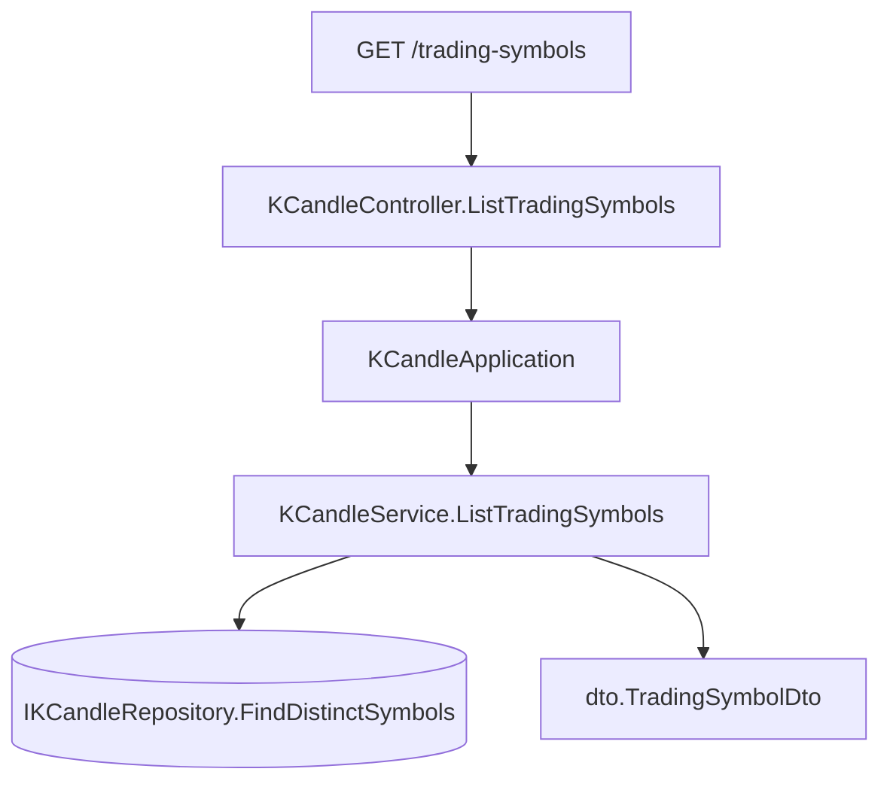

# 可查交易標的清單 — Architecture Design

**Status:** Confirmed
**Source PRD:** `.sdd/2026-09-02-tradable-symbol-list/PRD.md`
**Tech context:** Go · Gin · GORM · Clean Architecture（Controller → Application → Domain ← Infrastructure）

> ## ⚠️ 這份設計已被取代
>
> `.sdd/2026-09-02-trading-symbol-registry/` 把交易標的從「K 線的一欄」升格成 entity，
> 用例也從 `KCandleService` 搬進 `TradingSymbolService`。
> 本檔「把它當成 K 線的一種讀法」的前提已經不成立，保留為當時的設計紀錄。

---

## 1. Design Goal & Guiding Principle

- **In one sentence:**
  讓 `GET /trading-symbols` 回覆系統實際握有 K 線的每一個交易標的，去重、由小到大。

- **Guiding principle:**
  **把它當成 K 線的一種讀法，不是一個新的東西。**
  可查交易標的沒有自己的身分、沒有自己的不變式、也沒有人能單獨新增或刪除它——
  它就是既有 K 線的一個投影。因此不新增 entity、不新增 repository、不新增 service：
  同一個 `IKCandleRepository` 多一個讀法，同一個 `KCandleService` 多一個用例。
  替一份「只有一個名字」的資料開一整層，只會讓下一個人多讀四個檔案才看懂它其實是一欄。

---

## 2. Change Scope

| Area | Action | What / Why |
| :--- | :--- | :--- |
| `domain/models/dto/trading_symbol_dto.go` | **Add** | 清單交出去的形狀。**寫成物件而不是一串字串**：下一個要求幾乎一定是「順便告訴我有幾根 / 最新一根是什麼時候」，物件多一欄是相容的改動，字串陣列改成物件陣列不是 |
| `domain/interface/i_k_candle_repository.go` | **Modify** | 多一個讀法 `FindDistinctSymbols`。K 線是同一個 entity，**不另立第二個 repository** |
| `infrastructure/persistence/k_candle_repository.go` | **Modify** | 以 GORM 的 `Distinct` + `Order` + `Pluck` 取單一欄位的相異值。去重與排序交給資料庫——那正是它擅長的，也讓「順序每次都一樣」有一個明確的負責人 |
| `domain/service/k_candle_service.go` | **Modify** | 多一個用例 `ListTradingSymbols`。與既有五個用例互不呼叫 |
| `application/k_candle_application.go` | **Modify** | 多一行轉呼叫 |
| `controller/k_candle_controller.go` | **Modify** | 多一個 `ListTradingSymbols` handler，沿用既有的 `respondWithError`。**路徑雖然不同（`/trading-symbols`），handler 仍住在這裡**：它問的是 K 線的用例，另開一個只會轉呼叫 `KCandleApplication` 的 controller，只是多一層什麼都不做的東西 |
| `cmd/server/dependencies.go` | **Modify** | 掛 `GET /trading-symbols` |
| `domain/models/entities` | **Not touched** | 可查交易標的沒有自己的欄位、沒有自己的表——它是 `KCandles.symbol` 的相異值，不是一個 entity |
| `domain/models/domains` | **Not touched** | 沒有任何計算、驗證或狀態轉換。硬拉一個 domain model 出來只會是一個空殼 |
| 觀察清單（`IngestionConfig.Symbols`） | **Not touched** | 清單刻意**不**取自它（BR-1）。兩者是不同的問題：一個是「我們握有什麼」，一個是「我們打算追蹤什麼」 |
| 既有的 K 線讀寫與指標計算 | **Not touched** | 一行不動 |

---

## 3. New Classes / Modules

| Name | Kind | Responsibility (purpose) | Collaborators | Satisfies (PRD scenario) |
| :--- | :--- | :--- | :--- | :--- |
| `dto.TradingSymbolDto` | DTO | 一個可查交易標的交出去的形狀 | — | （全部） |

> 只有一個新型別是刻意的結果，不是偷懶：這個切片沒有任何新的規則要保護。
> 去重與排序由資料庫負責、形狀由 DTO 負責、對外由既有的 controller 負責。

---

## 4. Modified Components

| Component | Current role | Change needed |
| :--- | :--- | :--- |
| `IKCandleRepository` | K 線的儲存與讀取 | 加 `FindDistinctSymbols() ([]string, error)`：回傳出現過的交易標的名稱，去重、由小到大。**回傳的是一欄的投影，不是 entity**——半空的 entity 比一串字串更容易被誤用 |
| `KCandleRepository` | GORM 實作 | `Model(&entities.KCandle{}).Distinct().Order(symbol).Pluck("symbol", &symbols)`。走的是 GORM 的型別安全 API，沒有拼接的 SQL 字串 |
| `KCandleService` | K 線的唯一入口 | 加 `ListTradingSymbols() ([]dto.TradingSymbolDto, error)`：讀 → 逐個包成 DTO。名稱到 DTO 的包裝寫在 service 裡，因為來源是一個 `string`，掛不上方法 |
| `KCandleApplication` | 用例編排 | 加一行轉呼叫 |
| `KCandleController` | HTTP 轉換 | 加 `ListTradingSymbols`：沒有任何參數要讀，成功回 200 與陣列，失敗交給既有的 `respondWithError` |
| `cmd/server/dependencies.go` | 組裝根 | 掛 `GET /trading-symbols`。它與 `/k-candles` 是不同的資源，因此是自己的路徑，不掛在 `/k-candles` 底下 |

---

## 5. Component Relationships

---

## 6. Extensibility & Handoff Notes

- **Most likely next requirement:** 清單上每一檔順便帶「有幾根」或「最新一根是什麼時候」。
- **Where it lands:** `TradingSymbolDto` 多一欄，repository 換成一個帶聚合的讀法。
  對外的形狀是**加欄位**，既有的呼叫端不會壞——這正是把它寫成物件而不是字串的理由。
- **How to add it:** 加 DTO 欄位 + 換 repository 那一個方法的實作，不需要新增型別或分支。
- **Patterns applied & why:** 沒有套用任何模式。這個切片的正確答案是「不要多蓋東西」。
- **Do not hardcode:** 排序方向與去重都交給資料庫的 `Order` / `Distinct`，
  不要在 Go 這一側再排一次——兩個地方排序遲早會不一致。
- **Known debt / deferred:**
  - 清單是掃過整張 K 線表得出的相異值，而畫面每打開一次就問一次。
    `KCandles` 已有 `(symbol, open_time)` 的唯一索引，資料庫可以只掃索引，
    以本專案的資料量而言足夠。重新檢視的訊號：這個查詢的時間變得跟區間查詢不在同一個量級時，
    屆時的答案是一張獨立的交易標的表，由寫入時維護。

---

## 7. Traceability

| PRD Scenario | Fulfilled by |
| :--- | :--- |
| 列出握有 K 線的每一個交易標的 | `KCandleRepository.FindDistinctSymbols` + `KCandleService.ListTradingSymbols` |
| 同一個交易標的只出現一次 | `KCandleRepository.FindDistinctSymbols`（`Distinct`） |
| 一根 K 線都沒有時回覆空的清單 | `KCandleService.ListTradingSymbols`（回空 slice 而非 nil）+ `KCandleController` |
| 依名稱由小到大 | `KCandleRepository.FindDistinctSymbols`（`Order`） |
| 再問一次順序不變 | 同上（排序由資料庫負責，不依賴 Go 這側的走訪順序） |
| 設定上要追蹤但還沒有資料的不算 | `KCandleRepository.FindDistinctSymbols`（只讀 `KCandles`，不碰設定） |
| K 線被刪光之後就不再出現 | 同上 |

---

## 8. Risks & Open Decisions

- **Risks / trade-offs:**
  - 每次詢問都掃一次相異值。以目前的資料量與既有索引而言可以接受，
    換到的是「清單永遠等於現況」，不需要任何同步機制。
  - `Pluck` 收的是欄位名稱字串。這是 GORM 指定欄位的方式，不是拼接的 SQL；
    欄位名與 entity 的 `Symbol` 對應，改欄位名時這裡要一起改。
- **Open decisions:** 無。
