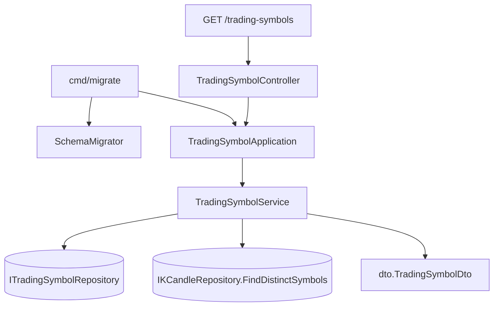

# 交易標的登錄 — Architecture Design

**Status:** Confirmed
**Source PRD:** `.sdd/2026-09-02-trading-symbol-registry/PRD.md`
**Tech context:** Go · Gin · GORM · Clean Architecture（Controller → Application → Domain ← Infrastructure）

---

## 1. Design Goal & Guiding Principle

- **In one sentence:**
  讓 `cmd/migrate` 在建好資料表之後把預設交易標的登錄進 `TradingSymbols`（已登錄的不重複），
  並讓 `GET /trading-symbols` 改答「已登錄的 ∪ 有 K 線的」。

- **Guiding principle:**
  **交易標的從「K 線的一欄」升格成一個 entity，程式的形狀就要跟著升格。**
  上一個切片刻意不替它開 entity、repository、service——當時它確實只是一個投影，
  多開一層只會讓下一個人多讀四個檔案才看懂它其實是一欄。
  現在它有自己的資料表、自己的生命週期（登錄）、自己的不變式（同一個只登錄一次），
  那個理由消失了。於是這個切片把 `ListTradingSymbols` 從 `KCandleService` **搬出來**，
  連同新的登錄用例一起放進 `TradingSymbolService`——
  留在原地會變成「K 線服務負責交易標的的生命週期」，那是下一個人最難猜到的地方。

---

## 2. Change Scope

| Area | Action | What / Why |
| :--- | :--- | :--- |
| `domain/models/entities/trading_symbol.go` | **Add** | 已登錄交易標的。名稱本身就是主鍵——一個市場只會有一列，不需要另一個代理鍵 |
| `domain/interface/i_trading_symbol_repository.go` | **Add** | 一個 entity 一個 repository：`FindAll` 與 `RegisterAll` |
| `infrastructure/persistence/trading_symbol_repository.go` | **Add** | GORM 實作。`RegisterAll` 帶 `OnConflict DoNothing`——**不是**用來取代「先確認在不在」，而是保險：兩個 migrate 同時跑時不該有人因為搶著登錄同一個標的而失敗 |
| `infrastructure/persistence/schema_migrator.go` | **Modify** | 多註冊一個 entity |
| `domain/service/trading_symbol_service.go` | **Add** | 兩個用例：`ListTradingSymbols`（聯集）與 `RegisterDefaultTradingSymbols`（冪等登錄）。跨兩個 entity 的編排，正是 Domain Service 的用途 |
| `application/trading_symbol_application.go` | **Add** | 兩行轉呼叫 |
| `controller/trading_symbol_controller.go` | **Add** | `/trading-symbols` 有自己的 controller。上一個切片把 handler 放進 `KCandleController`，理由是「它問的是 K 線的用例」——現在不是了 |
| `domain/service/k_candle_service.go` | **Modify** | **移除** `ListTradingSymbols` |
| `application/k_candle_application.go` | **Modify** | **移除** `ListTradingSymbols` |
| `controller/k_candle_controller.go` | **Modify** | **移除** `ListTradingSymbols` handler |
| `domain/interface/i_k_candle_repository.go` | **Not touched** | `FindDistinctSymbols` 留著——聯集的另一半仍然要它 |
| `cmd/migrate/main.go` | **Modify** | 建完資料表後呼叫登錄，並印出這次新登錄了哪幾個 |
| `cmd/server/dependencies.go` | **Modify** | 組裝新的 controller，路由字串不變 |
| 觀察清單（`IngestionConfig.Symbols`） | **Not touched** | 登錄與「打算抓什麼」是兩件事。用觀察清單當登錄來源會讓 migrate 的結果隨 `.env` 改變，而 migrate 應該是可預測的 |
| K 線的寫入路徑 | **Not touched** | 存一根 K 線**不會**順便登錄它的交易標的。聯集已經涵蓋這種情況，而在寫入路徑上多掛一次寫，會讓每一根 K 線都多付一次代價 |
| 對外的回覆形狀 | **Not touched** | 仍是 `[{"symbol":…}]`，**前端一行都不用改** |

---

## 3. New Classes / Modules

| Name | Kind | Responsibility (purpose) | Collaborators | Satisfies (PRD scenario) |
| :--- | :--- | :--- | :--- | :--- |
| `entities.TradingSymbol` | Entity | 一個已登錄的交易標的。只有欄位與持久化對應，帶一個 `ToDto()` 形狀轉換 | `dto.TradingSymbolDto` | （全部） |
| `ITradingSymbolRepository` | 介面 | 已登錄交易標的的讀與寫 | — | （全部） |
| `TradingSymbolRepository` | Repository | GORM 實作。`FindAll` 依名稱排序；`RegisterAll` 只寫進來的那些，衝突就跳過 | `entities.TradingSymbol` | 全新的資料庫／重跑不重複／只補缺的 |
| `TradingSymbolService` | Domain Service | 兩個彼此獨立的用例：把兩個來源合成一份清單，以及冪等地登錄預設標的。**先讀出已登錄的、算出還沒登錄的、只寫那些**——「先確認在不在」是業務要求，不是靠資料庫的衝突處理默默達成 | `ITradingSymbolRepository`、`IKCandleRepository` | （全部） |
| `TradingSymbolApplication` | Application | 兩行轉呼叫 | `TradingSymbolService` | （全部） |
| `TradingSymbolController` | Controller | `GET /trading-symbols` | `TradingSymbolApplication` | 清單的六個情境 |

> 深度檢查：`cmd/migrate` 要完成登錄只需要一次呼叫，拿回「這次新登錄了哪幾個」。
> 它不必自己讀、自己比對、自己決定寫哪些。

---

## 4. Modified Components

| Component | Current role | Change needed |
| :--- | :--- | :--- |
| `SchemaMigrator` | 由 entity 產生資料表 | 清單多一個 `&entities.TradingSymbol{}`。**它只管結構，不管資料**——登錄是業務動作，走 domain，不塞進 migrator |
| `cmd/migrate/main.go` | 建立資料表並印出結果 | 建完之後組裝 `TradingSymbolApplication` 並登錄，印出這次新登錄了哪幾個（零個也要說） |
| `cmd/server/dependencies.go` | 組裝根 | `GET /trading-symbols` 改掛到新的 controller |
| `KCandleService` / `KCandleApplication` / `KCandleController` | 上一個切片在這裡加了 `ListTradingSymbols` | 一併移除，連同它們的測試——交易標的的用例現在有自己的家 |

---

## 5. Component Relationships

---

## 6. Extensibility & Handoff Notes

- **Most likely next requirement:** 從介面上登錄或移除一個交易標的，或讓預設清單可設定。
- **Where it lands:**
  登錄／移除 → `TradingSymbolService` 多一個用例 + repository 多一個方法 + controller 多一條路由；
  資料表與聯集規則都不用動。
  可設定 → `defaultTradingSymbols` 換成從 `ApplicationConfig` 讀，只有 `cmd/migrate` 的組裝要改。
- **How to add it:** 加用例，不需要改既有的任何一條分支。
- **Patterns applied & why:** 沒有套用模式。這個切片是把一個概念從「投影」升格成「實體」，
  並把它的用例搬到它自己的家。
- **Do not hardcode:**
  排序交給資料庫與合併時的一次排序，**不要在兩個地方各排一次**。
  預設交易標的只寫在 `TradingSymbolService` 一處。
- **Known debt / deferred:**
  - 已登錄但長期沒有資料的標的會一直在清單上，挑了就是「查無 K 線」。
    這是刻意的取捨（PRD 的 Background 說明了為什麼），目前沒有移除登錄的方式。
    重新檢視的訊號：出現第一個「登錄了但永遠不會有資料」的標的。
  - 清單查詢現在讀兩張表。以本專案的資料量而言不成問題。

---

## 7. Traceability

| PRD Scenario | Fulfilled by |
| :--- | :--- |
| 全新的資料庫 | `TradingSymbolService.RegisterDefaultTradingSymbols` + `cmd/migrate` |
| 重跑一次不會重複登錄 | `TradingSymbolService.RegisterDefaultTradingSymbols`（先讀後比）+ `TradingSymbolRepository.RegisterAll`（`OnConflict DoNothing` 保險） |
| 只補上缺的那一個 | `TradingSymbolService.RegisterDefaultTradingSymbols` |
| 已登錄但還沒有任何資料的也要出現 | `TradingSymbolService.ListTradingSymbols`（聯集的登錄那一半） |
| 有資料但沒登錄過的也要出現 | `TradingSymbolService.ListTradingSymbols`（聯集的 K 線那一半） |
| 兩邊都有的只出現一次 | `TradingSymbolService.ListTradingSymbols`（去重） |
| 依名稱由小到大 | `TradingSymbolService.ListTradingSymbols`（合併後排序一次） |
| 兩邊都空時回覆空的清單 | `TradingSymbolService.ListTradingSymbols` + `TradingSymbolController` |
| 已登錄的市場即使資料被刪光也還在 | `TradingSymbolService.ListTradingSymbols` |

---

## 8. Risks & Open Decisions

- **Risks / trade-offs:**
  - **這個切片推翻了上一個切片的 US-03**，而上一個切片的 `CONTRACT.md` 仍然記載著舊規則。
    兩份文件都保留（各自記錄當時的共識），以本切片為準；本切片的 `CONTRACT.md` 會註明。
  - 把 `ListTradingSymbols` 從 `KCandleService` 搬走會動到上一個切片剛加的測試。
    這是升格的必然代價，換到的是「交易標的的用例住在交易標的的家」。
- **Open decisions:** 無。
