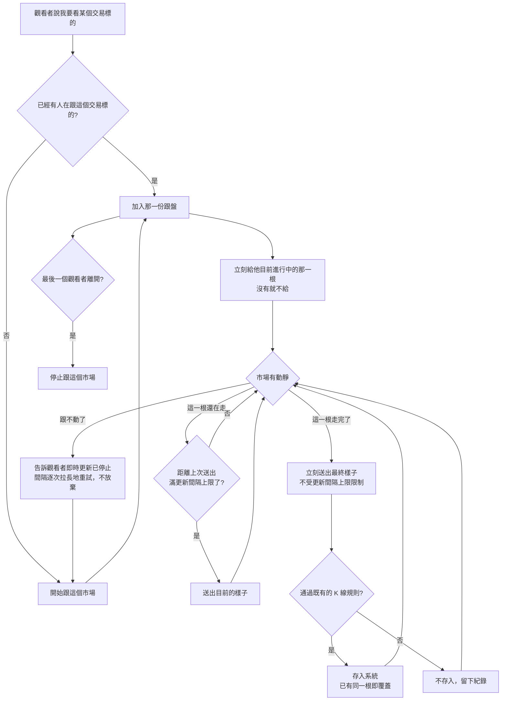

# Product Requirements Document (PRD)

**Feature:** K 線即時跟盤
**Status:** Finalized
**Version:** v1.0
**Owner:** James Hsueh
**Stakeholders:** 後端（go-trading）、前端（go-trading-frontend）

---

## 1. Background & Goal (Why & Goal)

- **Problem Statement:**
  K 線目前只由每五分鐘一輪的自動抓取更新。看盤的人在那五分鐘裡盯著的是一張不會變的圖，
  而市場在同一段時間內已經走完了一整根 K 線的行情。**畫面說的是五分鐘前的事。**

- **Expected Outcome:**
  有人正在看某個交易標的時，系統持續跟著那個市場：最新的那一根一邊成形、畫面一邊跟著動；
  一根走完的當下就被存進系統，不必再等下一輪。即時這條路壞掉時，
  系統退回原本的樣子——新資料五分鐘內出現——而不是讓看盤整個不能做。

- **Out of Scope:**
  - 五分鐘以外的 K 線長度；把更粗的彙總刻度直接跟出來。
  - 補播中斷期間錯過的每一次變動。
  - 把進行中 K 線存起來，或讓指標計算使用它。
  - 從畫面增減觀察清單、執行期間改變觀察清單。
  - 對外提供查看跟盤狀況的功能；跟盤中斷時的主動通知。
  - 成交明細、掛單簿、逐筆報價等 K 線以外的行情。
  - 存取權限與身分驗證。

---

## 2. User Personas

- **Primary Role(s):** 看盤的人（本專案作者本人）——同時也是寫策略、讀指標的人。
- **Usage Context:**
  在一個開著的畫面上長時間盯著某一檔的 K 線走勢，期間會換標的、會縮放。
  市場全天無休，因此「沒有人在看」的時間遠多於「有人在看」。

---

## 3. User Stories & Acceptance Criteria

### US-01 — 有人在看才跟盤 [priority: P0]

**As a** 看盤的人，**I want** 系統在我看某個交易標的時才跟著那個市場，
**so that** 即時的成本只花在真的有人看的時候。

```gherkin
Scenario: 第一個觀看者讓系統開始跟盤
  Given 沒有任何人在看 BTCUSDT
  When 一個觀看者開始看 BTCUSDT
  Then 系統開始跟 BTCUSDT
  And 立刻給他目前進行中的那一根

Scenario: 同一個交易標的多人在看時只跟一次
  Given 已有一個觀看者在看 BTCUSDT
  When 第二個觀看者也開始看 BTCUSDT
  Then 兩人收到同一份跟盤結果
  And 系統跟 BTCUSDT 的份數仍然是一份

Scenario: 還有人在看就繼續跟
  Given 兩個觀看者都在看 BTCUSDT
  When 其中一個離開
  Then 系統繼續跟 BTCUSDT
  And 剩下那個觀看者照常收到更新

Scenario: 最後一個觀看者離開就停止跟盤
  Given 只剩一個觀看者在看 BTCUSDT
  When 他也離開
  Then 系統停止跟 BTCUSDT

Scenario: 不在觀察清單上的交易標的一樣跟得動
  Given SOLUSDT 不在觀察清單上
  When 一個觀看者開始看 SOLUSDT
  Then 系統開始跟 SOLUSDT
  And 他照常收到 SOLUSDT 的更新

Scenario: 換看另一個交易標的就換跟另一個
  Given 一個觀看者正在看 BTCUSDT
  When 他改看 ETHUSDT
  Then 系統停止跟 BTCUSDT 並開始跟 ETHUSDT
  And 他只收到 ETHUSDT 的更新

Scenario: 連線斷掉就算離開
  Given 一個觀看者正在看 BTCUSDT，且他是唯一的觀看者
  When 他的連線斷掉
  Then 系統停止跟 BTCUSDT
```

### US-02 — 看得到正在發生的那一根 [priority: P0]

**As a** 看盤的人，**I want** 看到最新那一根一邊成形一邊動，
**so that** 我知道現在的行情，而不是五分鐘前的。

```gherkin
Scenario: 剛跟上就先給目前進行中的那一根
  Given 一個觀看者剛開始看 BTCUSDT，一次變動都還沒發生
  When 他跟上的當下
  Then 他收到目前進行中的那一根
  And 畫面不必等到下一次變動才有東西可以顯示

Scenario: 剛跟上時那一根還沒有任何成交
  Given 一個觀看者剛開始看 BTCUSDT
  And 目前這五分鐘內該市場還沒有任何成交
  When 他跟上的當下
  Then 他沒有收到進行中的那一根
  And 這不算失敗；第一次成交發生時他就會收到

Scenario: 送出的一律是五分鐘一根
  Given 一個觀看者正在看 BTCUSDT，畫面上顯示的是一小時一根
  When 系統送出更新
  Then 送出的仍是五分鐘一根的 K 線
```

### US-03 — 畫面更新有頻率上限 [priority: P0]

**As a** 看盤的人，**I want** 畫面以看得清楚的節奏更新，
**so that** 它不會為了每一筆成交而忙碌，卻沒讓我多看懂任何事。

```gherkin
Scenario: 十秒內成交上百筆也只送一次
  Given 更新間隔上限為十秒
  And 一個觀看者正在看 BTCUSDT
  When 十秒內該市場成交了上百筆
  Then 這十秒內只送出一次目前的樣子

Scenario: 還沒滿十秒的變動先不送
  Given 更新間隔上限為十秒
  And 距離上次送出只過了兩秒
  When 價格再次變動
  Then 這次變動不送出
  And 等這十秒滿了才送出當時的樣子

Scenario: 一根走完一定送到，不等滿十秒
  Given 更新間隔上限為十秒
  And 距離上次送出只過了兩秒
  When 09:05 那一根走完
  Then 立刻送出這根走完的最終樣子

Scenario: 沒有變動就沒有東西要送
  Given 一個觀看者正在看 BTCUSDT
  When 十秒內該市場一筆成交都沒有
  Then 這十秒內不送出任何東西
```

### US-04 — 進行中的那一根不進系統、也不參與計算 [priority: P0]

**As a** 看盤的人，**I want** 已經留下來的資料不會自己變動，
**so that** 同一支策略在同一個時間點算出來的答案永遠一樣。

```gherkin
Scenario: 進行中的那一根查不到
  Given 現在 09:07，09:05 那一根還在走
  When 查詢 BTCUSDT 的 K 線
  Then 查得到的最新一根是 09:00
  And 09:05 那一根查不到

Scenario: 指標計算不使用進行中的那一根
  Given 現在 09:07，觀看者畫面上看得到 09:05 正在動
  When 執行一次 BTCUSDT 的指標計算
  Then 計算不使用 09:05 那一根
  And 結果與沒有跟盤時完全相同

Scenario: 走完之後就查得到了
  Given 現在 09:11，09:05 那一根已經走完
  When 查詢 BTCUSDT 的 K 線
  Then 09:05 那一根查得到
```

### US-05 — 一根走完就落地 [priority: P0]

**As a** 看盤的人，**I want** 走完的那一根當下就被留下來，
**so that** 系統不必明知道最終數字卻假裝要等五分鐘。

```gherkin
Scenario: 走完的當下就存入
  Given 一個觀看者正在看 BTCUSDT
  When 09:05 那一根走完
  Then 09:05 那一根立刻被存入
  And 不必等下一輪自動抓取

Scenario: 事後修正照樣覆蓋，不會變成兩根
  Given 09:05 那一根已由跟盤存入，收盤價為 100
  And 行情來源事後把它修正為 120
  When 下一輪自動抓取執行
  Then 09:05 的收盤價變為 120
  And 系統內 09:05 仍然只有一根

Scenario: 沒有人在看時由自動抓取補上
  Given 沒有任何人在看 BTCUSDT
  When 09:05 那一根走完
  Then 09:05 那一根由下一輪自動抓取存入
  And 最慢五分鐘內出現在系統裡

Scenario: 跟盤送來的資料違規時不存入
  Given 一個觀看者正在看 BTCUSDT
  And 跟盤送來的 09:05 那一根最高價低於最低價
  When 09:05 那一根走完
  Then 09:05 那一根不被存入
  And 留下一筆紀錄，說明是哪一根、違反了哪一條規則
```

### US-06 — 跟不動的時候 [priority: P0]

**As a** 看盤的人，**I want** 即時停止時畫面明說，
**so that** 我不會照著一張早已停格的圖做決定。

```gherkin
Scenario: 中斷時明說即時更新已經停止
  Given 一個觀看者正在看 BTCUSDT
  When 跟盤中斷
  Then 他的畫面明說即時更新已經停止

Scenario: 系統自己重新跟上，不需要人介入
  Given 跟盤已經中斷
  When 系統重新跟上
  Then 觀看者收到現在的樣子
  And 中斷期間的每一次變動不補播

Scenario: 重試的間隔逐次拉長，且不放棄
  Given 跟盤中斷且來源持續不可用
  When 系統連續重試
  Then 每次重試的間隔比前一次長，最長不超過三十秒
  And 系統不停止重試

Scenario: 中斷期間走完的那幾根不會遺失
  Given 中斷期間 09:05 那一根走完了
  When 觀看者重新整理畫面
  Then 09:05 那一根看得到

Scenario: 即時完全不能用時其他功能照常
  Given 即時跟盤完全不能用
  When 使用系統
  Then K 線的查詢、新增、修改、刪除照常可用
  And 指標計算照常可用
  And 每五分鐘一輪的自動抓取照常執行
  And 新資料仍在五分鐘內出現
```

---

## 4. Business Flow & Logic



**Core Business Rules**

- **跟盤的單位是交易標的**，不是觀看者：同一個交易標的無論多少人在看，系統只跟一份。
- **有人看才跟，最後一個離開就停**。連線斷掉即視為離開，不另做逾時判定。
- **跟的是觀看者要的那一個**，與觀察清單無關。觀察清單管「長期要留下哪些市場的資料」，
  跟盤管「現在誰在看什麼」。
- **進行中 K 線只給觀看者看**：不存入系統、查詢查不到、指標計算不使用。
- **一根走完的當下就存入**，並通過既有的每一項 K 線規則；違規者不存並留下紀錄。
- **重複即覆蓋**（既有規則）：跟盤與自動抓取存到同一根時，後到的覆蓋先到的。
- **每五分鐘一輪的自動抓取不因跟盤而停**：它補上沒人看時走完的每一根，
  並吸收行情來源事後對已收完 K 線的修正。
- **更新間隔上限只節流「目前的樣子」**，不節流「一根走完」——後者是唯一的結論，漏掉沒有第二次。
- **即時是加值不是取代**：即時不可用時，系統退回原本的樣子，既有功能全部照常。

**Edge Cases**

- 剛跟上時該五分鐘內尚無任何成交 → 不給進行中的那一根，不算失敗。
- 十秒內市場毫無動靜 → 不送出任何東西。
- 跟盤送來違規的 K 線 → 該根不存並留下紀錄，跟盤本身繼續。
- 來源持續不可用 → 間隔逐次拉長重試（最長三十秒），不放棄、不需人介入。

---

## 5. UI/UX Design & Interaction

本切片在系統這一側沒有畫面。對觀看者而言只有三種可觀察的狀態，供畫面據以呈現：

- **正在即時更新** —— 持續收到進行中那一根的變動。
- **即時更新已停止** —— 明確告知，不讓一張停格的圖看起來正常。
- **沒有進行中的那一根** —— 這五分鐘尚無成交，畫面照常等待，不是錯誤。

---

## 6. Non-Functional Requirements

- **Performance:**
  進行中那一根的更新**至多每十秒送出一次**（更新間隔上限，可調整，必須大於零）。
  「一根走完」不受此限，一律立即送出。
  同時跟盤的交易標的數量**不設上限**——沿用觀察清單不設上限的既有取捨，
  且個人使用的系統同時在看的標的天生極少。

- **Security:**
  沿用既有取捨——沒有身分驗證與權限控管。跟盤只讀行情、只寫已收完的 K 線，
  不提供任何改變系統設定的進入點。

- **Compatibility:**
  系統這一側不涉及裝置或瀏覽器相容性。對觀看者只保證三種可觀察狀態，
  不規定畫面如何呈現。

- **Analytics / Tracking:**
  不埋任何使用行為追蹤。僅保留跟盤中斷與資料違規的紀錄，供人事後查閱。

---

## 7. Dependencies & Risks

**External Dependencies:**

- **外部行情來源的即時通道** —— 這是系統第一次依賴一條「持續連著」的外部通道，
  而非每五分鐘問一次。它的穩定性、是否限制同時跟盤的數量，都不在本專案掌控之內。

**Known Risks:**

- **來源可能限制同時跟盤的數量。** 本切片刻意不在系統這一側預先擋下，
  超過時的症狀會是「跟不動」，走既有的中斷與重試路徑。
  若日後真的撞到，會表現為某些交易標的持續跟不上而其他正常——屆時再設上限即可。
- **持續連著的通道會安靜地死掉。** 連線看起來還在、卻不再有任何資料，是這類通道的典型故障。
  因此「即時更新已停止」不能只依賴連線中斷的訊號；長時間沒有任何動靜也必須當成跟不動處理。
  但市場真的毫無成交也會長時間沒有動靜，兩者從外面看起來一樣——
  誤判的代價是白重連一次，漏判的代價是使用者盯著停格的圖，因此**寧可誤判**。
- **兩個寫入者寫同一根。** 跟盤與自動抓取可能同時寫入同一根 K 線。
  既有的「重複即覆蓋」讓這件事安全，但也表示**後寫的一定贏**——
  若自動抓取取回的是來源尚未修正完的數字，它會蓋掉跟盤存下的正確值。
  下一輪會再修正回來，因此影響是暫時的。

---

## 8. Appendix

- 需求共識：`BRIEF.md`（同一資料夾）
- 既有的每五分鐘抓取：`.sdd/2026-08-30-k-candle-auto-ingestion/`
- 「進行中 K 線不存入」的由來：同上切片
- 指標只用走完的刻度區間：`.sdd/2026-09-03-strategy-execution-parameters/`
- 通用語言：`.sdd/UL-MAP.md`
