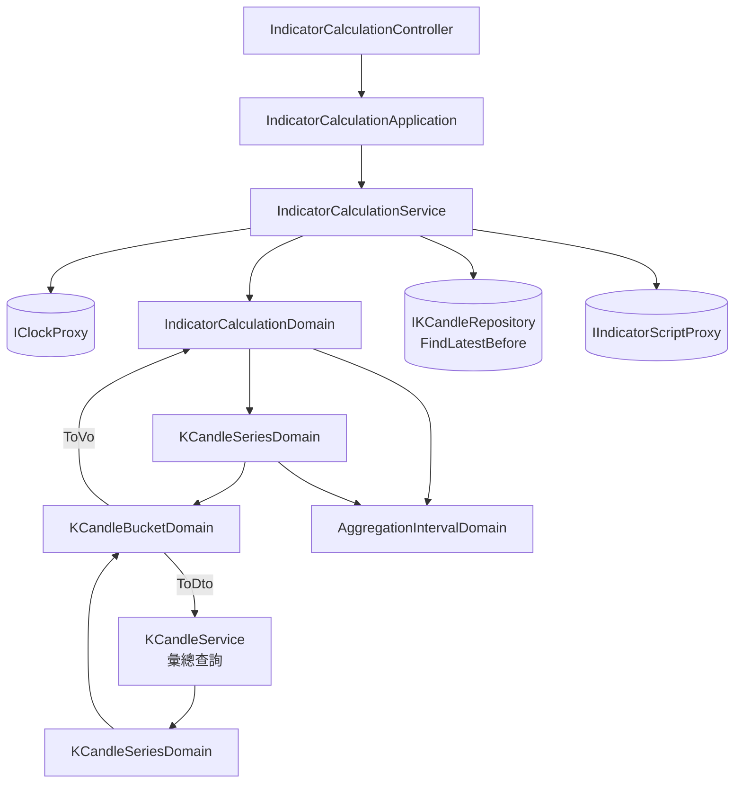

# 策略與執行參數分離 — Architecture Design

**Status:** Confirmed
**Source PRD:** `.sdd/2026-09-03-strategy-execution-parameters/PRD.md`
**Tech context:** Go · Clean / Onion Architecture · Gin · GORM · PostgreSQL · yaegi 指標算式沙箱

---

## 1. Design Goal & Guiding Principle

- **In one sentence:**
  把「要多粗的 K 線、要幾根、算到哪個時間為止」從 `Strategy` 身上拿掉，改由每一次計算請求帶進來；
  指標計算不再直接讀原始五分鐘 K 線，而是走**與彙總查詢完全同一套切格與併格規則**取數，
  並把「這次讀了哪幾根」一併回覆出去。

- **Guiding principle:**
  **切格與併格只能有一份。**
  指標計算與彙總查詢從今天起都要把一堆 K 線變成一串彙總 K 線。
  若各寫一份，兩邊對「一格從哪裡開始」「空格怎麼辦」的看法遲早會分岔——
  而分岔的徵狀是圖上的線靜靜錯開一格，沒有任何錯誤訊息。
  因此本設計把既有 `KCandleSeriesDomain` 內部私有的分組步驟**升為一個具名產物**（`Buckets()`），
  兩條路徑都從它出發：彙總查詢把每一格 `ToDto()`，指標計算把每一格 `ToVo()`。

  第二個原則：**「還沒走完」是刻度區間的性質，不是「最新一根」的性質。**
  舊的 `excludedNewestCandleCount = 1` 是這條規則在五分鐘刻度下的特例。
  新設計不再數「排除幾根」，而是用**讀取截止點**表達它：
  只讀 `openTime < BucketStart(計算截止時間)` 的 K 線，還在走的那一格因此**根本不會被讀進來**。
  規則從「讀完再丟掉」變成「一開始就不讀」，少一個要記得執行的步驟。

---

## 2. Change Scope

| Area | Action | What / Why |
| :--- | :--- | :--- |
| `entities.Strategy` | **Modify** | 移除 `AggregationInterval`、`CandleCount` 兩個欄位與其 `ToDto` 對應 |
| `domains.StrategyDomain` | **Modify** | 移除同兩個欄位、其驗證與 `AggregationInterval()` 存取子；建構子不再需要 `maxCandleCount` |
| `dto.StrategyDto` / `dto.StrategyWriteDto` | **Modify** | 移除同兩個欄位 |
| `models.StrategyRequest` | **Modify** | 移除同兩個欄位——附上也不再有地方可放（PRD US-01「附上取數計畫也不會被記住」） |
| `service.StrategyService` | **Modify** | 建構子移除 `maxCandleCount` 依賴 |
| `persistence.SchemaMigrator` | **Modify** | `AutoMigrate` 不會刪欄位，因此明確刪除 `Strategies` 上那兩個殘欄，不留孤兒 |
| `domains.KCandleSeriesDomain` | **Modify** | 把私有的分組步驟升為公開的 `Buckets()`；`ToDto()` 改為建立在它之上 |
| `domains.KCandleBucketDomain` | **Modify** | 新增 `ToVo()`——同一格既能變成回覆用的 DTO，也能變成算式吃的 VO |
| `domains.IndicatorCalculationDomain` | **Modify** | 收下彙總刻度與計算截止時間；`CandleFetchCount()` 換成 `ReadCutoff()` + `SourceCandleLimit()`；`SelectInputCandles` 改為對**彙總 K 線**取數 |
| `dto.IndicatorCalculationRequestDto` | **Modify** | 新增 `AggregationInterval`、`EndTime` |
| `dto.IndicatorCalculationResultDto` | **Modify** | 新增 `Interval`、`OpenTimes`（US-05） |
| `models.IndicatorCalculationRequest` | **Modify** | 新增 `aggregationInterval`、`endTime` 兩個欄位 |
| `service.IndicatorCalculationService` | **Modify** | 注入 `IClockProxy`（決定「現在」）；改用新的讀取方法 |
| `IKCandleRepository` | **Modify** | 新增 `FindLatestBefore`（見 §4 的理由） |
| `persistence.KCandleRepository` | **Modify** | 實作 `FindLatestBefore` |
| `cmd/server` 組裝根 | **Modify** | `StrategyService` 少一個參數、`IndicatorCalculationService` 多一個 |
| **彙總查詢那條路徑**（`KCandleSeriesQueryDomain`、`GET /k-candles/series`） | **Not touched** | 對外行為一字不變。它只是換成從 `Buckets()` 出發，回覆完全相同 |
| **`KCandleBucketDomain` 的併格規則** | **Not touched** | 開高低收與四項成交數字怎麼併，完全不動——這正是兩條路徑要共用的那份規則 |
| **指標算式沙箱**（`yaegi_indicator_script_proxy`、`indicator_script_shape`） | **Not touched** | 算式收到的仍是 `[]vo.KCandleVo`，形狀一字不變；它不知道那些 K 線是原始的還是併出來的 |
| **自動抓取** | **Not touched** | 仍只抓五分鐘 K 線；更粗的刻度一律由五分鐘併出來 |
| **`FindLatest`** | **Not touched** | 自動抓取仍用它問「目前存到哪一根」。見 §4 |

---

## 3. New Classes / Modules

本切片**不新增任何類別**——這是刻意的結果，也是設計是否對的檢驗。

需要的三樣能力都已經存在，只是被埋在私有步驟裡或形狀不對：

| 能力 | 既有的家 | 本切片做的事 |
| :--- | :--- | :--- |
| 把一堆 K 線切格併格 | `KCandleSeriesDomain`（私有於 `ToDto()` 內） | 升為具名產物 `Buckets()`，兩條路徑共用 |
| 一格變成算式吃的形狀 | `KCandleBucketDomain`（只有 `ToDto()`） | 加一個 `ToVo()`，與 `ToDto()` 並列 |
| 決定「現在」 | `IClockProxy` | 注入指標計算服務 |

若此處硬生出一個 `IndicatorCandleSelector` 之類的新類別，它的參數會全部來自
`IndicatorCalculationDomain`（刻度、根數、截止時間）——那是 Feature Envy，
行為該留在已經持有那些資料的那個模型上。

---

## 4. Modified Components

| Component | Current role | Change needed |
| :--- | :--- | :--- |
| `entities.Strategy` | 策略的儲存形狀 | 刪 `AggregationInterval`、`CandleCount` 欄位與其 `ToDto` 對應 |
| `domains.StrategyDomain` | 策略的全部規則 | 刪那兩樣的驗證與存取子；`NewStrategyDomain(writeDto)` 不再收 `maxCandleCount`。名稱、算式、種類的規則**一字不動** |
| `persistence.SchemaMigrator` | code-first 同步 schema | `AutoMigrate` 之後，若 `Strategies` 仍有 `aggregation_interval` / `candle_count` 欄位就刪掉。**冪等**：已經沒有就什麼都不做 |
| `domains.KCandleSeriesDomain` | 一次彙總查詢讀到的 K 線 + 刻度 | 新增 `Buckets() []KCandleBucketDomain`（依 bucket 起點由早到晚、沒有 K 線的格子不出現）；`ToDto()` 改成 `Buckets()` 逐格 `ToDto()`。**外部行為零變化** |
| `domains.KCandleBucketDomain` | 一格內的 K 線與它們併成的那一根 | 新增 `ToVo() vo.KCandleVo`。併格規則不動 |
| `domains.IndicatorCalculationDomain` | 一次計算請求的不變式＋取數規則 | 見下方展開 |
| `IKCandleRepository` | K 線存取契約 | 新增 `FindLatestBefore(ctx, symbol, cutoffTime, limit)`：`openTime` **嚴格早於** `cutoffTime`、newest first、至多 `limit` 根 |
| `service.IndicatorCalculationService` | 指標計算用例 | 注入 `IClockProxy`；改呼叫 `FindLatestBefore(symbol, domain.ReadCutoff(), domain.SourceCandleLimit())`；回覆多帶刻度與起始時間 |

### `IndicatorCalculationDomain` 的新形狀

```go
// 建構：多收刻度與截止時間，並收下「現在」——domain 不自己讀時鐘
NewIndicatorCalculationDomain(requestDto, maxCandleCount, now) (IndicatorCalculationDomain, error)

// 讀取截止點：只讀 openTime 嚴格早於它的 K 線。
//   = interval.BucketStart(effectiveEndTime)
// 還在走的那一格因此根本不會被讀進來——「排除最新一根」不再需要一個步驟。
ReadCutoff() time.Time

// 讀取上限：(candleCount + 1) 格所能容納的最多原始 K 線根數。
// 多讀一格，是因為讀取被上限截斷時，最舊的那一格可能只讀到一半。
SourceCandleLimit() int

// 選出算式看到的那幾根：切格併格 → 讀取被截斷時丟掉最舊那一格 → 取最靠近截止時間的
// candleCount 格 → 依起始時間由早到晚。湊不滿即拒絕，並說出實際湊得出幾格。
SelectInputCandles(newestFirstKCandles []entities.KCandle) ([]vo.KCandleVo, error)
```

**`effectiveEndTime` 的規則（一行）：** `min(宣告的截止時間或現在, 現在)`。
未指定（零值）取現在；指向未來被夾回現在。US-03 的兩個 Scenario 都由這一行滿足。

**`ReadCutoff` 為什麼不需要分支。**
`BucketStart(endTime)` 永遠是「`endTime` 落入的那一格的起點」，
而那一格的結束一定在 `endTime` 之後（或恰好等於 `endTime` 落在邊界上時的下一格起點），
所以它永遠是還沒走完的那一格的起點。只讀比它早的，剩下的就都是走完的格子：

| 截止時間 | 刻度 | `ReadCutoff` | 最新採用的一格 |
| :--- | :--- | :--- | :--- |
| `08:37` | 一小時 | `08:00` | `07:00` ✓ |
| `08:00`（邊界上） | 一小時 | `08:00` | `07:00` ✓ |
| `08:37` | 五分鐘 | `08:35` | `08:30` ✓（等同舊的排除最新一根） |
| `2025-03-01 14:30` | 一小時 | `14:00` | `13:00` ✓ |

**為什麼多讀一格再丟。**
讀取以「最多幾根原始 K 線」為上限，而上限不會剛好切在格子的邊界上：
最舊的那一格可能只讀到它的後半段，併出來的開盤價與成交量都會少算。
因此讀 `candleCount + 1` 格的量，**且只在讀取真的撞到上限時**（`len(read) == SourceCandleLimit()`）
丟掉最舊那一格——沒撞到上限就代表讀完了資料的盡頭，最舊那一格是完整的，不能丟。
（無條件丟會讓「資料剛好只有 `candleCount` 格」這個 US-04 的 happy path 誤判成湊不滿。）
丟掉之後仍保證 ≥ `candleCount` 格，因為上限本來就涵蓋 `candleCount + 1` 格。

**空格為什麼自動被跳過。**
`Buckets()` 只產出有 K 線的格子，而讀取是「往回讀 N 根原始 K 線」而不是「往回讀 N 格」——
資料稀疏時同樣的 N 根原始 K 線自然往回伸得更遠，空格因此不花任何額外邏輯就被跨過去了
（US-04「中間沒有資料的那一格不補洞，但不妨礙湊滿」）。

### `FindLatestBefore` 為什麼是新增而非改寫 `FindLatest`

`FindLatest` 目前有兩個呼叫端：指標計算，以及自動抓取（`KCandleIngestionService` 以 `limit=1`
問「這個交易標的目前存到哪一根」）。後者要的是**無截止點**的最新一根；
替它硬塞一個遙遠未來的截止時間，會讓那個呼叫看起來像在做時間篩選，其實不是。
兩個讀取的問題不同（「最新的幾根」vs「某個時間點之前最新的幾根」），因此是兩個方法。

---

## 5. Component Relationships



`KCandleBucketDomain` 是兩條路徑的匯流點：一格 `ToDto()` 給看行情的人，`ToVo()` 給算式。

---

## 6. Extensibility & Handoff Notes

- **Most likely next requirement:**
  在圖表上套用一支策略——前端會以「當下的彙總刻度 + 看得到的那一段的右緣 + 一個根數」執行同一支策略，
  並把回覆的起始時間拿去對位。

- **Where it lands:**
  完全落在**既有的請求形狀上**，一行後端都不必改：
  刻度、根數、截止時間三樣都已經是請求參數，回覆已經帶著對位所需的起始時間。
  這正是本切片存在的理由——把那個切片變成純前端的工作。

- **How to add it:**
  前端呼叫既有端點；後端無新增。

- **再下一個可能的要求：以「一段時間」而不是「幾根」指定範圍。**
  屆時 `IndicatorCalculationDomain` 多收一個起始時間、把 `candleCount` 換算成格數即可；
  `ReadCutoff()` / `SelectInputCandles()` 的形狀不變，因為它們談的是「讀到哪、選哪幾格」，
  與「範圍怎麼表達」無關。

- **Patterns applied & why:**
  沒有套用任何具名模式。唯一的結構性動作是**把一個私有步驟升為具名產物**（`Buckets()`），
  讓第二個呼叫端得以共用同一份規則——這是消除重複，不是加一層抽象。
  多一種彙總刻度仍然只要在 `selectableAggregationIntervals` 加一列，沒有任何地方逐刻度分支。

- **Do not hardcode:**
  - 「還沒走完的那一格」一律由 `ReadCutoff()` 表達，**不要再出現任何「排除最新 N 根」的常數**。
    舊的 `excludedNewestCandleCount` 必須隨本切片消失，留著它就會有第二套規則。
  - 「現在」一律走 `IClockProxy`，domain 不讀時鐘。
  - 刻度長度、每格容納幾根原始 K 線，一律問 `AggregationIntervalDomain`。

- **Known debt / deferred:**
  - **較粗的刻度會讀取大量原始 K 線**（上限＝`(根數+1) × 每格根數`；一天 × 1000 根是 288,288 根）。
    **`maxCandleCount` 數的是彙總後的根數，所以它不再約束這條路徑的讀取量。**
    目前資料回補上限僅 24 小時，實務上碰不到。
    **該回頭處理的訊號**：出現「回看很長一段」的需求，或單次計算的讀取時間變得明顯。
    屆時的解法是替計算加一道「回看總時長」的上限，而不是改切格規則。
  - **既有策略的那兩個欄位直接刪除、不遷移**。它們從未生效，沒有可遷移的去處。

---

## 7. Traceability

| PRD Scenario | Fulfilled by |
| :--- | :--- |
| US-01 新建立的策略不再帶著取數計畫 | `entities.Strategy` + `StrategyDomain` + `StrategyDto` 欄位移除 |
| US-01 既有策略的算法原封不動 | `SchemaMigrator` 只刪那兩個欄位，其餘不動 |
| US-01 附上取數計畫也不會被記住 | `models.StrategyRequest` 不再有那兩個欄位可綁 |
| US-01 修改策略時沒有取數計畫可以一起改 | `StrategyWriteDto` 欄位移除 |
| US-01 名稱為空白／名稱重複仍然被拒絕 | `StrategyDomain` 既有驗證（不動） |
| US-02 依指定的彙總刻度與根數取數 | `IndicatorCalculationDomain.SourceCandleLimit()` + `SelectInputCandles` + `KCandleSeriesDomain.Buckets()` |
| US-02 同樣回看一天，較細的刻度看見更多細節 | 同上（刻度由請求帶入，無逐刻度分支） |
| US-02 未指定彙總刻度時視為五分鐘 | `NewAggregationIntervalDomain("")`（既有行為） |
| US-02 根數的上限數的是彙總後的根數 | `IndicatorCalculationDomain` 驗證 `candleCount` 對 `maxCandleCount`（與刻度無關） |
| US-02 超過上限／必須大於零／刻度只認得五種 | `NewIndicatorCalculationDomain` 的驗證 |
| US-03 還在走的那一格不採用 | `IndicatorCalculationDomain.ReadCutoff()` |
| US-03 截止時間剛好落在邊界上時，前一格算走完 | 同上（`BucketStart` 的性質，無分支） |
| US-03 五分鐘刻度下等同排除最新一根 | 同上 |
| US-03 過去的半成品仍然是半成品 | 同上（規則不看「現在」） |
| US-03 未指定計算截止時間時視為現在 | `effectiveEndTime` + `IClockProxy` |
| US-03 計算截止時間指向未來時視同現在 | `effectiveEndTime` 的夾取 |
| US-03 一天的刻度下只採用已經過完的那一天 | `ReadCutoff()` + `AggregationIntervalDomain.BucketStart` |
| US-04 走完的格子湊得滿就算得成 | `SelectInputCandles`（未撞上限時不丟最舊那一格） |
| US-04 湊不滿即整次拒絕 | `SelectInputCandles` 的拒絕，訊息帶實際格數 |
| US-04 中間沒有資料的那一格不補洞，但不妨礙湊滿 | `KCandleSeriesDomain.Buckets()` 不產出空格 |
| US-04 一根 K 線都沒有的交易標的 | `SelectInputCandles` 拒絕（0 格） |
| US-04 刻度區間內只有一根也算數 | `KCandleBucketDomain`（既有併格規則） |
| US-05 回覆這次實際餵給算式的每一根起始時間 | `IndicatorCalculationResultDto.OpenTimes`，由選出的 `[]vo.KCandleVo` 產出 |
| US-05 指標值只有一個時照樣回覆起始時間 | 同上（與指標值種類無關） |
| US-05 回覆這次實際採用的彙總刻度與根數 | `IndicatorCalculationResultDto.Interval` / `UsedCandleCount` |
| US-05 一個指標名稱都沒放進結果仍是一次成功的計算 | `IndicatorCalculationService`（既有行為，不動） |
| US-06 系統不猜算法的最低需求 | 無元件——刻意的空白，`IndicatorCalculationDomain` 不含任何最低根數規則 |
| US-06 算式自己檢查不足時整次計算失敗 | `IIndicatorScriptProxy` 的既有失敗路徑（不動） |
| US-06 算式沒有自己檢查時照常回覆 | 同上 |

---

## 8. Risks & Open Decisions

- **Risks / trade-offs:**
  - **破壞性變更**：策略的形狀與計算的請求／回覆同時改變，操作介面必須同批更新。
    唯一呼叫端是本專案的前端，可接受；不做版本並存。
  - **`KCandleSeriesDomain.Buckets()` 讓一個既有型別多了一個公開方法**，
    等於承認彙總查詢不是它唯一的客戶。這是刻意的：另一個選擇是複製切格邏輯，代價高得多。
  - **多讀一格再依條件丟棄**比「讀剛好的量」多一次讀取成本，
    換來的是「最舊那一格可能被截斷」這個沉默錯誤不會發生。值得。
  - **刪欄位不可復原**。已於 PRD 接受。

- **Open decisions (for implementation):**
  - `EndTime` 在請求 DTO 內以 `time.Time` 零值代表「未指定」，不用指標型別——
    零值本來就不是一個合法的截止時間，多一層指標只會多一個要解參考的地方。
  - `OpenTimes` 以 `[]time.Time` 回覆（JSON 為 RFC3339 世界標準時間字串），
    與既有 K 線回覆的時間表示法一致。
