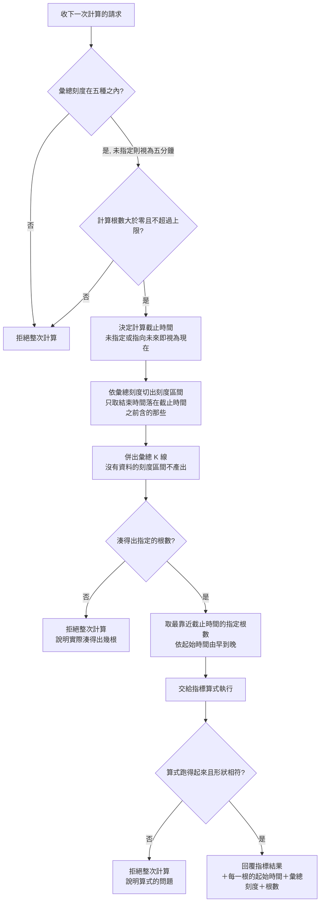

# Product Requirements Document (PRD)

**Feature:** 策略與執行參數分離
**Status:** Finalized
**Version:** v1.0
**Owner:** James Hsueh
**Stakeholders:** 後端（go-trading）、前端（go-trading-frontend）

---

## 1. Background & Goal (Why & Goal)

- **Problem Statement:**
  一支策略現在記著五樣東西：策略名稱、指標算式、指標值種類、彙總刻度與計算根數。
  前三樣講的是「這套算法是什麼」，後兩樣講的是「這一次要餵它吃哪一段資料」——
  那是執行當下才知道的事，不是算法的一部分。

  代價有兩層。第一層是策略清單被同一套算法的取數變體塞滿：
  同一支「二十根均線」想在一小時刻度看一次、再在五分鐘刻度看一次，
  就得存成兩支算式一字不差、只有取數不同的策略。
  第二層更嚴重——那兩樣**從來沒有生效過**。
  指標計算至今只讀原始的五分鐘 K 線、固定拿最新的那幾根，
  從未問過策略記著的彙總刻度與計算根數是多少。存進去的是一份沒有人讀的願望。

- **Expected Outcome:**
  策略回到它本來的樣子：一套算法。策略清單上的每一列都是一套**不同的算法**，
  而不是同一套算法的不同看法。
  同時，同一支策略能在五種粗細、任意一段時間上執行，
  且每一次計算都真的照它說的粗細與根數取數——不再有寫下來卻沒人讀的設定。

- **Out of Scope:**
  - 在圖表上套用策略、把指標值畫出來——那是操作介面的事。
  - 把交易標的記在策略身上——市場仍然是執行時才指定的。
  - 新增「這支算法至少需要幾根」這類欄位——刻意不做。
  - 策略的執行紀錄或計算結果留存——策略是食譜，值每次跑每次算。
  - 既有策略的彙總刻度與計算根數的遷移——它們沒有地方可去，直接消失。
  - 指標算式本身能用到哪些運算、執行多久逾時——完全不動。
  - 自動抓取仍然只取五分鐘 K 線——更粗的刻度一律由五分鐘併出來。

---

## 2. User Personas

- **Primary Role(s):** 寫策略並拿它去算的人（本專案作者本人），
  以及代替他發問的操作介面——尤其是圖表畫面，它會在使用者拉遠拉近時
  以當下的粗細與看得到的那一段時間去執行同一支策略。
- **Usage Context:** 一次互動就要有一次回覆，屬於即時的讀取，不是批次作業。
  同一支策略在一次瀏覽中可能以好幾種粗細被執行好幾次。

---

## 3. User Stories & Acceptance Criteria

### US-01 — 策略只記住一套算法 [priority: P0]

**As a** 寫策略的人，**I want** 一支策略只記著名稱、算式與指標值種類，
**so that** 我的策略清單上每一列都是一套不同的算法，而不是同一套算法的不同看法。

```gherkin
Scenario: 新建立的策略不再帶著取數計畫
  Given 一個名為「二十根均線」、指標值種類為一串數字的策略內容
  When 建立這支策略
  Then 建立成功
  And 讀回這支策略時只有策略名稱、指標算式、指標值種類、建立時間與最後修改時間
  And 回覆中不出現彙總刻度，也不出現計算根數

Scenario: 既有策略的算法原封不動
  Given 一支既有策略，原本記著一小時的彙總刻度與 20 的計算根數
  When 讀取這支策略
  Then 它的策略名稱、指標算式、指標值種類與建立時間與先前完全相同
  And 回覆中不出現彙總刻度，也不出現計算根數

Scenario: 附上取數計畫也不會被記住
  Given 一份建立策略的內容，其中仍舊附上一小時的彙總刻度與 20 的計算根數
  When 建立這支策略
  Then 建立成功
  And 讀回這支策略時不出現彙總刻度，也不出現計算根數

Scenario: 修改策略時沒有取數計畫可以一起改
  Given 一支既有策略
  When 把它的策略名稱與指標算式改成新的值
  Then 修改成功
  And 最後修改時間已更新
  And 讀回這支策略時不出現彙總刻度，也不出現計算根數

Scenario: 名稱為空白仍然被拒絕
  Given 一份策略名稱為空白的建立內容
  When 建立這支策略
  Then 拒絕建立，說明必須給策略取一個名稱

Scenario: 名稱重複仍然被拒絕
  Given 已有一支名為「二十根均線」的策略
  When 再建立一支名為「二十根均線」的策略
  Then 拒絕建立，說明該名稱已被使用
  And 既有那一支完全不受影響
```

### US-02 — 一次計算自己說要吃什麼 [priority: P0]

**As a** 拿策略去算的人，**I want** 在執行計算時指定要多粗的 K 線、要幾根、算到哪個時間為止，
**so that** 同一套算法能在任何粗細、任何一段時間上執行，而且真的照我說的取數。

```gherkin
Scenario: 依指定的彙總刻度與根數取數
  Given 一次計算指定彙總刻度為一小時、計算根數為 24
  When 執行這次計算
  Then 算式收到 24 根一小時的彙總 K 線
  And 這些彙總 K 線依起始時間由早到晚排列

Scenario: 同樣回看一天，較細的刻度看見更多細節
  Given 一次計算指定彙總刻度為五分鐘、計算根數為 288
  When 執行這次計算
  Then 算式收到 288 根五分鐘的 K 線

Scenario: 未指定彙總刻度時視為五分鐘
  Given 一次計算未指定彙總刻度，計算根數為 20
  When 執行這次計算
  Then 算式收到 20 根五分鐘的 K 線

Scenario: 根數的上限數的是彙總後的根數
  Given 一次計算指定彙總刻度為一天、計算根數為 1000
  When 執行這次計算
  Then 這次計算的根數被接受——上限與一根多粗無關

Scenario: 超過單次可用的最大根數即拒絕
  Given 一次計算指定計算根數為 1001
  When 執行這次計算
  Then 拒絕整次計算，說明超過單次可用的最大根數

Scenario: 計算根數必須大於零
  Given 一次計算指定計算根數為 0
  When 執行這次計算
  Then 拒絕整次計算，說明計算根數必須大於零

Scenario: 彙總刻度只認得那五種
  Given 一次計算指定彙總刻度為七分鐘
  When 執行這次計算
  Then 拒絕整次計算，說明彙總刻度只接受五分鐘、十五分鐘、一小時、四小時、一天
```

### US-03 — 只採用走完的刻度區間 [priority: P0]

**As a** 拿策略去算的人，**I want** 系統只把已經走完的刻度區間交給算式，
**so that** 同一次計算在同一個截止時間上永遠算出同一個值，不會因為時間往前走而自己變動。

```gherkin
Scenario: 還在走的那一格不採用
  Given 目前時間為 08:37
  And 一次計算指定彙總刻度為一小時、計算根數為 3、計算截止時間為現在
  When 執行這次計算
  Then 算式收到起始時間為 05:00、06:00、07:00 的三根彙總 K 線
  And 起始時間為 08:00 的那一格不在其中

Scenario: 截止時間剛好落在邊界上時，前一格算走完
  Given 一次計算指定彙總刻度為一小時、計算根數為 3、計算截止時間為 08:00
  When 執行這次計算
  Then 算式收到起始時間為 05:00、06:00、07:00 的三根彙總 K 線

Scenario: 五分鐘刻度下等同排除最新一根
  Given 目前時間為 08:37
  And 一次計算指定彙總刻度為五分鐘、計算根數為 3、計算截止時間為現在
  When 執行這次計算
  Then 算式收到起始時間為 08:20、08:25、08:30 的三根 K 線
  And 起始時間為 08:35 的那一根不在其中

Scenario: 過去的半成品仍然是半成品
  Given 一次計算指定彙總刻度為一小時、計算根數為 2、計算截止時間為 2025-03-01 14:30
  When 執行這次計算
  Then 算式收到起始時間為 12:00 與 13:00 的兩根彙總 K 線
  And 起始時間為 14:00 的那一格不在其中

Scenario: 未指定計算截止時間時視為現在
  Given 目前時間為 08:37
  And 一次計算指定彙總刻度為一小時、計算根數為 3，且未指定計算截止時間
  When 執行這次計算
  Then 算式收到起始時間為 05:00、06:00、07:00 的三根彙總 K 線

Scenario: 計算截止時間指向未來時視同現在
  Given 目前時間為 08:37
  And 一次計算指定彙總刻度為一小時、計算根數為 3、計算截止時間為明天
  When 執行這次計算
  Then 算式收到起始時間為 05:00、06:00、07:00 的三根彙總 K 線
  And 這次計算不被拒絕

Scenario: 一天的刻度下只採用已經過完的那一天
  Given 目前時間為 09-03 08:37
  And 一次計算指定彙總刻度為一天、計算根數為 1、計算截止時間為現在
  When 執行這次計算
  Then 算式收到起始時間為 09-02 零點的那一根彙總 K 線
  And 起始時間為 09-03 零點的那一格不在其中
```

### US-04 — 湊不滿就說湊不滿 [priority: P0]

**As a** 拿策略去算的人，**I want** 資料不足時被明確拒絕，
**so that** 我不會拿到一個看起來正常、實際上算少了幾根的錯值。

```gherkin
Scenario: 走完的格子湊得滿就算得成
  Given 一次計算指定彙總刻度為一小時、計算根數為 3
  And 起始時間為 05:00、06:00、07:00 的三個刻度區間內都有 K 線
  When 執行這次計算
  Then 算式收到 3 根彙總 K 線

Scenario: 湊不滿即整次拒絕
  Given 一次計算指定彙總刻度為一小時、計算根數為 3
  And 只有起始時間為 06:00 與 07:00 的兩個刻度區間內有 K 線，更早的完全沒有資料
  When 執行這次計算
  Then 拒絕整次計算，說明只湊得出 2 根、不足這次要的 3 根
  And 不回覆任何指標名稱與指標值

Scenario: 中間沒有資料的那一格不補洞，但不妨礙湊滿
  Given 一次計算指定彙總刻度為一小時、計算根數為 2
  And 起始時間為 05:00 與 07:00 的刻度區間內有 K 線，06:00 那一格完全沒有資料
  When 執行這次計算
  Then 算式收到起始時間為 05:00 與 07:00 的兩根彙總 K 線
  And 沒有任何一根彙總 K 線的起始時間是 06:00

Scenario: 一根 K 線都沒有的交易標的
  Given 該交易標的一根 K 線都沒有
  And 一次計算指定計算根數為 3
  When 執行這次計算
  Then 拒絕整次計算，說明湊不出這次要的 3 根

Scenario: 刻度區間內只有一根也算數
  Given 一次計算指定彙總刻度為一小時、計算根數為 1
  And 起始時間為 07:00 的那個刻度區間內只有一根五分鐘 K 線
  When 執行這次計算
  Then 算式收到 1 根彙總 K 線，起始時間為 07:00
```

### US-05 — 結果說得出第幾個值對應哪一根 [priority: P0]

**As a** 要把指標值擺回行情圖上的操作介面，**I want** 計算結果直接告訴我這次讀了哪幾根，
**so that** 我不必自己反推切格規則，也就不會與系統靜靜地錯開一格。

```gherkin
Scenario: 回覆這次實際餵給算式的每一根起始時間
  Given 目前時間為 08:37
  And 一次計算指定彙總刻度為一小時、計算根數為 3、指標值種類為一串數字
  When 執行這次計算
  Then 回覆中帶著 05:00、06:00、07:00 三個起始時間，依由早到晚排列
  And 一串數字中的第一、二、三個值分別對應這三個起始時間

Scenario: 指標值只有一個時照樣回覆起始時間
  Given 目前時間為 08:37
  And 一次計算指定彙總刻度為一小時、計算根數為 3、指標值種類為一個數字
  When 執行這次計算
  Then 回覆中仍帶著 05:00、06:00、07:00 三個起始時間

Scenario: 回覆這次實際採用的彙總刻度與根數
  Given 一次計算指定彙總刻度為一小時、計算根數為 3
  When 執行這次計算
  Then 回覆中說明這次採用的彙總刻度為一小時、根數為 3

Scenario: 一個指標名稱都沒放進結果仍是一次成功的計算
  Given 一段不放任何指標名稱進結果的指標算式
  And 一次計算指定彙總刻度為一小時、計算根數為 3
  When 執行這次計算
  Then 這次計算成功，指標名稱是空的一組
  And 回覆中仍帶著三個起始時間、彙總刻度與根數
```

### US-06 — 至少需要幾根由算式自己把關 [priority: P1]

**As a** 寫策略的人，**I want** 由算式自己決定它需要幾根才算得準，
**so that** 系統不必替我猜，我也不必再為此在策略上多存一個欄位。

```gherkin
Scenario: 系統不猜算法的最低需求
  Given 一段需要 50 根才算得準的指標算式
  And 一次計算只指定計算根數為 10
  When 執行這次計算
  Then 系統照常把 10 根交給算式

Scenario: 算式自己檢查不足時整次計算失敗
  Given 一段會在拿到的根數不足時直接失敗的指標算式
  And 一次計算指定的計算根數少於它需要的根數
  When 執行這次計算
  Then 拒絕整次計算，說明算式執行失敗的原因

Scenario: 算式沒有自己檢查時照常回覆
  Given 一段拿到幾根就算幾根、不自行檢查的指標算式
  And 一次計算指定的計算根數少於它需要的根數
  When 執行這次計算
  Then 這次計算成功並回覆算出來的值
```

---

## 4. Business Flow & Logic

**主流程（一次計算）**



**Core Business Rules**

- **策略記住三樣**：策略名稱、指標算式、指標值種類。彙總刻度與計算根數不再屬於策略。
- **執行參數三樣**：彙總刻度（未指定視為五分鐘、五選一）、計算根數（大於零、不超過單次查詢筆數上限）、
  計算截止時間（未指定或指向未來一律視為現在）。
- **走完才算數**：只採用**結束時間落在計算截止時間之前（含）**的刻度區間。
  截止時間剛好落在邊界上時，前一格已走完、要採用。此規則不分現在與過去。
- **空格不算數**：刻度區間內一根 K 線都沒有時不產出那一格，不補洞、不沿用前一格。
  有一根就算數，不要求裝滿。
- **湊不滿即整次拒絕**，並說明實際湊得出幾根，不回覆任何部分結果。
- **取最靠近截止時間的那幾根**，交給算式時依起始時間由早到晚。
- **回覆要能對位**：除了指標結果與指標值種類，另回覆這次實際餵給算式的每一根彙總 K 線的起始時間
  （由早到晚）、這次採用的彙總刻度與根數。指標值是一串時，第 i 個值對應第 i 根。
- **最低需求由算式自負**：系統不猜任何一支算法至少需要幾根。

**Edge Cases**

- 交易標的一根 K 線都沒有 → 湊不滿，整次拒絕。
- 走完的格子夠多、但中間有空洞 → 空洞那格不產出，其餘湊得滿就算得成。
- 計算截止時間早於系統最早的一根 K 線 → 湊不滿，整次拒絕。
- 算式一個指標名稱都沒放進結果 → 仍是一次成功的計算，起始時間照樣回覆。
- 既有策略帶著彙總刻度與計算根數 → 那兩樣直接消失，其餘內容原封不動。
- 建立或修改策略時仍舊附上那兩樣 → 忽略，不留下、也不因此拒絕。

---

## 5. UI/UX Design & Interaction

N/A — 本切片不含任何操作介面。
介面上怎麼讓使用者指定彙總刻度、計算根數與計算截止時間，由前端各自的切片決定。

---

## 6. Non-Functional Requirements

- **Performance:** 一次計算屬於即時讀取，一次互動一次回覆。
  彙總所需讀取的原始 K 線根數等於「計算根數 × 該刻度所含的五分鐘根數」，
  由較粗的刻度回看很長一段時，讀取量會顯著大於彙總後的根數——這是刻度變粗的必然成本，
  不另設第二道上限。
- **Security:** 不變。指標算式仍只能做純運算，不得取用 K 線以外的資料、當下時間或任何隨機值；
  執行逾時即中止。
- **Compatibility:** 這是一次**破壞性變更**：策略的形狀少了兩樣、計算的請求與回覆都多了東西。
  唯一的呼叫端是本專案的操作介面，與本切片同批更新，因此不保留舊形狀、不做版本並存。
- **Analytics / Tracking:** N/A。

---

## 7. Dependencies & Risks

- **External Dependencies:** 無新增。彙總的切格規則沿用既有的彙總 K 線序列查詢，不另立第二套。
- **Known Risks:**
  - **破壞性變更**：操作介面在同批更新前會對不上。兩邊一併更新即可，無其他呼叫端。
  - **既有策略的那兩樣直接消失**：無法復原。可接受——它們從未生效，消失的是沒有人讀的願望。
  - **較粗的刻度需要讀取大量原始 K 線**：見 Non-Functional。
    目前系統的資料回補上限為 24 小時，實務上尚不存在足以觸發此風險的資料量。

---

## 8. Appendix

- 需求共識：`BRIEF.md`（同一資料夾）
- 前一個切片預告了本切片：`.sdd/2026-09-03-trading-strategy-management/BRIEF.md` 的 Out of Scope
  已寫明「指標計算目前的兩個缺口（不彙總、排除最新一根在較粗刻度下不夠用）都真的要處理，但不在該切片」。
- 彙總的切格規則與詞彙：`.sdd/2026-09-02-k-candle-aggregated-series/PRD.md`
- 通用語言：`.sdd/UL-MAP.md`
