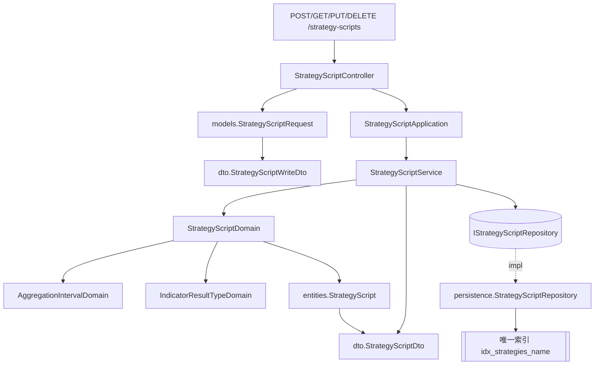

# 交易策略腳本管理 — Architecture Design

**Status:** Confirmed
**Source PRD:** `.sdd/2026-09-03-strategy-script-management/PRD.md`
**Tech context:** Go · Gin · GORM · PostgreSQL · Clean Architecture（Controller → Application → Domain ← Infrastructure）

---

## 1. Design Goal & Guiding Principle

- **In one sentence:**
  讓策略腳本成為系統的一份資料——建立、以識別碼讀一支、讀全部、修改、刪除——
  且**彙總刻度與指標值種類的合法值只有一份定義**，策略腳本沿用既有的那兩份，不另立第二套。

- **Guiding principle:**
  **策略腳本不重新發明它借來的每一個概念。**
  一支策略腳本由五樣東西組成，其中兩樣（彙總刻度、指標值種類）系統早就有會自己回答問題的領域物件
  （`AggregationIntervalDomain`、`IndicatorResultTypeDomain`），另外兩樣（計算根數的上限、
  指標算式）也已有既成的規則。`StrategyScriptDomain` 的工作因此不是「再寫一次那些規則」，
  而是**把它們湊齊、確認每一項都過得了，並讓外界只看到一種失敗**。
  於是「彙總刻度多支援一種」這件事，在策略腳本這一側是**零行**改動。

  同樣的原則套在名稱唯一上：**唯一性的真相在資料庫的唯一索引，不在一段先查後寫的程式碼。**
  先查再寫在兩個請求同時進來時會兩個都通過；索引不會。
  repository 把索引的抗議翻譯成 `ErrStrategyScriptNameConflict`，於是「撞名」與「同時撞名」是同一條路徑，
  而「改回自己原本的名稱」因為撞的是自己那一列、根本不違反索引，**不需要任何特例程式碼**。

---

## 2. Change Scope

| Area | Action | What / Why |
| :--- | :--- | :--- |
| `domain/models/entities/strategyScript.go` | **Add** | `StrategyScript`——乾淨的資料模型：七個欄位、`TableName()`、`ToDto()`。無業務規則 |
| `domain/models/domains/strategyScript_domain.go` | **Add** | `StrategyScriptDomain`——一支策略腳本的不變式與正規化，實例存在即代表可以落地 |
| `domain/models/domains/strategyScript_errors.go` | **Add** | `ErrStrategyScriptValidation`／`ErrStrategyScriptNameConflict`／`ErrStrategyScriptNotFound` 三個哨兵錯誤 |
| `domain/models/dto/strategyScript_write_dto.go` | **Add** | `StrategyScriptWriteDto`——application 交給 domain 的輸入形狀（雙向 DTO，含 `ID`：`0` 代表建立） |
| `domain/models/dto/strategyScript_dto.go` | **Add** | `StrategyScriptDto`——策略腳本離開 domain 的唯一形狀 |
| `domain/interface/i_strategyScript_repository.go` | **Add** | `IStrategyScriptRepository`（+ `mocks/mock_i_strategyScript_repository.go`） |
| `domain/service/strategyScript_service.go` | **Add** | `StrategyScriptService`——五個互不呼叫的 use case |
| `application/strategyScript_application.go` | **Add** | `StrategyScriptApplication`——五行轉呼叫 |
| `controller/strategyScript_controller.go` | **Add** | `StrategyScriptController`——五個 handler + `respondWithError` 狀態碼對映 |
| `controller/models/strategyScript_request.go` | **Add** | `StrategyScriptRequest`（建立與修改共用同一個 body 形狀）+ `ToWriteDto(id)` |
| `infrastructure/persistence/strategyScript_repository.go` | **Add** | `StrategyScriptRepository`——GORM 實作，並把唯一索引違反翻成名稱衝突 |
| `infrastructure/persistence/schema_migrator.go` | **Modify** | `migratedEntities` 多一列 `&entities.StrategyScript{}` |
| `infrastructure/persistence/database.go` | **Not touched** | 一度打算開 `TranslateError: true`，後來拿掉——見 §4 |
| `cmd/server/dependencies.go` | **Modify** | 組裝 `StrategyScriptController` 並掛五條路由 |
| `domains.AggregationIntervalDomain` | **Refactor（見 §4）** | 建構子改回傳**不帶哨兵**的原因錯誤，由呼叫端各自冠上自己的哨兵 |
| `domains.IndicatorResultTypeDomain` | **Refactor（見 §4）** | 同上 |
| `IndicatorCalculationService` 與整條指標計算 | **Not touched** | 本切片不動它一行。它現在不彙總、且「排除最新一根」在長刻度下不夠用，兩者都留給下一個切片 |
| `KCandleService`／`TradingSymbolService`／K 線資料表 | **Not touched** | 策略腳本與 K 線是兩份不相干的資料，策略腳本不持有交易標的、不讀任何 K 線 |
| `config` | **Not touched** | 計算根數上限沿用既有的 `KCandleQueryMaxResults`，**不新增設定項** |

---

## 3. New Classes / Modules

| Name | Kind | Responsibility (purpose) | Collaborators | Satisfies (PRD scenario) |
| :--- | :--- | :--- | :--- | :--- |
| `entities.StrategyScript` | Entity | 一支策略腳本在資料庫裡的樣子：識別碼、名稱、指標算式、指標值種類、彙總刻度、計算根數、建立與最後修改時間。只有欄位、持久化標註與 `ToDto()` | `dto.StrategyScriptDto` | 讀取回傳完整內容／清單每一支都帶完整內容 |
| `domains.StrategyScriptDomain` | Domain Model | 一支策略腳本的全部不變式：名稱去空白後非空且不超過 128 字、指標算式非空白、彙總刻度與指標值種類經既有領域物件認可、計算根數落在 1..上限。實例存在即代表可以落地。並持有**已解析**的刻度與種類，供下一個切片直接取用 | `AggregationIntervalDomain`、`IndicatorResultTypeDomain`、`entities.StrategyScript` | 全部的建立／修改驗證情境 |
| `domains.ErrStrategyScriptValidation` 等三個哨兵 | Sentinel error | 讓 controller 分得開「內容不合法」「名稱被佔用」「找不到這支策略腳本」三件事 | — | 拒絕類與找不到類的全部情境 |
| `dto.StrategyScriptWriteDto` | DTO（輸入） | application 交給 domain 的形狀。含 `ID`——`0` 是建立、非 `0` 是修改，於是建立與修改共用同一份驗證，「規則一字不差地相同」由型別保證而不是靠自律 | — | （全部建立與修改情境） |
| `dto.StrategyScriptDto` | DTO（輸出） | 策略腳本離開 domain 的唯一形狀，七個欄位 | — | （全部讀取情境） |
| `interface.IStrategyScriptRepository` | Interface | 策略腳本的存取契約：`Save`／`Update`／`FindOne`／`FindAll`／`Delete`。**唯一性與存在性由它負責回答**——`Save`/`Update` 回 `ErrStrategyScriptNameConflict`，`Update`/`FindOne`/`Delete` 回 `ErrStrategyScriptNotFound` | `entities.StrategyScript` | 名稱重複／找不到的全部情境 |
| `persistence.StrategyScriptRepository` | Repository | GORM 實作。只把**名稱索引**的唯一約束違反翻成 `ErrStrategyScriptNameConflict`（見 §4）、把 `ErrRecordNotFound` 翻成 `ErrStrategyScriptNotFound`；`Update` **只寫五個欄位**，識別碼與建立時間因此不可能被換掉，且**改寫與回讀共用同一個交易**，回傳的必定是這一次寫進去的值 | `entities.StrategyScript` | 名稱重複／同時撞名／建立時間不因修改而變 |
| `service.StrategyScriptService` | Domain Service | application 的唯一入口，五個**互不呼叫**的 use case：`CreateStrategyScript`／`GetStrategyScript`／`ListStrategyScripts`／`UpdateStrategyScript`／`DeleteStrategyScript`。持有計算根數上限。`UpdateStrategyScript` **先確認策略腳本在不在、再判內容**，依 PRD 的業務流程順序——反過來會對一支不存在的策略腳本回報內容哪裡錯，把人帶往錯的方向 | `IStrategyScriptRepository`、`StrategyScriptDomain` | （全部） |
| `application.StrategyScriptApplication` | Application | 五行轉呼叫，全程不碰 entity 與 domain model | `StrategyScriptService` | （全部） |
| `controller.StrategyScriptController` | Controller | HTTP 轉換：body binding、路徑上的識別碼解析、狀態碼對映 | `StrategyScriptApplication` | （全部） |
| `models.StrategyScriptRequest` | Request | 建立與修改共用的 body 形狀，`ToWriteDto(id)` 由呼叫端決定指的是哪一支 | `dto.StrategyScriptWriteDto` | （全部建立與修改情境） |

> **深度檢查。** 呼叫端要完成任何一個業務動作都只需要**一次**呼叫：
> 建立一支策略腳本是 `CreateStrategyScript(writeDto)`，不是「先查名字有沒有人用 → 再驗刻度 → 再存」。
> 名稱是否被佔用、刻度認不認得、根數超不超過上限，全部在模組內部解決；
> 呼叫端不需要任何關於「怎麼做」的條件判斷，只需要分辨三種失敗。

---

## 4. Modified Components

| Component | Current role | Change needed |
| :--- | :--- | :--- |
| `domains.AggregationIntervalDomain` | 彙總刻度的行為；建構子失敗時回 `fmt.Errorf("%w: 彙總刻度只能是…", ErrKCandleValidation)` | 建構子改回**不帶哨兵**的原因錯誤（`fmt.Errorf("彙總刻度只能是…")`）。唯一的既有呼叫端 `KCandleSeriesQueryDomain` 改為 `fmt.Errorf("%w: %w", ErrKCandleValidation, intervalError)`——**在 service 邊界看到的哨兵與訊息字面一模一樣**，行為零變化 |
| `domains.IndicatorResultTypeDomain` | 指標值種類的行為；建構子失敗時冠上 `ErrIndicatorCalculationValidation` | 同上。唯一的既有呼叫端 `IndicatorCalculationDomain` 改為自己冠哨兵，邊界行為零變化 |
| `persistence.SchemaMigrator` | 由 entity 產生資料表 | `migratedEntities` 多一列 `&entities.StrategyScript{}` |
| `persistence.NewDatabase` | 開連線，不碰 schema | **不動**。詳見下方〈為什麼不用 GORM 的錯誤轉譯〉 |
| `cmd/server/dependencies.go` | 組裝根 | 組 `StrategyScriptController`，掛 `POST /strategy-scripts`、`GET /strategy-scripts`、`GET /strategy-scripts/:id`、`PUT /strategy-scripts/:id`、`DELETE /strategy-scripts/:id`。`GET /strategy-scripts` 與 `GET /strategy-scripts/:id` 一靜一動、不同層，路由樹不衝突 |
| `postman/` | 手動測試集 | 新增五個請求 |

### 為什麼不用 GORM 的錯誤轉譯

初版打算開 `gorm.Config{TranslateError: true}`，用 `gorm.ErrDuplicatedKey` 判斷名稱衝突。
讀了 driver 的實作後放棄：`postgres.Dialector.Translate` 把 `*pgconn.PgError` **換成**光禿禿的哨兵，
**constraint 名稱在那一步就丟了**。於是它只答得出「某個唯一約束壞了」，
分不出壞的是名稱索引還是主鍵——而主鍵撞車（例如還原備份後識別碼序列落後）
與任何人取的名字都無關，卻會被回成 `409 策略腳本名稱「X」已被使用`，
讓讀到的人去找一支根本不存在的同名策略腳本。

改為 `StrategyScriptRepository` 自己以 `errors.As` 取出 `*pgconn.PgError`，
比對 `Code == "23505"` 且 `ConstraintName == "idx_strategies_name"`。
只有名稱索引算名稱衝突，其餘一律維持儲存失敗。
順帶好處：不必動 `NewDatabase`，也就沒有一個影響所有 repository 的全域開關。

代價是索引名稱在 entity 的 tag 與 repository 各寫了一次（struct tag 放不了常數）。
兩者一旦漂掉，「存重複名稱」就不會被回報成衝突——而那正是
`TestStrategyScriptRepositorySaveRefusesANameAlreadyHeld` 斷言的事，所以漂掉會被測試抓到。

### 為什麼要動那兩個既有的領域物件

因為**一個值的解析器不該替呼叫它的人決定「這算誰的驗證失敗」**。
現在 `AggregationIntervalDomain` 把 `ErrKCandleValidation` 寫死在自己身上；
策略腳本也要用它，但策略腳本的失敗不是 K 線的失敗。三條可能的路：

1. 策略腳本層直接放行 `ErrKCandleValidation` → 策略腳本的 controller 得認得 K 線的哨兵，**分層漏了**。
2. 策略腳本層用 `%w: %w` 把它包起來 → 使用者會讀到
   「策略腳本驗證失敗: k candle validation failed: 彙總刻度只能是…」，**中間那段是給使用者看的雜訊**。
3. 讓解析器只說**原因**，由呼叫端冠上自己的哨兵 → 每一邊的訊息都乾淨，合法值仍只有一份定義。

選 3。代價是兩個既有測試的哨兵斷言要往上移一層（測 `KCandleSeriesQueryDomain`／
`IndicatorCalculationDomain` 而不是測解析器本身），這其實也更貼近它們各自真正的責任。

---

## 5. Component Relationships



**建立一支策略腳本的呼叫鏈**

```
StrategyScriptController.CreateStrategyScript
  → StrategyScriptRequest.ToWriteDto(0)
  → StrategyScriptApplication.CreateStrategyScript
  → StrategyScriptService.CreateStrategyScript
      → NewStrategyScriptDomain(writeDto, maxCandleCount)   // 五項驗證，任一項不過即整次拒絕
      → strategyScriptDomain.ToEntity()
      → IStrategyScriptRepository.Save(entity)              // 唯一索引把關名稱
      → savedStrategyScript.ToDto()
```

---

## 6. Extensibility & Handoff Notes

- **Most likely next requirement:** **拿一支存好的策略腳本去跑一次指標計算**
  （`POST /strategy-scripts/{id}/calculations` 之類），連帶把指標計算改成走彙總、
  並把「排除最新一根」改成「排除最新一個刻度區間」。
- **Where it lands:**
  下一位工程師需要的是「這支策略腳本要吃什麼資料」，而**不是**「這支策略腳本的彙總刻度字串是什麼」。
  所以 `StrategyScriptDomain` 對外給的是**已經解析好的** `AggregationIntervalDomain` 與
  `IndicatorResultTypeDomain`，不是兩個字串。
  這一點很關鍵：`AggregationIntervalDomain` 身上已經有
  `BucketStart`／`BucketCount`／`SourceCandleCount`——
  「這支策略腳本要讀進幾根原始五分鐘 K 線」的答案早就寫好了，
  下一個切片直接問它，不必再解析一次字串，也不會冒出第二份「1h = 12 根」的知識。
- **How to add it:** 新增一個 `StrategyScriptCalculationService`（或在既有的指標計算服務旁邊加一個 use case），
  它讀一支策略腳本拿到 `StrategyScriptDto`／`StrategyScriptDomain`，把彙總刻度交給既有的 `KCandleSeriesDomain` 取數，
  再把結果交給 `IIndicatorScriptProxy`。**本切片的任何檔案都不需要改。**
- **Patterns applied & why:**
  - **借用而非複製**：合法的彙總刻度與指標值種類各只有一份定義。
    多支援一種刻度，策略腳本這一側**零行改動**。
  - **唯一性交給索引**：不寫「先查再存」，因此沒有 TOCTOU，
    也不需要為「改回自己原本的名稱」寫任何特例——撞的是自己那一列，索引本來就不抗議。
  - **雙向 DTO**（`StrategyScriptWriteDto` 以 `ID` 區分建立與修改）：
    建立與修改共用同一份驗證，PRD 說的「規則一字不差地相同」由型別保證，不靠人記得。
  - **轉換寫在來源身上**：`entities.StrategyScript.ToDto()`、`StrategyScriptDomain.ToEntity()`、
    `StrategyScriptRequest.ToWriteDto(id)`——沒有任何 `fromXxx` 靜態工廠。
- **Do not hardcode:**
  - 計算根數上限**一律**取 `applicationConfig.KCandleQueryMaxResults`，
    不得在策略腳本這條路徑另寫一個 1000。
  - 彙總刻度與指標值種類的合法清單**不得**在策略腳本這一側再列一次；
    一律呼叫既有的兩個建構子。
  - 名稱長度上限 128 只寫在 `StrategyScriptDomain` 一處，欄位長度標註沿用同一個常數。
- **Known debt / deferred:**
  - **彙總刻度目前只是被記下來，尚未生效**——指標計算還在讀原始五分鐘 K 線。
    這是刻意留給下一個切片的落差，不是缺陷，但在補上之前這個欄位對使用者是一張支票。
  - **存策略腳本不檢查指標算式**。刻意的取捨（否則做不到中途存檔），
    代價是可能存下一支永遠算不出東西的策略腳本。
  - 清單不分頁。策略腳本數量在數十支等級，超過數百支再回頭看。

---

## 7. Traceability

| PRD Scenario | Fulfilled by |
| :--- | :--- |
| 建立一支完整的策略腳本 | `StrategyScriptService.CreateStrategyScript` + `StrategyScriptDomain` + `StrategyScriptRepository.Save` |
| 系統一支策略腳本都沒有時建立第一支 | `StrategyScriptRepository.Save` |
| 未指定彙總刻度時視為五分鐘 | `StrategyScriptDomain` → `NewAggregationIntervalDomain`（既有預設） |
| 未指定指標值種類時視為一個數字 | `StrategyScriptDomain` → `NewIndicatorResultTypeDomain`（既有預設） |
| 策略腳本名稱前後的空白不予保留 | `StrategyScriptDomain`（建構子正規化） |
| 策略腳本名稱恰好 128 個字／超過 128 個字 | `StrategyScriptDomain`（建構子） |
| 策略腳本名稱為空白／只有空白字元 | `StrategyScriptDomain`（建構子） |
| 指標算式為空白 | `StrategyScriptDomain`（建構子） |
| 不同名稱的兩支策略腳本都留得住 | 唯一索引 `idx_strategies_name` |
| 名稱與既有策略腳本完全相同 | `StrategyScriptRepository.Save` → `ErrStrategyScriptNameConflict` |
| 只差前後空白的名稱視為重複 | `StrategyScriptDomain`（先去空白）+ 唯一索引 |
| 名稱只要有實質差異就不算重複／大小寫不同視為不同名稱 | 唯一索引（區分大小寫的一般索引） |
| 策略腳本刪除後名稱空出來 | `StrategyScriptRepository.Delete`（真刪除） |
| 指定一小時／一天／七分鐘／一週 | `StrategyScriptDomain` → `AggregationIntervalDomain` |
| 修改時把彙總刻度改成不認得的值 | `StrategyScriptService.UpdateStrategyScript`（驗證先於落地） |
| 指定一串數字／四種以外的種類 | `StrategyScriptDomain` → `IndicatorResultTypeDomain` |
| 修改時把種類改成四種以外的值 | `StrategyScriptService.UpdateStrategyScript` |
| 計算根數 20／1／1000／1001／0／-1 | `StrategyScriptDomain`（建構子，上限取自 service 持有的設定） |
| 根數的限制與彙總刻度多粗無關 | `StrategyScriptDomain`（兩項各自獨立驗證） |
| 讀取一支存在的策略腳本 | `StrategyScriptService.GetStrategyScript` + `entities.StrategyScript.ToDto` |
| 讀取一個從未存在過的識別碼／已被刪除的策略腳本 | `StrategyScriptRepository.FindOne` → `ErrStrategyScriptNotFound` |
| 清單依名稱由小到大 | `StrategyScriptRepository.FindAll`（GORM `Order by name`） |
| 一支策略腳本都沒有 | `StrategyScriptRepository.FindAll`（回空切片，非錯誤） |
| 清單上每一支都帶著完整內容 | `entities.StrategyScript.ToDto` |
| 只改計算根數／五項內容一次全改 | `StrategyScriptService.UpdateStrategyScript` + `StrategyScriptRepository.Update` |
| 改回自己原本的名稱 | 唯一索引（撞的是自己那一列，不違反） |
| 改成另一支策略腳本的名稱 | `StrategyScriptRepository.Update` → `ErrStrategyScriptNameConflict` |
| 把名稱改成空白／把計算根數改成零 | `StrategyScriptDomain`（建構子，落地前即拒絕） |
| 修改一個從未存在過的識別碼 | `StrategyScriptRepository.Update` → `ErrStrategyScriptNotFound` |
| 建立時間不因修改而改變 | `StrategyScriptRepository.Update`（只寫五個欄位 + `UpdatedAt`） |
| 刪除一支存在的策略腳本／重複刪除／刪除不波及其他策略腳本 | `StrategyScriptRepository.Delete` |
| 刪除一個從未存在過的識別碼 | `StrategyScriptRepository.Delete` → `ErrStrategyScriptNotFound` |
| 指標算式無法解讀／與宣告的種類對不上，仍建立成功 | `StrategyScriptDomain`（**刻意不驗算式**） |
| 建立策略腳本不會去讀 K 線 | `StrategyScriptService` 不注入 `IKCandleRepository`——**由依賴圖保證，不是靠自律** |

---

## 8. HTTP Contract（controller 層的對映）

| Route | Success | Failure |
| :--- | :--- | :--- |
| `POST /strategy-scripts` | `201` + `StrategyScriptDto` | `400` 內容不合法／body 讀不了 · `409` 名稱已被使用 · `502` 其他 |
| `GET /strategy-scripts` | `200` + `[]StrategyScriptDto`（空清單為 `[]`） | `502` |
| `GET /strategy-scripts/:id` | `200` + `StrategyScriptDto` | `400` 識別碼非正整數 · `404` 找不到 · `502` |
| `PUT /strategy-scripts/:id` | `200` + `StrategyScriptDto` | `400` · `404` · `409` · `502` |
| `DELETE /strategy-scripts/:id` | `204`（無內容） | `400` · `404` · `502` |

`respondWithError` 的對映順序：`ErrStrategyScriptValidation` → 400、`ErrStrategyScriptNotFound` → 404、
`ErrStrategyScriptNameConflict` → 409、其餘 → 502。**只認得策略腳本自己的三個哨兵**。

---

## 9. Risks & Open Decisions

- **Risks / trade-offs:**
  - **索引名稱寫在兩個地方**（entity 的 tag 與 repository 的常數），因為 struct tag 放不了常數。
    漂掉會被名稱衝突的測試抓到，但仍是一處需要留意的重複。
  - **`readID` 以 `strconv.IntSize` 解析識別碼。** 在 64 位元的目標上與寫死 64 完全等價，
    因此**沒有測試能在本機證明這件事**；它保護的是 32 位元編譯下「數字太大被截斷、
    答到別支策略腳本身上」的情形。列在這裡以免日後有人以為它是多餘的。
  - **名稱唯一是區分大小寫的。** PRD 明確要「MA20 與 ma20 是兩支」，
    因此用一般的唯一索引而非不分大小寫的索引。日後若改主意，要動的是索引定義與一則測試。
  - **兩個既有領域物件的錯誤包裝方式改了。** 邊界行為（哨兵與訊息字面）完全相同，
    但這是本切片唯一碰到既有程式碼的地方，回歸測試要跑滿。
  - **repository 測試需要真的 PostgreSQL**（沿用既有的 `TEST_POSTGRES_DSN` 慣例，
    未設定即跳過）。名稱衝突與「只寫五個欄位」這兩條只有在那裡才驗得到。
- **Open decisions:** 無。
