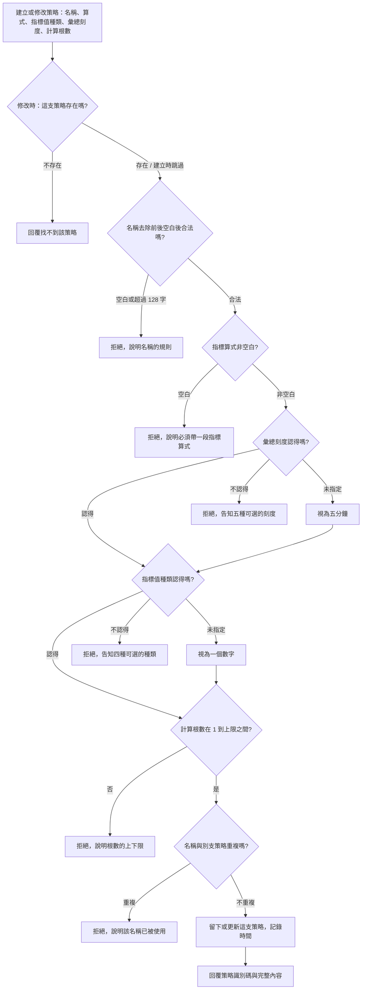

# Product Requirements Document (PRD) — 交易策略管理

**Status:** Finalized
**Version:** v1.0
**Owner:** James Hsueh
**Stakeholders:** 專案作者本人（同時是使用者、開發者與審查者）

---

## 1. Background & Goal (Why & Goal)

- **Problem Statement:** 要算一次指標，使用者得把整段**指標算式**連同交易標的、計算根數與指標值種類一起送進系統，
  系統當場算完、回傳結果，**然後全部忘掉**。下一次要算同一件事，得再貼一次同樣的算式。
  於是一支調了半天才調對的算式只活在剪貼簿裡；想比較「二十根的均線」與「六十根的均線」，
  得自己記住兩段幾乎一樣的文字；改壞了也回不去，因為沒有任何地方留著上一版。
- **Expected Outcome:** 一套算法能被留下來成為一支**策略**——取個名字、記住它要吃多粗多長的資料、
  記住它算出來的值長什麼樣——之後就能把它叫回來、改它，或把不要的丟掉。
  成功的樣子是：使用者不必再為了重跑同一套算法而重貼算式。
- **Out of Scope:** 拿策略去執行一次指標計算；修補指標計算目前不彙總、以及「排除最新一根」
  在較長彙總刻度下不夠用的兩個缺口；把交易標的記在策略身上；策略的執行紀錄或計算結果；
  版本歷史、回上一版、軟刪除與還原；擁有者與權限；分類、標籤、搜尋、分頁；
  建立或修改時檢查指標算式寫得對不對；操作介面上怎麼編輯一支策略。

---

## 2. User Personas

- **Primary Role(s):** 策略研究者（專案作者本人）——同時是指標算式的作者、策略的整理者與結果的讀者。
- **Usage Context:** 本機執行。使用節奏是「寫一支 → 存起來 → 過幾天想起來 → 叫回來改」，
  中間可能隔很久。同時留在手上的策略數量不多（數十支等級），一眼看完是常態，
  因此清單一次全給、不分頁。

---

## 3. User Stories & Acceptance Criteria

> 全篇的「單次查詢筆數上限」為 1000。

### US-01 — 把一套算法留下來 [priority: P0]

**As a** 策略研究者, **I want** 把一段調好的指標算式連同它需要的資料條件一起存起來,
**so that** 下次要用同一套算法時不必重貼一次。

```gherkin
Scenario: 建立一支完整的策略
  Given 使用者給定策略名稱「二十根均線」
  And 彙總刻度為一小時
  And 計算根數為 20
  And 指標值種類為「一串數字」
  And 一段非空白的指標算式
  When 使用者建立策略
  Then 策略建立成功，並回覆一個策略識別碼
  And 以該策略識別碼讀取時，五項內容與存入時完全一致

Scenario: 系統一支策略都沒有時建立第一支
  Given 系統目前一支策略都沒有
  When 使用者建立一支策略
  Then 策略建立成功

Scenario: 未指定彙總刻度時視為五分鐘
  Given 使用者沒有指定彙總刻度
  When 使用者建立策略
  Then 策略建立成功
  And 該策略的彙總刻度為五分鐘

Scenario: 未指定指標值種類時視為一個數字
  Given 使用者沒有指定指標值種類
  When 使用者建立策略
  Then 策略建立成功
  And 該策略的指標值種類為「一個數字」

Scenario: 策略名稱前後的空白不予保留
  Given 使用者給定策略名稱「　二十根均線　」，前後各有空白
  When 使用者建立策略
  Then 策略建立成功
  And 該策略記住的名稱是「二十根均線」

Scenario: 策略名稱恰好 128 個字
  Given 使用者給定一個恰為 128 個字的策略名稱
  When 使用者建立策略
  Then 策略建立成功

Scenario: 策略名稱超過 128 個字
  Given 使用者給定一個 129 個字的策略名稱
  When 使用者建立策略
  Then 建立被拒絕，並說明策略名稱長度上限為 128 個字
  And 系統不留下任何策略

Scenario: 策略名稱為空白
  Given 使用者沒有給定策略名稱
  When 使用者建立策略
  Then 建立被拒絕，並說明必須給策略取一個名稱
  And 系統不留下任何策略

Scenario: 策略名稱只有空白字元
  Given 使用者給定的策略名稱只由空白字元組成
  When 使用者建立策略
  Then 建立被拒絕，並說明必須給策略取一個名稱
  And 系統不留下任何策略

Scenario: 指標算式為空白
  Given 使用者給定的指標算式是空白
  When 使用者建立策略
  Then 建立被拒絕，並說明策略必須帶一段指標算式
  And 系統不留下任何策略
```

### US-02 — 用名字認出是哪一支 [priority: P0]

**As a** 策略研究者, **I want** 系統不讓兩支策略同名,
**so that** 我看到一個名字時不必猜它指的是哪一支。

```gherkin
Scenario: 不同名稱的兩支策略都留得住
  Given 已有一支名為「二十根均線」的策略
  When 使用者建立一支名為「六十根均線」的策略
  Then 策略建立成功

Scenario: 名稱與既有策略完全相同
  Given 已有一支名為「二十根均線」的策略
  When 使用者建立一支名為「二十根均線」的策略
  Then 建立被拒絕，並說明該名稱已被使用
  And 既有那一支策略的內容完全沒有改變

Scenario: 只差前後空白的名稱視為重複
  Given 已有一支名為「二十根均線」的策略
  When 使用者建立一支名為「　二十根均線　」的策略
  Then 建立被拒絕，並說明該名稱已被使用

Scenario: 名稱只要有實質差異就不算重複
  Given 已有一支名為「二十根均線」的策略
  When 使用者建立一支名為「二十根均線 v2」的策略
  Then 策略建立成功

Scenario: 大小寫不同視為不同名稱
  Given 已有一支名為「MA20」的策略
  When 使用者建立一支名為「ma20」的策略
  Then 策略建立成功

Scenario: 策略刪除後名稱空出來
  Given 已有一支名為「二十根均線」的策略
  And 該策略已被刪除
  When 使用者建立一支名為「二十根均線」的策略
  Then 策略建立成功
```

### US-03 — 只認得系統真的組得出來的彙總刻度 [priority: P0]

**As a** 策略研究者, **I want** 系統擋掉它根本組不出來的彙總刻度,
**so that** 我不會存下一支永遠算不出東西的策略。

```gherkin
Scenario: 指定一小時
  Given 使用者指定彙總刻度為一小時
  When 使用者建立策略
  Then 策略建立成功
  And 該策略的彙總刻度為一小時

Scenario: 指定一天
  Given 使用者指定彙總刻度為一天
  When 使用者建立策略
  Then 策略建立成功
  And 該策略的彙總刻度為一天

Scenario: 未指定彙總刻度
  Given 使用者沒有指定彙總刻度
  When 使用者建立策略
  Then 策略建立成功
  And 該策略的彙總刻度為五分鐘

Scenario: 指定七分鐘
  Given 使用者指定彙總刻度為七分鐘
  When 使用者建立策略
  Then 建立被拒絕，並說明彙總刻度只接受五分鐘、十五分鐘、一小時、四小時、一天
  And 系統不留下任何策略

Scenario: 指定一週
  Given 使用者指定彙總刻度為一週
  When 使用者建立策略
  Then 建立被拒絕，並說明彙總刻度只接受五分鐘、十五分鐘、一小時、四小時、一天
  And 系統不留下任何策略

Scenario: 修改時把彙總刻度改成不認得的值
  Given 已有一支彙總刻度為一小時的策略
  When 使用者修改該策略，把彙總刻度改成七分鐘
  Then 修改被拒絕，並說明彙總刻度只接受五分鐘、十五分鐘、一小時、四小時、一天
  And 該策略的彙總刻度仍為一小時
```

### US-04 — 記住這支策略算出來的值長什麼樣 [priority: P0]

**As a** 策略研究者, **I want** 策略把它的指標值種類一起記住,
**so that** 之後拿它去算時不必再想一次這支算的是數字還是是非。

```gherkin
Scenario: 指定一串數字
  Given 使用者指定指標值種類為「一串數字」
  When 使用者建立策略
  Then 策略建立成功
  And 該策略的指標值種類為「一串數字」

Scenario: 未指定指標值種類
  Given 使用者沒有指定指標值種類
  When 使用者建立策略
  Then 策略建立成功
  And 該策略的指標值種類為「一個數字」

Scenario: 指定四種以外的種類
  Given 使用者指定指標值種類為「一個文字」
  When 使用者建立策略
  Then 建立被拒絕，並說明可選的種類只有一個數字、一串數字、一個是非、一串是非
  And 系統不留下任何策略

Scenario: 修改時把種類改成四種以外的值
  Given 已有一支指標值種類為「一個數字」的策略
  When 使用者修改該策略，把指標值種類改成「一個文字」
  Then 修改被拒絕，並說明可選的種類只有一個數字、一串數字、一個是非、一串是非
  And 該策略的指標值種類仍為「一個數字」
```

### US-05 — 記住這支策略要吃幾根 K 線 [priority: P0]

**As a** 策略研究者, **I want** 策略記住它需要的計算根數，且該根數落在系統真的拿得出來的範圍內,
**so that** 存下來的策略不會因為要的根數不合理而注定算不出東西。

```gherkin
Scenario: 一般的計算根數
  Given 使用者指定計算根數為 20
  When 使用者建立策略
  Then 策略建立成功

Scenario: 計算根數為一根
  Given 使用者指定計算根數為 1
  When 使用者建立策略
  Then 策略建立成功

Scenario: 計算根數恰好等於上限
  Given 使用者指定計算根數為 1000
  When 使用者建立策略
  Then 策略建立成功

Scenario: 計算根數超過上限
  Given 使用者指定計算根數為 1001
  When 使用者建立策略
  Then 建立被拒絕，並說明超過單次可用的最大根數
  And 系統不留下任何策略

Scenario: 計算根數為零
  Given 使用者指定計算根數為 0
  When 使用者建立策略
  Then 建立被拒絕，並說明計算根數必須大於零
  And 系統不留下任何策略

Scenario: 計算根數為負數
  Given 使用者指定計算根數為 -1
  When 使用者建立策略
  Then 建立被拒絕，並說明計算根數必須大於零
  And 系統不留下任何策略

Scenario: 根數的限制與彙總刻度多粗無關
  Given 使用者建立一支計算根數 288、彙總刻度五分鐘的策略
  When 使用者再建立一支計算根數 24、彙總刻度一小時的策略
  Then 兩支策略都建立成功
```

### US-06 — 把一支策略叫回來 [priority: P0]

**As a** 策略研究者, **I want** 以策略識別碼指名讀回一支策略的完整內容,
**so that** 我能看到自己當初到底存了什麼。

```gherkin
Scenario: 讀取一支存在的策略
  Given 已建立一支策略並取得其策略識別碼
  When 使用者以該策略識別碼讀取
  Then 回覆該策略的策略名稱、指標算式、指標值種類、彙總刻度、計算根數、建立時間與最後修改時間

Scenario: 讀取一個從未存在過的策略識別碼
  Given 使用者手上有一個從未對應到任何策略的策略識別碼
  When 使用者以該策略識別碼讀取
  Then 回覆找不到該策略

Scenario: 讀取一支已被刪除的策略
  Given 一支策略已被刪除
  When 使用者以它原本的策略識別碼讀取
  Then 回覆找不到該策略
```

### US-07 — 看看手上留了哪些策略 [priority: P0]

**As a** 策略研究者, **I want** 一次看完系統留著的每一支策略,
**so that** 我能挑出要改或要丟的那一支。

```gherkin
Scenario: 清單依名稱由小到大，與建立先後無關
  Given 使用者先建立「六十根均線」，再建立「二十根均線」
  When 使用者列出所有策略
  Then 依序回覆「二十根均線」與「六十根均線」

Scenario: 一支策略都沒有
  Given 系統目前一支策略都沒有
  When 使用者列出所有策略
  Then 回覆空的清單，不視為錯誤

Scenario: 清單上每一支都帶著完整內容
  Given 系統留著三支策略
  When 使用者列出所有策略
  Then 每一支都帶著自己的策略名稱、指標算式、指標值種類、彙總刻度、計算根數、建立時間與最後修改時間
```

### US-08 — 改掉一支策略 [priority: P0]

**As a** 策略研究者, **I want** 就地改掉一支策略的內容,
**so that** 調整參數時不必刪掉重建、也不會弄出一堆幾乎一樣的策略。

```gherkin
Scenario: 只改計算根數
  Given 已有一支名為「二十根均線」、計算根數 20 的策略
  When 使用者修改該策略，把計算根數改成 60
  Then 修改成功
  And 再讀取時計算根數為 60
  And 該策略的最後修改時間已更新

Scenario: 五項內容一次全改
  Given 已有一支策略
  When 使用者修改該策略的策略名稱、指標算式、指標值種類、彙總刻度與計算根數
  Then 修改成功
  And 再讀取時五項內容都是新給定的值

Scenario: 改回自己原本的名稱
  Given 已有一支名為「二十根均線」的策略
  When 使用者修改該策略，把名稱設為「二十根均線」
  Then 修改成功

Scenario: 改成另一支策略的名稱
  Given 已有「二十根均線」與「六十根均線」兩支策略
  When 使用者把「六十根均線」改名為「二十根均線」
  Then 修改被拒絕，並說明該名稱已被使用
  And 兩支策略的內容都完全沒有改變

Scenario: 把名稱改成空白
  Given 已有一支名為「二十根均線」的策略
  When 使用者修改該策略，把名稱設為空白
  Then 修改被拒絕，並說明必須給策略取一個名稱
  And 該策略的名稱仍為「二十根均線」

Scenario: 把計算根數改成零
  Given 已有一支計算根數 20 的策略
  When 使用者修改該策略，把計算根數改成 0
  Then 修改被拒絕，並說明計算根數必須大於零
  And 該策略的計算根數仍為 20

Scenario: 修改一個從未存在過的策略識別碼
  Given 使用者手上有一個從未對應到任何策略的策略識別碼
  When 使用者以該策略識別碼修改
  Then 回覆找不到該策略
  And 系統不會因此留下一支新的策略

Scenario: 策略不存在，內容也不合法
  Given 使用者手上有一個從未對應到任何策略的策略識別碼
  And 使用者給定的計算根數為 0
  When 使用者以該策略識別碼修改
  Then 回覆找不到該策略
  And 不會改口說計算根數必須大於零

Scenario: 建立時間不因修改而改變
  Given 已有一支策略，其建立時間為某個時刻
  When 使用者修改該策略
  Then 該策略的建立時間與修改前完全相同
  And 該策略的最後修改時間晚於或等於建立時間
```

### US-09 — 把不要的策略丟掉 [priority: P1]

**As a** 策略研究者, **I want** 刪掉試過但不用的策略,
**so that** 清單上留下的都是我還在用的。

```gherkin
Scenario: 刪除一支存在的策略
  Given 已建立一支策略並取得其策略識別碼
  When 使用者以該策略識別碼刪除
  Then 刪除成功
  And 以該策略識別碼讀取時回覆找不到該策略
  And 列出所有策略時它不再出現

Scenario: 刪除一個從未存在過的策略識別碼
  Given 使用者手上有一個從未對應到任何策略的策略識別碼
  When 使用者以該策略識別碼刪除
  Then 回覆找不到該策略

Scenario: 重複刪除同一支策略
  Given 一支策略已被刪除
  When 使用者再刪除同一個策略識別碼一次
  Then 回覆找不到該策略

Scenario: 刪除不波及其他策略
  Given 系統留著「二十根均線」與「六十根均線」兩支策略
  When 使用者刪除「二十根均線」
  Then 「六十根均線」仍讀得到，且內容完全沒有改變
```

### US-10 — 半成品也存得住 [priority: P1]

**As a** 策略研究者, **I want** 一支還沒調對的算式也能先存起來,
**so that** 我能中途收工，隔天再接著改。

```gherkin
Scenario: 指標算式根本無法解讀
  Given 使用者給定的指標算式是一段無法解讀的文字
  When 使用者建立策略
  Then 策略建立成功

Scenario: 指標算式與宣告的指標值種類對不上
  Given 使用者給定的指標算式產出的形狀與宣告的指標值種類不符
  When 使用者建立策略
  Then 策略建立成功

Scenario: 建立策略不會去讀 K 線
  Given 使用者給定一支合法的策略
  When 使用者建立策略
  Then 系統沒有讀取任何 K 線
  And 系統沒有算出任何指標值
```

---

## 4. Business Flow & Logic



- **Core Business Rules:**
  - **策略是食譜，不是結果**：策略記住算法與它需要的資料條件；算出來的值不存在策略身上。
  - **名稱是身分**：去除前後空白後不得為空、不超過 128 個字、不得與任何別支策略相同。
    大小寫不同即視為不同名稱。改回自己原本的名稱不算重複。
  - **未指定就套預設**：彙總刻度未指定視為五分鐘，指標值種類未指定視為一個數字——
    與既有的彙總查詢、指標計算完全一致，不製造第二套規矩。
  - **只認得五種彙總刻度**：五分鐘、十五分鐘、一小時、四小時、一天。
    其餘不是「暫時不支援」而是「不成立」，因為系統只取得到五分鐘 K 線，
    更長的刻度都由它併出來，那五種剛好都是它的整數倍，且都整除一天。
  - **計算根數沿用單次查詢筆數上限**：必須大於零、不得超過上限；與彙總刻度多粗無關。
  - **驗證是全有全無**：任何一項不合法即整次拒絕，系統不留下半成品、
    被修改的策略維持原狀。
  - **存不存在先於合不合法**：修改一支不存在的策略時，回覆的是「找不到」而不是內容哪裡錯——
    把內容改對了仍然沒有東西可改，先講內容等於把人帶往錯的方向。
  - **建立與修改的規則一字不差地相同**：使用者不必記兩套。
  - **識別碼與建立時間不可更換**；最後修改時間由系統自動更新。
  - **刪除是真刪除**：不保留、不可復原，名稱隨之空出。
  - **存不等於跑**：建立與修改都不執行、也不檢查指標算式；半成品存得住是刻意的。
- **Edge Cases:**
  - 名稱長度以去除前後空白後計算——「　128 個字　」是合法的。
  - 修改時新舊名稱相同：先確認撞到的是不是自己，是自己就放行。
  - 兩次建立同時送出同一個名稱：仍必須只有一支留得下來，另一次被拒絕。
  - 一支都沒有時列出所有策略：空清單是正常結果，不是錯誤。

---

## 5. UI/UX Design & Interaction

本切片不含畫面。使用者透過既有的操作方式建立、讀取、修改與刪除策略。

- **空狀態：** 一支策略都沒有時回覆空的清單，呼叫端據此顯示「還沒有任何策略」。
- **錯誤狀態：** 每一種拒絕都要說得出**是哪一項不合法**——是名稱重複、名稱太長、
  算式空白、刻度不認得、種類不認得，還是根數超出範圍——而不是只說「輸入有誤」。
- **找不到與不合法要分得開：** 指名一支不存在的策略，與給了不合法的內容，
  是兩件不同的事，回覆時不可混為一談。

---

## 6. Non-Functional Requirements

- **Performance:** 策略的數量是數十支等級，讀全部一次回傳即可，不需分頁或快取。
  建立與修改不觸發任何 K 線讀取或指標計算。
- **Security:** 單一使用者的本機專案，無擁有者與權限概念。
  指標算式在此切片中**只被當成文字保存**，不執行、不解讀，因此不引入新的執行風險。
- **Compatibility:** 既有的 K 線查詢、彙總查詢、交易標的清單與指標計算**行為完全不變**，
  本切片不更動其中任何一項。
- **Analytics / Tracking:** 無。

---

## 7. Dependencies & Risks

- **External Dependencies:** 無新增。策略只存在系統自己的資料裡，不依賴任何外部服務。
- **Known Risks:**
  - **存得住不等於跑得動。** 這是刻意的取捨（否則中途存檔就做不到），
    但代價是使用者可能存下一支永遠算不出東西的策略，直到真的拿去算才發現。
    下一個切片「拿策略去算」必須把失敗訊息說清楚，才不會讓人以為是策略沒存好。
  - **彙總刻度目前只是被記下來。** 指標計算現在直接讀原始五分鐘 K 線、完全不彙總，
    所以此刻存下的「一小時」尚未真正生效。這是已知且刻意留給下一個切片的落差，
    不是缺陷；但在那之前，這個欄位對使用者而言是一張支票。
  - **「排除最新一根」在較長的彙總刻度下不夠用**——最新那個刻度區間可能只裝了一半的 K 線，
    一樣是半成品。這條規則要跟著彙總一起修，同樣屬於下一個切片。
