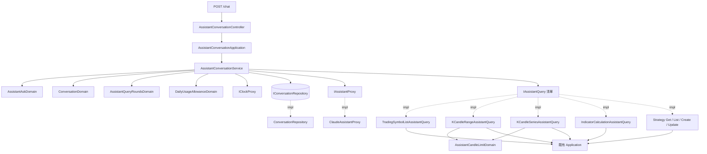
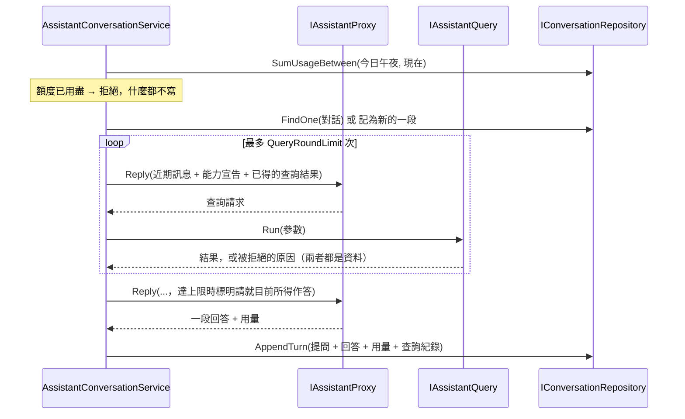

# 行情對話助手 — Architecture Design

**Status:** Confirmed（實作完成，下方 §9 記錄實作時與本設計的差異）
**Source PRD:** `.sdd/2026-09-04-chat-assistant/PRD.md`
**Tech context:** Go 1.26 · Gin · GORM / PostgreSQL · Clean / Onion Architecture · uber-go/mock

---

## 1. Design Goal & Guiding Principle

- **In one sentence:**
  讓一則自然語言的提問，經由一個外部助手在**受管控的往返次數**內借用既有的 domain 能力取數，
  產出一段回答，並把這次問答的內容與**用量**落地，使每日花費有絕對上限。

- **Guiding principle:**
  **把「一次往返」與「整個迴圈」切開。**
  `IAssistantProxy` 只負責**一次**請求／回應——給它訊息，它回「一段回答」或「我要發動哪幾次查詢」外加這次的用量。
  它不執行任何查詢、不迭代、不記狀態。
  迴圈、次數上限、截斷、額度結算、落地，全部住在 `AssistantConversationService` 裡。

  這樣切的兩個收穫：
  1. **換助手是換一個實作**，不是重寫流程；測整條規則只要 mock 一個回傳固定序列的 proxy。
  2. **加一個助手能力是加一個檔**——實作 `IAssistantQuery`，在組裝根多註冊一行。
     `AssistantConversationService`、proxy、controller **一行都不用改**。

  次要原則：**助手能做什麼，由注入的那一份清單決定，不由 proxy 或 service 內的 switch 決定。**
  「助手不能刪策略」因此不是一段防禦碼，而是**清單裡沒有那一項**。

---

## 2. Change Scope

| Area | Action | What / Why |
| :--- | :--- | :--- |
| `internal/domain/models/entities/` | **Add** | `Conversation`、`AssistantTurn`、`AssistantQueryRecord`。乾淨的資料模型，只有欄位、持久化標註與 `ToDto` |
| `internal/domain/models/domains/` | **Add** | `AssistantAskDomain`、`ConversationDomain`、`AssistantQueryRoundsDomain`、`AssistantCandleLimitDomain`、`DailyUsageAllowanceDomain` + `assistant_errors.go` |
| `internal/domain/models/vo/` | **Add** | `AssistantMessageVo`、`AssistantQueryDeclarationVo`、`AssistantTurnRequestVo`、`AssistantQueryCallVo`、`AssistantReplyVo` |
| `internal/domain/models/dto/` | **Add** | `AssistantAskDto`、`AssistantAnswerDto`、`ConversationDto`、`ConversationSummaryDto`、`ConversationMessageDto` |
| `internal/domain/interface/` | **Add** | `i_assistant_proxy.go`、`i_assistant_query.go`、`i_conversation_repository.go`（各一檔一介面，附 `go:generate` mockgen） |
| `internal/domain/service/` | **Add** | `assistant_conversation_service.go` — 提問、列出對話、讀取一段對話 |
| `internal/application/` | **Add** | `assistant_conversation_application.go`；八個 `*_assistant_query.go`（助手能力的實作） |
| `internal/infrastructure/assistant/` | **Add** | `ClaudeAssistantProxy` — 唯一碰外部 SDK 的地方 |
| `internal/infrastructure/persistence/` | **Add** | `ConversationRepository` |
| `internal/config/application_config.go` | **Modify** | 加 `AssistantConfig`（憑證、模型、六個上限） |
| `cmd/server/dependencies.go` | **Modify** | 組裝新元件、註冊三條路由、組出助手能力清單 |
| `cmd/migrate/` | **Modify** | 三張新表加進 `AutoMigrate` |
| `postman/` | **Modify** | 補三條路由 |
| **既有的 K 線／指標計算／策略／交易標的 domain service** | **Not touched** | 助手能力**只呼叫**它們現有的方法。這個切片不放寬任何既有規則，也不為助手開後門 |
| **既有 controller 與路由** | **Not touched** | 助手能力走 application／service，**不繞回自己的 HTTP**——省一次網路、省一層序列化，也不必為此開鑑權 |
| **背景工作** | **Not touched** | 提問一律由使用者觸發，沒有排程 |
| **即時串流** | **Not touched** | 一問一答，不做逐字顯示（PRD Out of Scope） |

---

## 3. New Classes / Modules

### 3.1 Domain — Entities（乾淨資料模型）

| Name | Kind | Responsibility (purpose) | Collaborators | Satisfies |
| :--- | :--- | :--- | :--- | :--- |
| `Conversation` | Entity | 一段對話的身分與**最後有動靜的時刻**；持有它底下的每一次問答 | `AssistantTurn` | US-01 開新對話、US-10 排序 |
| `AssistantTurn` | Entity | **一次問答**：提問、回答、這次的用量、發動幾次查詢、是否因達上限提早收尾 | `AssistantQueryRecord` | US-05、US-06、US-08 結算 |
| `AssistantQueryRecord` | Entity | 這次問答裡**某一次助手查詢**做了什麼：第幾次、哪個能力、什麼參數、結果如何、是否被拒 | — | US-03、US-05「紀錄裡仍看得到」 |

`AssistantTurn` 與 `AssistantQueryRecord` **沒有自己的 repository**——它們從不被單獨讀寫，
一律隨所屬的 `Conversation` 一起進出，比照既有 `StrategyParameter` 的作法。

**為什麼一次問答是一個 row，而不是兩則訊息 row**：
提問與回答**同生共死**——助手掛掉時兩者都不留（US-09）。放在同一個 row 裡，
「不留半截」是**寫或不寫**，而不是一段要記得回滾的兩步。用量與查詢次數也天生屬於這一次往返，
掛在 turn 上不必另立第三張表去對應。對外要「一則一則的訊息」時，由 `ConversationDomain` 攤平。

### 3.2 Domain — Domain Models（行為所在地）

| Name | Kind | Responsibility (purpose) | Collaborators | Satisfies |
| :--- | :--- | :--- | :--- | :--- |
| `AssistantAskDomain` | Domain Model | 一則提問的正規化與把關：去除前後空白，空白即拒 | — | US-01 空字串／只有空白／前後空白 |
| `ConversationDomain` | Domain Model | 一段對話的行為：攤平成訊息、**取最近 N 則給助手**、追加一次問答並更新最後有動靜的時刻、轉 DTO | `AssistantTurn` | US-05 全部、US-02、US-10 |
| `AssistantQueryRoundsDomain` | Domain Model | 一次回答裡的查詢次數：還准不准再查、是否已達上限 | — | US-06 全部 |
| `AssistantCandleLimitDomain` | Domain Model | 助手要幾根 K 線這件事：未指定視為上限、超過則截斷並回報、不大於零即拒 | — | US-07 全部 |
| `DailyUsageAllowanceDomain` | Domain Model | 今日額度：是否已用盡、何時重置（世界標準時間午夜） | — | US-08 全部 |

每一個都有明確的邊界規則與對應的 AC 場景，因此都是**行為**而非資料袋。
`AssistantAskDomain` 刻意獨立於 `ConversationDomain`：提問的把關要在**還沒有對話**時就成立
（未指名對話那一條），塞進對話裡就得先無中生有一個對話才驗證得起來。

### 3.3 Domain — Interfaces

| Name | Kind | Responsibility (purpose) | Collaborators | Satisfies |
| :--- | :--- | :--- | :--- | :--- |
| `IAssistantProxy` | Interface | **一次**往返：給它這一輪的訊息與能力宣告，回「一段回答」或「要發動哪幾次查詢」＋這次用量 | — | US-01、US-03、US-06、US-08、US-09 |
| `IAssistantQuery` | Interface | **一項助手能力**：它叫什麼、能做什麼、參數長什麼樣、怎麼執行 | 既有 application | US-03、US-04、US-07 |
| `IConversationRepository` | Interface | 對話的讀寫，外加**一段時間內的用量總和** | — | US-01、US-08、US-10 |

```go
// IAssistantProxy — 一次往返，不迭代、不執行查詢、不記狀態。
type IAssistantProxy interface {
    Reply(executionContext context.Context, request vo.AssistantTurnRequestVo) (vo.AssistantReplyVo, error)
}

// IAssistantQuery — 一項能力。ArgumentSchema 回傳一段 JSON schema 字串：
// 由 domain 原樣交給 proxy，domain 自己完全不解讀它，因此不必為了描述參數而
// 引入 map[string]any。加一項能力＝多一個實作，domain 一行不動。
type IAssistantQuery interface {
    Name() string
    Description() string
    ArgumentSchema() string
    Run(executionContext context.Context, arguments string) (string, error)
}

// IConversationRepository — 一次問答是一次寫入，這是「不留半截」的落實方式。
type IConversationRepository interface {
    Save(executionContext context.Context, conversation entities.Conversation) (entities.Conversation, error)
    AppendTurn(executionContext context.Context, conversationId uint, turn entities.AssistantTurn) (entities.Conversation, error)
    FindOne(executionContext context.Context, id uint) (entities.Conversation, error)
    FindAll(executionContext context.Context) ([]entities.Conversation, error)
    SumUsageBetween(executionContext context.Context, from time.Time, to time.Time) (int, error)
}
```

`SumUsageBetween` 放在這裡而不是另立一個 repository：用量住在 turn 身上，turn 住在對話底下，
**一個 entity 一個 repository**——沒有「每日用量」這個 entity，也就不該有它的 repository。

### 3.4 Domain — Service

| Name | Kind | Responsibility (purpose) | Collaborators | Satisfies |
| :--- | :--- | :--- | :--- | :--- |
| `AssistantConversationService` | Service | 提問→回答的完整編排；列出對話清單；讀取一段對話 | `IAssistantProxy`、`[]IAssistantQuery`、`IConversationRepository`、`IClockProxy` | 全部 US |

```go
func (s *AssistantConversationService) Ask(ctx context.Context, askDto dto.AssistantAskDto) (dto.AssistantAnswerDto, error)
func (s *AssistantConversationService) ListConversations(ctx context.Context) ([]dto.ConversationSummaryDto, error)
func (s *AssistantConversationService) GetConversation(ctx context.Context, id uint) (dto.ConversationDto, error)
```

**Depth check**：`Ask` 是一次呼叫換一段回答。呼叫端**不需要**自己檢查額度、
不需要自己修剪歷史、不需要自己跑迴圈、不需要自己決定何時落地——這些全在裡面。
介面窄、內部厚，符合 deep module。三個公開方法**互不呼叫**（`ListConversations` 與
`GetConversation` 各自獨立），符合既有規範。

`Ask` 內部順序（都是私有 helper，且每個都被 `Ask` 以外的路徑用不到，故不硬抽）：

1. `AssistantAskDomain` 正規化提問 → 空白即 `ErrAssistantAskEmpty`。
2. `DailyUsageAllowanceDomain`（今日用量取自 `SumUsageBetween`）→ 已用盡即 `ErrDailyUsageAllowanceExhausted`。
3. 沒指名對話 → 記著「這是新的一段」；指名了 → `FindOne`，不存在即 `ErrConversationNotFound`。
4. `ConversationDomain.RecentMessages(limit)` 取近期訊息；連同這則提問與**能力宣告**組成 `AssistantTurnRequestVo`。
5. 迴圈：`IAssistantProxy.Reply` → 若回的是查詢請求，依 `AssistantQueryRoundsDomain` 判斷還准不准；
   准則逐一 `IAssistantQuery.Run`，**結果與錯誤都當成資料交回助手**，再進下一輪。
   達上限後不再放行，並在請求裡標明「已達上限，請就目前所得作答」。
6. 助手講出回答 → 一次 `AppendTurn` 落地（提問、回答、用量、查詢次數、是否提早收尾、每一次查詢的紀錄）。
7. 任何一步的助手不可用或逾時 → 直接回 `ErrAssistantUnavailable`，**什麼都不寫**。

### 3.5 Application

| Name | Kind | Responsibility (purpose) | Collaborators | Satisfies |
| :--- | :--- | :--- | :--- | :--- |
| `AssistantConversationApplication` | Application | 三個用例各一次 domain 呼叫，不做任何決定 | `AssistantConversationService` | 全部 US |
| `TradingSymbolListAssistantQuery` | AssistantQuery | 能力：列出可查交易標的 | `TradingSymbolApplication` | US-03 |
| `KCandleRangeAssistantQuery` | AssistantQuery | 能力：查一段區間的 K 線（受根數上限約束） | `KCandleApplication`、`AssistantCandleLimitDomain` | US-03、US-07 |
| `KCandleSeriesAssistantQuery` | AssistantQuery | 能力：查一段區間的彙總 K 線序列（受根數上限約束） | `KCandleApplication`、`AssistantCandleLimitDomain` | US-03、US-07 |
| `IndicatorCalculationAssistantQuery` | AssistantQuery | 能力：執行一次指標計算 | `IndicatorCalculationApplication` | US-03 |
| `StrategyGetAssistantQuery` | AssistantQuery | 能力：讀取一支策略 | `StrategyApplication` | US-03 |
| `StrategyListAssistantQuery` | AssistantQuery | 能力：列出所有策略 | `StrategyApplication` | US-03 |
| `StrategyCreateAssistantQuery` | AssistantQuery | 能力：建立一支策略 | `StrategyApplication` | US-04 |
| `StrategyUpdateAssistantQuery` | AssistantQuery | 能力：修改一支策略 | `StrategyApplication` | US-04 |

**這八個為什麼在 application 層**：它們的工作正是「把一個外部意圖轉成既有用例的一次呼叫」，
那是 application 的職責。它們實作的是 **domain 的介面**，依賴方向仍然指向 domain（DIP）。
反過來把它們放進 domain，domain 就得認識所有其他 domain service，
變成一張誰都連誰的網——這正是規範要求「跨 service 編排由 application 負責」的理由。

**沒有 `StrategyDeleteAssistantQuery`，也沒有任何 K 線寫入能力。**
US-04「助手不能刪除策略」與 PRD Out of Scope「助手不動 K 線」因此**由結構保證**，
不靠任何一段檢查碼——不存在的能力沒有辦法被誤呼叫。

### 3.6 Infrastructure

| Name | Kind | Responsibility (purpose) | Collaborators | Satisfies |
| :--- | :--- | :--- | :--- | :--- |
| `ClaudeAssistantProxy` | Proxy | 把一輪往返翻成外部 SDK 的呼叫，並把回應正規化成 VO；回報用量 | 外部助手 SDK | US-01、US-03、US-06、US-08、US-09 |
| `ConversationRepository` | Repository | 對話與其問答的持久化；一次問答一次寫入；用量總和 | GORM | US-01、US-08、US-10 |

`ClaudeAssistantProxy` 是**唯一**碰外部 SDK 的檔案。
它負責的技術決定（快取斷點的擺法、回應長度上限、逾時、模型與 effort）全部關在裡面；
domain 只看得到 `Reply`。

### 3.7 Controller

| Name | Kind | Responsibility (purpose) | Satisfies |
| :--- | :--- | :--- | :--- |
| `AssistantConversationController` | Controller | 三個 handler：提問、列出對話、讀一段對話；把哨兵錯誤對映成狀態碼 | 全部 US |

| Route | Handler | 說明 |
| :--- | :--- | :--- |
| `POST /chat` | `Ask` | body：`conversationId`（可選）、`question`。回一段回答與對話識別碼 |
| `GET /chat/conversations` | `ListConversations` | 最近有動靜的排前面 |
| `GET /chat/conversations/:id` | `GetConversation` | 依時間由早到晚的每一則訊息 |

錯誤對映（沿用 `finmind`／`k_candle` controller 既有的哨兵錯誤分流慣例）：

| 哨兵錯誤 | 狀態碼 |
| :--- | :--- |
| `ErrAssistantAskEmpty` | 400 |
| `ErrConversationNotFound` | 404 |
| `ErrDailyUsageAllowanceExhausted` | 429（附何時重置） |
| `ErrAssistantUnavailable` | 503（含逾時） |

---

## 4. Modified Components

| Component | Current role | Change needed |
| :--- | :--- | :--- |
| `internal/config/application_config.go` | 讀所有環境變數並套預設值 | 加 `AssistantConfig`：`ApiKey`、`Model`、`Effort`、`RecentMessageLimit`(20)、`QueryRoundLimit`(8)、`CandleLimit`(200)、`DailyUsageAllowance`(300000)、`ResponseTimeout`(120s)、`AnswerLengthLimit`(2000)。六個數字一律走既有的 `positiveIntWithDefault`——**它對 0 與負數的處理正好就是「拒絕採用、退回預設」**，US-06／US-08 的「設為 0 不予採用」因此不需要新機制 |
| `cmd/server/dependencies.go` | 組裝根 | 建 repository／proxy／service／application／controller；**組出 `[]IAssistantQuery` 清單**；掛三條路由 |
| `cmd/migrate` | 明確套用 schema 變更 | 三張新表加進 `AutoMigrate` |
| `postman/` | 路由測試集 | 補三條 |

---

## 5. Component Relationships



一次 `Ask` 的往返：



---

## 6. Extensibility & Handoff Notes

- **Most likely next requirement:** **再給助手一項能力**（例如「查目前正在跟盤的標的」、
  「查一段區間的成交量分布」），或**改用另一家助手**。
- **Where it lands:**
  - 新能力 → `IAssistantQuery`
  - 換助手 → `IAssistantProxy`
- **How to add it:**
  - 新能力：在 `internal/application/` 新增一個 `xxx_assistant_query.go` 實作 `IAssistantQuery`，
    在 `dependencies.go` 的清單裡多加一行。
    **`AssistantConversationService`、`ClaudeAssistantProxy`、controller、config 一行都不用改。**
  - 換助手：新增一個 `internal/infrastructure/assistant/` 底下的實作，改組裝根注入哪一個。
- **Patterns applied & why:**
  - **Strategy（能力清單）** — 綁在「助手能做什麼」這條變動軸上。它是這個切片最會動的地方，
    所以做成 add-only；順帶讓「不給刪除策略」成為結構事實而非檢查碼。
  - **Adapter（`IAssistantProxy`）** — 綁在「哪一家助手、SDK 長什麼樣」這條軸上。
  - **Rich Domain Model** — 每一條上限都是一個 domain model 的 method，可單獨 table-driven 測，
    不必為了驗「20 則的邊界」而叫一次外部助手。
- **Do not hardcode:**
  - 六個上限（近期訊息則數、查詢次數、單次根數、每日額度、允許時間、回答長度）一律走設定。
  - 助手能力清單一律走組裝根注入，**不要在 service 或 proxy 裡寫 switch**。
  - 模型名稱與 effort 走設定——它們是會漲價、會改版的東西。
- **Known debt / deferred:**
  - **額度是事後結算**，最多超出一則問答的份量。PRD 已明文接受。
    要更嚴就得先估再扣再校正，複雜度不值得（單人使用，且單則問答的份量本身已被三道上限封頂）。
  - **記憶用固定則數修剪，不做摘要。** 想延長記憶時，把摘要做成 `ConversationDomain` 的另一個
    `RecentMessages` 變體，介面不必動。
  - **不做逐字顯示。** 要做的話 `IAssistantProxy` 得多一個串流方法，`Ask` 得改成能邊產邊回；
    這是本設計唯一預期會動到 `Ask` 形狀的需求。
  - **`ArgumentSchema()` 回傳字串。** domain 不解讀它，只轉交。這避開了 `map[string]any`，
    代價是 schema 寫錯要到執行時才知道。八個能力的 schema 都是固定字面值，寫進測試即可。

---

## 7. Traceability

| PRD Scenario | Fulfilled by |
| :--- | :--- |
| **US-01** 沒有指名對話時，開一段新的 | `AssistantConversationService.Ask` + `IConversationRepository.Save` |
| **US-01** 系統一段對話都沒有時也問得起來 | 同上 |
| **US-01** 提問與回答都留在對話裡 | `ConversationDomain.AppendTurn` + `AssistantTurn` |
| **US-01** 提問前後的空白不予保留 | `AssistantAskDomain` |
| **US-01** 空字串的提問被拒絕 | `AssistantAskDomain` → `ErrAssistantAskEmpty` |
| **US-01** 只有空白字元的提問被拒絕 | `AssistantAskDomain` → `ErrAssistantAskEmpty` |
| **US-01** 指名不存在的對話 | `IConversationRepository.FindOne` → `ErrConversationNotFound` |
| **US-02** 助手記得同一段對話前面講過什麼 | `ConversationDomain.RecentMessages` |
| **US-02** 兩段對話彼此不相通 | `ConversationDomain`（近期訊息只取自這一段） |
| **US-03** 助手列出可查交易標的來回答 | `TradingSymbolListAssistantQuery` |
| **US-03** 助手自己選定彙總刻度取回序列 | `KCandleSeriesAssistantQuery` |
| **US-03** 助手指名既有策略去算 | `StrategyGetAssistantQuery` + `IndicatorCalculationAssistantQuery` |
| **US-03** 與行情無關的問題不做任何查詢 | `AssistantConversationService.Ask`（proxy 直接回答時迴圈不進入） |
| **US-03** 非法彙總刻度被拒 | `KCandleSeriesAssistantQuery`（錯誤原樣交回助手，不中止回答） |
| **US-03** 查不到資料不是錯誤 | `KCandleSeriesAssistantQuery`（空結果照樣交回助手） |
| **US-04** 助手建立一支策略 | `StrategyCreateAssistantQuery` |
| **US-04** 助手修改一支策略 | `StrategyUpdateAssistantQuery` |
| **US-04** 助手不能刪除策略 | **能力清單裡沒有刪除**——由結構保證 |
| **US-04** 建立策略同樣受既有規則約束 | `StrategyCreateAssistantQuery` → 既有 `StrategyService` 規則 |
| **US-05** 不到上限時全部帶給助手 | `ConversationDomain.RecentMessages` |
| **US-05** 剛好等於上限時全部帶給助手 | 同上 |
| **US-05** 超出上限時只帶最近 20 則，其餘仍讀得到 | `ConversationDomain.RecentMessages` + `.ToDto` |
| **US-05** 超出上限之前講過的話助手會忘 | `ConversationDomain.RecentMessages` |
| **US-05** 上一輪查到的資料不帶進下一輪 | `ConversationDomain.RecentMessages`（只攤平提問與回答）+ `AssistantQueryRecord`（紀錄仍在） |
| **US-06** 用不到上限就想清楚了 | `AssistantQueryRoundsDomain` |
| **US-06** 剛好用到第 8 次 | `AssistantQueryRoundsDomain.Allows` |
| **US-06** 用完上限仍講不出結論時給半個答案並說明 | `AssistantQueryRoundsDomain.ReachedLimit` + `AssistantTurn.StoppedAtQueryLimit` |
| **US-06** 上限設為 1 | `AssistantQueryRoundsDomain` |
| **US-06** 上限設為 0 不予採用 | `config.positiveIntWithDefault` |
| **US-07** 要的根數在上限之內 / 剛好等於上限 | `AssistantCandleLimitDomain` |
| **US-07** 超過上限時截斷並告知 | `AssistantCandleLimitDomain`（回報 truncated，由查詢寫進交回助手的文字） |
| **US-07** 沒說要幾根一律視為上限 | `AssistantCandleLimitDomain` |
| **US-07** 要的根數不大於零時該次查詢被拒 | `AssistantCandleLimitDomain` |
| **US-08** 額度還有剩 | `DailyUsageAllowanceDomain` + `SumUsageBetween` |
| **US-08** 累計用量剛好等於額度 | `DailyUsageAllowanceDomain.Exhausted` |
| **US-08** 這一則答完才超出額度 | `AssistantConversationService.Ask`（提問前結算一次） |
| **US-08** 跨進新的一天後額度重置 | `DailyUsageAllowanceDomain` + `IClockProxy`（世界標準時間午夜） |
| **US-08** 額度用盡只煞新的問答 | `ListConversations` / `GetConversation` 不查額度 |
| **US-08** 額度設為 0 不予採用 | `config.positiveIntWithDefault` |
| **US-09** 助手暫時不可用 | `AssistantConversationService.Ask` → `ErrAssistantUnavailable`，不落地 |
| **US-09** 回應超過允許時間 | `ClaudeAssistantProxy`（逾時）→ 同上 |
| **US-09** 既有對話維持原狀 | 落地只有一次 `AppendTurn`，發生在成功之後 |
| **US-09** 不可用不影響回頭看 | `GetConversation` 不依賴 `IAssistantProxy` |
| **US-10** 最近有動靜的排前面 | `IConversationRepository.FindAll` + `Conversation.LastActiveAt` |
| **US-10** 讀一段對話的全部訊息 | `ConversationDomain.ToDto` |
| **US-10** 一段對話都沒有 | `FindAll` 回空清單 |
| **US-10** 讀取不存在的對話 | `FindOne` → `ErrConversationNotFound` |

---

## 8. Risks & Open Decisions

**Risks / trade-offs**

| 取捨 | 代價 | 為什麼可接受 |
| :--- | :--- | :--- |
| 迴圈自己寫，不用 SDK 附的 tool runner | 多寫一段迴圈 | 次數上限、截斷告知、額度結算、「達上限就收尾」全是**業務規則**，得住在 domain 裡才測得到；交給 SDK 就得在 infrastructure 裡實作業務規則 |
| 一次問答一個 row | 想改單獨一則訊息會不好改 | 訊息從來不會被單獨修改；換來的是「不留半截」成為單次寫入 |
| `ArgumentSchema()` 是字串 | schema 寫錯要執行時才知道 | 避開 `map[string]any`；八個都是固定字面值，測試蓋住 |
| 額度事後結算 | 最多超出一則問答 | PRD 已明文接受；單則份量本身已被三道上限封頂 |
| 助手能力直接呼叫既有 application | 若哪天真的想從外部呼叫同一批能力，得再包一層 | 省一次網路與一層序列化，也不必為此開鑑權；本系統單人使用，沒有第二個消費者 |

**Open decisions（留給 `/tdd` 或 `/implement`）**

- 外部助手 SDK 的**確切呼叫形狀**（快取斷點怎麼擺、用量欄位怎麼讀）—— 實作 `ClaudeAssistantProxy` 時定，
  不外漏到 domain。
- 交回助手的查詢結果**用什麼文字格式**（精簡 JSON 或表格文字）—— 各 `IAssistantQuery` 自行決定，
  以「省份量」為原則。
- 「達上限請就目前所得作答」這句話**寫在哪一層**（系統指示或訊息）—— 實作時定。
- 訊息內容欄位的長度是否設上限 —— 目前只限助手的回答長度；提問長度是否要限，等真的遇到再說。

---

## 9. 實作與本設計的差異（實作後補記）

實作時發現六處值得記下來的落差。前三處是設計原本想錯了，後三處是設計沒想到。

### 9.1 `AssistantCapabilitiesDomain` 不存在——因為它做不出來

原設計要把「助手能做什麼 + 執行它」包成一個 domain model。**做不到**：
`internal/domain/interface` 已經 import `models/domains`（`i_indicator_script_proxy.go` 用它的錯誤），
所以 domain model 不能 import 介面，也就不能持有 `[]IAssistantQuery`。

改成：能力宣告在 `AssistantConversationService` 的建構子算一次並存成欄位，
查找與執行是它的私有 method `runAssistantQuery`。那個 method 特意留著名字沒有 inline，
因為「拒絕在此從失敗變成資料」這件事是它存在的全部理由——埋進兩層迴圈裡就看不見了。

### 9.2 助手能力會建構 domain model（`AssistantCandleLimitDomain`）

規範說 application 全程不碰 domain model。兩個 K 線能力破了這條：它們自己解析參數，
所以只有它們知道助手要幾根。

替代方案都更糟：把根數上限的規則複製到兩個能力裡（規則兩份），
或搬進 infrastructure（規則離開 domain）。**選擇讓規則留在 domain 一份，並在此記下這個例外。**
理由是這些能力實作的是 **domain 的介面**，是通往 domain 的轉接頭，不是普通的 application 用例。

### 9.3 `AssistantQueryRecord` 沒有「是否截斷」欄位

原設計有。實作時發現沒有東西能填它：能力只回文字，截斷與否已寫在交給助手的文字裡。
**被告知才是重點**，一個只有這張表看得到的旗標什麼都告訴不了助手，所以刪掉。

### 9.4 指標計算能力接受 `strategyId`

原設計要助手先讀策略、再把算式送回來算。實作時改成能力自己收 `strategyId` 並代讀，
因為「用我的二十根均線看 BTCUSDT」指的是**一支策略**而不是一段算式：
少一次往返，也不必把整段算式在對話裡走兩趟。兩者都給時以 `strategyId` 為準，
它們不能悄悄不一致。

### 9.5 多了 `ASSISTANT_BASE_URL`

為了讓 `ClaudeAssistantProxy` 能對著一個替身跑起來——那是唯一能驗證
「一次往返到底送出什麼」的方式，而那正是本切片最容易寫錯的地方。
順帶也能指向閘道或錄製代理。

### 9.6 `AppendTurn` 的錯誤包裝挪到交易外面

原本每個 statement 各自包。但**交易本身開不起來**時（例如連線已關），錯誤根本不經過那些
statement，會以資料庫驅動的原句直達呼叫端。改成：找不到對話由裡面回報，
其餘一律在外面包一次。這是寫 storage-failure 測試時才發現的。

### 未做到的兩件事

- **伺服器端 refusal fallback**（`claude-opus-5` 建議預設開啟）**沒有做**。它走 beta endpoint，
  且無法在不付費的情況下驗證，本切片選擇不加沒被測到的路徑。行情問答被政策拒絕的機率極低；
  真的要加，位置在 `ClaudeAssistantProxy.Reply`。
- **`AppendTurn` 交易內兩個失敗分支未被測到**（`moved.Error`、`readBackError`）。
  兩者都需要在交易已開啟後再讓語句失敗，沒有不引入故障注入的乾淨作法。

---

## 10. 「我先看一下…」然後就結束了（回饋後修正）

### 10.1 症狀

問「請給我一份布林通道的腳本」，回來的是：

> 我先看一下系統裡既有策略的算式寫法，免得我憑空猜語法給你一份跑不起來的東西。

然後這一則問答就結束了。**工具一次都沒跑**，使用者只能自己再問一次「好了沒」。

### 10.2 原因在我們的迴圈，不在助手

`writeAnswer` 原本先問「有沒有文字」，再問「有沒有要查」：

```go
if reply.Answer != "" { return exchange, reply.Answer, nil }   // ← 先看文字
if len(reply.QueryCalls) == 0 || !exchange.AllowsQuery() { ... }
```

助手**很常在同一則回覆裡同時做兩件事**：說一句「我先看一下…」，並附上它要發動的查詢。
先看文字的結果，就是把那句旁白當成最終答案回傳，然後結束——
使用者拿到的是一個承諾，而唯一的前進方式是再問一次，那不叫對話。

**一則帶著查詢請求的回覆不是答案，即使它同時說了話。**
現在先問「有沒有要查、還准不准查」，那句話則作為**旁白**跟著它的查詢一起走。

### 10.3 順手把「一輪」修成真正的一輪

原本 `Exchanges` 是一串攤平的查詢，proxy 把每一次都當成獨立的一問一答送回去
（§9 記錄過這個取捨）。旁白出現之後就不能這樣了，於是改成以**輪**為單位
（`AssistantQueryRoundVo`）。這同時修掉兩件本來就不對的事：

- **旁白要跟它的請求在同一則助手訊息裡。** 少了那句話，助手下一輪是從一個
  它已經看不到的想法往下接——答案會從半句話開始。
- **一輪的結果要在同一則回覆裡送回去。** 助手一次問三件事，卻收到三則各自的回覆，
  它會學到「一次問幾件事沒有用」，從此每件事都多花一次往返。

`AssistantExchangeDomain` 因此換掉兩個方法：

| 之前 | 現在 | 為什麼 |
| :--- | :--- | :--- |
| `AllowsQuery() bool` | `AllowedCalls(calls) []call` | 助手一口氣要五次而只剩兩次時，誠實的答案是「前兩次」——全部拒掉是丟掉它有權做的事，全部放行則是讓上限不成為上限 |
| `RecordQuery(一次)` | `RecordRound(旁白, 一輪的每一次)` | 一輪是助手產出的單位，拆開就失去上面那兩件事 |

`AssistantQueryRoundsDomain.Record` 也從「記一次」變成「記這麼多次」，
外加一個 `Remaining()`——**一輪三次就是三次**，不然一個回答可以在八輪裡查上幾十次。

### 10.4 查詢次數用完之後又只給旁白

新的順序下，這種情況那句話會成為答案（連同「已達上限」的標記）。
這比回一句「助手沒有回應」誠實：那句話就是它手上僅有的東西，而 PRD 要的正是
「回答目前所得並說明已達上限」。它只在用完八次之後到得了。

### 10.5 驗證

改動的三支（`assistant_exchange_domain`、`assistant_conversation_service`、
`claude_assistant_proxy`）覆蓋率都是 **100%**。變異 6 個全殺，其中第一個
就是**把順序改回原本壞掉的樣子**——新的迴歸測試立刻紅，證明這個 bug 真的存在過。
