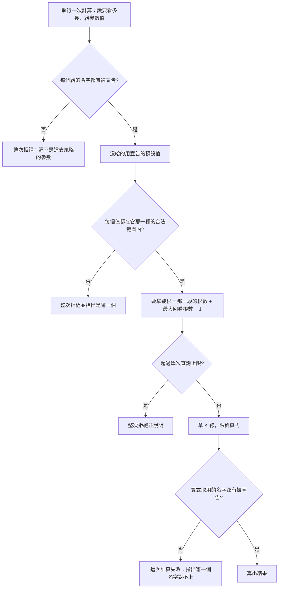

# Product Requirements Document (PRD)

**Feature:** 策略自己的旋鈕
**Status:** Finalized
**Version:** v1.0
**Owner:** James Hsueh
**Stakeholders:** 後端（go-trading）、前端（go-trading-frontend）

---

## 1. Background & Goal (Why & Goal)

- **Problem Statement:**
  執行指標計算時要填「計算根數」，而使用者答不出來該填多少。
  他想做的是：一支策略同時畫出快線、中線、慢線三條均線，並在執行的當下
  把快線從二十期改成五十期——**不必編輯算式**。現在那三個期數寫死在算式裡，
  而「計算根數」只有一格，他得自己算出三者的最大值。
  **那個數字問錯了人**：「這條線要看過去多少根」是算法自己的事。

- **Expected Outcome:**
  策略帶著自己的旋鈕：宣告它有哪幾個可以調的東西，執行時給值，算式照著算。
  「這一次要拿幾根」從此由系統推導，使用者再也不必回答它。

- **Out of Scope:**
  - 是非、下拉選單之類的參數種類。
  - 由系統去讀算式、猜出它需要哪些參數。
  - 參數之間互相依賴的規則。
  - 改變彙總刻度與「要看多長」由執行當下指定的既有決定。
  - 改變「湊不滿就整次拒絕」與單次查詢上限。
  - 參數值要不要被記住、畫面上怎麼呈現這些格子。

---

## 2. User Personas

- **Primary Role(s):** 自己寫策略、也自己看行情的人（本專案作者本人）。
- **Usage Context:**
  寫好一支算法之後，會反覆調整它的數字來比較——二十期跟五十期哪個好、
  倍數兩倍跟兩倍半差在哪。每調一次就重跑一次。

---

## 3. User Stories & Acceptance Criteria

### US-01 — 策略帶著自己的旋鈕 [priority: P0]

**As a** 寫策略的人，**I want** 策略記著它有哪幾個可以調的東西，
**so that** 我改數字時不必去動算式。

```gherkin
Scenario: 帶著參數的策略被完整記住
  Given 一支策略宣告「期數」是回看根數、預設 20
  And 同一支策略宣告「倍數」是數值、預設 2
  When 建立這支策略
  Then 兩個參數連同它們的種類與預設值都被記住

Scenario: 讀回來時參數原樣還在
  Given 一支已經建立、帶著「期數」與「倍數」的策略
  When 讀取這支策略
  Then 兩個參數連同種類與預設值原樣回來

Scenario: 一個參數都不宣告的策略照常運作
  Given 一支策略一個參數都沒有宣告
  When 建立它並執行一次計算
  Then 建立成功
  And 計算照常進行，與沒有這項功能時完全相同

Scenario: 參數名稱不得重複
  Given 一支策略的兩個參數都叫「期數」
  When 建立這支策略
  Then 建立被拒絕
  And 說明參數名稱不得重複

Scenario: 參數名稱不得為空白
  Given 一支策略的某個參數名稱是空白
  When 建立這支策略
  Then 建立被拒絕
  And 說明參數名稱不得為空白

Scenario: 參數名稱前後的空白不予保留
  Given 一支策略的某個參數名稱前後帶著空白
  When 建立這支策略
  Then 記住的是去掉前後空白之後的名字

Scenario: 回看根數必須大於零
  Given 一支策略宣告「期數」是回看根數、預設 0
  When 建立這支策略
  Then 建立被拒絕
  And 說明回看根數必須大於零

Scenario: 參數種類只有兩種
  Given 一支策略宣告某個參數的種類既不是回看根數也不是數值
  When 建立這支策略
  Then 建立被拒絕
  And 說明參數種類只有回看根數與數值兩種

Scenario: 數值不限正負與小數
  Given 一支策略宣告「偏移」是數值、預設 -1.5
  When 建立這支策略
  Then 建立成功——系統本來就不解讀數值的意思
```

### US-02 — 這一次要拿幾根由系統推導 [priority: P0]

**As a** 執行計算的人，**I want** 系統自己算出要拿多少 K 線，
**so that** 我只要說我想看多長，不必替算式記帳。

```gherkin
Scenario: 要看的每一格都有值
  Given 要看的那一段裡有 12 根
  And 最大的回看根數是 20
  When 執行計算
  Then 拿 31 根 K 線餵給算式

Scenario: 沒有回看根數時就是那一段的根數
  Given 要看的那一段裡有 12 根
  And 這支策略一個回看根數參數都沒有
  When 執行計算
  Then 拿 12 根 K 線餵給算式

Scenario: 好幾個回看根數時只看最大的
  Given 這支策略的回看根數參數是 20、50、100
  And 要看的那一段裡有 12 根
  When 執行計算
  Then 拿 111 根 K 線餵給算式

Scenario: 只看一格時照樣拿滿回看所需
  Given 要看的那一段裡有 1 根
  And 最大的回看根數是 100
  When 執行計算
  Then 拿 100 根 K 線餵給算式

Scenario: 推導出來的根數超過上限時整次拒絕
  Given 推導出來要拿的根數超過單次查詢上限
  When 執行計算
  Then 整次計算被拒絕並說明原因
  And 不回傳任何部分結果
```

### US-03 — 算式以名字取用參數 [priority: P0]

**As a** 寫算式的人，**I want** 用名字取到它那一種該有的樣子，
**so that** 我不必自己判斷拿到的是什麼，也不會在算到一半才爆掉。

```gherkin
Scenario: 回看根數取出來就是可以數根數的整數
  Given 一支策略宣告「期數」是回看根數、預設 20
  And 算式以「期數」這個名字取用它
  When 執行計算
  Then 算式取到 20
  And 取到的是一個可以直接拿去數根數的整數

Scenario: 這一次給的值蓋過宣告的預設值
  Given 一支策略宣告「倍數」是數值、預設 2
  And 這一次給「倍數」的值是 2.5
  When 執行計算
  Then 算式取到 2.5

Scenario: 算式取用沒有宣告的名字就是這次計算失敗
  Given 一支策略宣告的參數叫「週期」
  And 算式取用的名字是「期數」
  When 執行計算
  Then 這一次計算失敗
  And 說明「期數」這個名字沒有被宣告

Scenario: 失敗說的是名字對不上，不是算式寫壞了
  Given 上一個情境的失敗說明
  When 使用者讀它
  Then 它指出的是哪一個參數名字對不上
  And 它沒有說算式本身有問題
```

### US-04 — 執行時給參數值 [priority: P0]

**As a** 執行計算的人，**I want** 只給我要改的那幾個，
**so that** 我不必每次重述策略已經知道的事。

```gherkin
Scenario: 給了值就用給的
  Given 一支策略宣告「期數」是回看根數、預設 20
  And 這一次給「期數」的值是 50
  When 執行計算
  Then 用 50 去算

Scenario: 沒給值就用宣告的預設值
  Given 一支策略宣告「期數」是回看根數、預設 20
  And 這一次什麼參數值都沒給
  When 執行計算
  Then 用 20 去算

Scenario: 給了沒有宣告的參數名稱就整次拒絕
  Given 一支策略只宣告了「期數」
  And 這一次給了「週期」的值
  When 執行計算
  Then 整次計算被拒絕
  And 說明「週期」不是這支策略的參數

Scenario: 給的回看根數不合法就整次拒絕
  Given 一支策略宣告「期數」是回看根數
  And 這一次給「期數」的值是 0
  When 執行計算
  Then 整次計算被拒絕
  And 說明回看根數必須大於零

Scenario: 給了沒有人取用的參數值不是錯誤
  Given 一支策略宣告了「期數」，但算式並沒有取用它
  And 這一次給「期數」的值是 50
  When 執行計算
  Then 計算照常進行——沒有人取用不是錯誤
```

---

## 4. Business Flow & Logic



**Core Business Rules**

- **一支策略記著它有哪些參數**：每個參數有參數名稱、參數種類、參數預設值。
- **參數種類只有兩種**：回看根數（大於零的整數）與數值（任何數字）。
- **同一支策略內參數名稱不得重複**；不得為空白；前後空白不予保留。
- **這一次要拿幾根**＝要看的那一段裡的根數 ＋ 最大的回看根數 − 1。
  沒有任何回看根數參數時，就是那一段的根數。
- **沒給值就用宣告的預設值**；**給了沒宣告的名字就整次拒絕**。
- **算式取用沒宣告的名字，就是這一次計算失敗**，並指出是哪一個名字。
- **一個參數都不宣告的策略行為完全不變。**
- **參數數量不設上限。**

**Edge Cases**

- 要看的那一段只有一格、而回看根數很大 → 照樣拿滿回看所需，算出一個值。
- 給了一個宣告過、但算式沒有取用的參數值 → 不是錯誤。
- 推導出來的根數超過單次查詢上限 → 沿用既有規則整次拒絕。

---

## 5. UI/UX Design & Interaction

系統這一側沒有畫面。對呼叫端而言，一支策略多回覆一份參數宣告，
執行計算時多收一份參數值——**畫面怎麼把它們長成輸入框，是使用畫面那一側的事**。

---

## 6. Non-Functional Requirements

- **Performance:**
  參數不改變計算的成本結構。要拿的根數變多是因為使用者要求了更長的回看，
  而它仍受單次查詢上限約束。

- **Security:** 無新增。參數值只影響這一次計算，不改變任何既有資料。

- **Compatibility:** N/A（沒有畫面）。

- **Analytics / Tracking:** N/A。

---

## 7. Dependencies & Risks

**External Dependencies:** 無新增。

**與「策略不記取數計畫」那條既有決定的關係：**

`.sdd/2026-09-03-strategy-execution-parameters/` 刻意把**彙總刻度**與**計算根數**
從策略身上拿掉，理由是它們描述「這一次要怎麼算」。**那條決定完全不變，一個字都沒有被推翻。**

本切片放回策略的**不是**它們，而是**這支算式自己的旋鈕**：

| | 屬於誰 | 為什麼 |
| :--- | :--- | :--- |
| 彙總刻度、要看多長 | **這一次執行** | 同一支均線可以套在五分鐘或一小時上、可以算最近三小時或三天 |
| 快線是二十期 | **這支算法** | 換到哪裡去算都一樣，它是這支算法的一部分 |

先前的切片把「計算根數」拿掉是對的——它確實屬於這一次。
本切片只是補上一件當時沒有分開看的事：**算法自己也有數字**，
而那些數字先前只能寫死在算式裡。

**Known Risks:**

- **既有策略會壞掉，而這是刻意接受的。** 系統仍在開發階段、尚未上線，
  使用者已明確表示不必為了相容而扭曲設計。因此本切片選的是最好讀、
  最不容易用錯的形狀，而不是最不會影響既有資料的形狀。
- **「算式取用沒宣告的名字」要能被發現。** 這條規則的價值全在於它真的會擋下來；
  若它只在某些情況下才生效，使用者反而更容易相信一個錯的答案。
- **回看根數把要拿的根數推高。** 使用者調大回看根數時，
  要拿的 K 線跟著變多，可能撞上單次查詢上限。屆時的訊息必須說清楚
  是「這個回看根數配這一段太長了」，而不是一句籠統的超過上限。

---

## 8. Appendix

- 需求共識：`BRIEF.md`（同一資料夾）
- 不衝突的既有決定：`.sdd/2026-09-03-strategy-execution-parameters/`
- 通用語言：`.sdd/UL-MAP.md`
