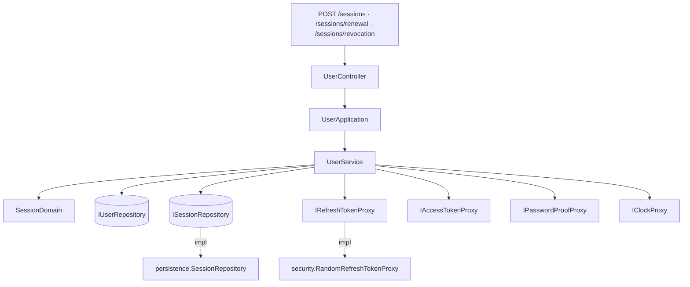
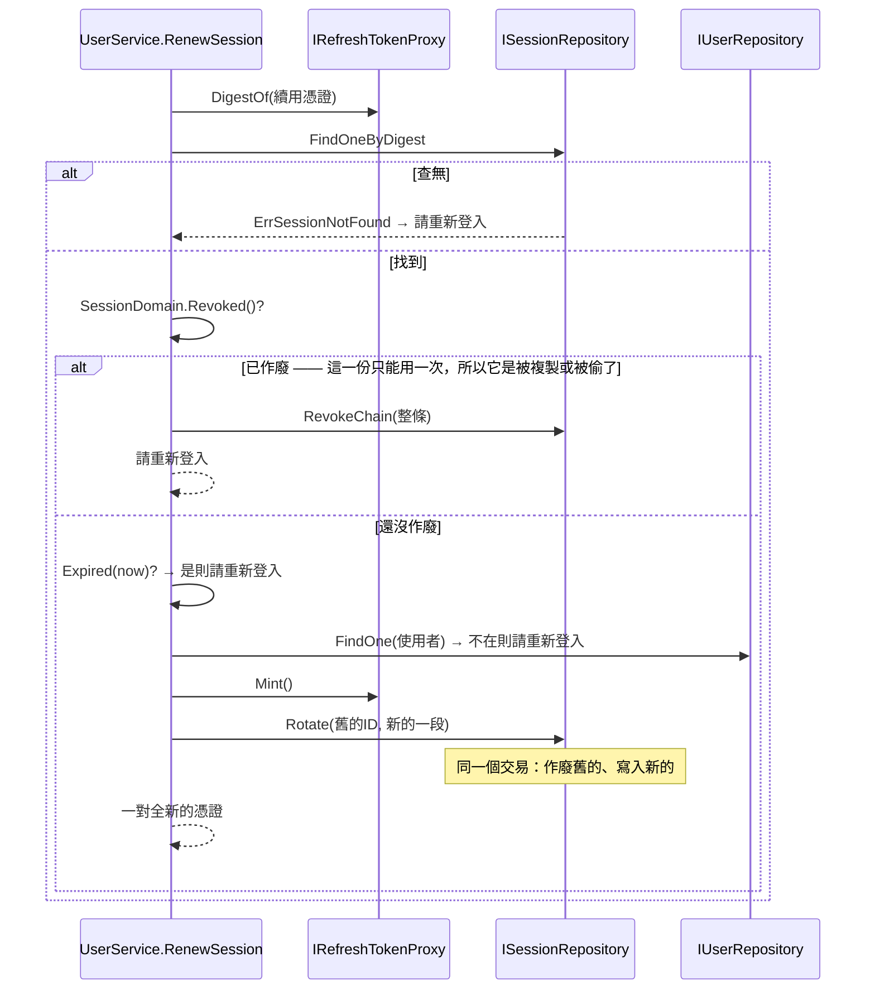

# 登入階段的續用與結束 — Architecture Design

**Status:** Draft
**Source PRD:** `.sdd/2026-09-05-session-renewal/PRD.md`
**Tech context:** Go · Gin · GORM/PostgreSQL · Clean/Onion Architecture

---

## 1. Design Goal & Guiding Principle

- **In one sentence:**
  讓「撤得掉」與「不必天天重登」同時成立——多一張登入階段的表承擔撤銷，
  而**一般請求仍然一次資料庫都不必讀**。

- **Guiding principle:**
  **把狀態放在只有低頻操作會碰到的那一半。**

  這個切片的整個設計都是同一個取捨：驗證登入憑證是**每一個請求**都要做的事，
  所以它必須無狀態；撤銷是**低頻**的事（登出、每 15 分鐘一次的續用），
  所以它可以有狀態。把兩者混在同一份憑證上，只能二選一。拆成一對，兩邊各取所需。

  這條原則也決定了留存樣為什麼與密碼證明不同：密碼證明每次摻不同的隨機料，
  因此只能逐筆比對——那對登入來說沒問題（一次一筆），對續用來說卻是全表掃描。
  續用憑證是系統自己產的隨機值，**沒有字典可以猜**，所以它可以用一個查得到的雜湊。

---

## 2. Change Scope

| Area | Action | What / Why |
| :--- | :--- | :--- |
| `internal/domain/models/entities/` | **Add** | `Session`——多一張表，就多一個乾淨的資料模型；`User` 加一條 has-many 讓刪人連帶刪階段 |
| `internal/domain/models/domains/` | **Add** | `SessionDomain`（這一段還能不能用）＋這個切片的哨兵錯誤 |
| `internal/domain/models/dto/`、`vo/` | **Add／Modify** | `AccessTokenDto` 擴成一對憑證；新增 `RefreshTokenVo` |
| `internal/domain/interface/` | **Add** | `ISessionRepository`、`IRefreshTokenProxy` |
| `internal/domain/service/user_service.go` | **Modify** | `SignIn` 改成開一段登入階段；新增 `RenewSession`、`RevokeSession` |
| `internal/application/user_application.go` | **Modify** | 多兩個用例 |
| `internal/infrastructure/persistence/` | **Add／Modify** | `SessionRepository`；`SchemaMigrator` 多登錄一個 entity |
| `internal/infrastructure/security/` | **Add** | `RandomRefreshTokenProxy` |
| `internal/controller/` | **Modify** | 多兩條路與一個 `Request` |
| `internal/config/` | **Modify** | 登入憑證期限改以**分鐘**計、預設 15；新增續用憑證期限（天，預設 30） |
| `internal/domain/models/domains/user_errors.go` | **Not touched** | 續用失敗與憑證不算數是**同一句**，沿用 `ErrAuthenticationRequired`，不新增第二種說法 |
| `GET /users/me` | **Not touched** | 它只看登入憑證的簽章。這個切片一個字都不改它——那正是無狀態的價值所在 |
| 既有行情端點 | **Not touched** | 仍然不問來者是誰（理由見 PRD §1） |

---

## 3. New Classes / Modules

### 3.1 Domain — Entities

| Name | Kind | Responsibility | Satisfies |
| :--- | :--- | :--- | :--- |
| `Session` | Entity | 一段登入階段的欄位與持久化對應 | US-01…US-06 |

```
Session
  ID                 primaryKey
  UserID             not null, index, FK → Users (OnDelete: CASCADE)
  ChainID            size:64, not null, index      ← 換發鏈
  RefreshTokenDigest size:64, not null, uniqueIndex ← 留存樣，不是原文
  ExpiresAt          timestamptz, not null
  RevokedAt          *timestamptz                   ← null = 還有效
  CreatedAt          timestamptz, not null
```

- **`RefreshTokenDigest` 帶 unique index**，理由與電子郵件那個相同：唯一性由索引決定，
  而不是先查再寫。它同時也是**查詢用的鍵**——這就是留存樣必須「不摻隨機料」的原因。
- **`ChainID` 帶一般索引**，因為撤銷整條鏈是照它查的。
- **`RevokedAt` 是可空的時刻而不是布林**：知道「何時」比知道「是否」多花零成本，
  而少了它，任何一次事後追查都無從開始。
- **`UserID` 的 CASCADE 是 US-06 的全部**：刪人連帶刪階段由資料庫保證，
  不是由某段記得要一起刪的程式碼保證。

### 3.2 Domain — Domain Models

| Name | Responsibility | Satisfies |
| :--- | :--- | :--- |
| `SessionDomain` | 一段登入階段現在算不算數：`Revoked()` 與 `Expired(now)`。並產出下一段（`Renewed(...)`，沿用同一條鏈、到期時刻從當下重算） | US-02、US-03、US-04 |

- **`Revoked()` 與 `Expired()` 分開問，而且刻意**沒有**一個把兩者合起來的 `Usable()`**：
  它們導向**不同的動作**。過期就只是拒絕；已作廢是**盜用**，要撤掉整條鏈。
  合成一個布林，那個分別就消失了，而它正是這個切片最重要的一條規則——
  所以那個布林連存在都不該存在，免得下一個人順手用了它。

### 3.3 Domain — DTO / VO

| Name | Kind | Responsibility |
| :--- | :--- | :--- |
| `dto.SessionTokensDto` | DTO（**取代 `AccessTokenDto`**） | 登入與續用共同的產出：**一對**憑證與**兩個**到期時刻。改名而不是擴充舊名，因為它裝的已經不是「一份登入憑證」了——沿用舊名會讓每個讀到它的人先誤會一次 |
| `dto.SessionRenewalDto` | DTO | 呼叫端交給 domain 的續用／登出輸入：一份續用憑證 |
| `vo.RefreshTokenVo` | VO | 剛產生的一份續用憑證：**交給持有者的原文**與**要留存的留存樣**。兩者一起產出，因為原文只有這一刻存在 |

### 3.4 Domain — Interfaces

| Name | Responsibility | 為什麼是介面 |
| :--- | :--- | :--- |
| `ISessionRepository` | `Save`、`FindOneByDigest`、`Rotate`、`RevokeChain` | 儲存是最外層邊界 |
| `IRefreshTokenProxy` | `Mint()` 產一份新的（原文＋留存樣）、`DigestOf(raw)` 算出查詢用的留存樣 | 亂數與雜湊是會被換掉的技術細節，而 domain 不得認識任何實作 |

**`ISessionRepository` 的四個方法各自是一整個業務動作**，沒有一個需要呼叫端排兩次呼叫：

- `Rotate(ctx, previousID, next)` —— **作廢舊的與寫入新的在同一個交易裡，而且只對還沒作廢的那一段成立**。
  - 拆成兩個方法交給 service 依序呼叫，中間斷掉就會留下「舊的已作廢、新的沒寫成」，
    而那位使用者手上兩份都不能用，且不會知道為什麼。
  - **「只對還沒作廢的那一段成立」這個條件必須掛在寫入上，不能靠事先檢查。**
    呼叫端確實會先讀一次並確認它還有效，但讀取與寫入是兩個時刻：兩個帶著同一份續用憑證
    的請求會讀到同一個結果，然後都往下寫。條件放在寫入上，慢的那一個一列都動不到，
    回 `ErrSessionAlreadyRotated`——service 把它當成盜用處理。
    它同時也擋住「續用把剛剛的登出還原掉」。
- `RevokeChain(ctx, chainID)` —— 登出與盜用偵測**共用它**。兩者要做的事一模一樣：
  這條鏈整條不要了。

### 3.5 Domain — Service

`UserService` 從三個用例長成五個。它仍然是一個 service，理由與上一個切片相同：
**同一個變更理由**——什麼算是被這個系統認得，以及怎樣算還被認得。
拆開的話，`SignIn` 與 `RenewSession` 會各自需要同一組 repository 與 proxy。

| Method | 變更 | 說明 |
| :--- | :--- | :--- |
| `RegisterUser` | 不變 | |
| `SignIn` | **改** | 帳密對上之後**開一段新的登入階段**，回一對憑證 |
| `IdentifyUser` | **不變** | 只看簽章，一次資料庫都不讀 |
| `RenewSession` | **新** | 查留存樣 → 判作廢／過期／使用者還在不在 → 輪替 → 一對新的 |
| `RevokeSession` | **新** | 查留存樣 → 撤整條鏈。**查不到也算成功** |

兩個私有 helper，各自被兩個公開方法共用，都過得了「被 2 個以上公開方法用到才留成 private」的門檻：

- `newSessionMaterial(userID, now)` —— 產續用憑證並簽登入憑證，**在任何寫入之前**。
  被 `SignIn` 與 `RenewSession` 共用。
- `sessionHolding(ctx, refreshToken)` —— 從一份續用憑證找出它所屬的那一段。
  被 `RenewSession` 與 `RevokeSession` 共用。它的第二個回傳值**只說「有沒有」**，
  不替呼叫端決定：續用時「沒有」是拒絕，登出時「沒有」是成功。
  替他們決定的話，這個 helper 就得知道是誰在呼叫它——那等於它不是 helper。

### 3.6 Infrastructure

| Name | Responsibility |
| :--- | :--- |
| `persistence.SessionRepository` | GORM 實作。`Rotate` 是一個交易 |
| `security.RandomRefreshTokenProxy` | 以密碼學等級亂數產生原文，以 SHA-256 算留存樣 |

**為什麼是 SHA-256 而不是 bcrypt**（這是本切片最容易做錯的一個決定）：

| | 密碼 | 續用憑證 |
| :--- | :--- | :--- |
| 誰產生的 | 人挑的 | 系統產的密碼學亂數 |
| 猜得到嗎 | 字典猜得到 → 必須讓每次猜很貴 | 猜不到 → 讓它變貴買不到任何東西 |
| 要查得到嗎 | 不必（一次比一筆） | **必須**（照留存樣查） |
| 因此 | bcrypt（摻鹽、刻意慢） | SHA-256（不摻鹽、快、可索引） |

替續用憑證用 bcrypt 會**同時**做錯兩件事：每列鹽不同導致查不到（只能全表掃描逐筆比對），
以及在一個沒有字典可猜的東西上付出刻意慢的代價。

### 3.7 Controller

| 路徑 | 方法 | 說明 |
| :--- | :--- | :--- |
| `POST /sessions` | 既有 | 回應**多兩個欄位**，既有欄位意義不變 |
| `POST /sessions/renewal` | **新** | body 帶續用憑證，回一對新的 |
| `POST /sessions/revocation` | **新** | body 帶續用憑證，撤整條鏈 |

- **兩者都是 `POST` 而不是 `DELETE /sessions`**：要撤哪一段是由**續用憑證本身**指名的，
  而它只能放在 body 裡；帶 body 的 `DELETE` 雖然合法，卻會被一部分中介與客戶端丟掉。
  `renewal` 與 `revocation` 成對，讀起來也對稱。
- 狀態碼：續用成功 `200`；`ErrAuthenticationRequired` → `401`；
  `ErrAccessTokenUnavailable` → `503`；其餘 → `502`。
  **登出永遠 `204`**，除非系統本身壞掉。

---

## 4. Modified Components

| Component | Current role | Change needed |
| :--- | :--- | :--- |
| `entities.User` | 使用者那一列 | 多一條 `Sessions []Session`，讓 CASCADE 由 schema 表達出來 |
| `dto.AccessTokenDto` | 登入的產出 | **改名為 `SessionTokensDto`** 並從一份憑證擴成一對 |
| `UserService.SignIn` | 只簽一份憑證 | 改成開一段登入階段 |
| `persistence.SchemaMigrator` | 建每一張表 | 名單多一個 `&entities.Session{}` |
| `config.AuthenticationConfig` | 鑰匙＋一個期限 | 期限改分鐘計、預設 15；多一個續用憑證期限（天，預設 30） |
| `.env.example`、`README.md`、`postman/` | 文件與手動測試 | 同步 |

**設定的改名要講清楚**：`AUTH_ACCESS_TOKEN_LIFETIME_HOURS` 改成
`AUTH_ACCESS_TOKEN_LIFETIME_MINUTES`。不沿用舊名是因為**單位變了**——
沿用的話，一個寫著 `24` 的既有設定會安靜地從 24 小時變成 24 分鐘，
而那種「還是能跑、但意思變了」的改動是最難查的一種。改名會讓舊設定被忽略、退回預設值，
那是安全的方向（15 分鐘比 24 小時嚴）。

---

## 5. Component Relationships



續用那條路：



---

## 6. Extensibility & Handoff Notes

- **最可能的下一個需求：「目前有哪幾台裝置登入中」與「登出其他所有裝置」。**
  表已經存得下了——一條鏈就是一台裝置。落點是 `ISessionRepository` 多兩個方法
  （照使用者列出還有效的鏈、撤掉除了這一條以外的全部），加上兩條路。
  要顯示「這是哪一台」的話，`Session` 再多兩個欄位（裝置描述、最後使用時刻）。
- **第二可能：定期清掉早就過期的登入階段。** 落點是 `internal/job/` 一個新的
  `ExpiredSessionCleanupJob`，照既有的 `IBackgroundJob` 寫。
  **訊號**是這張表大到讓查詢變慢——單人系統一年也到不了，所以現在不做。
- **第三可能：替行情端點裝門。** 與上一個切片說的相同，落點是 middleware；
  這個切片讓它更值得做了，因為現在真的撤得掉。
- **不得寫死：** 兩個有效期限、簽章鑰匙。
- **刻意留簡單的：**
  - **不記錄作廢的原因**（被換掉／登出／盜用）。對呼叫端而言結果完全相同，
    記了也沒有人會去讀。**訊號**是有人開始問「我為什麼被登出」。
  - **盜用偵測會誤傷**（兩個分頁同時續用）。**訊號**是使用者抱怨莫名其妙被登出；
    真要處理，做法是給剛換發過的舊憑證一段幾秒的寬限期，而不是拿掉偵測。

---

## 7. Traceability

| PRD Scenario | Fulfilled by |
| :--- | :--- |
| US-01 登入回覆一對憑證／留下一段登入階段 | `UserService.SignIn` + `SessionRepository.Save` |
| US-01 兩個到期時刻各自照自己的期限算 | `UserService.openSessionFor`（`IClockProxy` + 兩個期限） |
| US-01 兩台裝置各一段、彼此獨立 | `Session.ChainID`（每次登入產一條新的） |
| US-01 續用憑證的原文不留存 | `Session` 只有 `RefreshTokenDigest` 這個欄位 |
| US-01 建立帳號之後仍然直接就是登入狀態 | `UserService.RegisterUser`（不變，因為它借用 `SignIn` 的路徑） |
| US-02 換得到一對全新的／新舊不同 | `RandomRefreshTokenProxy.Mint` + `SessionRepository.Rotate` |
| US-02 續用不需要登入憑證也不需要密碼 | `RenewSession` 的簽名只收一份續用憑證 |
| US-02 新的到期時刻從換發當下重新算 | `SessionDomain.Renewed` |
| US-02 舊的那一份不能再用 | `SessionRepository.Rotate`（同一交易內作廢舊的） |
| US-03 查無／過期／使用者已不在 | `UserService.RenewSession` → `ErrAuthenticationRequired` |
| US-03 四種失敗一字不差 | 同一個 error 值，沒有第二個拼法可寫 |
| US-04 用過的再出現 → 整條鏈作廢 | `SessionDomain.Revoked()` + `SessionRepository.RevokeChain` |
| US-04 真正的持有者也被登出 | 同上（撤的是整條，不是那一份） |
| US-04 另一條鏈照常成功 | `RevokeChain` 只照 `ChainID` 撤 |
| US-05 登出之後換不到東西／撤的是整條鏈 | `UserService.RevokeSession` → `RevokeChain` |
| US-05 登出不存在／已作廢的也算成功 | `RevokeSession` 吞掉 `ErrSessionNotFound` |
| US-05 登出的是這一台，不是這個人 | 同 US-04 最後一列 |
| US-06 刪除使用者連帶刪掉登入階段 | `Session.UserID` 的 `OnDelete:CASCADE` |

---

## 8. Risks & Open Decisions

- **Risks / trade-offs:**
  - **登出之後登入憑證仍然通得過，最長到它自己過期。** 這是無狀態的代價，
    由 15 分鐘這個預設值界定。要縮短就調它——調到零就等於回到每個請求都查資料庫。
  - **盜用偵測會誤傷。** 誤傷成本是重登一次；不做的成本是偷走的憑證可以一直用。接受。
  - **登入階段的表只長不消。** 見 §6 的清理工作與它的訊號。
  - **設定改名會讓舊的 `AUTH_ACCESS_TOKEN_LIFETIME_HOURS` 被忽略。** 這是刻意的，
    而且退回的預設值比舊值更嚴。README 會寫明。
- **Open decisions（留給實作）:**
  - 續用憑證原文的長度與編碼——需要「猜不到」且「放得進 body 與瀏覽器儲存」。
  - `ChainID` 的產生方式——只要不重複即可，不需要可預測性。
