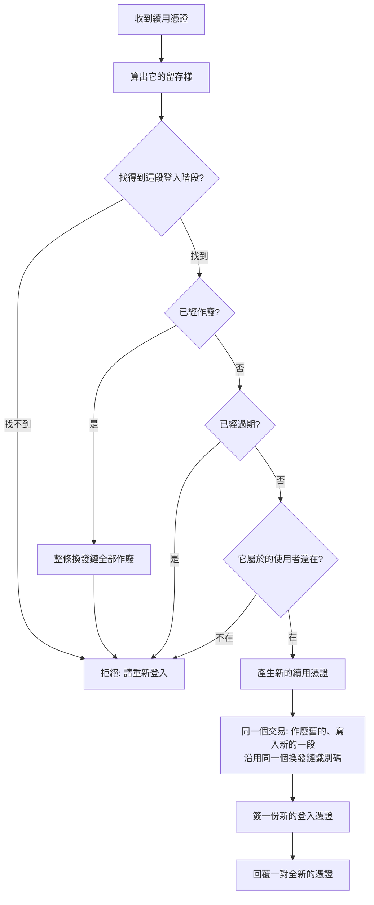

# Product Requirements Document (PRD)

**Feature:** 登入階段的續用與結束
**Status:** Draft
**Version:** v1.0
**Owner:** James Hsueh
**Stakeholders:** Engineering

---

## 1. Background & Goal (Why & Goal)

- **Problem Statement:**
  上一個切片發出去的登入憑證**收不回來**：系統這一側不留任何紀錄，
  所以「登出」只是持有者自己把它丟掉，而系統照樣認它到它自己過期為止。
  為了把那個窗口壓短，憑證有效期限只給 24 小時；代價是使用者每天都要重打一次密碼。
  **「撤得掉」與「不必天天重登」在單一憑證的設計下是互斥的。**

- **Expected Outcome:**
  把一份憑證拆成一對，兩件事同時成立。可驗證的結果有五項：
  1. 登入回覆**一對**憑證，並在系統裡留下**一段登入階段**。
  2. 帶著續用憑證換得到一對全新的；舊的那一份**當場失效，只能用一次**。
  3. **登出之後，那條換發鏈上的任何一份續用憑證都換不到東西**——真的登出。
  4. 一份**已經用過**的續用憑證再次出現，整條換發鏈立刻全部作廢。
  5. 資料庫裡**找不到任何一份續用憑證的原文**。

- **Out of Scope:**
  - 替既有的行情端點（K 線、指標計算、策略、助手、即時跟盤）裝上門。理由不變：
    即時跟盤是瀏覽器的持續連線、送不出授權標頭。
  - 第三方登入（OAuth／OIDC）。本切片是自家後端的換發機制，與第三方無關。
  - 「目前有哪幾台裝置登入中」的清單、「登出其他所有裝置」。
  - 記錄登入階段來自哪一台裝置或哪個位址。
  - **撤銷登入憑證**。它不留存，撤不掉（見 §4 的核心規則）。
  - 定期清掉早就過期的登入階段。

---

## 2. User Personas

- **Primary Role(s):** **使用者**——這台操作台的主人。
- **Usage Context:**
  每天打開操作台就直接能用，不必重打密碼；離開幾週再回來才需要重登。
  想要確實登出的時候，按下去就是真的登出，而不是「把鑰匙丟掉但門還開著」。

---

## 3. User Stories & Acceptance Criteria

### US-01 — 登入給的是一對憑證，並開一段登入階段 [priority: P0]

**As a** 使用者，**I want** 登入時同時拿到一份短命的通行憑證與一份長命的續用憑證，
**so that** 日常請求快，而系統又有東西可以撤銷。

```gherkin
Scenario: 登入回覆一對憑證
  Given 使用者的帳密正確
  When 使用者登入
  Then 回覆登入憑證與它的到期時刻
  And 回覆續用憑證與它的到期時刻

Scenario: 登入在系統裡留下一段登入階段
  Given 系統目前沒有任何登入階段
  When 使用者登入
  Then 系統多出一段屬於這位使用者的登入階段

Scenario: 兩個到期時刻各自照自己的期限算
  Given 登入憑證期限是 15 分鐘、續用憑證期限是 30 天
  And 現在是 2026-09-05 08:00（世界標準時間）
  When 使用者登入
  Then 登入憑證到期於 2026-09-05 08:15
  And 續用憑證到期於 2026-10-05 08:00

Scenario: 同一位使用者在兩台裝置上各登入一次
  Given 使用者已經在一台裝置上登入
  When 使用者在另一台裝置上再登入一次
  Then 系統有兩段登入階段，彼此獨立

Scenario: 續用憑證的原文不留存
  Given 使用者成功登入
  When 讀取系統為這段登入階段留下的內容
  Then 找不到續用憑證的原文

Scenario: 建立帳號之後仍然直接就是登入狀態
  Given 使用者用合法的電子郵件與密碼建立帳號
  When 建立成功
  Then 使用者不必再填一次，就拿得到一對憑證
```

### US-02 — 拿續用憑證換一對新的 [priority: P0]

**As a** 使用者，**I want** 不必重打密碼就換到新的通行憑證，
**so that** 我可以好幾週不必重新登入。

```gherkin
Scenario: 續用換得到一對全新的
  Given 一份有效的續用憑證
  When 使用者續用
  Then 回覆一對全新的憑證
  And 新的續用憑證與原本那一份不同

Scenario: 續用不需要登入憑證，也不需要密碼
  Given 一份有效的續用憑證，且登入憑證早已過期
  When 使用者只帶著續用憑證續用
  Then 續用成功

Scenario: 新的到期時刻從換發當下重新算
  Given 續用憑證期限是 30 天
  And 換發當下是 2026-09-10 08:00（世界標準時間）
  When 使用者續用
  Then 新的續用憑證到期於 2026-10-10 08:00

Scenario: 續用之後舊的那一份就不能再用
  Given 使用者剛剛續用過一次
  When 使用者再拿**舊的**那一份續用憑證換發
  Then 續用被拒絕
```

### US-03 — 續用被拒絕永遠只有一種說法 [priority: P0]

**As a** 系統的主人，**I want** 續用失敗時系統不透露是哪一種失敗，
**so that** 沒有人能拿續用這條路去問出任何關於憑證的事。

```gherkin
Scenario: 查無這份續用憑證
  Given 一份系統從未發出過的續用憑證
  When 使用者續用
  Then 續用被拒絕，說「請重新登入」

Scenario: 續用憑證已經過期
  Given 一份已經過了到期時刻的續用憑證
  When 使用者續用
  Then 續用被拒絕，說「請重新登入」

Scenario: 續用憑證指向的使用者已經不在
  Given 一份完好未過期的續用憑證，但它屬於的使用者已被刪除
  When 使用者續用
  Then 續用被拒絕，說「請重新登入」

Scenario: 四種失敗的說法一字不差
  Given 查無、過期、已作廢、使用者已不在四種情況
  When 分別嘗試續用
  Then 四次得到的說法完全相同
```

### US-04 — 一份用過的續用憑證再出現，整條鏈全部作廢 [priority: P0]

**As a** 系統的主人，**I want** 被複製的續用憑證一被使用就讓整條鏈失效，
**so that** 偷走它的人最多只能用一次，而且我方會知道。

```gherkin
Scenario: 用過的續用憑證再次出現時整條鏈作廢
  Given 一條已經換發過三次的換發鏈
  When 有人拿鏈上**最早**那一份續用憑證來換發
  Then 換發被拒絕
  And 這條鏈上的每一段登入階段全部作廢，包含目前那一份還沒用過的

Scenario: 真正的持有者也會被登出
  Given 承上，整條鏈已經作廢
  When 真正的持有者拿他手上那一份續用憑證來換發
  Then 換發被拒絕，說「請重新登入」

Scenario: 出事的是那一條鏈，不是那個人
  Given 同一位使用者在另一台裝置上有另一條換發鏈
  When 承上事件發生之後，他在那台裝置上續用
  Then 續用照常成功
```

### US-05 — 登出是真的登出 [priority: P0]

**As a** 使用者，**I want** 按下登出之後那台裝置真的進不來，
**so that** 「登出」這兩個字是可信的。

```gherkin
Scenario: 登出之後那份續用憑證就換不到東西
  Given 一份有效的續用憑證
  When 使用者登出
  Then 登出成功
  And 之後拿那份續用憑證續用會被拒絕

Scenario: 登出撤掉的是整條換發鏈
  Given 一條已經換發過兩次的換發鏈
  When 使用者拿目前那一份續用憑證登出
  Then 之後拿這條鏈上任何一份續用憑證續用，全部被拒絕

Scenario: 登出一段不存在的登入階段也算成功
  Given 一份系統從未發出過的續用憑證
  When 使用者登出
  Then 登出成功——目的已經達成，沒有東西需要被撤掉

Scenario: 重複登出也算成功
  Given 一份已經作廢的續用憑證
  When 使用者再登出一次
  Then 登出成功

Scenario: 登出的是這一台，不是這個人
  Given 同一位使用者在另一台裝置上也有登入階段
  When 使用者在這一台登出
  Then 另一台的登入階段仍然有效
```

### US-06 — 使用者不在了，他的登入階段也不在 [priority: P1]

**As a** 系統的主人，**I want** 刪掉一位使用者就連他的登入階段一起消失，
**so that** 不會留下一堆指向不存在的人、卻還在資料庫裡的登入階段。

```gherkin
Scenario: 刪除使用者會連他的登入階段一起刪掉
  Given 一位使用者有兩段登入階段
  When 這位使用者被刪除
  Then 系統裡不再有屬於他的任何登入階段
```

---

## 4. Business Flow & Logic

**續用**



- **Core Business Rules:**
  - **登入憑證仍然不留存。** 留存它等於每一個請求都要多讀一次資料庫，
    而不必讀資料庫正是它唯一的好處。真要每次都查，發一串隨機字比發 JWT 更小更簡單——
    留存 JWT 是兩邊的缺點都拿到。**撤銷的顆粒度因此落在續用憑證上，最慢在登入憑證有效期限後生效。**
  - **續用憑證只能用一次。** 換發即輪替：舊的當場作廢。
  - **留存的是留存樣，不是原文。** 算得過去、算不回來、固定長度，且**查得到**——
    所以它與密碼證明不同：密碼證明每次摻不同的隨機料（因此查不到、只能逐筆比對），
    而續用憑證是系統自己產的隨機值，**沒有字典可以猜**，不需要刻意慢的算法，也需要能被查到。
  - **作廢與寫入必須在同一個交易裡。** 分開的話，中間斷掉會留下「舊的已作廢、新的沒寫成」——
    那位使用者手上兩份都不能用，而且他不會知道為什麼。
  - **盜用偵測撤的是整條鏈，不是那一份。** 因為此刻**沒有辦法分辨誰是真的**：
    偷走的人與真正的持有者手上各有一份，撤錯一邊等於什麼都沒做。
  - **登出撤的也是整條鏈。** 一條鏈就是一台裝置的這一次登入。
  - **登出一段不存在或已作廢的登入階段不算失敗。** 目的已經達成。
  - **每一種續用失敗都說同一句話。** 多一種說法就是多回答一個持有者本來問不到的問題。

- **Edge Cases:**
  - 兩個續用請求同時帶著同一份憑證到達 → 唯一索引讓其中一個成功；
    另一個看到的是已作廢，於是判定盜用並撤掉整條鏈。**這是可接受的誤判**：
    代價是重登一次，而放行的代價是盜用偵測形同虛設。
  - 續用時資料庫壞掉 → 整次失敗，且**不是**「請重新登入」——那是系統壞了，不是憑證的問題。
  - 沒有簽章鑰匙 → 續用也簽不出登入憑證，與登入同一種失敗。

---

## 5. UI/UX Design & Interaction

本切片是後端能力，畫面在前端專案的對應切片。後端只保證：

- 續用與登出各是一條路，**都只需要續用憑證**，不需要登入憑證、不需要密碼。
- 續用失敗與「憑證不算數」共用同一種回應，前端因此不必分辨兩者。
- 登出**永遠成功**（除非系統本身壞掉），前端不必替它準備失敗的畫面。

---

## 6. Non-Functional Requirements

- **Security:**
  - 續用憑證由**密碼學等級的亂數**產生，長度足以讓猜測不可行。
  - 留存的是留存樣，**原文不留存、不回覆兩次、不寫進紀錄檔**。
  - 比對留存樣時走的是索引查詢，不是逐筆比對。
- **Performance:**
  - **一般請求不因此多讀任何一次資料庫**——驗證登入憑證仍然只看簽章。
  - 續用是低頻操作（每 15 分鐘至多一次），多幾次資料庫往返無妨。
- **Compatibility:**
  - 既有的每一條端點行為不變。
  - `GET /users/me` 的行為不變。
  - **`POST /sessions` 的回應內容增加兩個欄位**，既有欄位的意義不變。

---

## 7. Dependencies & Risks

- **External Dependencies:** 無新的外部相依。亂數與雜湊都來自標準函式庫。
- **Known Risks:**
  - **登出之後，登入憑證最長還有「它的有效期限」那麼久仍然通得過。**
    這是無狀態換來的，明講出來：那個期限就是這個窗口的長度。預設 15 分鐘。
  - **盜用偵測會誤傷。** 網路不穩導致的重試、或兩個分頁同時續用，都可能踩到。
    誤傷的代價是重登一次；不做的代價是偷走的憑證可以一直用下去。接受。
  - **登入階段的表會一直長。** 單人系統一年也長不了多少，先不做清理。

---

## 8. Appendix

- 需求共識：`.sdd/2026-09-05-session-renewal/BRIEF.md`
- 前一個切片：`.sdd/2026-09-05-user-authentication/`
- 詞彙：`.sdd/UL-MAP.md`
