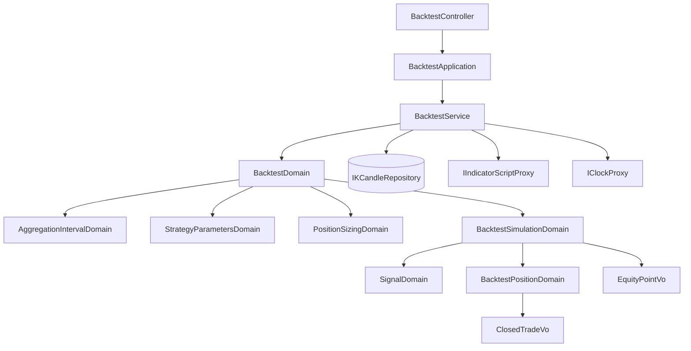

# 拿歷史重演一支策略 — Architecture Design

**Feature:** 策略回測
**Status:** Finalized
**PRD:** `PRD.md`（同一資料夾）
**Owner:** James Hsueh
**Tech context:** Go · Gin · GORM · Clean/Onion Architecture · yaegi 直譯器

---

## 1. Design Goal & Guiding Principle

三個問題必須正面回答，其餘都是它們的後果：

1. **算式怎麼在一千根 K 線上各跑一次，而不是把「解讀算式」也跑一千次。**
2. **「一次重演的條件」與「逐棒模擬」是不是同一個東西。**
3. **既有的指標計算一行都不能被動到，但取數規則要一字不差地重用。**

指導原則：**重演 = 逐棒的指標計算 + 一台狀態機。**

第一半已經存在了——取哪些 K 線、哪一格算走完、算式能碰什麼、參數怎麼對名字，
本切片**一條都不重寫**，只把「跑一次」變成「跑 N 次」。
第二半是全新的，而且是**純運算**：收下一串 K 線與一串信號，吐出一張成績單，
不碰資料庫、不碰時鐘、不碰直譯器——所以它整支都能用表格測試釘死。

---

## 2. 核心決策一：算式只解讀一次，執行 N 次

一次重演會把同一支算式跑幾百到上千次。若直接呼叫既有的 `Execute` N 次，
**每一次都會重新建立直譯器、重新解讀整段算式**——那是每一棒都付一次的固定成本，
而它與 K 線根數完全無關。

所以 `IIndicatorScriptProxy` 多一個方法，而不是由 domain service 迴圈呼叫舊的：

```go
type IIndicatorScriptProxy interface {
    Execute(ctx, script, resultType, kCandles, parameters) (map[string]vo.IndicatorValueVo, error)

    // ExecuteForEachCandle 把同一支算式在每一根 K 線上各執行一次：第 N 次執行時，
    // 算式看得到的是第一根到第 N 根（含）。回傳一根一組結果，順序與 K 線相同。
    ExecuteForEachCandle(ctx, script, resultType, kCandles, parameters) ([]map[string]vo.IndicatorValueVo, error)
}
```

**為什麼是介面上的一個方法，而不是呼叫端的一個迴圈**：
「只解讀一次、餵不同的資料執行多次」只有直譯器那一側做得到——
它需要抓住直譯器裡那個變數的位址並反覆改寫它。
把迴圈放在 domain service，等於要求 domain service 知道「解讀」與「執行」是兩件事，
而那正是這個 proxy 存在的理由。呼叫端只說一句話，複雜度全部關在裡面。

**實作**：`YaegiIndicatorScriptProxy` 內部抽出一個 `preparedScript`
（建立直譯器 → 掛上符號表 → 解讀算式 → 檢查進入點形狀），
`Execute` 是「準備一次、執行一次」，`ExecuteForEachCandle` 是「準備一次、執行 N 次」。
兩者共用同一份準備與同一份失敗判讀，所以**回測的錯誤說法與指標預覽一字不差**（PRD US-07）。
逐棒各自計時，沿用既有的算式允許時間（NFR-2）。

---

## 3. 核心決策二：條件與模擬是兩個模型

它們有兩個不同的改變理由：

| | 會因為什麼而改 |
| :--- | :--- |
| `BacktestDomain`（一次重演的條件） | 取數規則變了、驗證多一條 |
| `BacktestSimulationDomain`（逐棒模擬） | 交易規則變了（手續費、止損、下一棒成交） |

合成一個，等於讓「加一條驗證」與「加手續費」改同一個檔案。所以拆兩個，
並由**來源身上的轉換方法**把兩者接起來，呼叫端不必重新交代本金與押注模式：

```go
backtestDomain.Simulation(inputKCandles, perCandleIndicatorValues).ToDto()
```

---

## 4. Change Scope

### 新增

| 層 | 檔案 | 為什麼存在 |
| :--- | :--- | :--- |
| vo | `signal_vo.go` | `SignalVo`：買入／賣出／持平 |
| vo | `position_direction_vo.go` | `PositionDirectionVo`：多倉／空倉 |
| vo | `position_sizing_mode_vo.go` | `PositionSizingModeVo`：全押／百分比／固定金額 |
| vo | `closed_trade_vo.go` | 一筆已平倉交易（不可變值 + `ToDto`） |
| vo | `equity_point_vo.go` | 資金曲線上的一個點（不可變值 + `ToDto`） |
| domains | `signal_domain.go` | **把一組指標結果讀成一個意見**——本切片唯一「新的讀法」 |
| domains | `position_sizing_domain.go` | 「這次押多少、押不押得下去」 |
| domains | `backtest_position_domain.go` | 手上那一注：估值、損益、平倉 |
| domains | `backtest_domain.go` | 一次重演的條件與取數計畫（驗證、截止、上限、選 K 線） |
| domains | `backtest_simulation_domain.go` | **逐棒狀態機**：K 線 + 信號 → 成績單 / 交易明細 / 資金曲線 |
| domains | `backtest_errors.go` | `ErrBacktestValidation` 哨兵 |
| dto | `backtest_request_dto.go` | application → domain 的輸入形狀 |
| dto | `backtest_result_dto.go` | domain → application 的唯一輸出形狀 |
| dto | `backtest_summary_dto.go` | 成績單 |
| dto | `closed_trade_dto.go` / `equity_point_dto.go` | 交易明細與資金曲線的對外形狀 |
| service | `backtest_service.go` | `BacktestService`：application 的唯一入口 |
| application | `backtest_application.go` | 用例編排 |
| controller | `backtest_controller.go` | `POST /backtests` |
| controller/models | `backtest_request.go` | 請求 body |

### 修改

| 檔案 | 改什麼 | 為什麼必須 |
| :--- | :--- | :--- |
| `interface/i_indicator_script_proxy.go` | 多一個 `ExecuteForEachCandle` | §2 |
| `script/yaegi_indicator_script_proxy.go` | 抽出 `preparedScript`，兩個方法共用 | §2 |
| `interface/mocks/mock_i_indicator_script_proxy.go` | 重新產生 | 介面變了 |
| `cmd/server/dependencies.go` | 組裝並掛上路由 | 組裝根 |

### 刻意不動

| 區域 | 為什麼留在外面 |
| :--- | :--- |
| `IndicatorCalculationService` / `IndicatorCalculationDomain` | 重演與單算指標是兩個用例。共用的是**取數規則**（由 `AggregationIntervalDomain`、`KCandleSeriesDomain` 提供），不是這兩個型別 |
| `IKCandleRepository` | `FindInRange` 已經是「一段區間、由早到晚、帶上限」，正好是重演要的 |
| `StrategyParametersDomain` | 參數宣告、套值、對不上名字的失敗，一條都不改 |
| 任何 entity / 資料表 | **重演不留存**（BR-14），所以沒有新的資料表、沒有 migration |

---

## 5. New Classes / Modules

| Name | Kind | Responsibility | Collaborators | Satisfies |
| :--- | :--- | :--- | :--- | :--- |
| `SignalDomain` | Domain Model | 把一棒的指標結果讀成買入／賣出／持平：取名為 `signal` 的值，**看正負號**；沒有這個名字或不是有限數字即持平 | `vo.IndicatorValueVo` | US-01 全部 |
| `PositionSizingDomain` | Domain Model | 「這次押多少」：三種模式的驗證與 `StakeFor(可用資金) (押注金額, 押得下去嗎)` | — | US-03 全部 |
| `BacktestPositionDomain` | Domain Model | 手上那一注：方向、進場時間價格、押注金額、口數；`ValueAt(價)`、`ClosedAt(時間, 價)` | `vo.ClosedTradeVo` | US-02、US-04、US-05 |
| `BacktestDomain` | Domain Model | 一次重演的條件與取數計畫：驗證、讀取截止、讀取上限、`SelectInputCandles`（不足兩根即拒絕）、`Simulation(...)` | `AggregationIntervalDomain`、`KCandleSeriesDomain`、`StrategyParametersDomain`、`PositionSizingDomain` | US-06、US-07 |
| `BacktestSimulationDomain` | Domain Model | 逐棒狀態機：走一次 K 線，維護可用資金與倉位，收集已平倉交易與資金曲線，最後結算成績單 | `SignalDomain`、`BacktestPositionDomain`、`PositionSizingDomain` | US-02、US-03、US-04、US-05 |
| `BacktestService` | Domain Service | 編排：建條件 → 讀 K 線 → 逐棒執行算式 → 交給模擬 → 轉 DTO | `IKCandleRepository`、`IIndicatorScriptProxy`、`IClockProxy` | 全部 |
| `BacktestApplication` | Application | 用例入口 | `BacktestService` | 全部 |
| `BacktestController` | Controller | `POST /backtests`，錯誤分流 400／422／502 | `BacktestApplication` | US-07 |

### 為什麼 `SignalDomain` 值得一個型別

它只有一個方法，看起來像個 helper。但它是**本切片唯一一條新的讀法**，
而且是最容易被人偷偷改壞的一條：「沒有這個名字 = 持平」保證了既有算式一個字都不必改，
「看正負號」保證了不會有合法但無解的值。
把它寫成 `BacktestSimulationDomain` 裡的一個私有函式，等於把這條規則藏進狀態機裡，
測它就得先擺出一整段 K 線。獨立成型別之後，八個 US-01 情境各是一行表格。

### 為什麼 `BacktestPositionDomain` 不是 VO

倉位有行為：以某個價格估值、以某個價格平倉並算出損益。
VO 依規範不帶行為，所以它是 Domain Model；**平掉之後**產出的那筆已平倉交易才是 VO——
它已經是死的資料，只等著被寫出去。

---

## 6. 金額怎麼算

- 金額（初始資金、可用資金、成交價、押注金額、損益、資金曲線每一點）一律 `shopspring/decimal`（NFR-5）。
- 比率（總報酬率、最大回撤、勝率）是統計數字，`float64`（規範明文允許）。
- **口數 = 押注金額 ÷ 進場價**，開倉時算一次並留著：
  - 多倉損益 = 口數 × (出場價 − 進場價)
  - 空倉損益 = 口數 × (進場價 − 出場價)
  - 平倉入帳 = 押注金額 + 損益
  - 未平倉估值 = 押注金額 + 以當棒收盤價算的損益
- **進場價不大於零時不開倉**（除以零的守門）。這不是規則的放寬——一個成交價是零的市場沒有東西可以押。
- **最大回撤的高點以初始資金起算**（BR-11）。
- **勝率不適用以「沒有值」表示**（`*float64` = `nil` → JSON `null`），不是 0（BR-12）。

---

## 7. 取數規則怎麼重用

`BacktestDomain` 建構時：

1. 交易標的、彙總刻度 → 沿用 `NewTradingSymbolDomain`、`NewAggregationIntervalDomain`。
2. 參數宣告與套值 → 沿用 `NewStrategyParametersDomain(...).Applying(...)`。
3. 初始資金 > 0、押注模式合法 → 本切片新增（US-03、US-07）。
4. **讀取截止** = `interval.BucketStart(min(終點, 現在))`——與指標計算同一條「走完的刻度區間」規則。
5. **截止 ≤ 起點時當場拒絕**，理由就是「這段期間湊不出足夠的 K 線」。
   起訖顛倒因此不需要另一條規則，也不會冒出第二種說法（US-07）。
6. **刻度區間數超過單次查詢筆數上限即拒絕**，說出要用到幾根、上限幾根。
7. 讀取上限 = `interval.SourceCandleCount(刻度區間數 + 1)`，多一格是安全邊際，不可能把答案切短。

`SelectInputCandles` 收下由早到晚的 K 線，交給 `KCandleSeriesDomain.Buckets()` 切格，
**只留起點嚴格早於讀取截止的那些格**，不足兩格即拒絕。
指標值種類固定為「一個數字」——信號是一個數字，呼叫端沒有東西要宣告。

---

## 8. Component Relationships



---

## 9. Extensibility & Handoff Notes

- **最可能的下一個需求：手續費與滑點。**
  落點是 `BacktestPositionDomain` 的開倉與 `ClosedAt`——成交價與損益只在那裡算。
  加它的方式是給倉位一個「成交成本」的協作者，而不是在狀態機裡到處減錢。
- **第二可能：止損與止盈。**
  落點是 `BacktestSimulationDomain` 每一棒「決定要做什麼」的那一步：
  現在它只問 `SignalDomain`，屆時是問完信號再問一次出場規則。
  這是那一步多一個問句，不是把狀態機重寫。
- **第三可能：下一棒開盤成交。**
  落點是狀態機取成交價的那一個表達式。它現在寫死成「當棒收盤價」，
  且**只出現一次**——這是刻意的，換成「下一棒開盤價」是改一個地方。
- **不要硬寫**：`signal` 這個名稱、兩根 K 線的下限、上限的來源（設定），
  都必須留在可辨識的常數或設定上，不得散落在判斷式裡。
- **已知欠債**：逐棒重演是 O(根數²) 的資料搬運（第 N 棒看 N 根）。
  以「只解讀一次」壓下常數項，以既有的單次查詢筆數上限封住總量。
  重演一千根開始明顯變慢時，才是引入增量視窗的時機——不是現在。

---

## 10. Traceability

| PRD Scenario | Fulfilled by |
| :--- | :--- |
| US-01 全部（信號的讀法） | `SignalDomain` |
| US-02 全部（單一倉位與反手） | `BacktestSimulationDomain` + `BacktestPositionDomain` |
| US-03 押多少／跳過／範圍拒絕 | `PositionSizingDomain`（範圍拒絕在建構子，`StakeFor` 回答押不押得下去） |
| US-04 資金曲線 | `BacktestSimulationDomain`（每棒一點）+ `BacktestPositionDomain.ValueAt` |
| US-05 成績單與交易明細 | `BacktestSimulationDomain`（結算）+ `ClosedTradeVo` |
| US-06 逐棒看得愈長／收盤成交／只取走完的格／不留存 | `IIndicatorScriptProxy.ExecuteForEachCandle`、`BacktestSimulationDomain`、`BacktestDomain.SelectInputCandles`、無 repository 寫入 |
| US-07 湊不出兩根／起訖顛倒／本金不合法／超過上限／標的與刻度不合法 | `BacktestDomain` 建構子與 `SelectInputCandles`（`ErrBacktestValidation`） |
| US-07 參數名字對不上／算式壞掉 | 沿用 `UndeclaredParameter`、`ErrIndicatorScriptFailed`，由 `BacktestController` 分流 |

---

## 11. Risks & Open Decisions

- **風險：`preparedScript` 重構動到了既有的指標計算路徑。**
  它是本切片唯一碰到既有行為的地方。既有的 yaegi proxy 測試一個都不改，全綠才算數。
- **風險：直譯器裡那個「看得見的 K 線」變數必須真的可以改寫。**
  它靠的是把變數位址交給符號表（既有寫法已經是 `reflect.ValueOf(&x).Elem()`）。
  逐棒看到的根數必須被測試釘死，否則錯了也沒有人會發現。
- **無 open decision**：BRIEF 的五個待定事項已於 PRD §8 全數定案。
