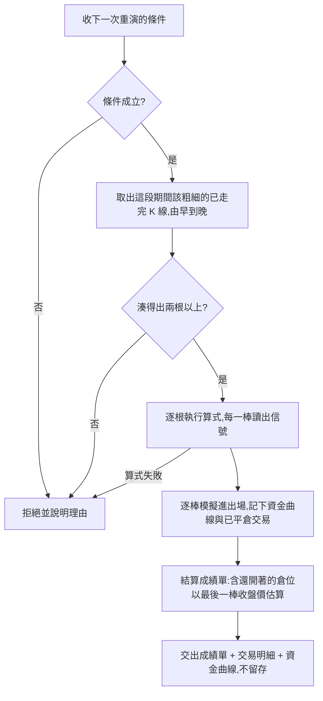

# Product Requirements Document (PRD)

**Status:** Finalized
**Version:** v1.0
**Owner:** James Hsueh
**Stakeholders:** Engineering, QA
**Source brief:** `.sdd/2026-09-05-strategy-backtest/BRIEF.md`

---

## 1. Background & Goal (Why & Goal)

- **Problem Statement**
  使用者寫得出一段指標算式，也看得到它在最新那一批 K 線上算出什麼數字，但系統答不出他真正想問的那一句：「如果我從一年前就照這支策略操作，現在手上會剩多少錢？」指標值只說「現在是多少」，不說「一路走下來會怎樣」。中間差的是**時間**——策略要在每一根 K 線上各判斷一次，而不是只在最後一根上判斷一次。

- **Expected Outcome**
  使用者選一段時間、一筆初始資金、一種倉位大小模式，系統把那段歷史**從頭重演一遍**，逐根 K 線執行同一支算式、照它說的話模擬進出場，最後交出**這段期間的成績單**：總報酬率、最大回撤、勝率、開倉次數，加上每一筆已平倉交易與一條資金曲線。「這支策略值不值得信」從此是一段可以重算、可以拿出來看的紀錄，而不是感覺。

- **Out of Scope**
  - **手續費與滑點**——這一版的成交是理想成交：說什麼價就是什麼價。
  - **止損與止盈**——出場的理由目前只有一個：算式自己說要出場。
  - **槓桿與保證金**——押下去的就是自己的錢，沒有借的部分，也沒有被強制平倉這回事。
  - **一次重演多個交易標的**——一次一個。
  - **重演結果的留存與歷史查詢**——每次問、每次算、算完就走。
  - **下一棒開盤成交**——刻意不做，見 §4「刻意的簡化」。

---

## 2. User Personas

- **Primary Role**：策略作者（本系統唯一的使用者）。他自己寫指標算式、自己調參數、自己判斷一支策略值不值得留下來。
- **Usage Context**：在指標計算的工作區裡，算式剛剛改過、參數剛剛調過，想立刻知道「這樣調到底比剛才好還是壞」。他會在敲定一支策略之前重跑幾十次，所以每一次重演都是**即問即算、算完就走**。

---

## 3. User Stories & Acceptance Criteria

### US-01 — 算式用「信號」說出這一棒的意見 [priority: P0]

**As a** 策略作者，**I want** 在既有的指標算式裡多放一個叫「信號」的指標名稱，**so that** 同一段算式既能算指標數字，也能在重演時說出每一棒要買、要賣、還是不動。

```gherkin
Scenario: 信號說買入
  Given 某一棒算出來的指標結果裡，信號是 1
  When 重演讀這一棒
  Then 這一棒的意見是買入

Scenario: 信號說賣出
  Given 某一棒算出來的指標結果裡，信號是 -1
  When 重演讀這一棒
  Then 這一棒的意見是賣出

Scenario: 信號說持平
  Given 某一棒算出來的指標結果裡，信號是 0
  When 重演讀這一棒
  Then 這一棒的意見是持平，倉位不動

Scenario: 結果裡沒有信號這個名字
  Given 某一棒算出來的指標結果裡沒有「信號」這個名稱
  When 重演讀這一棒
  Then 這一棒的意見是持平，與信號為 0 的結果一字不差

Scenario: 從來沒放過信號的舊算式
  Given 一支從來沒有放過「信號」這個名稱的既有算式
  And 這支算式一個字都沒有被改過
  When 拿它重演一段期間
  Then 全程沒有任何倉位被開過
  And 成績單的開倉次數是 0、已平倉交易是 0 筆

Scenario: 信號說 1、-1、0 以外的正數
  Given 某一棒算出來的指標結果裡，信號是 0.5
  When 重演讀這一棒
  Then 這一棒的意見是買入——大於零一律讀作買入

Scenario: 信號說 1、-1、0 以外的負數
  Given 某一棒算出來的指標結果裡，信號是 -2
  When 重演讀這一棒
  Then 這一棒的意見是賣出——小於零一律讀作賣出

Scenario: 信號算出一個不是數字的東西
  Given 某一棒算出來的信號既不是正數也不是負數也不是零（例如零除以零的結果）
  When 重演讀這一棒
  Then 這一棒的意見是持平，重演不中斷
```

---

### US-02 — 手上永遠只有一個倉位，反向信號就反手 [priority: P0]

**As a** 策略作者，**I want** 重演在任何時刻最多只持有一個倉位、聽到反向信號就在同一棒反手，**so that** 模擬出來的進出場與我腦中「一次只押一注」的操作方式一致。

```gherkin
Scenario: 空手聽到買入就開多倉
  Given 手上沒有倉位
  When 這一棒說買入
  Then 以這一棒的收盤價開多倉

Scenario: 空手聽到賣出就開空倉
  Given 手上沒有倉位
  When 這一棒說賣出
  Then 以這一棒的收盤價開空倉

Scenario: 已是多倉又聽到買入
  Given 手上持有多倉
  When 這一棒說買入
  Then 倉位原封不動
  And 開倉次數不增加

Scenario: 已是空倉又聽到賣出
  Given 手上持有空倉
  When 這一棒說賣出
  Then 倉位原封不動
  And 開倉次數不增加

Scenario: 持有空倉聽到買入就同一棒反手
  Given 手上持有空倉
  And 這一棒的收盤價是 100
  When 這一棒說買入
  Then 空倉以 100 平掉，成為一筆已平倉交易
  And 同一棒以同一個 100 開多倉

Scenario: 持有多倉聽到賣出就同一棒反手
  Given 手上持有多倉
  And 這一棒的收盤價是 100
  When 這一棒說賣出
  Then 多倉以 100 平掉，成為一筆已平倉交易
  And 同一棒以同一個 100 開空倉

Scenario: 空手聽到持平
  Given 手上沒有倉位
  When 這一棒說持平
  Then 什麼都不發生：沒有倉位被開、沒有交易被記下
```

---

### US-03 — 每次開倉押多少由倉位大小模式決定 [priority: P0]

**As a** 策略作者，**I want** 選擇每次開倉要押全部資金、押某個百分比、還是押固定金額，**so that** 重演出來的資金曲線反映我實際打算怎麼下注。

```gherkin
Scenario: 全押
  Given 可用資金是 10,000
  And 倉位大小模式是全押
  When 開倉
  Then 押下 10,000

Scenario: 百分比
  Given 可用資金是 10,000
  And 倉位大小模式是百分比、值為 50
  When 開倉
  Then 押下 5,000

Scenario: 百分比填滿一百等同全押
  Given 可用資金是 10,000
  And 倉位大小模式是百分比、值為 100
  When 開倉
  Then 押下 10,000

Scenario: 固定金額
  Given 可用資金是 10,000
  And 倉位大小模式是固定金額、值為 3,000
  When 開倉
  Then 押下 3,000
  And 剩下的 7,000 不動

Scenario: 固定金額大於可用資金就跳過這次開倉
  Given 可用資金是 2,000
  And 倉位大小模式是固定金額、值為 3,000
  When 這一棒說買入
  Then 這次開倉被跳過，手上仍然沒有倉位
  And 重演不中斷、不算失敗
  And 開倉次數不增加

Scenario: 百分比填零即整次拒絕
  Given 倉位大小模式是百分比、值為 0
  When 送出重演
  Then 整次重演被拒絕，說明百分比必須大於零且不超過一百

Scenario: 百分比超過一百即整次拒絕
  Given 倉位大小模式是百分比、值為 150
  When 送出重演
  Then 整次重演被拒絕，說明百分比必須大於零且不超過一百

Scenario: 固定金額填零或負數即整次拒絕
  Given 倉位大小模式是固定金額、值為 0
  When 送出重演
  Then 整次重演被拒絕，說明固定金額必須大於零

Scenario: 固定金額大於初始資金仍然接受
  Given 初始資金是 10,000
  And 倉位大小模式是固定金額、值為 30,000
  When 送出重演
  Then 重演正常執行
  And 每一次開倉都被跳過，成績單的開倉次數是 0
```

---

### US-04 — 重演不動的時候，錢也不動 [priority: P0]

**As a** 策略作者，**I want** 資金曲線一根 K 線一個點、且把還沒平掉的倉位一起估進去，**so that** 我看得出資金一路走下來的形狀，而不只是最後那個數字。

```gherkin
Scenario: 全程持平時資金不動
  Given 初始資金是 10,000
  And 前三棒的信號都是持平
  When 看這三棒的資金曲線
  Then 三個點都是 10,000

Scenario: 未平倉的浮動損益算進資金曲線
  Given 手上持有多倉、進場價是 100
  And 這一棒的收盤價是 110
  When 看這一棒的資金曲線點
  Then 它反映以 110 估算的未實現獲利，儘管倉位還沒平掉

Scenario: 一棒一點
  Given 這段期間有 N 根已走完的 K 線，每一根都重演過一次
  When 看資金曲線
  Then 曲線的點數正好是 N，一棒一點
  And 每個點都帶著那一棒的起始時間
```

---

### US-05 — 重演算完交出一張成績單 [priority: P0]

**As a** 策略作者，**I want** 拿到一張把賺賠、風險與命中率講清楚的成績單，加上每一筆已平倉交易，**so that** 我判斷這支策略值不值得留下來。

```gherkin
Scenario: 總報酬率
  Given 初始資金是 10,000
  And 結束時手上總共值 12,500
  When 看總報酬率
  Then 是 25%

Scenario: 最大回撤
  Given 資金曲線走過 10,000、12,000、9,000、11,000
  When 看最大回撤
  Then 是 25%——從最高的 12,000 掉到 9,000 那一段

Scenario: 回撤從初始資金開始算起
  Given 初始資金是 10,000
  And 資金曲線的每一個點都低於 10,000，最低來到 9,000
  When 看最大回撤
  Then 是 10%——初始資金本身就是第一個高點

Scenario: 勝率
  Given 已平倉交易有四筆，其中三筆賺錢
  When 看勝率
  Then 是 75%

Scenario: 一筆都沒有平倉時的勝率
  Given 這段期間一筆交易都沒有平倉
  When 看勝率
  Then 勝率不適用，不是 0%——沒有交易與每一筆都賠光是兩件不同的事

Scenario: 恰好打平的交易不算贏
  Given 已平倉交易有兩筆，一筆賺錢、一筆進出場同價
  When 看勝率
  Then 是 50%——只有賺錢的那一筆算贏

Scenario: 結束時還開著的倉位不列入交易明細
  Given 這段期間開了三次倉，其中兩次已平倉
  And 最後一個倉位到結束都還開著
  When 看成績單與交易明細
  Then 開倉次數是 3
  And 交易明細只有 2 筆
  And 勝率只看那 2 筆

Scenario: 最後剩多少包含還開著的倉位
  Given 最後那個還開著的多倉進場價是 100
  And 最後一棒的收盤價是 120
  When 看「最後剩多少」
  Then 它包含這個倉位以 120 估算的未實現損益

Scenario: 每一筆已平倉交易交代得清清楚楚
  Given 這段期間有已平倉交易
  When 看交易明細
  Then 每一筆都說明是做多還是做空、進場時間與價格、出場時間與價格、這筆賺賠多少
```

---

### US-06 — 一次重演要交代哪些事 [priority: P0]

**As a** 策略作者，**I want** 一次重演明確說出看哪個市場、用多粗的 K 線、從哪裡到哪裡、用哪一支算式與它這次的參數值、以及本金與押注方式，**so that** 同樣的問題問兩次會得到同樣的答案。

```gherkin
Scenario: 逐棒重演看得到的 K 線愈往後愈長
  Given 這段期間有五根已走完的 K 線
  When 重演走到第三棒
  Then 算式這一次看到的是從第一棒到第三棒（含）為止的三根 K 線
  And 走到第五棒時看到五根

Scenario: 進出場一律用該棒的收盤價
  Given 某一棒說出了買入
  When 這一棒開倉
  Then 成交價就是這一棒的收盤價——說信號的那一棒，就是成交的那一棒

Scenario: 只取已走完的刻度區間
  Given 這段期間的最後一個刻度區間還在走
  When 重演取 K 線
  Then 那一個還在走的刻度區間不被取用

Scenario: 重演的結果不留存
  Given 一次重演已經算完並交出結果
  When 再問一次同一段期間
  Then 系統重新算一遍，沒有任何被存下來的舊結果被拿出來
```

---

### US-07 — 重演不了的時候，明講理由 [priority: P0]

**As a** 策略作者，**I want** 重演在做不到的時候明講是哪一件事不成立，**so that** 我知道要去改哪一格，而不是對著一個空白畫面猜。

```gherkin
Scenario: 剛好兩根 K 線
  Given 這段期間剛好有兩根已走完的 K 線
  When 重演
  Then 正常執行並交出成績單

Scenario: 只有一根 K 線
  Given 這段期間只有一根已走完的 K 線
  When 重演
  Then 被拒絕，說明這段期間湊不出足夠的 K 線

Scenario: 一根 K 線都沒有
  Given 這段期間一根已走完的 K 線都沒有
  When 重演
  Then 被拒絕，說明這段期間湊不出足夠的 K 線

Scenario: 起訖顛倒
  Given 起點晚於終點
  When 重演
  Then 被拒絕，說明這段期間湊不出足夠的 K 線

Scenario: 初始資金填零
  Given 初始資金是 0
  When 重演
  Then 被拒絕，說明初始資金必須大於零

Scenario: 初始資金填負數
  Given 初始資金是 -1
  When 重演
  Then 被拒絕，說明初始資金必須大於零

Scenario: 算式取用了沒有宣告的參數名稱
  Given 算式取用了一個這次沒有宣告的參數名稱
  When 重演
  Then 被拒絕，並指出是哪一個名字對不上

Scenario: 算式本身寫壞了
  Given 算式無法解讀，或在某一棒執行失敗
  When 重演
  Then 被拒絕，說明算式出了什麼問題——與單純算指標時的說法一致

Scenario: 這段期間的 K 線超過單次可讀上限
  Given 這段期間以該粗細切出來的刻度區間超過單次查詢筆數上限
  When 重演
  Then 被拒絕，說明這一段要用到幾根、上限是幾根

Scenario: 交易標的填空白
  Given 交易標的是空白
  When 重演
  Then 被拒絕，說明交易標的不得為空

Scenario: 彙總刻度不在五種之內
  Given 彙總刻度寫的不是五種之一
  When 重演
  Then 被拒絕，說明彙總刻度只能是那五種其中之一
```

---

## 4. Business Flow & Logic

### Flow Diagram



### Core Business Rules

- **BR-1 信號的讀法**：從一棒的指標結果中取名為「信號」的那個值。**大於零讀作買入，小於零讀作賣出，等於零讀作持平**；沒有這個名字、或算出來的不是一個可比較的數字，一律讀作**持平**。這條讀法讓既有算式一個字都不必改。
- **BR-2 一次重演的條件**：交易標的、彙總刻度、起訖時間（兩端都含、一律世界標準時間）、指標算式與這次的參數值、初始資金、倉位大小模式。
- **BR-3 取哪些 K 線**：這段期間內、該粗細下**已走完的刻度區間**，由早到晚。還在走的那一格不取——它裝了一半，算出來的值會隨時間自己變動。終點指向未來時視同現在。
- **BR-4 算式每一棒看到什麼**：從起點到當棒（含）為止的全部 K 線，愈往後看得愈長。**不另設看得到的根數上限**——上限只有一個，就是整段期間的刻度區間數不得超過單次查詢筆數上限。
- **BR-5 成交價**：進出場一律用該棒的收盤價。說信號的那一棒，就是成交的那一棒。
- **BR-6 倉位規則**：同一時間最多一個倉位（多倉或空倉）。買入時：空手就開多倉、已是多倉就當作沒聽到、是空倉就先平再以同一棒同一個收盤價反手開多倉。賣出時規則對稱。持平不動作。
- **BR-7 押多少**：全押＝當時全部可用資金；百分比＝可用資金乘上該百分比；固定金額＝每次同一個數字，**可用資金不夠時跳過這次開倉**（不算失敗、不中斷、不計為一次開倉）。
- **BR-8 押注參數的合法範圍**：百分比必須大於 0 且不超過 100；固定金額必須大於 0，**允許大於初始資金**（行為就是每次開倉都被跳過）。初始資金必須大於 0。
- **BR-9 資金曲線**：每根 K 線一個點，記下那一棒收盤之後手上總共值多少；還沒平掉的部分以該棒收盤價估算。點數與 K 線根數相同。
- **BR-10 總報酬率**：（最後剩多少 − 初始資金）÷ 初始資金。「最後剩多少」**包含結束時還開著的倉位**，以最後一棒收盤價估算。
- **BR-11 最大回撤**：資金曲線上「從歷史高點掉下來」的最大比例。**初始資金本身算第一個高點**——否則一路只跌的重演會報出 0% 的回撤。
- **BR-12 勝率**：已平倉交易中賺錢（損益大於零）的比例。**恰好打平不算贏。一筆都沒平倉時勝率不適用**，而不是 0%。
- **BR-13 開倉次數 vs 交易明細**：開倉次數數的是實際開成的倉（跳過的不算）；交易明細只列**已平倉**的交易，結束時還開著的那一個不在名單裡。
- **BR-14 不留存**：重演的結果每次重算，不寫進系統、也查不到歷史。

### 刻意的簡化

- **為什麼用收盤價成交**：說信號的那一棒就是成交的那一棒，使用者拿計算機就能自己驗一遍。改成「下一棒開盤成交」雖然更接近真實下單，但每一筆都要多一層延遲邏輯，第一版不划算。這是刻意的簡化，不是疏漏。
- **為什麼不留存**：重演是探索用的工具。敲定一支策略之前會跑幾十次，存下來的那幾十份沒有人會回頭看，卻要有人負責清掉。

### Edge Cases

- **這段期間沒有任何交易被觸發**：不是錯誤。交出一張開倉次數 0、交易明細空、勝率不適用、資金曲線全等於初始資金的成績單。
- **反手時押不下去**：平倉照做，反手的開倉因資金不足被跳過，結果就是平倉後空手。
- **算式在某一棒失敗**：整次重演失敗，沒有部分結果。
- **資料中間有缺口**：沒有 K 線的刻度區間不存在於序列中，重演直接跳過，不補值——補出來的一根讀起來與真的一模一樣。

---

## 5. UI/UX Design & Interaction

N/A — 本切片是後端能力。畫面在前端專案的同名切片。對外只交出三塊資料：成績單、已平倉交易明細、資金曲線；失敗時交出**與單純算指標時同一種形狀**的說明，好讓畫面不必為重演另寫一套錯誤呈現。

---

## 6. Non-Functional Requirements

- **NFR-1 執行成本**：一次重演會把同一支算式跑上百次到上千次。**算式只被解讀一次**，之後每一棒重複執行——否則每一棒都重新解讀一次算式，成本隨根數線性翻倍。
- **NFR-2 執行時間上限**：沿用既有的指標算式執行時間上限，逐棒各自計時；任何一棒逾時即整次中止並說明。
- **NFR-3 讀取上限**：一次重演的刻度區間數不得超過既有的單次查詢筆數上限；超過即拒絕並說出這一段要用到幾根、上限是幾根。
- **NFR-4 安全界線**：算式仍然只能做純運算——不得取用 K 線以外的資料、當下時間或任何隨機值。重演沒有放寬任何一條。
- **NFR-5 精確度**：金額（初始資金、成交價、押注金額、損益、資金曲線的每一點）一律用精確小數；比率（總報酬率、最大回撤、勝率）是統計數字，用一般數字即可。
- **NFR-6 不留存**：重演不寫入任何資料。

---

## 7. Dependencies & Risks

- **依賴既有能力**：指標算式的執行環境（含參數機制、時間上限、純運算界線）、K 線彙總與「走完的刻度區間」規則、交易標的與彙總刻度的既有驗證。本切片一條都不重寫。
- **風險：逐棒執行的成本**。一千根 K 線就是一千次執行，且第 N 次看到 N 根 K 線。以「只解讀一次算式」壓下常數項，並以既有的單次查詢筆數上限封住總量。
- **風險：使用者以為重演等於真實績效**。沒有手續費、沒有滑點、沒有止損，數字必然比真實好看。以「理想成交」的明確定位處理，不在這一版補上。

---

## 8. Appendix

- 來源需求：`.sdd/2026-09-05-strategy-backtest/BRIEF.md`
- 相依切片：`.sdd/2026-08-29-indicator-calculation`、`.sdd/2026-09-02-k-candle-aggregated-series`、`.sdd/2026-09-03-strategy-execution-parameters`、`.sdd/2026-09-04-strategy-parameters`
- 詞彙：`.sdd/UL-MAP.md`（本切片新增：信號、倉位、多倉、空倉、初始資金、倉位大小模式、資金曲線、最大回撤、勝率、成績單、已平倉交易、開倉次數）

### 來自 BRIEF 的待定事項，本 PRD 的定案

| 待定事項 | 定案 | 理由 |
| :--- | :--- | :--- |
| 信號說了 1／-1／0 以外的數字 | **看正負號**：大於零買入、小於零賣出、等於零持平；不是數字則持平 | 信號本來就是「方向」。看正負號讓每一個數字都有明確意義，不會有「合法但無解」的值，也與 1／-1／0 的既有寫法完全相容。逐棒重演途中因為某一棒算出 0.5 就整次拒絕，代價與這條規則的收益不成比例 |
| 算式每一棒看得到的 K 線根數上限 | **不另設**；只有整段期間的刻度區間數受既有單次查詢筆數上限管 | 兩個上限就是兩個真相，遲早互相矛盾。BR-4 |
| 百分比允許填 0 嗎 | **不允許**，必須大於 0 且不超過 100 | 填 0 的行為是「每次開倉都被跳過」，跑出來是一張全空的成績單，看起來像壞了。當場拒絕比事後困惑好 |
| 固定金額允許大於初始資金嗎 | **允許** | 資金會隨重演變動，拿初始資金當上限只是個假的安全感；而「資金不夠就跳過」本來就是既有規則，涵蓋得了 |
| 一筆都沒平倉時勝率是 0 還是不適用 | **不適用** | 0% 宣稱「每一筆都輸」，與「一筆都沒有」是兩件不同的事 |
| K 線非常多時要不要設上限 | **沿用既有的單次查詢筆數上限**，超過即拒絕並說出數字 | 與指標計算同一條規則、同一種說法 |
