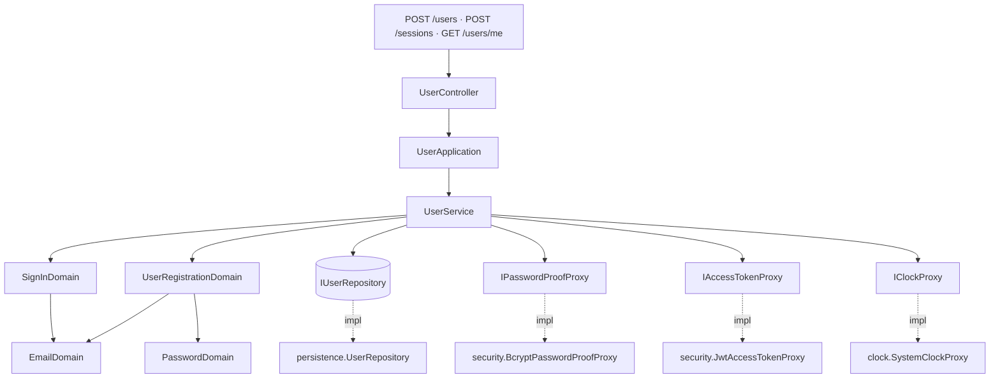
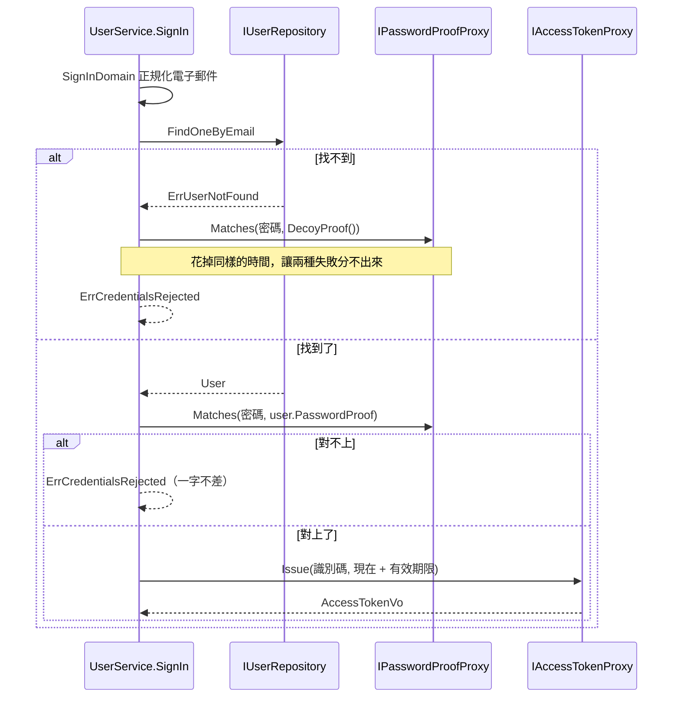

# 使用者登入 — Architecture Design

**Status:** Draft
**Source PRD:** `.sdd/2026-09-05-user-authentication/PRD.md`
**Tech context:** Go · Gin · GORM/PostgreSQL · Clean/Onion Architecture

---

## 1. Design Goal & Guiding Principle

- **In one sentence:**
  讓系統多出「一位使用者」這個概念——建得起來、登得進去、認得出來——
  而**密碼在 domain 以外的任何地方都不存在**，既有的每一條端點一行都不必改。

- **Guiding principle:**
  **把「怎麼把密碼變成證明」與「怎麼把身分變成憑證」關進兩個介面後面。**

  這兩件事都是密碼學，都會被換掉（bcrypt 有一天會換 Argon2、對稱簽章有一天會換非對稱），
  而且都**不是**業務規則。業務規則是「密碼至少 8 個字元」「憑證 24 小時後失效」
  「登入失敗只有一種說法」——這些留在 domain，看得到、測得到、不必啟動任何東西就驗得了。

  於是換算法是新增一個 proxy 實作、在組裝根改一行；
  而每一條業務規則的測試，一次都不會因此而動。

---

## 2. Change Scope

| Area | Action | What / Why |
| :--- | :--- | :--- |
| `internal/domain/models/entities/` | **Add** | `User`——多一張表，就多一個乾淨的資料模型 |
| `internal/domain/models/domains/` | **Add** | 電子郵件、密碼、註冊、登入四個領域模型＋這個切片自己的哨兵錯誤 |
| `internal/domain/models/dto/`、`vo/` | **Add** | 對外形狀（使用者、登入憑證）與 proxy 收乾淨後的憑證值 |
| `internal/domain/interface/` | **Add** | `IUserRepository`、`IPasswordProofProxy`、`IAccessTokenProxy` |
| `internal/domain/service/` | **Add** | `UserService`——這個切片全部三個用例的唯一入口 |
| `internal/application/` | **Add** | `UserApplication` |
| `internal/infrastructure/persistence/` | **Add** | `UserRepository`；`SchemaMigrator` 多登錄一個 entity |
| `internal/infrastructure/security/` | **Add** | 新資料夾。密碼證明與憑證簽發的具體實作住這裡 |
| `internal/controller/` | **Add** | `UserController` 與兩個 `Request` |
| `internal/config/` | **Modify** | 多一組 `AuthenticationConfig`（簽章鑰匙、憑證有效期限） |
| `cmd/server/dependencies.go` | **Modify** | 組裝這條線、掛上三條路 |
| 既有的每一條端點 | **Not touched** | 本切片不替它們裝門（理由見 PRD §1 Out of Scope）。它們照常不問來者是誰 |
| 認證中介層（middleware） | **Not touched** | 目前只有一條路需要憑證，為一條路先做一層中介是憑空的一般化。它落在哪裡見 §6 |

---

## 3. New Classes / Modules

### 3.1 Domain — Entities（乾淨資料模型）

| Name | Kind | Responsibility | Collaborators | Satisfies |
| :--- | :--- | :--- | :--- | :--- |
| `User` | Entity | 一位使用者的欄位與持久化對應：識別碼、電子郵件（唯一索引）、密碼證明、建立時間。附 `ToDto()`，且 **DTO 裡沒有密碼證明的位置** | `dto.UserDto` | US-01、US-05 |

- 電子郵件帶 **unique index**（`idx_users_email`）。唯一性由索引決定而不是先查再寫：
  兩個建立同時到達時，先查再寫會兩邊都認為這個電子郵件是空的。
- **`ToDto()` 不搬 `PasswordProof`**，而且 `UserDto` 根本沒有那個欄位——
  「回覆不含密碼證明」因此不是一條檢查，是型別上做不到。

### 3.2 Domain — Domain Models（行為所在地）

| Name | Kind | Responsibility | Collaborators | Satisfies |
| :--- | :--- | :--- | :--- | :--- |
| `EmailDomain` | Domain Model | 電子郵件的唯一一套正規化與規則：去前後空白 → 轉小寫 → 檢查格式。存在即代表合格 | — | US-01 |
| `PasswordDomain` | Domain Model | 密碼的長度規則：至少 8 個字元、至多 72 個位元組。**過長是拒絕，不是截短** | — | US-02 |
| `UserRegistrationDomain` | Domain Model | 一次建立的完整把關：借用上面兩個模型，全過才存在。`ToEntity(passwordProof)` 產出要存的那一列 | `EmailDomain`、`PasswordDomain`、`entities.User` | US-01、US-02 |
| `SignInDomain` | Domain Model | 一次登入的把關。**刻意只做正規化，不回報是哪一半不合格**——任何不合格一律是同一種拒絕 | `EmailDomain` | US-03、US-04 |

- **`EmailDomain` 是「同一套」的保證。** 建立與登入都經過它，所以不可能出現
  「建得起來卻登不進去」——那是兩邊各寫一次正規化必然會長出來的 bug。
- **`SignInDomain` 不重用 `EmailDomain` 的錯誤**：它把「這不像電子郵件」吞掉，
  換成 `ErrCredentialsRejected`。US-04 要的正是這件事——
  對外只能有一種說法，連「你這個根本不是電子郵件」都算洩漏。

### 3.3 Domain — DTO / VO

| Name | Kind | Responsibility |
| :--- | :--- | :--- |
| `dto.UserDto` | DTO | 一位使用者對外的樣子：**只有識別碼與電子郵件** |
| `dto.UserRegistrationDto` | DTO | application 交給 domain 的輸入：電子郵件與密碼 |
| `dto.SignInDto` | DTO | 同上，登入用 |
| `dto.AccessTokenDto` | DTO | 登入的產出：憑證本身與憑證到期時刻 |
| `vo.AccessTokenVo` | VO | proxy 簽完之後收乾淨的值。附 `ToDto()` |

### 3.4 Domain — Interfaces

| Name | Responsibility | 為什麼是介面 |
| :--- | :--- | :--- |
| `IUserRepository` | 存一位使用者、以電子郵件找一位、以識別碼找一位 | 儲存是最外層邊界 |
| `IPasswordProofProxy` | `Prove` 把密碼算成證明、`Matches` 驗一組密碼對不對得上、`DecoyProof` 給一份誘餌證明 | **算法會被換掉**，而且 domain 不得認識任何 SDK |
| `IAccessTokenProxy` | `Issue` 簽一份到某時刻為止的憑證、`UserIdentifiedBy` 從憑證認出是誰 | 同上；簽章方式會被換掉 |

- **`DecoyProof` 是 US-04 的另一半。** 查無使用者時若直接回絕，這條路會回得比密碼錯還快，
  而「回得特別快」本身就是在說「這個電子郵件不存在」。
  拿誘餌證明去比對一次，花掉同樣的時間，兩種失敗才真的分不出來。
  它放在 proxy 而不是 domain，因為只有知道算法的那一側算得出一份合格的誘餌。
- **`Issue` 收的是到期時刻，不是有效期限。** 「多久過期」是業務規則，留在 domain；
  proxy 只負責把時刻簽進去。倒過來的話，改期限得改 infrastructure。

### 3.5 Domain — Service

| Name | Responsibility | Collaborators |
| :--- | :--- | :--- |
| `UserService` | 這個切片全部三個用例的唯一入口：`RegisterUser`、`SignIn`、`IdentifyUser`。三個公開方法**互不呼叫** | `IUserRepository`、`IPasswordProofProxy`、`IAccessTokenProxy`、`IClockProxy`、憑證有效期限 |

三個用例合成一個 service 而不是拆成「使用者」與「認證」兩個，理由是它們**同一個變更理由**：
「要怎樣才算得上是這個系統認得的人」。拆開的話，`SignIn` 會需要 `UserRepository`、
`IdentifyUser` 也會需要，兩個 service 吃同一組依賴、改一個必然要改另一個——那是同一個模組被切成兩半。

`SignIn` 的次序是刻意的：**先找人，找不到就拿誘餌證明比對一次**，再回同一句拒絕。

### 3.6 Application

| Name | Responsibility |
| :--- | :--- |
| `UserApplication` | 三個用例的編排入口。全程只碰 DTO |

### 3.7 Infrastructure

| Name | Responsibility |
| :--- | :--- |
| `persistence.UserRepository` | GORM 實作。**把電子郵件唯一索引的違反翻成 `ErrEmailAlreadyRegistered`**，其餘約束仍是儲存失敗 |
| `security.BcryptPasswordProofProxy` | bcrypt 實作。摻隨機料由 bcrypt 自己負責；誘餌證明在建構時算一次並記住 |
| `security.JwtAccessTokenProxy` | HMAC-SHA256 簽章的憑證實作。**沒有鑰匙時一份都簽不出來**，回 `ErrAccessTokenUnavailable`，而不是簽出一份誰都能偽造的 |

### 3.8 Controller

| Name | Responsibility |
| :--- | :--- |
| `UserController` | 三條路的 HTTP 轉換，以及哨兵錯誤 → 狀態碼的對映 |
| `models.UserRegistrationRequest` / `models.SignInRequest` | 收下的 JSON body |

狀態碼對映：

| 路徑 | 成功 | `ErrUserValidation` | `ErrEmailAlreadyRegistered` | `ErrCredentialsRejected` | `ErrAuthenticationRequired` | `ErrAccessTokenUnavailable` | 其他 |
| :--- | :--- | :--- | :--- | :--- | :--- | :--- | :--- |
| `POST /users` | 201 | 400 | 409 | — | — | — | 502 |
| `POST /sessions` | 200 | — | — | 401 | — | 503 | 502 |
| `GET /users/me` | 200 | — | — | — | 401 | — | 502 |

---

## 4. Modified Components

| Component | Current role | Change needed |
| :--- | :--- | :--- |
| `persistence.SchemaMigrator` | 建立每一張表 | 名單裡多一個 `&entities.User{}` |
| `config.ApplicationConfig` | 讀環境變數 | 多一組 `Authentication`：簽章鑰匙、憑證有效期限 |
| `cmd/server/dependencies.go` | 組裝根 | 組出這條線，掛上三條路 |
| `.env.example` | 設定範例 | 多兩個變數與一句「這把鑰匙不進版控」 |
| `postman/` | 手動測試集 | 三條新路 |

---

## 5. Component Relationships

登入那條路的次序：

---

## 6. Extensibility & Handoff Notes

- **最可能的下一個需求：替既有的行情端點裝上這道門。**
  落點是 `UserController.GetCurrentUser` 目前那段「從 `Authorization` 讀出憑證」的私有 method。
  那時候它會長成一個 `AuthenticationMiddleware`，掛在 Gin 的 route group 上，
  把認出來的使用者放進請求脈絡；`GetCurrentUser` 改成從脈絡裡讀，不再自己解標頭。
  **現在不先做**，因為只有一條路需要憑證，為一條路先立一層中介是憑空的一般化。
  - 那時要一併解決的是 **`GET /k-candles/live`**：它是瀏覽器的持續連線，
    送不出授權標頭。憑證得換一條路過去（query 參數、或先換一張一次性的票）。
    這是它現在不在這個切片裡的真正原因。
- **第二可能：換掉密碼算法（bcrypt → Argon2id）。**
  落點是 `IPasswordProofProxy`：新增 `security.Argon2idPasswordProofProxy`，組裝根改一行。
  舊的證明認不認得出來，由新的 proxy 自己看證明的前綴決定——
  這是**新增一個實作**，不是改既有那一個。
- **第三可能：換掉憑證簽章（對稱 → 非對稱）。** 落點同理，是 `IAccessTokenProxy`。
- **不得寫死：** 憑證簽章鑰匙、憑證有效期限。前者寫死等於把鑰匙送進版本控制。
- **刻意留簡單的：**
  - **憑證不留存**，因此無法提前撤銷。要撤銷的那一天，訊號是「有人的憑證外洩了」，
    做法是在 `User` 上多一個「憑證從哪一刻起才算數」的時刻欄位，
    簽發時把它寫進憑證、驗證時比對——仍然不必為此建一張憑證表。
  - **建立使用者是開放的**。要關起來的那一天，訊號是「這個位址不再只有我一個人碰得到」。

---

## 7. Traceability

| PRD Scenario | Fulfilled by |
| :--- | :--- |
| US-01 系統一位使用者都沒有時也建得起來 | `UserService.RegisterUser` + `UserRepository.Save` |
| US-01 回覆不含密碼，也不含密碼證明 | `dto.UserDto` 的欄位（型別上沒有那個位置） |
| US-01 前後空白不予保留／一律以小寫留存 | `EmailDomain` |
| US-01 大小寫不同的同一個電子郵件算同一個人 | `EmailDomain` + `User` 的唯一索引 → `ErrEmailAlreadyRegistered` |
| US-01 空白／格式不對的電子郵件被拒絕 | `EmailDomain` → `ErrUserValidation` |
| US-02 8 個字元可以用／7 個被拒絕／空字串被拒絕 | `PasswordDomain` |
| US-02 72 個位元組可以用／73 個被拒絕而非截短 | `PasswordDomain` |
| US-02 留存下來的不是密碼 | `BcryptPasswordProofProxy.Prove` |
| US-02 同一組密碼留下的證明並不相同 | `BcryptPasswordProofProxy.Prove`（bcrypt 自己摻隨機料） |
| US-03 對得上就發憑證 | `UserService.SignIn` |
| US-03 到期時刻是現在加上有效期限 | `UserService.SignIn`（`IClockProxy` + 有效期限）→ `IAccessTokenProxy.Issue` |
| US-03 登入時電子郵件不分大小寫、忽略前後空白 | `SignInDomain` → `EmailDomain` |
| US-03 登入不會留下任何新的東西 | `UserService.SignIn` 只讀不寫 |
| US-04 密碼錯了／查無這個電子郵件／兩種說法一字不差 | `UserService.SignIn` + `ErrCredentialsRejected`（含 `DecoyProof` 的等時比對） |
| US-04 空白的登入內容一樣被拒絕 | `SignInDomain` |
| US-05 帶著剛簽發的憑證問我是誰 | `UserService.IdentifyUser` |
| US-05 被改過／過期的憑證不成立 | `JwtAccessTokenProxy.UserIdentifiedBy` → `ErrAuthenticationRequired` |
| US-05 沒帶憑證 | `UserController.GetCurrentUser` → `ErrAuthenticationRequired` |
| US-05 憑證指向一位已經不存在的使用者 | `UserService.IdentifyUser`（找不到 → `ErrAuthenticationRequired`） |

---

## 8. Risks & Open Decisions

- **Risks / trade-offs:**
  - **憑證不留存換來的是無法撤銷。** 有效期限預設 24 小時就是這個風險的上限。接受。
  - **誘餌證明只讓時間「差不多」相同，不是「完全」相同。** 要完全一致得走定時回應，
    那是另一個量級的複雜度。以這個系統的處境（單人、非公開），差不多就夠。
  - **`security` 是新的 infrastructure 資料夾。** 它與既有五個並列（persistence、
    marketdata、assistant、script、clock），理由是它封裝的是第六種外部能力：密碼學實作。
- **Open decisions（留給實作）:**
  - bcrypt 的強度參數：以「一次登入不超過一秒」為界挑一個常數，寫在 proxy 內並註明理由。
  - 電子郵件的格式檢查用標準函式庫的解析器，不自己寫正規表達式。
