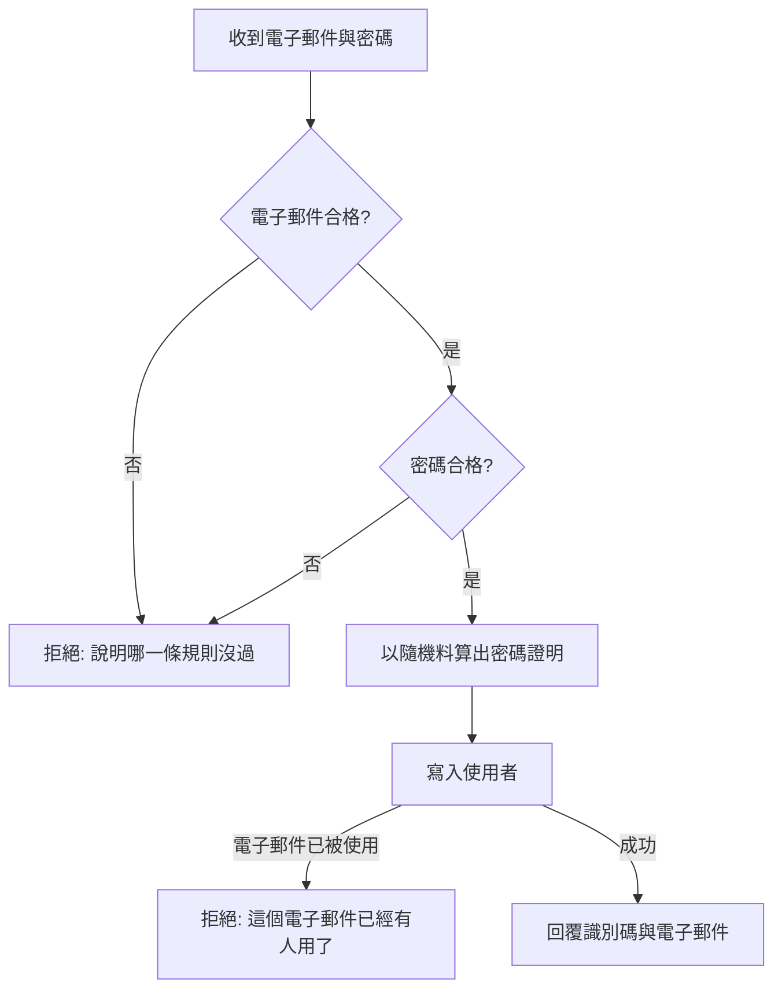
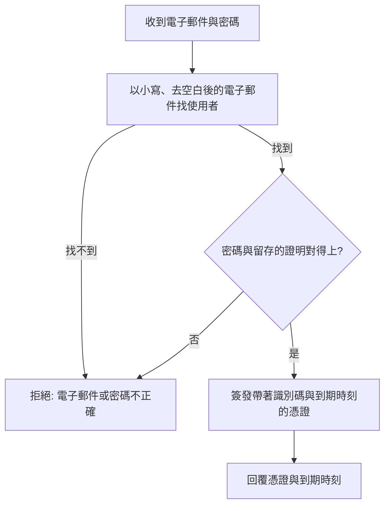

# Product Requirements Document (PRD)

**Feature:** 使用者登入
**Status:** Draft
**Version:** v1.0
**Owner:** James Hsueh
**Stakeholders:** Engineering

---

## 1. Background & Goal (Why & Goal)

- **Problem Statement:**
  go-trading 到今天為止沒有「使用者」這個概念。每一條端點都不問來者是誰，
  所以任何摸得到這個位址的人，都能讀走全部的 K 線、翻出全部的策略、動用要付費的助手。
  系統本身也因此說不出「這份策略是誰寫的」「這段對話是誰問的」——
  不是它不想說，是它從來沒有可以拿來指名一個人的東西。

- **Expected Outcome:**
  系統認得人。可驗證的結果有四項：
  1. 一個人能用電子郵件與密碼建立自己的使用者，並用同一組資料登入。
  2. 登入後拿到一份**登入憑證**，帶著它問「我是誰」能得到自己的識別碼與電子郵件。
  3. 資料庫裡**找不到任何一組原樣的密碼**；兩個人即使用同一組密碼，留存下來的內容也不相同。
  4. 憑證被改過一個字、或已經過期，一律不再成立。

- **Out of Scope:**
  - 替既有的行情端點（K 線、指標計算、策略、助手、即時跟盤）裝上這道門。
    即時跟盤是瀏覽器的持續連線、送不出授權標頭，憑證怎麼過去是另一個要想清楚的問題；
    與其餘端點一起改等於在一個切片裡塞兩件事。本切片先把門做好，並在「我是誰」上證明它擋得住。
  - 忘記密碼、改密碼、刪除帳號。
  - 角色與權限。系統只有「登入了」與「沒登入」兩種狀態。
  - 第三方登入、憑證續期（refresh token）、記住我、裝置管理。
  - 登入失敗次數限制與鎖定、二階段驗證。
  - 讓某一份已簽發的憑證提前失效（見 §4 的核心規則）。

---

## 2. User Personas

- **Primary Role(s):**
  **使用者**——這台操作台的主人。他既是唯一會建立帳號的人，也是唯一會登入的人。

- **Usage Context:**
  在自己的電腦上打開操作台。第一次使用時建立自己的帳號，之後每天開始看盤前登入一次；
  憑證的有效期限走完之前都不必再登入。

---

## 3. User Stories & Acceptance Criteria

### US-01 — 用電子郵件建立自己的使用者 [priority: P0]

**As a** 使用者，**I want** 用一個電子郵件與一組密碼建立自己的使用者，
**so that** 這個系統之後認得出我是誰。

```gherkin
Scenario: 系統一位使用者都沒有時也建得起來
  Given 系統目前一位使用者都沒有
  When 使用者用「james@example.com」與一組合格的密碼建立使用者
  Then 建立成功
  And 回覆這位使用者的識別碼與「james@example.com」

Scenario: 回覆內容永遠不含密碼，也不含密碼證明
  Given 使用者用一組合格的密碼建立使用者
  When 讀取建立成功的回覆
  Then 回覆裡沒有那組密碼
  And 回覆裡也沒有由它算出來的任何證明

Scenario: 電子郵件的前後空白不予保留
  Given 使用者填的電子郵件前後各有空白
  When 使用者建立使用者
  Then 建立成功
  And 留下的電子郵件不含前後空白

Scenario: 電子郵件一律以小寫留存
  Given 使用者填的電子郵件是「James@Example.com」
  When 使用者建立使用者
  Then 建立成功
  And 留下的電子郵件是「james@example.com」

Scenario: 大小寫不同的同一個電子郵件算同一個人
  Given 系統已有使用者「james@example.com」
  When 使用者用「James@Example.com」建立另一位使用者
  Then 建立被拒絕，說明這個電子郵件已經有人用了

Scenario: 空白的電子郵件被拒絕
  Given 使用者填的電子郵件只有空白字元
  When 使用者建立使用者
  Then 建立被拒絕，說明必須給一個電子郵件

Scenario: 不像電子郵件的字串被拒絕
  Given 使用者填的電子郵件是「not-an-email」
  When 使用者建立使用者
  Then 建立被拒絕，說明電子郵件的格式不對
```

### US-02 — 密碼有下限也有上限，而且從不以原樣留存 [priority: P0]

**As a** 使用者，**I want** 系統絕不留下我的密碼本身，
**so that** 就算整個資料庫被人整份拿走，也拿不到我的密碼。

```gherkin
Scenario: 剛好 8 個字元的密碼可以用
  Given 使用者填的密碼剛好 8 個字元
  When 使用者建立使用者
  Then 建立成功

Scenario: 7 個字元的密碼被拒絕
  Given 使用者填的密碼是 7 個字元
  When 使用者建立使用者
  Then 建立被拒絕，說明密碼至少要 8 個字元

Scenario: 空白的密碼被拒絕
  Given 使用者填的密碼是空字串
  When 使用者建立使用者
  Then 建立被拒絕，說明必須給一組密碼

Scenario: 剛好 72 個位元組的密碼可以用
  Given 使用者填的密碼剛好 72 個位元組
  When 使用者建立使用者
  Then 建立成功

Scenario: 73 個位元組的密碼被拒絕，而不是被截短
  Given 使用者填的密碼是 73 個位元組
  When 使用者建立使用者
  Then 建立被拒絕，說明密碼太長
  And 沒有任何使用者因此被建立

Scenario: 留存下來的不是密碼
  Given 使用者用密碼「correct horse」建立使用者
  When 讀取這位使用者留存下來的密碼證明
  Then 它不等於「correct horse」

Scenario: 兩個人用同一組密碼，留下的證明並不相同
  Given 兩位使用者各自用密碼「correct horse」建立
  When 讀取這兩位使用者留存下來的密碼證明
  Then 兩份證明彼此不同
  And 兩份都能被「correct horse」驗證通過
```

### US-03 — 登入並取得一份登入憑證 [priority: P0]

**As a** 使用者，**I want** 用我的電子郵件與密碼登入並拿到一份憑證，
**so that** 我之後的每一次請求都能證明自己是誰，而不必每次重報密碼。

```gherkin
Scenario: 對得上就發憑證
  Given 系統已有使用者「james@example.com」，密碼是「correct horse」
  When 使用者用這兩樣登入
  Then 登入成功
  And 回覆一份登入憑證與它的到期時刻

Scenario: 憑證的到期時刻是現在加上有效期限
  Given 憑證的有效期限設定為 24 小時
  When 使用者成功登入
  Then 回覆的到期時刻是登入當下的 24 小時之後

Scenario: 登入時電子郵件同樣不分大小寫、忽略前後空白
  Given 系統已有使用者「james@example.com」，密碼是「correct horse」
  When 使用者用「　JAMES@Example.com　」與「correct horse」登入
  Then 登入成功

Scenario: 登入不會留下任何新的東西
  Given 系統已有一位使用者
  When 使用者成功登入
  Then 系統的使用者數量沒有改變
```

### US-04 — 登入失敗永遠只有一種說法 [priority: P0]

**As a** 系統的主人，**I want** 登入失敗時系統不透露是哪一半錯了，
**so that** 沒有人能拿登入這條路去問出「哪些電子郵件註冊過」。

```gherkin
Scenario: 密碼錯了
  Given 系統已有使用者「james@example.com」，密碼是「correct horse」
  When 使用者用「james@example.com」與「wrong horse」登入
  Then 登入被拒絕，說「電子郵件或密碼不正確」
  And 回覆裡沒有任何憑證

Scenario: 查無這個電子郵件
  Given 系統沒有使用者「nobody@example.com」
  When 使用者用「nobody@example.com」與任意密碼登入
  Then 登入被拒絕，說「電子郵件或密碼不正確」

Scenario: 兩種失敗的說法一字不差
  Given 系統已有使用者「james@example.com」
  When 分別以「密碼錯」與「查無此電子郵件」兩種方式登入失敗
  Then 兩次得到的說法完全相同

Scenario: 空白的登入內容一樣被拒絕
  Given 使用者的電子郵件或密碼是空白
  When 使用者登入
  Then 登入被拒絕
```

### US-05 — 帶著憑證，系統認得我是誰 [priority: P0]

**As a** 使用者，**I want** 帶著憑證就能問出系統認為我是誰，
**so that** 畫面知道現在是誰在用，也知道憑證是不是還有效。

```gherkin
Scenario: 帶著剛簽發的憑證問我是誰
  Given 使用者剛剛登入並拿到一份憑證
  When 使用者帶著這份憑證問「我是誰」
  Then 回覆這位使用者的識別碼與電子郵件

Scenario: 被改過一個字的憑證不成立
  Given 一份被改動過內容的憑證
  When 使用者帶著它問「我是誰」
  Then 請求被拒絕，說明要重新登入

Scenario: 過期的憑證不成立
  Given 一份簽章仍然正確、但已經過了到期時刻的憑證
  When 使用者帶著它問「我是誰」
  Then 請求被拒絕，說明要重新登入

Scenario: 沒帶憑證
  Given 使用者沒有帶任何憑證
  When 使用者問「我是誰」
  Then 請求被拒絕，說明要重新登入

Scenario: 憑證指向一位已經不存在的使用者
  Given 一份完好且未過期的憑證，但它指向的使用者已經不在系統裡
  When 使用者帶著它問「我是誰」
  Then 請求被拒絕，說明要重新登入
```

---

## 4. Business Flow & Logic

**建立使用者**



**登入**



- **Core Business Rules:**
  - **電子郵件的正規化只有一套**：去前後空白 → 轉小寫。建立與登入走的是同一套，
    否則會出現「建得起來卻登不進去」。
  - **唯一性由儲存層的索引決定，不由「先查再寫」決定**：兩個建立同時到達時，
    先查再寫會兩邊都認為這個電子郵件是空的。
  - **密碼證明必須摻隨機料**：同一組密碼每次算出來都不同，
    所以從留存的內容看不出兩個人是不是用了同一組密碼。
  - **密碼的位元組上限是硬規則**：超過即拒絕，不截斷。截斷會讓使用者以為自己設了一組長密碼。
  - **登入失敗一律同一句話**，且**查無使用者時仍然要花掉比對密碼的時間**——
    回得特別快本身就是在說「這個電子郵件不存在」。
  - **憑證不留存**：系統這一側沒有任何憑證的紀錄，因此**無法讓某一份憑證提前失效**。
    登出等於把憑證丟掉。這是「不留存」的代價，明講出來。

- **Edge Cases:**
  - 建立到一半資料庫壞掉 → 整次失敗，不留下半位使用者。
  - 憑證的內容解得開、但裡面的識別碼指向一位已被刪掉的使用者 → 視同要重新登入。
  - 系統沒有設定簽章用的鑰匙 → 一份憑證都簽不出來，登入這條路整條失敗並說明原因，
    而不是簽出一份誰都能偽造的憑證。

---

## 5. UI/UX Design & Interaction

本切片是後端能力，畫面在前端專案的對應切片。後端只保證：

- 拒絕的原因一律是**一句給人看的話**，前端直接顯示即可，不必自己組句子。
- 「規則沒過」「電子郵件被佔用」「電子郵件或密碼不正確」「要重新登入」四種情況
  前端分得出來，因為它們的回應狀態不同。

---

## 6. Non-Functional Requirements

- **Security:**
  - 密碼**永不**以原樣留存、永不出現在回覆內容中、永不寫進紀錄檔。
  - 密碼證明的算法必須**摻隨機料**且**刻意慢**——快得起來的算法，暴力破解也一樣快。
  - 憑證帶簽章；比對簽章時必須用**不會因為第幾個位元組不同而提早結束**的方式，
    否則比對花掉的時間本身會洩漏簽章的內容。
  - 簽章用的鑰匙由設定給定，不寫死在程式碼裡。
- **Performance:** 密碼比對刻意是慢的（十億分之一秒等級的算法擋不住暴力破解）。
  以「一次登入不超過一秒」為界挑強度。
- **Compatibility:** 既有的每一條端點行為完全不變。

---

## 7. Dependencies & Risks

- **External Dependencies:**
  - 一套經得起檢驗的密碼雜湊實作（不自行實作）。
  - 一套經得起檢驗的憑證簽發／驗證實作（不自行實作）。
- **Known Risks:**
  - **鑰匙外洩等於任何人都能偽造憑證。** 它必須以設定給入，不進版本控制。
  - **無法提前撤銷憑證。** 有效期限預設 24 小時就是這個風險的上限；
    真的需要撤銷時，唯一的辦法是換掉鑰匙，代價是所有人一起被登出。
  - **建立使用者這條路目前是開放的。** 系統一位使用者都沒有時關起來就沒人建得出第一位。
    對外開放這個服務之前必須重新決定這件事。

---

## 8. Appendix

- 需求共識：`.sdd/2026-09-05-user-authentication/BRIEF.md`
- 詞彙：`.sdd/UL-MAP.md`
