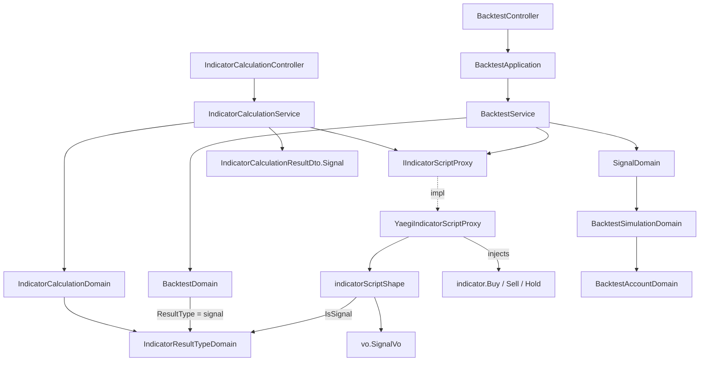

# 信號指標值種類 — Architecture Design

**Status:** Confirmed
**Source PRD:** `.sdd/2026-09-06-signal-result-type/PRD.md`
**Tech context:** Go · Gin · GORM (Code First) · Clean / Onion Architecture · traefik/yaegi 直譯器

---

## 1. Design Goal & Guiding Principle

- **In one sentence:**
  把「信號」從一個掛在浮點數上的約定，升級成第五種 `IndicatorResultTypeVo`（`signal`）——算式的進入點在這種種類下回傳一個 `vo.SignalVo`（`buy` / `sell` / `hold`），值由系統注入直譯器的 `indicator.Buy` / `indicator.Sell` / `indicator.Hold` 選出；回測固定以這種種類執行，舊的「看正負號」讀法整段刪除。

- **Guiding principle:**
  **信號是「第三種內容形狀」，不是第五種執行路徑。** 既有的 `IndicatorResultTypeDomain` 用兩個述詞（`IsList()` / `HoldsNumbers()`）描述四種種類；本切片加第三個述詞 `IsSignal()`，`indicatorScriptShape` 因此多一個「內容分支」（數字／是非／信號），而**呼叫端、介面契約、mock 一律不動**。下一個「信號要帶部位大小」的需求，落點是 `vo.SignalVo` 與注入的 `indicator.Signal`，不是這條路徑。

---

## 2. Change Scope

| Area | Action | What / Why |
| :--- | :--- | :--- |
| `vo/signal_vo.go` | **Modify** | 第三個值 `SignalFlat`/`"flat"` 改名為 `SignalHold`/`"hold"`（PRD BR-10）。純改名，模擬行為不變 |
| `vo/indicator_result_type_vo.go` | **Modify** | 新增 `IndicatorResultTypeSignal IndicatorResultTypeVo = "signal"` |
| `vo/indicator_value_vo.go` | **Modify** | 新增 `Signal SignalVo` 欄位——信號種類下，執行端產出的內容放這裡（數字放 `Numbers`、是非放 `Booleans`、信號放 `Signal`，三者其一） |
| `vo/signal_indicator_key.go` | **Add** | `SignalIndicatorKey = "signal"`：信號種類下，執行端把那一個信號放進結果 map 用的內部固定鍵。**不是使用者可見的指標名稱**，只是跨層的可辨識常數（沿用 strategy-backtest ARCH「signal 名稱不得散落」的要求） |
| `domains/indicator_result_type_domain.go` | **Modify** | `declarableIndicatorResultTypes` 加入 `signal`；新增 `IsSignal()` 述詞；`ScriptResultShape()` 對信號回傳 `"indicator.Signal"`。`IsList()`／`HoldsNumbers()` 對信號皆為 `false`，不需改動 |
| `domains/signal_domain.go` | **Modify（重寫）** | 移除 `SignalIndicatorName` 常數與「取名為 signal 的浮點數 → 看正負號 / NaN / Inf」整段。改為薄包裝：`NewSignalDomain(value vo.SignalVo) SignalDomain`（total，信任已驗過的輸入），保留 `Value()`、`WantedDirection()`（`hold` → `("", false)`） |
| `domains/backtest_domain.go` | **Modify** | `ResultType()` 回傳 `signal` 種類（原本寫死 `float`）；`ReplayOver(...)` 第二參數由 `[]map[string]vo.IndicatorValueVo` 改為 `[]SignalDomain` |
| `domains/backtest_simulation_domain.go` | **Modify** | `NewBacktestSimulationDomain(...)` 收 `signals []SignalDomain`（已配對好），移除內部「逐根配對 `perCandleIndicatorValues`、缺的當 flat」邏輯——缺信號在更外層就已是失敗（PRD US-04），到這裡不可能缺 |
| `domains/indicator_calculation_errors.go` | **Modify** | 新增信號相關的失敗說法（沒設方向／沒產出信號／認不得的信號），一律歸類為 `ErrIndicatorScriptFailed`（算式的問題，非請求的問題） |
| `service/indicator_calculation_service.go` | **Modify** | `resultType.IsSignal()` 時：把 `indicatorValues[vo.SignalIndicatorKey].Signal` 放進結果 DTO 的 `Signal` 欄位、`Values` 留空；其餘四種維持原本的 map 轉換 |
| `service/backtest_service.go` | **Modify** | `ExecuteForEachCandle` 回來後，把每一根的 `map[vo.SignalIndicatorKey].Signal` 包成 `[]SignalDomain` 交給 `backtestDomain.ReplayOver(...)` |
| `dto/indicator_calculation_result_dto.go` | **Modify** | 新增 `Signal string json:"signal,omitempty"`；信號種類下 `Values` 為空、`Signal` 有值（Open Decision #1 定案：頂層獨立欄位，不塞進 `values` 袋子） |
| `infrastructure/script/yaegi_indicator_script_proxy.go` | **Modify** | `indicator` 套件符號表注入 `Signal`（型別）、`Buy` / `Sell` / `Hold`（值）。四個符號恆常存在，非信號算式用不到也無害 |
| `infrastructure/script/indicator_script_shape.go` | **Modify** | `entryPointType()` 信號分支回傳 `func([]indicator.KCandle) vo.SignalVo`；`readValues(...)` 加 `error` 回傳，信號分支驗證回傳值是 `buy`／`sell`／`hold` 之一（否則 `ErrIndicatorScriptFailed`），並以 `SignalIndicatorKey` 放進單一entry map |
| `interface/i_indicator_script_proxy.go` · `mocks/` | **Not touched** | `Execute` / `ExecuteForEachCandle` 的簽章（`map[string]vo.IndicatorValueVo`）不變——信號透過既有形狀的新欄位帶出，介面零改動、mock 不必重產 |
| `entities/strategy.go` · `domains/strategy_domain.go` | **Not touched** | 策略的種類驗證是委派 `NewIndicatorResultTypeDomain`；`declarableIndicatorResultTypes` 一改，策略自動接受 `signal`（PRD US-05） |
| `controller/*` | **Not touched** | 新的拒絕全部落在既有哨兵 `ErrIndicatorScriptFailed` / `ErrIndicatorCalculationValidation` / `ErrBacktestValidation`，狀態碼分流不變 |
| `cmd/server/dependencies.go` | **Not touched** | 無新依賴、無新路由、無新設定 |
| entity / 資料表 / migration | **Not touched** | 計算與回測結果都不留存 |
| 回測的成交、倉位、資金曲線、成績單 | **Not touched** | `BacktestAccountDomain` 的 `hold` 分支（`WantedDirection` 回 `false` → 不動作）本來就對，改名不影響 |

---

## 3. New Classes / Modules

| Name | Kind | Responsibility (purpose) | Collaborators | Satisfies (PRD scenario) |
| :--- | :--- | :--- | :--- | :--- |
| `IndicatorResultTypeSignal` | VO 常數 | 第五種指標值種類的合法取值 | — | US-01「宣告信號並算出買入」、US-01「不在五種之內」 |
| `IndicatorValueVo.Signal` | VO 欄位 | 信號種類下，一個指標值的內容就是這一個信號 | `SignalVo` | US-02 全部、US-03「信號的產出沒有指標名稱」 |
| `SignalIndicatorKey` | VO 常數 | 信號種類下，執行端把那一個信號放進結果的固定鍵——跨層可辨識、非使用者可見 | — | US-03「信號的產出沒有指標名稱」（鍵不外露）、US-04 |
| `IndicatorResultTypeDomain.IsSignal()` | 述詞 method | 「這種種類裝的是一個信號」——`indicatorScriptShape` 用它決定進入點形狀與如何收下產物 | `IndicatorResultTypeVo` | US-01、US-02「拼一個像信號的東西」、US-04「產出的是數字」 |
| `indicator.Buy` / `indicator.Sell` / `indicator.Hold` | 直譯器注入值 | 系統提供給算式選信號的**唯一**方式；算式選一個回傳，無法表達第四種、也無法自建 | yaegi 符號表、`vo.SignalVo` | US-02 全部 |

> 沒有新增 service、application、controller、repository、interface。信號種類是既有指標計算／回測兩條 flow 的一個新內容分支，不是新的用例。

---

## 4. Modified Components

| Component | Current role | Change needed |
| :--- | :--- | :--- |
| `SignalDomain` | 把「取名為 signal 的浮點數」看正負號讀成買入／賣出／持平 | 重寫成 `vo.SignalVo` 的薄包裝。讀法整段刪除——信號現在是明確的值，不是待解讀的數字。`NewSignalDomain` 變 total（輸入已在執行端驗過） |
| `BacktestDomain.ResultType()` | 寫死回傳 `float`（「信號是一個數字」） | 回傳 `signal` 種類。這是「回測 = 信號種類」唯一的落點，不得散落 |
| `BacktestDomain.ReplayOver` / `BacktestSimulationDomain` | 收 `[]map[string]vo.IndicatorValueVo`，內部逐根配對、缺的當 flat | 收 `[]SignalDomain`。缺信號在執行端已是整次失敗，模擬層不再有「缺 → flat」這條 |
| `IndicatorCalculationService.CalculateIndicator` | 把每個指標值 `.ToDto()` 塞進 `Values` map | 信號種類走獨立分支：填 `resultDto.Signal`、`Values` 留空 |
| `BacktestService.RunBacktest` | 把 `ExecuteForEachCandle` 的結果原封傳給 `ReplayOver` | 中間多一步：抽出每根的 `SignalVo`、包成 `[]SignalDomain` |
| `indicatorScriptShape` | 兩個述詞（list / numbers）組出進入點型別、收下產物，`readValues` 無錯誤 | 多一個信號分支：進入點回傳 `vo.SignalVo`；`readValues` 加 `error`，驗證回傳值 ∈ {buy, sell, hold} |
| `YaegiIndicatorScriptProxy.prepare` | 注入 `KCandle` / `Data` / `LookbackCount` / `Number` / `Boolean` | 多注入 `Signal` / `Buy` / `Sell` / `Hold` |
| `IndicatorValueDto` | 承載數字串列或是非串列，自己序列化 | **不改**——信號不進 `Values` 袋子，DTO 不需要 `Signal` 欄位 |

---

## 5. Component Relationships

---

## 6. Extensibility & Handoff Notes

- **Most likely next requirement:** 信號帶方向以外的資訊——部位大小、停損位、信心程度、理由文字（PRD Out of Scope 明列，遲早會要）。
- **Where it lands:** `vo.SignalVo` 從一個具名字串型別長成一個結構（或新增 `SignalDomain` 的欄位），注入的 `indicator.Buy/Sell/Hold` 從常數變成「先拿一個 `indicator.Signal`、再 `.WithStop(...)` 之類」的建構鏈。**進入點的回傳型別仍是 `indicator.Signal`**，所以 `entryPointType()` 的信號分支不動，只有 `readValues` 多讀幾個欄位。
- **How to add it:** 改 `vo.SignalVo` 的形狀 + `readValues` 信號分支多讀欄位 + 注入的建構方式多開 method。**不要**在 `indicatorScriptShape` 裡對「信號的子種類」開 switch。
- **第二可能：再多一種 `IndicatorResultTypeVo`（時間串列、文字）。** 落點與本切片一模一樣：`declarableIndicatorResultTypes` 加常數、加一個述詞、`indicatorScriptShape` 加一個內容分支。
- **Patterns applied & why:** 述詞驅動（沿用 indicator-result-type ARCH）——四種→五種只加一個 `bool`，比為信號開一條平行執行路徑誠實。
- **Do not hardcode:**
  - `vo.SignalIndicatorKey`（信號在結果 map 的鍵）——一個常數，不得散落。
  - `buy` / `sell` / `hold` 三個字面值——已是 `vo` 常數。
  - 「回測 = 信號種類」——只在 `BacktestDomain.ResultType()` 一處。
- **Known debt / deferred:**
  - `indicatorScriptShape` 現在有三個內容分支（數字／是非／信號），不再是純兩述詞模型。**這是刻意接受的**：信號是真正不同的內容形狀。若出現第四種不同形狀，屆時才考慮「一形狀一策略物件」。
  - 已存的舊策略若其算式用數字表達信號，本切片不主動掃描標記（PRD Open Decision #3 定案為後者）——使用者拿去回測時被 `ErrIndicatorScriptFailed` 擋下並告知要改寫。
  - 破壞性變更：既有的數字型信號算式（strategy-backtest 切片的測試、Postman 範例）全部要改寫成信號種類。範圍已知，屬本切片實作工作。

---

## 7. Traceability

| PRD Scenario | Fulfilled by |
| :--- | :--- |
| US-01 宣告信號並算出買入 | `IndicatorResultTypeSignal` + `IndicatorResultTypeDomain`（`declarableIndicatorResultTypes`）+ `IndicatorCalculationService`（信號分支填 `Signal`） |
| US-01 完全沒宣告種類時信號不是預設 | `IndicatorResultTypeDomain`（空字串 → `float`，不動） |
| US-01 宣告的種類不在五種之內 | `IndicatorResultTypeDomain`（`declarableIndicatorResultTypes` 比對失敗，訊息列五種）→ `IndicatorCalculationDomain` 驗證錯誤 |
| US-02 算式選出買入／賣出／持有 | 注入的 `indicator.Buy/Sell/Hold` + `indicatorScriptShape.readValues` 信號分支 |
| US-02 算式想表達三者以外 | 注入符號只有三個，`vo.SignalVo` 無第四個常數——表達不出 |
| US-02 算式自己拼一個像信號的東西回傳 | `indicatorScriptShape.entryPointType()` 型別比對失敗 → `ErrIndicatorScriptFailed`（訊息含 `ScriptResultShape()` = `indicator.Signal`） |
| US-03 算式明確給出一個方向 | `indicatorScriptShape.readValues` 信號分支收下 |
| US-03 建立了信號卻沒設方向 | `readValues` 信號分支：回傳值為空字串（零值）→ `ErrIndicatorScriptFailed`「方向沒有設定」 |
| US-03 這一次完全沒有給出信號 | 進入點型別強制回傳 `vo.SignalVo`；零值同上被擋。無「回傳 nil」的路徑 |
| US-03 信號的產出沒有指標名稱 | 結果走 `resultDto.Signal`（頂層），`Values` 留空；`SignalIndicatorKey` 不外露 |
| US-04 算式產出信號，回測正常重演 | `BacktestDomain.ResultType()` = signal + `BacktestService` 抽 `[]SignalDomain` + `BacktestSimulationDomain` |
| US-04 算式產出的是一個數字（舊寫法） | `indicatorScriptShape.entryPointType()` 比對失敗（期望 `func(...) vo.SignalVo`，實得 `func(...) float64`）→ `ErrIndicatorScriptFailed` |
| US-04 算式從來沒有產出任何信號 | 同上——進入點形狀不符即整次失敗，無「零信號 → 零交易」的相容路徑 |
| US-04 某一棒沒產出信號 | `ExecuteForEachCandle` 逐棒執行，任一棒 `readValues` 失敗即整批失敗（既有行為） |
| US-04 回測請求不帶指標值種類 | `BacktestDomain.ResultType()` 內部固定 signal，`BacktestRequestDto` 無此欄位 |
| US-05 單純算指標宣告信號種類 | `IndicatorCalculationService` 信號分支 |
| US-05 建立／修改策略時把種類設成信號 | `StrategyDomain` 委派 `NewIndicatorResultTypeDomain`（`declarableIndicatorResultTypes` 已含 signal）——零改動 |
| US-06 回測逐棒／排除未走完格／根數上限／逾時 | `BacktestDomain.SelectInputCandles`、`ExecuteForEachCandle`——不動 |
| US-06 持有那一棒的模擬行為不變 | `SignalDomain.WantedDirection()` 對 `hold` 回 `("", false)` → `BacktestAccountDomain.Apply` 早退（既有邏輯，僅改名） |

---

## 8. Risks & Open Decisions

- **Risks / trade-offs:**
  - `indicatorScriptShape` 從「兩述詞、零分支」變成「三述詞、一內容分支」。換來的是介面契約與 mock 零改動、四種既有種類的程式碼一行不動。可接受。
  - `SignalIndicatorKey` 是一個內部 magic string。以具名常數 + 註解「非使用者可見」控制，並集中在 `vo` 一處。
  - `readValues` 從無錯誤變成有錯誤回傳，四種既有種類一律回 `nil`——它們的形狀在 `prepare()` 已驗過。單一呼叫端（`preparedScript.runOver`），改動範圍小。
  - 破壞性：回測不再吃數字型算式。PRD §6 已明確定位，既有測試與 Postman 範例改寫屬實作工作。
- **Open decisions（已於本 ARCH 定案，供實作遵循）:**
  1. 「一個沒有名稱的信號」怎麼回傳 → `IndicatorCalculationResultDto` 頂層新增 `signal` 欄位（`omitempty`），信號種類下 `values` 為空。
  2. 「持平 → 持有」改名範圍 → 對內常數（`SignalHold`）與對外字面值（`"hold"`）一起改；本切片不留存、無歷史資料，無遷移問題。
  3. 舊策略掃描 → 不主動掃，等回測時擋下（PRD Open Decision #3）。
