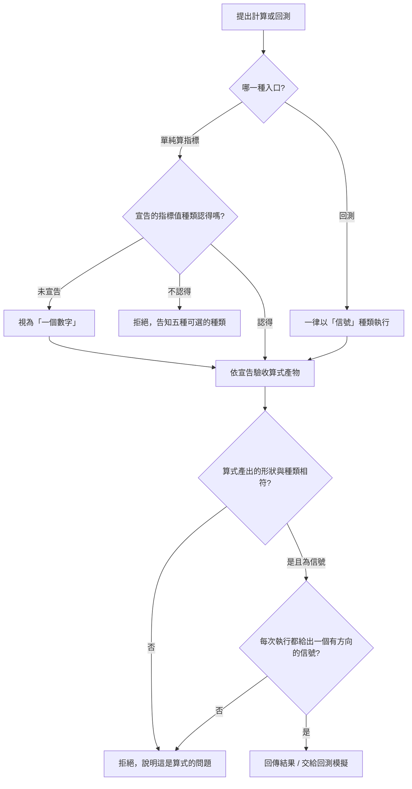

# Product Requirements Document (PRD) — 信號指標值種類

**Status:** Finalized
**Version:** v1.0
**Owner:** James Hsueh
**Stakeholders:** 專案作者本人（同時是使用者、開發者與審查者）
**Source brief:** `.sdd/2026-09-06-signal-result-type/BRIEF.md`

---

## 1. Background & Goal (Why & Goal)

- **Problem Statement:**
  「信號」目前不是一個真正的指標值種類。回測靠一個約定運作：算式放一個叫作信號的**數字**，回測看它的正負號決定買入、賣出還是持有。這個約定有兩個毛病——正負號是隱藏規則，看算式看不出「零點五」代表買入；而且任何數字都是「合法」的，打錯字也不會被發現，會默默算出一個「合法但無意義」的方向。

- **Expected Outcome:**
  使用者可以宣告第五種指標值種類「信號」。宣告這種種類時，算式產出的不是數字，而是一個明確的信號：**買入、賣出、或持有**，三選一，沒有第四種。算式透過系統提供的現成方式選出信號，不需要也不能自己拼一個出來。回測改成**只接受這種種類**：舊的「看數字正負號」讀法整個移除，一支用數字表達信號的算式必須先改寫，才能拿去回測。信號的第三個值從「持平」改名為「持有」，模擬行為完全不變。

- **Out of Scope:**
  - 一次計算裡混用多種種類——沿用「一次一種」。
  - 信號帶額外資訊：部位大小、停損位、信心程度、理由文字——這一版只有方向。
  - 一次執行產出多個信號。
  - 把信號種類的算式存成策略後的額外驗證或預跑——沿用策略「不執行也不檢查算式」。
  - 前端如何呈現與選擇「信號」種類——另開切片。
  - 回測的成交、倉位、資金曲線、成績單邏輯——這一版一律不動。

---

## 2. User Personas

- **Primary Role(s):** 策略研究者（專案作者本人）——同時是算式的作者與結果的讀者。
- **Usage Context:** 本機執行，透過既有的計算入口與回測入口送出請求。改算式 → 執行 → 看結果 → 再改，一輪跑很多次；種類多半在一開始就決定，之後整輪不動。

---

## 3. User Stories & Acceptance Criteria

### US-01 — 宣告這次算出的是一個信號 [priority: P0]

**As a** 策略研究者, **I want** 在送出計算時把指標值種類宣告成「信號」,
**so that** 算式可以直接說買入、賣出、持有，而不是借一個數字的正負號來暗示方向。

```gherkin
Scenario: 宣告信號並算出買入
  Given 使用者宣告這次的指標值種類是「信號」
  And 算式產出一個信號是買入
  When 使用者執行計算
  Then 結果的信號是買入
  And 結果說明這次的指標值種類是「信號」

Scenario: 完全沒有宣告種類時信號不是預設
  Given 使用者沒有宣告任何指標值種類
  And 算式為「均價」算出 110
  When 使用者執行計算
  Then 系統視為宣告「一個數字」
  And 結果中「均價」為 110

Scenario: 宣告的種類不在五種之內
  Given 使用者宣告這次的指標值種類是「一段文字」
  When 使用者執行計算
  Then 計算被拒絕，並告知可選的種類是：一個數字、一串數字、一個是非、一串是非、信號
  And 不回傳任何結果
```

### US-02 — 信號只有買入、賣出、持有三個值 [priority: P0]

**As a** 策略研究者, **I want** 一個信號只可能是買入、賣出、持有三者之一,
**so that** 不會有一個「合法但無意義」的方向被算出來、被拿去下注。

```gherkin
Scenario: 算式選出買入
  Given 使用者宣告這次的指標值種類是「信號」
  And 算式用系統提供的方式選「買入」
  When 使用者執行計算
  Then 這次的信號是買入

Scenario: 算式選出賣出
  Given 使用者宣告這次的指標值種類是「信號」
  And 算式用系統提供的方式選「賣出」
  When 使用者執行計算
  Then 這次的信號是賣出

Scenario: 算式選出持有
  Given 使用者宣告這次的指標值種類是「信號」
  And 算式用系統提供的方式選「持有」
  When 使用者執行計算
  Then 這次的信號是持有

Scenario: 算式想表達三者以外的意見
  Given 使用者宣告這次的指標值種類是「信號」
  When 算式嘗試表達買入、賣出、持有以外的第四種意見
  Then 系統沒有提供這樣的入口，算式表達不出第四種意見

Scenario: 算式自己拼一個像信號的東西回傳
  Given 使用者宣告這次的指標值種類是「信號」
  And 算式自行定義一個長得像信號的東西並回傳它
  When 使用者執行計算
  Then 計算被拒絕，並說明信號必須用系統提供的方式產生
  And 不回傳任何結果
```

### US-03 — 每次執行剛好產出一個信號 [priority: P0]

**As a** 策略研究者, **I want** 宣告信號種類時算式每次執行都要給出一個明確方向,
**so that** 「忘了設方向」這種 bug 會立刻被擋下，而不是被當成持有默默放過。

```gherkin
Scenario: 算式明確給出一個方向
  Given 使用者宣告這次的指標值種類是「信號」
  And 算式跑完，明確選出「賣出」
  When 使用者執行計算
  Then 這次的信號是賣出

Scenario: 算式建立了信號卻沒設方向
  Given 使用者宣告這次的指標值種類是「信號」
  And 算式建立了一個信號，但這一次沒有把方向設成買入、賣出、持有其中一個
  When 使用者執行計算
  Then 計算被拒絕，並說明這是算式的問題：方向沒有設定
  And 不回傳任何結果

Scenario: 算式這一次完全沒有給出信號
  Given 使用者宣告這次的指標值種類是「信號」
  And 算式這一次完全沒有產出任何信號
  When 使用者執行計算
  Then 計算被拒絕，並說明這是算式的問題：信號種類必須產出一個信號
  And 不回傳任何結果

Scenario: 信號的產出沒有指標名稱
  Given 使用者宣告這次的指標值種類是「信號」
  And 算式選出「買入」
  When 使用者執行計算
  Then 結果就是這一個信號本身，不是一組帶名稱的值
```

### US-04 — 回測只接受信號種類 [priority: P0]

**As a** 策略研究者, **I want** 回測一律以信號種類執行算式、不再看數字的正負號,
**so that** 回測讀的是一個明確的方向，而不是一個要靠約定去解讀的數字。

```gherkin
Scenario: 算式產出信號，回測正常重演
  Given 一支算式在每一棒產出一個信號，其中幾棒買入、幾棒賣出
  When 使用者執行回測
  Then 回測照信號逐棒模擬進出場
  And 交出成績單、已平倉交易明細與資金曲線

Scenario: 算式產出的是一個數字（舊寫法）
  Given 一支算式產出一個叫作信號的數字
  When 使用者執行回測
  Then 回測被拒絕，並說明回測只接受「信號」種類，這支算式要改寫成產出信號
  And 不回傳任何結果

Scenario: 算式從來沒有產出任何信號
  Given 一支算式從頭到尾沒有產出任何信號
  When 使用者執行回測
  Then 回測被拒絕，並說明算式必須產出信號
  And 不會被默默當成「全程持有、零交易」

Scenario: 某一棒沒產出信號
  Given 一支算式在多數棒都產出信號，但在某一棒沒有產出
  When 使用者執行回測
  Then 回測被拒絕，並說明是算式在那一棒沒有產出信號
  And 不回傳任何部分結果

Scenario: 回測請求不帶指標值種類
  Given 使用者送出回測請求，沒有任何地方指定指標值種類
  When 使用者執行回測
  Then 回測一律以「信號」種類執行，不需要使用者宣告
```

### US-05 — 信號種類在單純算指標與策略也能用 [priority: P1]

**As a** 策略研究者, **I want** 單純算一次指標時能宣告信號種類、建立策略時能把種類設成信號,
**so that** 我可以先預覽一支策略在最新資料上的信號，也可以把「會出信號的策略」存起來。

```gherkin
Scenario: 單純算指標宣告信號種類
  Given 使用者單純算一次指標，宣告種類是「信號」
  And 算式產出「買入」
  When 使用者執行計算
  Then 回傳這次的信號是買入
  And 結果不帶指標名稱

Scenario: 建立策略時把種類設成信號
  Given 使用者建立一支策略，指標值種類設成「信號」
  When 使用者送出建立
  Then 策略正常建立
  And 不會因為「種類不在四種之內」被拒

Scenario: 修改策略時把種類改成信號
  Given 一支已存在的策略，原本的指標值種類是「一個數字」
  When 使用者把它的指標值種類改成「信號」
  Then 策略正常更新
```

### US-06 — 既有規則一律不變 [priority: P0]

**As a** 策略研究者, **I want** 取 K 線、根數上限、算式時間上限、回測的逐棒規則在信號種類下都一樣,
**so that** 我不必去記「信號種類會不會有不一樣的規則」。

```gherkin
Scenario: 回測逐棒執行的規則不變
  Given 一次回測有五根已走完的 K 線
  When 回測走到第三棒
  Then 算式這一次看到的是第一棒到第三棒為止的三根 K 線
  And 走到第五棒時看到五根

Scenario: 排除還沒走完的那一格
  Given 這段期間的最後一個刻度區間還在走
  When 回測取 K 線
  Then 那個還在走的刻度區間不被取用

Scenario: 根數超過單次可用上限
  Given 這段期間以這個彙總刻度切出的刻度區間數超過單次查詢筆數上限
  When 使用者執行回測
  Then 回測被拒絕，並說出這一段要用到幾根、上限是幾根

Scenario: 算式逾時
  Given 算式在某一棒執行超過允許時間
  When 使用者執行回測
  Then 回測被拒絕，並說明算式未能在允許時間內算完

Scenario: 持有那一棒的模擬行為不變
  Given 手上沒有倉位
  When 這一棒的信號是持有
  Then 什麼都不發生：沒有倉位被開、沒有交易被記下
  And 行為與這個切片之前的「持平」一字不差
```

---

## 4. Business Flow & Logic

### Flow Diagram



### Core Business Rules

- **BR-1 五選一**：指標值種類是一個數字、一串數字、一個是非、一串是非、信號五種，宣告其他一律拒絕整次計算，並告知五種是哪些。
- **BR-2 預設不變**：沒有宣告種類時仍視為「一個數字」。信號不是預設，要主動選。
- **BR-3 信號只有三個值**：一個信號只會是買入、賣出、持有三者之一，沒有第四種。
- **BR-4 信號由系統提供的方式產生**：算式從系統提供的方式中選一個方向，不能自行定義信號的形狀；自行拼湊出來的東西不被接受，並說明信號必須用系統提供的方式產生。
- **BR-5 每次執行剛好一個信號**：宣告信號種類時，算式每執行一次要給出一個有方向的信號。建立了信號卻沒設方向、或這次完全沒產出信號，都算「算式的問題」，拒絕整次計算，不回傳部分結果。
- **BR-6 信號沒有指標名稱**：信號種類的產出是單一一個信號，不是一組「名稱對應值」。
- **BR-7 回測只接受信號種類**：回測一律以信號種類執行算式，呼叫端不需要也沒有地方宣告種類。算式產出的不是信號（例如產出數字），或某一棒沒產出信號、信號沒設方向，一律算式失敗、拒絕整次回測。
- **BR-8 移除舊讀法**：「信號大於零／小於零／等於零／沒有這個名字」的讀法，以及信號那個特定的指標名稱，全部移除。「沒有信號就當成全程持有、零交易」這條相容規則也移除。
- **BR-9 信號種類到處可用**：單純算指標可宣告信號種類（回傳一個沒有名稱的信號）；建立與修改策略時指標值種類可以是信號。
- **BR-10 改名不改行為**：信號的第三個值從「持平」改名為「持有」；模擬時「倉位不動、不記交易」的行為一字不差。
- **BR-11 其餘不變**：取 K 線、排除還沒走完的那一格、根數上限、算式執行時間上限與可用運算範圍、回測逐棒看得到第一根到當根的規則，全部沿用。

### Edge Cases

- **算式在多數棒產出信號、某一棒沒有**：整次回測失敗，沒有部分結果。
- **回測期間一筆交易都沒觸發**（信號全程持有）：不是錯誤，交出開倉次數 0、交易明細空、勝率不適用、資金曲線全等於初始資金的成績單。
- **已存的舊策略其算式其實在用數字表達信號**：這一版不主動掃描，等使用者拿去回測才會被擋下並被告知要改寫。

---

## 5. UI/UX Design & Interaction

本切片不含畫面。使用者透過既有的計算入口多送一種「信號」種類的選項；回測入口不需要新增欄位。前端如何呈現與選擇屬於前端專案的同名切片。

---

## 6. Non-Functional Requirements

- **Performance:** 與現行計算、回測相同；信號種類不增加額外的資料讀取。回測仍是「算式只解讀一次、逐棒執行」。
- **Security:** 算式仍在沙箱中執行，可用的運算範圍不因種類而放寬；系統提供的「產生信號的方式」不讓算式碰到 K 線以外的任何資料、當下時間或隨機值。
- **Compatibility:**
  - 沒有宣告種類的單純計算請求，行為與結果形狀與過去一致。
  - **回測不再相容舊的數字型信號算式**——這是刻意的破壞性變更，既有的數字型回測算式與其測試都要改寫。
- **Analytics / Tracking:** 無。

---

## 7. Dependencies & Risks

- **External Dependencies:** 無新增。
- **Known Risks:**
  - 破壞性變更：所有既有的數字型信號算式（含回測切片的測試與 Postman 範例）都要改寫成信號種類，範圍已知。
  - 「算式建立了信號卻沒設方向」的失敗訊息來自執行環境，可能相當技術性；系統負責標明「這是算式的問題：方向沒有設定」。
  - 「信號沒有指標名稱」讓信號種類的結果形狀與其他四種不同；讀結果的一方要能一眼分辨，見 Open Decisions。

---

## 8. Appendix

- 需求共識：[BRIEF.md](BRIEF.md)
- 通用語言：[../UL-MAP.md](../UL-MAP.md)
- 相依切片：`.sdd/2026-09-02-indicator-result-type`、`.sdd/2026-09-05-strategy-backtest`、`.sdd/2026-09-03-trading-strategy-management`、`.sdd/2026-08-29-indicator-calculation`

### Open Decisions（交給 architecture 裁決）

1. 單純算指標宣告「信號」時，結果「一個沒有名稱的信號」要怎麼和其他四種「一組名稱對應值」的結果並排回傳，讓讀結果的人一眼分得出來。
2. 「持平改為持有」的改名是否要連同對外已回傳過的欄位一起改，或只改對內詞彙。
3. 策略已存成舊的種類、其算式其實在用數字表達信號時，是否要主動標記為「需改寫」，還是等使用者自己拿去回測才發現（本 PRD 傾向後者）。
