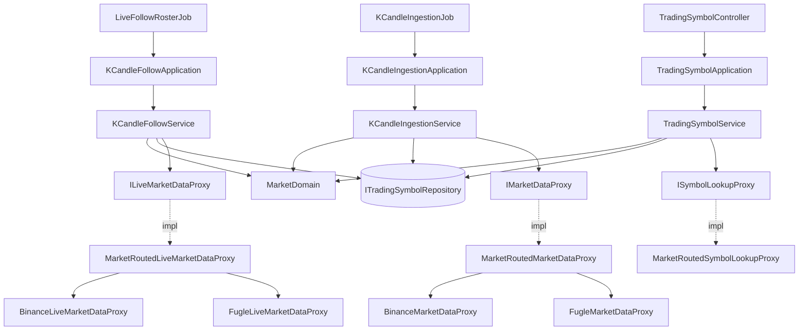

# 台股行情接入 — Architecture Design

**Status:** Confirmed
**Source PRD:** `.sdd/2026-09-07-taiwan-stock-market-data/PRD.md`
**Tech context:** Go · Clean/Onion Architecture · Gin · GORM/PostgreSQL · 手動 DI（`cmd/server/dependencies.go`）

---

## 1. Design Goal & Guiding Principle

- **In one sentence:**
  讓「同一套 K 線規則」跑在兩個行為不同的市場上——一個會收盤、跟盤有名額、缺幾個成交數字，
  另一個全天候、不限名額、什麼都有——而**既有的取數介面一個字都不必改**。

- **Guiding principle:**
  **把「所屬市場」放進取數視窗裡，讓路由變成一份實作而不是一個分支。**

  `IMarketDataProxy.FetchKCandles(ctx, window)` 的形狀不動，只在 `KCandleFetchWindowVo`
  上多一個 `Market`。於是「該向誰要資料」由一個同樣實作 `IMarketDataProxy` 的**路由實作**
  在 infrastructure 內部回答，呼叫端（domain service）完全不知道有第二個來源存在。
  加第三個市場＝多兩份 proxy 實作 ＋ 組裝根多一行 map，**不改任何介面、不動任何 service**。

  第二個原則：**市場的規則集中在一個 domain model 上**。「現在開不開盤」、「這段時間該收窄到哪裡」、
  「同時跟得動幾檔」是同一件事的三個面向——它們一起變、就該一起住。
  `MarketDomain` 是那個家，其他人只問它問題、不自己算時區。

---

## 2. Change Scope

| Area | Action | What / Why |
| :--- | :--- | :--- |
| `domain/models/vo/market_vo.go` | **Add** | 市場的值（`taiwanStock` / `crypto`），含「認不得或空白一律視為加密貨幣」的正規化。沿用專案既有的 VO＋Domain 配對慣例（見 `aggregation_interval_vo.go`／`indicator_result_type_vo.go`） |
| `domain/models/domains/market_domain.go` | **Add** | 市場的**全部行為**：開不開盤、把視窗收窄到交易時段、同時跟盤上限、這一刻算哪個交易日 |
| `domain/models/vo/k_candle_fetch_window_vo.go` | **Modify** | 多帶一個 `Market`。這是讓取數介面免於改動的那一個欄位 |
| `domain/models/entities/trading_symbol.go` | **Modify** | 多 `Market`、`IsWatched`、`RegisteredAt` 三欄。觀察清單與登錄合併成同一張表 |
| `domain/interface/i_trading_symbol_repository.go` | **Modify** | 多 `FindWatched`、`FindBySymbol`、`Save`。讀寫仍在同一個 repository（一 entity 一 repository） |
| `domain/interface/i_symbol_lookup_proxy.go` | **Add** | 「這個代號在這個市場存不存在」——加入觀察清單前的確認（BR-4）。以能力命名，不綁供應商 |
| `domain/service/trading_symbol_service.go` | **Modify** | 多兩個 use case：加入／移出觀察清單。兩者互不呼叫 |
| `controller/k_candle_backfill_controller.go` | **Add** | 手動補齊一檔的入口（`POST /k-candles/backfill`）。它暴露的不是一根 K 線而是「去把 K 線抓回來」，所以自成一個 controller |
| `domain/service/k_candle_ingestion_service.go` | **Modify** | **改為自己讀觀察清單**（不再由 job 傳入），並在取數前問 `MarketDomain` 該不該跳過 |
| `domain/service/k_candle_follow_service.go` | **Modify** | 多一種跟盤來源：**固定名單**（台股）與既有的**觀看者驅動**（加密貨幣）並存 |
| `domain/models/dto/k_candle_follow_update_dto.go` | **Modify** | 多第四種狀態 `unavailable`：這一檔本來就沒有即時更新，不會自己恢復 |
| K 線的三個成交數字 | **Modify** | entity／DTO／write DTO 由 `decimal.Decimal` 改為 `decimal.NullDecimal`。沒有值與零從此分得開 |
| `infrastructure/marketdata/` | **Add** | Fugle 的兩份 proxy（一般＋即時）、兩家的代號查詢 proxy，以及三個**依市場路由**的實作 |
| `job/live_follow_roster_job.go` | **Add** | 每五分鐘重新決定固定跟盤名單。與抓取分成兩個 job，慢的那一輪不會拖住名單 |
| `config`、`cmd/server/dependencies.go` | **Modify** | 台股的設定與組裝；`KCANDLE_INGESTION_SYMBOLS` 退場 |
| `controller` | **Modify** | 觀察清單的增減兩條路由 |
| **K 線本身的規則** | **Not touched** | 五分鐘一根、五分鐘刻度、重複即覆蓋、進行中不存……一條都不改。兩個市場共用（BR-18） |
| **查詢／彙總／指標計算／回測／策略／助手／登入** | **Not touched** | 這些讀的是已經存進來的 K 線，不認識市場，也不該認識 |
| `vo.KCandleVo`（算式看到的形狀） | **Not touched** | 算式只吃 `float64`，表達不出「沒有值」。改它會弄壞每一支既有策略——見 §8 |

---

## 3. New Classes / Modules

| Name | Kind | Responsibility (purpose) | Collaborators | Satisfies (PRD scenario) |
| :--- | :--- | :--- | :--- | :--- |
| `vo.MarketVo` | VO | 一個市場的身分。建構時正規化：認不得或空白一律成為加密貨幣 | — | US-01「既有的舊資料沒有記市場時視為加密貨幣」 |
| `domains.MarketDomain` | Domain Model | **一個市場的全部行為**：`IsOpen(at)`、`ClampToTradingSession(window)`、`SimultaneousFollowCeiling()`、`TradingDateOf(at)`。加密貨幣是「永遠開著、不收窄、不限名額」的那一種，不是特例分支 | `vo.MarketVo` | US-05 全部、US-06「收盤時不跟」、US-08 全部、US-09「交易時段」 |
| `domains.WatchlistEntryDomain` | Domain Model | 一筆要加進觀察清單的東西，檢查過：代號非空白、市場認得。`ToEntity()` 產出登錄用的實體 | `TradingSymbolDomain`、`vo.MarketVo` | US-03「代號空白」 |
| `_interface.ISymbolLookupProxy` | Interface | 「這個代號在這個市場存不存在」。以能力命名——換供應商不改這個名字 | — | US-03「代號不存在」「來源不可用」 |
| `marketdata.FugleMarketDataProxy` | Proxy | 向 Fugle 取台股五分鐘 K 線，正規化成 `MarketKCandleVo`（三個成交數字留空） | — | US-07 全部 |
| `marketdata.FugleLiveMarketDataProxy` | Proxy | 台股即時推送，正規化成 `LiveKCandleVo` | — | US-06「名額之內立刻收到」 |
| `marketdata.FugleSymbolLookupProxy` | Proxy | 向 Fugle 確認台股代號存在 | — | US-03 |
| `marketdata.BinanceSymbolLookupProxy` | Proxy | 向 Binance 確認加密貨幣代號存在 | — | US-03 |
| `marketdata.MarketRoutedMarketDataProxy` | Proxy | **依視窗上的市場**把取數轉給對應來源。它自己實作 `IMarketDataProxy`，所以呼叫端不知道它存在 | `map[vo.MarketVo]IMarketDataProxy` | US-01「向台股／加密貨幣的來源取資料」 |
| `marketdata.MarketRoutedLiveMarketDataProxy` | Proxy | 同上，用於即時跟盤 | `map[vo.MarketVo]ILiveMarketDataProxy` | US-06 |
| `marketdata.MarketRoutedSymbolLookupProxy` | Proxy | 同上，用於代號確認 | `map[vo.MarketVo]ISymbolLookupProxy` | US-03 |
| `job.LiveFollowRosterJob` | Job | 每五分鐘要求重新決定固定跟盤名單。實作既有的 `IBackgroundJob` | `KCandleFollowApplication` | US-06「開盤時自己跟回來」「清單改動後名單跟著重新決定」 |
| `dto.WatchlistEntryDto` | DTO | application 交給 domain 的輸入形狀：代號＋市場 | — | US-03 |

**深度檢查**：三個路由 proxy 的介面與被路由者**完全相同**——呼叫端沒有多學任何東西，
卻換來「多一個市場只是多一筆 map」。`MarketDomain` 把四個問題收在一個物件後面，
呼叫端不必先問「這是哪個市場」再自己查時區表。
`KCandleFollowService.WatchKCandles(ctx, symbol)` **簽章不變**——市場由它自己查，
呼叫端不必先解析市場再決定要走哪條路。以上都通過「呼叫端不需要自己排步驟」這一關。

---

## 4. Modified Components

| Component | Current role | Change needed |
| :--- | :--- | :--- |
| `vo.KCandleFetchWindowVo` | 取數視窗（代號＋起訖） | 多 `Market`。建構子一併收下 |
| `vo.MarketKCandleVo` | 來源回報的一根 K 線 | 三個成交數字改 `decimal.NullDecimal` |
| `entities.TradingSymbol` | 只有 `Symbol` 一欄 | 多 `Market`（預設 `crypto`）、`IsWatched`、`RegisteredAt`。`Symbol` 維持唯一 |
| `entities.KCandle` | K 線資料列 | 三個成交數字改 `decimal.NullDecimal`，欄位放寬為可空 |
| `dto.KCandleDto` / `dto.KCandleWriteDto` | K 線進出的形狀 | 同上。`NullDecimal` 在 JSON 上就是 `null` |
| `dto.TradingSymbolDto` | 只有 `symbol` | 多 `market`、`isWithinTradingSession`、`hasTradingSession`、`hasLiveUpdates`、`isWatched` |
| `ITradingSymbolRepository` | `FindAll` / `RegisterAll` | 多 `FindWatched`、`FindBySymbol`、`Save`（upsert） |
| `TradingSymbolService` | 列出、登錄預設 | 多 `AddToWatchlist`、`RemoveFromWatchlist`；`ListTradingSymbols` 改為帶出四個欄位（需 `MarketDomain` 與跟盤名單） |
| `KCandleIngestionService` | 由呼叫端給 `symbols []string` | **自己讀觀察清單**；每個標的依所屬市場組視窗；`MarketDomain.IsOpen` 為否就跳過（不算失敗）；記住「今日推定休市」。多 `RunBackfillFor(symbol)`——**只補一檔、依名稱找而不經觀察清單、永不推定休市** |
| `TradingSymbolApplication` | 每個方法一次 domain 呼叫 | `AddToWatchlist` 改為**編排兩個 domain service**：加完立刻補齊那一檔。補齊失敗只留紀錄，不讓加入失敗 |
| `registerRoutes`（組裝根） | 只回傳跟盤 | 改為回傳跟盤**與抓取**：路由與背景工作都要用到抓取，各自建一份會讓「今天休市」記成兩份 |
| `KCandleIngestionDomain` | 視窗與「哪些算收完」 | 視窗多帶市場；回補視窗交給 `MarketDomain.ClampToTradingSession` 收窄 |
| `KCandleFollowService` | 觀看者驅動的跟盤登記簿 | 多一組**固定跟盤**；`WatchKCandles` 先查市場，台股走名單、加密貨幣走原路；名單外回 `unavailable` |
| `symbolFollow` | 一個市場與它的觀看者 | 多一個「這是固定跟盤」的標記——最後一個觀看者離開時不結束它 |
| `KCandleIngestionJob` | 持有 `symbols` 並傳入 | **拿掉 `symbols`**。清單不再是啟動時凍結的東西 |
| `KCandleFollowApplication` | 一個 use case | 多 `RefreshFixedFollows`——`LiveFollowRosterJob` 的唯一入口 |
| `TradingSymbolController` | `GET /trading-symbols` | 多 `POST /watchlist`、`DELETE /watchlist/:symbol`；以哨兵錯誤對映 400／404／502 |
| `config.ApplicationConfig` | — | 多 `TaiwanStock` 一節；`KCANDLE_INGESTION_SYMBOLS` 退場 |

---

## 5. Component Relationships

---

## 6. Extensibility & Handoff Notes

- **Most likely next requirement:** **第三個市場**（美股、期貨、選擇權）。
  次可能的是「台股的交易時段不只一段」（盤中零股、盤後定價）。

- **Where it lands:**
  - 第三個市場 → 三個 `MarketRouted*Proxy` 的 map，加上 `vo.MarketVo` 多一個值、
    `MarketDomain` 多一組交易時段設定。**沒有任何 service、任何介面需要動。**
  - 多一段交易時段 → `MarketDomain` 內部，`IsOpen` 與 `ClampToTradingSession` 由「一段」
    變成「一組」。對外的兩個方法簽章不變。

- **How to add it（加第三個市場的完整步驟）:**
  1. `vo.MarketVo` 多一個常數。
  2. 寫 `{Provider}MarketDataProxy`、`{Provider}LiveMarketDataProxy`、`{Provider}SymbolLookupProxy`。
  3. `dependencies.go` 的三個 map 各多一行。
  4. `MarketDomain` 的建構資料多一筆交易時段與名額上限。

  **不必**改 `IMarketDataProxy`、不必改任何 domain service、不必改任何 controller。

- **Patterns applied & why:**
  - **Strategy（`MarketDomain`）**：市場之間唯一的差異是行為，而行為隨市場一起變。
    加密貨幣不是「跳過檢查」的特例，而是「永遠開著、不限名額」的一個策略值——
    這樣就沒有任何一處寫著 `if market == taiwanStock`。
  - **Adapter/Composite（三個 `MarketRouted*Proxy`）**：它們實作它們所路由的同一個介面，
    因此對呼叫端而言不存在。這是把「多來源」這件事整個藏進 infrastructure 的方式。
  - **VO＋Domain 配對**：沿用專案既有慣例（`AggregationIntervalVo`／`Domain`），
    不發明第二種寫法。

- **Do not hardcode:**
  - **同時跟盤上限**——它是行情來源方案的限制，換方案就變（設定，預設 5）。
  - **台股交易時段的起訖**——設定，預設 09:00–13:30。
  - **任何一處 `if market == ...` 的分支**——市場的差異一律問 `MarketDomain`。
  - **休市日名單**——刻意不維護；由來源的回覆推定（BR-9）。

- **Known debt / deferred:**
  - **算式看到的形狀（`vo.KCandleVo`）仍是 `float64`，沒有值會變成零。**
    這正是 PRD 警告的那種沉默錯誤，但改它會弄壞每一支既有策略，
    因此本切片不動。**該回頭處理的訊號**：有人寫出用到成交額的策略、並且開始套在台股上。
  - **休市以「正常回覆卻零根」推定**，不是查權威行事曆。
    **訊號**：出現整天真的零成交的個股，被誤判為全市場休市。
  - **跟盤名單只能靠加／拿掉來換**，沒有「這一檔優先」的標記。
    **訊號**：換名單這件事開始頻繁發生。
  - **`RegisteredAt` 而非自增 ID 決定登錄先後**：避免動到既有主鍵。
    既有資料的 `RegisteredAt` 為零值、彼此相等，以代號名稱決勝負，結果仍是確定的。

---

## 7. Traceability

| PRD Scenario | Fulfilled by |
| :--- | :--- |
| US-01 台股／加密貨幣各向自己的來源取資料 | `MarketRoutedMarketDataProxy` + `KCandleFetchWindowVo.Market` |
| US-01 沒登錄過的回覆找不到 | `KCandleFollowService.WatchKCandles` + `ErrTradingSymbolNotRegistered` |
| US-01 沒有記市場的視為加密貨幣 | `vo.MarketVo` 建構子正規化 |
| US-01 預設交易標的為加密貨幣且追蹤中 | `TradingSymbolService.RegisterDefaultTradingSymbols` |
| US-02 加進來／拿掉的下一輪生效 | `KCandleIngestionService` 每輪 `FindWatched` |
| US-02 進行中的那一輪照原清單跑完 | 每輪起點讀一次，該輪其後不再讀 |
| US-02 清單為空什麼都不抓 | `KCandleIngestionService.ingestSymbols`（空清單即空報告） |
| US-03 加一檔存在的台股 | `TradingSymbolService.AddToWatchlist` + `ISymbolLookupProxy` |
| US-03 代號不存在／來源不可用／空白 | `WatchlistEntryDomain` + 三個哨兵錯誤 |
| US-03 重複加／加回被拿掉的 | `ITradingSymbolRepository.Save`（upsert） |
| US-04 拿掉只停追蹤、K 線都留著 | `TradingSymbolService.RemoveFromWatchlist`（只改 `IsWatched`） |
| US-04 拿掉正被跟的、名額遞補 | `KCandleFollowService.RefreshFixedFollows` 下一輪重算名單 |
| US-05 交易時段內照常抓 | `MarketDomain.IsOpen` |
| US-05 收盤／週末跳過且不留失敗紀錄 | `KCandleIngestionService` 於 `IsOpen` 為否時直接產出空報告 |
| US-05 剛收盤那一輪存入最後一根 | `KCandleIngestionDomain.ScheduledWindow` + `IsOpen` 的收盤緩衝 |
| US-05 休市推定／隔日重判 | `KCandleIngestionService` 的休市記錄 + `MarketDomain.TradingDateOf` |
| US-05 來源不可用才算失敗 | `KCandleIngestionService.ingestSymbol` 區分「回覆零根」與「取不到回覆」 |
| US-06 只跟最早登錄的那幾檔／不足不湊滿 | `KCandleFollowService.RefreshFixedFollows` + `MarketDomain.SimultaneousFollowCeiling` |
| US-06 沒有人看也照跟 | `symbolFollow` 的固定跟盤標記 |
| US-06 名額之外被告知沒有即時更新 | `KCandleFollowStatusUnavailable` |
| US-06 收盤不跟／開盤跟回來 | `LiveFollowRosterJob` + `MarketDomain.IsOpen` |
| US-06 加密貨幣仍是有人看才跟 | `KCandleFollowService` 原路徑不變（`MarketDomain` 回報不限名額） |
| US-07 台股三個數字沒有值／加密貨幣照常 | `decimal.NullDecimal` 貫穿 VO→DTO→entity |
| US-07 成交量是零與沒有值不同 | 同上（`Volume` 仍是必填 `decimal.Decimal`） |
| US-07 完全沒成交的那五分鐘沒有那一根 | 既有規則，不補洞 |
| US-07 成交量不換算 | `FugleMarketDataProxy` 原樣正規化 |
| US-08 回補只補交易時段內／完全沒有就不補 | `MarketDomain.ClampToTradingSession` + `KCandleFetchWindowVo.IsEmpty` |
| US-08 加密貨幣回補維持現狀 | 同上（加密貨幣不收窄） |
| US-09 帶出市場／交易時段／即時更新／是否追蹤 | `TradingSymbolService.ListTradingSymbols` + `TradingSymbolDto` |
| US-09 不追蹤的仍然查得到 | `ListTradingSymbols` 讀的是整張表，不是只讀追蹤中的 |
| US-09 帶出「這個市場會不會收盤」 | `TradingSymbolDto.HasTradingSession` ← `MarketDomain.NeverCloses` |
| US-10 收盤後加一檔馬上就有今天的資料 | `TradingSymbolApplication.AddToWatchlist` 編排 `RunBackfillFor` |
| US-10 補齊失敗不把加入退回 | 同上（只留紀錄，不回傳錯誤） |
| US-10 加入本身被拒絕時什麼都不補 | 同上（先加、加失敗即提早返回） |
| US-10 手動要求補齊／回報收到幾根 | `POST /k-candles/backfill` → `KCandleBackfillController` → `KCandleIngestionApplication.CatchUpSymbol` |
| US-10 不在觀察清單上的一樣補得動 | `RunBackfillFor` 走 `FindBySymbol`，不走 `FindWatched` |
| US-10 沒登錄過的代號被拒絕且不是「稍後再試」 | `ErrTradingSymbolNotRegistered` → `404`；空白 `ErrTradingSymbolNamed` → `400` |
| US-10 只補一檔時不推定整個市場休市 | `RunBackfillFor` 不呼叫 `presumeClosedMarkets` |

---

## 8. Risks & Open Decisions

**Risks / trade-offs:**

- **`decimal.NullDecimal` 的擴散**：三個欄位改為可空，會波及每一處讀它們的地方。
  這是刻意付的代價——PRD BR-15 的整個重點就是不讓「沒有」與「零」長得一樣。
  波及面已由型別系統標出來，編譯器會逐一指出漏改的地方。

- **`KCandleIngestionService` 從無狀態變成有狀態**（記住今日推定休市的市場）。
  專案裡已有先例（`KCandleFollowService` 持有跟盤登記簿，且該檔已寫下理由）。
  這裡的狀態是**規則的記憶**而非機制，且「哪一天算同一天」的判斷仍在 `MarketDomain` 上。

- **兩個 job 都會在同一刻讀觀察清單**，各讀各的。這是刻意的：
  慢的抓取輪次不該拖住跟盤名單的更新，而多一次讀取的成本遠低於兩者互相等待。

- **台股跟盤名額若被外部因素佔滿**（例如上一輪的連線尚未完全釋放），
  新名單可能短暫超額而被來源整條拒絕（NFR-2）。
  `RefreshFixedFollows` 必須**先停後起**，不可先起後停。

**Open decisions (for implementation):**

- Fugle 的即時推送與 REST 的實際欄位與端點，於實作時對照其文件確定；
  正規化的目標形狀（`MarketKCandleVo` / `LiveKCandleVo`）已固定，不受其影響。
- `IsOpen` 在「剛收盤」那一輪需要留多久的緩衝，才能確保 13:25 那一根被取到
  （US-05「台北時間 13:33 存入 13:25」）。實作時以「最後一根收完後仍視為可取數一段時間」表達，
  該長度取一輪的間隔即可。
- 代號確認在 Binance 這一側的作法（查交易對清單或試取一根），
  兩者都滿足 `ISymbolLookupProxy`，擇一即可。
