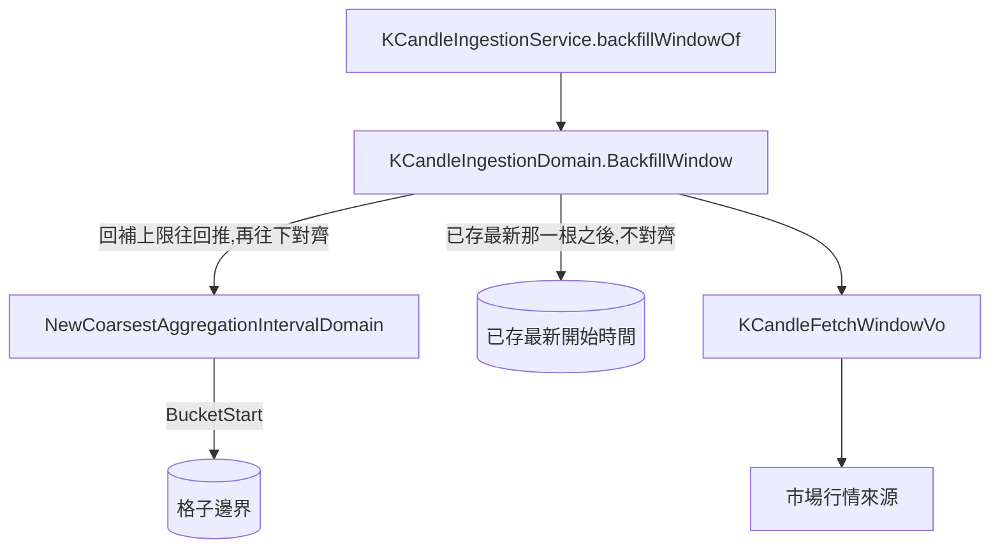

# 回補起點對齊刻度起日 — Architecture Design

**Status:** Confirmed
**Source PRD:** `.sdd/2026-09-08-aligned-backfill-start/PRD.md`
**Tech context:** Go · Clean / Onion Architecture · 充血模型（Entity 乾淨，行為放 `models/domains/`）

---

## 1. Design Goal & Guiding Principle

- **In one sentence:**
  讓回補窗口中「來自回補上限」的那個起點**往下對齊到最粗那一種彙總刻度的格子起點**，
  而「來自已存最新那一根之後」的那個起點一個字都不動。

- **Guiding principle:**
  **不自己推導午夜。** 「一個格子從哪裡開始」這條規則已經有主人了——
  `AggregationIntervalDomain.BucketStart`，而它的正確性靠一條寫在
  `selectableAggregationIntervals` 上的既有不變量支撐（**每一種長度都必須整除一天**）。
  對齊到**最粗那一種**因此自動對齊到全部六種：午夜是每一種長度的整數倍。
  自己寫一個 `Truncate(24 * time.Hour)` 會是第二份同樣的知識，
  而它們哪天不一致時沒有任何地方會報錯。

---

## 2. Change Scope

| Area | Action | What / Why |
| :--- | :--- | :--- |
| `internal/domain/models/domains/aggregation_interval_domain.go` | **Add** | 一個取「最粗那一種彙總刻度」的建構子。對齊要問它，而不是問一個寫死的長度 |
| `internal/domain/models/domains/k_candle_ingestion_domain.go` | **Modify** | `BackfillWindow` 中由回補上限推出的那個起點改為往下對齊；文件裡「最多往回」的說法改寫成「至少往回」 |
| `internal/domain/models/domains/tests/`（抓取與彙總刻度兩支） | **Modify** | 邊界案例：剛好落在邊界、一天將盡、一天剛開始、已有資料時不對齊 |
| `internal/domain/service/tests/`、`internal/application/tests/` | **Modify** | 既有的回補測試會看到更早的起點（讀取上限與期望值要跟著調） |
| `.sdd/2026-08-30-k-candle-auto-ingestion/` 的規則描述 | **Modify** | 那份文件寫著「回補**最多**往回 24 小時」，意思已經改了；不改它就是留一份會誤導人的權威文件 |
| **`ScheduledWindow`** | **Not touched** | 它抓的是最新那幾根，起點來自「最新一根已收完的 K 線往前數幾根」——本來就接在既有資料後面，沒有半截格子的問題 |
| **`SelectClosed` / `LatestClosedOpenTime` / 結束時間** | **Not touched** | 這次只改**從哪裡開始**，不改到哪裡結束、也不改哪一根算收完 |
| **指標計算那一整側** | **Not touched** | 它現在的行為是對的。這次是從源頭讓「最舊那一格可能不滿」消失，所以它不必付任何代價（不丟值、不多要一格歷史） |
| **回頭補既有那些半截的格子** | **Not touched** | PRD 明列為 Out of Scope。它是另一個窗口規則，見第 6 節 |
| 行情來源（`FinMindProxy` / Binance 那側） | **Not touched** | 它們本來就以時間範圍取資料；範圍更早只代表回來的資料更多或一樣多 |

---

## 3. New Classes / Modules

| Name | Kind | Responsibility (purpose) | Collaborators | Satisfies (PRD scenario) |
| :--- | :--- | :--- | :--- | :--- |
| `NewCoarsestAggregationIntervalDomain()` | Constructor | 交出**最粗那一種**彙總刻度。它是「對齊到哪裡」唯一該問的地方——對齊到它就對齊到全部六種 | `selectableAggregationIntervals` | US-01 全部六個情境；US-01「同一次對齊讓較細的刻度也完整」 |

> **刻意不新增 domain model。** 對齊是一個「這一刻往下取整」的動作，而做這件事的規則
> （`BucketStart`）與做這件事的時機（`BackfillWindow`）都已經各有主人。
> 中間再放一個物件，會是一個只被叫一次的間接層——正是 `.claude/rules/architecture.md`
> 的 inline 門檻要擋掉的東西。

---

## 4. Modified Components

| Component | Current role | Change needed |
| :--- | :--- | :--- |
| `KCandleIngestionDomain.BackfillWindow` | 算出回補要抓哪一段：起點取「回補上限往回推」與「已存最新那一根之後」的較晚者，終點是最新一根已收完的 | 由回補上限推出的那個起點，先以最粗彙總刻度的 `BucketStart` **往下對齊**，再與另一個候選比大小。**比大小那一段的邏輯不動**——已有資料時它本來就會勝出，因此那條路自然不受對齊影響 |
| `KCandleIngestionDomain` 的型別註解 | 說它擁有「兩段值得抓的時間」的每一條規則 | 補上「回補的起點對齊到格子邊界」是它的規則之一，並說明為什麼另一個候選起點不對齊 |
| `BackfillWindow` 的方法註解 | 寫著「reaching no further back than the lookback allows」 | 改寫：回補上限是**至少**往回這麼久；對齊會讓它最壞往回將近兩倍，而多抓的量**不超過最粗那一種刻度的長度** |
| `selectableAggregationIntervals` 的清單註解 | 已經寫著「每一種長度都必須整除一天」 | 補一句：回補起點的對齊**靠這條不變量成立**，動這份清單前先讀那一段 |

**為什麼「比大小」那一段不必動**：對齊只會讓候選起點變得**更早**，
而「已存最新那一根之後」勝出的條件是它**更晚**——更早的對手只會讓它更容易勝出，不會反過來。
所以 US-02 的三個情境完全由既有邏輯滿足，不需要新的分支。

---

## 5. Component Relationships

---

## 6. Extensibility & Handoff Notes

- **Most likely next requirement:**
  **回頭把既有那些半截的最舊格子補起來**（PRD 明列為 Out of Scope，但它是這次留下的唯一殘留）。

- **Where it lands:**
  `KCandleIngestionDomain` —— 它的型別註解已經說自己擁有「兩段值得抓的時間」，
  那一天會變成三段：定時、回補、以及**補頭**。三者都是「算出一個窗口」，
  所以新的那一段是同一個物件上的第三個方法，不是一個新物件。

- **How to add it:**
  加一個回傳 `KCandleFetchWindowVo` 的方法，收「已存**最舊**那一根的開始時間」
  （目前的回補收的是最**新**那一根），窗口是「那一根所屬格子的起點」到「那一根之前」。
  服務層照 `backfillWindowOf` 的樣子多一條取窗口的路，其餘共用。
  **不要把它塞進 `BackfillWindow`**：那個方法回答的是「往前還缺什麼」，補頭問的是「往後缺什麼」，
  混在一起之後兩個問題會互相干擾對「較晚者勝出」那條規則的判斷。

- **第二個可能的下一步：多一種更粗的彙總刻度。**
  它落在 `selectableAggregationIntervals` 一行，而**對齊會自動跟上**——
  這正是這次問「最粗那一種」而不是寫死一天的理由。
  但要注意：那份清單的不變量是「每一種長度都必須整除一天」，
  所以一週這種不整除一天的刻度**不能只加一行**，它會同時打破對齊的正確性，需要一併重新裁決。

- **Patterns applied & why:**
  沒有新模式。唯一的設計動作是**把一個既有規則問出來**（`BucketStart`）而不是複製它。

- **Do not hardcode:**
  - **不得寫 `Truncate(24 * time.Hour)` 或任何「一天」的字面值。** 對齊到哪裡要問最粗那一種刻度；
    寫死的那一份會在清單改動時安靜地不同步。
  - **不得對齊「已存最新那一根之後」那個候選起點。** 它落在一分鐘刻度上、而且接得上既有資料，
    往下對齊會跨過已經存在的 K 線，製造重複或洞。
  - **不得往上對齊。** 往上會少補將近一天，而最舊那一格會變成今天。

- **Known debt / deferred:**
  - 既有那些半截的最舊格子維持原樣（見上）。
  - 「一格是否裝滿」在系統裡仍然沒有任何地方說得出來，也刻意不留紀錄。
    這次是讓它**不會因為起點而不滿**，不是讓它變得可觀察。

---

## 7. Traceability

| PRD Scenario | Fulfilled by |
| :--- | :--- |
| US-01 從未存過 K 線的交易標的 | `BackfillWindow` + `NewCoarsestAggregationIntervalDomain().BucketStart` |
| US-01 往回推之後剛好落在邊界上 | 同上（`Truncate` 對已對齊的時刻不改變它） |
| US-01 一天將盡時往回推最遠 | 同上 |
| US-01 一天剛開始時幾乎不多往回 | 同上 |
| US-01 對齊後最舊那一格裝滿一整天 | `BackfillWindow` 的起點 + `KCandleSeriesDomain.Buckets()`（既有，不變） |
| US-01 同一次對齊讓較細的刻度也完整 | `NewCoarsestAggregationIntervalDomain`（最粗的邊界是每一種長度的整數倍） |
| US-02 缺口在回補上限之內 | `BackfillWindow` 既有的「較晚者勝出」（不變） |
| US-02 停機超過回補上限 | 同上（對齊後的候選勝出） |
| US-02 沒有缺口 | `KCandleFetchWindowVo.IsEmpty`（既有，不變） |
| US-03 有交易時段的市場 | 既有：`KCandleSeriesDomain.Buckets()` 不補洞；交易時段的裁剪在窗口之後（不變） |
| US-03 當天才上市的交易標的 | 同上 |
| US-03 對齊後的起點比來源手上最早的資料還早 | 既有：來源回幾根存幾根，不判定失敗（不變） |
| US-04 一般情況下多抓的量 | `BackfillWindow` 的起點（多出的量等於「現在到格子起點」的距離） |
| US-04 最多多抓的量 | 同上——上界是最粗那一種刻度的長度減一分鐘 |
| US-04 完全不多抓的情況 | 同上 |
| US-05 改動之前開始抓的交易標的 | **不新增任何東西**：`BackfillWindow` 只往前看，本來就不回頭補 |

---

## 8. Risks & Open Decisions

### Risks / trade-offs

- **回補上限的明文意思改了**（從「最多」變成「至少」）。
  `2026-08-30-k-candle-auto-ingestion` 那份文件與通用語地圖都要同步，
  否則會留下一份說「最多 24 小時」的權威文件，而任何照它推算量級的人會少算將近一倍。
- **多抓的量有明確上界**：不超過最粗那一種刻度的長度（目前是一天，1439 根）。
  「避免久未啟動時第一輪暴衝」這個原始目的因此仍然成立——量級沒變，只多了不到一倍。
- **對齊之後最舊那一格仍然可能不滿**，但那時的原因只剩下「市場真的沒有成交」，
  而那一格是對的。這正是這次要達成的狀態，不是殘留問題。

### Open decisions (for implementation)

- 那個新建構子的確切名稱（`NewCoarsestAggregationIntervalDomain` 是目前的提案，
  要與同檔既有的 `NewAggregationIntervalDomain` 讀起來像一組）。
- 既有的回補測試裡，起點期望值要改成寫死的邊界時刻，還是由測試自己算一次對齊——
  前者讀起來更明確，後者不會在改動測試用的「現在」時一起壞掉。實作時定案。
