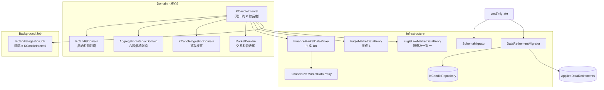

# 一分鐘 K 線 — Architecture Design

**Status:** Confirmed
**Source PRD:** `.sdd/2026-09-08-one-minute-k-candle/PRD.md`
**Tech context:** Go · Clean / Onion Architecture · GORM + PostgreSQL · `time.Ticker` 背景 job

---

## 1. Design Goal & Guiding Principle

- **In one sentence:**
  把系統唯一的 K 線長度由五分鐘改為一分鐘，讓「一分鐘」成為最細的彙總刻度與預設值、自動抓取跟著改為每分鐘一輪，並在遷移時把舊顆粒度的 K 線一次清乾淨。

- **Guiding principle:**
  **把「一根 K 線多長」收斂成整個系統唯一一個常數，並讓每個依賴它的地方從它推導出自己的說法。**

  今天這個長度其實寫在五個地方：領域的常數、兩個行情來源各自的拼法、即時來源的折疊長度、以及抓取 job 的間隔。它們碰巧一致，但沒有任何東西保證它們一致——改動時漏掉任何一個，系統會安靜地存下長度不對的 K 線，而且沒有人看得出來。

  這次改動的價值不只是「5 變 1」，而是**改完之後這個數字只剩一個**：領域匯出 `KCandleInterval`，行情來源把它換算成自己的拼法（Binance 的 `1m`、Fugle 的 `1`），抓取 job 直接用它當間隔。下一次要換長度的人改一行，而不是找齊五處。這正是既有註解「widening the feature to other lengths starts here」原本想承諾、但當時還沒兌現的事。

---

## 2. Change Scope

| Area | Action | What / Why |
| :--- | :--- | :--- |
| `domains.KCandleDomain`（`k_candle_domain.go`） | **Modify** | 長度常數 5 → 1 並**匯出**，成為全系統唯一來源；起始時間對齊改以「截斷後仍相等」表達，取代只在整數分鐘刻度成立的取餘數判斷 |
| `vo.AggregationIntervalVo` | **Modify** | 新增 `AggregationIntervalOneMinute = "1m"` |
| `domains.AggregationIntervalDomain` | **Modify** | 可選清單最前面加入一分鐘（成為最短、也就是未指定時的預設）；`SourceCandleCount` 改用匯出的長度常數 |
| `marketdata.BinanceMarketDataProxy` | **Modify** | 由匯出的長度常數推導出它的拼法與翻頁步進，不再自己寫死 `5m` |
| `marketdata.BinanceLiveMarketDataProxy` | **Modify** | 訂閱位址沿用同一個拼法（已共用常數，隨之改變） |
| `marketdata.FugleMarketDataProxy` | **Modify** | 由同一個長度常數推導出 `timeframe` 的值，不再自己寫死 `5` |
| `marketdata.FugleLiveMarketDataProxy` / `fugleFormingKCandle` | **Modify** | 刪掉自己的長度常數，改用匯出的那一個；折疊邏輯**不動**（一分鐘下自然成為一對一） |
| `job.KCandleIngestionJob` | **Modify** | `KCandleIngestionInterval` 由匯出的長度常數推導，讓「間隔等於 K 線長度」變成由結構保證而非由註解承諾 |
| `assistantqueries`（兩支查詢的參數說明） | **Modify** | 彙總刻度的可選值加入 `1m` |
| `entities.AppliedDataRetirement` | **Add** | 記錄哪一次一次性資料清除已經做過，讓清除**冪等** |
| `persistence.DataRetirementMigrator` | **Add** | 宣告式的一次性資料清除：跑沒跑過的、跳過跑過的 |
| `IKCandleRepository.DeleteAll` | **Add** | 清除所有 K 線。一 entity 一 repository，清除是 K 線的寫入動作，放它自己的 repository |
| `cmd/migrate` | **Modify** | 結構同步之後多跑一步資料清除，並把結果印出來 |
| `entities.KCandle` / `KCandles` 資料表 | **Not touched** | 本次**沒有任何結構變更**。不加「這根多長」的欄位——那是「兩種長度並存」，PRD 已明列為 out of scope |
| `domains.MarketDomain` | **Not touched** | 它算「當日最新一根」時本來就是「收盤時間減一根的長度」，長度一改就自動由 13:25 變 13:29。**改它反而是錯的** |
| `domains.KCandleIngestionDomain` | **Not touched** | 已經只透過那個長度常數表達所有視窗規則，長度一改全部自動跟上 |
| `job.LiveFollowRosterJob` | **Not touched** | 它的五分鐘是「多久重算一次台股跟盤名單」，與 K 線長度無關。兩個五分鐘湊巧相同，不是同一件事 |
| 單次查詢筆數上限 / 每輪取回根數 / 回補上限 | **Not touched** | 三者都是既有的可調整設定，PRD §4 R-08 已裁定沿用現值 |
| 指標計算、回測、策略 | **Not touched** | 它們全部只認「彙總刻度」，不認「一根原始 K 線多長」。這正是既有分層做對了的地方 |

---

## 3. New Classes / Modules

| Name | Kind | Responsibility (purpose) | Collaborators | Satisfies (PRD scenario) |
| :--- | :--- | :--- | :--- | :--- |
| `entities.AppliedDataRetirement` | Entity（乾淨 data model） | 記住某一次一次性資料清除已經做過。只有名稱與執行時間兩個欄位，名稱即主鍵 | — | Scenario: 清除只發生一次 |
| `persistence.DataRetirementMigrator` | Migrator（infrastructure） | 擁有「一次性資料清除」這件事的全部：有哪些、哪些做過了、怎麼記下來。對外只有一個 `Retire`，回報這次真正做了哪幾項 | `IKCandleRepository`、`AppliedDataRetirement` | Scenario: 遷移首次執行時清除既有 K 線 / 一根 K 線都沒有時清除不算失敗 / 清除只發生一次 / 只清除 K 線 |

### 深度檢查（`DataRetirementMigrator`）

- **介面夠簡單嗎？** 對外只有 `Retire(executionContext) ([]string, error)`。呼叫端不需要先問「做過了嗎」再決定要不要做——那正是把冪等外洩給呼叫端。
- **複雜度藏在裡面嗎？** 清單、查紀錄、寫紀錄、逐項執行全部在內部。
- **名字有 And / Then 嗎？** 沒有。它做的是一件事：**把該退場的資料退場**。
- **參數會長大嗎？** 不會。新增一次清除是在內部清單加一列，不是多一個參數。

---

## 4. Modified Components

| Component | Current role | Change needed |
| :--- | :--- | :--- |
| `domains`（`k_candle_domain.go`） | 以未匯出的 `kCandleIntervalMinutes = 5` / `kCandleInterval` 表達 K 線長度 | 改為 `1`，並把 `KCandleInterval`（`time.Duration`）**匯出**，成為全系統唯一來源。`NewKCandleDomain` 的對齊檢查由 `openTime.Minute()%kCandleIntervalMinutes == 0 && 秒為零 && 更細為零` 改為 `openTime.Truncate(KCandleInterval).Equal(openTime)`——同一句話涵蓋分、秒與更細，且對任何長度都成立 |
| `vo.AggregationIntervalVo` | 五個可選刻度常數 | 加入 `AggregationIntervalOneMinute = "1m"` |
| `domains.AggregationIntervalDomain` | `selectableAggregationIntervals` 由短到長列出可選刻度；未指定時取第一個 | 最前面插入 `{一分鐘, time.Minute}`。**「未指定時取最短」這條規則一個字都不用改**，預設自動由 5m 變 1m。`SourceCandleCount` 內的 `kCandleIntervalMinutes * time.Minute` 改為 `KCandleInterval` |
| `marketdata.BinanceMarketDataProxy` | `kCandleInterval = "5m"`、`intervalStep = 5 * time.Minute` | `intervalStep = domains.KCandleInterval`；拼法由它推導（分鐘數 + `m`）。此推導只對「整數分鐘且小於一小時」成立，於註解說明，超出時要改的是這裡 |
| `marketdata.BinanceLiveMarketDataProxy` | 訂閱位址用 `kCandleInterval` 組成 | 不動程式碼，隨上一列的常數改變 |
| `marketdata.FugleMarketDataProxy` | `fugleTimeframe = "5"` | 由 `domains.KCandleInterval` 推導出分鐘數字串。Fugle 支援 1／5／10／15／30／60 分鐘 |
| `marketdata.FugleLiveMarketDataProxy` | 自有 `fugleCandleInterval = 5 * time.Minute` | 刪除此常數，`fugleFormingKCandle` 改用 `domains.KCandleInterval` 截斷。**折疊演算法本身不動** |
| `job.KCandleIngestionJob` | `KCandleIngestionInterval = 5 * time.Minute`，註解聲稱「與 K 線長度一致」 | 改為 `= domains.KCandleInterval`，讓那句註解由結構保證 |
| `assistantqueries`（`k_candle_series_assistant_query.go`、`indicator_calculation_assistant_query.go`） | 參數說明中列出彙總刻度的可選值 | 加入 `1m`。**刻意保留字面值**：抽出一個 package-level 的「取得所有可選拼法」函式會違反本專案「不放散落的靜態工具函式」規則，而為此在領域物件上開一個不需要實例的方法同樣不對。這份重複已存在（五個值兩處），本次不擴大它的形狀，只多一個值 |
| `IKCandleRepository` / `KCandleRepository` | K 線的讀寫入口 | 新增 `DeleteAll`。**清除是 K 線的寫入動作**，依「一 entity 一 repository、讀寫同處」放這裡，而不是讓 migrator 自己下手。以 GORM 的 `AllowGlobalUpdate` session 執行，不拼任何 SQL 字串 |
| `persistence.SchemaMigrator` | 由 entity 同步結構、丟掉退場欄位 | 註冊 `AppliedDataRetirement` 這個新 entity。**其餘不動**——結構退場與資料退場是兩件事，塞進同一個物件會讓它有兩個改變的理由 |
| `cmd/migrate/main.go` | 同步結構 → 登錄預設市場 | 中間插入一步：結構同步之後、登錄市場之前執行資料退場，並印出這次真正做了哪幾項 |

---

## 5. Component Relationships

---

## 6. Extensibility & Handoff Notes

- **Most likely next requirement:**
  1. **「我想同時看一分鐘與五分鐘的原始 K 線」**——也就是本次明確排除的「兩種長度並存」。
  2. **再換一次基礎長度**（例如改成十五秒或三分鐘）。
  3. **再一次一次性資料清除**（下一個改變資料意義的功能）。

- **Where it lands:**
  - 換長度 → **只有 `domains.KCandleInterval` 一行**。所有行情來源的拼法、抓取間隔、彙總換算、交易時段收尾全部由它推導。
  - 再一次資料清除 → `DataRetirementMigrator` 內部的清單加一列。
  - 兩種長度並存 → 這是**唯一需要動結構**的方向：`KCandle` 要加上「這根多長」並進入唯一鍵，查詢／指標／回測都要跟著問長度。屆時 `KCandleInterval` 會從「唯一的長度」變成「預設的長度」，而不是被刪掉。

- **How to add it:**
  - 換長度：改 `KCandleInterval`，跑測試。若新長度不是整數分鐘或不小於一小時，Binance 拼法那一行會需要調整——該處註解已寫明這個界線。
  - 新增彙總刻度：`vo` 加一個常數、`selectableAggregationIntervals` 加一列。**下游沒有任何地方會依刻度分支**（既有註解已如此承諾，本次維持）。唯一要順手補的是兩支助手查詢的可選值字面值。
  - 新增一次性資料清除：`retiredDataSets` 加一列（一個名稱 + 一段清除動作）。名稱一旦用過就永遠不能改——它是「做過了沒」的唯一依據。

- **Patterns applied & why:**
  - **單一真實來源（Single Source of Truth）**：`KCandleInterval`。針對的軸線是「長度會再變」。
  - **宣告式清單 + 冪等台帳**：`DataRetirementMigrator`，比照既有 `retiredColumns` 的「說出口」哲學。針對的軸線是「還會有下一次一次性資料異動」。
  - 沒有引入 Strategy／Factory。K 線長度目前只有一個值，為它開多型是為想像中的需求付現在的代價。

- **Do not hardcode:**
  - 任何行情來源檔案內**不得再出現自己的 K 線長度常數**。要用就從領域拿。
  - 抓取 job 的間隔不得寫成字面值——它必須等於 K 線長度，而不是碰巧等於。
  - 資料清除的名稱不得由日期或版本組出來，必須是寫死的字串常數。

- **Known debt / deferred:**
  - **兩支助手查詢的彙總刻度字面值**與 `vo` 的常數重複。取捨理由見 §4。**該重視的訊號**：當彙總刻度增加到需要第三處列舉時，就值得為「可選刻度清單」找一個合法的居所（例如讓助手查詢向某個既有領域物件要）。
  - **`DataRetirementMigrator` 目前只有一項清除**，看起來像為一件事蓋了一座框架。**該重視的訊號**：如果一年之內沒有第二項，下一個人可以合理地把它壓扁；台帳 entity 本身仍值得留著。
  - **全天候市場查一整天會超過單次查詢筆數上限**（1440 > 1000）。PRD §4 已明列為預期行為。**該重視的訊號**：使用者開始抱怨這件事時，要調的是設定值，不是規則。

---

## 7. Traceability

| PRD Scenario | Fulfilled by |
| :--- | :--- |
| US-01 起始時間落在整分鐘上的 K 線被接受 | `KCandleDomain`（`Truncate(KCandleInterval)` 對齊檢查） |
| US-01 起始時間帶有秒數的 K 線被拒絕 | `KCandleDomain` 對齊檢查 + `ErrKCandleValidation` |
| US-01 起始時間落在整點上的 K 線被接受 | `KCandleDomain` 對齊檢查 |
| US-01 起始時間帶有比秒更細成分的 K 線被拒絕 | `KCandleDomain` 對齊檢查（`Truncate` 一句涵蓋秒與更細） |
| US-01 原本合法的五分鐘刻度時間仍然合法 | `KCandleDomain` 對齊檢查 |
| US-01 其餘 K 線規則不因顆粒度改變而放寬 | `KCandleDomain` 既有不變量（不動） |
| US-02 未指定彙總刻度時視為一分鐘 | `AggregationIntervalDomain.NewAggregationIntervalDomain`（取清單第一項）+ `vo.AggregationIntervalOneMinute` |
| US-02 指定五分鐘時真正把五根併成一根 | `AggregationIntervalDomain.BucketStart` + `KCandleSeriesDomain`（既有折疊，不動） |
| US-02 一分鐘是六種可選刻度之一 | `selectableAggregationIntervals` |
| US-02 不在六種之內的彙總刻度被拒絕 | `NewAggregationIntervalDomain` 的拒絕訊息（自動列出六種） |
| US-02 刻度區間內只有部分分鐘有 K 線時仍然彙總得出來 | `KCandleSeriesDomain`（既有，不動） |
| US-02 刻度區間內完全沒有 K 線時不產出那一根 | `KCandleSeriesDomain`（既有，不動） |
| US-03 一輪抓取只取到最新一根已收完的 K 線為止 | `KCandleIngestionDomain.LatestClosedOpenTime`（透過 `KCandleInterval`） |
| US-03 整分鐘那一刻，最新一根已收完的是前一分鐘那根 | `KCandleIngestionDomain.LatestClosedOpenTime` |
| US-03 行情來源夾帶進行中的那根時逐根排除 | `KCandleIngestionDomain.SelectClosed` |
| US-03 抓取間隔與 K 線長度一致 | `job.KCandleIngestionInterval = domains.KCandleInterval` |
| US-04 台股盤中一輪抓取落在交易時段之內 | `MarketDomain.ClampToTradingSession` |
| US-04 收盤剛過的那一輪仍取回當日最後一根 | `MarketDomain.ClampToTradingSession` |
| US-04 收盤那一刻不構成一根 K 線 | `MarketDomain.overlappingCandleOpenTimes`（`DailyEnd - KCandleInterval`） |
| US-04 非交易日整個跳過 | `MarketDomain.ClampToTradingSession`（回空視窗，既有） |
| US-05 送出目前這一分鐘進行中的那一根 | `fugleFormingKCandle.absorb`（截斷長度改用 `KCandleInterval`） |
| US-05 進入下一分鐘時先送出前一根的最終樣子 | `fugleFormingKCandle.absorb` |
| US-05 同一分鐘被重複推送時取代而非累加 | `fugleFormingKCandle.contributions`（既有，不動） |
| US-06 遷移首次執行時清除既有 K 線 | `DataRetirementMigrator.Retire` + `KCandleRepository.DeleteAll` |
| US-06 一根 K 線都沒有時清除不算失敗 | `KCandleRepository.DeleteAll`（刪零筆不是錯誤） |
| US-06 清除只發生一次 | `DataRetirementMigrator` + `AppliedDataRetirement` 台帳 |
| US-06 只清除 K 線，其他留存資料不受影響 | `DataRetirementMigrator` 的清除動作只呼叫 `IKCandleRepository` |

---

## 8. Risks & Open Decisions

### Risks / trade-offs

| 風險 / 取捨 | 為什麼可以接受 |
| :--- | :--- |
| **由長度推導行情來源的拼法**比寫死字面值間接一層 | 換來的是「長度只寫一次」。兩個推導都只有一行，且各自的適用界線寫在註解裡；寫死才是這次改動之所以需要找齊五個地方的原因 |
| **`DataRetirementMigrator` 為單一一項清除而存在** | 它同時是冪等的唯一實現方式。不做台帳就得接受「跑第二次會把剛抓回來的一分鐘 K 線也刪掉」，而 PRD 明確要求只發生一次 |
| **清除不可逆，回補上限之外的歷史資料真的消失** | 本專案不以長期歷史留存為目的，且既有判斷依據本來就只用到回補上限內的資料。PRD §7 已載明 |
| **一分鐘顆粒度下，行情來源的提問頻率變為五倍** | 目前觀察三檔台股，距離其方案上限有大量餘裕。PRD §6 已載明擴充前須重新評估 |
| **`Truncate` 對齊檢查在世界標準時間下才等價於「整分鐘」** | 系統所有起始時間本來就一律以世界標準時間表示與儲存（UL-MAP 已確認），且 `NewKCandleDomain` 第一步就把時間轉為世界標準時間 |

### Open decisions (for implementation)

- **`AppliedDataRetirement` 的資料表名稱**：其他 entity 以 `TableName()` 釘成 PascalCase 複數（`KCandles`、`TradingSymbols`）。比照即可，取 `AppliedDataRetirements`，實作時確認一致。
- **這次清除的名稱字串**：建議 `k-candles-before-one-minute-granularity`。一旦寫下就不可再改。
- **`DeleteAll` 的 mock**：`IKCandleRepository` 變動後需重新產生 mock（`make mock`）。
