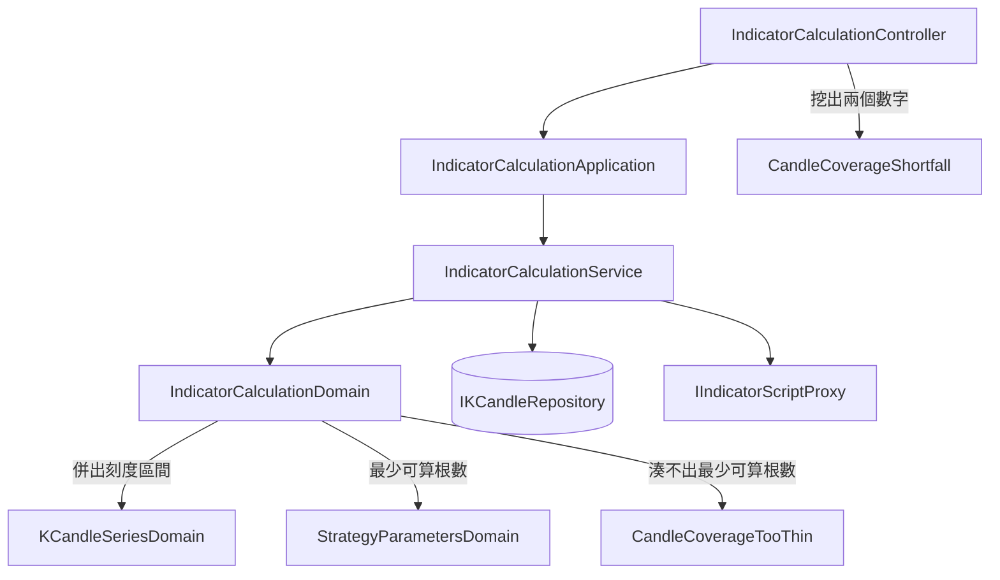

# 指標計算湊不滿也算得出來 — Architecture Design

**Status:** Confirmed
**Source PRD:** `.sdd/2026-09-08-partial-indicator-coverage/PRD.md`
**Tech context:** Go · Clean / Onion Architecture · 充血模型（Entity 乾淨，行為放 `models/domains/`）

---

## 1. Design Goal & Guiding Principle

- **In one sentence:**
  讓一次指標計算在**可用根數湊不滿計算根數**時，改以可用根數執行並如實回報兩個根數；
  只有低於**最少可算根數**時才拒絕，而那一種拒絕帶著兩個數字、且呼叫端辨認得出來。

- **Guiding principle:**
  **這條規則只在一個地方成立——`IndicatorCalculationDomain.SelectInputCandles`。**
  它是唯一同時看得見「這一次要幾根」（自己的欄位）與「實際來了幾根」（傳進來的參數）的地方，
  所以「取多少、少到什麼程度算不出來」整段判斷留在它體內，呼叫端一句話問完，不必自己比大小。
  服務層與控制器**一根都不數**：前者只轉述兩個數字，後者只把一種拒絕對映成呼叫端認得的形狀。

---

## 2. Change Scope

| Area | Action | What / Why |
| :--- | :--- | :--- |
| `internal/domain/models/domains/indicator_calculation_domain.go` | **Modify** | `SelectInputCandles` 由「湊不滿即拒絕」改為「取計算根數與可用根數的較小者」；新增最少可算根數與計算根數兩個問法 |
| `internal/domain/models/domains/indicator_calculation_errors.go` | **Add** | 新增「湊不出最少可算根數」這一種可辨識的拒絕，帶可用根數與最少可算根數兩個值 |
| `internal/domain/models/dto/indicator_calculation_result_dto.go` | **Modify** | 多回報**計算根數**（傳輸名稱 `requiredCandleCount`），與既有的實際採用根數並列。**刻意不叫 `candleCount`**——請求裡那個是「要為幾個位置拿到值」，同名會招來一個不存在的落差 |
| `internal/domain/service/indicator_calculation_service.go` | **Modify** | 把計算根數填進結果；其餘流程一字不動 |
| `internal/controller/indicator_calculation_controller.go` | **Modify** | 新增一條分流：把「湊不出最少可算根數」答成帶兩個數字的拒絕 |
| `internal/application/assistantqueries/indicator_calculation_assistant_query.go` | **Modify** | 只改敘述：它原樣轉交結果，所以新欄位自動到得了助手手上，但它對助手的說明與註解仍寫著「湊不滿會被拒絕」 |
| `postman/go-trading.postman_collection.json` | **Modify** | 回應多一個欄位，範例同步 |
| `SourceCandleLimit()` / `maxCandleCount` / `CandleCountExceeded` | **Not touched** | 「要太多」那條路是另一條界線（PRD US-05 明列為回歸守門）；動它會鬆掉一條原本擋得住的線 |
| `BacktestDomain`（含它自己的 `SelectInputCandles` 與最少根數） | **Not touched** | 回測有自己的門檻與自己的切片。它是**下一個**要這條規則的地方，見第 6 節 |
| `KCandleRepository` / `IndicatorScriptProxy` / `AggregationIntervalDomain` / `KCandleSeriesDomain` | **Not touched** | 讀多少、怎麼併、怎麼執行算式都不變——這次改的只有「來了之後取多少」 |

---

## 3. New Classes / Modules

| Name | Kind | Responsibility (purpose) | Collaborators | Satisfies (PRD scenario) |
| :--- | :--- | :--- | :--- | :--- |
| `ErrIndicatorCalculationCandleCoverageTooThin` | Sentinel error | 標記「可用根數低於最少可算根數」這一種拒絕，讓呼叫端**不必讀說明文字**就分得出來 | — | US-03 湊不出最少可算根數是一種認得出來的拒絕／與超過上限那一種分得開 |
| `CandleCoverageTooThin(availableCandleCount, minimumCandleCount)` | Error builder | 造出那一種拒絕，同時帶著給人讀的一句話與給程式取用的兩個數字 | 上列哨兵 | US-01 少一根／一根都湊不出來 |
| `CandleCoverageShortfall(err)` | Error reader | 從那一種拒絕裡把兩個數字挖出來，供控制器逐一交出去 | 上列 builder | US-03 取得兩個數字時不必解讀說明文字 |

> 這三者是**同一個概念的三面**（標記、建造、讀取），與 repo 既有的
> `ErrIndicatorParameterNotDeclared` / `UndeclaredParameter` / `UndeclaredParameterName` 完全同型，
> 因此不另立新模式。**刻意不新增 domain model**：見第 8 節「為什麼不抽一個覆蓋率模型」。

---

## 4. Modified Components

| Component | Current role | Change needed |
| :--- | :--- | :--- |
| `IndicatorCalculationDomain.SelectInputCandles` | 併出刻度區間，湊不滿即拒絕，否則取最後 `candleCount` 個 | 改為：可用根數低於**最少可算根數**（就地由最大回看根數推出）時回 `CandleCoverageTooThin`；否則取最後 **`min(candleCount, 可用根數)`** 個 |
| `IndicatorCalculationDomain` | 持有一次計算的請求與它的每一條規則 | 新增 `CandleCount()`（計算根數的問法，供服務層轉述）。最少可算根數**不另立方法**：只有一個呼叫者，所以它是 `SelectInputCandles` 體內一個具名的區域變數（`max(1, MaximumLookbackCount())`），名字與說明都留著，公開介面不變寬 |
| `IndicatorCalculationResultDto` | 一次計算離開 domain 的唯一形狀 | 新增 `RequiredCandleCount`（計算根數），與既有 `UsedCandleCount`（實際採用根數）並列 |
| `IndicatorCalculationService.CalculateIndicator` | 編排：驗請求 → 讀 K 線 → 選輸入 → 執行算式 → 組結果 | 組結果時多填 `RequiredCandleCount`。**選輸入那一步的呼叫方式不變**——規則在 domain 體內，服務層不知道它改了 |
| `IndicatorCalculationController.respondWithError` | 依「呼叫端要去改什麼」分流各種失敗 | 在既有「超過上限」那一條之後、通用驗證那一條**之前**，插入新的分流，帶 `availableCandleCount` 與 `minimumCandleCount` 兩個值 |

**分流順序是有意義的：** 新的那一條必須排在通用驗證那一條之前，否則它會被先攔下、答成一則沒有數字的籠統拒絕
（既有的「超過上限」正是為了同一個理由排在最前面）。

---

## 5. Component Relationships

---

## 6. Extensibility & Handoff Notes

- **Most likely next requirement:**
  **回測也要「湊不滿就跑手上有的」。** `BacktestDomain` 今天有一條同樣形狀的規則
  （它自己的最少根數，湊不滿即拒絕整次回測），而使用者一旦習慣圖表上畫得出短線，
  下一句就會是「為什麼回測不行」。

- **Where it lands:**
  `BacktestDomain.SelectInputCandles` —— 它與 `IndicatorCalculationDomain.SelectInputCandles`
  **同名、同形狀、同位置**（都是「拿到讀回來的 K 線，決定交給算式哪幾根」）。
  這次刻意把政策留在方法體內，就是為了讓那一天的改動落在對稱的位置上，而不是去改一個共用工具。

- **How to add it:**
  在 `BacktestDomain.SelectInputCandles` 內比照本次的三行判斷改寫，並沿用同一組錯誤三面
  （若回測的說法與指標不同，另造一組同型的，不要共用一句話）。
  **等到那時才抽共用模型**——見下一條。

- **抽共用模型的時機（明確的訊號）：**
  當第**二**個地方真的採用這條政策時，把「這一次要幾根／至少要幾根／實際來了幾根」
  三個數字連同判斷抽成一個 domain model（`models/domains/`、`Domain` 後綴、一檔一型別）。
  現在只有一個呼叫者，抽出來會是一個只被叫一次的間接層——
  正是 `.claude/rules/architecture.md` 的 inline 門檻要擋掉的東西。

- **Patterns applied & why:**
  只有一個：**錯誤三面**（哨兵 + builder + reader），因為呼叫端要**辨認種類**又要**取用數值**，
  而讀說明文字去辨認等於在比對寫給人看的散文。這個模式 repo 已經用過兩次，沿用而非發明。

- **Do not hardcode:**
  - **最少可算根數不得寫成常數。** 它是「最大回看根數」推出來的，一支策略一個值。
    寫死一個數字等於系統開始猜算法需要幾根——通用語地圖明文禁止。
  - **不得把「湊不出最少可算根數」與「超過上限」講成同一句話。** 兩者的出路正好相反。
  - 不得在服務層或控制器再數一次根數：那會讓同一條規則有兩個版本。

- **抽方法的門檻（本次實際套用過一次）：**
  最少可算根數一度是一個公開方法。它只有一個呼叫者，而這個 struct 上其他每一個公開方法都有外部呼叫者——
  那個不對稱就是訊號，於是它回到 `SelectInputCandles` 體內成為一個具名區域變數。
  它的三條規則（取最大、地板為一、只認宣告）改由**拒絕的結果**去驗，比問那個數字更貼近業務。

- **Known debt / deferred:**
  沒有為「畫不滿」留下任何紀錄或指標（不記 log、不計次）。個人專案規模，需要時再加。

---

## 7. Traceability

| PRD Scenario | Fulfilled by |
| :--- | :--- |
| US-01 可用根數湊得滿 | `SelectInputCandles`（`min` 取到計算根數，行為與今日相同） |
| US-01 可用根數湊不滿，以可用根數執行 | `SelectInputCandles` |
| US-01 可用根數剛好等於最少可算根數 | `SelectInputCandles`（邊界取「含」） |
| US-01 可用根數比最少可算根數少一根 | `SelectInputCandles` → `CandleCoverageTooThin` |
| US-01 沒有宣告回看根數時，一根就算得出來 | `SelectInputCandles` 內的 `max(1, …)` |
| US-01 一根都湊不出來 | `SelectInputCandles` → `CandleCoverageTooThin` |
| US-01 還在走的那一格照樣不算進可用根數 | `ReadCutoff()` + `KCandleSeriesDomain.Buckets()`（既有，不變） |
| US-02 湊得滿／湊不滿時兩個根數相同或不同 | `IndicatorCalculationResultDto.RequiredCandleCount` + `UsedCandleCount`，由 `IndicatorCalculationService` 填 |
| US-02 沒有回看根數時計算根數不多花 | `NewIndicatorCalculationDomain` 的 `max(0, lookback-1)`（既有，不變） |
| US-02 兩個根數與每一根的起始時間一起回報 | `IndicatorCalculationService` 組 `OpenTimes` 時與實際採用根數同源 |
| US-03 湊不出最少可算根數是認得出來的拒絕 | `ErrIndicatorCalculationCandleCoverageTooThin` + `CandleCoverageShortfall` + 控制器分流 |
| US-03 與超過上限那一種分得開 | 兩個各自獨立的哨兵；控制器兩條分流各答各的形狀 |
| US-03 算式本身跑不動仍是算式的問題 | `ErrIndicatorScriptFailed` 分流（既有，不變） |
| US-04 沒宣告卻在算式裡寫死期數 | `SelectInputCandles` 只讀宣告出來的參數；算式失敗由 `IIndicatorScriptProxy` 回報 |
| US-04 宣告與算式一致時最少可算根數就是對的 | `SelectInputCandles` |
| US-04 宣告了多個回看根數時取最大的那一個 | `StrategyParametersDomain.MaximumLookbackCount()`（既有，不變） |
| US-05 超過上限的三個情境 | `NewIndicatorCalculationDomain` 的上限檢查 + `CandleCountExceeded`（既有，一字不動） |

---

## 8. Risks & Open Decisions

### 一個必須寫下來的不變量：**湊不滿就代表讀取沒有觸底**

`SelectInputCandles` 今天取「最後 `candleCount` 個」刻度區間，理由寫在 `spareBucketCount` 的註解裡：
讀取有筆數上限，觸底時**最早**那一格可能只裝了後半段，而永遠取最新的那幾格就自然把它排除掉。

**這次改成「湊不滿時全部拿」，等於第一次把最早那一格納入答案**，所以必須確認它不會是半截的。它不會：

- 讀取上限 = （計算根數 + 1 格）能裝的原始 K 線數。
- 一個交易標的在一個一分鐘刻度上最多一根 K 線，所以那麼多根原始 K 線**至少**併出「計算根數 + 1」格。
- 因此**只要併出來的格數少於計算根數，讀取就一定沒有觸底**——資料是被讀完的，最早那一格是它真正的樣子。

**這個不變量靠讀取上限成立。** 動 `SourceCandleLimit()` 或那個 `spareBucketCount` 之前，先回來讀這一段。

### 已知限制：最舊那一格可能不滿（**經審查後刻意保留**）

湊不滿時交出去的那幾格**含最舊的那一格**，而在粗刻度下它常常不滿：
抓取是從一個純粹的牆上時刻回補的（`KCandleIngestionDomain.BackfillWindow` 用
`currentTime - lookback`），那個時刻不會落在刻度邊界上。所以一檔從 14:03 開始回補的標的，
在一天一格之下最舊那一格只併了十小時，卻以「一天」的身分交出去——開盤價是那個下午的，
成交量大約只有半天。短答案的第一個值可能就是從它算出來的，而 `usedCandleCount` 把它算成正常的一格。

**它被留下來，這是決定而不是疏漏。** 07:35 只有一根 K 線，可能是那小時市場只成交一次，
也可能是歷史只接到那小時的尾巴——這裡分不出來，而那正是這次計算在即時邊緣也不要求「一格必須滿」
的同一個理由（見 `IndicatorCalculationService.CalculateIndicator` 的註解）。
丟掉它的代價是**每一次粗刻度讀取都少一個值**（N 個值要 N+1 格歷史），
而且會讓清淡的標的拿不到它本來該有的值。

需要第一個值也站得住的呼叫端，請對一段確定完整存下來的區間發問。
**若日後決定改成丟掉最舊那一格**：它會動到 11 個既有測試函式（它們全都以「餵幾格就拿幾格」為前提），
並與即時邊緣那個相反的選擇衝突，需要一併重新裁決。

### Risks / trade-offs

- **湊不滿從「拒絕」變成「成功」，是一次行為變更。** 任何把拒絕當訊號的呼叫端會看到不同的結果。
  目前呼叫端只有兩處，兩處都是把它顯示成失敗——改成成功正是本次要的結果。
- **沒宣告回看根數卻寫死期數的策略**，會從「根數不足」變成「算式的問題」。刻意接受（PRD US-04）。
- 新增回報欄位是**只增不減**，既有呼叫端不看它也照樣運作。

### Open decisions (for implementation)

- 「湊不出最少可算根數」那句給人讀的說明的確切措辭——需與既有「超過上限」那句明顯不同，
  因為兩者的出路相反。實作時定案。
- 控制器交出兩個數字時的欄位名稱：沿用既有 `parameterName` 那種「值就是辨識依據」的做法，
  不另加一個種類字串。
