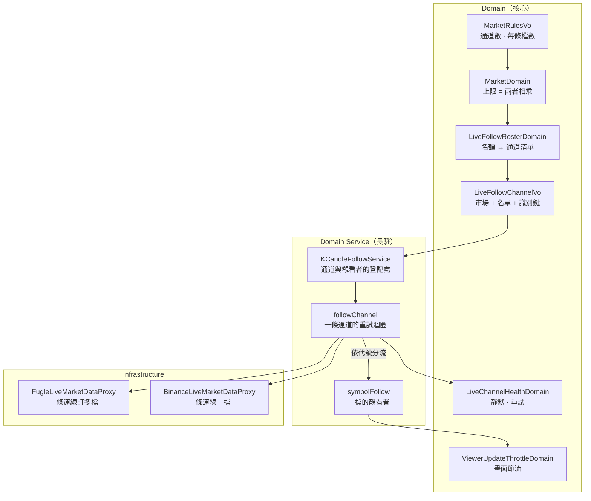

# 一條即時通道跟多檔 — Architecture Design

**Status:** Confirmed
**Source PRD:** `.sdd/2026-09-08-shared-live-follow-channel/PRD.md`
**Tech context:** Go · Clean / Onion Architecture · websocket 即時來源 · 長駐 domain service

---

## 1. Design Goal & Guiding Principle

- **In one sentence:**
  把即時跟盤的單位由「一檔一條通道」改為「一份名單一條通道」，並讓同時跟盤上限由方案的兩個真實數字推導出來。

- **Guiding principle:**
  **讓「名單改變就重建通道」由識別方式自然成立，而不是由比對程式碼成立。**

  一條通道由**它承載的整份名單**識別（市場＋排序後的交易標的集合）。於是：名單沒變 → 鍵不變 → 什麼都不做；名單變了 → 鍵變了 → 舊的不在新集合裡所以結束、新的不在既有集合裡所以啟動。PRD 的 R-10（名單改變重建、沒變不動）**沒有任何一行程式碼在實作它**——它是識別方式的後果。

  同一條規則也涵蓋加密貨幣：它一條通道跟一檔，鍵就是「市場＋那一檔」，走的是同一段程式。**沒有 `if market == taiwanStock`**，這是這個 codebase 一直在守的線。

---

## 2. Change Scope

| Area | Action | What / Why |
| :--- | :--- | :--- |
| `vo.MarketRulesVo` | **Modify** | `SimultaneousFollowCeiling` 換成 `SimultaneousChannelCeiling` 與 `SymbolsPerLiveChannel` 兩個數字——方案上寫的就是這兩個 |
| `domains.MarketDomain` | **Modify** | `SimultaneousFollowCeiling()` 改為**推導值**（兩者相乘）；新增 `SymbolsPerLiveChannel()`（零視為一，讓不限量市場維持零值寫法）。`HasFollowCeiling()` 語意不變 |
| `vo.LiveFollowChannelVo` | **Add** | 一條通道要跟的東西：市場＋排序後的交易標的集合，以及由兩者算出的識別鍵 |
| `domains.LiveFollowRosterDomain` | **Modify** | 除了「誰holds名額」之外，多回答「這些名額切成哪幾條通道」。同一個物件、同一個改變理由（市場的方案） |
| `domains.LiveChannelHealthDomain` | **Add** | 由 `KCandleFollowDomain` 拆出：一條通道的靜默判定與重試間隔 |
| `domains.ViewerUpdateThrottleDomain` | **Add** | 由 `KCandleFollowDomain` 拆出：一檔交易標的多久可以更新一次畫面 |
| `domains.KCandleFollowDomain` | **Remove** | 三條規則拆成上面兩個之後，它沒有剩下的東西。留著等於留一個各自只用一半欄位的物件 |
| `vo.FollowTargetVo` | **Modify** | 由「一檔」改為「一組」：`Symbols []string` + `Market` |
| `ILiveMarketDataProxy` | **Modify** | 契約不變形狀（仍是一次呼叫、一個 channel、關閉即結束），只是 target 現在是一組交易標的 |
| `marketdata.FugleLiveMarketDataProxy` | **Modify** | 握手時對每一檔各送一次訂閱；折疊器由一個變成**每檔一個**，依推送裡的代號分流 |
| `marketdata.BinanceLiveMarketDataProxy` | **Modify** | 跟它拿到的那一檔。拿到超過一檔時**明確拒絕**並說明原因——加密貨幣的規則設定為一條一檔，這條路走不到，但走到了要吵而不是安靜地少跟幾檔 |
| `service.followChannel` | **Add** | 一條通道的執行單位：它的重試迴圈、它承載哪幾檔、怎麼結束 |
| `service.KCandleFollowService` | **Modify** | goroutine 與重試迴圈由「每檔一個」移到「每條通道一個」；收到的每一根依代號分給對應的 `symbolFollow` |
| `service.symbolFollow` | **Modify** | 只剩觀看者登記與最新狀態（本來就幾乎只做這個）；不再擁有 `cancel`，通道才是被取消的東西 |
| `config.TaiwanStockConfig` | **Modify** | `SimultaneousFollowCeiling` 換成 `SimultaneousChannelCeiling`（預設 1）與 `SymbolsPerLiveChannel`（預設 5） |
| 觀看者收到的形狀（`dto.KCandleFollowUpdateDto`、狀態值） | **Not touched** | PRD §5：人看到的東西一個字都不變 |
| 跟盤名單的挑選規則（登錄最早、非交易時段為空） | **Not touched** | PRD §1 Out of Scope |
| 每分鐘一輪的自動抓取 | **Not touched** | 它本來就是即時不可用時的後盾，本次更依賴它，但它自己不必改 |
| `LiveFollowRosterDomain.HasLiveUpdates` | **Not touched** | 主控台問的還是同一個問題，答案的來源（推導後的上限）變了而已 |

---

## 3. New Classes / Modules

| Name | Kind | Responsibility (purpose) | Collaborators | Satisfies (PRD scenario) |
| :--- | :--- | :--- | :--- | :--- |
| `vo.LiveFollowChannelVo` | VO | 一條通道要跟哪些交易標的，以及**它的識別鍵**——市場加上排序後的代號集合。不可變、無行為 | — | US-05 全部（重建與不重建） |
| `domains.LiveChannelHealthDomain` | Domain Model | 一條通道隨時間的健康：多久沒收到就算死了、下一次重試等多久、什麼才算恢復 | — | US-04 全部 |
| `domains.ViewerUpdateThrottleDomain` | Domain Model | 一檔交易標的的畫面多久可以更新一次；走完的那一根一律放行 | — | US-03 happy path（節流不變） |
| `service.followChannel` | 執行單位（service 內部） | 一條通道的生命：它的重試迴圈、它承載哪幾檔、被要求結束時怎麼收尾 | `LiveChannelHealthDomain`、`ILiveMarketDataProxy`、`symbolFollow` | US-02、US-04 |

### 深度檢查

**`LiveFollowRosterDomain`（改後）**
- **介面夠簡單嗎？** 多一個 `Channels() []vo.LiveFollowChannelVo`。呼叫端不必先問「上限多少」再自己切。
- **複雜度藏在裡面嗎？** 名額分配與切通道都在裡面；外面看到的是「現在該跑哪幾條通道」。
- **兩個改變理由嗎？** 不是。名額怎麼給、怎麼切通道，都是「這個市場的方案」這一件事。

**`followChannel`**
- **名字有 And / Then 嗎？** 沒有。它是一條通道。
- **呼叫端要照順序呼叫多個方法嗎？** 不用：`start` 之後它自己跑到被 `end`。
- **參數會長大嗎？** 不會。多跟一檔是集合多一個元素，不是多一個參數。

**為什麼拆掉 `KCandleFollowDomain`**
它裝了三條規則，改動後其中兩條屬於通道、一條屬於交易標的。留著它，每個實例都會有一半欄位是死的——那正是「兩個改變理由」的樣子。拆成兩個之後，每個物件的每個欄位都被自己的方法用到。

---

## 4. Modified Components

| Component | Current role | Change needed |
| :--- | :--- | :--- |
| `vo.MarketRulesVo` | 交易時段 + 同時跟盤上限 | 上限換成兩個數字：`SimultaneousChannelCeiling`、`SymbolsPerLiveChannel`。**不再有可以直接填的「上限」** |
| `domains.MarketDomain` | 回答市場的行為 | `SimultaneousFollowCeiling()` 改為 `ChannelCeiling × SymbolsPerLiveChannel`；新增 `SymbolsPerLiveChannel()`，零視為一。零值市場（加密貨幣）因此仍是「不設上限、一條一檔」，一個字都不用改設定 |
| `domains.LiveFollowRosterDomain` | 誰holds名額 | 新增 `Channels()`：把每個限量市場的名額**依 `SymbolsPerLiveChannel` 切段**成通道；不限量市場的每一檔各自成一條。`Holds`、`MarketOf`、`HasLiveUpdates` 不變 |
| `vo.FollowTargetVo` | 一檔 + 市場 | 一組 + 市場。**排序**由建立處保證，讓識別鍵穩定 |
| `marketdata.FugleLiveMarketDataProxy` | 握手訂閱一檔、折疊一檔 | 逐檔送訂閱；`formingKCandle` 由單一個改為 `map[symbol]*fugleFormingKCandle`，依推送裡的代號取用。折疊演算法本身**一行都不動** |
| `marketdata.BinanceLiveMarketDataProxy` | 訂閱一檔 | 接受一組，跟它拿到的那一檔；超過一檔回明確錯誤（見 §8 取捨） |
| `service.KCandleFollowService` | 每檔一個 goroutine + 重試迴圈 | 改為每條通道一個。`run` 收 `*followChannel`；`consume` 收到候選後依 `liveKCandle.Symbol` 找到 `symbolFollow` 再交給它。找不到對應的檔就丟掉——那是我們沒訂的東西 |
| `service.symbolFollow` | 觀看者登記 + `cancel` | 拿掉 `cancel` 與 `isOnARoster`：誰被取消是通道的事，誰在名單上是 roster 的事 |
| `config.TaiwanStockConfig` / `marketRules` | 一個上限設定 | 兩個設定，直接對應方案說明上的兩個數字 |

---

## 5. Component Relationships

---

## 6. Extensibility & Handoff Notes

- **Most likely next requirement:**
  1. **升級方案，變成兩條通道。** 設定改成 2，名單自動切成兩段。
  2. **加密貨幣也想共用通道**（Binance 的 combined stream）。
  3. **不中斷通道就增減訂閱**（來源支援 `unsubscribe`）。

- **Where it lands:**
  - 兩條通道 → **只有設定值**。`LiveFollowRosterDomain.Channels()` 已經是「依每條檔數切段」，切成兩段跟切成一段走同一段程式。
  - 加密貨幣共用通道 → `BinanceLiveMarketDataProxy` 改用 combined stream，加上它自己的 wire 型別；**服務層與領域層一行都不用動**，因為契約已經是「一組」。
  - 不中斷增減訂閱 → 這是唯一會動到識別方式的方向：通道將不再由「它承載的名單」識別，而要帶著可變狀態。屆時 `LiveFollowChannelVo` 的鍵要改成市場本身，並在 `followChannel` 上多一個「調整訂閱」的行為。**本次刻意不預留**——預留一個可變狀態來服務一個還沒有的需求，正是現在這個 bug 的來源。

- **How to add it:**
  - 新增一個市場：`marketRules` 多一列（兩個數字），行情來源實作一個 `ILiveMarketDataProxy`。**沒有任何地方要 branch 市場名稱。**
  - 改方案：改兩個環境變數。上限自己會跟著變，且填不出方案不允許的組合。

- **Patterns applied & why:**
  - **以值識別（identity by value）**：通道的鍵就是它的內容。針對的軸線是「名單會變」，讓「變了要重建、沒變不要動」不需要任何比對程式碼。
  - **推導取代設定**：上限＝兩數相乘。針對的軸線是「方案會換」，讓不合法的組合無法被表達。
  - 沒有引入 Strategy／Factory。市場之間的差異已經是資料（`MarketRulesVo`），為它再開多型是替想像中的需求付現在的代價。

- **Do not hardcode:**
  - 服務層與領域層**不得出現任何市場名稱的分支**。加密貨幣與台股的差別必須全部落在 `MarketRulesVo` 的數字上。
  - 通道的識別鍵**不得**由呼叫端拼出來——由 `LiveFollowChannelVo` 自己給，否則兩處拼法一漂移就會出現「以為沒變其實變了」。

- **Known debt / deferred:**
  - **`BinanceLiveMarketDataProxy` 拿到多檔會拒絕。** 契約說「一組」，它只做得到一檔。**該重視的訊號**：任何人想把加密貨幣的每條通道檔數設成大於一時，該做的是實作 combined stream，不是調設定。
  - **通道重建期間有空窗。** 由每分鐘一輪的自動抓取補上。**該重視的訊號**：如果觀察清單開始頻繁變動，才值得做「不中斷增減訂閱」。

---

## 7. Traceability

| PRD Scenario | Fulfilled by |
| :--- | :--- |
| US-01 台股的上限是一條通道乘上每條五檔 | `MarketDomain.SimultaneousFollowCeiling()`（推導） |
| US-01 兩條通道各跟三檔的上限是六檔 | `MarketDomain.SimultaneousFollowCeiling()` |
| US-01 一條通道只跟一檔的上限是一檔 | `MarketDomain.SimultaneousFollowCeiling()` |
| US-01 不限通道數的市場不設上限 | `MarketDomain.SimultaneousFollowCeiling()`（通道數為零 → 不設上限）+ `HasFollowCeiling()` |
| US-02 四檔名單只開一條通道 | `LiveFollowRosterDomain.Channels()` + `KCandleFollowService.RefreshFixedFollows` |
| US-02 只有一檔時走的是同一條路 | `LiveFollowRosterDomain.Channels()` |
| US-02 名單為空時不開通道 | `LiveFollowRosterDomain.Channels()`（回空）+ `RefreshFixedFollows` |
| US-02 不限量的市場維持一檔一條 | `MarketDomain.SymbolsPerLiveChannel()`（零視為一）+ `LiveFollowRosterDomain.Channels()` |
| US-03 收到自己那一檔的進行中 K 線 | `KCandleFollowService.consume`（依 `liveKCandle.Symbol` 分流）+ `symbolFollow.publish` |
| US-03 收不到別人那一檔的資料 | `KCandleFollowService.consume` 的分流 |
| US-03 走完的那一根只算在自己頭上 | `KCandleFollowService.report` / `store`（以該根自己的代號建立） |
| US-04 一條通道斷掉，上面每一檔的觀看者都被告知 | `followChannel`（一條通道結束 → 對它承載的每一檔 `publishStalled`） |
| US-04 重新跟上時整份名單一起回來 | `followChannel` 的重試迴圈以 `LiveFollowChannelVo` 重新開啟 |
| US-04 連得上但不送資料，重試間隔照樣拉長 | `LiveChannelHealthDomain`（`MarkConnected` 不重設間隔） |
| US-04 真的收到資料才算恢復 | `LiveChannelHealthDomain.MarkReceived` |
| US-05 加入一檔會重建通道 | `LiveFollowChannelVo` 的識別鍵改變 → `RefreshFixedFollows` 結束舊的、啟動新的 |
| US-05 移除一檔會重建通道 | 同上 |
| US-05 名單沒變就不動通道 | 同上（鍵不變 → 兩邊都不觸發） |
| US-05 名單變成空的就不再開通道 | `LiveFollowRosterDomain.Channels()` 回空 |
| US-05 重建期間走完的那一根不會永久少掉 | `KCandleIngestionJob` 每分鐘一輪（既有，不動） |

---

## 8. Risks & Open Decisions

### Risks / trade-offs

| 風險 / 取捨 | 為什麼可以接受 |
| :--- | :--- |
| **拆掉 `KCandleFollowDomain`，動到一個測試很完整的領域物件** | 它的三條規則改動後分屬兩個不同的東西；不拆就是留一個每個實例都有一半欄位是死的物件。既有測試依規則歸屬拆到兩個新檔，斷言內容不變 |
| **一條通道承載整份名單，斷一條影響四檔** | 這是方案的形狀不是選擇；而且改動前的實際狀態是四條互相踢到全都不能用，比集中在一條更糟 |
| **名單一變就整條重建，名單上其他檔跟著中斷** | 名單只在觀察清單被改動時變；空窗由每分鐘一輪補上，且觀看者被明確告知。要免掉它得讓通道帶可變狀態，代價見 §6 |
| **`BinanceLiveMarketDataProxy` 實作不滿足契約的全部** | 它拒絕得很大聲而不是安靜地少跟。加密貨幣的規則設定為一條一檔，這條路在正常設定下走不到 |
| **`FollowTargetVo` 由一檔變一組，是破壞性的介面變更** | 只有兩個實作與一個呼叫端，全在本 repo 內；且不改它就得讓服務層知道「這個市場要一次給幾檔」，那正是要消滅的分支 |

### Open decisions (for implementation)

- **通道識別鍵的拼法**：建議 `string(market) + "|" + strings.Join(sortedSymbols, ",")`。排序在 `LiveFollowChannelVo` 建立時做一次，之後不再排。
- **`ILiveMarketDataProxy` 的 mock**：契約改變後需重新產生（`make mock`）。
- **既有 `TAIWAN_STOCK_SIMULTANEOUS_FOLLOW_CEILING`**：直接淘汰，不做相容轉換。README 的環境變數表要同步換掉，並說明它為何變成兩個。
