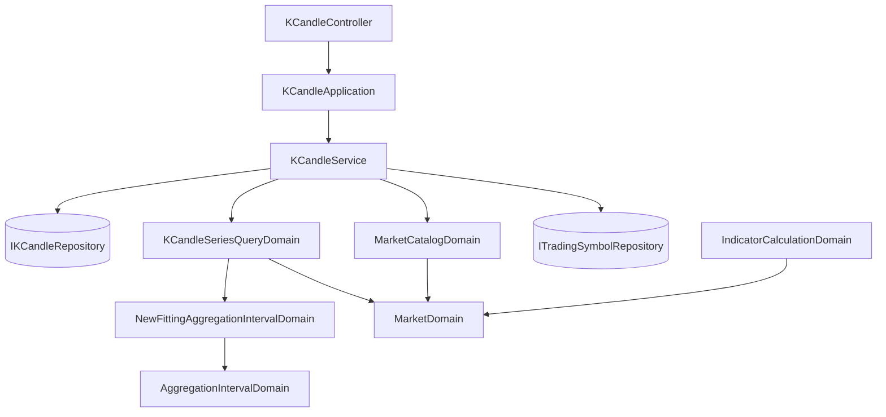

# 每根多長由市場的作息決定 — Architecture Design

**Status:** Confirmed
**Source PRD:** `.sdd/2026-09-09-series-interval-chosen-by-market/PRD.md`
**Tech context:** Go · Clean/Onion Architecture · `domain/models/{entities,domains,dto,vo}` + `service` + `interface`

---

## 1. Design Goal & Guiding Principle

- **In one sentence:** 讓取彙總 K 線序列這條路收下「我最多擺得下幾根」，並用**市場自己的作息**挑出最細的、擺得下的那一種刻度。

- **Guiding principle:** **「一段裡有幾根」只能有一個答案。**
  上一個切片已經讓指標計算問這個問題（`TradingTimeWithin` + `SlotCount`）。這次不是再寫一次，
  而是讓序列查詢問**同一個**問題——包括那條既有的「一次要太多」的判斷，也一併改用同一種數法。
  兩種數法並存才是真正的風險：同一段時間，圖上說 390 根、上限判斷說 1440 根，
  於是台股的一分鐘圖會被系統自己擋掉，而沒有人看得出擋它的是哪一條規則。

---

## 2. Change Scope

| Area | Action | What / Why |
| :--- | :--- | :--- |
| `domain/models/domains/aggregation_interval_domain.go` | **Modify** | 新增建構子 `NewFittingAggregationIntervalDomain(tradingTime, displayableCandleCount)`：從最細往粗走，取第一個擺得下的；都擺不下取最粗。與既有的 `NewCoarsestAggregationIntervalDomain()` 同一種寫法 |
| `domain/models/domains/market_domain.go` | **Modify** | `TradingTimeWithin(window)` 改為 `TradingTimeBetween(startTime, endTime)`：序列查詢的區間**允許起訖相等**，包不進觀察區間（它刻意拒絕零長度），所以兩個呼叫端共用的是那兩個時刻，不是那個型別 |
| `domain/models/domains/indicator_calculation_domain.go` | **Modify** | 改呼叫 `TradingTimeBetween(window.StartTime(), window.EndTime())`。行為不變 |
| `domain/models/domains/k_candle_series_query_domain.go` | **Modify** | 建構子收 `MarketDomain` 與可顯示根數：驗互斥、驗大於零、挑刻度、**改用交易時段數根數**、讀取上限多留一格 |
| `domain/models/dto/k_candle_series_query_dto.go` | **Modify** | 新增 `DisplayableCandleCount`（零＝沒說） |
| `domain/service/k_candle_service.go` | **Modify** | 注入 `ITradingSymbolRepository` 與 `MarketCatalogDomain`，把代號解析成市場後交給查詢（與 `IndicatorCalculationService` 同一個既有寫法） |
| `controller/k_candle_controller.go` | **Modify** | 讀 `displayableCandleCount` 這個查詢參數 |
| `cmd/server/dependencies.go` | **Modify** | 補上服務新增的兩個依賴 |
| `postman/` | **Modify** | 新增「由系統挑刻度」與兩種問法互斥的請求 |
| **指標計算那條路** | **Not touched** | 只跟著改一行呼叫；它的規則一個字不動 |
| **回測／即時跟盤／自動抓取** | **Not touched** | 都不經過序列查詢 |
| **彙總的算法、六種刻度、單次上限的設定值** | **Not touched** | 只改「怎麼數根數」，不改「怎麼合併」與「上限是多少」 |
| **新的哨兵錯誤** | **Not added** | PRD 沒有任何條款要求呼叫端分辨這兩種新拒絕；沿用既有的查詢驗證錯誤（控制器已對映 400） |

---

## 3. New Classes / Modules

| Name | Kind | Responsibility (purpose) | Collaborators | Satisfies (PRD scenario) |
| :--- | :--- | :--- | :--- | :--- |
| `NewFittingAggregationIntervalDomain` | 建構子（`AggregationIntervalDomain` 的第三種生法） | 這麼多交易時間、這麼多位置，**哪一種刻度最細又擺得下**。走訪順序與「都擺不下取最粗」的退路藏在裡面 | — | US-01 全部七個 Scenario |

> 一個新東西都不用開類別——挑刻度是「刻度」這個概念的第三種生法（既有兩種：依宣告、取最粗），
> 而它只需要一段時間與一個數字。給它一個市場或一個查詢，就是把不相干的東西拉進來。

---

## 4. Modified Components

| Component | Current role | Change needed |
| :--- | :--- | :--- |
| `AggregationIntervalDomain` | 一種彙總刻度與它的性質 | 多一個建構子。**它不認識市場**：交易時間由呼叫端算好交給它，因為「這一段開多久」是市場的事，「這麼久裝得下幾個我」才是刻度的事 |
| `MarketDomain` | 一個市場的一切行為 | `TradingTimeWithin(window)` → `TradingTimeBetween(startTime, endTime)`。理由是第二個呼叫端：序列查詢的區間允許零長度（起訖相等合法），而觀察區間刻意拒絕它。共用兩個時刻，就不必為了型別去放寬另一邊的規則 |
| `KCandleSeriesQueryDomain` | 一次彙總查詢的不變量：區間規則、刻度、切出幾根、讀取上限 | 建構子改收 `MarketDomain` 與可顯示根數，並依序：**兩種問法都給即拒絕** → **可顯示根數不大於零即拒絕** → 有可顯示根數就以 `min(它, 單次上限)` 挑刻度，否則照宣告讀刻度 → **以交易時段數根數**（取代既有的 `interval.BucketCount`）→ 超過單次上限即拒絕（照舊）。`SourceCandleLimit` **多留一格** |
| `KCandleService.GetKCandleSeries` | 應用層入口：組裝查詢、讀 K 線、合併 | 多兩個依賴，把代號解析成市場。沒登錄的代號落到永不收盤的市場（既有規則），與改動前行為一致 |
| `KCandleSeriesQueryDto` | 應用層交給 domain 的查詢形狀 | 多一個可顯示根數，以**指標**表示：沒給就是沒說，給了零就是說了零（而零要被拒絕）。見下方 Open Decisions |
| `KCandleController.GetKCandleSeries` | HTTP 轉換 | 多讀一個查詢參數；讀不成整數即以既有方式回 400 |

### 為什麼「一次要太多」的判斷也要改數法

既有的 `bucketCount` 是 `interval.BucketCount(start, end)`——**牆上時間**橫跨幾個刻度區間。
台股看 24 小時、一分鐘刻度時它是 1440，超過單次上限 1000，於是**系統會拒絕自己剛挑出來的那一種刻度**。
兩種數法並存，這個功能就從第一天起是壞的。

因此這一路的「幾根」統一改為**市場實際交易的那些時間切出幾根**。後果要說清楚：

- 台股明確指定一分鐘看 24 小時，**從拒絕變成答得出來**（390 根）。這與 PRD 的「照原樣拒絕」不衝突：
  該條款講的是「切出來的根數超過上限就拒絕」，而超過與否本來就該照實際會有幾根算。
- 加密貨幣一分鐘看 24 小時**仍然被拒絕**（1440 > 1000）。要有一個測試釘住這一點。

### 為什麼讀取上限要多留一格

`FindInRange` 是**由早到晚**取前 N 根。上限估得剛好會切掉**最新的**那幾根——圖表最不能少的那一端。
區間兩端不會落在刻度邊界上（例如 09:03 開始），那一段實際持有的 K 線可能比
「根數 × 每根幾根」多出不到一格。多留一格即可覆蓋，這與指標計算那條路的既有做法同一個理由。

---

## 5. Component Relationships

一句話：**服務把代號換成市場 → 查詢問市場「這段時間你交易多久」→ 交給刻度「這麼久、我擺得下這麼多，哪一種最細」→ 其餘照舊。**

---

## 6. Extensibility & Handoff Notes

- **Most likely next requirement:** (a) 回測也改成照交易時段數根數；(b) 一個市場一天兩段交易時段；(c) 第七種彙總刻度。

- **Where it lands:**
  - (a) `MarketDomain.TradingTimeBetween` 已經是通用問法，回測直接拿去用。
  - (b) 仍然只落在 `MarketDomain` 那一份共用的逐日走訪（上一個切片已經合成一份）。
  - (c) 只要加進刻度清單，挑刻度的走訪自動認得——它讀的是清單，不是寫死的六個分支。

- **How to add it:** 新的刻度加進清單；新的市場作息加進設定。**不得**在服務或查詢裡出現任何 `if market == ...`。

- **Patterns applied & why:**
  - **第三個建構子而不是新類別**：挑刻度的產物就是一個刻度，讓它成為刻度的一種生法，呼叫端就不必先挑再轉。
  - **互斥的兩種問法在建構當下定案**：實例存在即代表「用哪一種刻度」已經有答案，下游不必再問是誰決定的。

- **Do not hardcode:** 「一段時間除以刻度長度等於幾根」這條牆上時間的算式，在這條路上**不得再出現**——它正是這次要消滅的第三處。

- **Known debt / deferred:**
  - 挑刻度最多走六次，每次都問一次交易時間（同一段、同一個答案）。目前照走，因為六次的成本是六趟逐日走訪、與區間天數同階；若哪天覺得吵，改成問一次再重用即可，不影響介面。
  - 休市日仍不預先扣除，所以挑出來的刻度偶爾會比實際需要的細一點（畫出來的根數少於預估）。那是既有決定。

---

## 7. Traceability

| PRD Scenario | Fulfilled by |
| :--- | :--- |
| US-01 台股一整天挑到一分鐘／加密貨幣挑到五分鐘 | `MarketDomain.TradingTimeBetween` + `NewFittingAggregationIntervalDomain` |
| US-01 剛好擺得下／多一根就擺不下／五個交易日 | `NewFittingAggregationIntervalDomain`（走訪與比較） |
| US-01 連最粗的都擺不下／只擺得下一根 | 同上（取最粗的退路） |
| US-02 指定了刻度就照指定的／兩種都不說視為一分鐘／不存在的刻度照原樣拒絕 | `KCandleSeriesQueryDomain`（既有的宣告讀取路徑，不改） |
| US-02 兩種都給就拒絕 | `KCandleSeriesQueryDomain`（互斥檢查） |
| US-03 說得比系統願意答的多 | `KCandleSeriesQueryDomain`（`min(可顯示根數, 單次上限)`） |
| US-03 自己指定的切太多根仍拒絕 | `KCandleSeriesQueryDomain`（既有上限檢查，數法改為交易時段） |
| US-03 擺得下的根數不大於零 | `KCandleSeriesQueryDomain`（大於零檢查） |
| US-04 週六／收盤後回空序列，不是拒絕 | `KCandleSeriesQueryDomain`（沒有任何拒絕分支會被觸發）＋既有讀取路徑回空 |
| US-04 加密貨幣的週六照常有 K 線 | `MarketDomain.TradingTimeBetween` 的永不收盤分支 |
| US-05 與指標計算是同一個答案 | 兩條路共用 `TradingTimeBetween` 與 `SlotCount` |
| US-05 涵蓋國定假日不預先扣除 | `MarketDomain`（只讀星期與時段，不查名單） |

---

## 8. Risks & Open Decisions

- **Risks / trade-offs:**
  - **「一次要太多」的數法改變**是這次唯一會影響既有呼叫端的地方：台股的細刻度大區間從被拒絕變成答得出來。
    這是同一個 bug 的第三處，修它才是一致的；但它是行為改變，必須有測試同時釘住
    「台股 24 小時一分鐘可以」與「加密貨幣 24 小時一分鐘仍然拒絕」。
  - **讀取上限多留一格**是為了不切掉最新的那幾根。少了它，圖的右緣會無聲地短一截——最難發現的一種錯。
  - `TradingTimeWithin` 改名換簽章會動到指標計算那一行；行為不變，測試會證明。

- **Open decisions (for implementation):**
  - 可顯示根數的查詢參數名稱：沿用通用語地圖的說法，實作時定為 `displayableCandleCount`。
  - **「沒說」與「說了零」必須分得開**，所以這一個欄位是指標而不是零值。
    既有的截止時間用零值表示「沒說」，理由寫在它自己的註解裡：零不是任何人可能指的那一刻。
    這裡相反——**零是一個有人真的說得出口的數字**（PRD 要求拒絕它），
    零值一旦被當成「沒說」，那條拒絕就永遠不會發生。同一條理由，這次指向指標。
