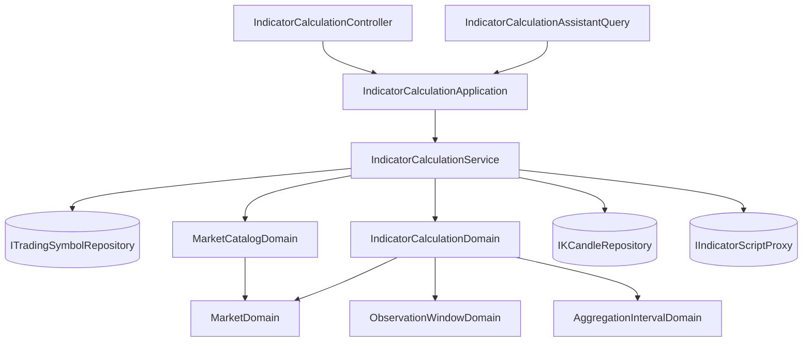

# 會收盤的市場，一段時間裡有幾格 — Architecture Design

**Status:** Confirmed
**Source PRD:** `.sdd/2026-09-09-session-aware-calculation-span/PRD.md`
**Tech context:** Go · Clean/Onion Architecture · domain 內 `models/{entities,domains,dto,vo}` + `service` + `interface`

---

## 1. Design Goal & Guiding Principle

- **In one sentence:** 讓一次指標計算收下的是一段**觀察區間**而不是一個格數，並由「市場自己知道它什麼時候在交易」這件既有能力算出那段區間裡有幾格。

- **Guiding principle:** **把「一段時間裡有多少時間真的在交易」放回 `MarketDomain`，不要讓它外洩成呼叫端的算術。**
  這個系統已經有一條明文原則：`if market == taiwanStock` 不准出現在 `MarketDomain` 以外的地方。
  營業時間、假日、時區、日光節約全部藏在它裡面，外面只問一句話、拿一個答案。
  這次要加的規則正是同一種知識，所以它應該是 `MarketDomain` 多一個問句，而不是任何地方多一個分支。
  下一個市場（有午盤與盤後兩段的交易所、不同時區的交易所）因此是 `MarketRulesVo` 多一筆設定，不是又一處要改的算術。

---

## 2. Change Scope

| Area | Action | What / Why |
| :--- | :--- | :--- |
| `domain/models/domains/market_domain.go` | **Modify** | 新增 `TradingTimeWithin`：一段時間裡這個市場實際會成交多久。與既有的 `ClampToTradingSession` 共用同一套「逐日走訪」的私有邏輯，避免兩份營業日規則各自演化 |
| `domain/models/domains/aggregation_interval_domain.go` | **Modify** | 新增 `SlotCount`：一段長度裝得下幾格（向下取整、最少一格）。刻度自己知道自己多長，這是它的問題 |
| `domain/models/domains/observation_window_domain.go` | **Add** | 觀察區間：把宣告的起訖收斂成一組已定案的時刻（終點未給／指向未來即現在；起點晚於終點即拒絕） |
| `domain/models/domains/indicator_calculation_domain.go` | **Modify** | 建構子改收觀察區間與 `MarketDomain`，內部算出要看幾格再推導計算根數；區間內完全沒有交易時間即拒絕 |
| `domain/models/domains/indicator_calculation_errors.go` | **Modify** | 新增一種可辨識的拒絕：觀察區間內沒有交易 |
| `domain/models/dto/indicator_calculation_request_dto.go` | **Modify** | `CandleCount` 移除，改為 `StartTime`（`EndTime` 沿用，成為觀察區間的終點） |
| `domain/service/indicator_calculation_service.go` | **Modify** | 注入 `ITradingSymbolRepository` 與 `MarketCatalogDomain`，把交易標的解析成市場後交給計算 |
| `controller/models/indicator_calculation_request.go` | **Modify** | 請求主體 `candleCount` → `startTime` |
| `application/assistantqueries/indicator_calculation_assistant_query.go` | **Modify** | 工具參數與說明同步改為觀察區間 |
| `cmd/server/dependencies.go` | **Modify** | 補上服務新增的兩個依賴 |
| **回測**（`backtest_*`） | **Not touched** | PRD 明列不在範圍；它有自己的區間與根數規則，這次不動 |
| **自動抓取／即時跟盤** | **Not touched** | 它們早就照交易時段辦事（`ClampToTradingSession`），這次的缺口不在那裡 |
| **彙總、儲存、讀取上限** | **Not touched** | 桶怎麼切、讀幾根原始 K 線都不變；改的只是「要幾個桶」這個數字 |
| **`ITradingSymbolRepository` 介面** | **Not touched** | `FindBySymbol` 已經存在且語意正好（沒登錄不是錯誤，是一種答案） |

---

## 3. New Classes / Modules

| Name | Kind | Responsibility (purpose) | Collaborators | Satisfies (PRD scenario) |
| :--- | :--- | :--- | :--- | :--- |
| `ObservationWindowDomain` | Domain Model | 一次計算**要為哪一段行情拿到值**：把宣告的起訖收斂成已定案的兩個時刻，並保證起點不晚於終點。定案之後，下游不必再問「終點是不是未來」 | — | US-06 全部三個 Scenario |
| `ErrObservationWindowHoldsNoTrading` + `ObservationWindowHoldsNoTrading(...)` | Sentinel error + 建構函式 | 「這一段時間市場沒有交易」這一種拒絕，讓呼叫端**認得出來**且不必解讀說明文字 | — | US-04 前兩個 Scenario |

> 只有兩個新東西。其餘全部是既有物件多回答一個問句——那正是這次要的：知識沒有搬家，只是被問到了。

---

## 4. Modified Components

| Component | Current role | Change needed |
| :--- | :--- | :--- |
| `MarketDomain` | 一個市場的一切行為：現在開不開、一段時間裡哪一段可能有 K 線、跟盤上限、它自己的日曆 | 新增 `TradingTimeWithin(observationWindow) time.Duration`——這段時間裡它實際會成交多久。永不收盤的市場直接回整段長度。實作與 `overlappingCandleOpenTimes` 共用一個私有的逐日走訪（走的是區間橫跨的天數，不是逐格掃描，滿足 PRD 的效能要求） |
| `AggregationIntervalDomain` | 一種彙總刻度與它的性質（桶起點、桶數、一桶幾根原始 K 線） | 新增 `SlotCount(tradingTime time.Duration) int`：向下取整、最少一格。與既有 `BucketCount`（兩端各自所屬的桶、含頭含尾）**是不同的問題**，不可互相取代——一個問「這段長度裝得下幾格」，一個問「這兩個時刻落在幾個桶裡」 |
| `IndicatorCalculationDomain` | 一次計算的不變量，以及「算式看得到哪些 K 線」的全部規則 | 建構子簽章改為收 `ObservationWindowDomain` 與 `MarketDomain`；內部依序：問市場要交易時間 → 問刻度要格數 → 交易時間為零即回 `ObservationWindowHoldsNoTrading` → 以格數推導 `candleCount = 格數 + max(0, 最大回看根數 − 1)` → 既有的上限檢查照舊。`endTime` 改為由觀察區間交出，`effectiveEndTime` 的職責移入觀察區間 |
| `IndicatorCalculationService` | 應用層唯一入口：組裝計算、讀 K 線、跑算式 | 多兩個依賴（`ITradingSymbolRepository`、`MarketCatalogDomain`），照 `KCandleFollowService` 既有寫法把代號解析成市場。**沒登錄不是錯誤**：交出零值登錄，`MarketOf("")` 依既有規則落到永不收盤的市場，與改動前的行為一致 |
| `IndicatorCalculationRequestDto` | 應用層交給 domain 的請求形狀 | `CandleCount int` → `StartTime time.Time`；`EndTime` 語意不變但正式成為觀察區間的終點 |
| `IndicatorCalculationRequest`（controller） | HTTP 請求主體 | `candleCount` → `startTime`（RFC3339）。這是唯一的破壞性對外改動 |
| `IndicatorCalculationAssistantQuery` | 對話助手的計算工具 | 參數 `candleCount` → `startTime`；說明改述為「要看哪一段」，並說明會收盤的市場只數有交易的時間 |

---

## 5. Component Relationships

流程一句話：**服務把代號換成市場 → 計算問市場「這段時間你交易多久」→ 問刻度「這段交易時間幾格」→ 格數加回看推出計算根數 → 其餘一切照舊。**

---

## 6. Extensibility & Handoff Notes

- **Most likely next requirement:** 兩件事之一——(a) **回測也要照交易時段算區間**；(b) **一個市場一天有兩段交易時段**（午盤／盤後，或其他交易所的早晚盤）。

- **Where it lands:**
  - (a) 落在 `ObservationWindowDomain` 與 `MarketDomain.TradingTimeWithin`。兩者都不認識指標計算，回測直接拿去用即可，不必複製規則。
  - (b) 落在 `MarketRulesVo.TradingSession` 與 `MarketDomain` 內那一份**共用的逐日走訪**。這正是要把 `TradingTimeWithin` 與 `ClampToTradingSession` 的走訪合而為一的理由：一天從一段變成兩段時，只有那一個地方要改，抓取、跟盤、指標計算三條路一起跟著對。

- **How to add it:** 加一個市場、或改一個市場的作息，一律是 `cmd/server/config.go` 多讀幾個值、`MarketRulesVo` 多帶一個欄位；**不得**在任何服務裡新增 `if market == ...`。

- **Patterns applied & why:**
  - **Information hiding（深模組）**：`TradingTimeWithin` 是一個問句、一個答案；週末、時區、跨日、時段邊界全部藏在裡面。呼叫端沒有機會把它拆成幾步做錯。
  - **Value settled at construction**：觀察區間在建構當下就定案，下游不再重複判斷「終點是不是未來」——這個系統已經對 `KCandleIngestionDomain`、`AggregationIntervalDomain` 用同一手法。

- **Do not hardcode:** 交易時段（時區、起訖、哪幾天）一律讀設定；「一天 1440 分鐘」這個假設不得再出現在任何地方——它正是這次要消滅的東西。

- **Known debt / deferred:**
  - **休市日仍不預先扣除**（系統不維護假日名單，既有決定）。落差由計算根數與實際採用根數並列回報。哪天發現使用者常被這個落差困惑，訊號就是「有人開始自己維護一份假日清單」，那時再談。
  - **觀察區間的兩端不對齊刻度**：只計入重疊的時間、向下取整，與既有「這一段裡有幾根」的算法一致，刻意不補齊到整格。
  - **回看仍不受觀察區間限制**：這是設計，不是遺漏；回看本來就該往更早的行情看。

---

## 7. Traceability

| PRD Scenario | Fulfilled by |
| :--- | :--- |
| US-01 台股看一個完整交易日 / 看整整二十四小時 / 完全落在交易時段內 | `MarketDomain.TradingTimeWithin` + `AggregationIntervalDomain.SlotCount` |
| US-01 跨過一次收盤 / 跨過週末 | `MarketDomain.TradingTimeWithin`（逐日走訪，非交易日不計） |
| US-01 觀察區間短到不滿一格 | `AggregationIntervalDomain.SlotCount`（最少一格） |
| US-02 加密貨幣三個 Scenario | `MarketDomain.TradingTimeWithin` 的永不收盤分支（整段照收） |
| US-03 回看往前補足 / 只看一小時 / 沒宣告回看 / 更早的行情不存在 | `IndicatorCalculationDomain`（計算根數推導、讀取上限）＋既有 `SelectInputCandles` |
| US-04 完全落在收盤後 / 整個週六 | `IndicatorCalculationDomain` + `ObservationWindowHoldsNoTrading` |
| US-04 行情不夠仍是既有拒絕 / 超過上限仍是既有拒絕 | 既有 `CandleCoverageTooThin`、`CandleCountExceeded`（不改） |
| US-05 涵蓋國定假日 / 全部正常交易 | 既有的計算根數與實際採用根數並列回報（不改） |
| US-06 終點未指定 / 終點指向未來 / 起點晚於終點 | `ObservationWindowDomain` |

---

## 8. Risks & Open Decisions

- **Risks / trade-offs:**
  - **對外請求形狀改變**（`candleCount` → `startTime`）是這次唯一的破壞性改動，畫面與 Postman 集合必須同步。這個成本是無法迴避的：格數本身就是那個算錯的數字，留著它就沒有東西可修。
  - `MarketDomain` 又多一個公開問句。可接受：它的既定職責就是「這個市場怎麼運作」的唯一出口，而這正是同一類知識；把它放到別處才會製造第二份營業日規則。
  - 交易時間為零改為**拒絕**而非回傳空結果：對呼叫端來說是新的一種失敗。以可辨識的哨兵錯誤交付，讓呼叫端給得出對的出路。

- **Open decisions (for implementation):**
  - `TradingTimeWithin` 與 `ClampToTradingSession` 共用的私有走訪要抽成什麼形狀，由實作時決定；準則是**營業日規則只能有一份**。
  - 觀察區間起點未給（零值）時的處置：實作採「拒絕並說明必須指定要看哪一段」——沒有一個合理的預設長度，猜一個只會讓呼叫端不知道自己看的是多久。
