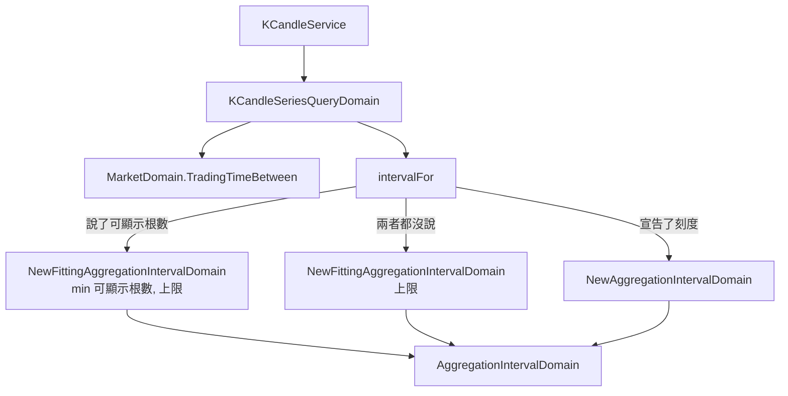

# 沒說要多粗就由系統挑 — Architecture Design

**Status:** Confirmed
**Source PRD:** `.sdd/2026-09-09-system-chosen-series-coarseness/PRD.md`
**Tech context:** Go · Clean/Onion · `domain/models/{entities,domains,dto,vo}` + `service` + `interface`

---

## 1. Design Goal & Guiding Principle

- **In one sentence:** 讓「兩種都不說」走上既有那條挑刻度的路，擺得下的根數改以單次查詢筆數上限為準。

- **Guiding principle:** **這次不長任何新東西。**
  挑刻度、按交易時間數格、都裝不下取最粗——三件事上一個切片全都做好了，
  而且已經有一個現成的參數表達「擺得下幾根」。這次要做的只是把 `nil` 這個情況
  從「退回宣告的刻度」改接到「以上限為擺得下的根數去挑」。
  凡是需要新增一個型別、一個介面或一個分支才做得到的方案，都是做過頭。

---

## 2. Change Scope

| Area | Action | What / Why |
| :--- | :--- | :--- |
| `domain/models/domains/k_candle_series_query_domain.go` 的 `intervalFor` | **Modify** | 唯一的實質改動。`DisplayableCandleCount == nil` 時原本一律讀宣告的刻度；改成**只有宣告了刻度才讀它**，兩者都沒有就以 `maxBucketCount` 當擺得下的根數去挑 |
| `.sdd/UL-MAP.md` | **Modified**（已完成） | 「未指定時視為一分鐘」不再為真 |
| `postman/` | **Modify** | 新增「什麼都不說的一週」與「什麼都不說的一年不被拒絕」兩個請求 |
| **`AggregationIntervalDomain`** | **Not touched** | `NewFittingAggregationIntervalDomain` 已是這次要用的東西，一字不改 |
| **`MarketDomain`** | **Not touched** | `TradingTimeBetween` 已是這次要用的數法 |
| **`KCandleSeriesQueryDto`** | **Not touched** | 不新增欄位。「兩種都不說」本來就表達得出來（`Interval` 空字串 ＋ `DisplayableCandleCount` 為 `nil`） |
| **`KCandleService` / `KCandleApplication` / `KCandleController`** | **Not touched** | 一行都不必動——它們早就把兩個欄位原樣往下傳 |
| **指標計算／回測／即時跟盤／自動抓取** | **Not touched** | 都不經過這條路 |
| **新的哨兵錯誤** | **Not added** | 這次只**減少**一種拒絕，沒有新增任何一種 |

> **這是一個只改一個函式的切片。** 之所以還是走完整條流程，是因為它**改變既有行為**
> （長區間從被拒絕變成答得出來），而那需要規格與測試說清楚，不是因為它複雜。

---

## 3. New Classes / Modules

**無。** 一個新型別、新介面、新方法都不需要。

---

## 4. Modified Components

| Component | Current role | Change needed |
| :--- | :--- | :--- |
| `intervalFor`（`k_candle_series_query_domain.go`） | 從呼叫端用的那一種說法settle出刻度，並拒絕同時用兩種 | 三個分支改成四個：①宣告了刻度且說了可顯示根數 → 拒絕（不變）②只宣告了刻度 → 讀它（不變）③只說了可顯示根數 → 以 `min(它, 上限)` 挑（不變）④**兩者都沒有 → 以 `上限` 挑**（新） |

### 為什麼「兩者都沒有」不是「可顯示根數等於上限」的同義詞

實作上兩者算出同一個刻度，但**它們不是同一件事**，所以不共用同一個分支的措辭：

- 說了可顯示根數 = 「**我的畫面**只擺得下這麼多」——一個關於呼叫端的事實。
- 兩者都沒說 = 「**我不打算對粗細有意見**」——一個關於呼叫端沒有意見的事實。

差別會在有一天上限與畫面預算脫鉤時顯現（例如上限調到 5000）。
那時「什麼都不說」應該跟著上限走（它要的是「答得出來就好」），
而說了 400 的呼叫端不該因此拿到 5000 根。把兩者寫成同一個分支，
那次調整會安靜地改掉其中一個的意思。

### 為什麼拒絕會變少，而這是對的

既有的「切太多根就拒絕」照舊擺在 `intervalFor` 之後，一字不動。
只是走④這條路的呼叫端**再也碰不到它**——挑的時候已經以上限為界。
這正是上一個切片寫下的規則（「由系統挑出來的刻度不會反過來被拒絕」），
這次只是讓第二種呼叫端也享有它。

**行為改變必須被釘住的三點：**
1. 什麼都不說的一年 → **答得出來**（用一天）。
2. 自己指定一分鐘的一年 → **仍然被拒絕**。
3. 什麼都不說的十年 → **仍然被拒絕**（連最粗的都切太多根）。第三點是第一點的邊界：
   少了它，「乾脆全部都不拒絕」會看起來像是同一個方向的下一步。

---

## 5. Component Relationships

三條入口、一個出口。圖上**沒有一條線通往任何一個市場名稱**。

---

## 6. Extensibility & Handoff Notes

- **Most likely next requirement:** (a) 畫面那一側改成只送區間（下一個切片）；
  (b) 對話助手也想說出自己的根數預算；(c) 單次上限變成可調。

- **Where it lands:**
  - (a) 完全不動這一側——畫面只要**不再送 `interval`** 就自動走④。
  - (b) 它本來就送得出 `DisplayableCandleCount`，走③。
  - (c) ④會自動跟著新的上限走，③不會（它有自己的預算）——這正是上面那段要保住的區別。

- **How to add it:** 新的刻度加進清單；新的市場作息加進設定。
  **不得**在這條路上出現任何 `if market == ...`，也不得再出現「一段時間除以刻度長度」的牆上時間算式。

- **Patterns applied & why:**
  - **四個分支寫在同一個函式裡**，因為它們回答的是同一個問題（這一次用多粗），
    而且互斥關係要讀得出來。拆開就得有人記得四者互斥。

- **Known debt / deferred:**
  - 挑刻度最多走六次、每次問一次交易時間（同一段、同一個答案）。既有做法，這次不動。
  - 休市日不預先扣除，所以挑出來的刻度偶爾比實際需要的細一點。既有決定。

---

## 7. Traceability

| PRD Scenario | Fulfilled by |
| :--- | :--- |
| US-01 全天候一週→十五分鐘／台股一週→五分鐘 | `intervalFor` 分支④ ＋ `MarketDomain.TradingTimeBetween` ＋ `NewFittingAggregationIntervalDomain` |
| US-01 三十分鐘→一分鐘／恰好 1000→一分鐘／1001→五分鐘 | 分支④（走訪與比較） |
| US-01 十年照原樣拒絕 | `NewFittingAggregationIntervalDomain` 退到最粗 ＋ 既有上限檢查（皆不改） |
| US-01 整段沒有交易→空序列 | 既有讀取路徑，無拒絕分支被觸發 |
| US-02 什麼都不說的一年答得出來 | 分支④以上限為界，故其後的上限檢查恆不成立 |
| US-02 自己指定一分鐘的一年仍被拒絕 | 分支②＋既有上限檢查（皆不改） |
| US-03 指定五分鐘／說可顯示根數／同時說兩種／不存在的刻度／擺得下零根 | 分支①②③（皆不改） |

---

## 8. Risks & Open Decisions

- **Risks / trade-offs:**
  - **這是行為改變。** 唯一會受影響的呼叫端是「什麼都不說又問很長一段」的那些，
    而它們今天拿到的是一句錯誤訊息。變好，但仍是改變，所以 US-02 的兩個 Scenario 必須同時存在——
    少了第二個，就沒有人擋得住「乾脆全部都不拒絕」這種下一步。
  - **`Interval` 空字串仍然是「沒宣告」的意思**，這一點沒變；
    變的只是「沒宣告」之後走哪一條路。既有那條「空字串→一分鐘」的讀法
    （`NewAggregationIntervalDomain("")`）仍被分支②以外的地方使用，不移除。

- **Open decisions (for implementation):** 無。
