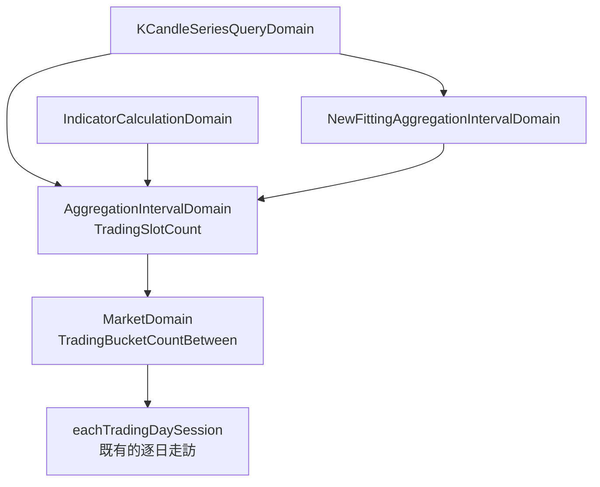

# 一段裡有幾格，要照格子數 — Architecture Design

**Status:** Confirmed
**Source PRD:** `.sdd/2026-09-09-trading-bucket-count/PRD.md`
**Tech context:** Go · Clean/Onion · `domain/models/{entities,domains,dto,vo}` + `service` + `interface`

---

## 1. Design Goal & Guiding Principle

- **In one sentence:** 把「一段裡有幾格」從一個除法改成一次走訪，並讓三個呼叫端都問同一個問法。

- **Guiding principle:** **問錯的問題不能靠算得更準來修。**
  現況的兩步是：市場說「這一段開多久」（一個時長）→ 刻度說「這麼久裝得下幾個我」（一個除法）。
  第二步從根本上答不出來：**格子不能除**。一個格子只要碰到交易就整格算一格，
  所以那個除法在刻度長到跨過交易時段邊界時必然少算，愈粗愈少。
  修法不是在除法外面加修正項，而是**把問題換成「數格子」**——
  而數格子必須逐日走訪交易時段，那件事只有市場做得到。

- **後果：刻度必須向市場提問。** 上一個切片刻意讓刻度不認識市場
  （「交易時間由呼叫端算好交給它，因為『這一段開多久』是市場的事、
  『這麼久裝得下幾個我』才是刻度的事」）。那個切分正是這個 bug 的根源：
  第二句話成立的前提是「時間可以除成格子」，而它不成立。這次要把它改掉，並在原地寫明理由。

---

## 2. Change Scope

| Area | Action | What / Why |
| :--- | :--- | :--- |
| `domain/models/domains/market_domain.go` | **Modify** | 新增 `TradingBucketCountBetween(startTime, endTime, bucketDuration)`：逐日走訪交易時段，數它們碰到的**不同格子**。全天候市場走另一條（整段除以刻度長度，行為與現況一致）。**沿用既有的 `eachTradingDaySession`**，不新增第二份市場作息 |
| `domain/models/domains/market_domain.go` | **Remove** | `TradingTimeBetween` —— 這次之後沒有任何呼叫端。留著它就是留著那個錯的第一步，而它看起來完全無害 |
| `domain/models/domains/aggregation_interval_domain.go` | **Modify** | `SlotCount(tradingTime)` → `TradingSlotCount(marketDomain, startTime, endTime)`：問市場數格子，並保留既有的**下限一格**（沒有交易的一段仍是一格）。`duration` 仍不外露 |
| `domain/models/domains/aggregation_interval_domain.go` | **Modify** | `NewFittingAggregationIntervalDomain` 改收 `(marketDomain, startTime, endTime, displayableCandleCount)`：走訪候選時逐一問市場。它因此認識市場——理由見上方 |
| `domain/models/domains/k_candle_series_query_domain.go` | **Modify** | 不再先算交易時間；挑刻度與上限檢查都改問新的問法 |
| `domain/models/domains/indicator_calculation_domain.go` | **Modify** | 「要看幾格」改問新的問法。**行為會變**（台股較粗刻度算出更多格），這是刻意的：兩條路必須說出同一個數字 |
| `postman/` | **Modify** | 新增「台股五年由系統挑刻度也被拒絕」一個請求 |
| **`AggregationIntervalDomain.BucketStart` / `BucketCount` / `SourceCandleCount`** | **Not touched** | 格子邊界怎麼切、一格裝得下幾根原始 K 線都不變 |
| **單次上限的數值、六種刻度、彙總算法、休市日名單** | **Not touched** | 只改「怎麼數」 |
| **回測** | **Not touched** | 自有一份根數判斷，不經過這條路 |
| **畫面那一側** | **Not touched** | 顯示區間上限（五百天）在這次之後仍然安全，見 §8 |
| **新的哨兵錯誤** | **Not added** | 只有既有的兩種拒絕變得更常成立，沒有新的拒絕種類 |

---

## 3. New Classes / Modules

| Name | Kind | Responsibility | Collaborators | Satisfies |
| :--- | :--- | :--- | :--- | :--- |
| `MarketDomain.TradingBucketCountBetween` | method | 「這一段裡有幾個這麼長的格子裝得到交易」。逐日走訪交易時段，把碰到的格子起點收成一個集合 | `eachTradingDaySession` | US-01、US-02、US-03 全部 |

> **一個新類別都不用開。** 它是市場已經在回答的那一類問題的第三個（前兩個是
> 「這一段能不能裝到 K 線」與「這一段開多久」），而且與它們共用同一次逐日走訪。

---

## 4. Modified Components

| Component | Current role | Change needed |
| :--- | :--- | :--- |
| `MarketDomain` | 一個市場的一切行為 | 多一個問法、少一個問法。少掉的那個（交易時間）是這次要消滅的第一步 |
| `AggregationIntervalDomain` | 一種刻度與它的性質 | `SlotCount` 換成 `TradingSlotCount`；挑刻度的建構子改收市場與兩個時刻 |
| `KCandleSeriesQueryDomain` | 一次彙總查詢的不變量 | 兩處改問新的問法；不再持有中間那個時長 |
| `IndicatorCalculationDomain` | 一次指標計算的不變量 | 一處改問新的問法。行為隨之改變 |

### 為什麼數格子而不是「除完再修正」

修正項要看的是「交易時段與格子邊界怎麼相交」，而那正是走訪一次就會知道的事。
寫成修正項只會得到一個沒有人看得懂、而且對每一種刻度都要重新推導的公式。
走訪的成本與**天數**同階，與刻度多細無關——台股五年是一千八百多天，
六種刻度各走一次，仍然是幾千次比較，而它換來的是一個對的答案。

### 為什麼下限一格要留在刻度身上，而不是市場身上

「完全沒有交易的一段算一格」是**呼叫端要的答案**，不是市場的事實：
市場的事實是零格。指標計算與序列查詢都靠那個一格避免除到零、避免空圖變成拒絕，
所以下限留在 `TradingSlotCount`——市場照實回答零，刻度把它抬成一。

---

## 5. Component Relationships

**一個問法、一個實作、三個呼叫端。** 圖上沒有任何一條路通往「交易時間除以刻度長度」。

---

## 6. Extensibility & Handoff Notes

- **Most likely next requirement:** (a) 一個市場一天兩段交易時段（上午盤／下午盤）；
  (b) 回測也改用同一個問法；(c) 第七種彙總刻度。

- **Where it lands:**
  - (a) 只落在 `eachTradingDaySession` 那一份共用走訪——數格子自動跟著對。
  - (b) 回測改問 `TradingSlotCount` 即可，不必再寫一份。
  - (c) 加進刻度清單，挑刻度的走訪自動認得。

- **How to add it:** **不得**再出現「一段時間除以刻度長度等於幾格」這條式子。
  它是同一個假設的第五種寫法，而前四種都已經修掉了。
  也**不得**在這條路上出現任何 `if market == ...`。

- **Do not hardcode:** 格子邊界一律問 `BucketStart`，不要自己 truncate——
  邊界基準是世界標準時間當日零點，寫死會在加入不整除一天的刻度時壞掉。

- **Known debt / deferred:**
  - 挑刻度會走訪六次，每次都逐日走一遍同一段時間。台股五年約一萬一千次日走訪，
    仍然是毫秒級；若哪天覺得吵，可以一次走訪同時數六種刻度，介面不必改。
  - 休市日仍不預先扣除（既有決定），所以格數是「交易日照星期推算」的結果，
    遇到國定假日會略多估——那個方向是安全的（多估只會挑得更粗、或更早拒絕）。

---

## 7. Traceability

| PRD Scenario | Fulfilled by |
| :--- | :--- |
| US-01 一小時 5 格／四小時 2 格／一天 1 格／一分鐘 270 格 | `MarketDomain.TradingBucketCountBetween`（走訪與集合） |
| US-01 五個交易日一天 5 格／四小時 10 格 | 同上 |
| US-01 只裝得到一分鐘也算一格 | 同上（集合裡有一個起點） |
| US-02 全天候市場 24／1440／365 格 | `TradingBucketCountBetween` 的永不收盤分支 |
| US-03 週末與收盤後算一格 | `AggregationIntervalDomain.TradingSlotCount` 的下限一格 |
| US-03 週末的圖是空的而不是拒絕 | 同上 ＋ 既有讀取路徑回空序列 |
| US-04 台股五年（什麼都不說／自己指定一天）皆被拒絕 | `KCandleSeriesQueryDomain` 的上限檢查改問新問法 |
| US-04 台股一週仍挑到五分鐘／全天候一週仍挑到十五分鐘 | `NewFittingAggregationIntervalDomain` 改問新問法 |
| US-04 系統挑出來的刻度仍不會反過來被拒絕 | 挑的時候與檢查的時候用同一個答案 |
| US-05 一小時 5 個位置／一分鐘 270 個位置 | `IndicatorCalculationDomain` 改問新問法 |
| US-05 超過上限即拒絕 | 同上 ＋ 既有上限檢查 |

---

## 8. Risks & Open Decisions

- **Risks / trade-offs:**
  - **有既有請求會從成功變成被拒絕。** 那些請求本來就在拿超過系統宣稱能給的量
    （台股五年一天一根交出 1304 根），所以拒絕是對的。必須有測試同時釘住
    「台股五年從答得出來變成被拒絕」與「一分鐘刻度、以及全天候市場的答案一格都沒變」——
    後者是這次唯一的相容性保證，少了它沒有人擋得住「順手把全天候那條也改掉」。
  - **移除 `TradingTimeBetween` 會動到它的既有測試。** 那些測試斷言的正是要消滅的那一步，
    該刪不該改。若移除後發現仍有呼叫端，那就是這份設計看漏了，停下來重讀。
  - **指標計算的行為跟著變，而它不是這次的起因。** 不改它，兩條路會對同一段時間
    說出不同的數字——那是上一個切片明確禁止的事。

- **Open decisions:** 無。前端那個五百天上限經確認仍然安全：
  台股五百天約 345 個交易日，加上兩側預取共一千天約 690 格，仍在一千之內。
