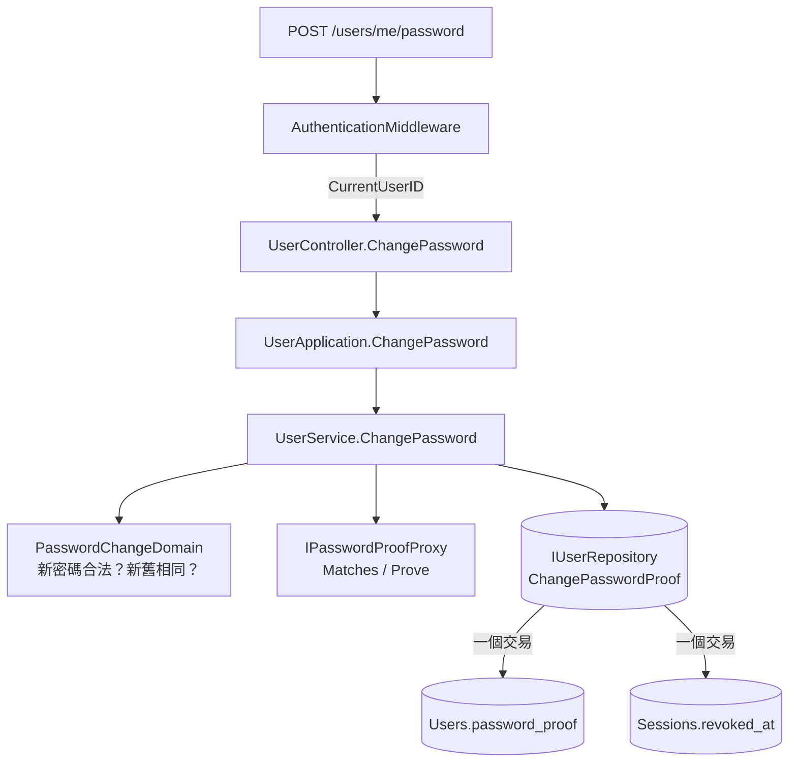

# 變更密碼 — Architecture Design

**Status:** Draft
**Source PRD:** `.sdd/2026-09-10-password-change/PRD.md`
**Tech context:** Go · Gin · GORM · PostgreSQL · Clean/Onion（`internal/{controller,application,domain,infrastructure}`）

---

## 1. Design Goal & Guiding Principle

- **In one sentence:**
  讓一位已登入的使用者換掉自己的密碼，並讓「換掉密碼證明」與「作廢他所有的登入階段」
  成為**一次寫入、一件事**——不是兩件按對順序做的事。

- **Guiding principle — 那條最危險的中間狀態，用型別與寫入邊界消滅掉：**

  這個切片只有一個真正的風險：**密碼換了、舊的登入階段還活著**。
  那正是使用者換密碼想擋掉的那個人繼續留在裡面，而畫面上寫著「已更換」。

  兩個做法可以避免它，本設計選第二個：

  1. ~~兩次呼叫（先撤登入階段、再換證明），靠順序讓失敗時偏向安全那一側。~~
     它可行，但**正確性寄託在呼叫端記得順序**，而下一個加第三步的人不會知道。
  2. **把兩者收進 repository 的一個方法裡，在同一個資料庫交易內完成。**
     這與既有 `ISessionRepository.Rotate` 的理由一字不差——那個方法的註解已經寫下這條原則：
     *「Both at once is half the method.」*
     `Sessions` 在 schema 上本來就是 `Users` 的從屬（`OnDelete:CASCADE`），
     所以「一位使用者的密碼證明與他的登入階段一起變」不是跨兩個聚合，是同一個聚合內的不變量。

  其餘一切都沿用既有：認人用既有的門，密碼規則用既有的 `PasswordDomain`，
  比對用既有的 `IPasswordProofProxy`。**本切片不發明任何新的密碼學。**

---

## 2. Change Scope

| Area | Action | What / Why |
| :--- | :--- | :--- |
| `domains.PasswordChangeDomain` | **Add** | 一次變更的規則全在這裡：新密碼合不合法、新舊是否相同。建構子驗完才生得出實例 |
| `dto.PasswordChangeDto` | **Add** | application 交給 domain 的輸入形狀（目前的密碼、新的密碼）。**沒有任何欄位放得下使用者識別碼**——那來自門，不來自請求內容 |
| `domains.ErrCurrentPasswordRejected` | **Add** | 「目前的密碼不正確」的哨兵錯誤。它**不是** `ErrCredentialsRejected`：那一句是講給陌生人聽的含糊話，這一句是講給本人聽的明確話 |
| `IUserRepository` | **Modify** | 新增 `ChangePasswordProof(ctx, userID, newPasswordProof)`：**一次呼叫＝一件完整的業務動作**，內部一個交易換證明並作廢這位使用者所有登入階段 |
| `persistence.UserRepository` | **Modify** | 上述方法的實作，用 GORM 的 `Transaction` |
| `service.UserService` | **Modify** | 多一個公開用例 `ChangePassword`。它與既有五個一樣**不呼叫彼此** |
| `application.UserApplication` | **Modify** | 多一個轉呼叫 |
| `controller.UserController` | **Modify** | 多一個 handler `ChangePassword`；`respondWithError` 多認一個哨兵錯誤 |
| `models.PasswordChangeRequest` | **Add** | 端點收的 body：`currentPassword`、`newPassword`，附 `ToPasswordChangeDto()` |
| `cmd/server/dependencies.go` | **Modify** | 註冊一條路由 `POST /users/me/password`，**掛在既有的 `requiresSignIn` 後面** |
| `entities.User` | **Not touched** | 欄位一個都不加。密碼變更改的是既有的 `PasswordProof`，`UpdatedAt` 由 GORM 自己動 |
| `entities.Session` | **Not touched** | 作廢仍然是既有的 `RevokedAt`，不新增欄位 |
| `ISessionRepository` | **Not touched** | 不加 `RevokeAllOfUser`。加了就會出現一條「只撤登入階段、不換證明」的合法路徑，而那條路徑沒有人需要——它存在的唯一效果是讓步驟 2 的原則有辦法被繞過 |
| `IPasswordProofProxy` / `BcryptPasswordProofProxy` | **Not touched** | `Prove` 與 `Matches` 正好就是這裡要的兩件事 |
| `middlewares.AuthenticationMiddleware` | **Not touched** | 門已經在了。這條路只是掛到它後面 |
| 登入憑證（access token） | **Not touched** | 它不留存、撤不掉，最長還有 15 分鐘有效。這與登出的取捨**完全一致**，`2026-09-05-session-renewal` 已經寫明並接受 |

---

## 3. New Classes / Modules

| Name | Kind | Responsibility (purpose) | Collaborators | Satisfies (PRD scenario) |
| :--- | :--- | :--- | :--- | :--- |
| `domains.PasswordChangeDomain` | Domain Model | **一次密碼變更的全部規則**：新密碼是否合法（委給 `PasswordDomain`）、新舊是否相同。建構子驗完才存在 | `PasswordDomain` | US-02 全部、US-03 全部 |
| `dto.PasswordChangeDto` | DTO | application → domain 的輸入形狀。純資料 | — | US-01 的 1 |
| `models.PasswordChangeRequest` | Request | HTTP body → DTO | `dto.PasswordChangeDto` | US-01 的 1 |
| `domains.ErrCurrentPasswordRejected` | Sentinel error | 「目前的密碼不正確」。獨立存在，讓 controller 對映得出一個**與「請重新登入」不同**的狀態碼，畫面才掛得回正確那一格 | — | US-01 的 2 |

### `PasswordChangeDomain` 的介面（深模組檢查）

```go
// 一次建構，兩條規則都判完。呼叫端不必依序做任何事，也不必記得漏了哪一條。
func NewPasswordChangeDomain(passwordChangeDto dto.PasswordChangeDto) (PasswordChangeDomain, error)

// 讀出來拿去比對／拿去算證明。兩者都只被讀一次，之後不留存。
func (d PasswordChangeDomain) CurrentPassword() string
func (d PasswordChangeDomain) NewPassword() string
```

- 介面只有一個建構子與兩個讀取，**沒有 `And`／`Then` 這種要呼叫端排順序的名字**。
- 參數是一個 DTO 而不是兩個字串，所以日後多一條規則（例如「不得與前三組重複」）
  是**建構子裡多一段**，不是簽章改一次、四個呼叫端跟著改。
- 它**不知道**密碼證明長什麼樣，也不知道有沒有登入階段這回事——它只認得「兩組密碼」。

### `IUserRepository.ChangePasswordProof` 的介面（深模組檢查）

```go
// ChangePasswordProof 換掉一位使用者的密碼證明，並在同一個交易裡作廢他每一段
// 還沒作廢的登入階段。
//
// 兩件事寫成一個方法，理由與 ISessionRepository.Rotate 相同：拆成兩次呼叫會留下一個
// 窗口，而那個窗口的內容正好是這個功能想消滅的東西——新密碼已經生效，舊的登入階段還活著。
// 拆開之後，正確性就寄託在呼叫端記得順序，而下一個在中間插一步的人不會知道有這回事。
//
// 找不到這位使用者回 ErrUserNotFound。
ChangePasswordProof(executionContext context.Context, userID uint, newPasswordProof string) error
```

- **一次呼叫＝一件完整的業務動作。** 呼叫端排不出錯誤的順序，因為它沒有順序可排。
- 回傳只有 `error`：沒有東西要交回去。密碼證明不回覆（型別上就沒有位置），
  作廢了幾段登入階段也不是任何人要知道的事。

---

## 4. Modified Components

| Component | Current role | Change needed |
| :--- | :--- | :--- |
| `service.UserService` | 建立／登入／續用／登出／認人 | 多一個公開用例 `ChangePassword(ctx, userID uint, changeDto dto.PasswordChangeDto) error`。放這裡而不是新開一個 service：它與既有五個**為同一個理由改變**——「什麼樣才算這個系統認得的人」。拆出去的話兩邊會握著同一個 `IUserRepository` 與同一個 `IPasswordProofProxy`，那是同一個模組寫兩次 |
| `application.UserApplication` | 五個用例的轉呼叫 | 多一個 `ChangePassword` |
| `controller.UserController` | 五個 handler + 錯誤對映 | 多一個 `ChangePassword` handler，從 `middlewares.CurrentUserID(ginContext)` 取人；`respondWithError` 多一條 `ErrCurrentPasswordRejected → 403` |
| `persistence.UserRepository` | 三個讀寫方法 | 多一個 `ChangePasswordProof`，內部 `database.Transaction(...)`：`Users` 更新 `password_proof`，`Sessions` 對 `user_id` 且 `revoked_at IS NULL` 的列設上 `revoked_at` |
| `cmd/server/dependencies.go` | 組裝與路由 | `engine.POST("/users/me/password", requiresSignIn, userController.ChangePassword)` |

### `UserService.ChangePassword` 的執行順序（PRD §4「判斷順序」的落地）

```
1. NewPasswordChangeDomain(dto)          → 不合法就回 ErrUserValidation（便宜，先做）
2. userRepository.FindOne(userID)        → 找不到回 ErrAuthenticationRequired
3. passwordProofProxy.Matches(current, user.PasswordProof)
                                         → 不對回 ErrCurrentPasswordRejected（最貴，後做）
4. passwordProofProxy.Prove(new)         → 算新的證明
5. userRepository.ChangePasswordProof(userID, newProof)   ← 一次寫入，兩件事
```

第 1 步在第 3 步之前，是因為前者不需要知道任何祕密就答得出來，
而第 3 步是這條路上最慢的一步（bcrypt cost 12，數百毫秒）。
一個純粹填錯格式的請求不必等它。

**這裡不需要 `Matches` 的等時處理。** `IPasswordProofProxy.Matches` 為了不洩漏
「這個電子郵件有沒有註冊過」而刻意在沒有證明時也花掉同樣的時間；
這條路上使用者已經被門認出來了，沒有名單可以被套，所以那個特性在這裡只是剛好無害。

### HTTP 狀態碼對映

| 情況 | 狀態碼 | 為什麼 |
| :--- | :--- | :--- |
| body 讀不出來 | 400 | 沿用既有 |
| 新密碼不合規、新舊相同（`ErrUserValidation`） | 400 | 沿用既有 |
| **目前的密碼不正確（`ErrCurrentPasswordRejected`）** | **403** | **刻意不用 401。** 401 在這個系統裡只有一個意思：「你這一段登入不算數了，去重新登入」——畫面看到 401 會把人踢走。而這裡他的登入好得很，錯的是他打的那一格 |
| 沒帶身分／身分不算數 | 401 | 門擋的，handler 不會執行 |
| 換成功 | **204** | 沒有東西要交回去；回覆裡不含密碼也不含密碼證明，**是型別上就沒有位置** |
| 留存處壞掉 | 502 | 沿用既有的兜底 |

---

## 5. Component Relationships



---

## 6. Extensibility & Handoff Notes

- **Most likely next requirement:**
  1. **忘記密碼**（寄一封信去重設）。
  2. **密碼變更通知**（換完之後告訴本人一聲）。
  3. **更多密碼強度規則**（不得與前三組重複、必須含數字）。
  4. **「只登出其他裝置，留下這一台」**。

- **Where it lands:**
  - (1) 忘記密碼會需要**一個新的憑證種類**（一次性的重設證明）與**寄信的能力**。
    它**不會**改到本切片的任何東西：`ChangePasswordProof` 正好就是它最後那一步要呼叫的方法，
    只是前面換成「用重設證明認人」而不是「用登入憑證認人」。
    這是把兩件事收進 repository 一個方法**最大的紅利**：換掉認人的方式，寫入那一端一個字都不改。
  - (2) 通知會落在 `2026-09-10-telegram-delivery` 鋪的那條投遞路上，
    而不是這裡再長一個第二條。
  - (3) 新的密碼規則一律加在 `PasswordChangeDomain` 的建構子裡（或它委給的 `PasswordDomain`），
    **不加在 service，也不加在 controller**。
  - (4) 這一項是唯一會動到本設計的：它需要 `ChangePasswordProof` 多知道「留哪一段」。
    做法是**多一個參數（要保留的登入階段識別碼，零表示一段都不留）**，
    而不是多一個「只撤別台」的方法——多一個方法就是多一條可以忘記換證明的路。

- **Patterns applied & why:**
  - **建構子即驗證**（`PasswordChangeDomain`）：沿用 `PasswordDomain`、`EmailDomain` 既有寫法。
    不合法的東西**做不出實例**，所以 service 不必判斷它拿到的是不是合法的。
  - **一次呼叫＝一件完整的業務動作**（`ChangePasswordProof`）：沿用 `ISessionRepository.Rotate`。
  - **哨兵錯誤對映狀態碼**：沿用 controller 既有做法。

- **Do not hardcode:**
  - 密碼長度上下限已經是 `PasswordDomain` 裡的常數，**不要在這個切片複製一份**。
  - 「換完要作廢全部」不是設定，是規則。**不要做成開關**——
    一個預設關掉的安全措施等於沒有那個安全措施。

- **Known debt / deferred:**
  - **登入憑證仍然撤不掉**，最長還有 15 分鐘。這是 `session-renewal` 已經接受的取捨，
    本切片不改。要拿掉它得替登入憑證加上簽發時刻並與使用者的密碼變更時刻比對，
    而那會讓每一發請求都多讀一次資料庫——那正是登入憑證不留存所買來的東西。
    **重新考慮它的訊號**：出現「必須讓某一份登入憑證立刻失效」的需求時。
  - **目前的密碼填錯不限次數。** 門後面的路，攻擊者要先有一份有效的登入憑證才到得了，
    所以它不是猜密碼的入口。**重新考慮它的訊號**：這個系統開始有第二個人用。

---

## 7. Traceability

| PRD Scenario | Fulfilled by |
| :--- | :--- |
| US-01 給對目前的密碼就換得成功 | `UserService.ChangePassword` + `IUserRepository.ChangePasswordProof` |
| US-01 目前的密碼填錯就整次拒絕 | `IPasswordProofProxy.Matches` + `ErrCurrentPasswordRejected`（→ 403） |
| US-01 沒有登入／帶著過期的身分 | `middlewares.AuthenticationMiddleware`（→ 401） |
| US-01 只換得動自己的 | `middlewares.CurrentUserID`——使用者識別碼來自門，`PasswordChangeRequest` 裡**沒有欄位放得下它** |
| US-02 全部（長度上下限、空白） | `PasswordChangeDomain` → `PasswordDomain`（既有常數與訊息） |
| US-02 75 個位元組被拒絕而不是被截短 | `PasswordDomain` 既有規則；`BcryptPasswordProofProxy.Prove` 是第二道鎖 |
| US-03 新舊相同被拒絕／只差一個大寫算不同 | `PasswordChangeDomain` 建構子的字面比對（**不做任何正規化**——密碼分大小寫，前後空白也是密碼的一部分） |
| US-04 兩台裝置一起失效 | `UserRepository.ChangePasswordProof` 交易內對 `Sessions` 的 `revoked_at` 寫入 |
| US-04 變更失敗不會把人踢出去 | 第 5 步之前的每一次失敗都在寫入之前回傳，**一列都沒動** |
| US-04 換完之後舊的續用憑證也換不到東西 | 既有 `UserService.RenewSession` 讀到 `session.Revoked()` → `ErrAuthenticationRequired`（**這條路一個字都不改**） |
| US-05 回覆裡沒有密碼也沒有密碼證明 | handler 回 **204 No Content**，型別上沒有位置放它們 |
| US-05 留存下來的是換過的密碼證明 | `IPasswordProofProxy.Prove`（bcrypt 自帶隨機料，同一組密碼兩次算出來不同） |

---

## 8. Risks & Open Decisions

- **Risks / trade-offs:**
  - **`ChangePasswordProof` 跨兩張表。** 這是本設計唯一「不那麼教科書」的地方：
    一個 repository 的一個方法寫了 `Users` 與 `Sessions`。
    接受它的理由寫在 §1 與 §3：在這個 schema 裡 `Sessions` 是 `Users` 的從屬
    （`OnDelete:CASCADE` 已經這麼宣告），而正確性一旦拆成兩次呼叫就會寄託在順序上。
    **不接受的代價**（一條「只撤登入階段、不換證明」的合法路徑）比它大。
  - **403 這個狀態碼是本專案第一次用。** 它與 401 的分工必須寫進 Postman 集合與前端切片，
    否則前端很容易把它當成「請重新登入」而把人踢走——那正是這個選擇要避免的事。
  - **登入憑證的 15 分鐘尾巴**（見 §6 Known debt）。

- **Open decisions (for implementation):**
  - `ErrCurrentPasswordRejected` 的訊息文字（建議：「目前的密碼不正確」，
    與 PRD 的 Gherkin 一字不差）。
  - `UserRepository.ChangePasswordProof` 在找不到使用者時是回 `ErrUserNotFound`
    還是在 service 先 `FindOne` 就擋掉。**本設計走後者**（第 2 步已經讀了使用者來拿密碼證明），
    但 repository 仍要對「一列都沒更新到」有明確的回答，不能默默成功。
  - Postman 集合的新增項目。
