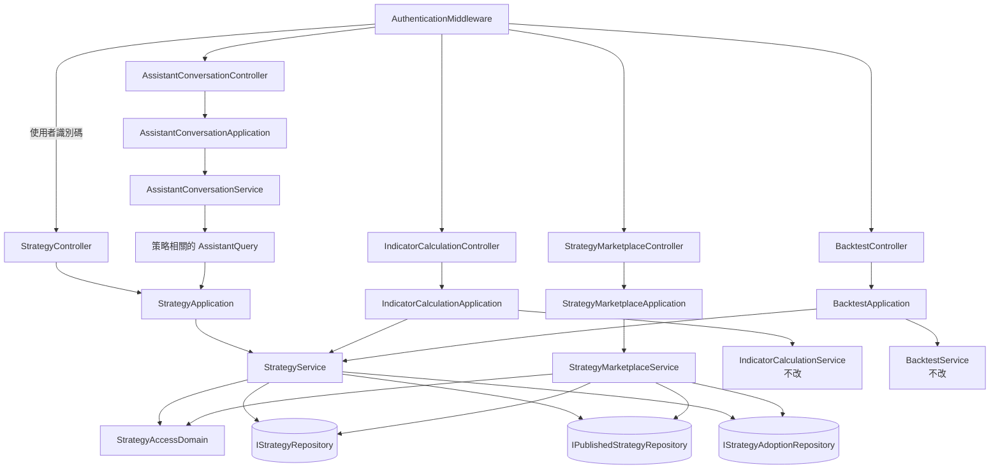
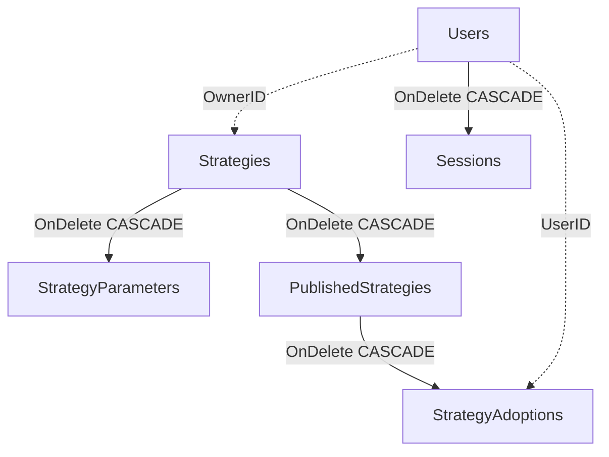

# 策略歸屬與策略市集 — Architecture Design

**Status:** Draft
**Source PRD:** `.sdd/2026-09-10-strategy-ownership-and-marketplace/PRD.md`
**Tech context:** Go · Gin · GORM · PostgreSQL · Clean/Onion（`internal/{controller,application,domain,infrastructure}`）

---

## 1. Design Goal & Guiding Principle

- **In one sentence:**
  讓每一支策略帶著擁有者，讓一支策略可以被放上共用市集**只交出用處、不交出指標算式**，
  並讓「誰看得到哪一支」這個判斷只存在於**一個地方**。

- **Guiding principle — 兩件事各自只寫一次：**

  1. **判斷只寫一次。** 「這支策略對這位使用者是什麼」全部收斂到一個 Domain Model
     `StrategyAccessDomain`。每一條會碰到策略的路（讀、改、刪、發佈、取消發佈、執行、助手）
     都建同一個模型、問它同一組問題。沒有第二個地方寫 `if ownerID == viewerID`，
     也就沒有第二個地方可以寫錯。
  2. **遮蔽靠型別，不靠記得。** 交出策略內容的形狀分成兩種：
     `StrategyDto`（擁有者用，帶 `Script`）與 **`PublishedStrategyDto`（別人用，結構上就沒有 `Script` 這個欄位）**。
     「別人看不到算式」因此是**編譯期成立**的事，不是每一條路各自記得清空一次的紀律。
     這是本設計最重要的一個選擇：一條路忘了遮，整個功能的價值就歸零，而忘記是遲早的。

  順帶的第三件：連動清除**交給資料庫的外鍵**（`PublishedStrategies` → `StrategyAdoptions` 級聯，
  `Strategies` → `PublishedStrategies` 級聯），沿用本專案既有的 `Users→Sessions`、
  `Strategies→StrategyParameters` 寫法。取消發佈只刪一列，別人的採用**由 schema 保證**跟著消失，
  不需要跨 repository 的交易，也沒有一段「記得順便刪」的程式碼可以被漏掉。

---

## 2. Change Scope

| Area | Action | What / Why |
| :--- | :--- | :--- |
| `internal/controller/middlewares/authentication_middleware.go` | **Add** | 唯一一道門。驗登入憑證、把使用者識別碼放上請求；沒帶或不算數即 401。今天只有 `/users/me` 自己讀 header，那段註解本來就寫著「等市場端點需要門的那天，它會變成中介層」——就是今天 |
| `entities.Strategy` | **Modify** | 加 `OwnerID`、`Description`、`Owner` 關聯；名稱唯一索引由 `(name)` 改為 `(owner_id, name)` |
| `entities.PublishedStrategy` | **Add** | 一支策略被放上市集這件事。`StrategyID` 唯一（重複發佈天然是一筆）、`PublishedAt` |
| `entities.StrategyAdoption` | **Add** | 一位使用者把一支市集策略放上自己書架這件事。`(UserID, StrategyID)` 唯一 |
| `domains.StrategyAccessDomain` | **Add** | **本設計的核心。** 三道關卡的唯一所在地 |
| `domains.StrategyDomain` | **Modify** | 多帶 `ownerID` 與 `description`，並驗說明長度 |
| `dto.PublishedStrategyDto` / `dto.AvailableStrategiesDto` / `dto.RunnableStrategyDto` | **Add** | 三種新的對外形狀；前兩種**沒有放算式的位置** |
| `service.StrategyService` | **Modify** | 每個用例多收一位「觀看者」，並改由 `StrategyAccessDomain` 決定看不看得到 |
| `service.StrategyMarketplaceService` | **Add** | 發佈、取消發佈、瀏覽市集、採用、取消採用 |
| `IStrategyRepository` | **Modify** | 讀寫改以擁有者收斂；新增依一組識別碼取回（供採用清單用） |
| `IPublishedStrategyRepository` / `IStrategyAdoptionRepository` | **Add** | 兩張新表各自一個 repository |
| `IndicatorCalculationService` / `BacktestService` | **Not touched** | **一行都不改。** 它們今天收的就是「一段算式 + 一組旋鈕」，那個形狀本來就對；改成指名策略是**應用層先去解析、再把同樣的形狀交給它們**。計算與回測不必認識擁有者、市集或登入 |
| `IndicatorCalculationRequestDto` / `BacktestRequestDto` | **Not touched** | 同上。`Script` 與 `Parameters` 仍在裡面，只是**由應用層填**，不再由呼叫端送 |
| `models.IndicatorCalculationRequest` / `models.BacktestRequest`（controller） | **Modify** | 加上 `strategyId`，並保留 `script`／`resultType`／`parameters` 作為**互斥的另一條路**（自己剛寫、還沒存的算式）。**這是破壞性變更**，前端必須同步 |
| `domains.RunSubjectDomain` | **Add** | 「這一次要跑什麼」的唯一判定處：指名一支策略，或自帶一段算式，兩者恰好一種。見下方修正記錄 |
| `IAssistantQuery.Run` | **Modify** | 多收一位觀看者。八個實作都要改簽章，但只有四個策略相關的會用到它 |
| `SchemaMigrator` | **Modify** | 註冊兩個新 entity；並在同步 schema **之前**清掉沒有主人的既有策略 |
| `entities.KCandle` / 行情抓取 / 即時跟盤 / 觀察清單 | **Not touched** | 這些與「誰擁有什麼」無關。K 線是市場的事實，不是任何人的財產 |
| 使用者與登入階段本身 | **Not touched** | 本切片只**使用**既有的辨識能力，不改它 |

---

## 3. New Classes / Modules

| Name | Kind | Responsibility (purpose) | Collaborators | Satisfies (PRD scenario) |
| :--- | :--- | :--- | :--- | :--- |
| `StrategyAccessDomain` | Domain Model | **回答「這支策略對這位觀看者是什麼」**：讀得到嗎、管得動嗎、拿它去算可以嗎，以及該交出哪一種形狀。三道關卡依序寫在這裡，而且只寫在這裡 | `entities.Strategy` | US-01 全部、US-03 全部、US-10 全部、US-12 的 3 |
| `entities.PublishedStrategy` | Entity | 「這支策略在市集上」這一件事實，含發佈時刻。`StrategyID` 唯一 | `entities.Strategy`、`entities.StrategyAdoption` | US-05 的 1/4、US-06 全部 |
| `entities.StrategyAdoption` | Entity | 「這位使用者把這支放上自己書架」這一件事實。`(UserID, StrategyID)` 唯一 | `entities.PublishedStrategy` | US-08 全部、US-09 的 2/3/6 |
| `dto.PublishedStrategyDto` | DTO | 一支市集策略對**非擁有者**的樣子：名稱、說明、參數、指標值種類、發佈者電子郵件、發佈時刻。**沒有算式欄位** | — | US-05 的 2/3、US-07 的 3/4 |
| `dto.AvailableStrategiesDto` | DTO | 日常挑策略的那一份：`Mine []StrategyDto` 與 `Adopted []PublishedStrategyDto` 兩段 | 上兩者 | US-09 全部 |
| `dto.RunnableStrategyDto` | DTO | 解析出來、可以拿去跑的一支：算式、旋鈕宣告、指標值種類。**只在 domain 與 application 之間流動，不會到 controller** | — | US-10 全部、US-11 全部 |
| `service.StrategyMarketplaceService` | Domain Service | 市集這件事的唯一入口：發佈、取消發佈、瀏覽、採用、取消採用 | `IStrategyRepository`、`IPublishedStrategyRepository`、`IStrategyAdoptionRepository`、`StrategyAccessDomain` | US-05、US-06、US-08 |
| `IPublishedStrategyRepository` | Interface | 市集這張表的讀寫（含依發佈時刻排序、依一組識別碼取回） | — | US-05 的 6/7、US-06 |
| `IStrategyAdoptionRepository` | Interface | 採用這張表的讀寫 | — | US-08、US-09 |
| `application.StrategyMarketplaceApplication` | Application | 對應上面那個 service 的用例編排 | `StrategyMarketplaceService` | 同上 |
| `controller.StrategyMarketplaceController` | Controller | 市集與發佈的 HTTP 轉換 | `StrategyMarketplaceApplication` | 同上 |
| `middlewares.AuthenticationMiddleware` | Middleware | 把登入憑證換成請求上的使用者識別碼；換不出來即 401，後面一步都不走 | `application.UserApplication` | 每個 US 的「沒有登入」情境 |

### `StrategyAccessDomain` 的介面（深模組檢查）

```go
// 一次建構，回答四個問題。呼叫端不必依序做任何事。
NewStrategyAccessDomain(strategy entities.Strategy, viewerID uint, isPublished bool) StrategyAccessDomain

func (d StrategyAccessDomain) IsOwnedByViewer() bool   // 第二道關卡
func (d StrategyAccessDomain) IsRunnable() bool        // 第二道 or 第三道
func (d StrategyAccessDomain) ToOwnerDto() (dto.StrategyDto, error)          // 不是擁有者即 ErrStrategyNotFound
func (d StrategyAccessDomain) ToPublishedDto(publisherEmail string, publishedAt time.Time) dto.PublishedStrategyDto
func (d StrategyAccessDomain) ToRunnableDto() (dto.RunnableStrategyDto, error) // 三道沒過即 ErrStrategyNotFound
```

- **第一道關卡（存不存在）不在模型裡**，因為模型拿不到不存在的策略——它由 repository 的
  `ErrStrategyNotFound` 回答，而那正是三道關卡共用的**同一句話**。
  三道關卡共用一個錯誤，「回覆一字不差」就不是靠比對兩段字串維持的。
- 介面簡單、內部藏規則：呼叫端說的是「把它給我」，不是「先問是不是我的、再問有沒有發佈、
  再決定要不要抹掉算式」。沒有一個方法名字裡有 And／Then。

---

## 4. Modified Components

| Component | Current role | Change needed |
| :--- | :--- | :--- |
| `entities.Strategy` | 一支策略的資料形狀 | 加 `OwnerID uint`（not null、index）、`Description string`、`Owner User` 關聯；唯一索引改 `idx_strategies_owner_name (owner_id, name)`；`Parameters` 的級聯維持不變 |
| `domains.StrategyDomain` | 策略內容的規則守門人 | 多帶 `ownerID`、`description`；新增「說明去空白後不超過 512 字、不得含 NUL」；`ToEntity()` 帶出這兩項 |
| `dto.StrategyWriteDto` | 建立/修改的輸入形狀 | 加 `OwnerID`、`Description` |
| `dto.StrategyDto` | 擁有者看到的形狀 | 加 `Description`。仍帶 `Script`——它只交給擁有者 |
| `service.StrategyService` | 策略用例的唯一入口 | 每個用例多收 `viewerID`；`ListStrategies` → `ListAvailableStrategies`（回 `AvailableStrategiesDto`）；新增 `ResolveRunnableStrategy(ctx, viewerID, id)` 供執行用 |
| `IStrategyRepository` | 策略的讀寫 | `FindAll` → `FindAllByOwner(ownerID)`；新增 `FindManyByIDs(ids)`；`Update`／`Delete` 多收 `ownerID` 收斂 where（模型已擋過，這是第二層保險）；名稱衝突改認 `idx_strategies_owner_name` |
| `StrategyRepository` | 上者的實作 | 同上；`strategyWritableColumns` 補 `description`，並清掉早已退休的 `aggregation_interval`／`candle_count` 兩個名字 |
| `application.StrategyApplication` | 策略用例編排 | 每個方法多收 `viewerID`；**新增執行前的解析編排**：先 `ResolveRunnableStrategy`，再把算式與旋鈕填進計算/回測的請求。跨 service 的編排放這裡，不放 service 內部 |
| `controller.StrategyController` | 策略的 HTTP 轉換 | 從請求上讀使用者識別碼；`GET /strategies` 改回 `AvailableStrategiesDto` |
| `models.StrategyRequest` | 建立/修改的 body | 加 `description`；`ToWriteDto` 多收 `ownerID` |
| `models.IndicatorCalculationRequest` / `models.BacktestRequest` | 執行的 body | 拿掉 `script` 與 `parameters`，加 `strategyId`。`parameterValues` 留著 |
| `controller.IndicatorCalculationController` / `BacktestController` | 執行的 HTTP 轉換 | 讀使用者識別碼、把 `strategyId` 傳下去；沿用既有的哨兵錯誤分流，多一條 `ErrStrategyNotFound → 404` |
| `application.IndicatorCalculationApplication` / `BacktestApplication` | 執行用例編排 | 先解析策略再執行；把 `RunnableStrategyDto` 的算式與旋鈕填進既有的請求 DTO |
| 四個策略相關的 `AssistantQuery` | 助手的策略能力 | `Run` 多收觀看者並往下傳；`list_strategies` 改述為「列出我看得到的」 |
| `AssistantConversationService` / `AssistantAskDto` | 助手對話 | `AssistantAskDto` 加 `ViewerID`，一路傳到 `IAssistantQuery.Run`；列清單、讀一段、把問題接到既有一段上，都先問這一段是不是他的 |
| `Conversation` / `ConversationDomain` / `IConversationRepository` | 對話 | 對話加 `OwnerID`（不可為空）；`FindAll` 改成 `FindAllOwnedBy`；`RequireOwnership` 放在已經拿著那一段的 domain model 上 |
| `SchemaMigrator` | code-first schema 同步 | 註冊 `PublishedStrategy`、`StrategyAdoption`；**同步前**清掉沒有主人的既有策略（見下） |
| `cmd/server/dependencies.go` | 組裝根 | 三個新 repository、一個新 service/application/controller、一道中介層、七條新路由 |

### 既有資料的清除（`clearOwnerlessStrategies`）

`AutoMigrate` 沒辦法在有資料的表上加一個 not null 的 `owner_id`。清除因此是 schema 同步的**前置步驟**，
且判準必須自己會過期：

> `Strategies` 表存在、且**還沒有 `owner_id` 這個欄位**時 → 清空該表（參數由既有級聯跟著走）。

這條規則跑第二次就不會再命中，因為那時 `owner_id` 已經在了。它不是一段「記得只跑一次」的腳本，
也不需要任何旗標。與既有的 `retiredColumns` 是同一個精神：把一次性的搬遷寫成一個**自己會失效的條件**。

---

## 5. Component Relationships





> 兩層級聯是「取消發佈連帶清掉採用」與「刪除策略連帶清掉發佈與採用」兩條規則的**全部實作**。
> 沒有任何一行 Go 程式碼負責這件事，因此沒有任何一行可以忘記做。

---

## 6. Extensibility & Handoff Notes

- **Most likely next requirement:** 第三種可見性。最可能是「分享給指定的某個人」或「把別人的策略複製一份成為自己的（fork）」；
  再遠一點是團隊／群組。
- **Where it lands:** `StrategyAccessDomain`。它今天的建構子收的是
  「這支策略、這位觀看者、**它有沒有被發佈**」——第三個參數就是可見性這個軸。
- **How to add it:** 加一種可見性 =
  ①加一個 entity 與它的 repository，②在建構 `StrategyAccessDomain` 的地方多餵一個事實，
  ③在模型裡多一個 or。**不需要動任何一個 service 的流程，也不需要動 controller。**
  如果哪天可見性超過三種，把那幾個 bool 換成一個 `StrategyVisibilityDomain` 再餵進去，
  呼叫端仍然不動——那正是把它收斂成一個模型換來的東西。
- **Patterns applied & why:**
  - **Domain Model as the single decision point**（不是 Strategy 模式，不需要多型）——
    可見性目前只有兩種來源，開一個介面加兩個實作只會多兩個檔案、少一份可讀性。
  - **Type-level redaction**（兩種 DTO）——把安全性從紀律變成型別。
  - **Schema-level cascade**——把連動清除從程式碼變成結構。
  三者的共同點是：**把「要記得做」換成「做不到不做」**。
- **Do not hardcode:**
  - 說明長度上限 512：與名稱上限 128 一樣，寫成 `strategyDescriptionMaxLength` 常數，一個地方。
  - 「找不到」那一句：一律走 `domains.StrategyNotFound(id)`，**不得在任何地方另寫一句**。
    三道關卡的不可區分性完全靠這一點。
  - 排序：市集固定發佈時刻由新到舊、可用策略兩段各自依名稱——寫在 repository 的查詢裡，不由呼叫端指定。
- **Known debt / deferred:**
  - `PublishedStrategies` **刻意不存發佈者識別碼**。發佈者恆等於策略的擁有者（只有擁有者發得了、
    而且歸屬不可轉讓），存第二份只可能與第一份相同或漂移，不可能提供新資訊。
    需要發佈者是誰時走 `PublishedStrategy → Strategy → Owner`。
    **若日後開放轉讓策略，這個推論就不再成立**，那時才是替它補一個「當初是誰發的」的時機。
  - 市集與可用策略都**一次全部回覆、不分頁**。個人專案規模。
    該回頭處理的訊號：市集超過大約兩百支，或那個查詢開始出現在慢查詢裡。
  - 「不存在」與「無權」目前只保證**說法相同**，不保證**耗時相同**。
    兩者都要讀一次策略表，差別只在有沒有再讀一次市集表，時間差極小且不穩定。
    真的要防時間側通道時，改成一次 join 取回兩者即可——那是一個 repository 內部的改動。
  - `strategyWritableColumns` 目前還列著兩個早已被 `retiredColumns` 丟掉的欄位。順手清掉。

---

## 7. Traceability

| PRD Scenario | Fulfilled by |
| :--- | :--- |
| US-01 建立的策略歸給目前登入者 | `AuthenticationMiddleware` + `StrategyController` + `dto.StrategyWriteDto.OwnerID` + `StrategyDomain` |
| US-01 擁有者讀得到全部內容 | `StrategyAccessDomain.ToOwnerDto` |
| US-01 修改不會改變歸屬 | `strategyWritableColumns` 不含 `owner_id`（結構上改不到） |
| US-01 沒有登入就不能建立／讀取 | `AuthenticationMiddleware` → 401 `ErrAuthenticationRequired` |
| US-02 兩個人各有一支同名策略 | `idx_strategies_owner_name` 複合唯一索引 |
| US-02 自己不能有兩支同名 / 前後空白 / 大小寫 / 改回原名 | 同上索引 + `StrategyDomain` 的 `TrimSpace` + `StrategyRepository.isNameAlreadyHeld` |
| US-02 別人發佈過的名字不影響取名 | 同上索引（不含發佈狀態） |
| US-03 全部七個情境 | `StrategyAccessDomain` + 共用的 `domains.StrategyNotFound(id)` |
| US-04 說明的七個情境 | `StrategyDomain`（`strategyDescriptionMaxLength`、`TrimSpace`、整次拒絕） |
| US-05 發佈／內容／不含算式／重複／不存在／空市集／排序 | `StrategyMarketplaceService` + `PublishedStrategy` 唯一索引 + `dto.PublishedStrategyDto`（無算式欄位）+ repository 的排序 |
| US-06 取消發佈／從未發佈不算失敗／連帶清採用／算不動／重發不回來／刪除連帶清 | `StrategyMarketplaceService` + `PublishedStrategies→StrategyAdoptions` 與 `Strategies→PublishedStrategies` 兩層級聯 |
| US-07 發佈後仍改得動（算式／說明／名稱） | `StrategyService.UpdateStrategy` 不碰市集表；市集查詢一律即時 join `Strategies` |
| US-08 採用的八個情境 | `StrategyMarketplaceService` + `(UserID, StrategyID)` 唯一索引 + `StrategyAccessDomain`（未發佈→找不到） |
| US-09 可用策略的六個情境 | `StrategyService.ListAvailableStrategies` + `dto.AvailableStrategiesDto` 的兩段結構 |
| US-10 三道關卡（自己的／已發佈已採用／已發佈未採用／不存在／未發佈／未登入／回測同規則） | `StrategyService.ResolveRunnableStrategy` + `StrategyAccessDomain.ToRunnableDto` |
| US-10「自己的回覆帶著算式」 | **結構上恆真**：計算與回測的回覆從來就不帶算式（今天也不帶）。有意義的另一半——別人的回覆不帶算式——由 `RunnableStrategyDto` 不出 application 層保證 |
| US-11 參數值只活一次的五個情境 | 沿用既有 `ParameterValues` 機制；`ResolveRunnableStrategy` 每次重新讀取策略，沒有任何回寫路徑 |
| US-12 對話歸屬的四個情境 | `Conversation.OwnerID` + `ConversationDomain.RequireOwnership` + `FindAllOwnedBy`（清單交給查詢條件而不是事後篩） |
| US-12 助手的四個情境 | `IAssistantQuery.Run` 多收觀看者 + 四個策略 query 往下傳 + `AuthenticationMiddleware` 掛上 `/chat` |

---

## 7.5 設計修正（實作期間）

設計時把執行入口一律改成「只收 `strategyId`」，理由是「呼叫端送得進算式，就等於它本來就有」。
接到前端時發現那句話**只對別人的算式成立**：指標計算那一頁的核心流程是在編輯器裡寫一段、直接算，
而自己剛打的字送進來沒有洩漏任何人的任何東西。把那條路砍掉，等於逼使用者替每一次實驗先取一個名字。

修正後的規則：**指名一支你跑得動的策略，或送一段你自己寫的算式，兩者恰好一種。**
保密性完全沒有變動——這個功能保護的一直是「沒有人拿得到他讀不到的算式」。

落地方式是一個新的 Domain Model `RunSubjectDomain`：它在任何東西被讀取之前判定這一次要跑什麼，
兩個都給或都不給一律拒絕。三個呼叫端（兩個 controller 與助手）共用它，所以「恰好一種」
不會在其中一條路上悄悄變成別的意思。既有的「同時給彙總刻度與可顯示根數即拒絕」是同一條原則的先例。

順帶取消的一個舊行為：助手那條路原本在兩者都給時**讓指名的策略獲勝**。
挑一個贏家是沒有人要求過的決定，而輸的那一個會無聲消失，現在一律拒絕。

## 8. Risks & Open Decisions

- **Risks / trade-offs:**
  - **破壞性變更。** 執行指標計算與執行回測的 body 換了形狀，`GET /strategies` 的回應也換了形狀。
    前端必須同步改，兩邊不能各自上線。這是「算式不外流」的必要代價，沒有不破壞的做法。
  - **八個 `IAssistantQuery` 實作都要改簽章**，但其中四個根本用不到那個參數。
    另一個選擇是把觀看者塞進 `context.Context`——不必改簽章，但也就看不見誰在用它、
    誰忘了用它。這裡選擇讓它在型別上出現：漏傳是編譯錯誤，塞進 context 則是執行期才知道。
  - **兩層級聯是資料庫的行為，不是 Go 的行為。** 好處是漏不掉，代價是讀 Go 程式碼看不到它。
    因此 entity 上的關聯宣告要寫清楚註解——這是唯一能讀到它的地方。
  - **中介層一次掛上五組路由**（策略、市集、計算、回測、對話）。K 線與觀察清單維持不設防：
    行情是市場的事實，不是任何人的財產，替它加一道門只會讓圖表在沒登入時空白。

- **Open decisions (for implementation):**
  - 無。以下在設計時直接定案：
    `PublishedStrategies` **不存發佈者識別碼**（理由見 §6）；
    `GET /strategies/:id` **只服務擁有者**，別人已發佈的那些走市集自己的讀取路徑
    ——一支方法只回一種形狀，兩種形狀就兩支方法；
    可用策略回**兩段結構**而不是一個混合陣列，因為混合陣列需要一個「有時候有算式」的型別，
    那正是本設計要消滅的東西。
