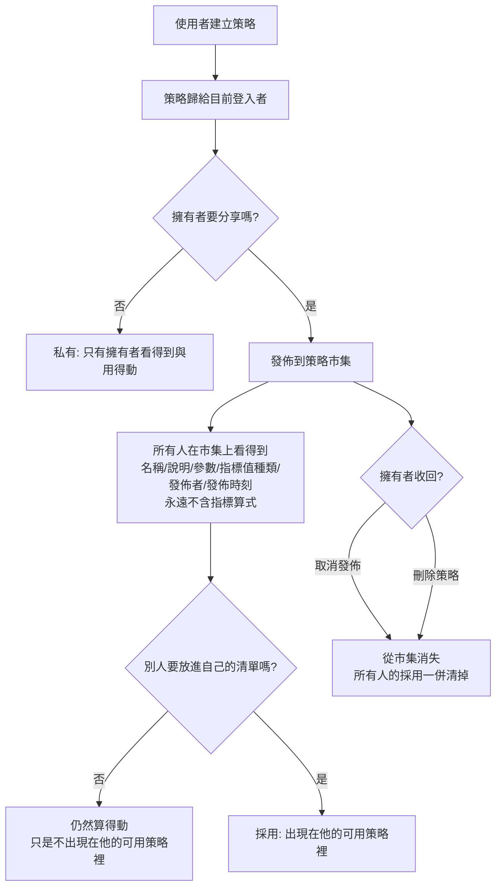
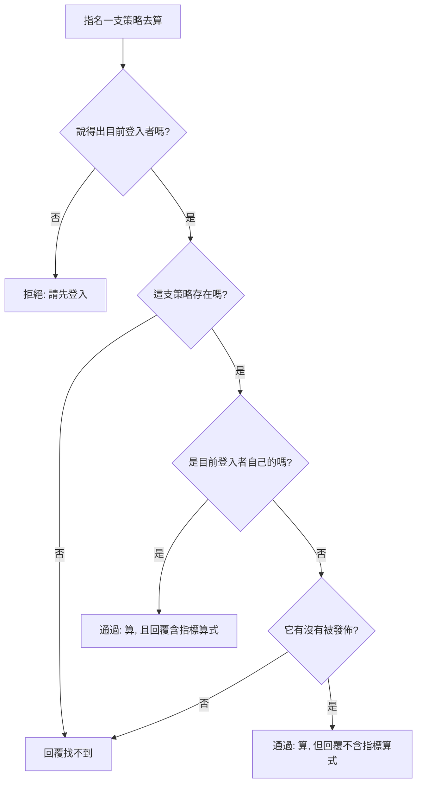

# Product Requirements Document (PRD)

**Status:** Draft
**Version:** v1.0
**Owner:** James Hsueh
**Stakeholders:** Engineering, QA

---

## 1. Background & Goal (Why & Goal)

- **Problem Statement:**
  策略目前是**無主的**。系統留著的每一支，任何登入與否的人都讀得到裡面的指標算式、改得動、刪得掉；
  策略名稱還是全系統共用一份，第一個人取走「二十根均線」，之後所有人都不能再用這個名字。
  系統認得使用者已經有一陣子了，但那份認識只用在「我是誰」這一句上，沒有任何一支策略知道自己屬於誰。

  同時，一支調好的策略**沒有辦法分享**。想給別人用，只能把整段指標算式貼給對方——
  那等於連作法一起送出去，而作法正是花最多時間的那一部分。

- **Expected Outcome:**
  1. 系統裡**每一支策略都有恰好一位擁有者**，沒有例外；別人的私有策略在任何一條路上都問不出來，
     連「它存不存在」都問不出來。
  2. 擁有者能把一支策略**發佈**到策略市集，讓所有人**用得動但看不到指標算式**——
     指標算式從此不再離開系統這一側。
  3. 市集上的東西**不會自己跑進別人的策略清單**：使用者自己採用哪幾支，自己的清單就長什麼樣。
     一位使用者的日常策略清單長度，只由他自己的決定，與市集有幾百支無關。

- **Out of Scope:**
  - 角色與權限分級（沒有管理員，沒有「誰可以管誰」）。
  - 轉讓策略給別人。
  - 市集上的評分、留言、下載次數、熱門排行、分類、標籤、搜尋與分頁。
  - 策略的版本歷史與快照；對已採用者的變更通知。
  - 付費、授權與使用條款。
  - 把別人的策略複製一份成為自己的。
  - 既有策略的資料保留（一律清除，不做搬遷）。
  - 操作介面長什麼樣。

---

## 2. User Personas

- **Primary Role(s):**
  - **策略擁有者**——自己寫策略、調策略的人。他要的是「這是我的東西」與「我可以分享用處而不分享作法」。
  - **市集使用者**——同一批人的另一個身分：想用別人調好的策略，但不必看懂它怎麼算。
  - 系統**沒有管理員**這個角色。

- **Usage Context:**
  在瀏覽器上、看著 K 線圖表的時候。挑策略是一個**高頻、順手**的動作——
  下拉清單如果變成幾百項，這個動作就毀了。這正是「發佈」與「採用」必須分成兩步的原因。

---

## 3. User Stories & Acceptance Criteria

### US-01 — 每一支策略都屬於建立它的人 [priority: P0]

**As a** 使用者，**I want** 我建立的策略屬於我，**so that** 別人動不了我花時間調出來的東西。

```gherkin
Scenario: 建立的策略歸給目前登入者
  Given 目前登入者是小美
  When 小美建立一支策略
  Then 建立成功
  And 這支策略的擁有者是小美

Scenario: 擁有者讀得到自己策略的全部內容
  Given 小美有一支策略
  When 小美讀取它
  Then 回傳它的策略名稱、策略說明、指標算式、指標值種類與策略參數

Scenario: 修改不會改變歸屬
  Given 小美有一支策略
  When 小美修改它
  Then 修改成功
  And 這支策略的擁有者仍然是小美

Scenario: 沒有登入就不能建立策略
  Given 沒有目前登入者
  When 建立一支策略
  Then 拒絕，說明要先登入
  And 系統沒有多出任何策略

Scenario: 沒有登入就不能讀策略
  Given 沒有目前登入者
  When 讀取任何一支策略
  Then 拒絕，說明要先登入
```

### US-02 — 名字只在自己的策略之間不得重複 [priority: P0]

**As a** 使用者，**I want** 我取的策略名字不受別人影響，**so that** 我不必為了避開陌生人取過的名字而改名。

```gherkin
Scenario: 兩個人各有一支同名策略
  Given 小美已有一支名為「二十根均線」的策略
  When 小明建立一支名為「二十根均線」的策略
  Then 建立成功
  And 兩支策略同時存在，各自屬於各自的擁有者

Scenario: 自己不能有兩支同名策略
  Given 小美已有一支名為「二十根均線」的策略
  When 小美再建立一支名為「二十根均線」的策略
  Then 拒絕，說明該名稱已被使用
  And 她既有那一支的內容完全沒變

Scenario: 前後空白不算另一個名字
  Given 小美已有一支名為「二十根均線」的策略
  When 小美建立一支名為「　二十根均線　」的策略
  Then 拒絕，說明該名稱已被使用

Scenario: 大小寫不同就是不同名字
  Given 小美已有一支名為「MA20」的策略
  When 小美建立一支名為「ma20」的策略
  Then 建立成功

Scenario: 改回自己原本的名字不算重複
  Given 小美有一支名為「二十根均線」的策略
  When 小美把它改名為「二十根均線」
  Then 修改成功

Scenario: 別人發佈過的名字不影響自己取名
  Given 小明有一支名為「二十根均線」的策略，且已發佈
  When 小美建立一支名為「二十根均線」的策略
  Then 建立成功
```

### US-03 — 別人的私有策略一律回答找不到 [priority: P0]

**As a** 使用者，**I want** 我沒發佈的策略對別人完全隱形，**so that** 沒有人能靠著逐一試探識別碼問出我有幾支策略。

```gherkin
Scenario: 讀別人未發佈的策略
  Given 小明有一支未發佈的策略
  And 目前登入者是小美
  When 小美讀取那一支
  Then 回覆找不到

Scenario: 讀一個從未存在過的策略
  Given 目前登入者是小美
  When 小美讀取一個從未存在過的策略識別碼
  Then 回覆找不到，與讀別人未發佈策略時的說法一字不差

Scenario: 改別人未發佈的策略
  Given 小明有一支未發佈的策略
  And 目前登入者是小美
  When 小美修改那一支
  Then 回覆找不到
  And 小明那一支的內容一個字都沒變

Scenario: 刪別人未發佈的策略
  Given 小明有一支未發佈的策略
  And 目前登入者是小美
  When 小美刪除那一支
  Then 回覆找不到
  And 小明那一支仍然讀得到

Scenario: 改別人已發佈的策略
  Given 小明有一支已發佈的策略
  And 目前登入者是小美
  When 小美修改那一支
  Then 回覆找不到
  And 小明那一支的內容一個字都沒變

Scenario: 刪別人已發佈的策略
  Given 小明有一支已發佈的策略
  And 目前登入者是小美
  When 小美刪除那一支
  Then 回覆找不到
  And 小明那一支仍然在市集上

Scenario: 收回別人已發佈的策略
  Given 小明有一支已發佈的策略
  And 目前登入者是小美
  When 小美取消發佈那一支
  Then 回覆找不到
  And 那一支仍然在市集上
```

### US-04 — 替策略寫一段說明 [priority: P1]

**As a** 策略擁有者，**I want** 替策略寫一段說明，**so that** 別人在看不到指標算式的情況下判斷得出它有沒有用。

```gherkin
Scenario: 建立時寫下說明
  Given 說明為「用五分鐘 K 線抓短線轉折」
  When 建立策略
  Then 建立成功
  And 讀取它時說明為「用五分鐘 K 線抓短線轉折」

Scenario: 不寫說明也建立得起來
  Given 完全沒有給說明
  When 建立策略
  Then 建立成功
  And 這支策略沒有說明

Scenario: 只有空白的說明視同沒寫
  Given 說明只有空白字元
  When 建立策略
  Then 建立成功
  And 這支策略沒有說明

Scenario: 說明前後的空白不予保留
  Given 說明為「　抓短線轉折　」
  When 建立策略
  Then 建立成功
  And 讀取它時說明為「抓短線轉折」

Scenario: 說明恰為上限長度
  Given 說明恰為 512 個字
  When 建立策略
  Then 建立成功

Scenario: 說明超過上限
  Given 說明為 513 個字
  When 建立策略
  Then 拒絕，說明長度上限為 512 個字

Scenario: 改成過長的說明整次拒絕
  Given 一支策略的說明為「抓短線轉折」
  When 把說明改成 513 個字
  Then 拒絕，說明長度上限為 512 個字
  And 該策略的說明仍然是「抓短線轉折」
```

### US-05 — 把策略發佈到市集 [priority: P0]

**As a** 策略擁有者，**I want** 把一支策略發佈給所有人用，**so that** 別人用得動它，卻拿不走我的作法。

```gherkin
Scenario: 發佈一支策略
  Given 小明有一支未發佈的策略
  When 小明發佈它
  Then 發佈成功
  And 它出現在策略市集上，並記著這一刻為發佈時刻

Scenario: 市集上看得到的內容
  Given 小明剛發佈一支名為「二十根均線」的策略
  When 小美瀏覽策略市集
  Then 看到「二十根均線」，帶著它的策略說明、策略參數、指標值種類、小明的電子郵件與發佈時刻

Scenario: 市集上看不到指標算式
  Given 小明剛發佈一支策略
  When 小美瀏覽策略市集
  Then 那一支的內容裡沒有指標算式這一項

Scenario: 重複發佈維持一筆
  Given 小明有一支已發佈的策略，發佈時刻為昨天中午
  When 小明再發佈它一次
  Then 不算失敗
  And 市集上仍然只有它一筆，發佈時刻仍然是昨天中午

Scenario: 發佈一支不存在的策略
  Given 一個從未存在過的策略識別碼
  When 小明發佈它
  Then 回覆找不到

Scenario: 空的市集
  Given 市集上一支策略都沒有
  When 小美瀏覽策略市集
  Then 回傳空的清單，不視為錯誤

Scenario: 市集依發佈時刻由新到舊
  Given 小明先發佈「甲」、後發佈「乙」
  When 小美瀏覽策略市集
  Then 順序為「乙」、「甲」
```

### US-06 — 把策略收回來 [priority: P0]

**As a** 策略擁有者，**I want** 隨時把策略從市集收回，**so that** 分享出去的東西仍然是我說了算。

```gherkin
Scenario: 取消發佈
  Given 小明有一支已發佈的策略
  When 小明取消發佈它
  Then 成功
  And 它不再出現在策略市集上

Scenario: 取消一支從未發佈的策略
  Given 小明有一支從未發佈的策略
  When 小明取消發佈它
  Then 不算失敗
  And 它仍然不在策略市集上

Scenario: 取消發佈連帶清掉別人的採用
  Given 小明有一支已發佈的策略
  And 小美採用了它
  When 小明取消發佈它
  Then 小美的可用策略裡不再有它

Scenario: 取消發佈後別人就算不動它
  Given 小美採用了小明那一支已發佈的策略
  When 小明取消發佈它
  And 小美指名它執行指標計算
  Then 回覆找不到

Scenario: 重新發佈不會讓採用自己回來
  Given 小美採用了小明那一支已發佈的策略
  And 小明取消發佈它
  When 小明重新發佈它
  Then 它回到策略市集上
  And 小美的可用策略裡仍然沒有它

Scenario: 刪除已發佈的策略連帶清掉發佈與採用
  Given 小明有一支已發佈的策略
  And 小美採用了它
  When 小明刪除它
  Then 它不再出現在策略市集上
  And 小美的可用策略裡不再有它
```

### US-07 — 發佈之後仍然改得動 [priority: P1]

**As a** 策略擁有者，**I want** 發佈之後還能繼續調整策略，**so that** 我修好的東西用它的人都拿得到，而不必記得再按一次發佈。

```gherkin
Scenario: 改算式不影響發佈與採用
  Given 小明有一支已發佈的策略
  And 小美採用了它
  When 小明改掉它的指標算式
  Then 修改成功
  And 它仍然在策略市集上
  And 小美的可用策略裡仍然有它

Scenario: 別人下一次執行拿到的是改過之後的
  Given 小明有一支已發佈的策略，小美採用了它
  And 小明改掉它的指標算式
  When 小美指名它執行指標計算
  Then 算出來的是改過之後的指標結果

Scenario: 改說明市集上跟著變
  Given 小明有一支已發佈的策略，說明為「抓短線轉折」
  When 小明把說明改成「抓長線趨勢」
  And 小美瀏覽策略市集
  Then 那一支的說明為「抓長線趨勢」

Scenario: 改名字採用的人跟著看到新名字
  Given 小明有一支名為「甲」的已發佈策略，小美採用了它
  When 小明把它改名為「乙」
  And 小美看自己的可用策略
  Then 那一支的名稱為「乙」
```

### US-08 — 從市集採用想要的策略 [priority: P0]

**As a** 市集使用者，**I want** 自己挑哪幾支要進我的清單，**so that** 我挑策略的地方不會被別人發佈的東西塞爆。

```gherkin
Scenario: 採用一支市集策略
  Given 策略市集上有小明的一支策略
  When 小美採用它
  Then 成功
  And 小美的可用策略裡出現它

Scenario: 重複採用維持一筆
  Given 小美已採用小明那一支
  When 小美再採用它一次
  Then 不算失敗
  And 小美的可用策略裡它仍然只有一筆

Scenario: 取消採用
  Given 小美採用了小明那一支
  When 小美取消採用
  Then 小美的可用策略裡不再有它
  And 它仍然在策略市集上

Scenario: 取消一支從未採用的
  Given 小美從未採用小明那一支
  When 小美取消採用
  Then 不算失敗

Scenario: 採用只影響採用的人
  Given 小明有一支已發佈的策略
  When 小美採用它
  Then 小明的可用策略完全沒有變化

Scenario: 採用自己的策略不會發生任何事
  Given 小美有一支自己的策略
  When 小美採用它
  Then 不算失敗
  And 小美的可用策略完全沒有變化

Scenario: 採用一支未發佈的策略
  Given 小明有一支未發佈的策略
  When 小美採用它
  Then 回覆找不到

Scenario: 採用一支不存在的策略
  Given 一個從未存在過的策略識別碼
  When 小美採用它
  Then 回覆找不到
```

### US-09 — 日常挑策略時看得到哪些 [priority: P0]

**As a** 使用者，**I want** 我的策略清單只有我的與我採用的，**so that** 挑一支策略仍然是一個順手的動作。

```gherkin
Scenario: 只有自己的策略
  Given 小美有「甲」與「乙」兩支自己的策略
  When 小美查看可用策略
  Then 看到「甲」與「乙」，兩支都帶著指標算式

Scenario: 自己的排前面、採用的排後面
  Given 小美有自己的「乙」
  And 小美採用了小明的「甲」
  When 小美查看可用策略
  Then 順序為「乙」、「甲」

Scenario: 採用來的不含指標算式
  Given 小美有自己的「乙」，並採用了小明的「甲」
  When 小美查看可用策略
  Then 「乙」帶著指標算式
  And 「甲」的內容裡沒有指標算式這一項

Scenario: 一支都沒有
  Given 小美沒有自己的策略，也沒有採用任何一支
  When 小美查看可用策略
  Then 回傳空的清單，不視為錯誤

Scenario: 沒採用的市集策略不會出現
  Given 策略市集上有二十支策略
  And 小美一支都沒有採用
  When 小美查看可用策略
  Then 回傳空的清單

Scenario: 兩段各自依名稱排序
  Given 小美有自己的「乙」與「丙」
  And 小美採用了小明的「甲」與「丁」
  When 小美查看可用策略
  Then 順序為「乙」、「丙」、「甲」、「丁」
```

### US-10 — 指名一支策略去算，或帶自己剛寫的一段 [priority: P0]

**As a** 使用者，**I want** 執行時說「用哪一支」或直接把剛寫的那段交出去，**so that** 我用得動別人的策略卻看不到它怎麼算，同時自己試一段新算式也不必先取名字存檔。

```gherkin
Scenario: 算自己的策略
  Given 小美指名自己的一支策略
  When 執行指標計算
  Then 算出指標結果
  And 回覆裡帶著指標算式

Scenario: 算別人已發佈、自己已採用的策略
  Given 小明有一支已發佈的策略，小美已採用它
  When 小美指名它執行指標計算
  Then 算出指標結果
  And 回覆裡沒有指標算式這一項

Scenario: 算別人已發佈、自己還沒採用的策略
  Given 小明有一支已發佈的策略
  And 小美沒有採用它
  When 小美指名它執行指標計算
  Then 算出指標結果

Scenario: 算一支不存在的策略
  Given 一個從未存在過的策略識別碼
  When 小美指名它執行指標計算
  Then 回覆找不到

Scenario: 算別人未發佈的策略
  Given 小明有一支未發佈的策略
  When 小美指名它執行指標計算
  Then 回覆找不到，與算一支不存在的策略時的說法一字不差

Scenario: 沒有登入就不能算
  Given 沒有目前登入者
  When 指名任何一支策略執行指標計算
  Then 拒絕，說明要先登入

Scenario: 回測適用同一套關卡
  Given 小明有一支已發佈的策略
  When 小美指名它執行回測
  Then 交出成績單
  And 回覆裡沒有指標算式這一項

Scenario: 回測也算不動別人未發佈的策略
  Given 小明有一支未發佈的策略
  When 小美指名它執行回測
  Then 回覆找不到

Scenario: 帶一段自己剛寫、還沒存起來的算式
  Given 小美在編輯區寫了一段算式，還沒存成策略
  When 小美直接拿它去算
  Then 算出指標結果
  And 系統沒有因此多出任何一支策略

Scenario: 同時指名策略又帶算式
  Given 小美指名了一支策略
  And 小美同時帶了一段算式
  When 執行
  Then 拒絕，說明兩者只能挑一種
  And 沒有任何一個被拿去執行

Scenario: 既沒指名策略也沒帶算式
  Given 小美既沒指名策略，也沒帶算式
  When 執行
  Then 拒絕，說明沒有東西可以跑
```

### US-11 — 執行時帶自己的參數值 [priority: P1]

**As a** 市集使用者，**I want** 用自己的數字跑別人的策略，**so that** 一支策略不會只有一種吐法，而我又不會弄壞別人的東西。

```gherkin
Scenario: 帶自己的參數值
  Given 小明已發佈的策略，其中一個旋鈕的預設值為 20
  When 小美指名它執行，並把該旋鈕帶成 60
  Then 這一次以 60 計算

Scenario: 帶進去的值不寫回策略
  Given 小美剛才以 60 執行完那一支
  When 小明讀取自己那一支
  Then 該旋鈕的預設值仍然是 20

Scenario: 帶進去的值也不記在採用的人身上
  Given 小美剛才以 60 執行完那一支
  When 小美再次瀏覽策略市集
  Then 該旋鈕的預設值仍然是 20

Scenario: 一個參數值都不帶
  Given 小明已發佈的策略，其中一個旋鈕的預設值為 20
  When 小美指名它執行，不帶任何參數值
  Then 這一次以 20 計算

Scenario: 帶了一個沒有宣告的旋鈕名字
  Given 小明已發佈的策略沒有宣告名為「窗長」的旋鈕
  When 小美指名它執行，並帶入「窗長」
  Then 拒絕，指出「窗長」這個名字對不上
```

### US-12 — 助手以使用者的身分做事 [priority: P1]

**As a** 使用者，**I want** 助手替我做的每一件事都算在我頭上，**so that**「每一支策略都有主人」沒有例外。

```gherkin
Scenario: 助手建立的策略歸給委託它的人
  Given 目前登入者是小美
  When 小美請助手建立一支策略
  Then 建立成功
  And 這支策略的擁有者是小美

Scenario: 助手只列得出委託它的人看得到的
  Given 小美有兩支自己的策略
  And 小明有三支未發佈的策略
  When 小美請助手列出策略
  Then 只列出小美那兩支

Scenario: 助手讀不到別人未發佈的策略
  Given 小明有一支未發佈的策略
  And 目前登入者是小美
  When 小美請助手讀那一支
  Then 助手回覆找不到

Scenario: 沒有登入時助手做不了任何與策略有關的事
  Given 沒有目前登入者
  When 請助手建立一支策略
  Then 拒絕，說明要先登入
```

---

## 4. Business Flow & Logic

### Flow Diagram





### Core Business Rules

1. **歸屬規則。** 一支策略在建立當下歸給目前登入者，之後不得更換、不得轉讓。系統裡不存在沒有擁有者的策略。
2. **三道關卡（依序）。** 任何一次「指名一支策略」的動作都走這三步：
   **① 這支策略存在嗎 → ② 是不是目前登入者自己的（是就通過）→ ③ 不是自己的，它有沒有被發佈（有就通過）**。
   任何一道沒過，回覆一律是同一句「找不到」。
3. **讀與寫的關卡不同。** 讀取與執行走完整三道；**修改、刪除、發佈、取消發佈只走到第二道**——
   第二道沒過就是找不到，發佈與否不再過問。
4. **算式不外流。** 指標算式只交給擁有者。市集內容、別人的讀取結果、別人的執行結果，一律不含它。
   這條規則保護的是「**沒有人拿得到他讀不到的算式**」——它不禁止任何人送出自己寫的一段，
   因為那是他自己的字，沒有誰被瞞著。
5. **名稱唯一性。** 去除前後空白後完全相同即視為重複，大小寫不同即視為不同；
   **比對範圍限縮在同一位擁有者的策略之間**。改回自己原本的名稱不算重複。
6. **採用不是執行的前提。** 採用只決定「出不出現在可用策略裡」，完全不影響「能不能算」。
7. **連動清除。** 取消發佈與刪除策略，都會把所有人對它的採用一併清掉。重新發佈不會讓採用自己回來。
8. **一律不算失敗的重複動作。** 重複發佈、重複採用、取消一支沒發佈的、取消一支沒採用的、採用自己的——
   五者都不算失敗，因為目的都已經達成。
9. **執行時的參數值只活一次。** 蓋過去的值只用在這一次，不寫回策略，也不記在採用的人身上。
10. **執行時，指名一支策略與自帶一段算式只能挑一種。** 兩個都給就整次拒絕——兩者會對
    「實際跑的是哪一個」給出不同答案，替人挑一個等於讓另一個無聲消失；兩個都不給也拒絕，
    因為沒有東西可以跑。這與既有的「同時給彙總刻度與可顯示根數即拒絕」是同一條原則。
11. **登入是前提。** 每一件與策略有關的事都必須說得出目前登入者是誰；說不出來一律拒絕並要求先登入，
    這一句與「找不到」是兩句不同的話。

### Edge Cases

- **同一支策略同時被擁有者刪除、被別人執行。** 以先到者為準；刪除之後那一次執行回覆找不到。
- **同一支策略同時被兩處發佈**（例如助手與人各按一次）。結果仍是一筆，發佈時刻是第一次那一次。
- **同一支策略同時被兩處採用。** 結果仍是一筆。
- **擁有者在別人執行到一半時改掉算式。** 該次執行以取出當下的那一份算完，不中止。
- **登入憑證在一連串操作中途過期。** 那一刻起的每一件事都拒絕並要求先登入；已完成的不回滾。
- **既有資料。** 系統目前留著的策略全部沒有主人，一律清除，不指派給任何人。
- **一位使用者被刪除。** 不在本切片範圍——系統目前沒有刪除使用者這件事。

---

## 5. UI/UX Design & Interaction

- **Prototype Link:** 無（另一端自行設計）。
- **Key Interactions:**
  - **策略市集**是一個獨立的地方，與日常挑策略的地方分開。市集列出每一支的名稱、發佈者、說明與旋鈕，
    每一支有一個「加入」／「移除」的動作。
  - **日常挑策略的地方**只列可用策略。採用來的那些**不可編輯**，因為它們根本沒有指標算式可以編輯。
  - **發佈／取消發佈的動作只出現在自己的策略上。**
  - **空狀態**：市集一支都沒有時說「市集上還沒有任何策略」；可用策略一支都沒有時說「還沒有任何策略」，
    並指路到市集。兩者都不是錯誤。
  - **錯誤狀態**：拒絕的說法一律照系統給的那一句顯示，不自行改寫——
    特別是「找不到」，不得在畫面上擅自區分成「沒有這一支」與「你沒有權限」。

---

## 6. Non-Functional Requirements

- **Security（本切片的重點）：**
  - 指標算式**只有擁有者取得**。任何一條交出策略內容的路徑，都必須自己確認過取用者是不是擁有者——
    不能依賴呼叫端自己不要看。
  - 「不存在」與「無權」對外**必須是同一句話**，且花費的時間不應明顯不同——
    回得特別快本身就是在說這一支存在。
  - 每一件與策略有關的事都必須帶著身分證明；沒帶的一律拒絕。
- **Performance：** 個人專案規模。市集與可用策略的清單一次全部回覆，不分頁。
- **Compatibility：** 沿用現況，本切片不引入新的相容性要求。
- **Analytics / Tracking：** 無。

---

## 7. Dependencies & Risks

- **External Dependencies:** 無新增的外部服務。
- **Internal Dependencies:**
  - 依賴既有的**登入憑證**機制辨識目前登入者。本切片之前，系統只有一個地方讀憑證；
    之後，每一條與策略有關的路都要讀。
  - 執行指標計算與執行回測**兩條既有的路都要改**：從收下一整段指標算式，改成指名一支策略。
  - 助手與策略有關的四件能力（讀、列、建、改）都要帶上身分。
- **Known Risks:**
  - **算式外流的破口。** 只要有任何一條路徑忘了遮蔽指標算式，整個功能的價值就歸零。
    風險緩解：交出策略內容的形狀就分成兩種，「不含算式」的那一種**根本沒有放算式的位置**，
    而不是每次記得把它清空。
  - **既有資料清除是不可逆的。** 已與需求方確認：目前留著的都是測試資料。
  - **改動執行入口是破壞性變更。** 另一端必須同步改，否則執行整條路會壞掉。

---

## 8. Appendix

- 需求共識：`.sdd/2026-09-10-strategy-ownership-and-marketplace/BRIEF.md`
- 通用語言地圖：`.sdd/UL-MAP.md`（本切片新增策略擁有者、策略說明、策略市集、已發佈策略、市集策略、
  策略採用、可用策略等詞彙，並改寫策略、策略名稱、使用者、目前登入者、執行指標計算、執行回測等既有條目）
- 相關切片：`2026-09-03-trading-strategy-management`（策略的建立與保存）、
  `2026-09-04-strategy-parameters`（策略參數）、`2026-09-05-user-authentication`（登入與身分）、
  `2026-09-05-strategy-backtest`（回測）、`2026-08-29-indicator-calculation`（指標計算）
