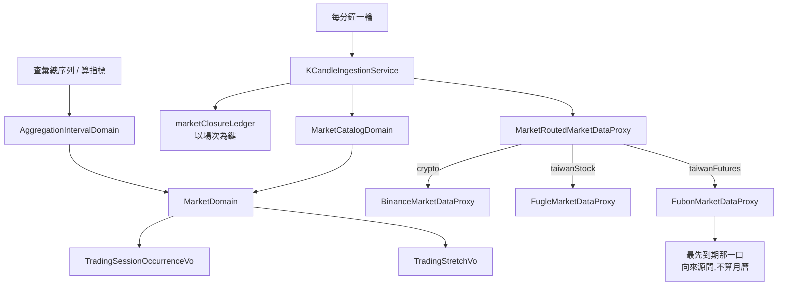

# 台灣期貨夜盤接入 — Architecture Design

**Status:** Draft
**Source PRD:** `.sdd/2026-09-10-taiwan-futures-night-session/PRD.md`
**Tech context:** Go · Clean / Onion Architecture · 依賴方向一律指向 Domain

---

## 1. Design Goal & Guiding Principle

- **In one sentence:**
  讓一個市場可以**一天開兩段交易時間、其中一段跨過午夜**，並讓台指期**換月**這件事
  完全留在行情來源那一側，domain 一個字都不必知道。

- **Guiding principle:**
  **交易時段從「一個起訖」變成「一串 stretch」，而「走過每一場交易」仍然只有一個地方。**

  `market_domain.go` 的 `eachTradingDaySession` 自己留了一段警告：
  它把每一段的格子相加，**從來不問兩段有沒有落在同一格**，
  而那只有在「一天一段」的世界裡才安全。這個設計正面收下那張單——
  把那個 walk 改成產出**場次（occurrence）**，
  並讓格數的合併發生在**同一個地方**，而不是散到每個問格數的人身上。

  第二個原則是**換月不進 domain**。「最近到期那一口是哪一口」是那個來源
  自己的產品清單才答得出來的事；把它做成 domain 概念，
  等於讓每個看 K 線的人都要先懂期貨合約。它留在 proxy 裡面，
  對 domain 來說台指期就是一個叫某個名字的交易標的。

---

## 2. Change Scope

| Area | Action | What / Why |
| :--- | :--- | :--- |
| `internal/domain/models/vo/trading_session_vo.go` | **Modify** | `TradingSessionVo` 的 `DailyStart`／`DailyEnd` 換成 `Stretches []TradingStretchVo`。一天一段是這一版之前的形狀，不是市場的形狀 |
| `internal/domain/models/vo/trading_stretch_vo.go` | **Add** | 一段交易時間：起、訖（**訖可超過 24 小時**＝跨午夜）、以及它算不算次一營業日 |
| `internal/domain/models/vo/trading_session_occurrence_vo.go` | **Add** | 某一天的某一段交易：實際起訖時刻＋**歸屬哪一個營業日**。這是休市推定與營業日歸屬共同的單位 |
| `internal/domain/models/domains/market_domain.go` | **Modify** | 那個唯一的 walk 改成產出場次；`TradingBucketCountBetween` **合併**兩段共用的格子；`IsOpen`／`ClampToTradingSession`／`HoldsTrading`／`SessionElapsedAt` 改讀場次；新增 `SessionOccurrenceAt` |
| `internal/domain/models/vo/market_vo.go` | **Modify** | 多一個 `MarketTaiwanFutures` |
| `internal/domain/models/domains/market_catalog_domain.go` | **Modify** | `RecognisedMarkets` 那個固定順序多一筆 |
| `internal/domain/service/market_closure_ledger.go` | **Modify** | 鍵從「市場＋交易日」改成「市場＋場次」。**這是「休市以一段為單位」的全部** |
| `internal/domain/service/k_candle_ingestion_service.go` | **Modify** | 休市的查詢與落定改以場次為單位；沒有場次（非交易時段）時照舊由窗口收斂成空來跳過 |
| `internal/infrastructure/marketdata/fubon_*.go` | **Add** | 台灣期貨的三個 proxy 與它的 wire 型別 |
| `internal/config/application_config.go` | **Modify** | 多一份台灣期貨的設定，並在市場規則表多一筆 |
| `cmd/server/dependencies.go` | **Modify** | 三張市場路由表各多一筆 |
| 加密貨幣那條路（Binance 三個 proxy） | **Not touched** | 它永不收盤，這一版一個字都不碰 |
| 台股那條路（Fugle 三個 proxy） | **Not touched** | 台股維持現狀是 PRD 明文；它只是「一段的市場」，新的形狀涵蓋得下 |
| 策略、回測、指標算式、登入、持久化結構 | **Not touched** | 期貨標的就是一筆普通的交易標的，沒有新的表也沒有新的欄位 |

---

## 3. New Classes / Modules

| Name | Kind | Responsibility (purpose) | Collaborators | Satisfies (PRD scenario) |
| :--- | :--- | :--- | :--- | :--- |
| `TradingStretchVo` | VO | 一段交易時間怎麼寫下來：從當地日的第幾小時開始、到第幾小時結束（**可超過 24 小時**），以及它的 K 線算不算次一營業日 | — | US-02 全部、US-03 全部 |
| `TradingSessionOccurrenceVo` | VO | 某一個具體日子的某一段交易：起訖的絕對時刻，加上**它歸屬哪一個營業日** | — | US-03 全部、US-04 全部 |
| `FubonMarketDataProxy` | Proxy | 抓台指期日盤與夜盤的 K 線。**換月在這裡面解決**：每次先向來源問最先到期的是哪一口 | `IClockProxy` | US-05 全部、US-02 的抓取、US-08 |
| `FubonSymbolLookupProxy` | Proxy | 回答台指期在這個市場存不存在、市場怎麼稱呼它 | — | US-05 的加入觀察清單 |
| `FubonLiveMarketDataProxy` | Proxy | 跟著台指期的即時行情，一條通道 | — | 沿用既有即時跟盤規則 |
| `TaiwanFuturesConfig` | Config | 台灣期貨那一份設定：位址、金鑰、兩段交易時間、方案允許的通道與檔數 | — | US-01、US-02（時段可調整） |

> `MarketDomain` 的對外介面**不變寬**：新增一個「這一刻屬於哪一場」的問法，
> 其餘方法簽章一字不改。問格數的人、判斷開不開盤的人、收斂窗口的人**都不必知道**
> 一天可以有兩段——那正是深模組要做到的事。

---

## 4. Modified Components

| Component | Current role | Change needed |
| :--- | :--- | :--- |
| `TradingSessionVo` | 一個市場一天的那**一段**交易時間（起、訖、時區、星期） | 起訖換成 `Stretches`。`Location` 為 nil 仍代表永不收盤，這個約定不動 |
| `MarketDomain.eachTradingDaySession` | 走過每一個交易日，把**那一段**交回訪客 | 改成走過每一個交易日的**每一段**，交回 `TradingSessionOccurrenceVo`。它仍是唯一知道這件事的地方 |
| `MarketDomain.TradingBucketCountBetween` | 把每一段的格子**相加** | 改為**合併**：場次依時間先後產出，若某一場的第一格與上一場已算過的最後一格相同，那一格不重複計。四小時刻度下的日盤尾與夜盤頭正是這一種 |
| `MarketDomain.SessionElapsedAt` | 這個市場**今天那一段**已經過去多久 | 改為**目前這一場**已經過去多久。休市推定「等到沉默真的算證據」那條規則因此對兩段都成立 |
| `MarketDomain.IsOpen` / `ClampToTradingSession` / `HoldsTrading` | 讀那一段的起訖 | 改讀場次；行為對「一段的市場」完全不變 |
| `MarketDomain.TradingDateOf` | 這一刻落在市場自己的哪一個日曆天 | **不動**。它答的是「當地日」，而不是「這批交易歸屬哪一個營業日」——後者是場次的事。兩者混為一談會讓台股在晚上九點的答案改變 |
| `marketClosureLedger` | 記著「哪個市場、哪一個交易日已判定休市」 | 改記「哪個市場、**哪一場**已判定休市」。日盤那一場的結論因此碰不到夜盤那一場 |
| `KCandleIngestionService.ingestSymbol` | 先問休市、再收斂窗口、再抓 | 問休市時帶的是**目前這一場**；沒有場次時不查（本來就會被空窗口跳過） |
| `KCandleIngestionService.presumeClosedMarkets` | 一輪之後，決定哪些市場今天休市 | 落定的對象改成**那一場**；`NeverCloses` 與「沉默要夠久」兩道防線照舊 |
| `application_config.go` | 讀環境變數，組出市場規則表 | 多一份台灣期貨設定；台股那一份改用單一 stretch 表達，**預設值不變** |
| `dependencies.go` | 三張市場路由表 | 各多一筆 `taiwanFutures` |

---

## 5. Component Relationships

---

## 6. Extensibility & Handoff Notes

- **Most likely next requirement:**
  1. **再一個一天多段的市場**——選擇權、或美股的盤前盤後。
  2. **交易所調整交易時間**（期交所調過，還會再調）。
  3. **指定月份的那一口合約**，或小台、電子期。

- **Where it lands:**
  1. 與 2 都落在**設定**：`Stretches` 是一串，寫幾段就是幾段；
     `MarketDomain` 那個 walk 是唯一的走法，不必再改一次。
  3. 落在**路由表**：多一個交易標的、或多一個 proxy 實作，
     `IMarketDataProxy` 這份契約一個字都不動。

- **How to add it:**
  「在設定裡多寫一段 stretch」與「在路由表多註冊一筆」，
  **不是**「在某個 if 裡多一個分支」。domain 裡不該再出現
  `if market == taiwanFutures`——這條原則 `market_domain.go` 開頭就寫著。

- **Patterns applied & why:**
  - **場次（occurrence）當作值**：讓「哪一場」成為一個可以當鍵、可以比較、可以回答營業日歸屬的東西。
    休市推定要以一段為單位，靠的就是它，而不是在 ledger 裡多一個欄位。
  - **市場路由**（既有）：第三個來源是表裡多一筆，不是任何人多一個判斷。
  - **換月藏在 proxy 內**：外部資源的細節不外漏，是既有 proxy 規則的直接套用。

- **Do not hardcode:**
  - 兩段交易時間的起訖、時區、星期——全部走設定。
  - 台灣期貨的通道數與每條通道檔數——那是行情方案的事，換方案就會變。
  - 「夜盤算次一營業日」寫在 stretch 上，**不要**寫成 `if 是夜盤`。
  - 最先到期那一口**不要**用月曆算：來源說了才算。

- **Known debt / deferred:**
  - **`TradingBucketCountBetween` 的合併只擋得住「相鄰兩場共用一格」。**
    場次依時間先後產出，而最粗的刻度是一天、兩場之間最短的空檔是一小時十五分，
    所以三場落在同一格目前不可能發生。**要加第三段之前先回來讀這一段。**
  - **永不收盤的市場仍然用「時間除以刻度長度」算格數**，比可產出的格數少一格。
    這是既有的、已寫下來的不一致，這一版不順手改——改它會動到每一張圖。
  - `FubonMarketDataProxy` 的 wire 型別與 Fugle 的形狀幾乎相同（同一家的技術）。
    這一版各寫一份、不共用，因為兩個來源日後不保證同步演化；
    真的要共用是 `/improve-codebase` 該判斷的事。
  - 夜盤跨午夜之後「今天」在畫面上怎麼呈現：**沒有畫面，這一版不處理**。

---

## 7. Traceability

| PRD Scenario | Fulfilled by |
| :--- | :--- |
| US-01 記著屬於台灣期貨的交易標的向台灣期貨的來源拿 | `MarketVo` + `MarketRoutedMarketDataProxy` |
| US-01 台股／加密貨幣／沒記市場的舊資料維持原樣 | `MarketCatalogDomain`（fallback 不動） |
| US-01 指名系統不認得的市場 | `MarketCatalogDomain.IsRecognised` + `RecognisedMarkets` |
| US-02 日盤／夜盤進行中照常抓 | `MarketDomain.ClampToTradingSession`（讀場次） |
| US-02 兩段之間、清晨、週末跳過 | 同上——窗口收斂成空即是「沒有事情要做」 |
| US-02 日盤／夜盤剛收那一輪還收得到當段最後一根 | 場次的「最後一根開盤時刻」＝收盤前一根 |
| US-02 交易時段內取不到才算失敗 | `KCandleIngestionService.ingestSymbol` |
| US-03 夜盤前半段／過午夜後半段／週五夜盤算下週一 | `TradingStretchVo`（算不算次一營業日）+ `TradingSessionOccurrenceVo.BusinessDate` |
| US-03 日盤算它自己那一天 | 同上 |
| US-03 夜盤已收、日盤未開那段清晨的交易日 | `MarketDomain.TradingDateOf`（當地日，未改動） |
| US-04 交易時段內正常回覆卻一根都沒有 | `KCandleIngestionService.presumeClosedMarkets` + `marketClosureLedger`（場次為鍵） |
| US-04 日盤推定休市、夜盤照樣問一次 | `marketClosureLedger` 的鍵是場次——**這一條就是那個改動的存在理由** |
| US-04 隔天重新判定 | 場次的起訖是絕對時刻，隔天是另一場 |
| US-04 來源報錯不算休市 | `presumeClosedMarkets` 只讀「問到了但沒東西」 |
| US-04 只針對一檔的回補不推定休市 | `marketClosureLedger.reconsider`（既有） |
| US-05 跟最近到期那一口／換月／換月前後接得起來 | `FubonMarketDataProxy` |
| US-05 加進觀察清單前先確認存在／來源不可用時加不進去 | `FubonSymbolLookupProxy` + `TradingSymbolService`（既有） |
| US-05 來源答不出最先到期那一口即算這一輪失敗 | `FubonMarketDataProxy` 回錯，`ingestSymbol` 留失敗紀錄 |
| US-06 那三個數字沒有值／成交量是零／照原樣存／沒成交就沒那一根 | `FubonMarketDataProxy` 正規化 + `KCandleDomain`（既有規則） |
| US-06 加密貨幣三個數字照常都有 | Binance 那條路未動 |
| US-07 一小時 20 格 | `MarketDomain.TradingBucketCountBetween` |
| US-07 四小時 6 格不是 7 格 | 同上——**合併相鄰兩場共用的那一格** |
| US-07 休息與週末 0 格／空序列不算錯誤 | `MarketDomain.HoldsTrading` + 既有的空序列規則 |
| US-07 台股與加密貨幣的格數一格不變 | 一段的市場走同一條路徑；永不收盤仍走原本的除法 |
| US-08 跨午夜照補／各種收盤後不算缺口／完全沒交易時段 | `MarketDomain.ClampToTradingSession` + 既有的啟動回補 |
| US-08 加密貨幣的回補維持現狀 | 同上（永不收盤者原窗口奉還） |

---

## 8. Risks & Open Decisions

- **Risks / trade-offs:**
  - **改的是所有市場共用的那條路徑。** 交易時段的形狀變了，
    台股與加密貨幣也走同一段程式。因此「台股一格都不變」必須有測試明說，
    而不是靠讀程式相信。
  - **格子合併只擋相鄰兩場。** 見上方 deferred。加第三段前必須回頭讀。
  - **`TradingDateOf` 與「營業日歸屬」是兩個不同的問題，名字卻很像。**
    這一版刻意不把它們合併；日後有人覺得重複而合併，台股在晚上的行為會靜靜改變。
  - **`FubonMarketDataProxy` 一次要問兩個時段。** 一個橫跨日盤與夜盤的窗口，
    對來源是兩次不同的詢問；這件事必須留在 proxy 內，不可外漏成兩個窗口。

- **Decisions taken during implementation:**
  - **位址**：產品清單、日內 K 線、即時三條，比照台股那一組命名
    （`TAIWAN_FUTURES_*`）。**沒有歷史那一條**——見下方。
  - **「最先到期那一口」不快取**，每次抓取都問一次。跨輪快取會讓換月晚一輪；
    輪內快取省下的是一次請求，換來的是一個會過期的答案。
  - **通道數與每條檔數**沿用台股的一條、五檔，可調整。
  - **兩段交易時間的寫法**：設定寫的是時鐘上的時刻（`15:00`、`05:00`），
    「收在起始之前或同時」即讀成隔天早上。沒有人需要知道二十九點是早上五點。
  - **「算不算次一營業日」不做成設定**——它是交易所的算法，不是旋鈕，寫在程式裡。

- **實作後才確定的兩件事（下一個人請先讀）:**
  - **這個來源的期貨只有日內行情，沒有歷史行情。** 已確認日內 K 線與
    「盤後時段」參數存在；歷史那一條沒有確認到。因此**啟動回補只補得回今天兩段
    還握著的部分**，更早的補不回來——沿用既有規則「來源手上沒有就回幾根存幾根，
    不算失敗」。長時間停機後的缺口是真的缺口。日後若確認有歷史位址，
    加一條設定與一個分支即可，形狀已經在那裡。
  - **「最先到期那一口」是以來源自己列出的代號、依其月份字母排序決定的**
    （`A`–`L` 為一到十二月，加一位年份數字）。這**不是**推算結算日：
    結算完的合約來源就不再列出，所以換月發生在來源說的那一天。
    但**月份字母這個約定沒有向線上來源逐字驗證過**——若日後發現代號格式不同，
    要改的只有一個地方（讀代號那一段），其餘不動。
