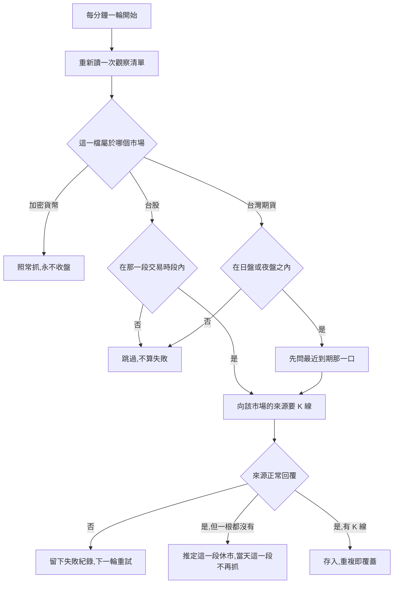

# 台灣期貨夜盤接入 — Product Requirements Document (PRD)

**Feature:** 台灣期貨夜盤接入
**Status:** Draft
**Version:** v1.0
**Owner:** James Hsueh
**Stakeholders:** 專案維護者本人

---

## 1. Background & Goal (Why & Goal)

- **Problem Statement:**
  系統認得兩個市場：加密貨幣永不收盤，台股一天開一段、早上九點到下午一點半。
  台股收盤之後，世界才開始交易——美股怎麼走、消息怎麼發，台股一律隔天早上九點才反應。
  **這段空白裡唯一在成交的地方是台指期的夜盤**，而系統現在看不到它。
  想在開盤前有依據的人，手上什麼都沒有。

  接它進來會撞上三件系統從來沒有遇過的事：
  台灣期貨**一天開兩段**（日盤、夜盤），其中**夜盤跨過午夜**，
  而它的代號**每個月會換一口合約**——不像 2330 一輩子是 2330。
  這三件事目前每一件都會被系統當成故障或當成缺漏。

- **Expected Outcome:**
  系統認得**台灣期貨**這第三個市場，用既有的每分鐘一輪自動抓取抓台指期的日盤與夜盤 K 線。
  交付後的可驗證結果：
  - 台北時間 22:30 跑一輪，台指期**抓得到** 22:29 那一根；台北時間 14:20 跑一輪，
    台指期**跳過且不留失敗紀錄**。
  - 週五傍晚開始那段夜盤的 K 線，算的是**下週一**這個交易日。
  - 一個完整交易日以一小時為刻度在圖上是 **20 格**；以四小時為刻度是 **6 格，不是 7**。
  - 台股與加密貨幣的每一項行為**一格都不變**。

- **Out of Scope:**
  - **台股改用台灣期貨的那個行情來源**——台股維持現狀，一字不改。
  - **未平倉量與結算價**——期貨獨有的那兩個數字這一版不記。
  - **指定月份的單一口合約**——只做「跟最近到期那一口」這一條連續的線。
  - **台指期以外的期貨**（小型台指、電子期、金融期）與**選擇權**。
  - **下單、部位、保證金、損益**——本系統不下單。
  - **逐筆成交明細、掛單簿、法人買賣超、大額交易人未沖銷部位。**
  - **成交量的單位換算**——照行情來源給的原樣存。
  - **換月那個跳空的價格還原調整**，以及在畫面上標記哪一根是換月後的第一根。
  - **一次匯入大量歷史 K 線的批次功能。**
  - **存取權限與身分驗證**——沿用既有的那一套。

---

## 2. User Personas

- **Primary Role(s):**
  - **專案維護者本人** —— 想在台股開盤前知道夜盤怎麼走的人。晚上看、早上看，
    看的是圖與指標，不下單。
  - **呼叫端** —— 帶著交易標的與一段時間來要 K 線、彙總序列或指標值的程式。
    它不需要知道哪個市場一天開幾段，那是系統要答的。

- **Usage Context:**
  沒有畫面，全部以程式呼叫的方式互動。抓取是背景進行的，
  與前兩個市場**共用同一輪**、每分鐘一次，人不在也照跑。
  使用者的觀看時間集中在兩處：**夜裡（夜盤進行中）** 與**早上開盤前**。

---

## 3. User Stories & Acceptance Criteria

### US-01 — 台灣期貨是第三個市場 [priority: P0]
**As a** 呼叫端，**I want** 台灣期貨與前兩個市場一樣是一個「所屬市場」，
**so that** 系統照那筆記錄決定去哪裡拿資料，而不是從代號的長相猜。

```gherkin
Scenario: 記著屬於台灣期貨的交易標的向台灣期貨的來源拿
  Given 台指期登錄時記著它屬於台灣期貨
  When 抓它的 K 線
  Then 向台灣期貨的行情來源拿

Scenario: 台股維持原樣
  Given 2330 登錄時記著它屬於台股
  When 抓它的 K 線
  Then 向台股的行情來源拿,行為與這一版之前完全相同

Scenario: 加密貨幣維持原樣
  Given BTCUSDT 登錄時記著它屬於加密貨幣
  When 抓它的 K 線
  Then 向加密貨幣的行情來源拿,行為與這一版之前完全相同

Scenario: 沒記市場的舊資料仍然是加密貨幣
  Given 系統既有的舊資料裡有一個沒記市場的交易標的
  When 抓它的 K 線
  Then 視為加密貨幣,維持現狀不變

Scenario: 指名一個系統不認得的市場
  Given 一個名字既不是台股、也不是台灣期貨、也不是加密貨幣的市場
  When 用它把一個交易標的加進觀察清單
  Then 拒絕,並說出系統認得哪三個市場
```

### US-02 — 台灣期貨一天有兩段交易時間，中間的空檔跳過 [priority: P0]
**As a** 專案維護者，**I want** 兩段之間的休息與清晨那段空檔被當成正常的休息，
**so that** 紀錄裡只留真正的失敗，而不是每天累積幾百筆假的。

```gherkin
Scenario: 日盤進行中照常抓
  Given 現在是台北時間 10:07,台指期日盤進行中
  When 跑一輪抓取
  Then 抓台指期,並存入 10:06 那一根

Scenario: 夜盤進行中照常抓
  Given 現在是台北時間 22:30,台指期夜盤進行中
  When 跑一輪抓取
  Then 抓台指期,並存入 22:29 那一根

Scenario: 兩段之間的休息跳過
  Given 現在是台北時間 14:20,日盤已收、夜盤還沒開
  When 跑一輪抓取
  Then 台指期直接跳過,不留失敗紀錄
  And 加密貨幣照常抓

Scenario: 夜盤收了到日盤開之前的清晨跳過
  Given 現在是台北時間 06:30,夜盤已收、日盤還沒開
  When 跑一輪抓取
  Then 台指期直接跳過,不留失敗紀錄

Scenario: 日盤剛收的那一輪還收得到當段最後一根
  Given 現在是台北時間 13:46,日盤剛收
  When 跑一輪抓取
  Then 存入 13:44 那一根
  And 之後那幾輪台指期都跳過

Scenario: 夜盤剛收的那一輪還收得到當段最後一根
  Given 現在是台北時間 05:01,夜盤剛收
  When 跑一輪抓取
  Then 存入 04:59 那一根
  And 之後那幾輪台指期都跳過

Scenario: 週末整天跳過
  Given 現在是週日中午
  When 跑一輪抓取
  Then 台指期跳過,不留失敗紀錄
  And 加密貨幣照常抓

Scenario: 交易時段內取不到才算失敗
  Given 現在是台北時間 22:30,夜盤進行中
  And 台灣期貨的行情來源不可用
  When 跑一輪抓取
  Then 留下一筆失敗紀錄
  And 下一輪自然重試
```

### US-03 — 夜盤跨過午夜，算次一個營業日的 [priority: P0]
**As a** 專案維護者，**I want** 夜盤的 K 線算次一個營業日的，
**so that** 系統的日線與交易所的日線對得起來，不會永遠差一根。

```gherkin
Scenario: 夜盤開始那半段
  Given 週三 15:00 開始那段夜盤
  When 問這些 K 線屬於哪一個交易日
  Then 週四

Scenario: 過了午夜之後那半段,仍是同一個交易日
  Given 週四 02:00 那一根,它屬於週三 15:00 開始的那段夜盤
  When 問它屬於哪一個交易日
  Then 週四,與週三 22:00 那一根同一個交易日

Scenario: 週五傍晚開始那段夜盤算下週一
  Given 週五 15:00 開始那段夜盤,跨到週六清晨 05:00
  When 問這些 K 線屬於哪一個交易日
  Then 下週一,因為隔天是週六、週六不是營業日

Scenario: 日盤算它自己那一天
  Given 週四 10:00 那一根,它屬於週四的日盤
  When 問它屬於哪一個交易日
  Then 週四

Scenario: 夜盤已收、日盤未開的那段清晨仍算同一個交易日
  Given 現在是週四 08:00,夜盤已收、日盤還沒開
  When 問現在是哪一個交易日
  Then 週四
```

### US-04 — 休市以「一段」為單位判定 [priority: P0]
**As a** 專案維護者，**I want** 休市的推定以一段交易時間為單位，
**so that** 日盤沒開不會讓系統自己放棄真的開著的夜盤。

```gherkin
Scenario: 交易時段內來源正常回覆卻一根都沒有
  Given 現在在日盤時段內
  And 行情來源正常回覆,但一根 K 線都沒有
  When 跑一輪抓取
  Then 推定今天的日盤休市
  And 當天剩餘輪次不再抓日盤

Scenario: 日盤推定休市,夜盤照樣問一次
  Given 今天的日盤已推定休市
  And 現在進入夜盤時段
  When 跑一輪抓取
  Then 照樣向行情來源要台指期的 K 線

Scenario: 隔天重新判定
  Given 昨天的日盤曾推定休市
  And 現在是今天的日盤時段內
  When 跑一輪抓取
  Then 照樣向行情來源要台指期的 K 線,不沿用昨天的推定

Scenario: 來源報錯不算休市
  Given 現在在夜盤時段內
  And 行情來源連不上
  When 跑一輪抓取
  Then 留下一筆失敗紀錄,不推定休市
  And 下一輪自然重試

Scenario: 只針對一檔的回補不推定休市
  Given 只回補台指期這一檔
  And 行情來源正常回覆卻一根 K 線都沒有
  When 回補結束
  Then 不推定任何一段休市
```

### US-05 — 「台指期」跟最近到期那一口，結算完就換 [priority: P0]
**As a** 專案維護者，**I want** 只說「台指期」，系統自己跟最近到期那一口，
**so that** 我不必每個月記得換一次，也不會盯著一條快死掉的線還以為它正常。

```gherkin
Scenario: 平常日子跟最近到期那一口
  Given 觀察清單上有台指期
  When 抓它的 K 線
  Then 拿最近到期那一口的 K 線

Scenario: 換月之後跟新的那一口
  Given 行情來源說最先到期的已經是下一口了
  When 跑下一輪抓取
  Then 抓那一口新的合約
  And 它的 K 線接在同一條台指期的線上

Scenario: 還沒換月時跟舊的那一口
  Given 行情來源說最先到期的仍是原本那一口
  When 跑一輪抓取
  Then 抓原本那一口

Scenario: 換月前後查得到一條連得起來的線
  Given 台指期在換月之前與之後都有 K 線
  When 查換月前後那一段
  Then 回傳一條由早到晚接得起來的 K 線序列
  And 換月那一刻的跳空照原樣呈現,不做價格還原

Scenario: 加進觀察清單前先確認它存在
  Given 台指期目前不在觀察清單上
  When 把台指期加進觀察清單
  Then 先向台灣期貨的行情來源確認它存在,確認後加入

Scenario: 來源說不出最近到期那一口就加不進去
  Given 台灣期貨的行情來源此刻不可用
  When 把台指期加進觀察清單
  Then 加不進去,並說明稍後再試
  And 觀察清單維持原狀

Scenario: 來源說不出最近到期那一口就算這一輪失敗
  Given 現在在夜盤時段內
  And 行情來源答不出最近到期的是哪一口
  When 跑一輪抓取
  Then 留下一筆失敗紀錄,不推定休市
```

### US-06 — 期貨沒有的那幾個成交數字留空 [priority: P0]
**As a** 呼叫端，**I want** 「這個市場沒有這一項」與「值是零」長得不一樣，
**so that** 我不會拿一串看起來合理、其實全錯的數字去畫線。

```gherkin
Scenario: 台指期的 K 線缺那三個數字
  Given 行情來源給了台指期一根 K 線
  When 存入後查詢
  Then 開盤價、最高價、最低價、收盤價與成交量都有值
  And 成交額、主動買入量、主動買入額都沒有值

Scenario: 成交量真的是零與沒有這一項不同
  Given 台指期某一分鐘的成交量是零
  When 查詢那一根
  Then 成交量是零
  And 成交額仍然是沒有值

Scenario: 成交量照原樣存
  Given 行情來源給的成交量單位是口
  When 存入
  Then 照原樣存,不換算成任何其他單位

Scenario: 完全沒有成交的那一分鐘沒有那一根
  Given 台指期某一分鐘完全沒有成交
  When 查詢那一段
  Then 沒有那一根,不補洞也不沿用前一根

Scenario: 加密貨幣的三個數字照常都有
  Given BTCUSDT 的一根 K 線
  When 查詢
  Then 成交額、主動買入量、主動買入額都有值
```

### US-07 — 一段時間在圖上有幾根，要認得一天兩段 [priority: P0]
**As a** 呼叫端，**I want** 系統算得出台灣期貨一段時間在圖上有幾根，
**so that** 挑刻度、擋掉太多根、算指標要看幾格三處拿到的是同一個正確答案。

```gherkin
Scenario: 一個完整交易日,一小時一格
  Given 一個台灣期貨交易標的
  And 一個完整交易日,日盤 08:45 至 13:45、夜盤 15:00 至翌日 05:00
  When 問這一段以一小時為刻度在圖上有幾格
  Then 20 格——日盤占 6 格、夜盤占 14 格

Scenario: 同一個交易日,四小時一格,兩段共用的那一格只算一次
  Given 一個台灣期貨交易標的
  And 同一個完整交易日
  When 問這一段以四小時為刻度在圖上有幾格
  Then 6 格,不是 7 格——日盤的尾與夜盤的頭落在同一格

Scenario: 兩段之間的休息不產生格
  Given 一個台灣期貨交易標的
  And 一段時間只有台北時間 14:00 到 15:00 之前
  When 問這一段以一小時為刻度在圖上有幾格
  Then 0 格

Scenario: 週末完全沒有交易
  Given 一個台灣期貨交易標的
  And 一段時間是週六 05:00 之後到週一 08:45 之前
  When 問這一段在圖上有幾格
  Then 0 格

Scenario: 查一段完全沒有交易的時間不算錯誤
  Given 一個台灣期貨交易標的
  And 一段時間只有台北時間 14:00 到 15:00 之前
  When 查這一段的彙總 K 線序列
  Then 回傳一個空的序列,不是拒絕

Scenario: 台股的答案一格都不變
  Given 一個台股交易標的
  And 一個完整交易日
  When 問這一段以一小時為刻度在圖上有幾格
  Then 與這一版之前完全相同的格數

Scenario: 加密貨幣的答案一格都不變
  Given 一個加密貨幣交易標的
  And 任意一段時間
  When 問這一段在圖上有幾格
  Then 與這一版之前完全相同的格數
```

### US-08 — 啟動回補只補交易時段內的，跨午夜照補 [priority: P1]
**As a** 專案維護者，**I want** 停機期間漏掉的夜盤補得回來，
**so that** 我隔天早上看到的夜盤是完整的，而系統不會去找一個不存在的缺口。

```gherkin
Scenario: 夜盤進行中啟動,跨過午夜照補
  Given 現在是週四 02:00,台指期最新一根是週三 23:30
  When 系統啟動
  Then 補上 23:31 到 01:59 之間交易時段內的每一根

Scenario: 夜盤已收、日盤未開時啟動
  Given 現在是週四 07:00
  When 系統啟動
  Then 補到週四 04:59 為止
  And 04:59 之後到現在不算缺口

Scenario: 週末啟動,補到週五夜盤的尾
  Given 現在是週六 10:00
  When 系統啟動
  Then 補到週六 04:59 為止,那是週五夜盤的尾
  And 之後到現在不算缺口

Scenario: 兩段之間的休息不算缺口
  Given 現在是台北時間 14:30
  When 系統啟動
  Then 補到 13:44 為止
  And 13:44 之後到現在不算缺口

Scenario: 回補範圍內完全沒有交易時段
  Given 回補範圍內完全沒有台灣期貨的交易時段
  When 系統啟動
  Then 沒有東西要補,直接進入定時抓取

Scenario: 從來沒有任何 K 線
  Given 台指期從來沒有任何 K 線
  When 系統啟動
  Then 補回補範圍內交易時段內的每一根

Scenario: 加密貨幣的回補維持現狀
  Given BTCUSDT 停機兩小時
  When 系統啟動
  Then 補那兩小時的每一根,行為與這一版之前完全相同
```

---

## 4. Business Flow & Logic

- **Flow Diagram:**



- **Core Business Rules:**
  - **一天可以有兩段交易時間，其中一段可以跨過午夜。** 這是這一版最核心的改動：
    在此之前每個市場一天只有一段，而那一段一定落在同一個當地日期之內。
  - **落在哪一段之外就是非交易時段。** 兩段之間（13:45–15:00）與夜盤收到日盤開之間
    （05:00–08:45）都是非交易時段，那一輪跳過、不算失敗。
  - **夜盤的營業日歸屬是次一個營業日。** 週五傍晚那段算下週一。
    這是為了與交易所的日線、結算與未平倉量對得起來。
  - **休市推定的單位是一段交易時間。** 一段的沉默只是那一段的。
  - **「最近到期那一口」每一輪向行情來源問。** 系統**不自己算月曆、也不算結算時刻**——
    來源說哪一口最先到期就跟哪一口，來源換了就是換月的那一刻。
    這讓「結算完就換」變成一件不需要算的事，交易所調整結算日也不必改任何規則。
  - **換月前後接成同一條線，跳空照原樣呈現。** 不做價格還原，也不標記哪一根是換月後的第一根。
  - **一段時間在圖上有幾根：只有裝得到交易的格子才算一格，且兩段共用的格子只算一次。**
    一個完整交易日在一小時刻度是 20 格；在四小時刻度是 6 格，而不是把兩段各自的格數相加得到的 7 格。
  - **缺少的成交數字沒有值，不是零。** 沿用台股接入時的同一條規則。
  - **兩段交易時間的起訖可調整**——交易所訂的，交易所改過，日後也還會改。
  - **抓取輪次與前兩個市場共用同一輪**，每分鐘一次；台灣期貨不另開一輪。
  - **台灣期貨的即時跟盤沿用「有跟盤上限的市場走固定名單」這條既有規則**，
    不因為市場是期貨而另立一套。

- **Edge Cases:**
  - 一輪跑到一半跨過了交易時段的邊界（例如 13:44 開始、13:46 才問到來源）：
    以那一輪開始時的判定為準，這一輪照跑完。
  - 夜盤進行中系統重新啟動：回補跨過午夜，補到現在為止；不把午夜當缺口的邊界。
  - 換月剛好發生在夜盤進行中：下一輪就跟新那一口；不回頭重抓舊那一口的 K 線。
  - 行情來源給了一根不合 K 線規則的資料（最高價低於最低價）：**逐根跳過**並留下紀錄，
    同批其餘照常存入（既有規則）。
  - 一整段夜盤來源都答不出最近到期那一口：整段留失敗紀錄、不推定休市，
    因為那不是「今天沒開」而是「問不到」。

---

## 5. UI/UX Design & Interaction

- **Prototype Link:** N/A —— 本系統沒有畫面，全部以程式呼叫的方式互動。
- **Key Interactions:**
  - **空的結果**：查一段完全落在非交易時段的時間，回一個空的序列，**不是拒絕**——
    看半夜與週末本來就做得到，答案是沒有東西可畫。
  - **沒有值的成交數字**：回覆時**不帶這一項的值**，與帶著一個零明確不同。
  - **失敗與跳過的區別**：跳過不留任何紀錄；失敗才留。

---

## 6. Non-Functional Requirements

- **Performance:**
  - 台灣期貨接進來之後，每分鐘那一輪的時間不得因此明顯變長：
    各交易標的**同時進行**且彼此獨立（既有規則）。
  - 「一段時間在圖上有幾根」不得逐格走訪——呼叫端可以說出任意長的一段時間，
    逐格走訪的成本會與那一段的長度成正比（既有規則，這一版不放寬）。
- **Security:** 沿用既有的那一套，本切片不新增限制。
- **Compatibility:** 無畫面、無瀏覽器相容需求。
- **Analytics / Tracking:**
  - 失敗紀錄的價值來自它的稀有：**跳過不得留下失敗紀錄**，
    否則每天會累積數百筆假的失敗，而真正的失敗淹沒在裡面。

---

## 7. Dependencies & Risks

- **External Dependencies:**
  - **台灣期貨的行情來源** —— 需要它回答三件事：最近到期那一口是哪一口、
    某一段時間的 K 線、以及它是否正常回覆（用來分辨休市與失敗）。
  - 前兩個市場的行情來源**不受本切片影響**。
- **Known Risks:**
  - **「兩段的格子直接相加」是這一版最貴的風險。** 在此之前每個市場一天只有一段，
    因此「兩段有沒有落在同一格」從來不必問。台灣期貨會讓它發生，
    而直接相加的症狀是**圖上根數偷偷變多、沒有任何地方報錯**。
  - **換月的跳空會被當成行情。** 這一條線接得起來，但換月那一刻的跳空不是市場走出來的。
    拿這條線去回測、去算指標的人必須知道這件事。
  - **夜盤的營業日歸屬與人手上的日曆不一致。** 週三夜裡兩點看到的是「週四」的資料，
    而看的人覺得現在是週三。
  - **行情來源對最近到期那一口的說法若不穩定**（在兩口之間來回），
    系統會跟著來回，而那條線會出現兩次跳空。

---

## 8. Appendix

- 需求共識：`.sdd/2026-09-10-taiwan-futures-night-session/BRIEF.md`
- 通用語言地圖：`.sdd/UL-MAP.md`
- 直接相關的既有切片：
  - 台股接入（第二個市場、交易時段、休市日、同時跟盤上限的由來）
  - 會收盤的市場一段時間裡有幾格（「有幾格」不是「交易時間除以刻度長度」）
  - 由市場決定的序列刻度、由系統挑的彙總刻度（三處共用同一個「有幾格」的答案）
