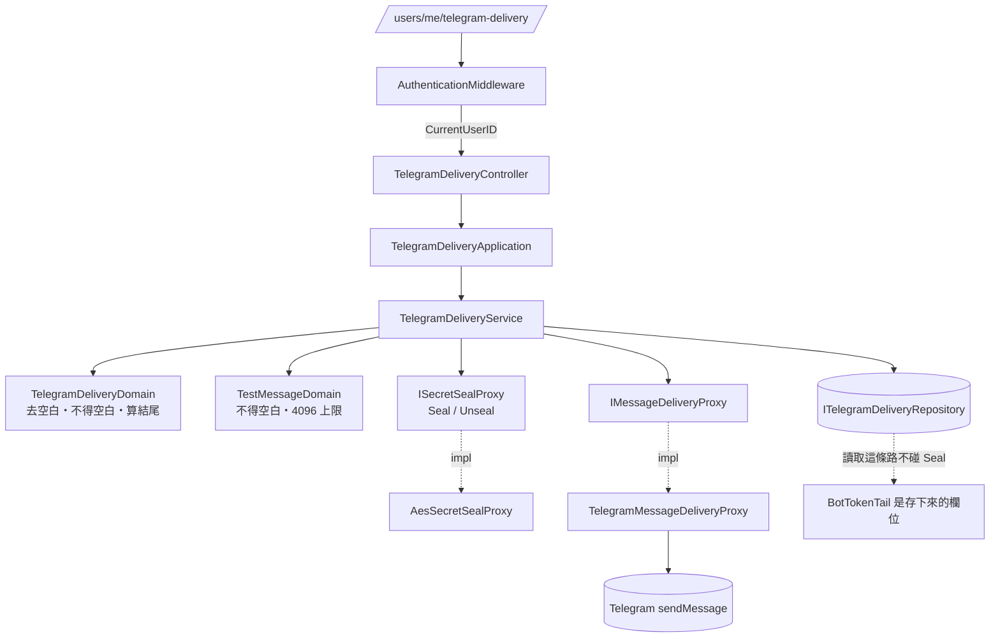

# Telegram 投遞 — Architecture Design

**Status:** Draft
**Source PRD:** `.sdd/2026-09-10-telegram-delivery/PRD.md`
**Tech context:** Go · Gin · GORM · PostgreSQL · Clean/Onion（`internal/{controller,application,domain,infrastructure}`）

---

## 1. Design Goal & Guiding Principle

- **In one sentence:**
  讓一位使用者留下他自己的 Telegram 投遞設定、當場試送一則訊息，
  而**完整的機器人金鑰沒有任何一條讀得回來的路**，
  並讓「送到哪裡去」這件事從第一天起就不綁死 Telegram。

- **Guiding principle — 三個「型別上就辦不到」：**

  1. **金鑰交不出去，是型別上交不出去。**
     `dto.TelegramDeliveryDto` **結構上沒有放完整金鑰的欄位**，只有 `BotTokenTail`。
     沿用 `PublishedStrategyScriptDto` 已經證明過的做法：一條路忘了遮，整個功能的價值歸零，
     而忘記是遲早的——所以不靠紀律，靠編譯器。

  2. **讀設定完全不碰金鑰。** 金鑰結尾 `BotTokenTail` 是**存下來的一個欄位**，
     不是每次讀取時把上鎖的金鑰解開再截字。
     於是「讀取設定」這條路根本不呼叫解鎖，**解鎖只出現在送訊息那一條路上**。
     這讓最危險的那個動作只有一個呼叫點，而不是兩個。

  3. **「送訊息」與「送到 Telegram」是兩件事。**
     介面叫 `IMessageDeliveryProxy`（能力），實作叫 `TelegramMessageDeliveryProxy`（供應商）。
     PRD 的 Out of Scope 已經寫明下一刀是「自動把訊號送出去」，再下一刀很可能是「換一個管道」。
     介面綁死 Telegram 的話，那天就得多開一個介面，抽象即失效。

  第四件順帶的：**開不了鎖就不存**（PRD R5）。`ISecretSealProxy` 在沒有鑰匙時
  以 `ErrSecretSealUnavailable` 拒絕，**不提供任何「不上鎖直接存」的分支**——
  沿用 `ErrAccessTokenUnavailable` 的既有做法：系統缺一把它非有不可的鑰匙時，寧可拒絕也不假裝能做。

---

## 2. Change Scope

| Area | Action | What / Why |
| :--- | :--- | :--- |
| `entities.TelegramDelivery` | **Add** | 一位使用者那一份設定。`UserID` **唯一索引**（「每人最多一份」由 schema 保證，不由讀-再-寫保證）；`OnDelete:CASCADE` 掛在 `Users` 下 |
| `entities.User` | **Modify** | 加 `TelegramDelivery` 關聯宣告，讓「使用者不在了，那把鑰匙也不在」由 schema 保證，比照既有的 `Sessions []Session` |
| `domains.TelegramDeliveryDomain` | **Add** | 一份設定的規則：兩者不得空白、去前後空白、算出金鑰結尾。建構子驗完才存在 |
| `domains.TestMessageDomain` | **Add** | 一則測試訊息的規則：不得空白、去前後空白、至多 4096 個字元 |
| `domains.telegram_delivery_errors.go` | **Add** | 本切片的哨兵錯誤（見 §3） |
| `dto.TelegramDeliveryDto` | **Add** | 讀回來的形狀：`Configured`、`ChatID`、`BotTokenTail`、`ConfiguredAt`。**沒有放完整金鑰的欄位** |
| `dto.TelegramDeliveryWriteDto` | **Add** | 寫進去的形狀：`BotToken`、`ChatID` |
| `dto.TestMessageResultDto` | **Add** | 一次試送的結果：`Delivered bool`、`FailureReason vo.DeliveryFailureReasonVo` |
| `vo.DeliveryFailureReasonVo` | **Add** | 四種投遞失敗原因的具名取值。**它是回應裡的一個值，不是一句話**——畫面靠它分辨，不讀訊息文字 |
| `vo.MessageDeliveryCredentialVo` | **Add** | 交給投遞管道的東西：以什麼身分說話、送到哪裡。**這是唯一一個裝得下完整金鑰的型別**，而它只在 domain → infrastructure 這一段存在，永遠不往回走 |
| `ITelegramDeliveryRepository` | **Add** | 這張表的讀寫。`Upsert` 一次呼叫完成「有就覆蓋、沒有就新增」 |
| `ISecretSealProxy` | **Add** | 上鎖／開鎖的能力。**以能力命名**：換一套加密方式是換一個實作 |
| `IMessageDeliveryProxy` | **Add** | 「把一段話送到某個地方」的能力。**不綁供應商** |
| `security.AesSecretSealProxy` | **Add** | `ISecretSealProxy` 的實作（AES-GCM，鑰匙來自設定）。放既有的 `internal/infrastructure/security/` |
| `internal/infrastructure/messaging/` | **Add** | 新資料夾，放 `TelegramMessageDeliveryProxy` 與它的 wire 型別 |
| `service.TelegramDeliveryService` | **Add** | 四個公開用例：讀、寫、移除、試送。彼此不呼叫 |
| `application.TelegramDeliveryApplication` | **Add** | 對應的用例編排 |
| `controller.TelegramDeliveryController` | **Add** | 四條路由的 HTTP 轉換 |
| `models.TelegramDeliveryRequest` / `models.TestMessageRequest` | **Add** | 兩個 body 形狀 |
| `config.ApplicationConfig` | **Modify** | 加 `Secrets.SealKey`（`SECRET_SEAL_KEY`，**無預設值**）與 `Telegram{ApiBaseUrl, RequestTimeout}` |
| `persistence.SchemaMigrator` | **Modify** | 註冊 `entities.TelegramDelivery` |
| `cmd/server/dependencies.go` | **Modify** | 組裝並註冊四條路由，**全部掛在既有的 `requiresSignIn` 後面** |
| `middlewares.AuthenticationMiddleware` | **Not touched** | 門已經在了 |
| 使用者、登入階段、策略腳本、K 線、回測 | **Not touched** | 這一刀只長出一個新的、與它們平行的東西。**沒有任何既有流程會開始送訊息**——那是下一刀 |
| 背景 job | **Not touched** | 本切片沒有任何自動投遞，因此沒有 job。`IBackgroundJob` 一個都不加 |

---

## 3. New Classes / Modules

| Name | Kind | Responsibility (purpose) | Collaborators | Satisfies (PRD scenario) |
| :--- | :--- | :--- | :--- | :--- |
| `entities.TelegramDelivery` | Entity | 一位使用者那一份設定的事實：`UserID`（唯一）、`SealedBotToken`、`BotTokenTail`、`ChatID`、時間。**乾淨資料模型**，只有欄位、持久化標註與 `ToDto()` | `User` | US-01 全部、US-02 全部 |
| `domains.TelegramDeliveryDomain` | Domain Model | 一份設定的**全部規則**：去前後空白、兩者不得空白、算出金鑰結尾。建構子驗完才生得出實例 | `TelegramDeliveryWriteDto` | US-01 的 3/4/5 |
| `domains.TestMessageDomain` | Domain Model | 一則測試訊息的**全部規則**：去前後空白、不得空白、至多 4096 個字元（**拒絕，不截斷**） | — | US-04 的 3/4/5 |
| `dto.TelegramDeliveryDto` | DTO | 讀回來的樣子。**型別上放不下完整金鑰** | — | US-02 的 1 |
| `dto.TelegramDeliveryWriteDto` | DTO | 寫進去的樣子 | — | US-01 的 1 |
| `dto.TestMessageResultDto` | DTO | 一次試送的結果：成功與否 + 失敗原因取值 | `vo.DeliveryFailureReasonVo` | US-05 全部 |
| `vo.DeliveryFailureReasonVo` | VO | 四種失敗原因的具名取值：`credentialRejected` / `destinationNotFound` / `unreachable` / `timedOut`，加上「沒有失敗」的空值 | — | US-05 全部 |
| `vo.MessageDeliveryCredentialVo` | VO | 投遞管道需要知道的兩件事：以什麼身分說話（完整金鑰）、送到哪裡。**單向的**——domain 造它、infrastructure 用它，沒有任何路徑把它變回 DTO | — | US-04 的 6 |
| `ITelegramDeliveryRepository` | Interface | 這張表的讀寫 | — | US-01、US-03、US-06 |
| `ISecretSealProxy` | Interface | 上鎖與開鎖。鑰匙不在時**兩個方法都拒絕** | — | US-02 的 3/4 |
| `IMessageDeliveryProxy` | Interface | 把一段話送到某個地方，並說得出送不出去時是哪一種 | `vo.MessageDeliveryCredentialVo` | US-04、US-05 |
| `security.AesSecretSealProxy` | Proxy | AES-GCM 上鎖／開鎖。每次上鎖用新的隨機 nonce | — | US-02 的 3/4 |
| `messaging.TelegramMessageDeliveryProxy` | Proxy | 打 Telegram 的 sendMessage，把它的回答**正規化成四種失敗原因之一** | `vo.DeliveryFailureReasonVo` | US-05 全部 |
| `service.TelegramDeliveryService` | Domain Service | 四個公開用例的唯一入口 | 上述全部 | 全部 US |
| `application.TelegramDeliveryApplication` | Application | 用例編排 | `TelegramDeliveryService` | 全部 US |
| `controller.TelegramDeliveryController` | Controller | HTTP 轉換與狀態碼對映 | `TelegramDeliveryApplication` | 全部 US |

### 哨兵錯誤（`domains/telegram_delivery_errors.go`）

| 錯誤 | 意思 | 狀態碼 |
| :--- | :--- | :--- |
| `ErrTelegramDeliveryValidation` | 金鑰或聊天室代號或訊息壞了規則 | 400 |
| `ErrTelegramDeliveryNotConfigured` | 還沒設定過就要試送 | 409 |
| `ErrSecretSealUnavailable` | **系統**沒有鑰匙，存不了也開不了。不是使用者填錯了什麼 | 503 |

> 注意：**四種投遞失敗原因不是錯誤。** 它們是一次成功執行的試送所得到的結果，
> 見下方 §4「試送為什麼回 200」。

### `ISecretSealProxy` 的介面（深模組檢查）

```go
// ISecretSealProxy 把一段必須讀得回來的祕密鎖起來，以及把它打開。
//
// 它與 IPasswordProofProxy 是兩件不同的事，而差別正是它存在的理由：密碼證明算不回去，
// 因為系統從來不需要密碼本身；機器人金鑰**必須讀得回來才用得了**，所以它只能被鎖起來。
// 把後者塞進前者，或反過來，都會讓其中一邊變成錯的那一種。
//
// 沒有鑰匙時兩個方法都回 ErrSecretSealUnavailable。**這裡沒有「就先不上鎖」的分支**：
// 那樣設定會看起來成功、訊息也送得出去，只有被偷的那一天不一樣，而且沒有人會發現。
type ISecretSealProxy interface {
    Seal(plaintext string) (string, error)
    Unseal(sealed string) (string, error)
}
```

- 兩個方法互為反向，**沒有第三個**。呼叫端不需要先問「你有鑰匙嗎」——沒有鑰匙就從 `Seal` 回錯。
- 同一段明文鎖兩次得到兩個不同的結果（每次新的隨機 nonce），
  所以留存的內容看不出兩個人是不是用了同一把金鑰。

### `IMessageDeliveryProxy` 的介面（深模組檢查）

```go
// IMessageDeliveryProxy 把一段話送到某個地方。
//
// 它以「能力」命名而不是以 Telegram 命名，因為送訊息這件事的供應商是會換的，而換的那一天
// 這一行不該動。今天唯一的實作是 TelegramMessageDeliveryProxy。
type IMessageDeliveryProxy interface {
    // Deliver 送出一則訊息。送成功回 DeliveryFailureNone；送不出去回四種原因之一，
    // 且 **error 為 nil**——「對方拒絕了」是一次成功的詢問所得到的答案，不是這次呼叫失敗。
    // 只有這一側自己壞掉（造不出請求、讀不出回應）才回 error。
    Deliver(
        executionContext context.Context,
        credential vo.MessageDeliveryCredentialVo,
        message string,
    ) (vo.DeliveryFailureReasonVo, error)
}
```

- **一次呼叫＝一件完整的業務動作**：呼叫端不必先建連線、再送、再關。
- 把「四種原因」放在回傳值而不是四個 error 型別，是因為呼叫端要做的事是**照原樣轉達**，
  不是分四條路走。四個 error 會讓每一個呼叫端都寫一次四路 switch。
- 正規化（Telegram 的各種回答 → 四種之一）**全部關在實作裡**，
  domain 認不得 Telegram 的任何一個代碼或字串。

### `ITelegramDeliveryRepository` 的介面（深模組檢查）

```go
type ITelegramDeliveryRepository interface {
    // FindOneByUser 回這位使用者那一份，或 ErrTelegramDeliveryNotConfigured。
    FindOneByUser(executionContext context.Context, userID uint) (entities.TelegramDelivery, error)
    // Upsert 留下這一份：這位使用者已經有一份就整份覆蓋，沒有就新增。
    //
    // 一次呼叫而不是「先查、沒有再存」，理由與 IUserRepository.Save 相同：查與寫是兩個
    // 時刻，兩發同時到達的設定都會查到「沒有」，然後各存一份。唯一索引才是真正讓
    // 「每人最多一份」成立的東西，而 Upsert 是說出這件事的方法。
    Upsert(executionContext context.Context, delivery entities.TelegramDelivery) (entities.TelegramDelivery, error)
    // DeleteByUser 移除這位使用者那一份。**沒有那一份不是失敗**——要的狀態已經達成。
    DeleteByUser(executionContext context.Context, userID uint) error
}
```

---

## 4. Modified Components

| Component | Current role | Change needed |
| :--- | :--- | :--- |
| `entities.User` | 使用者的資料模型 | 加 `TelegramDelivery *TelegramDelivery` 關聯並宣告 `OnDelete:CASCADE`，讓「使用者不在了，那把鑰匙也不在」由 schema 保證 |
| `config.ApplicationConfig` | 全部設定 | 加 `Secrets SecretsConfig{ SealKey string }`（`SECRET_SEAL_KEY`，**無預設值，比照 `AUTH_ACCESS_TOKEN_SIGNING_KEY`**）與 `Telegram TelegramConfig{ ApiBaseUrl, RequestTimeout }`（`TELEGRAM_API_BASE_URL` 預設 `https://api.telegram.org`、`TELEGRAM_REQUEST_TIMEOUT_SECONDS` 預設 10） |
| `persistence.SchemaMigrator` | code-first 同步 schema | 註冊 `&entities.TelegramDelivery{}` |
| `cmd/server/dependencies.go` | 組裝與路由 | 組一條線並註冊四條路由 |

### 路由與狀態碼

| 路由 | 動作 | 成功 | 失敗 |
| :--- | :--- | :--- | :--- |
| `GET /users/me/telegram-delivery` | 讀 | 200 + `TelegramDeliveryDto`（沒設定過時 `configured: false`） | 401 門／502 讀不到 |
| `PUT /users/me/telegram-delivery` | 寫（覆蓋語意，所以是 PUT 不是 POST） | 200 + `TelegramDeliveryDto` | 400 不合規／401 門／**503 系統沒鑰匙**／502 |
| `DELETE /users/me/telegram-delivery` | 移除 | **204**（沒設定過也是 204，比照 `RevokeSession`） | 401 門／502 |
| `POST /users/me/telegram-delivery/test-message` | 試送 | **200 + `TestMessageResultDto`** | 400 訊息不合規／**409 還沒設定**／401 門／503 開不了鎖／502 |

### 試送為什麼回 200 而不是 502

四種投遞失敗原因**不用狀態碼區分**，而是放在 200 的回應內容裡，理由有三：

1. **那顆鍵的用途就是回報結果。** 「送不出去，因為聊天室代號不對」是這次試送**成功產出的答案**，
   不是這次請求失敗。用 502 表達它，等於說「系統壞了」——而系統好得很。
2. **四種要能分辨。** 用狀態碼要湊出四個各不相同又語意不彆扭的碼，湊不出來；
   湊出來的那一組，下一種原因出現時又要再湊一次。
3. **前端的既有做法就是這樣。** 前端 UL-MAP 對「三種算不出來」已經寫明：
   **靠回應帶了哪一個值分辨，不讀訊息文字**。這裡沿用同一條。

真正的 4xx／5xx 留給**這次試送根本沒跑起來**的情況：訊息不合規（400）、
還沒設定（409）、系統開不了鎖（503）。

---

## 5. Component Relationships



---

## 6. Extensibility & Handoff Notes

- **Most likely next requirement:**
  **把交易訊號／回測結果自動送到 Telegram**（PRD Out of Scope 的第一項，幾乎確定是下一刀）。
  其次是**換一個投遞管道**（Line、電子郵件），再其次是**一個人多個聊天室**。

- **Where it lands:**
  - **自動投遞**落在一個新的 `internal/job/` 背景 job 加一個新的 domain service，
    它會呼叫**本切片已經鋪好的** `IMessageDeliveryProxy` 與 `ITelegramDeliveryRepository`。
    本切片的東西**一個字都不必改**——這正是把「送訊息」與「試送訊息」分開的目的：
    `IMessageDeliveryProxy` 不知道自己送的是不是測試訊息。
  - **換管道**落在 `IMessageDeliveryProxy` 的第二個實作。
    介面已經以能力命名，所以那天不必開第二個介面。
    要同時支援兩種管道時，比照既有的 `market_routed_market_data_proxy.go`——
    加一個依管道分派的實作，上面的 service 不變。
  - **一人多聊天室**是 `TelegramDelivery` 的 `UserID` 唯一索引改成 `(UserID, ChatID)`，
    以及 repository 的 `FindOneByUser` 變成 `FindAllByUser`。
    這是本切片**唯一**會被下一個需求改到的形狀，接受它：
    今天做成多筆，會讓每一條路都要先決定「送到哪一個」，而今天沒有人需要做那個決定。

- **How to add it（自動投遞的 add-only 路徑）:**
  1. 新增 `job.SignalDeliveryJob`，實作既有的 `IBackgroundJob`。
  2. 在 `dependencies.go` 的背景 job 清單多一筆。
  3. 它注入既有的 `ITelegramDeliveryRepository`、`ISecretSealProxy`、`IMessageDeliveryProxy`。
  **不必**改本切片任何一個介面、entity 或 service。

- **Patterns applied & why:**
  - **能力抽象命名**（`IMessageDeliveryProxy` / `ISecretSealProxy`）：對準真正的變動軸。
  - **型別即遮蔽**（`TelegramDeliveryDto` 沒有金鑰欄位）：沿用 `PublishedStrategyScriptDto`。
  - **正規化關在 proxy 裡**（Telegram 的回答 → 四種原因）：
    沿用 `BinanceMarketDataProxy` 把 wire 格式擋在 domain 外面的既有做法。
  - **建構子即驗證**：沿用 `PasswordDomain`、`EmailDomain`。

- **Do not hardcode:**
  - **Telegram 的網址與等待上限**一律走設定（`TELEGRAM_API_BASE_URL`、
    `TELEGRAM_REQUEST_TIMEOUT_SECONDS`）——測試要指到替身，正式要指到本尊。
  - **4096** 與**遮罩保留 4 個字**是 domain 的常數，不是設定：
    前者是 Telegram 的事實，後者是安全決定，兩者都不該讓部署去調。
  - **`SECRET_SEAL_KEY` 絕對不給預設值。** 有預設值的鑰匙就是大家都知道的鑰匙，
    等同不上鎖——而它會看起來在上鎖。比照 `AUTH_ACCESS_TOKEN_SIGNING_KEY`。

- **Known debt / deferred:**
  - **鑰匙不能輪替。** 換掉 `SECRET_SEAL_KEY` 之後，既有的每一份設定都開不了，
    使用者必須重填金鑰。本切片接受它（只有一位使用者、金鑰重填成本低）。
    **重新考慮的訊號**：使用者不只一位，或設定裡開始有重填成本高的東西。
    屆時的做法是在 `SealedBotToken` 前面加一個鑰匙代號，`ISecretSealProxy` 依代號選鑰匙——
    介面不變，只是實作認得多把。
  - **試送不限頻率。** 門後面的路，且沒有任何自動觸發。
    **重新考慮的訊號**：這個系統開始有第二個人用。
  - **送出紀錄不留。** 下一刀做自動投遞時一定會需要（「這一則送出去了嗎」），
    但今天留了也沒有人讀。

---

## 7. Traceability

| PRD Scenario | Fulfilled by |
| :--- | :--- |
| US-01 第一次設定 | `TelegramDeliveryService.SaveDeliverySetting` + `ITelegramDeliveryRepository.Upsert` |
| US-01 再設定一次是覆蓋 | `Upsert` + `entities.TelegramDelivery` 的 `UserID` 唯一索引 |
| US-01 金鑰／聊天室代號不得為空白、前後空白不予保留 | `domains.TelegramDeliveryDomain` 建構子 |
| US-01 沒有登入 | `middlewares.AuthenticationMiddleware`（→ 401） |
| US-02 讀回設定只看得到金鑰結尾 | `dto.TelegramDeliveryDto` **型別上沒有金鑰欄位** + 存下來的 `BotTokenTail` |
| US-02 很短的金鑰仍然遮到拼不回去 | `TelegramDeliveryDomain` 算結尾時，金鑰長度不足時**回空結尾**而不是整串 |
| US-02 留存處沒有可以直接拿去用的金鑰 | `AesSecretSealProxy.Seal`；`SealedBotToken` 是密文 |
| US-02 系統開不了鎖時寧可拒絕 | `ErrSecretSealUnavailable`（→ 503），`Seal` 沒有「不上鎖」的分支 |
| US-02 還沒設定過不是錯誤 | `TelegramDeliveryDto{Configured: false}`，200 |
| US-03 看不到／改不動別人的 | 使用者識別碼一律來自 `middlewares.CurrentUserID`；`FindOneByUser` / `Upsert` / `DeleteByUser` **每一個都以 `userID` 收斂**，request body 裡**沒有欄位放得下別人的識別碼** |
| US-04 送得出去 | `TelegramDeliveryService.SendTestMessage` + `IMessageDeliveryProxy.Deliver` |
| US-04 還沒設定就送不了 | `ErrTelegramDeliveryNotConfigured`（→ 409） |
| US-04 空白訊息／4096／4097 | `domains.TestMessageDomain` 建構子 |
| US-04 用的是存起來的那一份設定 | service 取 `FindOneByUser` 的結果造 `MessageDeliveryCredentialVo`；**request body 裡沒有欄位放得下金鑰** |
| US-05 四種原因彼此不同 | `vo.DeliveryFailureReasonVo` 四個取值 + `TelegramMessageDeliveryProxy` 的正規化 |
| US-05 等太久 | `TelegramConfig.RequestTimeout` → `context.WithTimeout` → `DeliveryTimedOut` |
| US-05 已存的設定原封不動 | `SendTestMessage` **只讀不寫**，沒有任何寫入路徑 |
| US-06 移除／沒有設定也不算失敗／移除的是自己的 | `DeleteByUser` + 204 |

---

## 8. Risks & Open Decisions

- **Risks / trade-offs:**
  - **金鑰漏進紀錄檔**是比留存處被偷更常見的外洩途徑。
    最危險的兩處：(a) `TelegramMessageDeliveryProxy` 把請求連同網址一起記下來——
    Telegram 的網址**本身就帶著金鑰**（`/bot<token>/sendMessage`）；
    (b) 轉達 Telegram 的錯誤訊息時把整個請求貼回來。
    **實作硬性要求：這個 proxy 的任何紀錄與任何往上傳的訊息都不得包含網址原文。**
  - **`SECRET_SEAL_KEY` 沒設定時整個功能不能用。** 這是刻意的，但會在第一次部署絆倒人。
    緩解：503 的訊息要**明說是哪一項系統設定沒給**，比照 `ErrAccessTokenUnavailable` 的既有做法。
  - **試送回 200 是本專案第一次「失敗也回 200」。** 它的界線必須寫清楚
    （見 §4），否則下一個人會把 502 也搬進 200 裡。
  - **`internal/infrastructure/messaging/` 是新資料夾。** 只放投遞管道，不是雜物櫃。

- **Open decisions (for implementation):**
  - `SECRET_SEAL_KEY` 的編碼（建議 base64 的 32 位元組，長度不對即視同沒有鑰匙）。
  - `SealedBotToken` 欄位長度（AES-GCM 密文 + nonce 以 base64 表示，`size:512` 綽綽有餘）。
  - Telegram 的哪些回答對映到哪一種失敗原因——
    金鑰不對與聊天室不對在它那邊都是 4xx，要靠回應內容分辨；
    **分不出來時歸到「連不上」而不是猜**，並如實附上它說的那句話（先確認裡面沒有金鑰）。
  - Postman 集合的四個新項目。
