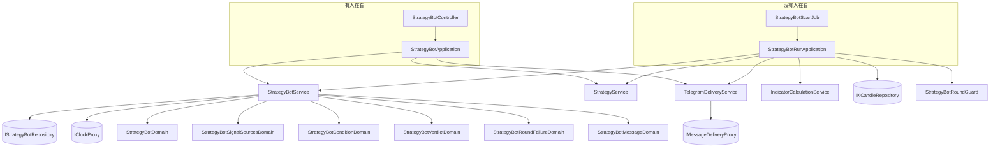
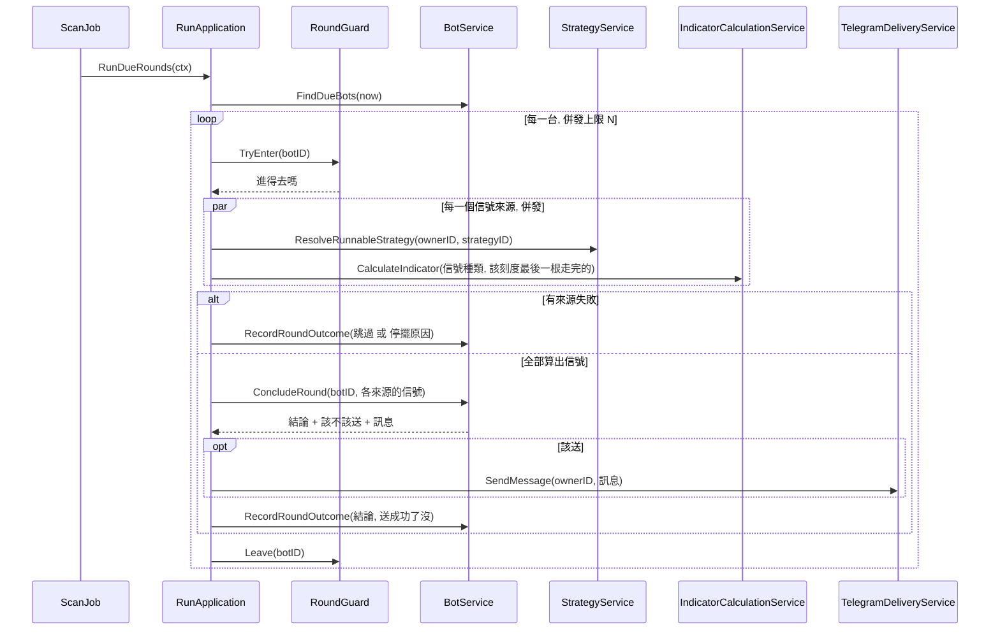

# 策略機器人 — Architecture Design

**Status:** Confirmed
**Source PRD:** `.sdd/2026-09-16-strategy-bot/PRD.md`
**Tech context:** Go 1.26 · Gin · GORM / PostgreSQL · yaegi · Clean / Onion Architecture

---

## 1. Design Goal & Guiding Principle

- **In one sentence:**
  讓一台由使用者組起來的機器人，在沒有人看著的時候，每隔幾分鐘把幾支策略各跑一次、
  照兩棵條件樹判出一個信號，並**只在信號變了的時候**送到他的 Telegram——
  而且這件事的「在不在跑」活在資料庫裡，不活在記憶體裡。

- **Guiding principle:**
  **把「一輪失敗了該怎麼辦」收斂成一個領域模型。**
  這一刀最容易腐爛的地方不是條件求值（那是純函式），而是散落在各處的
  `if err != nil { 要停嗎？還是跳過？ }`。既有的哨兵錯誤與四種投遞失敗原因
  **已經把兩類失敗分得乾乾淨淨**，所以設計上只需要**一個** `StrategyBotRoundFailureDomain`
  把「任何一個錯誤」翻成「跳過這一輪」或「停下這台並記下停擺原因」。
  下一種失敗出現時，改的是那一個模型，不是每一個呼叫點。

---

## 2. Change Scope

| Area | Action | What / Why |
| :--- | :--- | :--- |
| `internal/domain/models/entities/` | **Add** | `StrategyBot`、`StrategyBotSignalSource`、`StrategyBotSignalSourceParameterValue`、`StrategyBotConditionNode` 四個乾淨 Data Model |
| `internal/domain/models/domains/` | **Add** | 六個領域模型，見 §3。所有業務規則都在這裡 |
| `internal/domain/models/vo/` | **Add** | `ConditionOperatorVo`、`StrategyBotRunStateVo`、`StrategyBotVerdictVo`、`StrategyBotHaltReasonVo` |
| `internal/domain/models/dto/` | **Add** | `StrategyBotDto`（含巢狀的來源與條件形狀）、`StrategyBotWriteDto`、`StrategyBotRoundDto` |
| `internal/domain/interface/` | **Add** | `IStrategyBotRepository` 一個介面 |
| `internal/domain/service/` | **Add** | `StrategyBotService` 一個 domain service |
| `internal/infrastructure/persistence/` | **Add** | `StrategyBotRepository`；`schema_migrator.go` 加入四個新 entity |
| `internal/application/` | **Add** | `StrategyBotApplication`（管理用例）、`StrategyBotRunApplication`（跑輪）、`StrategyBotRoundGuard` |
| `internal/controller/` | **Add** | `StrategyBotController` 與七條路由 |
| `internal/job/` | **Add** | `StrategyBotScanJob` |
| `internal/domain/service/telegram_delivery_service.go` | **Modify** | 多一個公開方法 `SendMessage`，與 `SendTestMessage` 共用一個私有的「取設定 → 開鎖 → 投遞」helper |
| `internal/config/` | **Modify** | 三個新環境變數（掃描間隔、同時輪次上限、一輪等待上限） |
| `cmd/server/dependencies.go` | **Modify** | DI 組裝、路由註冊、把新 job 加進背景工作清單 |
| **既有的指標計算** | **Not touched** | 機器人**不改動**執行指標計算的任何一行。它是**呼叫端**，走既有的「宣告信號種類」那條路 |
| **既有的回測** | **Not touched** | 回測只認單一一支策略。把它擴到條件樹是另一刀（PRD 明列 Out of Scope） |
| **既有的策略 CRUD 與市集** | **Not touched** | 機器人只**讀**可用策略，用的是既有的 `ResolveRunnableStrategy` 三道關卡 |
| **`IMessageDeliveryProxy`** | **Not touched** | 它的註解已經預言了這一天：「Sending a message somebody typed and sending one the system generated are the same act」。介面一個字都不用改 |
| **K 線匯入** | **Not touched** | 機器人讀的是既有的 K 線；它的即時性上限就是匯入的即時性 |

---

## 3. New Classes / Modules

### Entities（乾淨 Data Model，只有欄位與持久化標註）

| Name | Kind | Responsibility (purpose) | Collaborators | Satisfies |
| :--- | :--- | :--- | :--- | :--- |
| `StrategyBot` | Entity | 一台機器人的欄位：擁有者、名稱、交易標的、觸發間隔、執行狀態、下次觸發時刻、上一次送出的信號、停擺原因、衝突記號、建立與修改時間。名稱帶 **`(OwnerID, Name)` 唯一索引** | — | 名稱重複、兩人同名、重啟後續跑 |
| `StrategyBotSignalSource` | Entity | 一個信號來源的欄位：所屬機器人、來源代號、指名的策略、彙總刻度。帶 **`(StrategyBotID, Label)` 唯一索引** | — | 代號重複、各跑各的刻度 |
| `StrategyBotSignalSourceParameterValue` | Entity | 一個來源這次要用的一個參數值：參數名稱與值 | — | 同一支策略當成兩個來源 |
| `StrategyBotConditionNode` | Entity | 條件樹的一個節點：所屬機器人、所屬那一棵（買入／賣出）、父節點、群組的運算子、葉子的來源代號與期望信號、兄弟之間的次序 | — | 巢狀條件、群組、信號比對 |

> **四個 entity 只有一個 repository。** 沿用 `StrategyParameter` 已經立下的先例：
> 來源、參數值與條件節點**從來不會被單獨讀、單獨建、單獨刪**，它們跟著機器人走。
> 為它們各開一個 repository，等於開三扇沒有人該走的門。
> 刪除靠 GORM 的 `constraint:OnDelete:CASCADE` 完成——**沒有任何 Go 程式碼執行它，
> 所以沒有任何 Go 程式碼忘得掉它**（與 `Strategy.Publication` 同一個理由）。

### Domain Models（業務行為的所在地）

| Name | Kind | Responsibility (purpose) | Collaborators | Satisfies |
| :--- | :--- | :--- | :--- | :--- |
| `StrategyBotDomain` | Domain Model | **一台機器人的規則與狀態轉換**：名稱與觸發間隔的驗證、啟動（清空上次信號與停擺原因、下次觸發時刻設為現在）、停止、被停擺、改不改得動、跑完一輪之後下次觸發時刻怎麼算 | `StrategyBotConditionDomain`、`StrategyBotSignalSourcesDomain` | 啟動立刻跑第一輪、重複啟動、執行中改不動、錯過的不補跑 |
| `StrategyBotSignalSourcesDomain` | Domain Model | **那幾個信號來源合起來的規則**：代號不得空白與重複、數量上限 10、參數名稱必須對得上該策略宣告的、交出每一個要跑的計算請求 | — | 代號重複、來源上限、參數名稱對不上 |
| `StrategyBotConditionDomain` | Domain Model | **一棵條件樹**：形狀驗證（深度 ≤ 5、節點數 ≤ 32、群組至少兩個子條件、代號必須宣告過、樹不得為空）與**求值**（給一組「代號 → 信號」，回成立或不成立） | — | 每一個條件形狀與求值的情境 |
| `StrategyBotVerdictDomain` | Domain Model | **兩棵樹的結果 → 這一輪的結論**（買入／賣出／沒有結論／衝突），以及**與上一次送出的信號比對後該不該送** | — | 衝突、沒有結論、只在信號變了才送、中間那一輪不吃掉變化 |
| `StrategyBotRoundFailureDomain` | Domain Model | **把一次失敗翻成「跳過這一輪」或「停下並記下停擺原因」**。認得既有的哨兵錯誤與四種投遞失敗原因 | — | 一輪出錯時停還是不停的全部九個情境 |
| `StrategyBotMessageDomain` | Domain Model | **把一輪的結論寫成一則訊息**：第一行信號＋機器人＋標的，第二行參考價與參考時刻，之後逐一列出每個來源說了什麼 | — | 訊息說得出判斷的依據 |

> **`StrategyBotVerdictDomain` 為什麼把「該不該送」也收進來**：
> 「這一輪說什麼」與「要不要講出來」看似兩件事，但它們**共用同一個理由會改**——
> 那個理由就是「衝突與沒有結論都不算一個意見」。分成兩個模型的話，
> 這條規則得在兩個地方各寫一次，而它們遲早會對不上。

### Interface · Service · Application · Controller · Job

| Name | Kind | Responsibility (purpose) | Collaborators | Satisfies |
| :--- | :--- | :--- | :--- | :--- |
| `IStrategyBotRepository` | Interface | 機器人的持久化契約：連同來源、參數值與條件節點**整棵一起**讀寫 | — | 全部 |
| `StrategyBotRepository` | Repository | GORM 實作。整棵讀（`Preload`）、整棵覆寫（先清後寫子節點，交易內） | GORM | 全部 |
| `StrategyBotService` | Domain Service | **機器人這個聚合的唯一入口**：建立、列出、讀取、修改、刪除、啟動、停止、找出到期的、記下一輪的結果 | `IStrategyBotRepository`、`IClockProxy`、六個領域模型 | 管理與啟停的全部情境 |
| `StrategyBotApplication` | Application | **管理用例的編排**：建立與修改時要先問 `StrategyService` 那幾支策略看不看得到、參數宣告了什麼；啟動時要先問 `TelegramDeliveryService` 設定好了沒 | `StrategyBotService`、`StrategyService`、`TelegramDeliveryService` | 三道關卡、沒設定就啟動不了 |
| `StrategyBotRunApplication` | Application | **跑輪的編排，一個方法把整件事包起來**：`RunDueRounds(ctx)`。內部：取到期清單 → 併發跑（有上限）→ 每一台各自解析策略、算指標、判結論、送訊息、記結果 | `StrategyBotService`、`StrategyService`、`IndicatorCalculationService`、`TelegramDeliveryService`、`IKCandleRepository`、`StrategyBotRoundGuard` | 跑一輪的全部情境 |
| `StrategyBotRoundGuard` | （執行機制，不是 model） | **同一台機器人同一時間只跑一輪**。行程內的一組「正在跑的機器人識別碼」，`sync.Mutex` 保護 | — | 上一輪還沒跑完就不排下一輪 |
| `StrategyBotController` | Controller | 七條路由的請求／回應轉換與參數綁定 | `StrategyBotApplication` | 全部 HTTP 情境 |
| `StrategyBotScanJob` | Job | 每隔掃描間隔呼叫 `RunDueRounds` 一次。實作既有的 `IBackgroundJob` | `StrategyBotRunApplication` | 排程、總開關、重啟後續跑 |

> **深度檢查。** `StrategyBotRunApplication.RunDueRounds(ctx)` 只有一個參數、一個回傳，
> 而它背後藏著解析策略、併發計算、條件求值、投遞與失敗分類。
> Job 不排列任何步驟，也不知道上面任何一個名字——這正是「簡單介面、複雜內臟」。
> 反過來說，**沒有任何一個新介面要求呼叫端連打兩通才完成一件業務事**。

---

## 4. Modified Components

| Component | Current role | Change needed |
| :--- | :--- | :--- |
| `TelegramDeliveryService` | 管一個人的投遞設定，並送得出他自己打的測試訊息 | **多一個公開方法 `SendMessage(ctx, ownerID, message)`**，回傳既有的 `DeliveryFailureReasonVo`。它與 `SendTestMessage` **不互相呼叫**（domain service 的公開用例方法互不呼叫），而是**共用一個私有 helper**「取設定 → 開鎖 → 投遞」——這個 private 被兩個公開方法用到，過得了 inline 門檻。測試訊息那條路仍然獨有它自己的 4096 字上限與空白驗證，機器人這條路不經過它（訊息是系統生的） |
| `schema_migrator.go` | 啟動時把 entity 同步成資料表 | 加入四個新 entity |
| `internal/config` | 讀環境變數 | `STRATEGY_BOT_SCAN_INTERVAL_SECONDS`（預設 60）、`STRATEGY_BOT_MAX_CONCURRENT_ROUNDS`（預設 4）、`STRATEGY_BOT_ROUND_TIMEOUT_SECONDS`（預設 120） |
| `cmd/server/dependencies.go` | 手動 DI 與路由註冊 | 組裝上列新元件、註冊七條路由（全部掛 `requiresSignIn`）、把 `StrategyBotScanJob` 加進背景工作清單 |

### 新路由

```
POST   /strategy-bots            建立
GET    /strategy-bots            列出自己的
GET    /strategy-bots/:id        讀一台
PUT    /strategy-bots/:id        修改（執行中拒絕）
DELETE /strategy-bots/:id        刪除（執行中也刪得掉）
POST   /strategy-bots/:id/run    啟動
DELETE /strategy-bots/:id/run    停止
```

> 啟動與停止用**同一個子資源的 POST 與 DELETE**，比照既有的
> `POST/DELETE /strategies/:id/publication`。兩者都是「讓一個狀態存在或不存在」，
> 也因此兩者天生冪等——重複按不算失敗這條規則，是這個形狀自己帶來的，
> 不是另外記得要寫的。

---

## 5. Component Relationships



### 一輪的內部序列



---

## 6. Extensibility & Handoff Notes

- **Most likely next requirement:** **回測一台機器人**——拿一段歷史把整套條件重演一遍。
  第二可能的是**條件裡比對信號以外的東西**（價格、時間、持倉）。

- **Where it lands:**
  - 回測機器人：`StrategyBotConditionDomain.Evaluate(代號 → 信號)` 是**純函式**，
    不碰時間、不碰資料庫、不碰網路。逐棒重演只要餵它每一棒的那一組信號即可，
    **一行都不用改**。要加的是一個新的 application，不是改既有的。
  - 條件的新種類：`StrategyBotConditionNode` 已經是「群組 或 葉子」的形狀，
    新的葉子種類是**多一種葉子**，`Evaluate` 多一個分支，樹的其餘部分不動。

- **How to add it:**
  - 新的停擺原因 → 在 `StrategyBotHaltReasonVo` 加一個值，在
    `StrategyBotRoundFailureDomain` 加一條對映。**其他地方一個字都不用改**，
    因為沒有任何呼叫點自己判斷過「這個錯誤要不要停」。
  - 新的投遞管道 → `IMessageDeliveryProxy` 已經以能力命名，換實作即可。
  - 新的條件運算子（例如「至少 N 個成立」）→ `ConditionOperatorVo` 加一個值，
    `StrategyBotConditionDomain` 的群組求值加一個分支。

- **Patterns applied & why:**
  - **Composite**（條件樹）——因為條件天生是遞迴的，用別的形狀表達它都會在
    「巢狀」那一刀崩掉。
  - **一個失敗分類模型**——把「停還是不停」這個軸收斂到一處，正是這一刀最會長的地方。
  - **狀態機在 entity 之外**（`StrategyBotDomain`）——entity 保持乾淨，
    符合 `.claude/rules/architecture.md`。

- **Do not hardcode:**
  - 掃描間隔、同時輪次上限、一輪等待上限**一律走設定**，且受既有的背景工作總開關約束。
  - 「哪些錯誤要停」**不得寫成呼叫點的 if**——一律問 `StrategyBotRoundFailureDomain`。
  - 上限數字（5 / 32 / 10 / 10 / 1440 / 128）是**業務規則**不是調校參數，
    寫成 domain 常數而非環境變數：它們一改，PRD 就得跟著改。

- **Known debt / deferred:**
  - **`StrategyBotRoundGuard` 是行程內的**。這是刻意的：留存的領取記號在行程崩潰後
    會把一台機器人**永遠卡住**，而行程內的記號隨重啟自然消失，那才是對的。
    **代價是它假設只有一個行程在跑。** 哪一天要跑第二個實例，這裡就要換成
    留存的領取記號加上一個到期時間——那是重看這一段的訊號。
  - **一輪不留紀錄。** 只留「上一次送出的信號」與「停擺原因」。
    使用者開始問「昨天為什麼沒收到」的時候，就是該加執行紀錄的時候。
  - **參考價固定取一分鐘 K 線**。多刻度之下沒有單一「那一根」，一分鐘是最誠實的選擇。
    要改成逐來源各報自己的那一根，改的是 `StrategyBotMessageDomain` 一個模型。

---

## 7. Traceability

| PRD Scenario（分組） | Fulfilled by |
| :--- | :--- |
| US-01 組起一台機器人、巢狀的條件 | `StrategyBotService` + `StrategyBotDomain` |
| US-01 代號重複、來源上限、參數名稱對不上 | `StrategyBotSignalSourcesDomain` |
| US-01 條件為空、群組只有一個子條件、深度／節點數上限、指到沒宣告的代號 | `StrategyBotConditionDomain` |
| US-01 指名一支看不到的策略 | `StrategyBotApplication` + 既有 `StrategyService.ResolveRunnableStrategy` |
| US-01 名稱重複、兩人同名 | `StrategyBot` 的 `(OwnerID, Name)` 唯一索引 + `StrategyBotService` |
| US-01 觸發間隔上下限、名稱長度 | `StrategyBotDomain` |
| US-01/US-06 沒有登入 | 既有 `requiresSignIn` 中介層 |
| US-02 兩個條件求值、巢狀、持有當條件 | `StrategyBotConditionDomain.Evaluate` |
| US-02 衝突、沒有結論、衝突自動消失 | `StrategyBotVerdictDomain` |
| US-02 每個來源照自己的刻度各跑一次 | `StrategyBotRunApplication` + `StrategyBotSignalSourcesDomain` |
| US-03 全部「該不該送」的情境 | `StrategyBotVerdictDomain` |
| US-03 停了再啟動重新送 | `StrategyBotDomain`（啟動時清空上次信號） |
| US-03 訊息說得出判斷的依據 | `StrategyBotMessageDomain` + `IKCandleRepository.FindLatest` |
| US-04 啟動立刻跑第一輪、重複啟停冪等 | `StrategyBotDomain` + `POST/DELETE :id/run` 的形狀 |
| US-04 沒有 Telegram 設定就啟動不了 | `StrategyBotApplication` + 既有 `TelegramDeliveryService.GetDeliverySetting` |
| US-04 執行中數量上限 | `StrategyBotService`（啟動前數自己執行中的幾台） |
| US-04 執行中改不動、執行中也刪得掉 | `StrategyBotDomain` + `StrategyBotService` |
| US-04 啟動時清掉停擺原因 | `StrategyBotDomain` |
| US-05 全部九個「停還是不停」情境 | `StrategyBotRoundFailureDomain` |
| US-06 列出、讀取、修改、刪除、看不到別人的 | `StrategyBotService` + `StrategyBotRepository` |
| US-07 重啟後自己繼續跑 | `StrategyBot.RunState` 留存 + `StrategyBotScanJob` |
| US-07 錯過的不補跑 | `StrategyBotDomain`（跑完之後下次觸發＝現在＋間隔） |
| US-07 上一輪沒跑完就不排下一輪 | `StrategyBotRoundGuard` |
| US-07 總開關關掉時不排、狀態不被改寫 | 既有 `BackgroundJobManager` 總開關；`StrategyBotScanJob` 不寫執行狀態 |

---

## 8. Risks & Open Decisions

- **Risks / trade-offs:**
  - **單行程假設。** `StrategyBotRoundGuard` 在記憶體裡，換成多實例部署就會重複跑。
    接受它，因為留存的領取記號在崩潰後會永遠卡住一台機器人，那是更糟的失敗。
  - **一輪的成本線性成長。** 每台每輪最多 10 次 yaegi 直譯執行加一次外部呼叫。
    唯一的煞車是三個上限（每人 10 台、每台 10 個來源、同時輪次上限）。
    個人側項目規模下足夠，但這是最先會撞到的牆。
  - **`StrategyBotRepository` 的整棵覆寫**（先清子節點再寫）在交易裡做。
    比差異比對簡單得多，而條件樹最多 32 個節點——差異比對省下的那幾筆寫入，
    換不回它帶來的複雜度。
  - **停擺無法主動通知。** 兩種停擺原因（金鑰、聊天室）正好就是通知管道壞掉，
    所以只能在清單上被看見。這是 PRD 已經接受的。

- **Open decisions (for implementation):**
  - `RecordRoundOutcome` 的確切形狀（要不要把「送成功了沒」與「結論」合成一個值物件）
    留給實作時決定，判準是**不要出現兩個欄位可以互相矛盾**——
    既有的 `DeliveryFailureReasonVo.ToDto()` 已經示範過這個判準。
  - 條件樹在 DTO 上的 JSON 形狀（巢狀物件 vs 扁平節點清單）留給實作時決定，
    但**前端拿到的必須是巢狀的**——扁平清單等於要求前端自己組樹。

---

## 9. 實作時與本設計的出入

實作過程中有三處偏離了上面的設計。三處都在當下判斷過，記在這裡而不是回頭改寫設計，
是因為**為什麼改**比改成什麼更值得留下。

### 9.1 領域模型從六個變成七個

設計把「一台機器人的規則」與「它的狀態轉換」合併在 `StrategyBotDomain`。
實作拆成兩個：`StrategyBotDomain`（寫入時的驗證，由 `StrategyBotWriteDto` 建構）與
`StrategyBotRunStateDomain`（一台已存在的機器人的生老病死，由 entity 建構）。

**逼出這個拆分的是 import 方向**：`domains` 會 import `entities`（為了 `ToEntity`），
所以 `entities` 不能反過來 import `domains`——`entity.toDomain()` 這條路走不通，
entity 只能**被傳進**一個 domain 模型的建構子（既有的 `NewStrategyAccessDomain` 正是如此）。
一個模型同時要能從 WriteDto 與從 entity 建構，在 Go 裡就是兩個建構子、兩組欄位、
兩種半空的狀態。拆成兩個之後，每個都只有一種建構方式，而且「存一台機器人」
這條路上再也沒有任何地方碰得到執行狀態。

### 9.2 信號來源不留策略名稱的副本

設計讓 `StrategyBotSignalSource` 帶一份 `StrategyName` 供清單顯示。實作拿掉了。

**理由是拿不到一份可信的副本**：既有的 `ResolveRunnableStrategy` 交出的
`RunnableStrategyDto` 只有算式、參數與種類，沒有名稱——它是為了「跑」而存在的形狀。
要填這個欄位，只能信呼叫端送來的字串，那就是一份**會過期、而且沒有人驗證過**的副本。
替代方案是為了顯示去擴 `RunnableStrategyDto`，那會把一個「跑」的形狀污染成
「跑＋顯示」的形狀。

拿掉之後也沒有損失：**來源代號本身就是名字**，它必填、同一台機器人內唯一、最長 32 字，
而且是**擁有者自己取的**——訊息裡寫「均線黃金交叉（1h）：賣出」比寫一份可能過期的
策略名稱更準確。

### 9.3 多一個 `StrategyBotRoundOutcomeDomain`，三個記錄方法併成一個

設計讓 `StrategyBotService` 有 `RecordRoundOutcome`／`HaltStrategyBot` 等數個方法，
並把確切形狀留給實作。第一版做成三個方法（finished／skipped／halted），
`/improve-codebase` 那一輪改成一個。

**改的理由是一種看不見的失敗**：一輪有四個出口，三個各自「記得」要把這一輪寫回去。
忘記任何一個，那台機器人的 `NextRunAt` 就不會前進——它會**立刻又到期**，
每秒對資料庫與 Telegram 全速重試，而從外面看它一切正常。
現在 `runOneRound` 只有一句「算出結果」加一句「寫回去」，寫不出一條沒有記錄的路徑。

`StrategyBotRoundOutcomeDomain` 的三個建構子則兌現了設計第 8 節留下的判準：
**不要出現兩個欄位可以互相矛盾**——一個帶旗標的結構說得出「跳過了，而這是它送出的信號」，
三個建構子說不出來。

### 9.4 參考價改走 `KCandleService`

設計把 `IKCandleRepository` 直接注入 `StrategyBotRunApplication`。
`/improve-codebase` 那一輪改成注入 `KCandleService`。

**理由是這個 codebase 裡沒有第二個 application 直接注入 repository**。
一個新切片自己開一種注入方式，等於在既有紋理上多一條縫。
`GetLatestKCandle` 加在 `KCandleService` 上也更對：那是一個關於 K 線的問題，
而 K 線的問題本來就住在那裡。

### 9.5 一輪的每一個領域判斷都回到 Domain Service

設計把 `playRound` 放在 application 層，讓它自己建 `StrategyBotRoundFailureDomain`、
`StrategyBotMessageDomain` 與三個 `RoundOutcome` 建構子。Code review 指出那違反
`.claude/rules/architecture.md`：「**Application**：依賴 Domain，呼叫 Domain Service
編排用例，拿回 **DTO**（全程不碰 entity / domain model）」。

檢查之後確認它說得對：這個 codebase 裡另外兩個 import `domains` 的 application
（`backtest`、`indicator_calculation`）都只是**收**一個傳進來的 `RunSubjectDomain`，
沒有一個自己建。

改法是把三件事移進 `StrategyBotService`：`ReadRoundFailure`、`ReadDeliveryFailure`、
`WriteRoundMessage`，並讓 `RecordRound` 收一個 `StrategyBotRoundOutcomeDto` 而不是
領域模型。`playRound` 現在只認得 DTO，`grep "domains\." internal/application/` 回零。

值得注意的是**這不是純粹的形式主義**：`ReadRoundFailure` 現在是「哪些失敗沒救」
這個問題**唯一**的答案處。原本它散在 application 的兩個分支裡，而那兩個分支
已經開始長出不同的內容——送出失敗那一條漏掉了「投遞設定被移除」。
