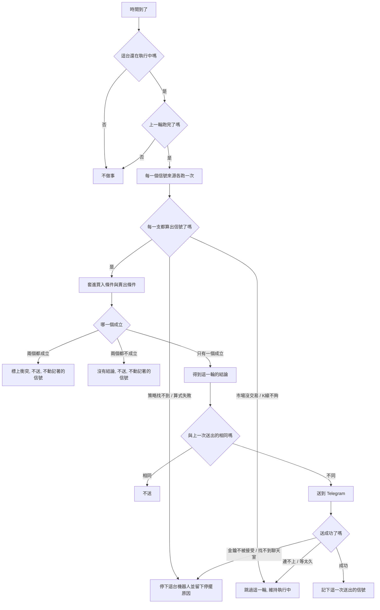

# Product Requirements Document (PRD)

**Feature:** 策略機器人
**Status:** Draft
**Version:** v1.0
**Owner:** James Hsueh
**Stakeholders:** Engineering

---

## 1. Background & Goal (Why & Goal)

- **Problem Statement:**
  這個系統會的兩件事——**執行指標計算**與**執行回測**——都必須有人在場才發生。
  兩者都是「問一次，答一次」，結果不留存，使用者關掉畫面它就什麼都不做了。

  `2026-09-10-telegram-delivery` 已經鋪好一條系統主動說話的路，但到目前為止
  **沿著那條路走的只有使用者自己打的測試訊息**。系統仍然沒有任何一件事，
  是在沒有人看著的時候自己做的。

  同時，一位使用者手上的策略是**各說各話的**：每一支各自吐一個信號，
  誰也不知道「甲說買、乙說賣」的時候到底該怎麼辦。系統沒有任何地方
  讓他把那個判斷**寫下來**。

- **Expected Outcome:**
  這一刀交出一台**策略機器人**。可驗證的結果有七項：

  1. 一位使用者組得出一台機器人：**幾個信號來源，加上買入與賣出兩個條件**。
  2. 他按下執行之後**離開**，系統每隔他指定的分鐘數自己跑一輪。
  3. 一輪跑完判出的信號**與上一次送出的不同時**，訊息**真的出現在他的 Telegram 裡**。
  4. **相同時一則都不送**——一台五分鐘的機器人連續成立一小時，只會送出一則。
  5. 買入與賣出條件**同時成立時，系統不替他挑一邊**：不送訊息，並在那台機器人上
     留下衝突的記號。
  6. **系統重新啟動之後，執行中的機器人自己繼續跑**，不需要任何人重按播放。
  7. 一輪失敗時，**會自己好的跳過這一輪、不會自己好的當場停下這台機器人並說出原因**。

- **Out of Scope:**
  - **下單、代操、任何真的會動到錢的事。** 這台機器人只說話。
  - **回測一台機器人**（拿歷史把整套條件重演一遍）。既有的回測只認單一一支策略。
  - **執行紀錄的留存與查詢**（哪一輪跑了什麼、送了什麼、什麼時候送的）。
    這一刀只留下判斷「該不該送」與「為什麼停了」所必需的最少量。
  - **Telegram 以外的投遞管道**，以及從 Telegram 回話下指令。
  - **一台機器人盯多個交易標的。**
  - **把機器人分享到市集**、或採用別人的機器人。
  - **停擺或送不出訊息時主動通知使用者。**
  - **條件裡比對信號以外的東西**（價格、時間、持倉）。信號是唯一的積木。

---

## 2. User Personas

- **Primary Role(s):** **使用者**——這台操作台的主人。他已經有幾支自己寫的、
  或從策略市集採用來的策略，也已經完成了自己的 Telegram 投遞設定。
  系統沒有角色之分，沒有管理員。

- **Usage Context:**
  **組裝是坐下來做的，運行是離開之後發生的。** 他在瀏覽器上花幾分鐘把條件拼好、
  按下執行，然後關掉分頁去做別的事。之後幾天他與這個系統唯一的接觸，
  就是手機上跳出來的那幾則 Telegram 訊息。

  因此兩件事特別重要：**訊息必須少而準**（多到要靜音，這功能就等於不存在），
  以及**一台機器人不能安靜地死掉**（他分不出「沒有信號」與「壞了」）。

---

## 3. User Stories & Acceptance Criteria

### US-01 — 把幾支策略組成一台機器人 [priority: P0]

**As a** 使用者，**I want** 把我手上幾支策略的信號，用「且」與「或」組成買入與賣出兩個條件，
**so that** 「甲說買、乙說賣的時候該怎麼辦」這個判斷被寫下來，而不是每次自己重想一遍。

```gherkin
Scenario: 組起一台機器人
  Given 這位使用者的可用策略裡有策略甲與策略乙
  When 他建立一台機器人,交易標的是 BTCUSDT
  And 宣告信號來源 A 為策略甲、一小時刻度
  And 宣告信號來源 B 為策略乙、五分鐘刻度
  And 買入條件為「A 等於買入 且 B 等於買入」
  And 賣出條件為「A 等於賣出」
  Then 機器人建立成功,並回覆它的機器人識別碼
  And 這台機器人的執行狀態是已停止

Scenario: 同一支策略以不同參數值當成兩個來源
  Given 策略甲宣告了一個參數「回看根數」
  When 他宣告信號來源 A 為策略甲、回看根數 20
  And 宣告信號來源 B 為策略甲、回看根數 60
  Then 機器人建立成功
  And A 與 B 是兩個各自說話的信號來源

Scenario: 巢狀的條件
  When 他把買入條件設為「( A 等於買入 且 B 等於買入 ) 或 C 等於買入」
  Then 機器人建立成功
  And 這個買入條件的巢狀深度是 2

Scenario: 條件指到一個沒有宣告的信號來源
  Given 這台機器人只宣告了信號來源 A、B、C
  When 他把買入條件設為「D 等於買入」
  Then 建立被拒絕,並顯示條件指到一個沒有宣告的信號來源「D」

Scenario: 來源代號重複
  When 他宣告兩個信號來源,代號都是「A」
  Then 建立被拒絕,並顯示來源代號不得重複

Scenario: 參數名稱對不上
  Given 策略甲只宣告了參數「回看根數」
  When 他宣告信號來源 A 為策略甲,並給定參數「週期」的值
  Then 建立被拒絕,並顯示參數名稱「週期」對不上策略甲宣告的參數

Scenario: 信號來源指名一支看不到的策略
  Given 有一支策略既不屬於這位使用者,也沒有被發佈到策略市集
  When 他宣告一個信號來源指名那一支
  Then 建立被拒絕,並顯示「找不到」
  And 這句話與指名一支不存在的策略時所顯示的一字不差

Scenario: 買入條件不得為空
  When 他建立一台機器人,只給了賣出條件
  Then 建立被拒絕,並顯示買入條件與賣出條件都不得為空

Scenario: 條件群組至少兩個子條件
  When 他把買入條件設為一個只裝著「A 等於買入」的群組
  Then 建立被拒絕,並顯示一個條件群組至少要兩個子條件

Scenario: 條件樹的巢狀深度剛好到上限
  When 他把買入條件設為巢狀深度 5 的條件樹
  Then 機器人建立成功

Scenario: 條件樹的巢狀深度超過上限
  When 他把買入條件設為巢狀深度 6 的條件樹
  Then 建立被拒絕,並顯示巢狀深度上限是 5

Scenario: 條件樹的節點數超過上限
  When 他把買入條件設為一棵有 33 個節點的條件樹
  Then 建立被拒絕,並顯示一棵條件樹的節點數上限是 32

Scenario: 信號來源數量超過上限
  When 他宣告 11 個信號來源
  Then 建立被拒絕,並顯示一台機器人的信號來源上限是 10

Scenario: 觸發間隔不大於零
  When 他把觸發間隔設為 0 分鐘
  Then 建立被拒絕,並顯示觸發間隔必須大於零

Scenario: 觸發間隔超過上限
  When 他把觸發間隔設為 1441 分鐘
  Then 建立被拒絕,並顯示觸發間隔上限是 1440 分鐘

Scenario: 機器人名稱在自己的機器人之間重複
  Given 這位使用者已經有一台叫「早盤突破」的機器人
  When 他再建立一台也叫「早盤突破」的機器人
  Then 建立被拒絕,並顯示這個名稱已被使用

Scenario: 兩位使用者各有一台同名的機器人
  Given 甲已經有一台叫「早盤突破」的機器人
  When 乙建立一台也叫「早盤突破」的機器人
  Then 乙的機器人建立成功
  And 甲那一台原封不動

Scenario: 沒有登入就組不了
  Given 請求沒有帶著任何身分
  When 要求建立一台機器人
  Then 建立被拒絕,並顯示「請重新登入」
```

---

### US-02 — 讓機器人判出一個結論 [priority: P0]

**As a** 使用者，**I want** 機器人把每一個信號來源的信號套進我寫的兩個條件，判出一個結論，
**so that** 我收到的是一個已經想過的意見，而不是三支策略各說各話。

```gherkin
Scenario: 買入條件成立
  Given 買入條件是「A 等於買入 且 B 等於買入」
  And 賣出條件是「A 等於賣出」
  When 這一輪 A 說買入、B 說買入
  Then 這一輪的結論是買入

Scenario: 賣出條件成立
  Given 買入條件是「A 等於買入 且 B 等於買入」
  And 賣出條件是「A 等於賣出」
  When 這一輪 A 說賣出、B 說持有
  Then 這一輪的結論是賣出

Scenario: 兩個條件都不成立
  Given 買入條件是「A 等於買入 且 B 等於買入」
  And 賣出條件是「A 等於賣出」
  When 這一輪 A 說買入、B 說持有
  Then 這一輪沒有結論
  And 不送出任何訊息

Scenario: 巢狀條件的「或」那一邊成立
  Given 買入條件是「( A 等於買入 且 B 等於買入 ) 或 C 等於買入」
  When 這一輪 A 說持有、B 說持有、C 說買入
  Then 這一輪的結論是買入

Scenario: 持有可以當條件用
  Given 買入條件是「A 等於持有」
  When 這一輪 A 說持有
  Then 這一輪的結論是買入

Scenario: 兩個條件同時成立即為衝突
  Given 買入條件是「A 等於買入 或 B 等於買入」
  And 賣出條件是「C 等於賣出」
  When 這一輪 A 說買入、C 說賣出
  Then 不送出任何訊息
  And 這台機器人被標上衝突
  And 這台機器人維持執行中

Scenario: 每一個信號來源照自己的刻度各跑一次
  Given 信號來源 A 是一小時刻度、B 是五分鐘刻度
  When 跑一輪
  Then A 讀的是一小時刻度下最後一根走完的 K 線
  And B 讀的是五分鐘刻度下最後一根走完的 K 線

Scenario: 衝突在下一輪不再成立就自動消失
  Given 這台機器人上一輪被標上衝突
  When 這一輪只有買入條件成立
  Then 這台機器人的衝突記號被清掉
  And 送出買入
```

---

### US-03 — 只在信號變了的時候被打擾 [priority: P0]

**As a** 使用者，**I want** 只在機器人的結論與上次不同時才收到訊息，
**so that** 我不會為了同一個意見被通知十二次,然後把這隻機器人靜音。

```gherkin
Scenario: 剛啟動時第一個結論一定送
  Given 這台機器人剛被啟動,還沒有送出過任何信號
  When 這一輪的結論是買入
  Then 送出買入
  And 記下上一次送出的信號是買入

Scenario: 結論與上次相同就不送
  Given 上一次送出的信號是買入
  When 這一輪的結論也是買入
  Then 不送出任何訊息
  And 上一次送出的信號仍然是買入

Scenario: 結論變了就送
  Given 上一次送出的信號是買入
  When 這一輪的結論是賣出
  Then 送出賣出
  And 記下上一次送出的信號是賣出

Scenario: 沒有結論不會清掉記著的信號
  Given 上一次送出的信號是買入
  When 這一輪沒有結論
  Then 不送出任何訊息
  And 上一次送出的信號仍然是買入

Scenario: 中間沒有結論的那一輪不會吃掉下一次的變化
  Given 上一次送出的信號是買入
  And 上一輪沒有結論
  When 這一輪的結論是賣出
  Then 送出賣出

Scenario: 衝突不會清掉記著的信號
  Given 上一次送出的信號是買入
  When 這一輪兩個條件同時成立
  Then 不送出任何訊息
  And 上一次送出的信號仍然是買入

Scenario: 停了再啟動,第一個結論重新送一次
  Given 這台機器人上一次送出的信號是買入
  When 擁有者停止它,然後再啟動它
  And 啟動後第一輪的結論是買入
  Then 送出買入
  And 理由是啟動時已經把上一次送出的信號清空

Scenario: 訊息說得出判斷的依據
  Given 這台機器人叫「早盤突破」,盯的是 BTCUSDT
  And 信號來源 A 說買入、B 說買入
  When 這一輪的結論是買入而且要送出
  Then 訊息裡有機器人名稱「早盤突破」
  And 訊息裡有交易標的 BTCUSDT
  And 訊息裡有這一輪的信號「買入」
  And 訊息裡有參考價與參考時刻,也就是這個交易標的最後一根走完的一分鐘 K 線的收盤價與起始時間
  And 訊息裡逐一列出 A 說了什麼、B 說了什麼
  And 訊息裡不把參考價稱為成交價或進場價
```

---

### US-04 — 按下播放之後就可以離開 [priority: P0]

**As a** 使用者，**I want** 用一顆播放鍵讓機器人開始跑、一顆停止鍵讓它停下來，
**so that** 我不必留在畫面前面,也隨時收得回來。

```gherkin
Scenario: 啟動之後立刻跑第一輪
  Given 這台機器人是已停止的
  And 這位使用者已經完成 Telegram 投遞設定
  When 他按下執行
  Then 這台機器人變成執行中
  And 它立刻跑第一輪,不等一個觸發間隔

Scenario: 重複啟動不算失敗
  Given 這台機器人已經在執行中
  And 上一次送出的信號是買入
  When 他再按一次執行
  Then 這台機器人仍然是執行中,並回報它已經在執行中
  And 不重跑一輪
  And 上一次送出的信號仍然是買入

Scenario: 停止
  Given 這台機器人正在執行中
  When 他按下停止
  Then 這台機器人變成已停止
  And 之後不再被排到

Scenario: 重複停止不算失敗
  Given 這台機器人已經是已停止的
  When 他再按一次停止
  Then 這台機器人仍然是已停止,並回報它已經停止了

Scenario: 沒有 Telegram 投遞設定就啟動不了
  Given 這位使用者還沒有 Telegram 投遞設定
  When 他按下執行
  Then 啟動被拒絕,並顯示要先完成 Telegram 設定
  And 這台機器人維持已停止

Scenario: 執行中的機器人達到數量上限
  Given 這位使用者已經有 10 台執行中的機器人
  When 他按下第 11 台的執行
  Then 啟動被拒絕,並顯示同時執行中的機器人上限是 10 台
  And 他原本那 10 台一台都沒有被停掉

Scenario: 執行中的機器人改不動
  Given 這台機器人正在執行中
  When 他要求修改它的買入條件
  Then 修改被拒絕,並顯示要先停止這台機器人才改得動
  And 這台機器人一個字都沒變

Scenario: 刪除執行中的機器人不必先按停止
  Given 這台機器人正在執行中
  When 他刪除它
  Then 這台機器人不存在了
  And 它不再被排到

Scenario: 被停擺原因停下來的機器人,啟動時把原因清掉
  Given 這台機器人因為某一支策略找不到了而被停下來
  And 擁有者已經把那個信號來源改掉
  When 他按下執行
  Then 這台機器人變成執行中
  And 它的停擺原因被清掉
```

---

### US-05 — 一輪出錯時,該停的停、該等的等 [priority: P0]

**As a** 使用者，**I want** 機器人在遇到會自己好的問題時撐過去、遇到不會自己好的問題時停下來並告訴我原因，
**so that** 我的機器人不會因為週末休市就全部關掉,也不會安靜地每五分鐘失敗一次假裝還活著。

```gherkin
Scenario: 市場沒有交易就跳過這一輪
  Given 這台機器人正在執行中
  And 這個時間該交易標的所屬市場沒有交易
  When 跑一輪
  Then 這一輪被跳過
  And 這台機器人維持執行中
  And 不送出任何訊息

Scenario: K 線還不夠算就跳過這一輪
  Given 這台機器人正在執行中
  And 某一支策略要六十根 K 線,目前只有十根
  When 跑一輪
  Then 這一輪被跳過
  And 這台機器人維持執行中

Scenario: 連不上 Telegram 就下一輪再送
  Given 這台機器人正在執行中
  And 上一次送出的信號是持有以外的任一個值
  When 這一輪要送出訊息時連不上 Telegram
  Then 這台機器人維持執行中
  And 上一次送出的信號不被更新
  And 下一輪若結論不變,會再送一次

Scenario: Telegram 遲遲不答也是下一輪再送
  Given 這台機器人正在執行中
  When 這一輪要送出訊息時 Telegram 超過等待上限沒有回答
  Then 這台機器人維持執行中
  And 上一次送出的信號不被更新

Scenario: 策略被擁有者刪了就停下這台機器人
  Given 這台機器人正在執行中
  And 某一個信號來源指的策略已經被刪除
  When 跑一輪
  Then 這台機器人變成已停止
  And 它的停擺原因是那一支策略找不到了
  And 不送出任何訊息

Scenario: 採用來的策略被原作者取消發佈
  Given 這台機器人正在執行中
  And 某一個信號來源指的是採用來的策略,而原作者已經取消發佈
  When 跑一輪
  Then 這台機器人變成已停止
  And 它的停擺原因與策略被刪除時一字不差,都是那一支策略找不到了

Scenario: 算式執行失敗就停下這台機器人
  Given 這台機器人正在執行中
  And 某一支策略的指標算式執行失敗
  When 跑一輪
  Then 這台機器人變成已停止
  And 它的停擺原因是那一支策略算不出來

Scenario: 金鑰不被接受就停下這台機器人
  Given 這台機器人正在執行中
  When 這一輪要送出訊息時 Telegram 說機器人金鑰不被接受
  Then 這台機器人變成已停止
  And 它的停擺原因是機器人金鑰不被接受

Scenario: 找不到聊天室就停下這台機器人
  Given 這台機器人正在執行中
  When 這一輪要送出訊息時 Telegram 說找不到這個聊天室
  Then 這台機器人變成已停止
  And 它的停擺原因是找不到這個聊天室
```

---

### US-06 — 管理自己的那幾台 [priority: P0]

**As a** 使用者，**I want** 在一份清單上看到自己所有的機器人、它們在不在跑、上次說了什麼，
**so that** 我一眼就知道哪一台該管一下。

```gherkin
Scenario: 列出自己的每一台
  Given 這位使用者有三台機器人
  When 他列出自己的機器人
  Then 他看到那三台,依機器人名稱由小到大排列
  And 每一台都交出名稱、交易標的、信號來源、買入與賣出條件、觸發間隔、執行狀態、
      上一次送出的信號、停擺原因、建立時間與最後修改時間

Scenario: 一台都沒有
  Given 這位使用者還沒有任何機器人
  When 他列出自己的機器人
  Then 他看到一份空的清單
  And 這不是錯誤

Scenario: 別人的機器人一律看不到
  Given 甲有一台機器人
  When 乙以那台的識別碼要求讀取
  Then 顯示「找不到」
  And 這句話與指名一台不存在的機器人時所顯示的一字不差

Scenario: 別人停不了我的機器人
  Given 甲有一台正在執行中的機器人
  When 乙要求停止它
  Then 顯示「找不到」
  And 甲那一台仍然是執行中

Scenario: 修改一台已停止的機器人
  Given 這台機器人是已停止的
  When 擁有者重新給定它的名稱、信號來源與兩個條件
  Then 修改成功
  And 它的最後修改時間被更新
  And 它的機器人識別碼、建立時間與擁有者都沒有更換

Scenario: 改回自己原本的名稱不算重複
  Given 這台機器人叫「早盤突破」
  When 擁有者修改它,名稱仍然填「早盤突破」
  Then 修改成功

Scenario: 建立時的每一條規則,修改時同樣適用
  Given 這台機器人是已停止的
  When 擁有者把它的買入條件改成指到一個沒有宣告的信號來源
  Then 修改被拒絕
  And 這台機器人一個字都沒變

Scenario: 刪除
  Given 這台機器人存在
  When 擁有者刪除它
  Then 之後查不到它
  And 它的信號來源與兩個條件也一併消失

Scenario: 沒有登入就做不了任何一件
  Given 請求沒有帶著任何身分
  When 要求列出、讀取、修改、刪除、啟動或停止任何一台機器人
  Then 請求被拒絕,並顯示「請重新登入」
```

---

### US-07 — 離開之後它還在跑 [priority: P0]

**As a** 使用者，**I want** 機器人的執行狀態在系統重新啟動之後仍然算數，
**so that** 我不會有一台自以為在跑、其實早就死掉的機器人。

```gherkin
Scenario: 系統重新啟動之後自己繼續跑
  Given 這台機器人在系統關閉前是執行中
  When 系統重新啟動
  Then 這台機器人仍然是執行中
  And 它繼續被排到,不需要任何人重新按一次執行

Scenario: 錯過的輪次不補跑
  Given 這台機器人的觸發間隔是五分鐘
  And 系統停了兩小時
  When 系統重新啟動
  Then 這台機器人只跑一輪
  And 不補跑錯過的二十三輪

Scenario: 上一輪還沒跑完就不排下一輪
  Given 這台機器人的上一輪還在進行中
  When 下一次觸發時間到了
  Then 不併行跑第二輪

Scenario: 停止時進行中的那一輪跑完為止
  Given 這台機器人正在跑一輪
  When 擁有者按下停止
  Then 進行中的那一輪跑完
  And 之後不再被排到

Scenario: 背景執行被整個關掉時
  Given 系統的背景工作總開關是關閉的
  When 系統啟動
  Then 沒有任何機器人被排到
  And 機器人的執行狀態不因此被改寫
```

---

## 4. Business Flow & Logic

### 一輪的流程



### Core Business Rules

- **兩個條件、一個結論。** 買入條件與賣出條件各自求值，只有一個成立時那就是結論；
  兩個都不成立是**沒有結論**；兩個都成立是**衝突**。衝突與沒有結論都不送訊息，
  **也都不更動記著的信號**。
- **規則與規則之間不得用「且」或「或」串接。** 「且」與「或」接的是真假，
  而一條規則吐的是信號；把一個結果拿去當條件用沒有答案。所有巢狀都活在條件裡面。
- **條件的形狀**：一個條件要嘛是「某個信號來源的信號**等於**買入／賣出／持有」，
  要嘛是「一個運算子（且／或）加上**兩個以上**的子條件」。沒有「不等於」——
  信號只有三個值，「不等於買入」寫成「等於賣出 或 等於持有」，一個字都沒少講。
- **信號來源帶著自己的執行方式**：彙總刻度與參數值掛在信號來源上，不掛在機器人上，
  所以一台機器人能用一小時的均線判方向、用五分鐘的震盪指標抓時機。
  **交易標的則整台共用一個。**
- **機器人只問「現在怎麼樣」**：每一個信號來源一律取**最後一根走完的彙總 K 線**，
  觀察區間不是使用者要填的東西。
- **只在信號變了的時候送。** 剛啟動時記著的信號是空的，所以第一個結論一定送出去——
  一個人按了播放卻整晚沒收到東西，分不出是「沒有信號」還是「壞了」。
- **送成功才算送出去。** 送不成時不更新記著的信號，下一輪結論不變就會再送一次。
- **停了再啟動就是重新開始**：記著的信號清空、停擺原因清掉。
- **執行狀態是留存下來的，不是記在記憶體裡的。** 系統重啟後執行中的機器人自己繼續跑。
- **只服務擁有者。** 擁有者在建立當下決定，之後不得更換、不得轉讓。
  別人的機器人一律回覆「找不到」，與不存在的那一台**一字不差**。
- **機器人名稱**在同一位擁有者的機器人之間不得重複，兩位使用者各自都能有一台同名的。

### 上限（本 PRD 拍板）

| 項目 | 值 | 理由 |
| :--- | :--- | :--- |
| 條件樹巢狀深度上限 | **5** | 深過五層的條件，寫的人自己也讀不懂了；要更複雜就該寫進算式 |
| 單棵條件樹節點數上限 | **32** | 沒有上限的樹是一段沒有上限的計算，而它每隔幾分鐘自己跑一次 |
| 一台機器人的信號來源上限 | **10** | 每一個來源都是一次獨立的指標計算，十次已是一輪的合理天花板 |
| 一位使用者同時執行中的機器人上限 | **10** | 同上；達到上限時拒絕啟動，**不替他停掉任何一台** |
| 觸發間隔 | **1 ~ 1440 分鐘** | 下限是一分鐘（最細的 K 線就是一分鐘，更密只會拿到同一根）；上限是一天 |
| 機器人名稱長度上限 | **128 個字** | 比照策略名稱，同一條規則不生第二個數字 |
| 一輪的等待上限 | **觸發間隔與一個上限值取較小者** | 一輪拖過下一次觸發就沒有意義了 |

### 停擺原因（四種）

| 停擺原因 | 什麼時候 | 為什麼要停 |
| :--- | :--- | :--- |
| **某一支策略找不到了** | 策略被擁有者刪除，或採用來的策略被原作者取消發佈 | 再跑一萬次都是同一個結果 |
| **某一支策略算不出來** | 指標算式執行失敗，或取用了沒宣告的參數名稱 | 同上——算式壞了不會自己好 |
| **機器人金鑰不被接受** | Telegram 拒絕這組金鑰 | 要重填金鑰，不是等一等 |
| **找不到這個聊天室** | Telegram 說沒有這個聊天室 | 要重填代號，不是等一等 |

反過來，**這三種不停**：市場沒有交易、K 線根數還不夠、連不上 Telegram 或等太久。
為這三種把機器人停掉，等於讓每一個週末都停掉使用者的所有機器人。

### Edge Cases

- **一輪跑到一半系統關閉**：那一輪沒有留下任何痕跡，機器人仍是執行中，
  下一次排到時重跑。因為沒有送出訊息，記著的信號沒被更動，不會漏掉。
- **同一台機器人被排到兩次**：不併行跑第二輪。一輪拖太久時堆起來的每一輪
  都會算出同一個答案。
- **錯過大量輪次**：不補跑。信號講的是現在。
- **擁有者在一輪進行中按下停止**：那一輪跑完為止，之後不再被排到。
- **擁有者在一輪進行中刪除機器人**：那一輪的結果不再有地方可寫，訊息不送出。
- **兩個信號來源指同一支策略、同一組參數值**：允許，但它們是兩個來源，各跑各的。
- **背景工作總開關關閉**：沒有任何機器人被排到，但**執行狀態不因此被改寫**——
  開關打開之後，本來在跑的還是在跑。

---

## 5. UI/UX Design & Interaction

本 PRD 只規範**後端行為**。畫面另在 `go-trading-frontend` 的對應切片，
但以下三件事是後端必須支撐的互動前提：

- **清單上一眼看得出狀態**：執行中／已停止、上一次送出的信號、有沒有停擺原因、
  有沒有衝突。因此這四項一律隨機器人一起交出，不要求前端另外問一次。
- **播放與停止是兩顆各自冪等的鍵**：重複按不算失敗，也不產生額外動作。
- **執行中不可編輯**：後端會拒絕，前端據此把編輯入口關掉。

### 訊息排版（本 PRD 拍板）

一則訊息的內容順序固定如下，因為它是在手機通知列上被讀的，最重要的要在第一行：

```
【賣出】早盤突破 · BTCUSDT
參考價 64,180.50（2026-09-16 13:00 UTC 那一根的收盤價）

A 均線黃金交叉（1 小時）：賣出
B 動能背離（5 分鐘）：賣出
C 量能異常（5 分鐘）：持有
```

- 第一行就說出**信號、機器人名稱、交易標的**。
- 第二行的**參考價**明確標示它是哪一根 K 線的收盤價,而那一根一律是這個交易標的
  **最後一根走完的一分鐘 K 線**——各個信號來源的彙總刻度可以不同,根本沒有單一的
  「判斷所依據的那一根」;一分鐘是這個系統知道的最新價,而且對每一個來源都一樣新。
  這個系統不下單,所以它**不得稱為成交價或進場價**,否則使用者會以為有人替他買了。
- 之後逐一列出每一個信號來源說了什麼，讓人不必打開畫面就看得懂為什麼。

---

## 6. Non-Functional Requirements

- **Performance:**
  - 一輪的成本是「信號來源數 × 一次指標計算」，上限 10 次；
    **同一輪內的各個信號來源併發執行**。
  - 到期的機器人**每分鐘掃描一次**；同時進行中的輪次有上限，
    超過的等下一次掃描，**不排隊堆積**。
  - 掃描頻率、同時輪次上限、一輪的等待上限一律由**設定控制**，
    並受**背景工作總開關**約束。

- **Security:**
  - 每一件事都必須說得出**目前登入者**是誰，說不出來一律拒絕。
  - **機器人金鑰從頭到尾不離開系統**，也不出現在任何回覆或訊息裡；
    沿用既有的上鎖留存與金鑰結尾規則，一字不改。
  - **指標算式從頭到尾不離開系統**：機器人交出的信號來源只說「指名哪一支策略」，
    **不含指標算式**——採用來的別人的策略尤其如此。
  - 看不到一台機器人的每一種理由共用同一句「找不到」，一字不差；
    分開講等於讓任何人逐一試探識別碼就問得出系統裡有哪些機器人存在。

- **Compatibility:**
  - 沿用既有的六種彙總刻度、五種指標值種類、三個信號值，一個都不新增。
  - 一則 Telegram 訊息的字數上限沿用既有的 4096，超過即拒絕不截斷。

- **Analytics / Tracking:** N/A（個人側項目，不做事件追蹤）。

---

## 7. Dependencies & Risks

- **External Dependencies:**
  - **Telegram**——唯一的投遞管道。它不在的時候機器人照樣跑，只是送不出去。
  - **K 線資料的新鮮度**——機器人讀的是「最後一根走完的彙總 K 線」，
    所以它的即時性上限就是既有 K 線匯入的即時性。這一刀不改動匯入。

- **Known Risks:**
  - **一輪的成本會隨機器人數量線性成長。** 每一台每一輪都是最多 10 次指標計算
    加上一次外部呼叫。上限（每人 10 台、每台 10 個來源、同時輪次上限）
    是控制它的唯一手段；個人側項目規模下足夠，但這是最先會撞到的牆。
  - **使用者可能組出一台永遠衝突的機器人**（例如買入與賣出條件寫得幾乎一樣）。
    系統不替他挑一邊，只標上衝突；能不能被他看見，取決於前端有沒有把它顯示出來。
  - **停擺無法主動通知。** 機器人停擺時唯一能通知他的那條路，正好可能就是壞掉的那一條
    （金鑰不被接受、找不到聊天室）。所以停擺原因只能在清單上被看見。

---

## 8. Appendix

- `.sdd/2026-09-16-strategy-bot/BRIEF.md` — 本切片的需求共識
- `.sdd/2026-09-10-telegram-delivery/PRD.md` — 投遞路徑、四種投遞失敗原因
- `.sdd/2026-09-10-strategy-ownership-and-marketplace/PRD.md` — 擁有者、可用策略、三道關卡
- `.sdd/2026-09-06-signal-result-type/PRD.md` — 信號的三個值與產生方式
- `.sdd/2026-09-03-strategy-execution-parameters/PRD.md` — 彙總刻度與參數不記在策略身上
- `.sdd/2026-09-04-strategy-parameters/PRD.md` — 策略參數與參數值
- `.sdd/UL-MAP.md` — 通用語言地圖
