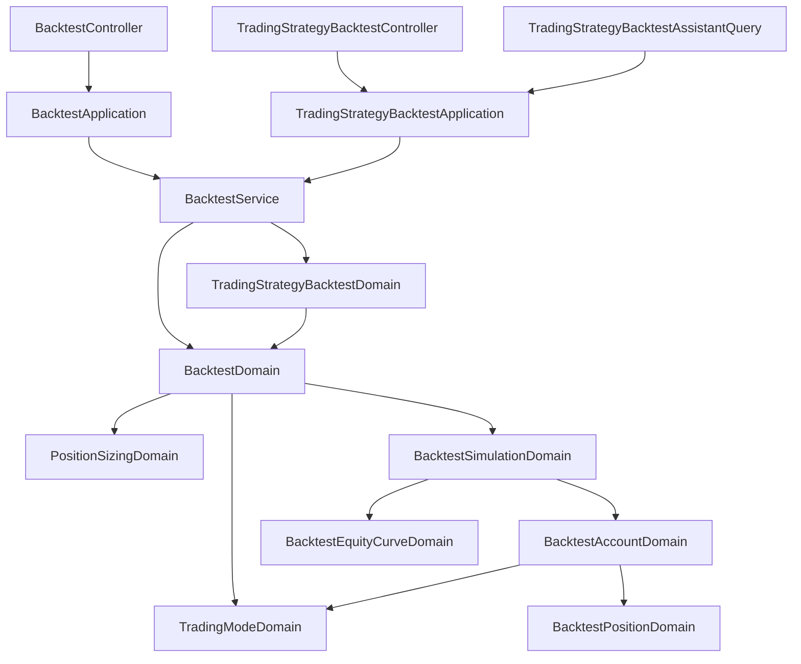

# 回測的交易模式 — Architecture Design

**Status:** Confirmed
**Source PRD:** `.sdd/2026-09-17-backtest-trading-mode/PRD.md`
**Tech context:** Go · Clean / Onion Architecture · Gin · GORM（code-first）

---

## 1. Design Goal & Guiding Principle

**In one sentence：** 讓「這一棒的信號要讓手上的倉位變成什麼樣子」變成一個**可以換掉的答案**，
而回測的其他每一行都不動。

**Guiding principle：** 兩種交易模式的差別，**壓縮成一張四值的答案**。

現行的 `BacktestAccountDomain.Apply` 把兩件事寫在一起：
「這個信號想要什麼」與「想要的東西怎麼從現在的狀態變過去」。
前者隨交易模式而變，後者永遠一樣。把前者抽出來，後者就只寫一次。

於是 `Apply` 收到的不再是「買入／賣出／持平」，而是**目標倉位**：

```
持多 / 持空 / 空手 / 不變
```

- **多空反手**：買入→持多、賣出→持空、持平→不變
- **現貨**：買入→持多、賣出→**空手**、持平→不變

`Apply` 的其餘部分變成一條直線，兩種模式共用：
目標與現在一樣就不動 → 有倉先平 → 目標是空手就結束 → 否則開倉。

**為什麼不是 Strategy 介面。** `.claude/rules/architecture.md` 明訂
「不為 Domain Model 定義介面，也不用介面做繼承」。
而專案裡已經有一個一模一樣的問題解過了：**倉位大小模式**——
`PositionSizingDomain` 是「一個 enum ＋ 一個模型，內部依模式分流」，沒有任何介面。
交易模式照抄它的形狀。同類問題用兩種形狀，下一個人會不知道該學哪一個。

---

## 2. Change Scope

| Area | Action | What / Why |
| :--- | :--- | :--- |
| `vo.TradingModeVo` | **Add** | 兩個取值：`longShort`、`spot`。不可變、無行為 |
| `vo.TargetPositionVo` | **Add** | 四個取值：`long`／`short`／`flat`／`unchanged`。交易模式對一棒的回答 |
| `domains.TradingModeDomain` | **Add** | 交易模式的全部規則：讀宣告（留白即多空反手、認不得即拒絕並列出兩種），以及把一個信號翻成一個目標倉位 |
| `domains.BacktestAccountDomain` | **Modify** | 建構時多收一個交易模式；`Apply` 改以目標倉位驅動，兩種模式共用同一條路徑 |
| `domains.BacktestSimulationDomain` | **Modify** | 建構時多收一個交易模式，原封傳給帳戶。逐棒走法、資金曲線、成績單一行不改 |
| `domains.BacktestDomain` | **Modify** | 多建一個 `TradingModeDomain`（緊接在倉位大小模式旁邊），並在 `ReplayOver` 交給模擬 |
| `domains.backtest_errors.go` | **Modify** | 多一個欄位名 `BacktestTradingModeField` |
| `dto.BacktestRequestDto` | **Modify** | 多一個 `TradingMode string`（照宣告原樣傳，讀它是 domain 的事） |
| `dto.TradingStrategyBacktestRequestDto` | **Modify** | 同上 |
| `models.BacktestRequest` | **Modify** | 多一個 `tradingMode` JSON 欄位，`ToRequestDto` 帶下去 |
| `models.TradingStrategyBacktestRequest` | **Modify** | 同上 |
| `domains.TradingStrategyBacktestDomain` | **Modify** | 組內層 `BacktestRequestDto` 時多帶一行。**驗證與拒絕措辭因此自動一字不差**，不另寫一套 |
| `assistantqueries.TradingStrategyBacktestAssistantQuery` | **Modify** | 參數多一個 `tradingMode`（選填）、schema 加 enum、說明講得出兩種模式的差別與預設值 |
| `domains.SignalDomain`／`vo.SignalVo` | **Not touched** | 信號仍然只有三種。第四種意見不在這一版 |
| `domains.BacktestPositionDomain` | **Not touched** | 一注怎麼估值、怎麼變成一筆已平倉交易，與模式無關 |
| `domains.BacktestEquityCurveDomain` | **Not touched** | 資金曲線只吃「這一棒手上值多少」 |
| `domains.PositionSizingDomain` | **Not touched** | 押多少與方向無關 |
| `dto.BacktestSummaryDto`／`dto.BacktestResultDto` | **Not touched** | 回傳形狀一個欄位都不加 |
| `service.BacktestService` | **Not touched** | 兩個用例的步驟順序沒有變 |
| `application.*`／`controller.*` 的錯誤對映 | **Not touched** | 欄位名是**用值傳**的（`BacktestFieldName`），新欄位自動走既有的 400 分支 |
| 指標計算、策略腳本、交易策略 CRUD、機器人 | **Not touched** | — |

---

## 3. New Classes / Modules

| Name | Kind | Responsibility (purpose) | Collaborators | Satisfies |
| :--- | :--- | :--- | :--- | :--- |
| `vo.TradingModeVo` | VO | 兩種交易模式的取值本身 | — | US-01 |
| `vo.TargetPositionVo` | VO | 一棒過後手上**應該**變成什麼：持多／持空／空手／不變 | — | US-02、US-03、US-05 |
| `domains.TradingModeDomain` | Domain Model | 交易模式的全部規則：怎麼讀出來（留白即預設、認不得即拒絕），以及一個信號在這個模式下的目標倉位 | `SignalDomain`、`vo.TargetPositionVo` | US-01～US-05 |

### `TradingModeDomain` 的形狀

```go
// 建構即驗證：留白給預設，認不得就帶著可選項拒絕。
// 零值不是可用的模式，只會與錯誤一起回傳——與 PositionSizingDomain 同一條規則。
func NewTradingModeDomain(declaredMode string) (TradingModeDomain, error)

func (tradingModeDomain TradingModeDomain) Value() vo.TradingModeVo

// 這個模式下，這一棒的意見要讓手上變成什麼樣子。
func (tradingModeDomain TradingModeDomain) TargetFor(signal SignalDomain) vo.TargetPositionVo
```

> **深度檢查。** 對外只有一個問題：**這一棒的目標是什麼**。
> 呼叫端不必先問「是不是現貨」再問「能不能做空」再問「要不要平倉」——
> 那三個問題只能一起回答，而分開問正是讓兩種模式在別處長出 `if` 的路。
> 加第三種模式（例如只做空）是在這個模型內多一列，`Apply` 一個字都不必動。

### `BacktestAccountDomain.Apply` 改寫後的形狀

簽名**不變**（`Apply(signal, candleTime, fillPrice)`），交易模式在建構時就握在手上。
內部變成：

```
target := 交易模式.TargetFor(signal)
target 是「不變」            → 回去
target 與手上現在一樣         → 回去
手上有倉                    → 以這一棒的收盤價平掉，錢加回可用資金
target 是「空手」            → 回去          ← 現貨的賣出停在這裡
押得下去嗎（倉位大小模式）      → 押不下去就回去
開倉、扣可用資金、開倉次數加一
```

「多空反手的反手」與「現貨的平倉回現金」因此是**同一段程式碼的兩個出口**，
而不是兩段各自維護的流程。PRD 的 US-05（既有行為一個字都不能變）
落在「target 是持空」那條路上——它走完全部五步，與現行完全相同。

---

## 4. Modified Components

| Component | Current role | Change needed |
| :--- | :--- | :--- |
| `BacktestAccountDomain` | 持有現金、最多一個倉位、已平倉清單；`Apply` 直接讀信號的方向 | 建構多收交易模式；`Apply` 改讀目標倉位。**對外方法一個都不加、不改簽名** |
| `BacktestSimulationDomain` | 逐棒走、產成績單／資金曲線／交易明細 | 建構多收交易模式並傳給帳戶。`ToDto` 一行不改 |
| `BacktestDomain` | 回測的全部前置規則 | 多建一個 `TradingModeDomain`，位置緊接 `NewPositionSizingDomain`；`ReplayOver` 多傳一個參數 |
| `TradingStrategyBacktestDomain` | 委派給 `BacktestDomain` | 組內層請求時多帶 `TradingMode` 一行 |
| `TradingStrategyBacktestAssistantQuery` | 助手的回測能力 | 參數、schema、說明各多一處。參數**不列入 required**——不給就是預設 |

---

## 5. Component Relationships



**三條入口（兩個控制器＋助手能力）匯到同一個 `BacktestDomain`**，
所以「留白即多空反手」與「認不得就拒絕」只寫一次，措辭自然一字不差。
這正是 PRD「三條路認得同一組交易模式」那一條的落點——
它不是三處各自實作後再對答案，而是根本只有一處。

---

## 6. Traceability

| PRD Scenario | Component |
| :--- | :--- |
| 指定多空反手／指定現貨 | `NewTradingModeDomain` |
| 完全沒說／留白 → 多空反手 | `NewTradingModeDomain`（空字串分支） |
| 認不得的值 → 整次拒絕並列出兩種 | `NewTradingModeDomain` ＋ `BacktestTradingModeField` |
| 重演一份交易策略時同樣說得出來／同樣被拒 | `TradingStrategyBacktestDomain` 多帶的那一行 → 同一個 `NewBacktestDomain` |
| 現貨：空手買入開多倉 | `TradingModeDomain.TargetFor` → `Apply` |
| 現貨：已持多再買入等於沒聽到 | `Apply` 的「與手上一樣就回去」 |
| 現貨：押不下去就跳過 | `PositionSizingDomain.StakeFor`（未改動） |
| 現貨：持多賣出就平倉回現金 | `TargetFor` 回「空手」→ `Apply` 平倉後停住 |
| 現貨：平倉後資金曲線不隨價格動 | `BacktestAccountDomain.EquityAt`（未改動，空手即純現金） |
| 現貨：賣出只平不開 | `Apply` 在「空手」出口回去 |
| 現貨：空手賣出什麼都不發生 | `TargetFor` 回「空手」＋ `Apply` 的「與手上一樣就回去」 |
| 現貨：永遠不會出現空倉 | `TargetFor` 在現貨下不回「持空」 |
| 兩種模式對同一段歷史給不同成績單 | `BacktestSimulationDomain`（未改動的走法 ＋ 不同的目標） |
| 沒有任何賣出時兩種模式完全一樣 | `TargetFor` 對買入／持平兩種模式回同一個答案 |
| 多空反手：空手賣出開空倉／持多賣出同棒反手／已持空忽略 | `TargetFor` 回「持空」→ `Apply` 走完五步 |
| 持平在兩種模式下都不動作 | `TargetFor` 回「不變」 |
| 助手指定現貨／沒說／說了認不得的值 | `TradingStrategyBacktestAssistantQuery` 的參數 → 同一個 `NewBacktestDomain` |
| 助手看得懂兩種模式差在哪 | `TradingStrategyBacktestAssistantQuery.Description()` ＋ schema 的 enum 說明 |

---

## 7. Extensibility & Handoff Notes

- **Most likely next requirement：第三種交易模式**（只做空、或「賣出即平倉且允許再放空」）。
  **Where it lands：** `TradingModeDomain` 的取值表多一列、`TargetFor` 多一個分支。
  `Apply`、模擬、成績單、控制器、助手 schema 的 enum 之外，一個字都不必動。

- **第二可能：算式自己說「平倉」**（信號多第四種）。
  **Where it lands：** `vo.SignalVo` 與 `SignalDomain`，再由 `TargetFor` 把它翻成「空手」。
  目標倉位這一層已經有「空手」這個值，所以那一天不需要重新設計，只需要多一個來源。

- **第三可能：結束時強制平倉。**
  **Where it lands：** `BacktestSimulationDomain.ToDto` 走完之後多一步，
  與交易模式無關——兩種模式都會用到它。

- **刻意不做的事：把交易模式存進策略腳本或交易策略。**
  它跟「這一段時間、這些參數值」同一類，跟著這一次走。
  真要存，該存的地方是「一組回測預設值」，那是另一個切片。

- **給下一位的提醒：** 目標倉位有四個值，其中「不變」與「空手」看起來像同一件事，
  其實不是。「不變」是沒有意見（持平），「空手」是**有意見而且要求出清**。
  把它們合成一個值，現貨模式下的賣出就會退化成持平，而那是一個不會有人發現的錯。

---

## 8. Appendix

- `.sdd/2026-09-17-backtest-trading-mode/PRD.md`
- `.sdd/2026-09-05-strategy-script-backtest/ARCH.md`——被擴充的倉位規則出處
- `.sdd/2026-09-17-trading-strategy-backtest/ARCH.md`——交易策略回測委派給回測的形狀
- `.claude/rules/architecture.md`——「Domain Model 不是介面抽象」的出處
