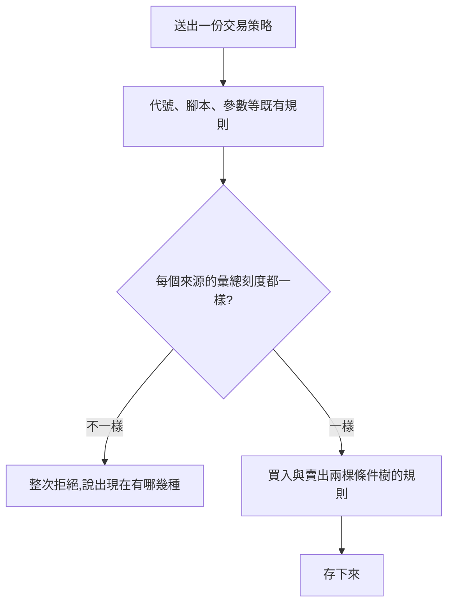

# Product Requirements Document (PRD)

**Status:** Finalized
**Version:** v1.0
**Owner:** James Hsueh
**Stakeholders:** Engineering

---

## 1. Background & Goal (Why & Goal)

### Problem Statement

一份交易策略的每個信號來源各自挑自己要看多粗的 K 線，
所以「A 看一小時、B 看五分鐘」這種交易策略**存得下來**。

但那一份什麼都做不成：重演它會被整次拒絕，
而派出去之後，兩個來源在不同的時間軸上各自有意見，
條件樹卻把它們當成同一棒的兩句話來讀。

擋在重演那一步太晚——他已經拼完、存好，可能還派了一台機器人出去。

### Expected Outcome

- 刻度不一致的交易策略**存不下去**，且那句拒絕**說得出現在有哪幾種**。
- 重演那一關**留著**，措辭與存不下去時一致。
- 系統**不改任何人已經存著的資料**。

### Out of Scope

- 不同刻度的對齊。
- 自動修正已存在的不一致資料。
- 策略機器人那一端的任何改動。

---

## 2. User Personas

**Primary Role:** 已登入的使用者，自己每一支策略腳本與每一份交易策略的擁有者。

**Usage Context:** 桌面瀏覽器。他在工作檯上反覆調整一份交易策略，
每次調完就存一次——所以「存下去的那一刻」是他最頻繁經過的那一道關卡。

---

## 3. User Stories & Acceptance Criteria

### US-01 — 拼不一致的那一份存不下去，而且知道差在哪 [priority: P0]

**As a** 使用者，**I want** 刻度不一致時在存下去的那一刻就被擋住，
**so that** 我不會拼完、存好、派出去之後才發現它什麼都做不成。

```gherkin
Scenario: 每個來源都看同一種粗細就存得下來
  Given 我的交易策略有兩個信號來源,都看一小時的 K 線
  When 我存這一份交易策略
  Then 它存下來了

Scenario: 只有一個來源時一定一致
  Given 我的交易策略只有一個信號來源,看五分鐘的 K 線
  When 我存這一份交易策略
  Then 它存下來了

Scenario: 兩個來源看不同粗細時存不下去
  Given 我的交易策略有兩個信號來源,一個看一小時、一個看五分鐘
  When 我存這一份交易策略
  Then 它存不下來
  And 那句拒絕裡看得到「1h」與「5m」

Scenario: 三種粗細時三種都說得出來
  Given 我的交易策略有三個信號來源,分別看一小時、一小時與一天
  When 我存這一份交易策略
  Then 它存不下來
  And 那句拒絕裡看得到「1h」與「1d」
```

### US-02 — 已經存著的那些不被動到 [priority: P0]

**As a** 使用者，**I want** 系統不要自己改我存著的東西，
**so that** 我打開來看到的仍然是我當初拼的那一份。

```gherkin
Scenario: 舊的那一份讀得出來,原樣呈現
  Given 系統裡有一份交易策略,它的來源刻度混著一小時與五分鐘
  When 我讀出那一份
  Then 我看到的每一個來源都還是它原本的刻度

Scenario: 原樣改個名字存回去會被擋下
  Given 同上那一份
  When 我只改名字、不動刻度就存回去
  Then 它存不下來,理由與拼一份新的不一致時相同

Scenario: 調成一致之後就存得下來
  Given 同上那一份
  When 我把每個來源都調成一小時再存
  Then 它存下來了
```

### US-03 — 重演那一關留著 [priority: P0]

**As a** 使用者，**I want** 重演仍然會擋下不一致的那一份，
**so that** 舊資料不會因為存下去那一關新增了就變成沒人看管。

```gherkin
Scenario: 舊的、刻度混著的那一份重演不了
  Given 系統裡有一份舊的交易策略,來源刻度混著
  When 我拿它重演
  Then 整次被拒絕,措辭與存不下去時一致
```

---

## 4. Business Flow & Logic



### Core Business Rules

1. **一份交易策略只有一種彙總刻度**：每個信號來源都必須相同。
2. **一個來源必定一致**——沒有第二個可以與它不同。
3. 拒絕的句子**列出目前出現過的每一種刻度**，依它們出現的順序。
4. 這條規則在**建立與改寫時完全相同**。
5. **不自動修改既有資料**；舊的不一致資料讀得出來、刪得掉，改寫時才要求調整。
6. **重演那一關不動**，兩句拒絕措辭一致。

### Edge Cases

| 情況 | 行為 |
| :--- | :--- |
| 一個信號來源都沒有 | 既有規則先擋（至少要有一個來源），不會走到刻度這一條 |
| 某個來源的刻度根本不是合法的六種之一 | 既有規則先擋（那一個來源的刻度不對），指名是哪一個來源 |
| 兩個來源指名同一支腳本、參數不同 | 照舊允許——那與刻度是兩件事，只要刻度相同 |

---

## 5. UI/UX Design & Interaction

本切片為後端切片。畫面由 `go-trading-frontend` 的對應切片負責，
它的做法是**讓刻度成為整份交易策略的一格**，使用者因此拼不出不一致的東西。

後端這一端仍然逐一收下每個來源的刻度並驗證它們相同——
因為畫面不是唯一的呼叫端，而規則的所在地是這裡。

---

## 6. Non-Functional Requirements

- **相容**：讀取、刪除與機器人那一端的行為一行都不改。
- **安全**：拒絕的句子只說出刻度，不洩漏任何別人的資料。

---

## 7. Dependencies & Risks

- **依賴**：`.sdd/2026-09-17-trading-strategy/`（交易策略本身）、
  `.sdd/2026-09-17-trading-strategy-backtest/`（重演那一關的措辭）。
- **風險**：舊的不一致資料在改寫時才會被要求調整，
  使用者可能在改一個不相干的欄位時第一次撞到這句話。
  緩解——那句話明確說出現在有哪幾種，下一步因此是清楚的。

---

## 8. Appendix

- `.sdd/2026-09-17-shared-aggregation-coarseness/BRIEF.md`
