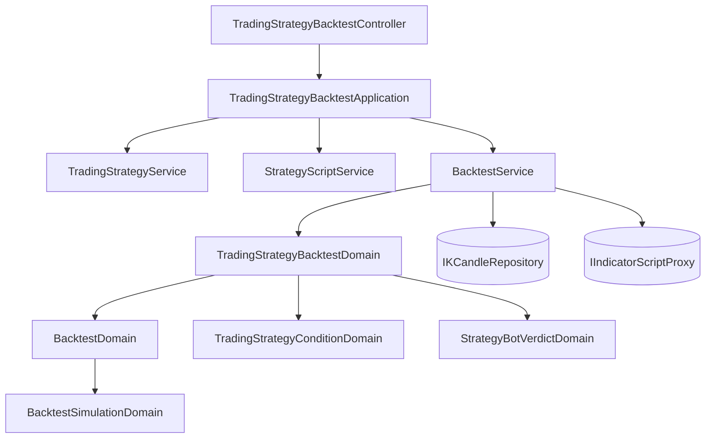

# 交易策略回測 — Architecture Design

**Status:** Confirmed
**Source PRD:** `.sdd/2026-09-17-trading-strategy-backtest/PRD.md`
**Tech context:** Go · Clean / Onion Architecture · Gin · GORM（code-first）· Postgres

---

## 1. Design Goal & Guiding Principle

**In one sentence：** 讓回測的受測對象多一種——一份交易策略——而**模擬與報表一行都不改**。

**Guiding principle：** 只換掉「每一棒的信號從哪裡來」。
現行回測的形狀是 `ReplayOver(候選 K 線, 每一棒一個信號)`，
而一份交易策略能算出的正是「每一棒一個信號」。
所以這個設計**不新增第二套模擬**，只新增一個把幾個來源合成一串信號的模型。
兩套模擬遲早會對同一段歷史給出兩個答案，而沒有人說得出哪一個對。

---

## 2. Change Scope

| Area | Action | What / Why |
| :--- | :--- | :--- |
| `domains.TradingStrategyBacktestDomain` | **Add** | 這一版唯一的新規則（刻度必須一致）＋ 把每個來源逐棒的信號合成一串結論；其餘一律委託既有的 `BacktestDomain` |
| `dto.TradingStrategyBacktestRequestDto` ＋ `dto.ResolvedSignalSourceDto` | **Add** | 一次交易策略回測的輸入形狀，與「已解析好的一個來源」 |
| `BacktestService.RunTradingStrategyBacktest` | **Add** | 第二個公開用例：讀 K 線一次、每個來源各跑一次腳本、合成、交給既有模擬 |
| `application.TradingStrategyBacktestApplication` | **Add** | 編排：讀那一份交易策略、逐一解析來源的策略腳本、交給 service |
| `controller.TradingStrategyBacktestController` | **Add** | 一條路由的請求／回應轉換 |
| `dto.BacktestSummaryDto` | **Modify** | 多一個 `ConflictedCandleCount`；重演一支腳本時恆為零 |
| `domains.BacktestSimulationDomain` | **Not touched** | 倉位、成交價、成績單、資金曲線、交易明細一條都不動 |
| `BacktestService.RunBacktest` | **Not touched** | 重演一支策略腳本那條路一行都不改 |
| 交易策略的 CRUD、機器人、指標計算 | **Not touched** | — |

---

## 3. New Classes / Modules

| Name | Kind | Responsibility (purpose) | Collaborators | Satisfies |
| :--- | :--- | :--- | :--- | :--- |
| `TradingStrategyBacktestDomain` | Domain Model | **這一版唯一的新規則**：至少一個來源、且所有來源共用一個彙總刻度（否則拒絕並說出現在有哪幾種）。外加把同一棒上的幾個信號套進兩棵條件樹，合成一串結論與一個打架棒數 | `BacktestDomain`、`TradingStrategyConditionDomain`、`StrategyBotVerdictDomain` | US-02、US-03、US-04 |
| `dto.ResolvedSignalSourceDto` | DTO | 一個已經解析好的來源：代號、指標算式、宣告的參數、這一次的參數值、彙總刻度 | — | US-01 |
| `dto.TradingStrategyBacktestRequestDto` | DTO | 一次交易策略回測的輸入：那幾個已解析的來源、兩棵條件樹，加上市場／期間／本金／倉位模式 | — | 全部 |
| `application.TradingStrategyBacktestApplication` | Application | 編排：讀那一份交易策略（是不是我的由它答）、逐一解析每個來源指名的策略腳本（三道關卡），再交給回測 | `TradingStrategyService`、`StrategyScriptService`、`BacktestService` | US-01 |
| `controller.TradingStrategyBacktestController` | Controller | `POST /trading-strategies/:id/backtests` 的轉換與狀態碼對映 | `TradingStrategyBacktestApplication` | 全部 |

> **深度檢查。** `TradingStrategyBacktestDomain` 對外只有四個問題：
> 要讀哪一段 K 線、每個來源要跑什麼、把這些信號合起來是什麼、結果長什麼樣。
> 呼叫端不必先問刻度、再問參數、再自己組一棵條件樹——那正是這個模型存在的理由。

---

## 4. Modified Components

| Component | Current role | Change needed |
| :--- | :--- | :--- |
| `dto.BacktestSummaryDto` | 六個數字 | 多一個 `ConflictedCandleCount`。重演一支腳本時它是零，因為一支腳本不會與自己打架 |
| `BacktestService` | 一個公開用例 `RunBacktest` | 多一個 `RunTradingStrategyBacktest`。**兩個互不呼叫**，共用私有的「把腳本結果讀成信號」 |

---

## 5. Component Relationships

**每一棒的結論走的是與機器人同一個模型**（`StrategyBotVerdictDomain`）。
那不是省事——重演與上線之後必須對同一組信號得出同一個結論，
而兩份各自寫的判斷遲早會在某一個邊界上分岔。

---

## 6. Extensibility & Handoff Notes

- **Most likely next requirement：** 不同彙總刻度的對齊。
- **Where it lands：** `TradingStrategyBacktestDomain` 目前那一條「必須一致」的檢查。
  對齊要決定的是「較粗的那一格還沒走完時，細的那幾棒看得到什麼」，
  而那是這個模型內部的事——service 只會多讀幾批 K 線。
- **How to add it：** 把「一個刻度、一批 K 線」換成「每個刻度各一批」，
  再在合成那一步替每一棒挑出每個來源當下最後一個走完的值。
  **模擬與報表仍然一行都不改。**
- **Do not hardcode：** 上限（來源 10、K 線根數）沿用既有設定，不生第二份。
- **Known debt：** 打架棒數加在成績單上，於是重演一支策略腳本的回應也多了一個恆為零的欄位。
  值得——兩種受測對象交出同一個形狀，畫面就不必分兩種讀法。

---

## 7. Traceability

| PRD Scenario | Fulfilled by |
| :--- | :--- |
| 重演一份交易策略 | `TradingStrategyBacktestApplication` ＋ `BacktestService.RunTradingStrategyBacktest` |
| 別人的一份看不到 / 不存在的那一份 | `TradingStrategyService.GetTradingStrategy`（共用同一個哨兵錯誤） |
| 來源指名的腳本看不到時整次拒絕 | `StrategyScriptService.ResolveRunnableStrategyScript` |
| 每個來源都用同一個刻度 / 只有一個來源 / 刻度不一致 | `TradingStrategyBacktestDomain` 建構子 |
| 買入成立就買 / 賣出成立就賣 / 都不成立 / 兩邊都成立 | `TradingStrategyBacktestDomain.CombineSignals` ＋ `StrategyBotVerdictDomain` |
| 只有一個來源時與重演那一支腳本完全相同 | 兩條路共用 `BacktestSimulationDomain`，且條件求值對單一來源是恆等 |
| 打架棒數（0 / 180 / 重演腳本時恆為零） | `BacktestSummaryDto.ConflictedCandleCount` |
| 湊不出兩根 / 本金不是正數 / 起點晚於終點 | 委託 `BacktestDomain`，一行都不重寫 |
| 結果不留存 | 沒有任何 repository 參與 |

---

## 8. Risks & Open Decisions

| 風險 | 判斷 |
| :--- | :--- |
| 「與重演一支腳本完全相同」日後被打破 | 寫成一條驗收情境，不是一句註解 |
| 成績單多一個欄位影響既有畫面 | 加欄位是相容的；畫面讀不到它時行為不變 |
| 十個來源各跑一次腳本的成本 | K 線只讀一次；來源上限本來就是 10 |

### Open decisions（交給實作）

- 路由。**建議 `POST /trading-strategies/:id/backtests`**——
  重演是對某一份交易策略做的事，掛在它底下比另開一條路徑誠實，
  也與既有的 `POST /strategy-bots/:id/runs` 同一個形狀。
