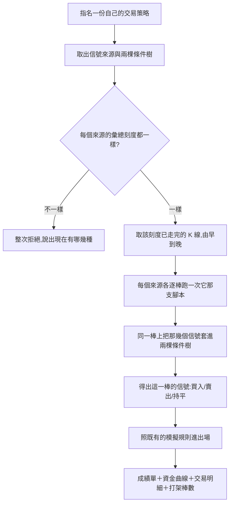

# Product Requirements Document (PRD)

**Status:** Finalized
**Version:** v1.0
**Owner:** James Hsueh
**Stakeholders:** Engineering

---

## 1. Background & Goal (Why & Goal)

### Problem Statement

回測現在只重演得了**一支策略腳本**。但使用者實際派出去的是一份**交易策略**：
幾支腳本的信號，加上兩棵條件樹。

那一份，他一次都沒有辦法回頭問「從一年前照這一整套操作會剩多少錢」。
他唯一能做的是按下播放、然後等好幾個月——而那正是回測存在的理由。

### Expected Outcome

- 受測對象多一種：**一份自己的交易策略**。
- 成績單、資金曲線、交易明細、倉位規則、進出場價**一個字都不變**，
  多的只有一個「打架棒數」。
- 一份只有一個來源、條件就是「A 買」與「A 賣」的交易策略，
  重演結果**與直接重演那一支腳本完全相同**。

### Out of Scope

- **不同彙總刻度的對齊**——這一版要求一致。
- **回測結果的留存**。
- **手續費、滑點、槓桿、停損停利**。
- **重演一台機器人**——觸發間隔與執行狀態與回測無關。

---

## 2. User Personas

**Primary Role:** 已登入的使用者，同時是自己每一支策略腳本、每一份交易策略的擁有者。

**Usage Context:** 桌面瀏覽器。他在**確認一份交易策略之前**會重跑很多次，
每次調一點條件再看一次——這正是結果不留存的理由。

---

## 3. User Stories & Acceptance Criteria

### US-01 — 拿歷史重演自己的一份交易策略 [priority: P0]

**As a** 使用者，**I want** 指名一份自己的交易策略並重演一段歷史，
**so that** 「這一整套值不值得信」不再是等好幾個月才知道的事。

```gherkin
Scenario: 重演一份交易策略
  Given 我有一份交易策略,兩個信號來源都吃一小時的 K 線
  And 那一段有足夠的一小時 K 線
  When 我用它重演 BTCUSDT 最近三十天,本金 10000,每次全押
  Then 我拿到成績單、資金曲線與交易明細

Scenario: 別人的一份看不到
  Given 另一位使用者有一份交易策略
  When 我指名那一份來重演
  Then 我拿到「找不到」

Scenario: 不存在的那一份也一樣
  Given 系統裡沒有識別碼為 999 的交易策略
  When 我指名 999 來重演
  Then 我拿到「找不到」,與指名別人那一份的回答一字不差

Scenario: 來源指名的腳本看不到時整次拒絕
  Given 我的交易策略有一個信號來源,指名一支已經被它的擁有者刪掉的策略腳本
  When 我用它重演
  Then 整次被拒絕,並說找不到那一支策略腳本
```

### US-02 — 各來源刻度不一致時被擋下，而且知道哪裡不一致 [priority: P0]

**As a** 使用者，**I want** 刻度不一致時被清楚擋下，
**so that** 我知道要回去把它們調成一樣，而不是拿到一份錯的成績單。

```gherkin
Scenario: 每個來源都用同一個刻度就跑得動
  Given 我的交易策略有兩個信號來源,都吃一小時的 K 線
  When 我用它重演
  Then 這次重演用一小時的 K 線逐棒往前走

Scenario: 只有一個來源時用它的刻度
  Given 我的交易策略只有一個信號來源,吃五分鐘的 K 線
  When 我用它重演
  Then 這次重演用五分鐘的 K 線逐棒往前走

Scenario: 刻度不一致時整次拒絕,並說出現在有哪幾種
  Given 我的交易策略有兩個信號來源,一個吃一小時、一個吃五分鐘
  When 我用它重演
  Then 整次被拒絕
  And 那句拒絕裡看得到「1h」與「5m」
```

### US-03 — 每一棒的結論由兩棵條件樹決定 [priority: P0]

**As a** 使用者，**I want** 重演時每一棒照我寫的條件判斷，
**so that** 重演出來的與它上線之後會做的是同一件事。

```gherkin
Scenario: 買入條件成立就買
  Given 買入條件是「A 等於買入 且 B 等於買入」
  And 某一棒上 A 說買入、B 說買入
  When 重演走到那一棒
  Then 那一棒的結論是買入

Scenario: 賣出條件成立就賣
  Given 賣出條件是「A 等於賣出」
  And 某一棒上 A 說賣出、B 說買入
  When 重演走到那一棒
  Then 那一棒的結論是賣出

Scenario: 兩邊都不成立就不動作
  Given 某一棒上兩棵條件樹都不成立
  When 重演走到那一棒
  Then 那一棒的結論是持平,帳戶不動

Scenario: 兩邊同時成立就當作持平
  Given 買入條件是「B 等於買入」,賣出條件是「A 等於賣出」
  And 某一棒上 A 說賣出、B 說買入
  When 重演走到那一棒
  Then 那一棒的結論是持平,帳戶不動
  And 那一棒被算進打架棒數

Scenario: 只有一個來源時與重演那一支腳本完全相同
  Given 我的交易策略只有一個來源 A,買入條件是「A 等於買入」、賣出條件是「A 等於賣出」
  When 我用它重演,與直接重演那一支策略腳本用同樣的市場、期間、本金與倉位模式
  Then 兩次的成績單完全相同
```

### US-04 — 看得出這份交易策略有多常在打架 [priority: P0]

**As a** 使用者，**I want** 成績單上看得到打架了幾棒，
**so that** 我不會把一張「幾乎沒有交易」的漂亮成績單讀成一份很穩的策略。

```gherkin
Scenario: 沒有打架時是零
  Given 一次重演裡沒有任何一棒兩邊同時成立
  When 我看成績單
  Then 打架棒數是 0

Scenario: 一直打架時說得出次數
  Given 一次兩百棒的重演裡有一百八十棒兩邊同時成立
  When 我看成績單
  Then 打架棒數是 180
  And 開倉次數很少——那正是那個數字要解釋的事

Scenario: 重演一支策略腳本時它恆為零
  Given 我重演的是一支策略腳本,不是一份交易策略
  When 我看成績單
  Then 打架棒數是 0——一支腳本自己不會與自己打架
```

### US-05 — 其餘規則一條都沒有變 [priority: P0]

**As a** 使用者，**I want** 倉位、成交價與拒絕的規則與我熟悉的那一套相同，
**so that** 我不必為了第二種受測對象再學一次。

```gherkin
Scenario: 湊不出兩根 K 線時整次拒絕
  Given 我要重演的那一段只湊得出一根該刻度的 K 線
  When 我用一份交易策略重演
  Then 整次被拒絕,理由與重演一支策略腳本時相同

Scenario: 本金不是正數時整次拒絕
  Given 我把本金填成 0
  When 我用一份交易策略重演
  Then 整次被拒絕

Scenario: 起點晚於終點時整次拒絕
  Given 我把起點填成晚於終點
  When 我用一份交易策略重演
  Then 整次被拒絕

Scenario: 結果不留存
  Given 我剛重演過一次
  When 我再問一次同樣的問題
  Then 系統重新算一次,而不是拿出上次的結果
```

---

## 4. Business Flow & Logic

### 一次交易策略回測



### Core Business Rules

1. **受測對象是一份自己的交易策略。** 看不到的一律「找不到」。
2. **彙總刻度由那幾個來源自己說，而且必須一致**，否則整次拒絕並說出現在有哪幾種。
3. **每一棒的信號由兩棵條件樹求出**：只有買入成立→買入；只有賣出成立→賣出；
   都不成立→持平；**兩邊都成立→持平，並算進打架棒數**。
4. **每個來源看得到的 K 線範圍與現行回測相同**：從起點到第 N 棒（含）。
5. **模擬與報表一條都不改**，只多一個打架棒數。
6. **結果不留存。**

### 為什麼打架當作持平而不是挑一邊

替他挑一邊，等於讓他照一個系統自己編出來的意見操作，而他永遠不會發現。
線上的機器人遇到打架時什麼都不說，重演也一樣什麼都不做——兩邊是同一條規則。

### Edge Cases

| 情況 | 行為 |
| :--- | :--- |
| 交易策略一個信號來源都沒有 | 存不下這種東西（建立時就擋下），所以重演遇不到；真的遇到時比照「彙總刻度不一致」整次拒絕 |
| 某一棒某個來源的腳本算不出值 | 與現行回測一字不差：整次拒絕並說出是哪一支出錯——一份半截的重演比沒有重演更糟 |
| 兩個來源指名同一支腳本、參數不同 | 各跑各的，互不影響。那正是參數存在的理由 |
| 那一段完全沒有 K 線 | 比照「湊不出兩根」整次拒絕 |

---

## 5. UI/UX Design & Interaction

本切片是後端切片，畫面由 `go-trading-frontend` 的對應切片負責。後端只保證：

- 刻度不一致的那句拒絕**說得出現在有哪幾種刻度**——少了那個，
  使用者得自己打開每一個來源看一遍。
- 成績單多出來的**打架棒數是一個數字**，不是一個是非。

---

## 6. Non-Functional Requirements

- **效能**：K 線只讀一次，每個來源各跑一次腳本；來源上限 10，所以最壞是十次腳本執行。
- **安全**：指名的交易策略必須是目前登入者的；來源指名的策略腳本沿用既有的三道關卡。
- **相容**：重演一支策略腳本那條路**一行都不改**。

---

## 7. Dependencies & Risks

- **依賴**：`.sdd/2026-09-17-trading-strategy/` 的交易策略讀取，以及既有的回測模擬與報表。
- **風險**：「與直接重演那一支腳本完全相同」這條保證很容易在日後被打破。
  緩解——把它寫成一條驗收情境，而不是一句註解。

---

## 8. Appendix

- `.sdd/2026-09-17-trading-strategy-backtest/BRIEF.md`
- `.sdd/2026-09-05-strategy-script-backtest/PRD.md`——模擬與報表規則的出處
- `.sdd/2026-09-17-trading-strategy/PRD.md`——受測對象的出處
