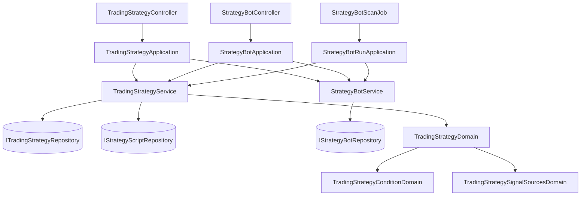

# 交易策略 — Architecture Design

**Status:** Confirmed
**Source PRD:** `.sdd/2026-09-17-trading-strategy/PRD.md`
**Tech context:** Go · Clean / Onion Architecture · Gin · GORM（code-first）· Postgres

---

## 1. Design Goal & Guiding Principle

**In one sentence：** 把現在長在 `StrategyBot` 身上的「信號來源 ＋ 兩棵條件樹」搬成一個
獨立聚合 `TradingStrategy`，讓機器人只留一個外鍵指過去，並且**不改變任何判斷行為**、
**不遺失任何既有資料**。

**Guiding principle：** 讓「一份規則」變成**一個可以被指名的讀取入口**。
下一個需求是回測一份交易策略——它要的東西與機器人跑一輪要的東西**一模一樣**：
「給我這份規則的信號來源與兩棵條件樹」。所以這個設計把那件事收斂成
**一個方法** `TradingStrategyService.ResolveRunnableTradingStrategy`，
跑一輪與（下一個切片的）回測都走它。Phase 2 因此是**多一個呼叫者**，不是改寫。

---

## 2. Change Scope

| Area | Action | What / Why |
| :--- | :--- | :--- |
| `entities.TradingStrategy` 等四個 entity | **Add** | 新聚合：交易策略本體 ＋ 信號來源 ＋ 條件節點 ＋ 參數值。後三者由 `StrategyBot*` 改名搬家而來 |
| `domains.TradingStrategyDomain` 等三個 domain model | **Add** | 名稱／來源／條件的全部驗證規則，由 `StrategyBotDomain` 拆出來 |
| `ITradingStrategyRepository` ＋ `TradingStrategyRepository` | **Add** | 一個聚合一個 repository；讀寫同一個，含條件樹的整棵覆寫 |
| `TradingStrategyService` | **Add** | 交易策略的 CRUD 與「取出可執行的那一份」 |
| `TradingStrategyApplication` ＋ `TradingStrategyController` | **Add** | 五條用例與五條路由 |
| `entities.StrategyBot` | **Modify** | 拿掉 `SignalSources` / `ConditionNodes`，換成 `TradingStrategyID` 與關聯 |
| `domains.StrategyBotDomain` | **Modify** | 瘦成名稱／交易標的／觸發間隔／引用的交易策略識別碼 |
| `StrategyBotService` | **Modify** | 建立與修改改為收下一個交易策略識別碼；`DecideRound` 改從交易策略取規則；新增「誰在引用我」的讀取 |
| `StrategyBotApplication` / `StrategyBotRunApplication` | **Modify** | 不再解析信號來源的策略腳本（那搬到 `TradingStrategyApplication`）；跑一輪前先取出交易策略 |
| `SchemaMigrator` | **Modify** | 一次性、可重複執行的搬家：改表名、改欄名、補出交易策略、把機器人指過去 |
| 策略腳本、市集、指標計算、回測、K 線、助手、Telegram 投遞、執行紀錄 | **Not touched** | 這個切片只搬家、不改任何判斷行為；回測要等 Phase 2 才接上交易策略 |
| `StrategyBotRunRecord` | **Not touched** | 輪次紀錄掛在機器人身上，而「第幾輪、什麼時候、結果是什麼」講的是那台機器，不是那份規則 |

---

## 3. New Classes / Modules

| Name | Kind | Responsibility (purpose) | Collaborators | Satisfies (PRD scenario) |
| :--- | :--- | :--- | :--- | :--- |
| `entities.TradingStrategy` | Entity | 一份交易策略的欄位與持久化對應；`ToDto` 是唯一把扁平條件列重新長成樹的地方 | `TradingStrategySignalSource`、`TradingStrategyConditionNode` | 存下第一份交易策略 / 列出自己的每一份 |
| `entities.TradingStrategySignalSource` | Entity | 一個信號來源的欄位（由 `StrategyBotSignalSource` 改名，外鍵改指交易策略） | `TradingStrategySignalSourceParameterValue` | 同一支策略腳本可以出現兩次 |
| `entities.TradingStrategyConditionNode` | Entity | 條件樹的一個節點（由 `StrategyBotConditionNode` 改名，外鍵改指交易策略） | 自身（父子） | 兩邊條件都不得為空 |
| `entities.TradingStrategySignalSourceParameterValue` | Entity | 一個來源這一次的參數值（改名搬家） | — | 參數值帶了沒宣告的名稱即拒絕 |
| `domains.TradingStrategyDomain` | Domain Model | **一份交易策略的全部不變量**：名稱正規化與長度、來源上限與代號唯一、兩棵樹的深度／節點數／群組子條件數、條件只能指到已宣告的代號。建構子即驗證，`ToEntity()` 交出可存的樣子 | `TradingStrategyConditionDomain`、`TradingStrategySignalSourcesDomain` | 名稱重複 / 條件為空 / 指到沒宣告的代號 / 代號重複 |
| `domains.TradingStrategyConditionDomain` | Domain Model | 一棵條件樹的形狀規則與扁平化（由 `StrategyBotConditionDomain` 改名） | — | 條件群組至少兩個子條件 |
| `domains.TradingStrategySignalSourcesDomain` | Domain Model | 一組信號來源的規則：上限、代號唯一、參數值必須是該腳本宣告過的（由 `StrategyBotSignalSourcesDomain` 改名） | — | 兩個信號來源用了同一個代號 |
| `dto.TradingStrategyDto` / `TradingStrategyWriteDto` / `TradingStrategySignalSourceDto` / `TradingStrategyConditionDto` | DTO | domain 與 application 之間唯一的形狀；write 版本是建立與修改**共用**的輸入 | — | 全部 |
| `dto.TradingStrategyReferencesDto` | DTO | 「誰在引用我」的答案：總共幾台、其中哪幾台正在跑（名稱） | — | 有一台在跑時改不動 / 還有機器人引用時刪不掉 |
| `ITradingStrategyRepository` | Interface | 交易策略聚合的持久化契約 | — | 全部 |
| `persistence.TradingStrategyRepository` | Repository | 存／讀／刪一份交易策略，含來源與條件樹的整棵覆寫；名稱衝突由唯一索引回報 | GORM | 名稱在同一位擁有者之間不得重複 |
| `service.TradingStrategyService` | Domain Service | 交易策略的五個用例。其中 `GetTradingStrategy` 就是**跑一輪與日後的回測共用的那一個讀取入口** | `ITradingStrategyRepository` | 全部 US-01 / US-02 |
| `application.TradingStrategyApplication` | Application | 編排：建立／修改前解析每個來源指名的策略腳本（三道關卡＋宣告的參數），改與刪之前先問機器人那邊「誰在引用我」 | `TradingStrategyService`、`StrategyBotService`、`StrategyScriptService` | US-02、US-04 |
| `controller.TradingStrategyController` | Controller | 五條路由的請求／回應轉換 | `TradingStrategyApplication` | 全部 |

> **深度檢查。** `ResolveRunnableTradingStrategy` 一次回答「這份規則要跑什麼」，
> 呼叫端不必先讀交易策略、再逐一讀腳本、再自己湊參數——那正是今天
> `StrategyBotApplication` 在做的事，而它是這個設計要收掉的東西。
> `ReadReferencesTo` 同理：一次問完「幾台在用、哪幾台在跑」，
> 而不是讓 application 先數一次再查一次。

---

## 4. Modified Components

| Component | Current role | Change needed |
| :--- | :--- | :--- |
| `entities.StrategyBot` | 帶著名稱、標的、間隔、執行狀態，**以及信號來源與條件節點兩組子列** | 拿掉那兩組子列與它們的 cascade；加上 `TradingStrategyID uint` 與 `TradingStrategy` 關聯（**不 cascade**：刪掉交易策略不該悄悄掏空機器人，而那件事本來就被擋住了）。`ToDto` 改為帶出引用的交易策略識別碼與名稱 |
| `domains.StrategyBotDomain` | 驗證機器人的全部內容，含來源與條件 | 只留名稱／標的／觸發間隔／`TradingStrategyID`（必須大於零）。來源與條件的規則整段搬進 `TradingStrategyDomain` |
| `service.StrategyBotService` | 機器人 CRUD ＋ 啟停 ＋ 跑一輪的判斷 | 建立／修改收下交易策略識別碼；`DecideRound` 改為收下 `RunnableTradingStrategyDto`；新增 `ReadReferencesTo` |
| `interface.IStrategyBotRepository` | 機器人的持久化契約 | 新增 `FindAllByTradingStrategy`——`ReadReferencesTo` 用它一次取回，總數與執行中都從同一份算出來 |
| `application.StrategyBotApplication` | 建立機器人時逐一解析每個來源的策略腳本 | 那一段整個移除；改為確認「這份交易策略是我的」 |
| `application.StrategyBotRunApplication` | 跑一輪：取機器人身上的來源與條件 | 改為先 `ResolveRunnableTradingStrategy`，再把結果交給 `DecideRound` |
| `persistence.SchemaMigrator` | code-first 同步、刪退役欄位與索引、清無主列 | 多一步**搬家**（見第 8 節），排在 `AutoMigrate` 前後各一半 |
| `controller.StrategyBotController` ＋ `StrategyBotRequest` | 收下完整的機器人內容 | body 改為 `tradingStrategyId` ＋ 名稱 ＋ 標的 ＋ 間隔 |

---

## 5. Component Relationships

**兩個 Domain Service 互不認識。** 「改之前先問誰在引用我」是跨聚合的編排，
所以它住在 `TradingStrategyApplication`，不住在任何一個 service 裡面。

---

## 6. Extensibility & Handoff Notes

- **Most likely next requirement：** 回測一份交易策略（下一個切片，已在 BRIEF 裡指名）。
- **Where it lands：** `TradingStrategyService.GetTradingStrategy`。
  它回的 `TradingStrategyDto` 就是回測要的全部——一組信號來源
  （各自指名一支策略腳本、帶參數值與彙總刻度）與兩棵條件樹。
- **How to add it：** 新的 `TradingStrategyBacktestApplication` 呼叫同一個方法拿到那份 DTO，
  逐棒求值。**不必碰**交易策略的 entity、domain、repository 或 service。
- **再下一個：** 交易策略的市集。它會落在 `TradingStrategy` 旁邊，
  比照 `PublishedStrategyScript` / `StrategyScriptAdoption` 的既有形狀——
  那對表已經示範過「發佈是另一張表，不是本體上的一個布林」。
- **Patterns applied & why：**
  - **Aggregate**：交易策略是聚合根，來源與條件節點沒有自己的 repository，
    永遠隨它一起讀寫——與機器人今天對待它們的方式一字不差，只是換了根。
  - **扁平存、進出各長一次樹**：條件樹仍然扁平存，仍然只在 `ToDto` 長回來。
    兩個地方重組同一批列，遲早會對同一批列有兩種看法。
- **Do not hardcode：** 名稱長度、來源上限、樹的深度與節點數、群組最少子條件數——
  沿用機器人既有的那幾個常數，**不生第二份**。
- **Known debt / deferred：**
  - 「改之前先問誰在跑」與「真的改下去」之間沒有鎖。PRD 已接受：最壞是那一輪用舊規則、
    下一輪用新的，兩者都是完整的一版。要收掉它的訊號是有人回報「改了之後那一輪還是舊的」。
  - 機器人指向交易策略的那一欄**完全沒有外鍵**，所以「刪不掉」是**程式碼擋的**。
    這不只是取捨，是唯一可行的做法：欄位加上去的那一刻，每一台既有機器人都還帶著搬家尚未清掉的 0，
    外鍵會當場拒絕那一次升級本身。順帶的好處是那句拒絕說得出「有幾台在用」，而資料庫說不出。

---

## 7. Traceability

| PRD Scenario | Fulfilled by |
| :--- | :--- |
| 存下第一份交易策略 | `TradingStrategyApplication` ＋ `TradingStrategyDomain` ＋ `TradingStrategyRepository` |
| 名稱在同一位擁有者之間不得重複 | `TradingStrategyRepository`（唯一索引）＋ `TradingStrategyService` 轉成哨兵錯誤 |
| 別人取過同一個名字不影響我 | 唯一索引跨 `owner_id` |
| 兩邊條件都不得為空 | `TradingStrategyDomain` 建構子 |
| 條件指到一個沒有宣告的代號 | `TradingStrategyDomain`（代號集合比對） |
| 同一支策略腳本可以出現兩次，只要代號不同 | `TradingStrategySignalSourcesDomain` |
| 兩個信號來源用了同一個代號 | `TradingStrategySignalSourcesDomain` ＋ 來源代號唯一索引 |
| 信號來源指名一支別人的策略腳本 | `TradingStrategyApplication`（沿用策略腳本三道關卡） |
| 列出自己的每一份 / 空清單 / 不含指標算式 | `TradingStrategyService.ListTradingStrategies` ＋ `TradingStrategy.ToDto` |
| 讀別人的一份 / 讀一份不存在的 | `TradingStrategyService.GetTradingStrategy`（共用同一個哨兵錯誤） |
| 改一份沒有任何機器人引用的 / 改回原本的名稱 | `TradingStrategyApplication.UpdateTradingStrategy` |
| 刪一份沒有任何機器人引用的 | `TradingStrategyApplication.DeleteTradingStrategy` |
| 建一台引用既有交易策略的機器人 / 沒有指名 / 指名別人的 | `StrategyBotApplication` ＋ `StrategyBotDomain` |
| 讀一台機器人時看得到它用的是哪一份 | `StrategyBot.ToDto`（帶交易策略識別碼與名稱） |
| 刪掉機器人不會動到它引用的交易策略 | `StrategyBot` 的關聯**不帶 cascade** |
| 判斷結論與升級前相同 | `StrategyBotService.DecideRound` 收下 `RunnableTradingStrategyDto`，求值邏輯一行未動 |
| 兩台機器人引用同一份 / 改了共用的那一份 | 多對一外鍵；`ResolveRunnableTradingStrategy` 每輪即時讀 |
| 有一台在跑時改不動 / 全部停下來就改得動 | `StrategyBotService.ReadReferencesTo` ＋ `TradingStrategyApplication` |
| 還有機器人引用時刪不掉（在跑與否同一句） | 同上 |
| 既有機器人身上的規則變成一份交易策略 | `SchemaMigrator` 搬家步驟 |
| 升級不動執行狀態 / 不改變判斷結果 | 搬家只加不刪：不碰 `run_state`、`next_run_at`、`last_sent_signal` |
| 升級跑兩次與跑一次結果相同 | 搬家只處理 `trading_strategy_id` 仍為 0 的機器人 |

---

## 8. Risks & Open Decisions

### 搬家（一次性、可重複執行）

順序固定，每一步都先問「需不需要做」：

1. **改表名**（ORM 的 `RenameTable`）：`StrategyBotSignalSources` → `TradingStrategySignalSources`、
   `StrategyBotConditionNodes` → `TradingStrategyConditionNodes`、
   `StrategyBotSignalSourceParameterValues` → `TradingStrategySignalSourceParameterValues`。
   舊表在、新表不在時才做。**資料跟著表走，一列都不搬。**
2. **改欄名**（ORM 的 `RenameColumn`）：兩張子表的 `strategy_bot_id` → `trading_strategy_id`。
   此刻欄位裡裝的還是**機器人**的識別碼。
3. **`AutoMigrate`**：建出空的 `TradingStrategies`，替 `StrategyBots` 加上 `trading_strategy_id`
   （`default:0`）。
4. **補出交易策略**：對每一台 `trading_strategy_id = 0` 的機器人，
   建一份交易策略（名稱與擁有者沿用那台機器人），把那兩張子表裡指著**該機器人識別碼**的列
   改指新的交易策略識別碼，最後把機器人的 `trading_strategy_id` 設過去。

**為什麼不重用識別碼。** 讓交易策略的識別碼直接等於機器人識別碼，第 4 步就不必改子表——
但那需要指定主鍵插入，而 Postgres 的序列不會因此前進，下一次自動插入就會撞號。
多改一次子表，換掉一個會在幾天後才爆炸的地雷。

**冪等性**由第 4 步的條件保證：跑第二次時沒有任何機器人的 `trading_strategy_id` 是 0，
整步跳過。第 1、2 步同樣先問舊表／舊欄在不在。

**`trading_strategy_id` 的 0**：只存在於第 3 步與第 4 步之間。
資料庫層面它是 `not null default 0`——既有列不可能在加欄位的當下就有值，
而一個「暫時指向不存在」的 0 比一個永遠可以是 null 的外鍵誠實：
它有一個明確的清除時機，而 null 沒有。

### Risks / trade-offs

| 風險 | 判斷 |
| :--- | :--- |
| 搬家動到既有資料 | 只加不刪：不 drop 任何欄位、不 delete 任何列。驗證以「升級前後同一台機器人判出同一個結論」為準 |
| 表名與 entity 名不一致（沿用 Phase 0 的處理） | 這次**不沿用**——這三張子表用 `RenameTable` 真的改名，因為 ORM 改得動表名，而 Phase 0 改不動的是「已經有資料的表換一個 entity」這件事 |
| 兩個 Domain Service 都被同一個 Application 使用 | 這正是 Application 層存在的理由；兩個 service 之間仍然互不認識 |
| 前後端必須一起上 | 機器人的請求形狀變了。兩邊各自的切片一起交付 |

### 實作時偏離設計之處（已驗證）

| 原設計 | 實際做法 | 為什麼 |
| :--- | :--- | :--- |
| `ResolveRunnableTradingStrategy` ＋ `RunnableTradingStrategyDto` | **拿掉**，改用 `GetTradingStrategy` | 兩者會做同一件事：以擁有者身分讀回信號來源與兩棵條件樹。跑一輪本來就是「以那台機器人的擁有者身分」讀，答案一字不差。一個讀取入口，跑一輪與畫面看到的就永遠不會漂移 |
| 機器人的交易策略欄位帶外鍵 | **不帶** | 見上方 Known debt：外鍵在欄位加上去的當下就會拒絕升級本身 |
| 表名沿用（比照 Phase 0） | **真的改名**，另加欄名與索引名一起改 | ORM 改得動表名、欄名與索引名，資料一列都不搬。Phase 0 改不動的是「已經有資料的表換一個 entity」，那是另一件事 |
| 退役外鍵不處理 | **加一份退役外鍵清單** | 三張子表改名之後帶著四條舊外鍵，其中兩條仍指著 `StrategyBots`——那不是殘留而是當場的故障：每一次寫入都會被一條指錯地方的外鍵擋下 |

### Open decisions（交給實作）

- `ReadReferencesTo` 回的執行中機器人名稱是否要排序。**建議依名稱由小到大**，
  與機器人清單同一條規則，這樣同一份拒絕訊息每次讀起來都一樣。
- 交易策略的表名。**建議 `TradingStrategies`**（比照既有的 PascalCase 複數）。
