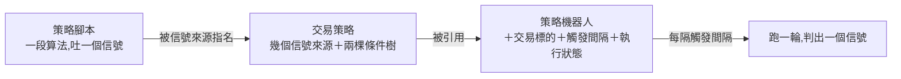

# Product Requirements Document (PRD)

**Status:** Finalized
**Version:** v1.0
**Owner:** James Hsueh
**Stakeholders:** Engineering

---

## 1. Background & Goal (Why & Goal)

### Problem Statement

系統裡有三層東西，但只有兩層有名字。

- **策略腳本**——一段算法，每一棒吐一個信號。有名字、有身分、可以單獨存取。
- **（沒有名字的那一層）**——把幾支策略腳本合成一個結論的那一套規則：
  幾個信號來源，加上買入與賣出兩棵條件樹。
- **策略機器人**——一台常駐的判斷機器。有名字、有身分。

中間那一層**活在機器人肚子裡**，是機器人身上的欄位，離開那台機器人就不存在。造成三件事：

1. **同一套規則要盯兩個市場，只能從頭再拼一次。** 兩份從此各自漂移，
   改了一邊不會改到另一邊，而使用者不會發現。
2. **想問「這套規則放到過去一年會怎樣」時，沒有東西可以指名。** 只能指名一台機器人，
   但機器人身上還掛著觸發間隔與執行狀態，那兩樣與這個問題毫無關係。
3. **講話要先問是哪一種。** 一個需要先問清楚是哪一種的詞，等於沒有名字。

### Expected Outcome

- 中間那一層有了名字與身分：**交易策略**。可以單獨建立、讀取、修改、刪除。
- 一份交易策略**可以被好幾台機器人同時引用**，改一次就是改全部。
- 機器人瘦下來：只剩「用哪一份、盯哪個市場、多久醒一次、現在在不在跑」。
- **判斷行為一條都沒有改變。** 升級前後，同一台機器人在同一時刻得到同一個結論。

### Out of Scope

- 交易策略的**市集與分享**。
- 交易策略的**回測**（下一個切片）。
- 一台機器人**引用多份**交易策略。
- **交易策略層級的參數**（參數仍住在信號來源上）。
- 把**交易標的**搬進交易策略。

---

## 2. User Personas

**Primary Role:** 已登入的使用者，同時是自己每一支策略腳本、每一份交易策略、
每一台機器人的擁有者。系統沒有角色之分，唯一的權限概念是「這份是不是我的」。

**Usage Context:** 桌面瀏覽器。拼規則是**坐下來慢慢調**的事（一次幾分鐘到幾十分鐘），
與「按下播放然後離開」是兩個不同的時刻——這正是把規則與機器分開的理由。

---

## 3. User Stories & Acceptance Criteria

### US-01 — 把一套判斷規則存成一份交易策略 [priority: P0]

**As a** 使用者，**I want** 把「幾支策略腳本＋什麼情況算買、什麼情況算賣」存成一份有名字的東西，
**so that** 它不必依附任何一台機器人就能存在。

```gherkin
Scenario: 存下第一份交易策略
  Given 我有一支叫「二十根均線」的策略腳本
  When 我建立一份名為「黃金交叉」的交易策略,帶一個指向那支腳本的信號來源,代號 A,
        買入條件是「A 等於買入」,賣出條件是「A 等於賣出」
  Then 這份交易策略被留下來,歸我所有,並回覆一個交易策略識別碼

Scenario: 名稱在同一位擁有者之間不得重複
  Given 我已經有一份名為「黃金交叉」的交易策略
  When 我再建立一份名為「黃金交叉」的交易策略
  Then 建立被拒絕,理由是名稱與我自己既有的交易策略重複

Scenario: 別人取過同一個名字不影響我
  Given 另一位使用者已經有一份名為「黃金交叉」的交易策略
  When 我建立一份名為「黃金交叉」的交易策略
  Then 建立成功

Scenario: 兩邊條件都不得為空
  Given 我有一支策略腳本
  When 我建立一份交易策略,只給買入條件,不給賣出條件
  Then 建立被拒絕,理由是賣出條件不得為空

Scenario: 條件指到一個沒有宣告的代號
  Given 我宣告了一個代號為 A 的信號來源
  When 我的買入條件寫「B 等於買入」
  Then 建立被拒絕,並指出 B 不是任何一個已宣告的來源代號

Scenario: 同一支策略腳本可以出現兩次,只要代號不同
  Given 我有一支叫「二十根均線」的策略腳本
  When 我建立一份交易策略,帶兩個都指向那支腳本的信號來源,代號分別是 A 與 B,
        A 吃一小時的 K 線、B 吃五分鐘的 K 線
  Then 建立成功

Scenario: 兩個信號來源用了同一個代號
  Given 我有兩支策略腳本
  When 我建立一份交易策略,兩個信號來源的代號都是 A
  Then 建立被拒絕,理由是來源代號在同一份交易策略內重複

Scenario: 信號來源指名一支別人的策略腳本
  Given 另一位使用者有一支沒有分享出來的策略腳本
  When 我建立一份交易策略,信號來源指名那一支
  Then 建立被拒絕,回覆「找不到」
```

### US-02 — 管理自己的那幾份交易策略 [priority: P0]

**As a** 使用者，**I want** 看見、改動與刪掉自己的交易策略，
**so that** 調整一套規則不必動到任何一台機器人。

```gherkin
Scenario: 列出自己的每一份
  Given 我有兩份交易策略,名為「黃金交叉」與「死亡交叉」
  And 另一位使用者也有一份交易策略
  When 我詢問自己有哪幾份
  Then 我拿到兩份,依名稱由小到大排列,別人的那一份不在其中

Scenario: 一份都沒有時是空的清單
  Given 我還沒有任何交易策略
  When 我詢問自己有哪幾份
  Then 我拿到一份空的清單,不是一個錯誤

Scenario: 清單裡看不到指標算式
  Given 我有一份交易策略,它的信號來源指名一支我自己的策略腳本
  When 我詢問自己有哪幾份
  Then 每個信號來源說得出它指名哪一支腳本,但不含那支腳本的指標算式

Scenario: 讀別人的一份
  Given 另一位使用者有一份交易策略
  When 我以它的識別碼讀它
  Then 我拿到「找不到」

Scenario: 讀一份不存在的
  Given 系統裡沒有識別碼為 999 的交易策略
  When 我讀識別碼 999
  Then 我拿到「找不到」,與讀別人那一份的回答一字不差

Scenario: 改一份沒有任何機器人引用的
  Given 我有一份交易策略「黃金交叉」,沒有任何機器人引用它
  When 我把它的買入條件改掉
  Then 改動成功,它的最後修改時間被更新

Scenario: 改回自己原本的名稱不算重複
  Given 我有一份名為「黃金交叉」的交易策略
  When 我把它的名稱改成「黃金交叉」
  Then 改動成功

Scenario: 刪一份沒有任何機器人引用的
  Given 我有一份交易策略「黃金交叉」,沒有任何機器人引用它
  When 我刪掉它
  Then 它不在了,之後查不到,「黃金交叉」這個名字在我的交易策略之間空出來
```

### US-03 — 讓一台機器人照一份交易策略跑 [priority: P0]

**As a** 使用者，**I want** 建一台機器人時只指名一份交易策略、一個市場與一個間隔，
**so that** 「規則」與「這台機器怎麼跑」是兩個分開的決定。

```gherkin
Scenario: 建一台引用既有交易策略的機器人
  Given 我有一份交易策略「黃金交叉」
  When 我建立一台機器人,引用「黃金交叉」,盯 BTCUSDT,每 5 分鐘醒一次
  Then 這台機器人被留下來,歸我所有,狀態是已停止

Scenario: 沒有指名交易策略
  Given 我有一份交易策略
  When 我建立一台機器人,不指名任何交易策略
  Then 建立被拒絕,理由是必須指名一份交易策略

Scenario: 指名別人的一份
  Given 另一位使用者有一份交易策略
  When 我建立一台機器人,引用那一份
  Then 建立被拒絕,回覆「找不到」

Scenario: 讀一台機器人時看得到它用的是哪一份
  Given 我有一台機器人,引用名為「黃金交叉」的交易策略
  When 我讀那台機器人
  Then 回覆說得出它引用的交易策略識別碼與名稱「黃金交叉」

Scenario: 刪掉機器人不會動到它引用的交易策略
  Given 我有一台機器人,引用交易策略「黃金交叉」
  When 我刪掉那台機器人
  Then 那台機器人不在了,而「黃金交叉」仍然在我的交易策略清單裡

Scenario: 判斷結論與升級前相同
  Given 一台機器人引用的交易策略,其信號來源與兩棵條件樹與它升級前身上帶的那一套完全相同
  And 市場資料與升級前的那一刻相同
  When 它跑一輪
  Then 它判出的結論與升級前那一輪相同
```

### US-04 — 同一份規則盯好幾個市場 [priority: P0]

**As a** 使用者，**I want** 讓好幾台機器人共用同一份交易策略，
**so that** 我改一次規則就是改全部，不必追著好幾份複本跑。

```gherkin
Scenario: 兩台機器人引用同一份
  Given 我有一份交易策略「黃金交叉」
  And 我已經有一台機器人引用它,盯 BTCUSDT
  When 我再建立一台機器人,同樣引用「黃金交叉」,盯 ETHUSDT
  Then 建立成功,兩台共用同一份交易策略

Scenario: 改了共用的那一份,兩台都照新的跑
  Given 兩台已停止的機器人共用交易策略「黃金交叉」
  When 我把「黃金交叉」的買入條件改嚴
  And 之後啟動這兩台
  Then 兩台都照改過之後的買入條件判斷

Scenario: 有一台在跑時改不動
  Given 兩台機器人共用交易策略「黃金交叉」,其中一台名為「幣安盯盤」且正在執行中
  When 我改「黃金交叉」的買入條件
  Then 改動被拒絕,並說出「幣安盯盤」正在執行中

Scenario: 全部停下來之後就改得動
  Given 兩台機器人共用交易策略「黃金交叉」,兩台都已停止
  When 我改「黃金交叉」的買入條件
  Then 改動成功

Scenario: 還有機器人引用時刪不掉
  Given 交易策略「黃金交叉」被一台已停止的機器人引用
  When 我刪掉「黃金交叉」
  Then 刪除被拒絕,並說出有 1 台機器人正在用它

Scenario: 執行中的機器人引用時同樣刪不掉
  Given 交易策略「黃金交叉」被一台執行中的機器人引用
  When 我刪掉「黃金交叉」
  Then 刪除被拒絕,並說出有 1 台機器人正在用它,與那台已停止時的回答同一句
```

### US-05 — 升級之後我的機器人一根寒毛都不能少 [priority: P0]

**As a** 已經有機器人在跑的使用者，**I want** 升級不要改動我看到的任何東西，
**so that** 我不必在升級後重新拼一次規則。

```gherkin
Scenario: 既有機器人身上的那一套規則變成一份交易策略
  Given 系統升級前,我有一台名為「我的機器人」的機器人,身上帶 4 個信號來源與兩棵條件樹
  When 系統升級
  Then 我多出一份名為「我的機器人」的交易策略,帶那 4 個信號來源與那兩棵條件樹
  And 那台機器人改為引用這一份

Scenario: 升級不動執行狀態
  Given 系統升級前,我有一台執行中的機器人
  When 系統升級
  Then 它仍然是執行中,並在下一個觸發時刻照常跑一輪

Scenario: 升級不改變判斷結果
  Given 系統升級前,某台機器人在某一刻判出的結論是買入
  When 系統升級,且市場資料不變
  Then 同一台機器人在同一刻判出的結論仍然是買入

Scenario: 升級跑兩次與跑一次結果相同
  Given 系統已經升級過一次
  When 系統再次升級
  Then 不會多出第二份交易策略,機器人仍然引用第一次產生的那一份
```

---

## 4. Business Flow & Logic

### 三層的關係



一支策略腳本可以被好幾個信號來源指名；一份交易策略可以被好幾台機器人引用。
**箭頭只有一個方向**：策略腳本不知道誰在用它，交易策略也不知道誰在引用它——
除了兩個時刻，見下。

### Core Business Rules

1. **一份交易策略記的是規則，不是機器。** 名稱、信號來源、買入條件、賣出條件，
   四樣而已。交易標的、觸發間隔、執行狀態一律不在其中。
2. **一台機器人只引用一份交易策略，而且必須是自己的。** 指名一份不存在的、
   或別人的，共用「找不到」這一句。
3. **引用是多對一，沒有上限。**
4. **改交易策略的門檻是「沒有任何一台引用它的機器人在跑」**，而不是「沒有任何機器人引用它」。
   那些已停止的機器人下次醒來照新的跑——這正是共用的用處。
5. **刪交易策略的門檻是「沒有任何機器人引用它」**，不論在不在跑。
   刪掉會讓那些機器人指向不存在的東西。
6. **刪機器人不影響它引用的交易策略。**
7. **判斷邏輯一條都不改。** 跑一輪怎麼跑、衝突怎麼算、什麼時候送訊息、什麼算停擺，
   與升級前一字不差；唯一的差別是那套規則從哪裡取出來。

### 沿用的上限（不生第二個數字）

| 規則 | 值 | 與誰相同 |
| :--- | :--- | :--- |
| 交易策略名稱長度上限 | 128 字 | 策略腳本名稱、機器人名稱 |
| 信號來源上限 | 10 | 原本的機器人信號來源上限 |
| 條件樹巢狀深度上限 | 5 | 原本的機器人條件樹 |
| 單棵條件樹節點數上限 | 32 | 原本的機器人條件樹 |
| 條件群組最少子條件數 | 2 | 原本的機器人條件樹 |
| 看不見一份的說法 | 「找不到」 | 策略腳本、機器人 |
| 清單排序 | 名稱由小到大 | 機器人清單 |

### 升級（一次性，且跑幾次都一樣）

每一台既有機器人身上的信號來源與兩棵條件樹，變成一份新的交易策略，
**名稱沿用那台機器人的名稱**，擁有者沿用那台機器人的擁有者；該機器人改為引用它。

- **名稱不會衝突**：同一位擁有者的機器人本來就不得同名，而在這個切片之前，
  交易策略這個東西不存在，所以不可能先有一份同名的。
- **跑第二次不做任何事**：已經引用某一份交易策略的機器人，不再產生第二份。
- **執行狀態、上一次送出的信號、停擺原因、衝突記號一律不動。**

### Edge Cases

| 情況 | 行為 |
| :--- | :--- |
| 改交易策略時，引用它的機器人剛好在改的當下被啟動 | 以檢查當下的狀態為準；系統不為此加鎖——最壞的結果是那一輪用了舊規則，而下一輪用新的，兩者都是完整的一版 |
| 一份交易策略被引用，但它的某個信號來源指名的策略腳本已被刪除 | 與升級前完全相同：機器人跑那一輪時停擺，理由是「某一支策略腳本找不到了」。**建立與修改交易策略時就擋掉這種情況**，但腳本可以在那之後才被刪 |
| 使用者刪掉自己的帳號 | 他的交易策略跟著不在，比照策略腳本與機器人 |
| 拒絕修改時要列出幾台在跑 | 不設上限——同時執行中的機器人本來就以 10 台為上限 |

---

## 5. UI/UX Design & Interaction

本切片是後端切片，畫面由 `go-trading-frontend` 的對應切片負責。後端只保證：

- 拒絕修改時，回覆**說得出是哪幾台機器人在跑**（名稱），而不只是「有東西在跑」——
  少了名字，使用者得自己一台一台找。
- 拒絕刪除時，回覆**說得出有幾台在用**。
- 讀一台機器人時，回覆**同時帶回它引用的交易策略識別碼與名稱**，
  這樣清單上不必為了顯示一個名字而再問一次。

---

## 6. Non-Functional Requirements

- **效能**：列出交易策略時，一位使用者的份數以個位數到數十為常態；
  取回信號來源與條件樹不得對每一份各問一次。
- **安全**：每一件與交易策略有關的事都必須說得出目前登入者是誰，說不出來一律拒絕。
  別人的一律「找不到」，不透露存在與否。
- **相容**：升級不得遺失任何既有機器人的規則；升級可重複執行。

---

## 7. Dependencies & Risks

- **依賴**：既有的策略腳本三道關卡（是不是自己的、有沒有被分享、存不存在）原樣沿用。
- **風險**：升級動到既有資料。緩解——升級是加東西（產生交易策略、讓機器人指過去），
  不刪任何既有欄位；驗證以「升級前後同一台機器人判出同一個結論」為準。
- **風險**：畫面與後端必須同時更新，否則拼機器人的那一頁會送出後端不再接受的內容。
  緩解——兩邊各自的切片一起交付。

---

## 8. Appendix

- `.sdd/2026-09-17-trading-strategy/BRIEF.md`
- `.sdd/2026-09-16-strategy-bot/PRD.md`——被這一份修改的機器人規則出處
- `.sdd/UL-MAP.md`——交易策略、信號來源、條件的詞彙定義
