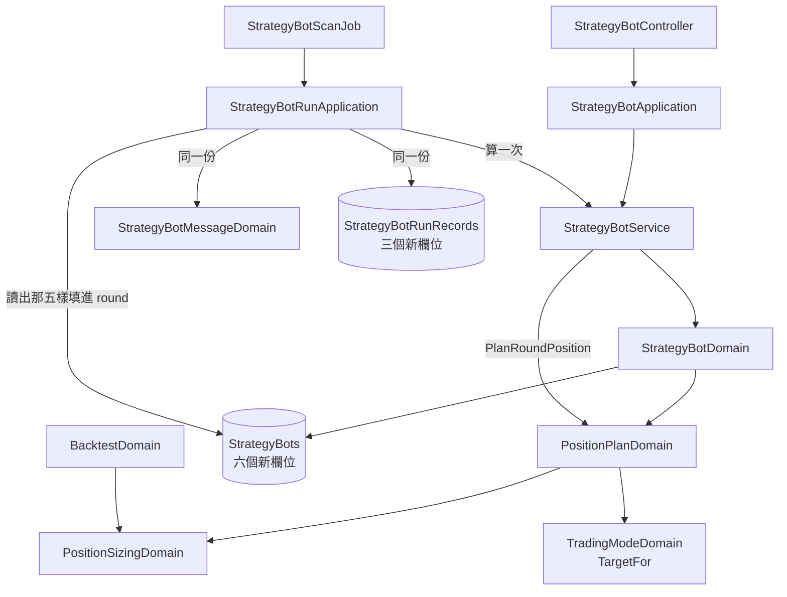

# 策略機器人的部位規劃 — Architecture Design

**Status:** Confirmed
**Source PRD:** `.sdd/2026-09-18-strategy-bot-position-plan/PRD.md`
**Tech context:** Go · Clean / Onion Architecture · Gin · GORM（code-first）· PostgreSQL

---

## 1. Design Goal & Guiding Principle

**In one sentence：** 把「每一輪都要重算一遍的那四個乘法」搬進一個模型裡，
而那個模型**掛在目標倉位上**——不是掛在信號上。

**Guiding principle：** 「這一輪要不要開倉、往哪一邊開」**已經有一個答案了**。

`TradingModeDomain.TargetFor(signal)`（回測那一刀寫的）回四個值：
**持多、持空、空手、不變**。部位規劃要問的每一件事都在那四個值裡：

| 目標倉位 | 有部位規劃嗎 | 止損在哪一邊 |
| :--- | :--- | :--- |
| 持多 | 有 | **下面** |
| 持空 | 有 | **上面** |
| 空手（現貨的賣出） | 沒有——那是出清 | — |
| 不變（持有） | 沒有 | — |

改掛在信號上，就得在這裡重寫一次「現貨的賣出是出清」，
而那句話已經有家了。那個家也已經被 `BacktestAccountDomain` 用過一次——
這一刀是它的第二個提問者，而**第二個提問者不該帶來第二套答案**。

**第二個原則：算一次。** 那幾個數字有兩個去處（訊息、執行紀錄）。
算兩次就是兩個答案，而它們會在使用者改設定的那一瞬間分岔。
所以 domain service 算完填回那一輪，訊息與紀錄讀同一份。

**為什麼不是給訊息開兩種寫法。** `.claude/rules/architecture.md` 明訂
「不為 Domain Model 定義介面」。而訊息那個模型上一刀才剛學會依交易模式分叉，
這一刀照同一個形狀再加一段——**有就印、沒有就不印**，沒有第二個實作。

---

## 2. Change Scope

| Area | Action | What / Why |
| :--- | :--- | :--- |
| `dto.PositionPlanSettingsDto` | **Add** | 那五樣旋鈕，照宣告原樣。**寫入、讀回、一輪三處共用同一個形狀**——三份會漂移 |
| `dto.PositionPlanDto` | **Add** | 算完的結果：保證金、名目、止損價、止盈價、會虧、會賺，以及「印不印」那幾個旗標 |
| `domains.PositionPlanDomain` | **Add** | 部位規劃的全部規則與那四個乘法。建構即驗證；**零值＝沒有部位規劃**，`PlanFor` 一律答「沒有」 |
| `domains.PositionSizingDomain` | **Modify** | 建構子的錯誤**改為只帶那句話**，不再自己包成回測的拒絕。與上一刀對 `TradingModeDomain` 做的一字不差 |
| `domains.BacktestDomain` | **Modify** | 收到那句話之後自己包成 `BacktestValidationFailure`。**對外措辭一字不差** |
| `entities.StrategyBot` | **Modify** | 多六欄（資金、押多少模式與數值、槓桿、停損距離、停利距離），`numeric(38,18) not null default 0`。**既有每一列因此自動讀作「沒有部位規劃」** |
| `domains.StrategyBotDomain` | **Modify** | 多持有一個 `PositionPlanDomain`，建構時驗證；拒絕包成 `ErrStrategyBotValidation` |
| `dto.StrategyBotWriteDto`／`StrategyBotDto` | **Modify** | 各多一個 `PositionPlanSettingsDto` |
| `models.StrategyBotRequest` | **Modify** | 多一個 `positionPlan` JSON 物件 |
| `persistence.StrategyBotRepository` | **Modify** | 改寫的欄位清單多那六欄 |
| `entities.StrategyBotRunRecord` | **Modify** | 多三欄（開倉金額、止損價、止盈價），`decimal.NullDecimal`——空的就是那一輪沒有建議部位 |
| `interface.IStrategyBotRunRecordRepository`／其實作 | **Modify** | `Append` 多收那三個值 |
| `dto.StrategyBotRoundDto` | **Modify** | 多一個 `PositionPlanSettingsDto`（進來的）與一個 `PositionPlanDto`＋`HasPositionPlan`（算完的） |
| `service.StrategyBotService` | **Modify** | 多一個 `PlanRoundPosition(round) round`——**算一次的那一次** |
| `domains.StrategyBotMessageDomain` | **Modify** | 多一段「建議部位」。有就印、沒有就不印；**沒有那一段時逐字等於這一刀之前** |
| `application.StrategyBotRunApplication` | **Modify** | 組 round 時多抄那五樣；呼叫 `PlanRoundPosition` 一次；把算完的三個數字交給紀錄 |
| `domains.TradingModeDomain` | **Not touched** | `TargetFor` 已經答得出這一刀要的每一件事 |
| `domains.BacktestAccountDomain`／`BacktestSimulationDomain` | **Not touched** | 回測一行不改。它仍然不計止損止盈——**而訊息要自己承認這件事** |
| `entities.TradingStrategy` | **Not touched** | 部位規劃不是規則 |
| 助手的每一件能力 | **Not touched** | 助手沒有任何機器人操作（`cmd/server/assistant_queries_test.go` 守著那條界線） |

---

## 3. New Classes / Modules

| Name | Kind | Responsibility (purpose) | Collaborators | Satisfies |
| :--- | :--- | :--- | :--- | :--- |
| `dto.PositionPlanSettingsDto` | DTO | 那五樣旋鈕的形狀，寫入／讀回／一輪三處共用 | — | US-01 |
| `dto.PositionPlanDto` | DTO | 算完的六個數字，加上「這幾行印不印」 | — | US-02、US-06 |
| `domains.PositionPlanDomain` | Domain Model | 部位規劃的全部規則與那四個乘法 | `PositionSizingDomain`、`vo.TargetPositionVo` | US-01～US-03 |

### `PositionPlanDomain` 的形狀

```go
// 建構即驗證。沒有部位資金就是「沒有部位規劃」——回零值，不回錯誤：
// 沒填不是填錯。
func NewPositionPlanDomain(settings dto.PositionPlanSettingsDto) (PositionPlanDomain, error)

// 這一輪的建議部位，以及到底有沒有建議。
//
// 對外只有一個問題。呼叫端不必先問「有沒有設定」再問「這一輪要不要開倉」
// 再問「讀得到價嗎」——那三個問題只能一起回答，而分開問正是讓條件在別處長出 if 的路。
func (positionPlanDomain PositionPlanDomain) PlanFor(
    target vo.TargetPositionVo, referencePrice decimal.Decimal, hasReference bool,
) (dto.PositionPlanDto, bool)
```

> **深度檢查。** `PlanFor` 回「沒有」的四個理由——沒填資金、目標是空手、
> 目標是不變、讀不到價——**全部收在這一個答案裡**。
> 呼叫端只知道「有沒有建議部位」，不知道有四種沒有。
> 加第五種理由（例如「這個交易標的暫停交易」）是在這個模型內多一個 early return。

### 那六個數字算在哪裡

```
保證金   := 倉位大小模式.StakeFor(部位資金)        ← 沿用回測既有的模型，不重寫
名目部位 := 保證金 × 槓桿倍數                      ← 槓桿為 1 時等於保證金，且不印
止損價   := 持多 ? 價×(1−停損%) : 價×(1+停損%)
止盈價   := 持多 ? 價×(1+停利%) : 價×(1−停利%)
會虧多少 := 名目部位 × 停損%
會賺多少 := 名目部位 × 停利%
```

**`StakeFor` 的第二個回傳值就是「押得下去嗎」**，而回測那邊早就把它當成
「這一次開倉跳過，不是錯誤」在用。這裡讀作「部位資金不足」——
同一個事實，兩種說法都不是錯誤。

**每一個都是精確小數。** 停損距離與槓桿都乘進金額，所以它們在 entity 上
也是 `numeric(38,18)` 而不是浮點數——止損價是一個要拿去掛單的價格，
在第十位上飄掉的那一版看起來完全正常。

---

## 4. Modified Components

| Component | Current role | Change needed |
| :--- | :--- | :--- |
| `PositionSizingDomain` | 一次開倉押多少的全部規則 | 建構子的錯誤只帶那句話。**與上一刀對 `TradingModeDomain` 做的完全相同**——它現在也有兩個提問者了 |
| `StrategyBotDomain` | 一台機器人的全部不變量 | 多持有一個 `PositionPlanDomain`。驗證位置放在**觸發間隔之後、交易策略識別碼之前**：它與間隔同屬「這台機器怎麼運轉」，而交易策略是「它聽誰的」 |
| `StrategyBotService` | 機器人的編排 | 多一個 `PlanRoundPosition`。**算一次的那一次**，訊息與紀錄讀同一份 |
| `StrategyBotMessageDomain` | 把一輪寫成一則訊息 | 多一段。位置在交易模式那一行之後、「各來源怎麼說」之前：先講**要做什麼**、再講**證據** |
| `StrategyBotRunRecord` | 一輪的歷史：第幾輪、什麼時候、結果 | 多三欄，可為空。**它的註解要改**——那句「一輪的完整內容還沒有人問」現在有人問了 |
| `StrategyBotRunApplication` | 跑一輪 | 多抄五樣、呼叫 `PlanRoundPosition` 一次、把三個數字交給紀錄 |

### 訊息多出來的那一段

```
📐 建議部位（這個系統不下單）
　・保證金 5000（部位資金 50000 的 10%）
　・槓桿 3 倍 → 名目 15000            ← 槓桿為 1 時整行不印
　・止損 66105.915（往上 3%，虧 450）  ← 沒填停損時整行不印
　・止盈 60971.475（往下 5%，賺 750）  ← 沒填停利時整行不印
　⚠️ 回測沒有把止損止盈算進去
```

**「往上」「往下」是寫出來的，不是留給讀者推的。** 做空的止損在上面，
而 66105 在做空那一輪讀起來一樣像個價格——這一刀唯一一個寫錯了完全看不出來的地方，
所以方向那兩個字必須在字面上。

**那一行警告由 PRD US-05 釘住**，不是文案。回測到今天為止一概不計止損止盈，
而那是這一刀唯一一個使用者不可能自己發現的落差。

**沒有建議部位時整段不印**，於是那一則訊息**逐字等於這一刀之前**——
US-04 因此不是一個要另外維護的相容性承諾，而是這個形狀的必然結果。

---

## 5. Component Relationships



**兩個提問者、一個答案的所在地。** 押多少的規則被回測與部位規劃共用；
目標倉位的規則被回測的帳戶與部位規劃共用。
兩處都**沒有第二份**——這一刀新增的只是提問的人。

---

## 6. Traceability

| PRD Scenario | Component |
| :--- | :--- |
| 填完整一組 | `models.StrategyBotRequest` → `PositionPlanSettingsDto` → `NewPositionPlanDomain` → 六個欄位 |
| 整組都不填／只填部位資金 | `NewPositionPlanDomain`（資金非正 → 零值，不回錯誤）；押多少沒填即全押由 `NewPositionSizingDomain` 答（未改動） |
| 百分比超過一百／固定金額為零／押多少認不得 | `NewPositionSizingDomain`（**未改動的三條規則**）→ `StrategyBotDomain` 包成 `ErrStrategyBotValidation` |
| 槓桿小於一倍 | `NewPositionPlanDomain` |
| 停損距離為負／超過一百 | `NewPositionPlanDomain` |
| 這一刀之前就存在的機器人 | `entities.StrategyBot` 六欄的 `default:0` |
| 正在跑時改不動 | 機器人既有的修改關卡（未改動） |
| 做多那一輪的四個數字 | `PositionPlanDomain.PlanFor`（目標為持多那一條路） |
| 做空那一輪，止損在上面 | 同上（目標為持空那一條路） |
| 會虧／會賺算的是名目 | `PlanFor` 的最後兩個乘法 |
| 不上槓桿 | `PlanFor`（槓桿為 1 → `Leveraged` 為假 → 訊息整行不印） |
| 固定金額就是那個數字／部位資金不夠 | `PositionSizingDomain.StakeFor`（**未改動**）的兩個回傳值 |
| 只填停損／只填停利 | `PlanFor` 的 `HasStopLoss`／`HasTakeProfit` |
| 現貨的買入要開倉／現貨的賣出是出清 | `TradingModeDomain.TargetFor`（未改動）→ `PlanFor` 的目標分支 |
| 多空反手的賣出要開空倉 | 同上 |
| 讀不到參考價 | `PlanFor` 的 `hasReference` 分支 |
| 交易模式讀不出來 | `TradingModeDomain` 零值 → `TargetFor` 回「不變」→ `PlanFor` 答沒有 |
| 沒有部位規劃的機器人訊息逐字不變 | `StrategyBotMessageDomain` 的「整段不印」那條路 |
| 講出這個系統不下單／回測沒算進去 | `StrategyBotMessageDomain` 那一段的兩行 |
| 有／沒有建議部位的那一輪的執行紀錄 | `StrategyBotRunRecord` 三個 `NullDecimal` |

---

## 7. Extensibility & Handoff Notes

- **Most likely next requirement：讓回測也模擬止損止盈。**
  **Where it lands：** `BacktestAccountDomain` 逐棒多問一次「這一棒的高低點碰到那兩個價位了嗎」。
  **它會改掉每一張既有成績單的數字**，所以那一刀要自己決定怎麼交代那件事。
  做完之後，訊息裡那一行警告就可以拿掉——**而那一行是不是還在，是那一刀有沒有做完的判準**。

- **第二可能：停損距離由策略腳本算（ATR）。**
  **Where it lands：** 一種新的算式產出種類。一支信號型腳本現在**直接回傳
  `indicator.Signal` 這個型別**（`indicator_script_shape.go:81`），不是回一包 key-value，
  所以它沒辦法順便多吐兩個欄位。還要回答「一份交易策略有好幾個信號來源，誰的止損算」。
  **落點在 `PositionPlanDomain` 的停損距離那一格**——把它從「一個固定百分比」
  換成「一個算出來的距離」，`PlanFor` 之後的每一行都不必動。

- **第三可能：追蹤部位、加倉、移動停損。**
  **Where it lands：** 一個新概念（「現在持有什麼」），而**這個系統現在完全沒有它**。
  不要把它塞進部位規劃——部位規劃答的是「若現在開，建議這麼大」，
  而那個問題不需要知道他實際開了沒有。

- **給下一位的提醒：** `PlanFor` 回「沒有建議部位」有**四個不同的理由**
  （沒填資金、目標是空手、目標是不變、讀不到價），而它們**故意合成一個答案**。
  想在訊息上分別講出那四種之前先想清楚：前兩種對讀訊息的人來說是同一件事
  （「這一輪沒有東西要押」），而把它們拆開會讓那一段長出四種寫法。

---

## 8. Appendix

- `.sdd/2026-09-18-strategy-bot-position-plan/PRD.md`
- `.sdd/2026-09-17-backtest-trading-mode/ARCH.md`——`TargetFor` 與目標倉位四個值的出處
- `.sdd/2026-09-05-strategy-script-backtest/ARCH.md`——`PositionSizingDomain` 的出處
- `.sdd/2026-09-18-trading-strategy-trading-mode/ARCH.md`——訊息依交易模式分叉的形狀，這一刀照它再加一段
- `.claude/rules/architecture.md`——「Domain Model 不是介面抽象」、「行為住在它操作的資料旁邊」
